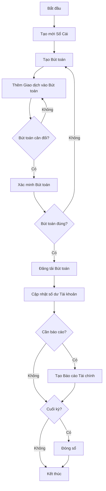
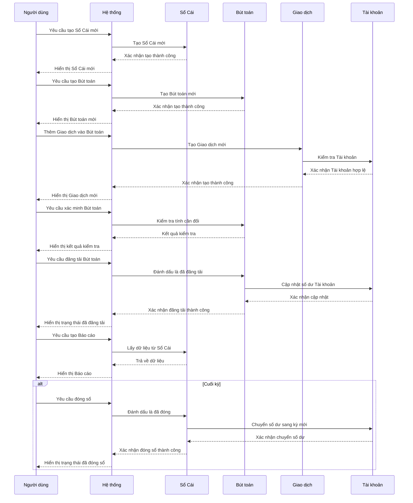
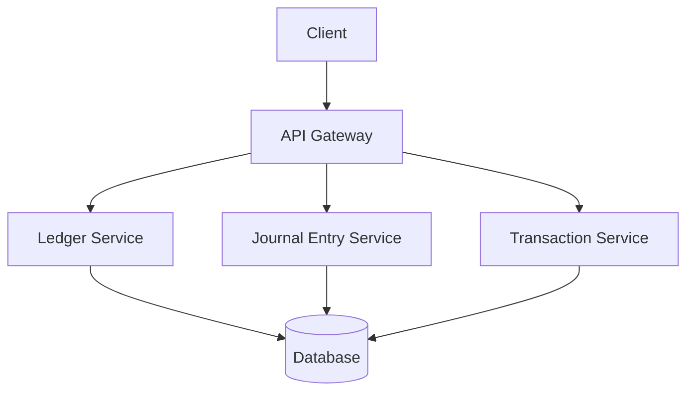
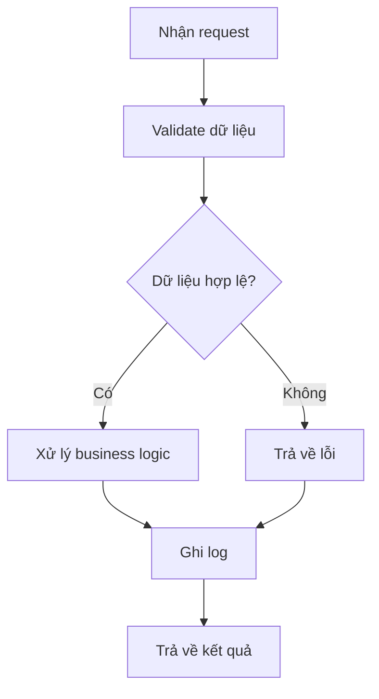
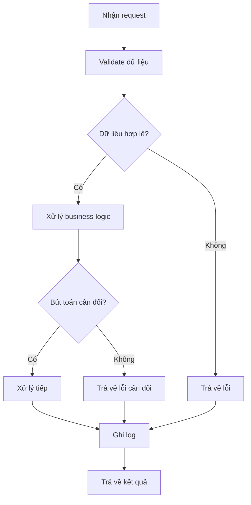
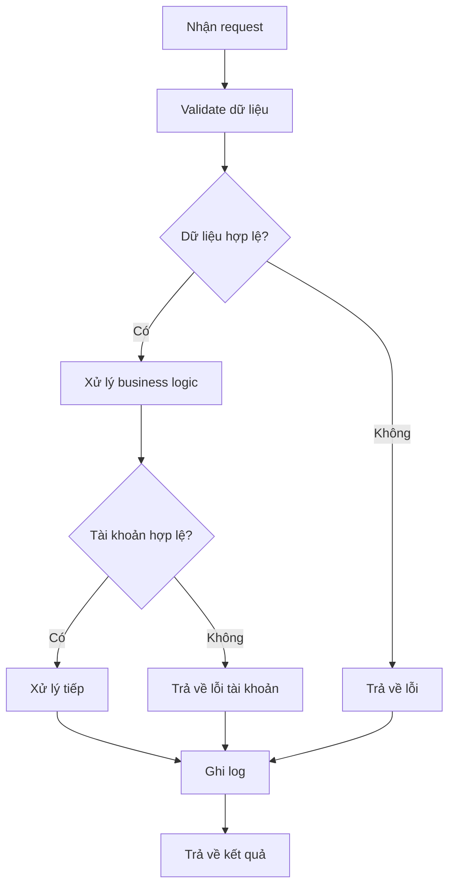
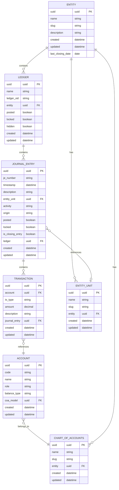

# ACC_002_Sổ Cái

*Phiên bản: 1.0*  
*Người tạo: AI Assistant*  
*Ngày tạo: 25/07/2024*  
*Cập nhật lần cuối: 25/07/2024*  
*Người cập nhật: AI Assistant*

## 1. Tổng Quan Nghiệp Vụ

### 1.1. Mô Tả Nghiệp Vụ
Sổ Cái (General Ledger) là một thành phần cốt lõi của hệ thống kế toán, nơi tất cả các giao dịch tài chính được ghi lại, tổng hợp và phân loại. Sổ Cái chứa tất cả các tài khoản của doanh nghiệp và các bút toán ghi nhận vào các tài khoản đó. Hệ thống Sổ Cái trong phần mềm ERP cung cấp một cách tiếp cận có cấu trúc để quản lý dữ liệu tài chính, tạo điều kiện cho việc lập báo cáo tài chính chính xác và kịp thời.

Trong Django Ledger, Sổ Cái được thể hiện thông qua mô hình LedgerModel - là trung tâm của hệ thống kế toán. Mỗi LedgerModel là một đơn vị kế toán độc lập, triển khai hệ thống kế toán kép có khả năng tạo và quản lý các giao dịch vào sổ cái và tạo ra bất kỳ báo cáo tài chính nào.

### 1.2. Phạm Vi Áp Dụng
Quy trình quản lý Sổ Cái áp dụng cho:
- Nhân viên kế toán: những người có trách nhiệm ghi chép, phê duyệt và kiểm tra các bút toán kế toán.
- Quản lý tài chính: những người cần xem xét và phân tích dữ liệu tài chính và báo cáo từ Sổ Cái.
- Kiểm toán viên: những người cần xác minh tính chính xác và tính tuân thủ của các bút toán kế toán.
- Bất kỳ người dùng nào được ủy quyền truy cập vào hệ thống kế toán để thực hiện các chức năng liên quan đến Sổ Cái.

### 1.3. Định Nghĩa Thuật Ngữ
| Thuật ngữ | Định nghĩa |
|-----------|------------|
| Ledger (Sổ Cái) | Một tập hợp có tổ chức các bút toán và tài khoản kế toán, được sử dụng để ghi lại và tổng hợp tất cả các giao dịch tài chính của một đơn vị. |
| Journal Entry (Bút toán kế toán) | Một bản ghi ghi lại một giao dịch tài chính, bao gồm các ghi có và ghi nợ vào các tài khoản cụ thể để giữ cho sổ sách cân bằng. |
| Transaction (Giao dịch) | Một hoạt động kinh tế đơn lẻ được ghi lại trong sổ sách kế toán thông qua các ghi có và ghi nợ. |
| Debit (Ghi nợ) | Một loại ghi chép kế toán làm tăng tài sản và chi phí, và làm giảm nợ phải trả, vốn chủ sở hữu và doanh thu. |
| Credit (Ghi có) | Một loại ghi chép kế toán làm tăng nợ phải trả, vốn chủ sở hữu và doanh thu, và làm giảm tài sản và chi phí. |
| Posted (Đã khóa sổ) | Trạng thái của một bút toán khi nó đã được xác nhận và ảnh hưởng đến số dư tài khoản. |
| Locked (Đã khóa) | Trạng thái của một bút toán hoặc sổ cái khi nó không thể được sửa đổi. |
| Entity (Đơn vị) | Một tổ chức hoặc doanh nghiệp mà các giao dịch tài chính được ghi lại cho. |
| Chart of Accounts (Sơ đồ tài khoản) | Một danh sách có tổ chức của tất cả các tài khoản được sử dụng bởi một đơn vị để ghi lại các giao dịch tài chính. |

### 1.4. Tài Liệu Liên Quan

| STT | Mã tài liệu | Tên tài liệu | Mô tả |
|-----|-------------|--------------|-------|
| 1   | ACC_001 | Sơ Đồ Tài Khoản | Quy trình thiết lập và quản lý hệ thống tài khoản kế toán |
| 2   | ACC_003 | Bút Toán Kế Toán | Quy trình tạo và quản lý các bút toán |
| 3   | ACC_004 | Đóng Sổ Kế Toán | Quy trình đóng sổ kế toán cuối kỳ |
| 4   | ACC_005 | Báo Cáo Tài Chính | Quy trình tạo và xuất báo cáo tài chính |

## 2. Quy Trình Nghiệp Vụ

### 2.1. Tổng Quan Quy Trình
Quy trình quản lý Sổ Cái bao gồm việc tạo, cập nhật, đăng tải và khóa các bút toán kế toán. Quy trình này đảm bảo rằng tất cả các giao dịch tài chính đều được ghi lại chính xác và đầy đủ trong hệ thống kế toán. Các bút toán được tạo để ghi lại các giao dịch tài chính, sau đó được xác minh và đăng tải vào Sổ Cái để cập nhật số dư tài khoản. Định kỳ, các báo cáo được tạo từ Sổ Cái để phân tích và báo cáo tài chính.

### 2.2. Sơ Đồ Quy Trình (Business Flow)

### 2.3. Chi Tiết Các Bước Quy Trình

#### 2.3.1. Tạo mới Sổ Cái
- **Mô tả**: Tạo mới một Sổ Cái cho một đơn vị hoặc mục đích cụ thể.
- **Đầu vào**: Thông tin đơn vị, tên Sổ Cái, mô tả.
- **Đầu ra**: Một Sổ Cái mới được tạo trong hệ thống.
- **Người thực hiện**: Quản trị viên kế toán.
- **Điều kiện tiên quyết**: Đơn vị đã được tạo trong hệ thống.
- **Xử lý ngoại lệ**: Nếu thông tin không hợp lệ, hiển thị thông báo lỗi và yêu cầu cung cấp thông tin hợp lệ.

#### 2.3.2. Tạo Bút toán
- **Mô tả**: Tạo một bút toán mới để ghi lại một giao dịch tài chính.
- **Đầu vào**: Ngày giao dịch, mô tả, Sổ Cái liên quan, đơn vị liên quan.
- **Đầu ra**: Một bút toán mới được tạo trong Sổ Cái.
- **Người thực hiện**: Nhân viên kế toán.
- **Điều kiện tiên quyết**: Sổ Cái đã tồn tại và chưa bị khóa.
- **Xử lý ngoại lệ**: Nếu Sổ Cái bị khóa, hiển thị thông báo lỗi và không cho phép tạo bút toán.

#### 2.3.3. Thêm Giao dịch vào Bút toán
- **Mô tả**: Thêm các giao dịch chi tiết (ghi nợ và ghi có) vào bút toán.
- **Đầu vào**: Tài khoản, loại giao dịch (ghi nợ/ghi có), số tiền, mô tả.
- **Đầu ra**: Giao dịch được thêm vào bút toán.
- **Người thực hiện**: Nhân viên kế toán.
- **Điều kiện tiên quyết**: Bút toán đã tồn tại và chưa bị đăng tải hoặc khóa.
- **Xử lý ngoại lệ**: Nếu tài khoản không hợp lệ hoặc bút toán đã bị đăng tải/khóa, hiển thị thông báo lỗi.

#### 2.3.4. Xác minh Bút toán
- **Mô tả**: Kiểm tra tính cân đối và hợp lệ của bút toán.
- **Đầu vào**: Bút toán cần xác minh.
- **Đầu ra**: Kết quả xác minh (hợp lệ/không hợp lệ).
- **Người thực hiện**: Nhân viên kế toán hoặc quản lý.
- **Điều kiện tiên quyết**: Bút toán đã có các giao dịch.
- **Xử lý ngoại lệ**: Nếu bút toán không cân đối, hiển thị thông báo lỗi và yêu cầu sửa đổi.

#### 2.3.5. Đăng tải Bút toán
- **Mô tả**: Xác nhận bút toán và cập nhật số dư tài khoản.
- **Đầu vào**: Bút toán đã xác minh.
- **Đầu ra**: Bút toán được đánh dấu là đã đăng tải, số dư tài khoản được cập nhật.
- **Người thực hiện**: Người quản lý kế toán hoặc người được ủy quyền.
- **Điều kiện tiên quyết**: Bút toán đã được xác minh và cân đối.
- **Xử lý ngoại lệ**: Nếu bút toán không thể đăng tải (ví dụ: do xung đột hoặc Sổ Cái bị khóa), hiển thị thông báo lỗi.

#### 2.3.6. Tạo Báo cáo Tài chính
- **Mô tả**: Tạo các báo cáo tài chính từ dữ liệu Sổ Cái.
- **Đầu vào**: Sổ Cái, loại báo cáo, khoảng thời gian.
- **Đầu ra**: Báo cáo tài chính (Bảng cân đối kế toán, Báo cáo kết quả hoạt động kinh doanh, Báo cáo lưu chuyển tiền tệ).
- **Người thực hiện**: Người quản lý kế toán hoặc người được ủy quyền.
- **Điều kiện tiên quyết**: Sổ Cái có dữ liệu hợp lệ cho khoảng thời gian báo cáo.
- **Xử lý ngoại lệ**: Nếu dữ liệu không đủ hoặc không hợp lệ, hiển thị thông báo cảnh báo.

#### 2.3.7. Đóng sổ
- **Mô tả**: Đóng Sổ Cái cho một kỳ kế toán và chuyển số dư sang kỳ tiếp theo.
- **Đầu vào**: Sổ Cái, ngày đóng sổ.
- **Đầu ra**: Sổ Cái được đánh dấu là đã đóng cho kỳ hiện tại, số dư được chuyển sang kỳ mới.
- **Người thực hiện**: Người quản lý kế toán.
- **Điều kiện tiên quyết**: Tất cả các bút toán cho kỳ đã được đăng tải, báo cáo tài chính đã được tạo và xác minh.
- **Xử lý ngoại lệ**: Nếu có bút toán chưa đăng tải hoặc sự không nhất quán, hiển thị cảnh báo và không cho phép đóng sổ.

### 2.4. Sơ Đồ Tuần Tự (Sequence Diagram)

### 2.5. Luồng Nghiệp Vụ Thay Thế
1. **Hủy đăng tải Bút toán**:
   - Khi phát hiện lỗi trong bút toán đã đăng tải, người dùng có thể hủy đăng tải nếu Sổ Cái chưa bị khóa.
   - Hệ thống sẽ hoàn tác các thay đổi về số dư tài khoản.
   - Người dùng có thể sửa đổi bút toán và đăng tải lại.

2. **Khóa Sổ Cái**:
   - Để ngăn chặn việc thay đổi dữ liệu lịch sử, người dùng có thể khóa Sổ Cái.
   - Khi Sổ Cái bị khóa, không thể thêm, sửa đổi hoặc xóa bất kỳ bút toán nào trong Sổ Cái.
   - Chỉ người dùng có quyền quản trị mới có thể mở khóa Sổ Cái nếu cần thiết.

3. **Đảo ngược Bút toán**:
   - Thay vì sửa đổi bút toán đã đăng tải, người dùng có thể tạo một bút toán đảo ngược để sửa lỗi.
   - Bút toán đảo ngược sẽ có các giao dịch ngược với bút toán gốc (đổi ghi nợ thành ghi có và ngược lại).
   - Sau đó, một bút toán mới có thể được tạo với thông tin chính xác.

## 3. Yêu Cầu Chức Năng

### 3.1. Danh Sách Chức Năng

| STT | Mã chức năng | Tên chức năng | Mô tả | Độ ưu tiên |
|-----|--------------|---------------|-------|------------|
| 1   | GL_001 | Quản lý Sổ Cái | Tạo, cập nhật, xem, xóa Sổ Cái | Cao |
| 2   | GL_002 | Quản lý Bút toán | Tạo, cập nhật, xem, xóa Bút toán | Cao |
| 3   | GL_003 | Quản lý Giao dịch | Thêm, sửa, xóa Giao dịch trong Bút toán | Cao |
| 4   | GL_004 | Đăng tải Bút toán | Đăng tải và hủy đăng tải Bút toán | Cao |
| 5   | GL_005 | Khóa/Mở khóa Sổ Cái | Khóa hoặc mở khóa Sổ Cái | Trung bình |
| 6   | GL_006 | Ẩn/Hiện Sổ Cái | Ẩn hoặc hiện Sổ Cái trong danh sách | Thấp |
| 7   | GL_007 | Xem lịch sử Bút toán | Xem lịch sử thay đổi của Bút toán | Trung bình |
| 8   | GL_008 | Tìm kiếm và lọc | Tìm kiếm và lọc Sổ Cái, Bút toán theo nhiều tiêu chí | Trung bình |
| 9   | GL_009 | Xuất dữ liệu | Xuất dữ liệu Sổ Cái ra các định dạng khác nhau | Thấp |

### 3.2. Chi Tiết Chức Năng

#### 3.2.1. GL_001: Quản lý Sổ Cái
- **Mô tả**: Cho phép người dùng tạo, cập nhật, xem và xóa Sổ Cái.
- **Đầu vào**: 
  - Tên Sổ Cái
  - Mã tham chiếu (ledger_xid)
  - Đơn vị liên quan
  - Mô tả (tùy chọn)
- **Đầu ra**: Sổ Cái được tạo, cập nhật, hiển thị hoặc xóa.
- **Điều kiện tiên quyết**: Người dùng có quyền quản lý Sổ Cái trong đơn vị.
- **Luồng xử lý chính**:
  1. Người dùng truy cập chức năng quản lý Sổ Cái.
  2. Người dùng chọn hành động (tạo mới, cập nhật, xem, xóa).
  3. Người dùng nhập thông tin cần thiết.
  4. Hệ thống xác thực thông tin.
  5. Hệ thống thực hiện hành động và hiển thị kết quả.
- **Luồng xử lý thay thế/ngoại lệ**:
  1. Nếu thông tin không hợp lệ, hiển thị thông báo lỗi và yêu cầu người dùng sửa đổi.
  2. Nếu người dùng không có quyền, hiển thị thông báo lỗi và từ chối hành động.
- **Giao diện liên quan**: Màn hình quản lý Sổ Cái, form tạo/cập nhật Sổ Cái.

#### 3.2.2. GL_002: Quản lý Bút toán
- **Mô tả**: Cho phép người dùng tạo, cập nhật, xem và xóa Bút toán trong Sổ Cái.
- **Đầu vào**: 
  - Sổ Cái liên quan
  - Mã bút toán (je_number - tự động tạo)
  - Ngày giao dịch (timestamp)
  - Mô tả
  - Đơn vị liên quan (tùy chọn)
  - Loại hoạt động (activity)
  - Nguồn gốc (origin - tùy chọn)
- **Đầu ra**: Bút toán được tạo, cập nhật, hiển thị hoặc xóa.
- **Điều kiện tiên quyết**: Sổ Cái tồn tại và chưa bị khóa.
- **Luồng xử lý chính**:
  1. Người dùng chọn Sổ Cái.
  2. Người dùng truy cập chức năng quản lý Bút toán.
  3. Người dùng chọn hành động (tạo mới, cập nhật, xem, xóa).
  4. Người dùng nhập thông tin cần thiết.
  5. Hệ thống xác thực thông tin.
  6. Hệ thống thực hiện hành động và hiển thị kết quả.
- **Luồng xử lý thay thế/ngoại lệ**:
  1. Nếu Sổ Cái bị khóa, hiển thị thông báo lỗi và từ chối hành động.
  2. Nếu thông tin không hợp lệ, hiển thị thông báo lỗi và yêu cầu người dùng sửa đổi.
- **Giao diện liên quan**: Màn hình quản lý Bút toán, form tạo/cập nhật Bút toán.

#### 3.2.3. GL_003: Quản lý Giao dịch
- **Mô tả**: Cho phép người dùng thêm, sửa và xóa các Giao dịch trong Bút toán.
- **Đầu vào**: 
  - Bút toán liên quan
  - Tài khoản
  - Loại giao dịch (ghi nợ/ghi có)
  - Số tiền
  - Mô tả (tùy chọn)
- **Đầu ra**: Giao dịch được thêm, sửa hoặc xóa trong Bút toán.
- **Điều kiện tiên quyết**: Bút toán tồn tại và chưa bị đăng tải hoặc khóa.
- **Luồng xử lý chính**:
  1. Người dùng chọn Bút toán.
  2. Người dùng truy cập chức năng quản lý Giao dịch.
  3. Người dùng chọn hành động (thêm, sửa, xóa).
  4. Người dùng nhập thông tin cần thiết.
  5. Hệ thống xác thực thông tin.
  6. Hệ thống thực hiện hành động và hiển thị kết quả.
- **Luồng xử lý thay thế/ngoại lệ**:
  1. Nếu Bút toán đã bị đăng tải hoặc khóa, hiển thị thông báo lỗi và từ chối hành động.
  2. Nếu Tài khoản không hợp lệ, hiển thị thông báo lỗi và yêu cầu người dùng chọn lại.
- **Giao diện liên quan**: Màn hình quản lý Giao dịch, form thêm/sửa Giao dịch.

#### 3.2.4. GL_004: Đăng tải Bút toán
- **Mô tả**: Cho phép người dùng đăng tải hoặc hủy đăng tải Bút toán.
- **Đầu vào**: Bút toán cần đăng tải/hủy đăng tải.
- **Đầu ra**: Trạng thái đăng tải của Bút toán được cập nhật, số dư Tài khoản được cập nhật tương ứng.
- **Điều kiện tiên quyết**: 
  - Đăng tải: Bút toán cân đối (tổng ghi nợ = tổng ghi có) và chưa bị đăng tải.
  - Hủy đăng tải: Bút toán đã được đăng tải và Sổ Cái chưa bị khóa.
- **Luồng xử lý chính**:
  1. Người dùng chọn Bút toán.
  2. Người dùng chọn hành động (đăng tải/hủy đăng tải).
  3. Hệ thống xác minh điều kiện tiên quyết.
  4. Hệ thống cập nhật trạng thái đăng tải và số dư Tài khoản.
  5. Hệ thống hiển thị kết quả.
- **Luồng xử lý thay thế/ngoại lệ**:
  1. Nếu Bút toán không cân đối, hiển thị thông báo lỗi và từ chối đăng tải.
  2. Nếu Sổ Cái bị khóa, hiển thị thông báo lỗi và từ chối hành động.
- **Giao diện liên quan**: Màn hình xem Bút toán, nút đăng tải/hủy đăng tải.

#### 3.2.5. GL_005: Khóa/Mở khóa Sổ Cái
- **Mô tả**: Cho phép người dùng khóa hoặc mở khóa Sổ Cái.
- **Đầu vào**: Sổ Cái cần khóa/mở khóa.
- **Đầu ra**: Trạng thái khóa của Sổ Cái được cập nhật.
- **Điều kiện tiên quyết**: 
  - Khóa: Sổ Cái đã được đăng tải (posted).
  - Mở khóa: Người dùng có quyền mở khóa Sổ Cái.
- **Luồng xử lý chính**:
  1. Người dùng chọn Sổ Cái.
  2. Người dùng chọn hành động (khóa/mở khóa).
  3. Hệ thống xác minh điều kiện tiên quyết.
  4. Hệ thống cập nhật trạng thái khóa của Sổ Cái.
  5. Hệ thống hiển thị kết quả.
- **Luồng xử lý thay thế/ngoại lệ**:
  1. Nếu Sổ Cái chưa được đăng tải, hiển thị thông báo lỗi và từ chối khóa.
  2. Nếu người dùng không có quyền mở khóa, hiển thị thông báo lỗi và từ chối mở khóa.
- **Giao diện liên quan**: Màn hình xem Sổ Cái, nút khóa/mở khóa.

## 4. Thiết Kế Kỹ Thuật

### 4.1. Kiến Trúc Hệ Thống

### 4.2. API Endpoints

#### 4.2.1. Quản lý Sổ Cái
- **Mô tả**: API để quản lý Sổ Cái
- **URL**: `GET /api/v1/entity/{entity_slug}/ledgers/` - Lấy danh sách Sổ Cái
- **URL**: `POST /api/v1/entity/{entity_slug}/ledgers/` - Tạo Sổ Cái mới
- **URL**: `GET /api/v1/entity/{entity_slug}/ledgers/{ledger_uuid}/` - Lấy thông tin Sổ Cái
- **URL**: `PUT /api/v1/entity/{entity_slug}/ledgers/{ledger_uuid}/` - Cập nhật Sổ Cái
- **URL**: `DELETE /api/v1/entity/{entity_slug}/ledgers/{ledger_uuid}/` - Xóa Sổ Cái
- **URL**: `PATCH /api/v1/entity/{entity_slug}/ledgers/{ledger_uuid}/toggle-lock/` - Khóa/Mở khóa Sổ Cái
- **URL**: `PATCH /api/v1/entity/{entity_slug}/ledgers/{ledger_uuid}/toggle-post/` - Đăng tải/Hủy đăng tải Sổ Cái

#### 4.2.2. Quản lý Bút toán
- **Mô tả**: API để quản lý Bút toán
- **URL**: `GET /api/v1/entity/{entity_slug}/ledgers/{ledger_uuid}/journal-entries/` - Lấy danh sách Bút toán
- **URL**: `POST /api/v1/entity/{entity_slug}/ledgers/{ledger_uuid}/journal-entries/` - Tạo Bút toán mới
- **URL**: `GET /api/v1/entity/{entity_slug}/ledgers/{ledger_uuid}/journal-entries/{je_uuid}/` - Lấy thông tin Bút toán
- **URL**: `PUT /api/v1/entity/{entity_slug}/ledgers/{ledger_uuid}/journal-entries/{je_uuid}/` - Cập nhật Bút toán
- **URL**: `DELETE /api/v1/entity/{entity_slug}/ledgers/{ledger_uuid}/journal-entries/{je_uuid}/` - Xóa Bút toán
- **URL**: `PATCH /api/v1/entity/{entity_slug}/ledgers/{ledger_uuid}/journal-entries/{je_uuid}/toggle-lock/` - Khóa/Mở khóa Bút toán
- **URL**: `PATCH /api/v1/entity/{entity_slug}/ledgers/{ledger_uuid}/journal-entries/{je_uuid}/toggle-post/` - Đăng tải/Hủy đăng tải Bút toán

#### 4.2.3. Quản lý Giao dịch
- **Mô tả**: API để quản lý Giao dịch
- **URL**: `GET /api/v1/entity/{entity_slug}/journal-entries/{je_uuid}/transactions/` - Lấy danh sách Giao dịch
- **URL**: `POST /api/v1/entity/{entity_slug}/journal-entries/{je_uuid}/transactions/` - Tạo Giao dịch mới
- **URL**: `GET /api/v1/entity/{entity_slug}/journal-entries/{je_uuid}/transactions/{tx_uuid}/` - Lấy thông tin Giao dịch
- **URL**: `PUT /api/v1/entity/{entity_slug}/journal-entries/{je_uuid}/transactions/{tx_uuid}/` - Cập nhật Giao dịch
- **URL**: `DELETE /api/v1/entity/{entity_slug}/journal-entries/{je_uuid}/transactions/{tx_uuid}/` - Xóa Giao dịch

### 4.3. Service Logic

#### 4.3.1. Ledger Service
- **Mô tả**: Service xử lý logic liên quan đến Sổ Cái
- **Chức năng chính**:
  1. Tạo và quản lý Sổ Cái
  2. Đăng tải và khóa Sổ Cái
  3. Kiểm tra trạng thái và tính hợp lệ của Sổ Cái
  4. Cung cấp dữ liệu cho báo cáo tài chính
- **Các dependencies**:
  1. Journal Entry Service
  2. Entity Service
  3. Chart of Accounts Service
- **Sơ đồ luồng xử lý**:

#### 4.3.2. Journal Entry Service
- **Mô tả**: Service xử lý logic liên quan đến Bút toán
- **Chức năng chính**:
  1. Tạo và quản lý Bút toán
  2. Xác minh tính cân đối của Bút toán
  3. Đăng tải và khóa Bút toán
  4. Xác định loại hoạt động của Bút toán (vận hành, đầu tư, tài chính)
- **Các dependencies**:
  1. Transaction Service
  2. Ledger Service
  3. Account Service
- **Sơ đồ luồng xử lý**:

#### 4.3.3. Transaction Service
- **Mô tả**: Service xử lý logic liên quan đến Giao dịch
- **Chức năng chính**:
  1. Tạo và quản lý Giao dịch
  2. Xác minh tính hợp lệ của Giao dịch
  3. Cập nhật số dư Tài khoản khi Bút toán được đăng tải
- **Các dependencies**:
  1. Journal Entry Service
  2. Account Service
- **Sơ đồ luồng xử lý**:

### 4.4. Mô Hình Dữ Liệu

#### 4.4.1. Entity Relationship Diagram (ERD)

#### 4.4.2. Chi Tiết Bảng Dữ Liệu

##### Bảng: LedgerModel
- **Mô tả**: Lưu trữ thông tin về Sổ Cái
- **Các trường chính**:
  - `uuid`: UUID - Khóa chính
  - `name`: CharField - Tên Sổ Cái
  - `ledger_xid`: SlugField - Mã tham chiếu
  - `entity`: ForeignKey - Liên kết với Entity
  - `posted`: BooleanField - Trạng thái đăng tải
  - `locked`: BooleanField - Trạng thái khóa
  - `hidden`: BooleanField - Trạng thái ẩn
  - `additional_info`: JSONField - Thông tin bổ sung
  - `created`: DateTimeField - Ngày tạo
  - `updated`: DateTimeField - Ngày cập nhật

##### Bảng: JournalEntryModel
- **Mô tả**: Lưu trữ thông tin về Bút toán
- **Các trường chính**:
  - `uuid`: UUID - Khóa chính
  - `je_number`: SlugField - Mã bút toán
  - `timestamp`: DateTimeField - Thời gian giao dịch
  - `description`: CharField - Mô tả
  - `entity_unit`: ForeignKey - Liên kết với EntityUnit
  - `activity`: CharField - Loại hoạt động
  - `origin`: CharField - Nguồn gốc
  - `posted`: BooleanField - Trạng thái đăng tải
  - `locked`: BooleanField - Trạng thái khóa
  - `is_closing_entry`: BooleanField - Là bút toán đóng sổ
  - `ledger`: ForeignKey - Liên kết với Ledger
  - `created`: DateTimeField - Ngày tạo
  - `updated`: DateTimeField - Ngày cập nhật

##### Bảng: TransactionModel
- **Mô tả**: Lưu trữ thông tin về Giao dịch
- **Các trường chính**:
  - `uuid`: UUID - Khóa chính
  - `account`: ForeignKey - Liên kết với Account
  - `tx_type`: CharField - Loại giao dịch (ghi nợ/ghi có)
  - `amount`: DecimalField - Số tiền
  - `description`: CharField - Mô tả
  - `journal_entry`: ForeignKey - Liên kết với JournalEntry
  - `created`: DateTimeField - Ngày tạo
  - `updated`: DateTimeField - Ngày cập nhật

## 5. Kế Hoạch Kiểm Thử

### 5.1. Phạm Vi Kiểm Thử
Kiểm thử sẽ tập trung vào các chức năng chính của Sổ Cái, bao gồm:
- Tạo và quản lý Sổ Cái
- Tạo và quản lý Bút toán
- Thêm và quản lý Giao dịch
- Đăng tải và khóa Sổ Cái và Bút toán
- Xác minh tính cân đối của Bút toán
- Cập nhật số dư Tài khoản khi Bút toán được đăng tải

### 5.2. Kịch Bản Kiểm Thử

| STT | Mã kịch bản | Tên kịch bản | Mô tả | Điều kiện tiên quyết | Các bước | Kết quả mong đợi |
|-----|------------|--------------|-------|---------------------|----------|-----------------|
| 1   | GL_TEST_001 | Tạo Sổ Cái | Kiểm tra việc tạo Sổ Cái mới | Đơn vị đã tồn tại | 1. Truy cập chức năng quản lý Sổ Cái 2. Nhập thông tin Sổ Cái mới 3. Lưu Sổ Cái | Sổ Cái mới được tạo thành công |
| 2   | GL_TEST_002 | Tạo Bút toán | Kiểm tra việc tạo Bút toán mới | Sổ Cái đã tồn tại và chưa bị khóa | 1. Chọn Sổ Cái 2. Truy cập chức năng quản lý Bút toán 3. Nhập thông tin Bút toán mới 4. Lưu Bút toán | Bút toán mới được tạo thành công |
| 3   | GL_TEST_003 | Thêm Giao dịch | Kiểm tra việc thêm Giao dịch vào Bút toán | Bút toán đã tồn tại và chưa bị đăng tải | 1. Chọn Bút toán 2. Truy cập chức năng quản lý Giao dịch 3. Nhập thông tin Giao dịch mới 4. Lưu Giao dịch | Giao dịch mới được thêm thành công |
| 4   | GL_TEST_004 | Xác minh tính cân đối | Kiểm tra việc xác minh tính cân đối của Bút toán | Bút toán có các Giao dịch | 1. Chọn Bút toán 2. Thực hiện xác minh tính cân đối | Hệ thống hiển thị kết quả xác minh chính xác |
| 5   | GL_TEST_005 | Đăng tải Bút toán | Kiểm tra việc đăng tải Bút toán | Bút toán cân đối và chưa bị đăng tải | 1. Chọn Bút toán 2. Thực hiện đăng tải Bút toán | Bút toán được đăng tải thành công và số dư Tài khoản được cập nhật |
| 6   | GL_TEST_006 | Khóa Sổ Cái | Kiểm tra việc khóa Sổ Cái | Sổ Cái đã được đăng tải | 1. Chọn Sổ Cái 2. Thực hiện khóa Sổ Cái | Sổ Cái được khóa thành công |
| 7   | GL_TEST_007 | Hủy đăng tải Bút toán | Kiểm tra việc hủy đăng tải Bút toán | Bút toán đã được đăng tải và Sổ Cái chưa bị khóa | 1. Chọn Bút toán 2. Thực hiện hủy đăng tải Bút toán | Bút toán được hủy đăng tải thành công và số dư Tài khoản được hoàn tác |
| 8   | GL_TEST_008 | Tạo báo cáo từ Sổ Cái | Kiểm tra việc tạo báo cáo tài chính từ Sổ Cái | Sổ Cái có dữ liệu | 1. Chọn Sổ Cái 2. Chọn loại báo cáo 3. Nhập khoảng thời gian 4. Tạo báo cáo | Báo cáo được tạo chính xác với dữ liệu từ Sổ Cái |

## 6. Phụ Lục

### 6.1. Danh Sách Tài Liệu Tham Khảo
- Django Ledger Documentation
- Accounting Principles - Weygandt, Kieso, Kimmel
- Django Framework Documentation
- Python Documentation

### 6.2. Danh Mục Thuật Ngữ
- **Sổ Cái (Ledger)**: Sổ kế toán chứa tất cả các tài khoản và giao dịch tài chính của một đơn vị.
- **Bút toán (Journal Entry)**: Ghi chép về một giao dịch tài chính, bao gồm các ghi có và ghi nợ.
- **Giao dịch (Transaction)**: Một hoạt động kinh tế đơn lẻ được ghi lại trong sổ sách kế toán.
- **Ghi nợ (Debit)**: Một loại ghi chép kế toán làm tăng tài sản và chi phí, và làm giảm nợ phải trả, vốn chủ sở hữu và doanh thu.
- **Ghi có (Credit)**: Một loại ghi chép kế toán làm tăng nợ phải trả, vốn chủ sở hữu và doanh thu, và làm giảm tài sản và chi phí.
- **Đăng tải (Post)**: Quá trình xác nhận một bút toán và cập nhật số dư tài khoản.
- **Khóa (Lock)**: Trạng thái mà một sổ cái hoặc bút toán không thể được sửa đổi.
- **Đóng sổ (Close)**: Quá trình kết thúc một kỳ kế toán và chuyển số dư sang kỳ tiếp theo.

### 6.3. Lịch Sử Thay Đổi Tài Liệu

| Phiên bản | Ngày | Người thực hiện | Mô tả thay đổi |
|-----------|------|-----------------|---------------|
| 1.0 | 25/07/2024 | AI Assistant | Tạo tài liệu ban đầu |