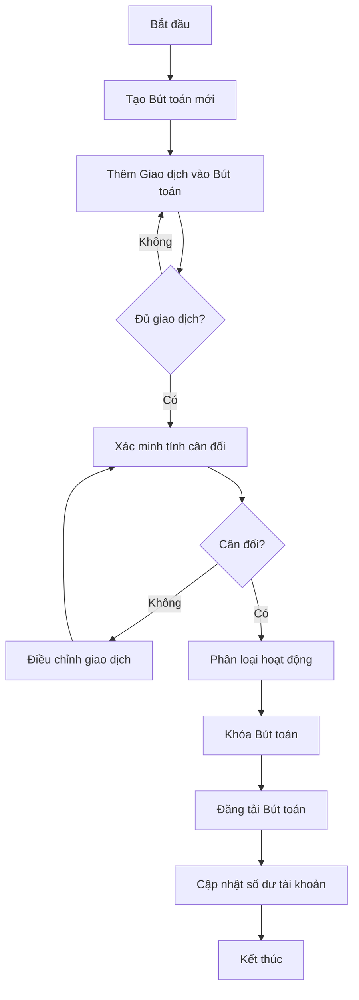
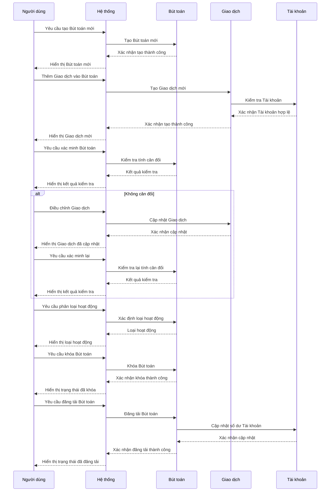
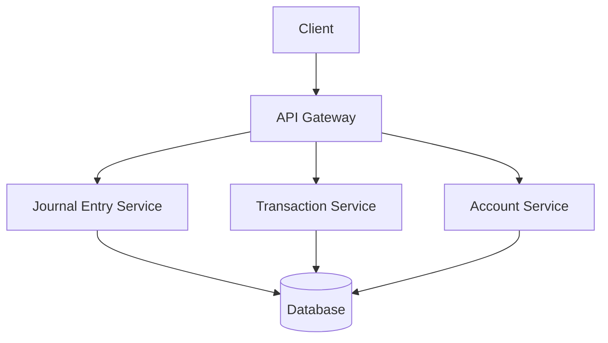
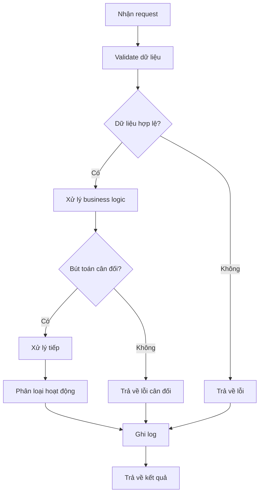
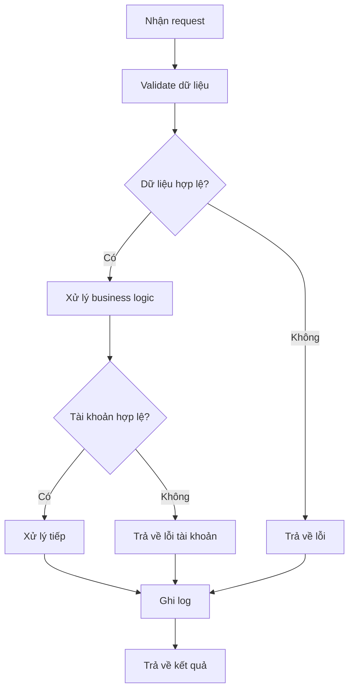
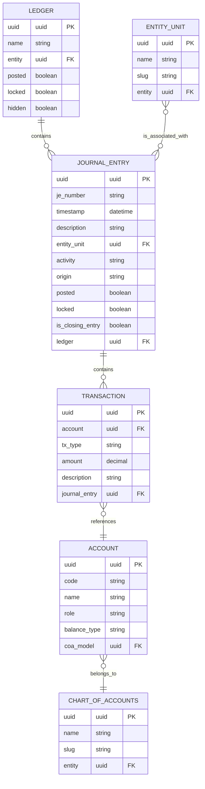

# ACC_003_Bút Toán Kế Toán

*Phiên bản: 1.0*  
*Người tạo: AI Assistant*  
*Ngày tạo: 25/07/2024*  
*Cập nhật lần cuối: 25/07/2024*  
*Người cập nhật: AI Assistant*

## 1. Tổng Quan Nghiệp Vụ

### 1.1. Mô Tả Nghiệp Vụ
Bút toán kế toán (Journal Entry) là nền tảng của hệ thống kế toán kép và dữ liệu tài chính của bất kỳ đơn vị nào. Bút toán kế toán là một bản ghi chứa một tập hợp các giao dịch tài chính, bao gồm ít nhất hai giao dịch. Mỗi giao dịch phải thực hiện một GHI NỢ hoặc một GHI CÓ vào một tài khoản. Mô hình Bút toán kế toán thực hiện việc xác thực bổ sung để đảm bảo rằng tổng GHI NỢ và tổng GHI CÓ bằng nhau để giữ cho sổ sách cân bằng.

Trong Django Ledger, Bút toán kế toán được thể hiện thông qua model JournalEntryModel, là thành phần cốt lõi trong hệ thống kế toán. Mặc định, bút toán sẽ ở trạng thái chưa đăng tải (unposted), nghĩa là đơn giản tạo một bút toán sẽ không có tác động đến sổ sách của đơn vị. Chỉ những bút toán nằm trong một Sổ Cái đã được đăng tải (posted LedgerModel) mới có tác động đến tài chính của đơn vị.

### 1.2. Phạm Vi Áp Dụng
Quy trình quản lý Bút toán kế toán áp dụng cho:
- Nhân viên kế toán: Những người có trách nhiệm tạo, xác minh và quản lý các bút toán kế toán hàng ngày.
- Quản lý tài chính: Những người cần xem xét và phê duyệt các bút toán kế toán quan trọng hoặc phức tạp.
- Kiểm toán viên: Những người cần kiểm tra tính chính xác và tính tuân thủ của các bút toán kế toán.
- Bất kỳ người dùng nào được ủy quyền truy cập vào hệ thống kế toán để tạo hoặc xem các bút toán kế toán.

### 1.3. Định Nghĩa Thuật Ngữ
| Thuật ngữ | Định nghĩa |
|-----------|------------|
| Journal Entry (Bút toán kế toán) | Bản ghi kế toán chứa các giao dịch ghi nợ và ghi có liên quan đến một sự kiện tài chính. |
| Transaction (Giao dịch) | Một phần riêng lẻ của bút toán kế toán, đại diện cho một ghi nợ hoặc ghi có vào một tài khoản cụ thể. |
| Debit (Ghi nợ) | Một loại giao dịch làm tăng tài sản và chi phí, và làm giảm nợ phải trả, vốn chủ sở hữu và doanh thu. |
| Credit (Ghi có) | Một loại giao dịch làm tăng nợ phải trả, vốn chủ sở hữu và doanh thu, và làm giảm tài sản và chi phí. |
| Posting (Đăng tải) | Quá trình xác nhận một bút toán kế toán để nó có hiệu lực đối với số dư tài khoản. |
| Locking (Khóa) | Trạng thái của một bút toán kế toán khi nó không thể được sửa đổi. |
| Verified (Xác minh) | Trạng thái của một bút toán kế toán khi nó đã được kiểm tra để đảm bảo tính cân đối. |
| Activity (Hoạt động) | Phân loại bút toán kế toán theo loại hoạt động (vận hành, đầu tư, tài chính). |

### 1.4. Tài Liệu Liên Quan
| STT | Mã tài liệu | Tên tài liệu | Mô tả |
|-----|-------------|--------------|-------|
| 1   | ACC_001 | Sơ Đồ Tài Khoản | Quy trình thiết lập và quản lý hệ thống tài khoản kế toán |
| 2   | ACC_002 | Sổ Cái | Quy trình quản lý sổ cái và các bút toán kế toán |
| 3   | ACC_004 | Đóng Sổ Kế Toán | Quy trình đóng sổ kế toán cuối kỳ |
| 4   | ACC_005 | Báo Cáo Tài Chính | Quy trình tạo và xuất báo cáo tài chính |

## 2. Quy Trình Nghiệp Vụ

### 2.1. Tổng Quan Quy Trình
Quy trình quản lý Bút toán kế toán bao gồm việc tạo, xác minh, đăng tải và quản lý các bút toán kế toán. Mỗi bút toán kế toán phải có ít nhất hai giao dịch (một ghi nợ và một ghi có) và tổng ghi nợ phải bằng tổng ghi có để giữ cho sổ sách cân bằng. Bút toán có thể được tạo ở trạng thái chưa đăng tải, cho phép chỉnh sửa và xác minh trước khi được đăng tải để ảnh hưởng đến số dư tài khoản.

### 2.2. Sơ Đồ Quy Trình (Business Flow)

### 2.3. Chi Tiết Các Bước Quy Trình

#### 2.3.1. Tạo Bút toán mới
- **Mô tả**: Tạo một bút toán kế toán mới để ghi lại một sự kiện tài chính.
- **Đầu vào**: Ngày giao dịch, mô tả, Sổ Cái liên quan, đơn vị liên quan (nếu có).
- **Đầu ra**: Một bút toán kế toán mới được tạo trong hệ thống.
- **Người thực hiện**: Nhân viên kế toán.
- **Điều kiện tiên quyết**: Sổ Cái đã tồn tại và chưa bị khóa.
- **Xử lý ngoại lệ**: Nếu Sổ Cái bị khóa, hiển thị thông báo lỗi và không cho phép tạo bút toán.

#### 2.3.2. Thêm Giao dịch vào Bút toán
- **Mô tả**: Thêm các giao dịch (ghi nợ và ghi có) vào bút toán.
- **Đầu vào**: Tài khoản, loại giao dịch (ghi nợ/ghi có), số tiền, mô tả.
- **Đầu ra**: Giao dịch được thêm vào bút toán.
- **Người thực hiện**: Nhân viên kế toán.
- **Điều kiện tiên quyết**: Bút toán đã tồn tại và chưa bị khóa.
- **Xử lý ngoại lệ**: Nếu tài khoản không hợp lệ hoặc bút toán đã bị khóa, hiển thị thông báo lỗi.

#### 2.3.3. Xác minh tính cân đối
- **Mô tả**: Kiểm tra xem tổng ghi nợ có bằng tổng ghi có không.
- **Đầu vào**: Bút toán với các giao dịch đã được thêm.
- **Đầu ra**: Kết quả xác minh (cân đối/không cân đối).
- **Người thực hiện**: Hệ thống hoặc Nhân viên kế toán.
- **Điều kiện tiên quyết**: Bút toán có ít nhất hai giao dịch.
- **Xử lý ngoại lệ**: Nếu bút toán không cân đối, yêu cầu điều chỉnh.

#### 2.3.4. Phân loại hoạt động
- **Mô tả**: Xác định loại hoạt động của bút toán (vận hành, đầu tư, tài chính).
- **Đầu vào**: Bút toán đã xác minh với các giao dịch.
- **Đầu ra**: Bút toán được phân loại với một loại hoạt động cụ thể.
- **Người thực hiện**: Hệ thống hoặc Nhân viên kế toán.
- **Điều kiện tiên quyết**: Bút toán đã được xác minh là cân đối.
- **Xử lý ngoại lệ**: Nếu không thể xác định hoạt động duy nhất, hiển thị thông báo lỗi.

#### 2.3.5. Khóa Bút toán
- **Mô tả**: Khóa bút toán để ngăn chặn các thay đổi không mong muốn.
- **Đầu vào**: Bút toán đã xác minh và phân loại.
- **Đầu ra**: Bút toán ở trạng thái khóa.
- **Người thực hiện**: Nhân viên kế toán hoặc Quản lý tài chính.
- **Điều kiện tiên quyết**: Bút toán đã được xác minh và phân loại.
- **Xử lý ngoại lệ**: Nếu bút toán đã bị khóa hoặc đã được đăng tải, hiển thị thông báo lỗi.

#### 2.3.6. Đăng tải Bút toán
- **Mô tả**: Đăng tải bút toán để nó có hiệu lực đối với số dư tài khoản.
- **Đầu vào**: Bút toán đã khóa.
- **Đầu ra**: Bút toán ở trạng thái đã đăng tải.
- **Người thực hiện**: Quản lý tài chính hoặc người được ủy quyền.
- **Điều kiện tiên quyết**: Bút toán đã bị khóa và đã được xác minh.
- **Xử lý ngoại lệ**: Nếu bút toán không thể đăng tải, hiển thị thông báo lỗi.

#### 2.3.7. Cập nhật số dư tài khoản
- **Mô tả**: Cập nhật số dư của các tài khoản liên quan dựa trên các giao dịch trong bút toán.
- **Đầu vào**: Bút toán đã đăng tải.
- **Đầu ra**: Số dư tài khoản được cập nhật.
- **Người thực hiện**: Hệ thống.
- **Điều kiện tiên quyết**: Bút toán đã được đăng tải.
- **Xử lý ngoại lệ**: Nếu có lỗi trong quá trình cập nhật, ghi lại lỗi và thông báo cho người dùng.

### 2.4. Sơ Đồ Tuần Tự (Sequence Diagram)

### 2.5. Luồng Nghiệp Vụ Thay Thế
1. **Hủy đăng tải Bút toán**:
   - Khi phát hiện lỗi trong bút toán đã đăng tải, người dùng có thể hủy đăng tải nếu bút toán chưa bị khóa và không thuộc kỳ kế toán đã đóng.
   - Hệ thống sẽ hoàn tác các thay đổi về số dư tài khoản.
   - Người dùng có thể sửa đổi bút toán và đăng tải lại.

2. **Mở khóa Bút toán**:
   - Nếu cần sửa đổi bút toán đã khóa, người dùng có thể yêu cầu mở khóa.
   - Chỉ có thể mở khóa nếu bút toán chưa được đăng tải và không thuộc kỳ kế toán đã đóng.
   - Sau khi mở khóa, người dùng có thể chỉnh sửa bút toán và khóa lại.

3. **Xóa Bút toán**:
   - Người dùng có thể xóa bút toán nếu nó chưa bị khóa và chưa được đăng tải.
   - Hệ thống sẽ xóa tất cả các giao dịch liên quan đến bút toán.
   - Không thể khôi phục bút toán đã xóa, nên cần thận trọng khi thực hiện.

## 3. Yêu Cầu Chức Năng

### 3.1. Danh Sách Chức Năng

| STT | Mã chức năng | Tên chức năng | Mô tả | Độ ưu tiên |
|-----|--------------|---------------|-------|------------|
| 1   | JE_001 | Tạo Bút toán | Tạo bút toán kế toán mới | Cao |
| 2   | JE_002 | Thêm/Sửa Giao dịch | Thêm hoặc sửa giao dịch trong bút toán | Cao |
| 3   | JE_003 | Xác minh Bút toán | Kiểm tra tính cân đối của bút toán | Cao |
| 4   | JE_004 | Phân loại Hoạt động | Xác định loại hoạt động của bút toán | Trung bình |
| 5   | JE_005 | Khóa/Mở khóa Bút toán | Khóa hoặc mở khóa bút toán | Cao |
| 6   | JE_006 | Đăng tải/Hủy đăng tải Bút toán | Đăng tải hoặc hủy đăng tải bút toán | Cao |
| 7   | JE_007 | Xóa Bút toán | Xóa bút toán khỏi hệ thống | Thấp |
| 8   | JE_008 | Xem chi tiết Bút toán | Xem thông tin chi tiết về bút toán | Trung bình |
| 9   | JE_009 | Tìm kiếm/Lọc Bút toán | Tìm kiếm và lọc bút toán theo nhiều tiêu chí | Trung bình |

### 3.2. Chi Tiết Chức Năng

#### 3.2.1. JE_001: Tạo Bút toán
- **Mô tả**: Cho phép người dùng tạo một bút toán kế toán mới.
- **Đầu vào**: 
  - Sổ Cái liên quan
  - Ngày giao dịch (timestamp)
  - Mô tả (tùy chọn)
  - Đơn vị liên quan (tùy chọn)
- **Đầu ra**: Bút toán mới được tạo trong hệ thống.
- **Điều kiện tiên quyết**: Sổ Cái tồn tại và chưa bị khóa.
- **Luồng xử lý chính**:
  1. Người dùng truy cập chức năng tạo bút toán.
  2. Người dùng chọn Sổ Cái.
  3. Người dùng nhập các thông tin cần thiết.
  4. Hệ thống xác thực thông tin.
  5. Hệ thống tạo bút toán mới.
- **Luồng xử lý thay thế/ngoại lệ**:
  1. Nếu Sổ Cái bị khóa, hiển thị thông báo lỗi.
  2. Nếu thông tin không hợp lệ, hiển thị thông báo lỗi và yêu cầu nhập lại.
- **Giao diện liên quan**: Màn hình tạo bút toán.

#### 3.2.2. JE_002: Thêm/Sửa Giao dịch
- **Mô tả**: Cho phép người dùng thêm hoặc sửa giao dịch trong bút toán.
- **Đầu vào**: 
  - Bút toán liên quan
  - Tài khoản
  - Loại giao dịch (ghi nợ/ghi có)
  - Số tiền
  - Mô tả (tùy chọn)
- **Đầu ra**: Giao dịch được thêm hoặc cập nhật trong bút toán.
- **Điều kiện tiên quyết**: Bút toán tồn tại và chưa bị khóa.
- **Luồng xử lý chính**:
  1. Người dùng truy cập chi tiết bút toán.
  2. Người dùng thêm mới hoặc chọn giao dịch để sửa.
  3. Người dùng nhập/cập nhật thông tin giao dịch.
  4. Hệ thống xác thực thông tin.
  5. Hệ thống lưu giao dịch.
- **Luồng xử lý thay thế/ngoại lệ**:
  1. Nếu bút toán bị khóa, hiển thị thông báo lỗi.
  2. Nếu thông tin không hợp lệ, hiển thị thông báo lỗi và yêu cầu nhập lại.
- **Giao diện liên quan**: Màn hình chi tiết bút toán, form thêm/sửa giao dịch.

#### 3.2.3. JE_003: Xác minh Bút toán
- **Mô tả**: Kiểm tra tính cân đối và hợp lệ của bút toán.
- **Đầu vào**: Bút toán cần xác minh.
- **Đầu ra**: Kết quả xác minh (hợp lệ/không hợp lệ).
- **Điều kiện tiên quyết**: Bút toán có ít nhất hai giao dịch.
- **Luồng xử lý chính**:
  1. Người dùng yêu cầu xác minh bút toán.
  2. Hệ thống kiểm tra tính cân đối (tổng ghi nợ = tổng ghi có).
  3. Hệ thống kiểm tra tính hợp lệ của các tài khoản.
  4. Hệ thống hiển thị kết quả xác minh.
- **Luồng xử lý thay thế/ngoại lệ**:
  1. Nếu bút toán không cân đối, hiển thị thông báo lỗi với chi tiết về sự chênh lệch.
  2. Nếu các tài khoản không hợp lệ, hiển thị thông báo lỗi.
- **Giao diện liên quan**: Màn hình chi tiết bút toán, thông báo kết quả xác minh.

#### 3.2.4. JE_004: Phân loại Hoạt động
- **Mô tả**: Xác định loại hoạt động của bút toán (vận hành, đầu tư, tài chính).
- **Đầu vào**: Bút toán cần phân loại.
- **Đầu ra**: Bút toán được phân loại với một loại hoạt động cụ thể.
- **Điều kiện tiên quyết**: Bút toán đã được xác minh là cân đối.
- **Luồng xử lý chính**:
  1. Hệ thống phân tích các tài khoản và giao dịch trong bút toán.
  2. Hệ thống xác định loại hoạt động dựa trên vai trò của các tài khoản.
  3. Hệ thống cập nhật trường hoạt động của bút toán.
- **Luồng xử lý thay thế/ngoại lệ**:
  1. Nếu không thể xác định hoạt động duy nhất, hiển thị thông báo lỗi.
  2. Người dùng có thể chọn hoạt động thủ công nếu hệ thống không thể xác định.
- **Giao diện liên quan**: Màn hình chi tiết bút toán, dropdown chọn hoạt động.

#### 3.2.5. JE_005: Khóa/Mở khóa Bút toán
- **Mô tả**: Cho phép khóa hoặc mở khóa bút toán.
- **Đầu vào**: Bút toán cần khóa/mở khóa.
- **Đầu ra**: Bút toán với trạng thái khóa được cập nhật.
- **Điều kiện tiên quyết**: 
  - Khóa: Bút toán chưa bị khóa và Sổ Cái chưa bị khóa.
  - Mở khóa: Bút toán đã bị khóa, chưa được đăng tải, không thuộc kỳ kế toán đã đóng, và Sổ Cái chưa bị khóa.
- **Luồng xử lý chính**:
  1. Người dùng yêu cầu khóa/mở khóa bút toán.
  2. Hệ thống kiểm tra các điều kiện tiên quyết.
  3. Hệ thống cập nhật trạng thái khóa của bút toán.
  4. Hệ thống hiển thị kết quả.
- **Luồng xử lý thay thế/ngoại lệ**:
  1. Nếu không thỏa mãn điều kiện tiên quyết, hiển thị thông báo lỗi.
- **Giao diện liên quan**: Màn hình chi tiết bút toán, nút khóa/mở khóa.

#### 3.2.6. JE_006: Đăng tải/Hủy đăng tải Bút toán
- **Mô tả**: Cho phép đăng tải hoặc hủy đăng tải bút toán.
- **Đầu vào**: Bút toán cần đăng tải/hủy đăng tải.
- **Đầu ra**: Bút toán với trạng thái đăng tải được cập nhật.
- **Điều kiện tiên quyết**: 
  - Đăng tải: Bút toán đã bị khóa, đã được xác minh, và Sổ Cái chưa bị khóa.
  - Hủy đăng tải: Bút toán đã được đăng tải, không thuộc kỳ kế toán đã đóng, và Sổ Cái chưa bị khóa.
- **Luồng xử lý chính**:
  1. Người dùng yêu cầu đăng tải/hủy đăng tải bút toán.
  2. Hệ thống kiểm tra các điều kiện tiên quyết.
  3. Hệ thống cập nhật trạng thái đăng tải của bút toán.
  4. Hệ thống cập nhật số dư tài khoản liên quan.
  5. Hệ thống hiển thị kết quả.
- **Luồng xử lý thay thế/ngoại lệ**:
  1. Nếu không thỏa mãn điều kiện tiên quyết, hiển thị thông báo lỗi.
  2. Nếu có lỗi khi cập nhật số dư tài khoản, ghi lại lỗi và thông báo cho người dùng.
- **Giao diện liên quan**: Màn hình chi tiết bút toán, nút đăng tải/hủy đăng tải.

## 4. Thiết Kế Kỹ Thuật

### 4.1. Kiến Trúc Hệ Thống

### 4.2. API Endpoints

#### 4.2.1. Quản lý Bút toán kế toán
- **Mô tả**: API để quản lý Bút toán kế toán
- **URL**: `GET /api/v1/entity/{entity_slug}/ledgers/{ledger_pk}/journal-entries/` - Lấy danh sách Bút toán
- **URL**: `POST /api/v1/entity/{entity_slug}/ledgers/{ledger_pk}/journal-entries/` - Tạo Bút toán mới
- **URL**: `GET /api/v1/entity/{entity_slug}/ledgers/{ledger_pk}/journal-entries/{je_pk}/` - Lấy thông tin Bút toán
- **URL**: `PUT /api/v1/entity/{entity_slug}/ledgers/{ledger_pk}/journal-entries/{je_pk}/` - Cập nhật Bút toán
- **URL**: `DELETE /api/v1/entity/{entity_slug}/ledgers/{ledger_pk}/journal-entries/{je_pk}/` - Xóa Bút toán

#### 4.2.2. Quản lý Giao dịch
- **Mô tả**: API để quản lý Giao dịch trong Bút toán
- **URL**: `GET /api/v1/entity/{entity_slug}/ledgers/{ledger_pk}/journal-entries/{je_pk}/txs/` - Lấy danh sách Giao dịch
- **URL**: `POST /api/v1/entity/{entity_slug}/ledgers/{ledger_pk}/journal-entries/{je_pk}/txs/` - Thêm Giao dịch mới

#### 4.2.3. Thao tác với Bút toán
- **Mô tả**: API để thực hiện các thao tác với Bút toán
- **URL**: `PATCH /api/v1/entity/{entity_slug}/ledgers/{ledger_pk}/journal-entries/{je_pk}/lock/` - Khóa Bút toán
- **URL**: `PATCH /api/v1/entity/{entity_slug}/ledgers/{ledger_pk}/journal-entries/{je_pk}/unlock/` - Mở khóa Bút toán
- **URL**: `PATCH /api/v1/entity/{entity_slug}/ledgers/{ledger_pk}/journal-entries/{je_pk}/post/` - Đăng tải Bút toán
- **URL**: `PATCH /api/v1/entity/{entity_slug}/ledgers/{ledger_pk}/journal-entries/{je_pk}/unpost/` - Hủy đăng tải Bút toán

### 4.3. Service Logic

#### 4.3.1. Journal Entry Service
- **Mô tả**: Service xử lý logic liên quan đến Bút toán kế toán
- **Chức năng chính**:
  1. Tạo và quản lý Bút toán
  2. Xác minh tính cân đối của Bút toán
  3. Phân loại hoạt động của Bút toán
  4. Đăng tải và khóa Bút toán
- **Các dependencies**:
  1. Transaction Service
  2. Account Service
  3. Ledger Service
- **Sơ đồ luồng xử lý**:

#### 4.3.2. Transaction Service
- **Mô tả**: Service xử lý logic liên quan đến Giao dịch trong Bút toán
- **Chức năng chính**:
  1. Tạo và quản lý Giao dịch
  2. Xác minh tính hợp lệ của Giao dịch
  3. Cập nhật số dư Tài khoản khi Bút toán được đăng tải
- **Các dependencies**:
  1. Journal Entry Service
  2. Account Service
- **Sơ đồ luồng xử lý**:

### 4.4. Mô Hình Dữ Liệu

#### 4.4.1. Entity Relationship Diagram (ERD)

#### 4.4.2. Chi Tiết Bảng Dữ Liệu

##### Bảng: JournalEntryModel
- **Mô tả**: Lưu trữ thông tin về Bút toán kế toán
- **Các trường chính**:
  - `uuid`: UUID - Khóa chính
  - `je_number`: SlugField - Mã bút toán
  - `timestamp`: DateTimeField - Thời gian giao dịch
  - `description`: CharField - Mô tả
  - `entity_unit`: ForeignKey - Liên kết với EntityUnit
  - `activity`: CharField - Loại hoạt động
  - `origin`: CharField - Nguồn gốc
  - `posted`: BooleanField - Trạng thái đăng tải
  - `locked`: BooleanField - Trạng thái khóa
  - `is_closing_entry`: BooleanField - Là bút toán đóng sổ
  - `ledger`: ForeignKey - Liên kết với Ledger

##### Bảng: TransactionModel
- **Mô tả**: Lưu trữ thông tin về Giao dịch trong Bút toán
- **Các trường chính**:
  - `uuid`: UUID - Khóa chính
  - `account`: ForeignKey - Liên kết với Account
  - `tx_type`: CharField - Loại giao dịch (ghi nợ/ghi có)
  - `amount`: DecimalField - Số tiền
  - `description`: CharField - Mô tả
  - `journal_entry`: ForeignKey - Liên kết với JournalEntry

## 5. Kế Hoạch Kiểm Thử

### 5.1. Phạm Vi Kiểm Thử
Kiểm thử sẽ tập trung vào các chức năng chính của Bút toán kế toán, bao gồm:
- Tạo và quản lý Bút toán
- Thêm và quản lý Giao dịch
- Xác minh tính cân đối của Bút toán
- Phân loại hoạt động của Bút toán
- Khóa và đăng tải Bút toán
- Cập nhật số dư Tài khoản khi Bút toán được đăng tải

### 5.2. Kịch Bản Kiểm Thử

| STT | Mã kịch bản | Tên kịch bản | Mô tả | Điều kiện tiên quyết | Các bước | Kết quả mong đợi |
|-----|------------|--------------|-------|---------------------|----------|-----------------|
| 1   | JE_TEST_001 | Tạo Bút toán | Kiểm tra việc tạo Bút toán mới | Sổ Cái đã tồn tại và chưa bị khóa | 1. Truy cập chức năng tạo Bút toán 2. Nhập thông tin Bút toán 3. Lưu Bút toán | Bút toán mới được tạo thành công |
| 2   | JE_TEST_002 | Thêm Giao dịch | Kiểm tra việc thêm Giao dịch vào Bút toán | Bút toán đã tồn tại và chưa bị khóa | 1. Truy cập chi tiết Bút toán 2. Thêm Giao dịch mới 3. Lưu Giao dịch | Giao dịch mới được thêm thành công |
| 3   | JE_TEST_003 | Xác minh tính cân đối | Kiểm tra việc xác minh tính cân đối của Bút toán | Bút toán có các Giao dịch | 1. Thêm các Giao dịch cân đối 2. Yêu cầu xác minh Bút toán | Bút toán được xác minh là cân đối |
| 4   | JE_TEST_004 | Phân loại hoạt động | Kiểm tra việc phân loại hoạt động của Bút toán | Bút toán đã được xác minh là cân đối | 1. Truy cập chi tiết Bút toán 2. Yêu cầu phân loại hoạt động | Bút toán được phân loại với hoạt động phù hợp |
| 5   | JE_TEST_005 | Khóa Bút toán | Kiểm tra việc khóa Bút toán | Bút toán chưa bị khóa | 1. Truy cập chi tiết Bút toán 2. Yêu cầu khóa Bút toán | Bút toán được khóa thành công |
| 6   | JE_TEST_006 | Đăng tải Bút toán | Kiểm tra việc đăng tải Bút toán | Bút toán đã bị khóa và đã được xác minh | 1. Truy cập chi tiết Bút toán 2. Yêu cầu đăng tải Bút toán | Bút toán được đăng tải thành công và số dư Tài khoản được cập nhật |
| 7   | JE_TEST_007 | Xóa Bút toán | Kiểm tra việc xóa Bút toán | Bút toán chưa bị khóa và chưa được đăng tải | 1. Truy cập chi tiết Bút toán 2. Yêu cầu xóa Bút toán | Bút toán được xóa thành công |
| 8   | JE_TEST_008 | Tìm kiếm Bút toán | Kiểm tra việc tìm kiếm Bút toán | Có nhiều Bút toán trong hệ thống | 1. Truy cập chức năng tìm kiếm 2. Nhập tiêu chí tìm kiếm 3. Thực hiện tìm kiếm | Kết quả tìm kiếm chính xác |

## 6. Phụ Lục

### 6.1. Danh Sách Tài Liệu Tham Khảo
- Django Ledger Documentation
- Accounting Principles - Weygandt, Kieso, Kimmel
- Django Framework Documentation
- Python Documentation

### 6.2. Danh Mục Thuật Ngữ
- **Journal Entry (Bút toán kế toán)**: Bản ghi kế toán chứa các giao dịch ghi nợ và ghi có liên quan đến một sự kiện tài chính.
- **Transaction (Giao dịch)**: Một phần riêng lẻ của bút toán kế toán, đại diện cho một ghi nợ hoặc ghi có vào một tài khoản cụ thể.
- **Debit (Ghi nợ)**: Một loại giao dịch làm tăng tài sản và chi phí, và làm giảm nợ phải trả, vốn chủ sở hữu và doanh thu.
- **Credit (Ghi có)**: Một loại giao dịch làm tăng nợ phải trả, vốn chủ sở hữu và doanh thu, và làm giảm tài sản và chi phí.
- **Posting (Đăng tải)**: Quá trình xác nhận một bút toán kế toán để nó có hiệu lực đối với số dư tài khoản.
- **Locking (Khóa)**: Trạng thái của một bút toán kế toán khi nó không thể được sửa đổi.
- **Activity (Hoạt động)**: Phân loại bút toán kế toán theo loại hoạt động (vận hành, đầu tư, tài chính).

### 6.3. Lịch Sử Thay Đổi Tài Liệu

| Phiên bản | Ngày | Người thực hiện | Mô tả thay đổi |
|-----------|------|-----------------|---------------|
| 1.0 | 25/07/2024 | AI Assistant | Tạo tài liệu ban đầu |