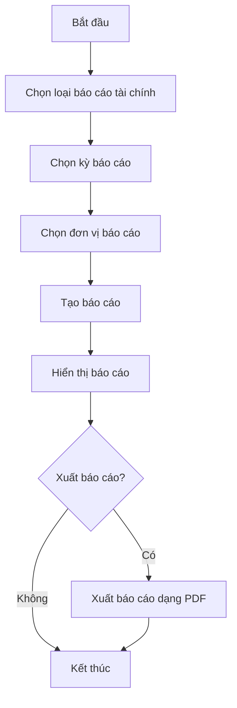
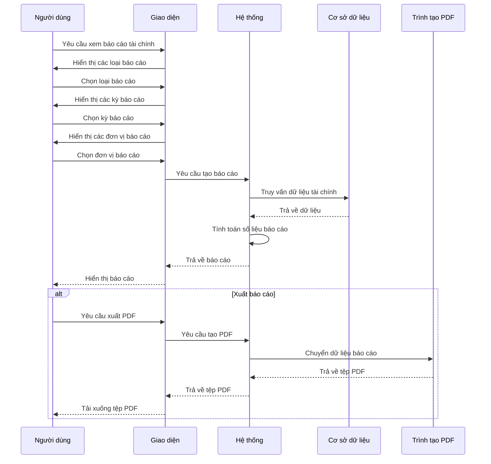
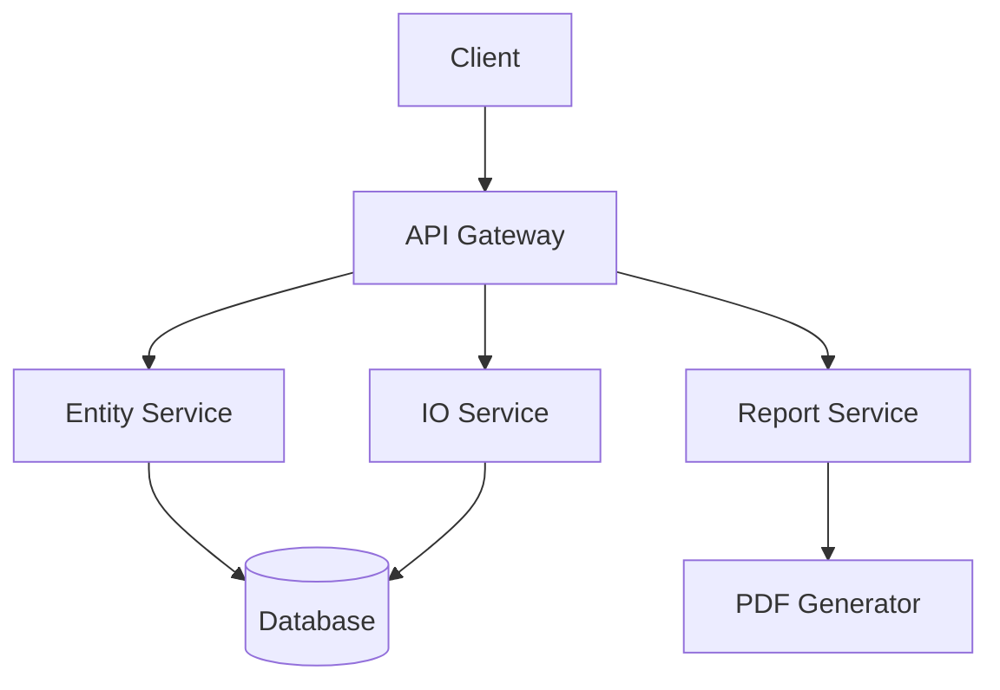
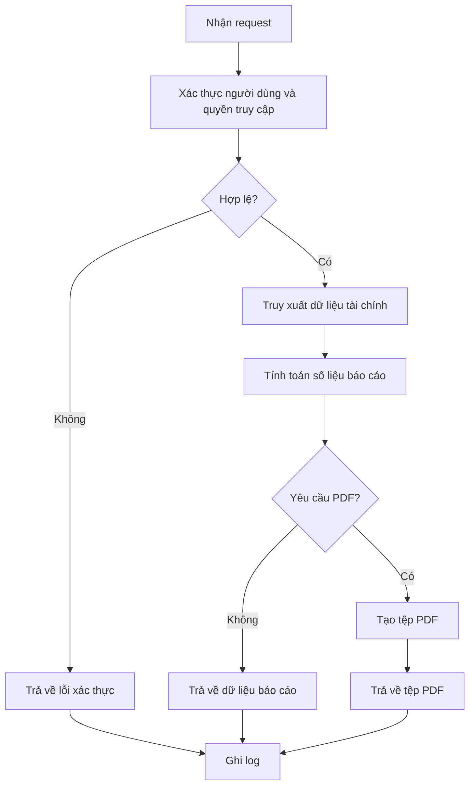

# ACC_005_Báo Cáo Tài Chính

*Phiên bản: 1.0*  
*Người tạo: AI Assistant*  
*Ngày tạo: 25/07/2024*  
*Cập nhật lần cuối: 25/07/2024*  
*Người cập nhật: AI Assistant*

## 1. Tổng Quan Nghiệp Vụ

### 1.1. Mô Tả Nghiệp Vụ
Báo cáo tài chính là các báo cáo cung cấp thông tin về tình hình tài chính, kết quả hoạt động kinh doanh và dòng tiền của doanh nghiệp trong một kỳ kế toán nhất định. Các báo cáo này giúp các bên liên quan, bao gồm nhà quản lý, nhà đầu tư, chủ nợ và cơ quan quản lý, đánh giá sức khỏe tài chính và hiệu quả hoạt động của doanh nghiệp.

Trong hệ thống Django Ledger, phân hệ báo cáo tài chính cung cấp ba loại báo cáo tài chính cơ bản:
1. **Bảng cân đối kế toán (Balance Sheet)**: Thể hiện tài sản, nợ phải trả và vốn chủ sở hữu của doanh nghiệp tại một thời điểm.
2. **Báo cáo kết quả hoạt động kinh doanh (Income Statement)**: Thể hiện doanh thu, chi phí và lợi nhuận của doanh nghiệp trong một khoảng thời gian.
3. **Báo cáo lưu chuyển tiền tệ (Cash Flow Statement)**: Thể hiện các luồng tiền vào và ra của doanh nghiệp trong một khoảng thời gian, phân loại theo hoạt động kinh doanh, đầu tư và tài chính.

### 1.2. Phạm Vi Áp Dụng
Quy trình báo cáo tài chính áp dụng cho:
- Kế toán trưởng và nhân viên kế toán: Người tạo và xem xét báo cáo tài chính.
- Quản lý tài chính: Người phân tích các báo cáo để đưa ra quyết định.
- Giám đốc điều hành và ban lãnh đạo: Người sử dụng báo cáo để đánh giá hiệu quả kinh doanh.
- Kiểm toán viên: Người xác minh tính chính xác của báo cáo tài chính.
- Các bên liên quan bên ngoài như nhà đầu tư và chủ nợ: Người sử dụng báo cáo để đánh giá tình hình tài chính của doanh nghiệp.

### 1.3. Định Nghĩa Thuật Ngữ
| Thuật ngữ | Định nghĩa |
|-----------|------------|
| Balance Sheet (Bảng cân đối kế toán) | Báo cáo tài chính thể hiện tài sản, nợ phải trả và vốn chủ sở hữu của doanh nghiệp tại một thời điểm. |
| Income Statement (Báo cáo kết quả hoạt động kinh doanh) | Báo cáo tài chính thể hiện doanh thu, chi phí và lợi nhuận của doanh nghiệp trong một khoảng thời gian. |
| Cash Flow Statement (Báo cáo lưu chuyển tiền tệ) | Báo cáo tài chính thể hiện các luồng tiền vào và ra của doanh nghiệp trong một khoảng thời gian. |
| Assets (Tài sản) | Các nguồn lực có giá trị kinh tế mà doanh nghiệp sở hữu hoặc kiểm soát. |
| Liabilities (Nợ phải trả) | Các nghĩa vụ hiện tại của doanh nghiệp phải thanh toán trong tương lai. |
| Equity (Vốn chủ sở hữu) | Phần còn lại của tài sản sau khi trừ đi nợ phải trả, đại diện cho giá trị thuộc về chủ sở hữu. |
| Revenue (Doanh thu) | Số tiền doanh nghiệp kiếm được từ việc bán hàng hoặc cung cấp dịch vụ. |
| Expense (Chi phí) | Số tiền doanh nghiệp chi trả để vận hành kinh doanh. |
| Net Income (Lợi nhuận ròng) | Doanh thu trừ đi chi phí, thể hiện lợi nhuận hoặc lỗ của doanh nghiệp. |
| Operating Activities (Hoạt động kinh doanh) | Các hoạt động liên quan đến việc sản xuất và bán hàng hóa hoặc dịch vụ. |
| Investing Activities (Hoạt động đầu tư) | Các hoạt động liên quan đến việc mua và bán tài sản dài hạn. |
| Financing Activities (Hoạt động tài chính) | Các hoạt động liên quan đến việc vay nợ và phát hành vốn chủ sở hữu. |
| Fiscal Year (Năm tài chính) | Kỳ kế toán 12 tháng được sử dụng cho mục đích báo cáo tài chính. |
| Reporting Period (Kỳ báo cáo) | Khoảng thời gian mà báo cáo tài chính được lập, có thể là tháng, quý hoặc năm. |

### 1.4. Tài Liệu Liên Quan
| STT | Mã tài liệu | Tên tài liệu | Mô tả |
|-----|-------------|--------------|-------|
| 1   | ACC_001 | Sơ Đồ Tài Khoản | Quy trình thiết lập và quản lý hệ thống tài khoản kế toán |
| 2   | ACC_002 | Sổ Cái | Quy trình quản lý sổ cái và các bút toán kế toán |
| 3   | ACC_003 | Bút Toán Kế Toán | Quy trình tạo và quản lý các bút toán |
| 4   | ACC_004 | Đóng Sổ Kế Toán | Quy trình đóng sổ kế toán cuối kỳ |

## 2. Quy Trình Nghiệp Vụ

### 2.1. Tổng Quan Quy Trình
Quy trình báo cáo tài chính bao gồm việc tạo, xem và xuất các báo cáo tài chính khác nhau cho một đơn vị trong một kỳ báo cáo cụ thể. Người dùng có thể chọn một trong ba loại báo cáo (Bảng cân đối kế toán, Báo cáo kết quả hoạt động kinh doanh, Báo cáo lưu chuyển tiền tệ) và một kỳ báo cáo (năm, quý, tháng, hoặc ngày cụ thể). Hệ thống sẽ truy xuất dữ liệu tài chính từ cơ sở dữ liệu, tính toán các số liệu cần thiết, và hiển thị báo cáo dưới dạng trực tuyến hoặc xuất ra dưới dạng PDF.

### 2.2. Sơ Đồ Quy Trình (Business Flow)

### 2.3. Chi Tiết Các Bước Quy Trình

#### 2.3.1. Chọn loại báo cáo tài chính
- **Mô tả**: Người dùng chọn một trong ba loại báo cáo tài chính: Bảng cân đối kế toán, Báo cáo kết quả hoạt động kinh doanh, hoặc Báo cáo lưu chuyển tiền tệ.
- **Đầu vào**: Đơn vị kinh doanh cần báo cáo.
- **Đầu ra**: Loại báo cáo đã chọn.
- **Người thực hiện**: Người dùng hệ thống (kế toán, quản lý tài chính, giám đốc).
- **Điều kiện tiên quyết**: Người dùng đã đăng nhập và có quyền truy cập vào báo cáo tài chính của đơn vị.
- **Xử lý ngoại lệ**: Nếu người dùng không có quyền truy cập, hiển thị thông báo lỗi.

#### 2.3.2. Chọn kỳ báo cáo
- **Mô tả**: Người dùng chọn kỳ báo cáo cho báo cáo tài chính, có thể là năm tài chính, quý, tháng, hoặc ngày cụ thể.
- **Đầu vào**: Loại kỳ báo cáo (năm, quý, tháng, ngày) và giá trị cụ thể (ví dụ: năm 2024, quý 2, tháng 6, ngày 30/6/2024).
- **Đầu ra**: Kỳ báo cáo đã chọn.
- **Người thực hiện**: Người dùng hệ thống.
- **Điều kiện tiên quyết**: Đã chọn loại báo cáo.
- **Xử lý ngoại lệ**: Nếu chọn kỳ báo cáo không hợp lệ (ví dụ: trong tương lai), hiển thị thông báo lỗi.

#### 2.3.3. Chọn đơn vị báo cáo
- **Mô tả**: Người dùng có thể chọn báo cáo cho toàn bộ đơn vị hoặc cho một đơn vị phụ cụ thể.
- **Đầu vào**: Đơn vị phụ (nếu có).
- **Đầu ra**: Đơn vị báo cáo đã chọn.
- **Người thực hiện**: Người dùng hệ thống.
- **Điều kiện tiên quyết**: Đã chọn loại báo cáo và kỳ báo cáo.
- **Xử lý ngoại lệ**: Nếu đơn vị phụ không tồn tại, hiển thị thông báo lỗi.

#### 2.3.4. Tạo báo cáo
- **Mô tả**: Hệ thống truy xuất dữ liệu tài chính từ cơ sở dữ liệu, tính toán các số liệu cần thiết, và tạo báo cáo tài chính.
- **Đầu vào**: Loại báo cáo, kỳ báo cáo, đơn vị báo cáo.
- **Đầu ra**: Báo cáo tài chính với dữ liệu đầy đủ.
- **Người thực hiện**: Hệ thống.
- **Điều kiện tiên quyết**: Đã chọn đầy đủ thông tin báo cáo và dữ liệu tài chính có sẵn cho kỳ báo cáo.
- **Xử lý ngoại lệ**: 
  - Nếu không có dữ liệu cho kỳ báo cáo, hiển thị thông báo và báo cáo trống.
  - Nếu có lỗi khi truy xuất dữ liệu, hiển thị thông báo lỗi.

#### 2.3.5. Hiển thị báo cáo
- **Mô tả**: Hệ thống hiển thị báo cáo tài chính dưới dạng bảng với các thông tin cần thiết.
- **Đầu vào**: Báo cáo tài chính đã tạo.
- **Đầu ra**: Giao diện hiển thị báo cáo.
- **Người thực hiện**: Hệ thống.
- **Điều kiện tiên quyết**: Báo cáo đã được tạo thành công.
- **Xử lý ngoại lệ**: Nếu có lỗi khi hiển thị, hiển thị thông báo lỗi.

#### 2.3.6. Xuất báo cáo
- **Mô tả**: Người dùng có thể chọn xuất báo cáo dưới dạng PDF.
- **Đầu vào**: Báo cáo tài chính đã tạo.
- **Đầu ra**: Tệp PDF chứa báo cáo tài chính.
- **Người thực hiện**: Người dùng hệ thống, Hệ thống.
- **Điều kiện tiên quyết**: Báo cáo đã được hiển thị.
- **Xử lý ngoại lệ**: Nếu có lỗi khi tạo PDF, hiển thị thông báo lỗi.

### 2.4. Sơ Đồ Tuần Tự (Sequence Diagram)

### 2.5. Luồng Nghiệp Vụ Thay Thế
1. **Lọc dữ liệu báo cáo**:
   - Người dùng có thể lọc dữ liệu báo cáo theo các tiêu chí khác nhau như loại tài khoản, phân loại chi phí, v.v.
   - Hệ thống sẽ áp dụng bộ lọc và hiển thị báo cáo với dữ liệu đã lọc.

2. **So sánh báo cáo qua nhiều kỳ**:
   - Người dùng có thể chọn nhiều kỳ báo cáo để so sánh.
   - Hệ thống sẽ hiển thị báo cáo so sánh với dữ liệu từ nhiều kỳ báo cáo.

3. **Xuất báo cáo dưới nhiều định dạng**:
   - Người dùng có thể chọn xuất báo cáo dưới nhiều định dạng khác nhau như PDF, Excel, CSV.
   - Hệ thống sẽ tạo tệp báo cáo theo định dạng đã chọn.

## 3. Yêu Cầu Chức Năng

### 3.1. Danh Sách Chức Năng

| STT | Mã chức năng | Tên chức năng | Mô tả | Độ ưu tiên |
|-----|--------------|---------------|-------|------------|
| 1   | FR_001 | Xem Bảng cân đối kế toán | Xem Bảng cân đối kế toán của đơn vị trong kỳ báo cáo | Cao |
| 2   | FR_002 | Xem Báo cáo kết quả hoạt động kinh doanh | Xem Báo cáo kết quả hoạt động kinh doanh của đơn vị trong kỳ báo cáo | Cao |
| 3   | FR_003 | Xem Báo cáo lưu chuyển tiền tệ | Xem Báo cáo lưu chuyển tiền tệ của đơn vị trong kỳ báo cáo | Cao |
| 4   | FR_004 | Chọn kỳ báo cáo | Chọn kỳ báo cáo (năm, quý, tháng, ngày) | Cao |
| 5   | FR_005 | Chọn đơn vị báo cáo | Chọn đơn vị báo cáo (toàn bộ đơn vị hoặc đơn vị phụ) | Trung bình |
| 6   | FR_006 | Xuất báo cáo PDF | Xuất báo cáo dưới dạng PDF | Cao |
| 7   | FR_007 | Lọc dữ liệu báo cáo | Lọc dữ liệu báo cáo theo các tiêu chí khác nhau | Thấp |
| 8   | FR_008 | So sánh báo cáo qua nhiều kỳ | So sánh báo cáo qua nhiều kỳ báo cáo | Thấp |
| 9   | FR_009 | Xuất báo cáo Excel/CSV | Xuất báo cáo dưới dạng Excel hoặc CSV | Thấp |

### 3.2. Chi Tiết Chức Năng

#### 3.2.1. FR_001: Xem Bảng cân đối kế toán
- **Mô tả**: Cho phép người dùng xem Bảng cân đối kế toán của đơn vị trong kỳ báo cáo.
- **Đầu vào**: 
  - Đơn vị kinh doanh
  - Kỳ báo cáo (năm, quý, tháng, ngày)
  - Đơn vị báo cáo (tùy chọn)
- **Đầu ra**: Bảng cân đối kế toán hiển thị tài sản, nợ phải trả và vốn chủ sở hữu của đơn vị tại thời điểm cuối kỳ báo cáo.
- **Điều kiện tiên quyết**: Người dùng đã đăng nhập và có quyền truy cập báo cáo tài chính của đơn vị.
- **Luồng xử lý chính**:
  1. Người dùng truy cập vào mục Báo cáo tài chính.
  2. Người dùng chọn Bảng cân đối kế toán.
  3. Người dùng chọn kỳ báo cáo.
  4. Người dùng chọn đơn vị báo cáo (nếu cần).
  5. Hệ thống truy xuất dữ liệu tài chính và hiển thị Bảng cân đối kế toán.
- **Luồng xử lý thay thế/ngoại lệ**:
  1. Nếu không có dữ liệu cho kỳ báo cáo, hiển thị thông báo và báo cáo trống.
  2. Nếu có lỗi khi truy xuất dữ liệu, hiển thị thông báo lỗi.
- **Giao diện liên quan**: Màn hình Bảng cân đối kế toán.

#### 3.2.2. FR_002: Xem Báo cáo kết quả hoạt động kinh doanh
- **Mô tả**: Cho phép người dùng xem Báo cáo kết quả hoạt động kinh doanh của đơn vị trong kỳ báo cáo.
- **Đầu vào**: 
  - Đơn vị kinh doanh
  - Kỳ báo cáo (năm, quý, tháng, ngày)
  - Đơn vị báo cáo (tùy chọn)
- **Đầu ra**: Báo cáo kết quả hoạt động kinh doanh hiển thị doanh thu, chi phí và lợi nhuận của đơn vị trong kỳ báo cáo.
- **Điều kiện tiên quyết**: Người dùng đã đăng nhập và có quyền truy cập báo cáo tài chính của đơn vị.
- **Luồng xử lý chính**:
  1. Người dùng truy cập vào mục Báo cáo tài chính.
  2. Người dùng chọn Báo cáo kết quả hoạt động kinh doanh.
  3. Người dùng chọn kỳ báo cáo.
  4. Người dùng chọn đơn vị báo cáo (nếu cần).
  5. Hệ thống truy xuất dữ liệu tài chính và hiển thị Báo cáo kết quả hoạt động kinh doanh.
- **Luồng xử lý thay thế/ngoại lệ**:
  1. Nếu không có dữ liệu cho kỳ báo cáo, hiển thị thông báo và báo cáo trống.
  2. Nếu có lỗi khi truy xuất dữ liệu, hiển thị thông báo lỗi.
- **Giao diện liên quan**: Màn hình Báo cáo kết quả hoạt động kinh doanh.

#### 3.2.3. FR_003: Xem Báo cáo lưu chuyển tiền tệ
- **Mô tả**: Cho phép người dùng xem Báo cáo lưu chuyển tiền tệ của đơn vị trong kỳ báo cáo.
- **Đầu vào**: 
  - Đơn vị kinh doanh
  - Kỳ báo cáo (năm, quý, tháng, ngày)
  - Đơn vị báo cáo (tùy chọn)
- **Đầu ra**: Báo cáo lưu chuyển tiền tệ hiển thị các luồng tiền vào và ra của đơn vị trong kỳ báo cáo, phân loại theo hoạt động kinh doanh, đầu tư và tài chính.
- **Điều kiện tiên quyết**: Người dùng đã đăng nhập và có quyền truy cập báo cáo tài chính của đơn vị.
- **Luồng xử lý chính**:
  1. Người dùng truy cập vào mục Báo cáo tài chính.
  2. Người dùng chọn Báo cáo lưu chuyển tiền tệ.
  3. Người dùng chọn kỳ báo cáo.
  4. Người dùng chọn đơn vị báo cáo (nếu cần).
  5. Hệ thống truy xuất dữ liệu tài chính và hiển thị Báo cáo lưu chuyển tiền tệ.
- **Luồng xử lý thay thế/ngoại lệ**:
  1. Nếu không có dữ liệu cho kỳ báo cáo, hiển thị thông báo và báo cáo trống.
  2. Nếu có lỗi khi truy xuất dữ liệu, hiển thị thông báo lỗi.
- **Giao diện liên quan**: Màn hình Báo cáo lưu chuyển tiền tệ.

#### 3.2.4. FR_006: Xuất báo cáo PDF
- **Mô tả**: Cho phép người dùng xuất báo cáo tài chính dưới dạng PDF.
- **Đầu vào**: Báo cáo tài chính đã tạo.
- **Đầu ra**: Tệp PDF chứa báo cáo tài chính.
- **Điều kiện tiên quyết**: Báo cáo tài chính đã được hiển thị.
- **Luồng xử lý chính**:
  1. Người dùng xem báo cáo tài chính.
  2. Người dùng chọn nút "Xuất PDF".
  3. Hệ thống tạo tệp PDF từ báo cáo tài chính.
  4. Hệ thống cho phép người dùng tải xuống tệp PDF.
- **Luồng xử lý thay thế/ngoại lệ**:
  1. Nếu có lỗi khi tạo PDF, hiển thị thông báo lỗi.
- **Giao diện liên quan**: Màn hình báo cáo tài chính, nút "Xuất PDF".

## 4. Thiết Kế Kỹ Thuật

### 4.1. Kiến Trúc Hệ Thống

### 4.2. API Endpoints

#### 4.2.1. Bảng cân đối kế toán
- **Mô tả**: API để truy xuất dữ liệu Bảng cân đối kế toán
- **URL**: `GET /api/v1/entity/{entity_slug}/balance-sheet/{year}/` - Lấy Bảng cân đối kế toán theo năm
- **URL**: `GET /api/v1/entity/{entity_slug}/balance-sheet/{year}/{quarter}/` - Lấy Bảng cân đối kế toán theo quý
- **URL**: `GET /api/v1/entity/{entity_slug}/balance-sheet/{year}/{month}/` - Lấy Bảng cân đối kế toán theo tháng
- **URL**: `GET /api/v1/entity/{entity_slug}/balance-sheet/{year}/{month}/{day}/` - Lấy Bảng cân đối kế toán theo ngày
- **URL**: `GET /api/v1/entity/{entity_slug}/balance-sheet/{year}/{month}/{day}/pdf/` - Xuất Bảng cân đối kế toán dạng PDF

#### 4.2.2. Báo cáo kết quả hoạt động kinh doanh
- **Mô tả**: API để truy xuất dữ liệu Báo cáo kết quả hoạt động kinh doanh
- **URL**: `GET /api/v1/entity/{entity_slug}/income-statement/{year}/` - Lấy Báo cáo kết quả hoạt động kinh doanh theo năm
- **URL**: `GET /api/v1/entity/{entity_slug}/income-statement/{year}/{quarter}/` - Lấy Báo cáo kết quả hoạt động kinh doanh theo quý
- **URL**: `GET /api/v1/entity/{entity_slug}/income-statement/{year}/{month}/` - Lấy Báo cáo kết quả hoạt động kinh doanh theo tháng
- **URL**: `GET /api/v1/entity/{entity_slug}/income-statement/{year}/{month}/{day}/` - Lấy Báo cáo kết quả hoạt động kinh doanh theo ngày
- **URL**: `GET /api/v1/entity/{entity_slug}/income-statement/{year}/{month}/{day}/pdf/` - Xuất Báo cáo kết quả hoạt động kinh doanh dạng PDF

#### 4.2.3. Báo cáo lưu chuyển tiền tệ
- **Mô tả**: API để truy xuất dữ liệu Báo cáo lưu chuyển tiền tệ
- **URL**: `GET /api/v1/entity/{entity_slug}/cash-flow-statement/{year}/` - Lấy Báo cáo lưu chuyển tiền tệ theo năm
- **URL**: `GET /api/v1/entity/{entity_slug}/cash-flow-statement/{year}/{quarter}/` - Lấy Báo cáo lưu chuyển tiền tệ theo quý
- **URL**: `GET /api/v1/entity/{entity_slug}/cash-flow-statement/{year}/{month}/` - Lấy Báo cáo lưu chuyển tiền tệ theo tháng
- **URL**: `GET /api/v1/entity/{entity_slug}/cash-flow-statement/{year}/{month}/{day}/` - Lấy Báo cáo lưu chuyển tiền tệ theo ngày
- **URL**: `GET /api/v1/entity/{entity_slug}/cash-flow-statement/{year}/{month}/{day}/pdf/` - Xuất Báo cáo lưu chuyển tiền tệ dạng PDF

### 4.3. Service Logic

#### 4.3.1. Report Service
- **Mô tả**: Service xử lý logic liên quan đến báo cáo tài chính
- **Chức năng chính**:
  1. Truy xuất dữ liệu tài chính từ cơ sở dữ liệu
  2. Tính toán các số liệu báo cáo
  3. Tạo báo cáo tài chính
  4. Xuất báo cáo dưới dạng PDF
- **Các dependencies**:
  1. IO Service
  2. Entity Service
  3. PDF Generator
- **Sơ đồ luồng xử lý**:

### 4.4. Mô Hình Dữ Liệu

Các báo cáo tài chính không lưu trữ dữ liệu riêng trong cơ sở dữ liệu mà được tính toán từ dữ liệu tài khoản, bút toán và giao dịch hiện có. Tuy nhiên, các báo cáo sẽ sử dụng các mô hình dữ liệu sau:

#### 4.4.1. Balance Sheet Report Model
- **Mô tả**: Mô hình dữ liệu cho Bảng cân đối kế toán
- **Các thành phần chính**:
  - Assets (Tài sản): Các tài khoản tài sản của đơn vị
  - Liabilities (Nợ phải trả): Các tài khoản nợ phải trả của đơn vị
  - Equity (Vốn chủ sở hữu): Các tài khoản vốn chủ sở hữu của đơn vị
  - Retained Earnings (Lợi nhuận giữ lại): Lợi nhuận chưa phân phối

#### 4.4.2. Income Statement Report Model
- **Mô tả**: Mô hình dữ liệu cho Báo cáo kết quả hoạt động kinh doanh
- **Các thành phần chính**:
  - Operating Revenue (Doanh thu hoạt động): Doanh thu từ hoạt động kinh doanh chính
  - Cost of Goods Sold (Giá vốn hàng bán): Chi phí trực tiếp liên quan đến sản phẩm/dịch vụ
  - Operating Expenses (Chi phí hoạt động): Chi phí gián tiếp liên quan đến hoạt động kinh doanh
  - Other Revenue (Doanh thu khác): Doanh thu từ hoạt động không chính
  - Other Expenses (Chi phí khác): Chi phí từ hoạt động không chính
  - Net Income (Lợi nhuận ròng): Tổng lợi nhuận sau khi trừ chi phí

#### 4.4.3. Cash Flow Statement Report Model
- **Mô tả**: Mô hình dữ liệu cho Báo cáo lưu chuyển tiền tệ
- **Các thành phần chính**:
  - Operating Activities (Hoạt động kinh doanh): Luồng tiền từ hoạt động kinh doanh chính
  - Investing Activities (Hoạt động đầu tư): Luồng tiền từ mua/bán tài sản dài hạn
  - Financing Activities (Hoạt động tài chính): Luồng tiền từ vay nợ/trả nợ và vốn chủ sở hữu
  - Net Cash Flow (Luồng tiền ròng): Tổng luồng tiền trong kỳ

## 5. Kế Hoạch Kiểm Thử

### 5.1. Phạm Vi Kiểm Thử
Kiểm thử sẽ tập trung vào các chức năng chính của báo cáo tài chính, bao gồm:
- Tạo và hiển thị Bảng cân đối kế toán
- Tạo và hiển thị Báo cáo kết quả hoạt động kinh doanh
- Tạo và hiển thị Báo cáo lưu chuyển tiền tệ
- Chọn kỳ báo cáo khác nhau (năm, quý, tháng, ngày)
- Xuất báo cáo dạng PDF

### 5.2. Kịch Bản Kiểm Thử

| STT | Mã kịch bản | Tên kịch bản | Mô tả | Điều kiện tiên quyết | Các bước | Kết quả mong đợi |
|-----|------------|--------------|-------|---------------------|----------|-----------------|
| 1   | FR_TEST_001 | Xem Bảng cân đối kế toán theo năm | Kiểm tra việc xem Bảng cân đối kế toán theo năm | Đơn vị có dữ liệu kế toán | 1. Truy cập vào mục Báo cáo tài chính 2. Chọn Bảng cân đối kế toán 3. Chọn năm báo cáo | Bảng cân đối kế toán được hiển thị với dữ liệu chính xác |
| 2   | FR_TEST_002 | Xem Báo cáo kết quả hoạt động kinh doanh theo quý | Kiểm tra việc xem Báo cáo kết quả hoạt động kinh doanh theo quý | Đơn vị có dữ liệu kế toán | 1. Truy cập vào mục Báo cáo tài chính 2. Chọn Báo cáo kết quả hoạt động kinh doanh 3. Chọn năm và quý báo cáo | Báo cáo kết quả hoạt động kinh doanh được hiển thị với dữ liệu chính xác |
| 3   | FR_TEST_003 | Xem Báo cáo lưu chuyển tiền tệ theo tháng | Kiểm tra việc xem Báo cáo lưu chuyển tiền tệ theo tháng | Đơn vị có dữ liệu kế toán | 1. Truy cập vào mục Báo cáo tài chính 2. Chọn Báo cáo lưu chuyển tiền tệ 3. Chọn năm và tháng báo cáo | Báo cáo lưu chuyển tiền tệ được hiển thị với dữ liệu chính xác |
| 4   | FR_TEST_004 | Xem báo cáo cho đơn vị phụ | Kiểm tra việc xem báo cáo tài chính cho một đơn vị phụ cụ thể | Đơn vị có đơn vị phụ và dữ liệu kế toán | 1. Truy cập vào mục Báo cáo tài chính 2. Chọn loại báo cáo 3. Chọn kỳ báo cáo 4. Chọn đơn vị phụ | Báo cáo tài chính được hiển thị với dữ liệu của đơn vị phụ |
| 5   | FR_TEST_005 | Xuất báo cáo PDF | Kiểm tra việc xuất báo cáo tài chính dưới dạng PDF | Báo cáo tài chính đã được hiển thị | 1. Xem báo cáo tài chính 2. Chọn nút "Xuất PDF" | Tệp PDF được tạo và tải xuống với dữ liệu chính xác |
| 6   | FR_TEST_006 | Xem báo cáo không có dữ liệu | Kiểm tra việc xem báo cáo tài chính khi không có dữ liệu | Đơn vị không có dữ liệu cho kỳ báo cáo | 1. Truy cập vào mục Báo cáo tài chính 2. Chọn loại báo cáo 3. Chọn kỳ báo cáo không có dữ liệu | Báo cáo trống được hiển thị với thông báo không có dữ liệu |
| 7   | FR_TEST_007 | Kiểm tra quyền truy cập báo cáo | Kiểm tra quyền truy cập báo cáo tài chính | Người dùng không có quyền truy cập báo cáo | 1. Đăng nhập với người dùng không có quyền 2. Truy cập vào mục Báo cáo tài chính | Thông báo lỗi quyền truy cập được hiển thị |
| 8   | FR_TEST_008 | Kiểm tra tính nhất quán của báo cáo | Kiểm tra tính nhất quán giữa các báo cáo tài chính | Đơn vị có dữ liệu kế toán | 1. Xem Bảng cân đối kế toán 2. Xem Báo cáo kết quả hoạt động kinh doanh 3. Xem Báo cáo lưu chuyển tiền tệ 4. So sánh số liệu giữa các báo cáo | Số liệu giữa các báo cáo phải nhất quán |

## 6. Phụ Lục

### 6.1. Danh Sách Tài Liệu Tham Khảo
- Django Ledger Documentation
- Financial Accounting Standards Board (FASB) Guidelines
- International Financial Reporting Standards (IFRS)
- Python fpdf2 Documentation
- Django Framework Documentation

### 6.2. Danh Mục Thuật Ngữ
- **Balance Sheet (Bảng cân đối kế toán)**: Báo cáo tài chính thể hiện tài sản, nợ phải trả và vốn chủ sở hữu.
- **Income Statement (Báo cáo kết quả hoạt động kinh doanh)**: Báo cáo tài chính thể hiện doanh thu, chi phí và lợi nhuận.
- **Cash Flow Statement (Báo cáo lưu chuyển tiền tệ)**: Báo cáo tài chính thể hiện các luồng tiền vào và ra.
- **Assets (Tài sản)**: Các nguồn lực có giá trị kinh tế mà doanh nghiệp sở hữu hoặc kiểm soát.
- **Liabilities (Nợ phải trả)**: Các nghĩa vụ hiện tại của doanh nghiệp phải thanh toán trong tương lai.
- **Equity (Vốn chủ sở hữu)**: Phần còn lại của tài sản sau khi trừ đi nợ phải trả.
- **Retained Earnings (Lợi nhuận giữ lại)**: Lợi nhuận chưa phân phối của doanh nghiệp.
- **Revenue (Doanh thu)**: Số tiền doanh nghiệp kiếm được từ việc bán hàng hoặc cung cấp dịch vụ.
- **Expense (Chi phí)**: Số tiền doanh nghiệp chi trả để vận hành kinh doanh.

### 6.3. Lịch Sử Thay Đổi Tài Liệu

| Phiên bản | Ngày | Người thực hiện | Mô tả thay đổi |
|-----------|------|-----------------|---------------|
| 1.0 | 25/07/2024 | AI Assistant | Tạo tài liệu ban đầu |