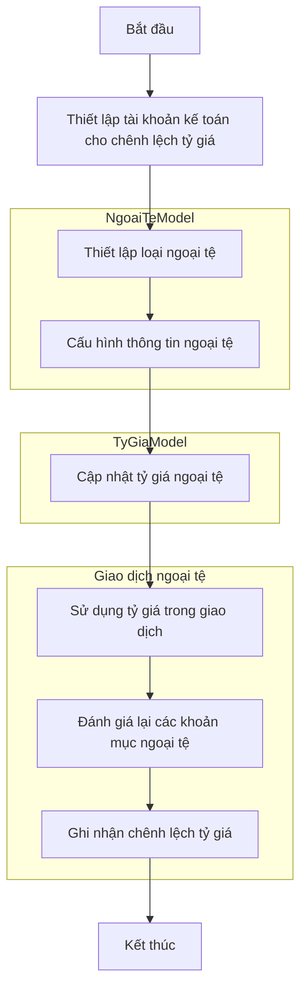
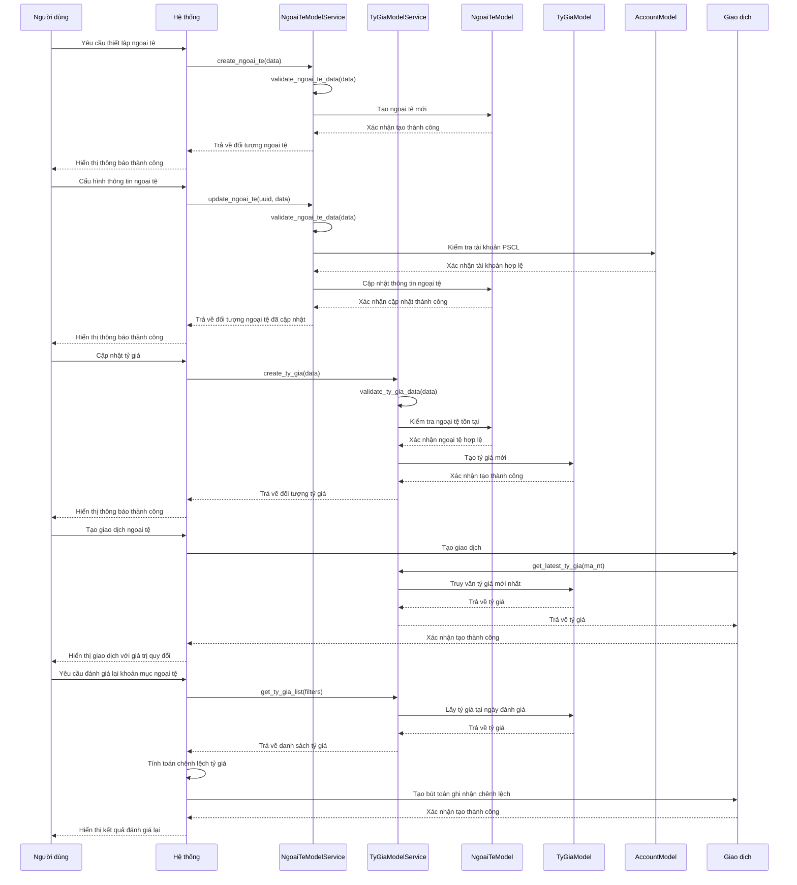
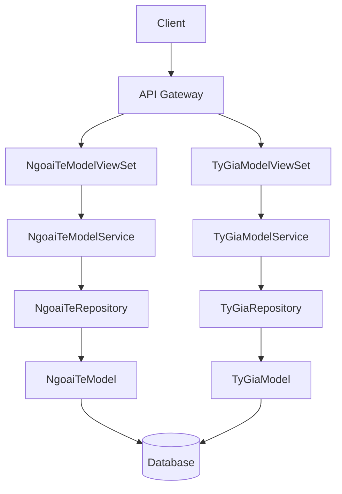
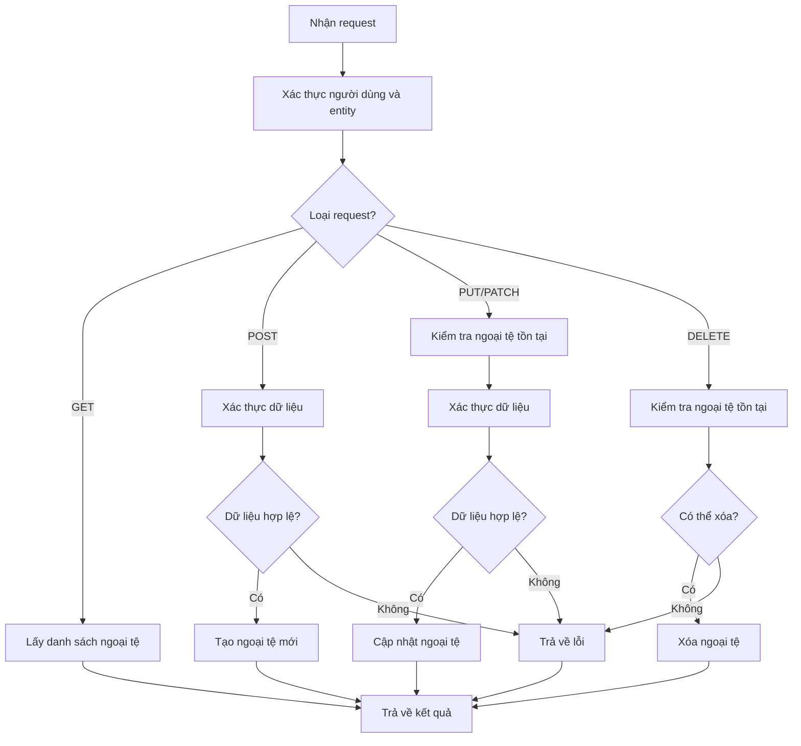
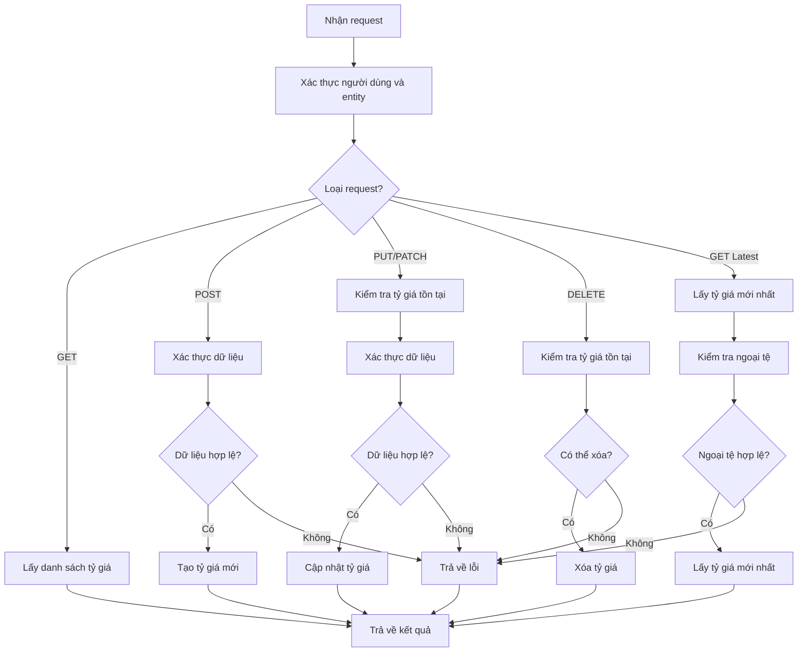
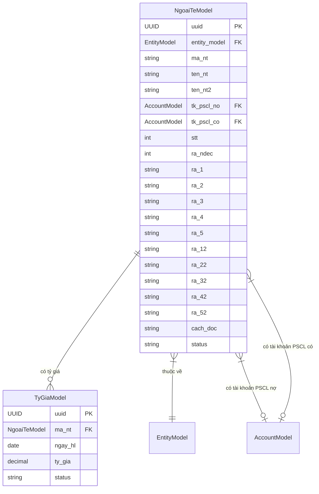

# ACC_007_Quản Lý Tỷ Giá

*Phiên bản: 1.0*  
*Người tạo: AI Assistant*  
*Ngày tạo: 25/07/2024*  
*Cập nhật lần cuối: 16/10/2024*  
*Người cập nhật: AI Assistant*

## 1. Tổng Quan Nghiệp Vụ

### 1.1. Mô Tả Nghiệp Vụ
Quản lý tỷ giá là quy trình thiết lập, cập nhật và quản lý tỷ giá hối đoái giữa các loại tiền tệ trong hệ thống. Quy trình này rất quan trọng đối với các doanh nghiệp có giao dịch bằng nhiều loại tiền tệ khác nhau, giúp đảm bảo việc ghi nhận giá trị giao dịch và tài sản chính xác theo đồng tiền hạch toán của doanh nghiệp.

Trong hệ thống Django Ledger, quản lý tỷ giá bao gồm hai thành phần chính:
1. **Quản lý Ngoại tệ (NgoaiTeModel)**: Thiết lập các loại tiền tệ, bao gồm mã tiền tệ, tên, tài khoản ghi nhận chênh lệch tỷ giá, và các thuộc tính định dạng số. Mỗi loại ngoại tệ được cấu hình với các tài khoản kế toán riêng để ghi nhận lãi/lỗ chênh lệch tỷ giá.
2. **Quản lý Tỷ giá (TyGiaModel)**: Thiết lập tỷ giá hối đoái giữa đồng tiền hạch toán và các loại ngoại tệ tại các thời điểm khác nhau. Hệ thống lưu trữ lịch sử tỷ giá theo ngày hiệu lực, cho phép truy vấn tỷ giá tại bất kỳ thời điểm nào.

Việc quản lý tỷ giá đóng vai trò quan trọng trong các hoạt động như: ghi nhận giao dịch ngoại tệ, đánh giá lại các khoản mục tiền tệ có gốc ngoại tệ vào thời điểm lập báo cáo tài chính, và tính toán chênh lệch tỷ giá phát sinh.

### 1.2. Phạm Vi Áp Dụng
Quy trình quản lý tỷ giá áp dụng cho:
- Kế toán tổng hợp: Người thiết lập và quản lý các loại tiền tệ và tỷ giá.
- Kế toán thanh toán: Người sử dụng tỷ giá để ghi nhận các giao dịch ngoại tệ.
- Kế toán công nợ: Người đánh giá lại các khoản nợ có gốc ngoại tệ.
- Kế toán ngân hàng: Người quản lý tài khoản ngân hàng bằng ngoại tệ.
- Quản lý tài chính: Người giám sát và phê duyệt các cấu hình tỷ giá.
- Người dùng khác: Những người sử dụng tỷ giá trong các giao dịch bán hàng, mua hàng, thanh toán, v.v.

### 1.3. Định Nghĩa Thuật Ngữ
| Thuật ngữ | Định nghĩa |
|-----------|------------|
| Ngoại tệ | Tiền tệ của quốc gia khác không phải là đồng tiền hạch toán của doanh nghiệp. |
| Tỷ giá hối đoái | Tỷ lệ quy đổi giữa hai loại tiền tệ, thường được biểu thị là số đơn vị tiền tệ nội địa cần thiết để mua một đơn vị ngoại tệ. |
| Đồng tiền hạch toán | Loại tiền tệ mà doanh nghiệp sử dụng để ghi sổ kế toán và lập báo cáo tài chính. |
| Đánh giá lại | Quá trình tính toán lại giá trị của các khoản mục tiền tệ có gốc ngoại tệ theo tỷ giá tại thời điểm báo cáo. |
| Chênh lệch tỷ giá | Khoản chênh lệch phát sinh do đánh giá lại các khoản mục tiền tệ có gốc ngoại tệ theo tỷ giá khác với tỷ giá ghi nhận ban đầu. |
| Ngày hiệu lực | Ngày mà tỷ giá có hiệu lực áp dụng. |
| Tài khoản PSCL nợ | Tài khoản kế toán dùng để ghi nhận chênh lệch tỷ giá bên nợ (lỗ tỷ giá), được lưu trữ trong trường tk_pscl_no của NgoaiTeModel. |
| Tài khoản PSCL có | Tài khoản kế toán dùng để ghi nhận chênh lệch tỷ giá bên có (lãi tỷ giá), được lưu trữ trong trường tk_pscl_co của NgoaiTeModel. |
| Mã ngoại tệ | Mã 3 chữ cái quốc tế đại diện cho một loại tiền tệ (ví dụ: USD, EUR, JPY). |

### 1.4. Tài Liệu Liên Quan
| STT | Mã tài liệu | Tên tài liệu | Mô tả |
|-----|-------------|--------------|-------|
| 1   | ACC_001 | Sơ Đồ Tài Khoản | Quy trình thiết lập và quản lý hệ thống tài khoản kế toán |
| 2   | ACC_002 | Sổ Cái | Quy trình quản lý sổ cái và các bút toán kế toán |
| 3   | ACC_003 | Bút Toán Kế Toán | Quy trình tạo và quản lý các bút toán |
| 4   | FIN_001 | Quản Lý Ngân Hàng | Quy trình quản lý tài khoản ngân hàng |
| 5   | FIN_002 | Quản Lý Thanh Toán | Quy trình quản lý phương thức thanh toán |

## 2. Quy Trình Nghiệp Vụ

### 2.1. Tổng Quan Quy Trình
Quy trình quản lý tỷ giá bao gồm việc thiết lập các loại ngoại tệ, cấu hình tài khoản kế toán cho chênh lệch tỷ giá, và cập nhật tỷ giá theo thời gian. Người dùng có thể tạo mới, cập nhật, và vô hiệu hóa các loại ngoại tệ, cũng như thiết lập tỷ giá cho từng loại ngoại tệ tại các thời điểm khác nhau. Hệ thống sẽ sử dụng tỷ giá này để quy đổi giá trị giao dịch và tính toán chênh lệch tỷ giá.

### 2.2. Sơ Đồ Quy Trình (Business Flow)

### 2.3. Chi Tiết Các Bước Quy Trình

#### 2.3.1. Thiết lập tài khoản kế toán cho chênh lệch tỷ giá
- **Mô tả**: Tạo hoặc chỉ định các tài khoản kế toán dùng để ghi nhận chênh lệch tỷ giá phát sinh.
- **Đầu vào**: Thông tin tài khoản kế toán (mã, tên, nhóm tài khoản).
- **Đầu ra**: Tài khoản kế toán được thiết lập.
- **Người thực hiện**: Kế toán tổng hợp.
- **Điều kiện tiên quyết**: Sơ đồ tài khoản đã được thiết lập.
- **Xử lý ngoại lệ**: Nếu tài khoản đã tồn tại, sử dụng tài khoản hiện có.

#### 2.3.2. Thiết lập loại ngoại tệ
- **Mô tả**: Tạo các loại ngoại tệ trong hệ thống sử dụng NgoaiTeModel.
- **Đầu vào**: 
  - Mã ngoại tệ (ma_nt)
  - Tên ngoại tệ (ten_nt)
  - Tên thay thế (ten_nt2, tùy chọn)
  - Số thứ tự (stt)
  - Số chữ số thập phân (ra_ndec)
  - Cách đọc (cach_doc)
  - Trạng thái (status, mặc định là '1')
- **Đầu ra**: Loại ngoại tệ mới (đối tượng NgoaiTeModel) được tạo trong hệ thống.
- **Người thực hiện**: Kế toán tổng hợp.
- **Điều kiện tiên quyết**: Người dùng có quyền quản lý ngoại tệ.
- **Xử lý ngoại lệ**: Nếu mã ngoại tệ đã tồn tại, hệ thống sẽ báo lỗi "Currency code already exists for this entity".

#### 2.3.3. Cấu hình thông tin ngoại tệ
- **Mô tả**: Thiết lập các thông tin chi tiết và tài khoản kế toán cho ngoại tệ.
- **Đầu vào**: Loại ngoại tệ, tài khoản PSCL nợ, tài khoản PSCL có, các thông tin định dạng.
- **Đầu ra**: Thông tin ngoại tệ được cấu hình đầy đủ.
- **Người thực hiện**: Kế toán tổng hợp.
- **Điều kiện tiên quyết**: Loại ngoại tệ và tài khoản kế toán đã được tạo.
- **Xử lý ngoại lệ**: Nếu tài khoản kế toán không hợp lệ, hiển thị thông báo lỗi.

#### 2.3.4. Cập nhật tỷ giá ngoại tệ
- **Mô tả**: Cập nhật tỷ giá cho các loại ngoại tệ tại các thời điểm khác nhau sử dụng TyGiaModel.
- **Đầu vào**: 
  - Loại ngoại tệ (ma_nt) - khóa ngoại đến NgoaiTeModel
  - Ngày hiệu lực (ngay_hl)
  - Tỷ giá (ty_gia) - lưu trữ với 4 chữ số thập phân
  - Trạng thái (status, mặc định là '1')
- **Đầu ra**: Tỷ giá mới (đối tượng TyGiaModel) được cập nhật trong hệ thống.
- **Người thực hiện**: Kế toán tổng hợp.
- **Điều kiện tiên quyết**: Loại ngoại tệ đã được thiết lập.
- **Xử lý ngoại lệ**: 
  - Nếu tỷ giá không hợp lệ (âm hoặc bằng 0), hệ thống sẽ báo lỗi "Exchange rate must be positive".
  - Nếu tỷ giá đã tồn tại cho cùng loại ngoại tệ và ngày, hệ thống sẽ báo lỗi "Exchange rate already exists for this currency and date".

#### 2.3.5. Sử dụng tỷ giá trong giao dịch
- **Mô tả**: Áp dụng tỷ giá khi ghi nhận các giao dịch có liên quan đến ngoại tệ.
- **Đầu vào**: Giao dịch ngoại tệ, loại ngoại tệ, ngày giao dịch.
- **Đầu ra**: Giao dịch được ghi nhận với tỷ giá tương ứng.
- **Người thực hiện**: Người dùng hệ thống (kế toán, nhân viên bán hàng, nhân viên mua hàng).
- **Điều kiện tiên quyết**: Tỷ giá cho ngoại tệ và ngày giao dịch đã được thiết lập.
- **Xử lý ngoại lệ**: Nếu không tìm thấy tỷ giá cho ngày giao dịch, sử dụng tỷ giá gần nhất trước đó.

#### 2.3.6. Đánh giá lại các khoản mục ngoại tệ
- **Mô tả**: Đánh giá lại giá trị của các khoản mục tiền tệ có gốc ngoại tệ theo tỷ giá tại thời điểm báo cáo.
- **Đầu vào**: Danh sách các khoản mục ngoại tệ, ngày đánh giá lại, tỷ giá tại ngày đánh giá lại.
- **Đầu ra**: Giá trị đánh giá lại của các khoản mục ngoại tệ.
- **Người thực hiện**: Kế toán tổng hợp.
- **Điều kiện tiên quyết**: Các khoản mục ngoại tệ đã được ghi nhận và tỷ giá tại ngày đánh giá lại đã được cập nhật.
- **Xử lý ngoại lệ**: Nếu không tìm thấy tỷ giá tại ngày đánh giá lại, thông báo cho người dùng cập nhật.

#### 2.3.7. Ghi nhận chênh lệch tỷ giá
- **Mô tả**: Ghi nhận chênh lệch tỷ giá phát sinh do đánh giá lại các khoản mục ngoại tệ.
- **Đầu vào**: Giá trị đánh giá lại, giá trị ghi sổ, loại ngoại tệ.
- **Đầu ra**: Bút toán ghi nhận chênh lệch tỷ giá.
- **Người thực hiện**: Kế toán tổng hợp.
- **Điều kiện tiên quyết**: Đã đánh giá lại các khoản mục ngoại tệ.
- **Xử lý ngoại lệ**: Nếu không có chênh lệch, không cần tạo bút toán.

### 2.4. Sơ Đồ Tuần Tự (Sequence Diagram)

### 2.5. Luồng Nghiệp Vụ Thay Thế
1. **Tự động cập nhật tỷ giá**:
   - Hệ thống có thể được cấu hình để tự động lấy tỷ giá từ nguồn bên ngoài (như API của ngân hàng).
   - Việc cập nhật tỷ giá có thể được lên lịch để thực hiện hàng ngày hoặc theo chu kỳ.
   - Người dùng xác nhận tỷ giá tự động trước khi áp dụng.

2. **Quản lý nhiều nguồn tỷ giá**:
   - Doanh nghiệp có thể theo dõi tỷ giá từ nhiều nguồn khác nhau (ngân hàng nhà nước, ngân hàng thương mại, v.v.).
   - Người dùng chọn nguồn tỷ giá phù hợp cho từng loại giao dịch.
   - Hệ thống lưu trữ và quản lý tỷ giá từ nhiều nguồn.

3. **Đánh giá lại theo nhiều phương pháp**:
   - Doanh nghiệp có thể áp dụng nhiều phương pháp đánh giá lại khác nhau (tỷ giá cuối kỳ, tỷ giá bình quân, v.v.).
   - Người dùng chọn phương pháp đánh giá lại phù hợp.
   - Hệ thống hỗ trợ tính toán theo phương pháp đã chọn.

## 3. Yêu Cầu Chức Năng

### 3.1. Danh Sách Chức Năng

| STT | Mã chức năng | Tên chức năng | Mô tả | Độ ưu tiên |
|-----|--------------|---------------|-------|------------|
| 1   | CUR_001 | Quản lý loại ngoại tệ | Tạo, cập nhật, xóa loại ngoại tệ | Cao |
| 2   | CUR_002 | Cấu hình tài khoản cho ngoại tệ | Thiết lập tài khoản kế toán cho chênh lệch tỷ giá | Cao |
| 3   | CUR_003 | Quản lý tỷ giá | Tạo, cập nhật, xóa tỷ giá | Cao |
| 4   | CUR_004 | Tìm kiếm tỷ giá | Tìm kiếm tỷ giá theo nhiều tiêu chí | Trung bình |
| 5   | CUR_005 | Lấy tỷ giá tự động | Lấy tỷ giá từ nguồn bên ngoài | Thấp |
| 6   | CUR_006 | Đánh giá lại khoản mục ngoại tệ | Đánh giá lại giá trị các khoản mục ngoại tệ | Cao |
| 7   | CUR_007 | Ghi nhận chênh lệch tỷ giá | Tạo bút toán ghi nhận chênh lệch tỷ giá | Cao |
| 8   | CUR_008 | Báo cáo tỷ giá | Tạo báo cáo về tỷ giá và chênh lệch tỷ giá | Trung bình |
| 9   | CUR_009 | Xuất dữ liệu tỷ giá | Xuất dữ liệu tỷ giá ra file | Thấp |

### 3.2. Chi Tiết Chức Năng

#### 3.2.1. CUR_001: Quản lý loại ngoại tệ
- **Mô tả**: Cho phép người dùng tạo, cập nhật, xóa loại ngoại tệ thông qua NgoaiTeModelService và API endpoints.
- **Đầu vào**: 
  - Mã ngoại tệ (ma_nt)
  - Tên ngoại tệ (ten_nt)
  - Tên ngoại tệ 2 (ten_nt2) (tùy chọn)
  - Số thứ tự (stt)
  - Số chữ số thập phân (ra_ndec)
  - Cách đọc (cach_doc)
  - Trạng thái (status)
  - Entity_model (liên kết tới đơn vị)
  - Tỷ giá hiệu chuẩn (ra_1 đến ra_5, ra_12 đến ra_52) (tùy chọn)
- **Đầu ra**: Loại ngoại tệ được tạo, cập nhật hoặc xóa trong hệ thống.
- **Điều kiện tiên quyết**: Người dùng có quyền quản lý ngoại tệ và được xác thực.
- **Luồng xử lý chính**:
  1. Người dùng truy cập API endpoint `/api/entity/<entity_slug>/ngoai-te/`.
  2. Người dùng chọn hành động (GET để liệt kê, POST để tạo mới, PUT/PATCH để cập nhật, DELETE để xóa).
  3. Người dùng gửi thông tin cần thiết trong định dạng JSON.
  4. NgoaiTeModelService xác thực thông tin thông qua validate_ngoai_te_data().
  5. Hệ thống thực hiện hành động và trả về kết quả với HTTP status code phù hợp.
- **Luồng xử lý thay thế/ngoại lệ**:
  1. Nếu mã ngoại tệ đã tồn tại, API trả về lỗi 400 với thông báo "Currency code already exists for this entity".
  2. Nếu thiếu thông tin bắt buộc, API trả về lỗi 400 với thông báo về trường bị thiếu.
  3. Nếu ngoại tệ đang được sử dụng trong các giao dịch, API trả về lỗi khi cố gắng xóa.
- **Giao diện liên quan**: 
  - API Endpoint: `/api/entity/<entity_slug>/ngoai-te/`
  - API Endpoint chi tiết: `/api/entity/<entity_slug>/ngoai-te/<uuid>/`

#### 3.2.2. CUR_002: Cấu hình tài khoản cho ngoại tệ
- **Mô tả**: Cho phép người dùng thiết lập tài khoản kế toán cho chênh lệch tỷ giá.
- **Đầu vào**: 
  - Loại ngoại tệ
  - Tài khoản PSCL nợ (tk_pscl_no)
  - Tài khoản PSCL có (tk_pscl_co)
- **Đầu ra**: Cấu hình tài khoản cho ngoại tệ được thiết lập hoặc cập nhật.
- **Điều kiện tiên quyết**: Loại ngoại tệ và tài khoản kế toán đã được tạo.
- **Luồng xử lý chính**:
  1. Người dùng truy cập chức năng cấu hình ngoại tệ.
  2. Người dùng chọn loại ngoại tệ cần cấu hình.
  3. Người dùng chọn tài khoản PSCL nợ và tài khoản PSCL có.
  4. Hệ thống xác thực thông tin.
  5. Hệ thống lưu cấu hình và hiển thị kết quả.
- **Luồng xử lý thay thế/ngoại lệ**:
  1. Nếu tài khoản không tồn tại, hiển thị thông báo lỗi.
  2. Nếu tài khoản không phù hợp với loại ngoại tệ, hiển thị cảnh báo.
- **Giao diện liên quan**: Màn hình cấu hình ngoại tệ.

#### 3.2.3. CUR_003: Quản lý tỷ giá
- **Mô tả**: Cho phép người dùng tạo, cập nhật, xóa tỷ giá cho các loại ngoại tệ thông qua TyGiaModelService và API endpoints.
- **Đầu vào**: 
  - Loại ngoại tệ (ma_nt) - Khóa ngoại đến NgoaiTeModel
  - Ngày hiệu lực (ngay_hl) - DateField
  - Tỷ giá (ty_gia) - DecimalField(max_digits=18, decimal_places=4)
  - Trạng thái (status) - mặc định là '1'
- **Đầu ra**: Tỷ giá được tạo, cập nhật hoặc xóa trong hệ thống (TyGiaModel).
- **Điều kiện tiên quyết**: Loại ngoại tệ đã được tạo trong hệ thống.
- **Luồng xử lý chính**:
  1. Người dùng truy cập API endpoint `/api/entity/<entity_slug>/ty-gia/`.
  2. Người dùng chọn hành động (GET để liệt kê, POST để tạo mới, PUT/PATCH để cập nhật, DELETE để xóa).
  3. Người dùng gửi thông tin cần thiết trong định dạng JSON.
  4. TyGiaModelService xác thực thông tin thông qua validate_ty_gia_data().
  5. Hệ thống thực hiện hành động và trả về kết quả với HTTP status code phù hợp.
- **Luồng xử lý thay thế/ngoại lệ**:
  1. Nếu tỷ giá cho loại ngoại tệ và ngày hiệu lực đã tồn tại, API trả về lỗi 400 với thông báo "Exchange rate already exists for this currency and date".
  2. Nếu tỷ giá không hợp lệ (âm hoặc bằng 0), API trả về lỗi 400 với thông báo "Exchange rate must be positive".
  3. Nếu ngoại tệ không tồn tại, API trả về lỗi 400 với thông báo "Currency with code {ma_nt} does not exist".
- **Giao diện liên quan**: 
  - API Endpoint: `/api/entity/<entity_slug>/ty-gia/`
  - API Endpoint chi tiết: `/api/entity/<entity_slug>/ty-gia/<uuid>/`
  - API Endpoint lấy tỷ giá mới nhất: `/api/entity/<entity_slug>/ty-gia/get_latest/?ma_nt=<currency_code>`

#### 3.2.4. CUR_006: Đánh giá lại khoản mục ngoại tệ
- **Mô tả**: Cho phép người dùng đánh giá lại giá trị các khoản mục ngoại tệ theo tỷ giá tại thời điểm báo cáo.
- **Đầu vào**: 
  - Ngày đánh giá lại
  - Danh sách các khoản mục ngoại tệ cần đánh giá lại
  - Phương pháp đánh giá lại (tùy chọn)
- **Đầu ra**: Kết quả đánh giá lại với giá trị chênh lệch tỷ giá.
- **Điều kiện tiên quyết**: Các khoản mục ngoại tệ đã được ghi nhận và tỷ giá tại ngày đánh giá lại đã được cập nhật.
- **Luồng xử lý chính**:
  1. Người dùng truy cập chức năng đánh giá lại khoản mục ngoại tệ.
  2. Người dùng chọn ngày đánh giá lại và các khoản mục ngoại tệ.
  3. Người dùng chọn phương pháp đánh giá lại (nếu có nhiều phương pháp).
  4. Hệ thống thực hiện đánh giá lại và tính toán chênh lệch tỷ giá.
  5. Hệ thống hiển thị kết quả đánh giá lại.
- **Luồng xử lý thay thế/ngoại lệ**:
  1. Nếu không tìm thấy tỷ giá tại ngày đánh giá lại, thông báo cho người dùng cập nhật.
  2. Nếu không có khoản mục ngoại tệ nào cần đánh giá lại, hiển thị thông báo.
- **Giao diện liên quan**: Màn hình đánh giá lại khoản mục ngoại tệ.

## 4. Thiết Kế Kỹ Thuật

### 4.1. Kiến Trúc Hệ Thống

### 4.2. API Endpoints

#### 4.2.1. Quản lý Ngoại tệ
- **Mô tả**: API quản lý ngoại tệ
- **URL**: 
  - `GET /api/entity/{entity_slug}/ngoai-te/` - Liệt kê ngoại tệ
  - `POST /api/entity/{entity_slug}/ngoai-te/` - Tạo ngoại tệ mới
  - `GET /api/entity/{entity_slug}/ngoai-te/{uuid}/` - Lấy chi tiết ngoại tệ
  - `PUT /api/entity/{entity_slug}/ngoai-te/{uuid}/` - Cập nhật toàn bộ ngoại tệ
  - `PATCH /api/entity/{entity_slug}/ngoai-te/{uuid}/` - Cập nhật một phần ngoại tệ
  - `DELETE /api/entity/{entity_slug}/ngoai-te/{uuid}/` - Xóa ngoại tệ

#### 4.2.2. Quản lý Tỷ giá
- **Mô tả**: API quản lý tỷ giá
- **URL**: 
  - `GET /api/entity/{entity_slug}/ty-gia/` - Liệt kê tỷ giá
  - `POST /api/entity/{entity_slug}/ty-gia/` - Tạo tỷ giá mới
  - `GET /api/entity/{entity_slug}/ty-gia/{uuid}/` - Lấy chi tiết tỷ giá
  - `PUT /api/entity/{entity_slug}/ty-gia/{uuid}/` - Cập nhật toàn bộ tỷ giá
  - `PATCH /api/entity/{entity_slug}/ty-gia/{uuid}/` - Cập nhật một phần tỷ giá
  - `DELETE /api/entity/{entity_slug}/ty-gia/{uuid}/` - Xóa tỷ giá
  - `GET /api/entity/{entity_slug}/ty-gia/get_latest/?ma_nt={currency_code}` - Lấy tỷ giá mới nhất cho một loại ngoại tệ

### 4.3. Service Logic

#### 4.3.1. NgoaiTeModelService
- **Mô tả**: Service xử lý logic nghiệp vụ cho quản lý ngoại tệ
- **Chức năng chính**:
  1. Lấy danh sách ngoại tệ (get_all_ngoai_te)
  2. Tạo ngoại tệ mới (create_ngoai_te)
  3. Cập nhật ngoại tệ (update_ngoai_te)
  4. Xóa ngoại tệ (delete_ngoai_te)
  5. Xác thực dữ liệu ngoại tệ (validate_ngoai_te_data)
- **Các dependencies**:
  1. NgoaiTeRepository
  2. EntityModel
- **Sơ đồ luồng xử lý**:

#### 4.3.2. TyGiaModelService
- **Mô tả**: Service xử lý logic nghiệp vụ cho quản lý tỷ giá
- **Chức năng chính**:
  1. Lấy danh sách tỷ giá (get_ty_gia_list)
  2. Lấy tỷ giá chi tiết (get_ty_gia_detail)
  3. Tạo tỷ giá mới (create_ty_gia)
  4. Cập nhật tỷ giá (update_ty_gia)
  5. Xóa tỷ giá (delete_ty_gia)
  6. Lấy tỷ giá mới nhất (get_latest_ty_gia)
  7. Xác thực dữ liệu tỷ giá (validate_ty_gia_data)
- **Các dependencies**:
  1. TyGiaRepository
  2. NgoaiTeModel
  3. EntityModel
- **Sơ đồ luồng xử lý**:

### 4.4. Mô Hình Dữ Liệu

#### 4.4.1. Entity Relationship Diagram (ERD)

#### 4.4.2. Chi Tiết Bảng Dữ Liệu

##### Bảng: NgoaiTeModel (Currency)
- **Mô tả**: Lưu trữ thông tin các loại ngoại tệ trong hệ thống
- **Khóa chính**: uuid
- **Quan hệ**:
  - Thuộc về một EntityModel (entity_model)
  - Liên kết với AccountModel cho tài khoản PSCL nợ (tk_pscl_no)
  - Liên kết với AccountModel cho tài khoản PSCL có (tk_pscl_co)
  - Có nhiều TyGiaModel (ty_gia)
- **Các trường chính**:
  - ma_nt: Mã ngoại tệ (ví dụ: USD, EUR, VND)
  - ten_nt: Tên ngoại tệ
  - ten_nt2: Tên thay thế (tùy chọn)
  - stt: Thứ tự sắp xếp
  - ra_ndec: Số chữ số thập phân hiển thị
  - cach_doc: Cách đọc số tiền của ngoại tệ
  - status: Trạng thái (1: Hoạt động, 0: Không hoạt động)

##### Bảng: TyGiaModel (Exchange Rate)
- **Mô tả**: Lưu trữ tỷ giá của các loại ngoại tệ theo ngày
- **Khóa chính**: uuid
- **Quan hệ**:
  - Thuộc về một NgoaiTeModel (ma_nt)
- **Các trường chính**:
  - ngay_hl: Ngày hiệu lực của tỷ giá
  - ty_gia: Giá trị tỷ giá (Decimal với 4 chữ số thập phân)
  - status: Trạng thái (1: Hoạt động, 0: Không hoạt động)

## 5. Kế Hoạch Kiểm Thử

### 5.1. Phạm Vi Kiểm Thử
Kiểm thử phạm vi quản lý tỷ giá bao gồm:
- Kiểm thử API endpoints cho NgoaiTeModel và TyGiaModel
- Kiểm thử các hàm service của NgoaiTeModelService và TyGiaModelService
- Kiểm thử việc sử dụng tỷ giá trong các giao dịch có liên quan đến ngoại tệ
- Kiểm thử quy trình đánh giá lại khoản mục ngoại tệ và ghi nhận chênh lệch tỷ giá

### 5.2. Kịch Bản Kiểm Thử
| STT | Mã kịch bản | Tên kịch bản | Mô tả | Điều kiện tiên quyết | Các bước | Kết quả mong đợi |
|-----|------------|--------------|-------|---------------------|----------|-----------------|
| 1   | CUR_TEST_001 | Tạo loại ngoại tệ mới | Kiểm tra việc tạo loại ngoại tệ mới | Người dùng đã đăng nhập và có quyền | 1. Gọi API tạo ngoại tệ 2. Cung cấp thông tin ngoại tệ hợp lệ | Ngoại tệ được tạo thành công với thông tin chính xác |
| 2   | CUR_TEST_002 | Cập nhật tỷ giá | Kiểm tra việc cập nhật tỷ giá cho ngoại tệ | Ngoại tệ đã tồn tại trong hệ thống | 1. Gọi API tạo tỷ giá 2. Cung cấp thông tin tỷ giá hợp lệ | Tỷ giá được cập nhật thành công với thông tin chính xác |
| 3   | CUR_TEST_003 | Lấy tỷ giá mới nhất | Kiểm tra việc lấy tỷ giá mới nhất cho ngoại tệ | Ngoại tệ và các tỷ giá đã tồn tại | 1. Gọi API lấy tỷ giá mới nhất 2. Cung cấp mã ngoại tệ | Trả về tỷ giá mới nhất cho ngoại tệ đó |
| 4   | CUR_TEST_004 | Đánh giá lại khoản mục ngoại tệ | Kiểm tra quy trình đánh giá lại | Có khoản mục ngoại tệ và tỷ giá tại ngày đánh giá | 1. Chọn khoản mục ngoại tệ 2. Thực hiện đánh giá lại 3. Ghi nhận chênh lệch | Chênh lệch tỷ giá được tính toán và ghi nhận chính xác |
| 5   | CUR_TEST_005 | Kiểm tra lỗi dữ liệu | Kiểm tra xử lý lỗi khi dữ liệu không hợp lệ | Không có | 1. Gửi dữ liệu không hợp lệ (tỷ giá âm, ngày không hợp lệ) | Hệ thống trả về thông báo lỗi phù hợp |

## 6. Phụ Lục

### 6.1. Danh Sách Tài Liệu Tham Khảo
- Chuẩn mực kế toán Việt Nam (VAS) số 10 - Ảnh hưởng của việc thay đổi tỷ giá hối đoái
- Thông tư 200/2014/TT-BTC về chế độ kế toán doanh nghiệp
- Tài liệu kỹ thuật Django Ledger

### 6.2. Danh Mục Thuật Ngữ
| Thuật ngữ | Định nghĩa |
|-----------|------------|
| NgoaiTeModel | Mô hình dữ liệu đại diện cho một loại ngoại tệ trong hệ thống |
| TyGiaModel | Mô hình dữ liệu đại diện cho tỷ giá của một loại ngoại tệ tại một thời điểm cụ thể |
| PSCL | Phát sinh chênh lệch (Tài khoản ghi nhận chênh lệch tỷ giá) |
| EntityModel | Mô hình dữ liệu đại diện cho đơn vị/tổ chức trong hệ thống |

### 6.3. Lịch Sử Thay Đổi Tài Liệu

| Phiên bản | Ngày | Người thực hiện | Mô tả thay đổi |
|-----------|------|-----------------|---------------|
| 1.0 | 25/07/2024 | AI Assistant | Tạo tài liệu ban đầu |
| 1.1 | 16/10/2024 | AI Assistant | Cập nhật chi tiết kỹ thuật dựa trên source code |