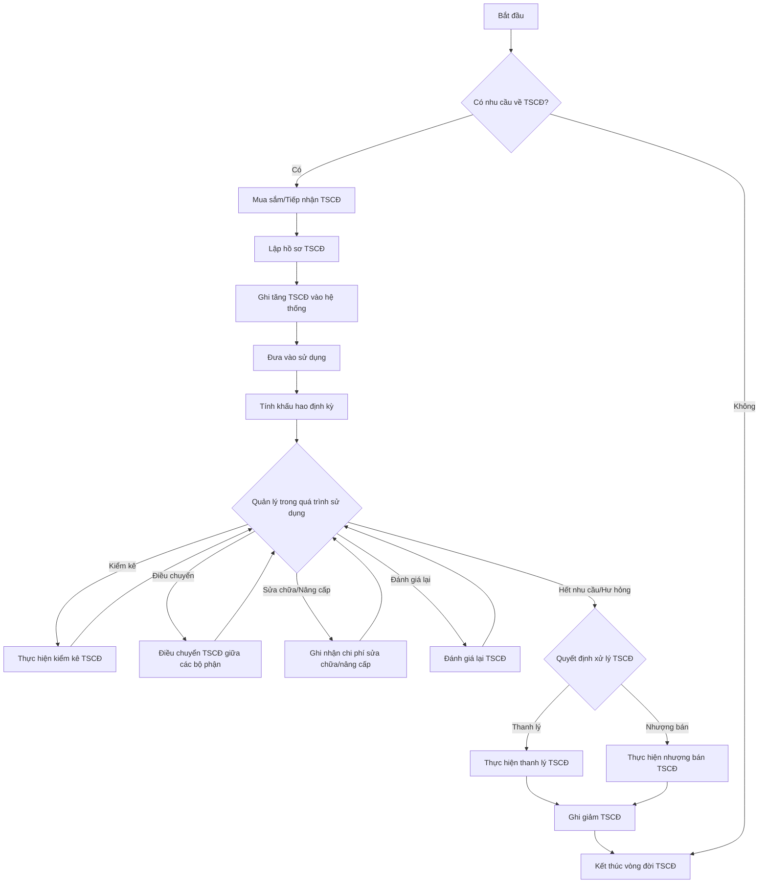
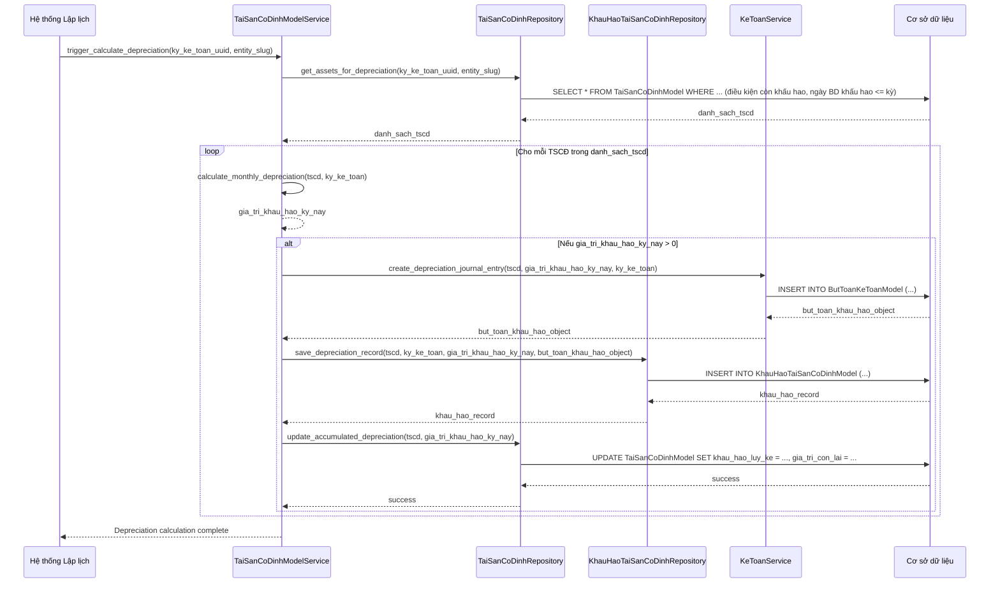

# AST_001_Asset_Quản Lý Tài Sản Cố Định

*Phiên bản: 1.0*
*Người tạo: Cline*
*Ngày tạo: 13/05/2025*
*Cập nhật lần cuối: 13/05/2025*
*Người cập nhật: Cline*

## 1. Tổng Quan Nghiệp Vụ

### 1.1. Mô Tả Nghiệp Vụ
Nghiệp vụ Quản Lý Tài Sản Cố Định (TSCĐ) bao gồm toàn bộ vòng đời của tài sản cố định trong doanh nghiệp. Quá trình này bắt đầu từ việc mua sắm hoặc tiếp nhận tài sản, ghi nhận thông tin ban đầu (ghi tăng), theo dõi quá trình sử dụng, thực hiện tính khấu hao định kỳ, quản lý việc kiểm kê, đánh giá lại giá trị tài sản, ghi nhận các hoạt động sửa chữa, nâng cấp, và cuối cùng là các thủ tục thanh lý hoặc nhượng bán khi tài sản hết thời gian sử dụng hoặc không còn nhu cầu. Hệ thống cần lưu trữ chi tiết các thông tin của mỗi TSCĐ như: mã tài sản, tên tài sản, loại tài sản, nhóm tài sản, ngày mua, ngày đưa vào sử dụng, nguyên giá, bộ phận đang sử dụng, người chịu trách nhiệm quản lý, tình trạng hiện tại, phương pháp tính khấu hao, thời gian sử dụng hữu ích dự kiến, giá trị khấu hao lũy kế, và giá trị còn lại của tài sản.

### 1.2. Phạm Vi Áp Dụng
- **Bộ phận Kế toán**: Chịu trách nhiệm chính trong việc ghi nhận giá trị tài sản, tính toán và hạch toán khấu hao, theo dõi giá trị còn lại, và thực hiện các bút toán liên quan đến tăng, giảm, thanh lý TSCĐ.
- **Bộ phận Quản lý Tài sản (nếu có)**: Chịu trách nhiệm theo dõi tình trạng vật lý, điều chuyển, bảo trì, sửa chữa tài sản.
- **Các Bộ phận sử dụng tài sản**: Chịu trách nhiệm về việc sử dụng và bảo quản tài sản được giao.
- **Ban Giám đốc**: Sử dụng thông tin TSCĐ để ra quyết định đầu tư, quản lý hiệu quả sử dụng tài sản.

### 1.3. Định Nghĩa Thuật Ngữ
| Thuật ngữ | Định nghĩa |
|-----------|------------|
| Tài Sản Cố Định (TSCĐ) (TaiSanCoDinhModel) | Là những tài sản của doanh nghiệp có giá trị lớn, thời gian sử dụng, luân chuyển, thu hồi dự tính kéo dài (thường trên một năm hoặc một chu kỳ kinh doanh) và đáp ứng các tiêu chuẩn ghi nhận TSCĐ theo quy định của pháp luật kế toán. |
| Nguyên Giá | Toàn bộ các chi phí mà doanh nghiệp phải bỏ ra để có được TSCĐ tính đến thời điểm đưa tài sản đó vào trạng thái sẵn sàng sử dụng. |
| Khấu Hao (KhauHaoTaiSanCoDinhModel) | Việc phân bổ một cách có hệ thống giá trị phải khấu hao của TSCĐ trong suốt thời gian sử dụng hữu ích của tài sản đó vào chi phí sản xuất kinh doanh. |
| Giá Trị Khấu Hao Lũy Kế | Tổng số khấu hao đã trích của TSCĐ tính đến một thời điểm nhất định. |
| Giá Trị Còn Lại | Chênh lệch giữa nguyên giá của TSCĐ và giá trị khấu hao lũy kế của TSCĐ đó. |
| Thời Gian Sử Dụng Hữu Ích | Thời gian mà TSCĐ phát huy được tác dụng cho sản xuất, kinh doanh, được xác định dựa trên các yếu tố kỹ thuật, kinh tế và quy định của pháp luật. |
| Ghi Tăng TSCĐ | Quá trình ghi nhận một tài sản mới vào sổ sách kế toán và danh mục quản lý TSCĐ của doanh nghiệp. |
| Ghi Giảm TSCĐ | Quá trình loại bỏ một tài sản ra khỏi sổ sách kế toán và danh mục quản lý TSCĐ do thanh lý, nhượng bán, hoặc các lý do khác. |
| Thanh Lý TSCĐ | Quá trình xử lý TSCĐ khi không còn sử dụng được hoặc không còn nhu cầu sử dụng, thường bao gồm việc bán phế liệu hoặc hủy bỏ. |
| Nhượng Bán TSCĐ | Quá trình bán TSCĐ cho một bên khác. |
| Loại Tài Sản (LoaiTaiSanModel) | Cách phân loại TSCĐ chi tiết hơn, ví dụ: Máy tính xách tay Dell Vostro, Xe Toyota Camry. Tham chiếu AST_004. |
| Nhóm Tài Sản | Cách phân loại TSCĐ tổng quát hơn, ví dụ: Máy móc thiết bị, Phương tiện vận tải, Nhà cửa vật kiến trúc. Thường được định nghĩa trong LoaiTaiSanModel hoặc là một thuộc tính của LoaiTaiSanModel. |
| Bộ Phận Sử Dụng (BoPhanModel) | Đơn vị, phòng ban trực tiếp quản lý và sử dụng TSCĐ. Tham chiếu ORG_001. |
| Lý Do Tăng/Giảm Tài Sản (LyDoTangGiamTaiSanModel) | Nguyên nhân dẫn đến việc tăng hoặc giảm TSCĐ. Tham chiếu AST_003. |
| Kỳ Kế Toán (KyKeToanModel) | Khoảng thời gian xác định để lập báo cáo tài chính (tháng, quý, năm). Khấu hao thường được tính theo kỳ. |

### 1.4. Tài Liệu Liên Quan
| STT | Mã tài liệu | Tên tài liệu | Mô tả |
|-----|-------------|--------------|-------|
| 1   | ACC_001 | Sơ Đồ Tài Khoản | Các tài khoản kế toán sử dụng để hạch toán TSCĐ (TK 211, 214, 627, 641, 642, 811, 711...). |
| 2   | ACC_003 | Bút Toán Kế Toán | Các bút toán ghi tăng, khấu hao, sửa chữa, thanh lý, nhượng bán TSCĐ. |
| 3   | PUR_003 | Quản Lý Hóa Đơn Mua Vào | Hóa đơn mua sắm TSCĐ là cơ sở để ghi tăng nguyên giá. |
| 4   | ORG_001 | Quản Lý Bộ Phận | Thông tin bộ phận sử dụng TSCĐ. |
| 5   | ORG_002 | Quản Lý Nhân Viên | Thông tin người chịu trách nhiệm quản lý TSCĐ. |
| 6   | ORG_004 | Quản lý Bộ Phận Sử Dụng Tài Sản | Liên kết TSCĐ với bộ phận sử dụng. |
| 7   | AST_003 | Quản Lý Lý Do Tăng Giảm Tài Sản | Danh mục các lý do khi ghi tăng hoặc ghi giảm TSCĐ. |
| 8   | AST_004 | Quản Lý Loại Tài Sản Công Cụ | Danh mục các loại TSCĐ, bao gồm thông tin về nhóm tài sản, thời gian khấu hao mặc định. |
| 9   | ACC_XXX | Quản Lý Kỳ Kế Toán (Chưa có) | Thông tin về các kỳ kế toán để tính khấu hao. |

## 2. Quy Trình Nghiệp Vụ

### 2.1. Tổng Quan Quy Trình
Vòng đời của một tài sản cố định bao gồm các giai đoạn chính:
1.  **Mua sắm/Tiếp nhận**: Tài sản được mua mới, nhận góp vốn, hoặc nhận điều chuyển.
2.  **Ghi tăng**: Tài sản được chính thức ghi nhận vào hệ thống với đầy đủ thông tin.
3.  **Sử dụng và Khấu hao**: Tài sản được đưa vào sử dụng và tính khấu hao định kỳ.
4.  **Theo dõi và Quản lý**: Bao gồm kiểm kê, điều chuyển nội bộ, sửa chữa, nâng cấp, đánh giá lại.
5.  **Ghi giảm**: Tài sản được loại khỏi sổ sách do thanh lý, nhượng bán, hoặc lý do khác.

### 2.2. Sơ Đồ Quy Trình (Business Flow) - Quản lý TSCĐ



### 2.3. Chi Tiết Các Bước Quy Trình (Ví dụ: Ghi tăng TSCĐ)
1.  **Tiếp nhận chứng từ**: Kế toán tài sản nhận được bộ chứng từ liên quan đến việc mua sắm hoặc hình thành TSCĐ (Hóa đơn GTGT, hợp đồng mua bán, biên bản giao nhận TSCĐ, biên bản nghiệm thu...).
2.  **Kiểm tra thông tin**: Kiểm tra tính hợp lệ, hợp pháp của chứng từ. Xác định các thông tin cần thiết: tên tài sản, thông số kỹ thuật, ngày mua, đơn vị cung cấp, nguyên giá (bao gồm giá mua và các chi phí liên quan trực tiếp).
3.  **Khai báo TSCĐ**:
    *   Đăng nhập vào hệ thống ERP.
    *   Truy cập chức năng "Ghi tăng Tài sản cố định".
    *   Nhập các thông tin chi tiết:
        *   Mã tài sản (có thể tự động sinh hoặc nhập tay).
        *   Tên tài sản.
        *   Loại tài sản, Nhóm tài sản (chọn từ danh mục AST_004).
        *   Ngày mua, Ngày ghi tăng, Ngày bắt đầu tính khấu hao.
        *   Nguyên giá.
        *   Thời gian sử dụng dự kiến (số tháng).
        *   Phương pháp khấu hao (chọn từ danh sách: Đường thẳng, Số dư giảm dần,...).
        *   Tài khoản Nguyên giá, Tài khoản Khấu hao lũy kế, Tài khoản Chi phí khấu hao (chọn từ ACC_001).
        *   Bộ phận sử dụng (chọn từ ORG_001).
        *   Người chịu trách nhiệm (chọn từ ORG_002, tùy chọn).
        *   Nguồn gốc hình thành (Mua sắm, Xây dựng cơ bản, Góp vốn,...).
        *   Thông tin hóa đơn, nhà cung cấp.
        *   Đính kèm các chứng từ liên quan.
4.  **Lưu và Phê duyệt**:
    *   Hệ thống kiểm tra tính đầy đủ và hợp lệ của dữ liệu.
    *   Lưu thông tin TSCĐ vào cơ sở dữ liệu.
    *   Quy trình phê duyệt (nếu có) được thực hiện.
5.  **Hạch toán kế toán**: Sau khi được phê duyệt, hệ thống tự động hoặc kế toán viên tạo bút toán ghi tăng TSCĐ:
    *   Nợ TK 211 (Nguyên giá TSCĐ)
    *   Nợ TK 133 (Thuế GTGT được khấu trừ - nếu có)
    *   Có TK 111, 112, 331,... (Tùy theo hình thức thanh toán/nguồn gốc)

### 2.4. Sơ Đồ Tuần Tự (Sequence Diagram) - Tính Khấu Hao TSCĐ Định Kỳ



## 3. Yêu Cầu Chức Năng

### 3.1. Danh Sách Chức Năng

| STT | Mã chức năng | Tên chức năng | Mô tả | Độ ưu tiên |
|-----|--------------|---------------|-------|------------|
| 1   | AST_001_F01 | Khai báo/Ghi tăng Tài sản cố định | Cho phép tạo mới hồ sơ TSCĐ. | Cao |
| 2   | AST_001_F02 | Cập nhật thông tin Tài sản cố định | Cho phép sửa đổi thông tin TSCĐ hiện có. | Cao |
| 3   | AST_001_F03 | Tính khấu hao Tài sản cố định | Tự động tính và hạch toán khấu hao TSCĐ theo kỳ. | Cao |
| 4   | AST_001_F04 | Xem danh sách Tài sản cố định | Hiển thị danh sách TSCĐ, hỗ trợ tìm kiếm, lọc, phân trang. | Cao |
| 5   | AST_001_F05 | Xem chi tiết Tài sản cố định | Hiển thị đầy đủ thông tin, lịch sử khấu hao, sửa chữa của TSCĐ. | Cao |
| 6   | AST_001_F06 | Ghi giảm (Thanh lý/Nhượng bán) TSCĐ | Thực hiện quy trình ghi giảm TSCĐ. | Cao |
| 7   | AST_001_F07 | Điều chuyển Tài sản cố định | Ghi nhận việc điều chuyển TSCĐ giữa các bộ phận, địa điểm. | Trung bình |
| 8   | AST_001_F08 | Kiểm kê Tài sản cố định | Hỗ trợ quy trình kiểm kê TSCĐ, đối chiếu sổ sách và thực tế. | Trung bình |
| 9   | AST_001_F09 | Đánh giá lại Tài sản cố định | Ghi nhận việc đánh giá lại nguyên giá, giá trị còn lại, thời gian sử dụng. | Trung bình |
| 10  | AST_001_F10 | Ghi nhận chi phí sửa chữa, nâng cấp TSCĐ | Hạch toán chi phí sửa chữa lớn, nâng cấp làm tăng nguyên giá hoặc ghi vào chi phí. | Trung bình |
| 11  | AST_001_F11 | Báo cáo Tài sản cố định | Cung cấp các báo cáo: Sổ TSCĐ, Bảng tính khấu hao, Báo cáo tăng giảm TSCĐ. | Cao |

### 3.2. Chi Tiết Chức Năng

#### 3.2.1. AST_001_F01: Khai báo/Ghi tăng Tài sản cố định
- **Mô tả**: Chức năng cho phép người dùng (kế toán tài sản) khai báo một TSCĐ mới vào hệ thống.
- **Đầu vào**:
    - `entity_slug`
    - Dữ liệu TSCĐ: `ma_tai_san`, `ten_tai_san`, `loai_tai_san_uuid`, `ngay_mua`, `ngay_ghi_tang`, `ngay_bat_dau_tinh_khau_hao`, `nguyen_gia`, `thoi_gian_su_dung_du_kien` (tháng), `phuong_phap_khau_hao`, `tai_khoan_nguyen_gia_uuid`, `tai_khoan_khau_hao_luy_ke_uuid`, `tai_khoan_chi_phi_khau_hao_uuid`, `bo_phan_su_dung_uuid`, `ly_do_tang_uuid` (AST_003), ...
- **Đầu ra**: Đối tượng `TaiSanCoDinhModel` vừa được tạo. Bút toán ghi tăng TSCĐ.
- **Điều kiện tiên quyết**: `entity_slug` hợp lệ. Các UUID (loại tài sản, tài khoản, bộ phận, lý do tăng) phải tồn tại. `ma_tai_san` là duy nhất trong Entity.
- **Luồng xử lý chính**:
  1. Service kiểm tra `EntityModel`.
  2. Validate dữ liệu đầu vào (tính duy nhất của mã tài sản, sự tồn tại của các FK).
  3. Tạo bản ghi `TaiSanCoDinhModel`.
  4. Tạo bản ghi `LichSuTaiSanCoDinhModel` với `loai_thay_doi` = "Ghi tăng".
  5. Gọi `KeToanService` để tạo bút toán ghi tăng TSCĐ.
- **Giao diện liên quan**: Form khai báo TSCĐ.

#### 3.2.2. AST_001_F03: Tính khấu hao Tài sản cố định
- **Mô tả**: Chức năng được kích hoạt định kỳ (thường là cuối tháng) để tính khấu hao cho tất cả TSCĐ đủ điều kiện.
- **Đầu vào**: `entity_slug`, `ky_ke_toan_uuid`.
- **Đầu ra**: Các bản ghi `KhauHaoTaiSanCoDinhModel` được tạo cho kỳ. Các bút toán khấu hao được hạch toán. Thông tin khấu hao lũy kế và giá trị còn lại trên `TaiSanCoDinhModel` được cập nhật.
- **Luồng xử lý chính**:
  1. Service lấy danh sách TSCĐ cần tính khấu hao trong kỳ.
  2. Với mỗi TSCĐ:
     a. Tính giá trị khấu hao kỳ này dựa trên phương pháp khấu hao đã chọn và các thông số của TSCĐ.
     b. Kiểm tra không khấu hao vượt quá (Giá trị còn lại - Giá trị thu hồi ước tính khi thanh lý).
     c. Tạo bút toán hạch toán chi phí khấu hao.
     d. Tạo bản ghi `KhauHaoTaiSanCoDinhModel`.
     e. Cập nhật `khau_hao_luy_ke_den_ky_truoc`, `gia_tri_con_lai_den_ky_truoc` trên `TaiSanCoDinhModel` cho kỳ tiếp theo (hoặc cập nhật trực tiếp khấu hao lũy kế và giá trị còn lại hiện tại).
- **Giao diện liên quan**: Chức năng chạy hàng loạt, Bảng tính và phân bổ khấu hao.

## 4. Thiết Kế Kỹ Thuật

### 4.1. Kiến Trúc Hệ Thống
Sử dụng Views/APIs, Services (`TaiSanCoDinhModelService`, `KhauHaoService`), Repositories, Models.

### 4.2. API Endpoints

- **Base URL**: `/api/{entity_slug}/tai-san-co-dinh/`
    - `GET /`: Lấy danh sách TSCĐ. (AST_001_F04)
    - `POST /`: Ghi tăng TSCĐ. (AST_001_F01)
    - `GET /{uuid}/`: Lấy chi tiết TSCĐ. (AST_001_F05)
    - `PUT /{uuid}/`: Cập nhật toàn bộ TSCĐ. (AST_001_F02)
    - `PATCH /{uuid}/`: Cập nhật một phần TSCĐ. (AST_001_F02)
- **Tính khấu hao**: `/api/{entity_slug}/tai-san-co-dinh/calculate-depreciation/`
    - `POST /`: Kích hoạt tính khấu hao cho một kỳ. (AST_001_F03)
        - Payload: `{"ky_ke_toan_uuid": "..."}`
- **Thanh lý/Nhượng bán**: `/api/{entity_slug}/tai-san-co-dinh/{uuid}/dispose/`
    - `POST /`: Thực hiện thanh lý/nhượng bán. (AST_001_F06)
        - Payload: `{"ngay_ghi_giam": "...", "ly_do_giam_uuid": "...", "hinh_thuc_giam": "thanh_ly/nhuong_ban", "gia_thu_hoi": "...", ...}`
- **Lịch sử TSCĐ**: `/api/{entity_slug}/tai-san-co-dinh/{uuid}/history/`
    - `GET /`: Lấy lịch sử thay đổi của TSCĐ.
- **Khấu hao TSCĐ (chi tiết)**: `/api/{entity_slug}/tai-san-co-dinh/{uuid}/depreciations/`
    - `GET /`: Lấy lịch sử các kỳ khấu hao của TSCĐ.

### 4.3. Service Logic (`TaiSanCoDinhModelService`)
- Logic ghi tăng, bao gồm tạo bút toán kế toán.
- Logic tính khấu hao cho từng phương pháp (đường thẳng, số dư giảm dần, theo sản lượng).
- Logic ghi giảm (thanh lý, nhượng bán), tính toán lãi/lỗ thanh lý, tạo bút toán.
- Logic điều chuyển, đánh giá lại, sửa chữa, nâng cấp và các bút toán liên quan.
- Cập nhật các giá trị lũy kế trên `TaiSanCoDinhModel`.

### 4.4. Mô Hình Dữ Liệu

#### 4.4.1. Entity Relationship Diagram (ERD)

```mermaid
erDiagram
    ENTITY ||--|{ TAI_SAN_CO_DINH : "quản lý"
    LOAI_TAI_SAN ||--|{ TAI_SAN_CO_DINH : "thuộc loại"
    BO_PHAN ||--o{ TAI_SAN_CO_DINH : "sử dụng"
    NHAN_VIEN ||--o{ TAI_SAN_CO_DINH : "chịu trách nhiệm (tùy chọn)"
    TAI_KHOAN_ACC ("TAI_KHOAN (ACC_001)") ||--o{ TAI_SAN_CO_DINH : "TK Nguyên giá"
    TAI_KHOAN_ACC ||--o{ TAI_SAN_CO_DINH : "TK Khấu hao LK"
    TAI_KHOAN_ACC ||--o{ TAI_SAN_CO_DINH : "TK Chi phí KH"
    TAI_SAN_CO_DINH ||--|{ KHAU_HAO_TSCD : "có các kỳ khấu hao"
    TAI_SAN_CO_DINH ||--|{ LICH_SU_TSCD : "có lịch sử thay đổi"
    KY_KE_TOAN ||--|{ KHAU_HAO_TSCD : "thuộc kỳ"
    BUT_TOAN_KE_TOAN ("BUT_TOAN_KT (ACC_003)") ||--o{ KHAU_HAO_TSCD : "bút toán khấu hao"
    BUT_TOAN_KE_TOAN ||--o{ LICH_SU_TSCD : "bút toán liên quan (tăng, giảm, sửa chữa)"
    LY_DO_TANG_GIAM_TS ("LY_DO_TANG_GIAM (AST_003)") ||--o{ LICH_SU_TSCD : "lý do"
    
    ENTITY { uuid uuid PK }
    LOAI_TAI_SAN { uuid uuid PK; string ten_loai_tai_san }
    BO_PHAN { uuid uuid PK; string ten_bo_phan }
    NHAN_VIEN { uuid uuid PK; string ho_ten }
    TAI_KHOAN_ACC { uuid uuid PK; string so_hieu_tai_khoan }
    KY_KE_TOAN { uuid uuid PK; string ten_ky }
    BUT_TOAN_KE_TOAN { uuid uuid PK }
    LY_DO_TANG_GIAM_TS { uuid uuid PK; string ten_ly_do }

    TAI_SAN_CO_DINH {
        uuid uuid PK
        string ma_tai_san "Mã TSCĐ (unique)"
        string ten_tai_san
        date ngay_mua
        date ngay_ghi_tang
        date ngay_bat_dau_tinh_khau_hao
        decimal nguyen_gia
        integer thoi_gian_su_dung_du_kien "Số tháng"
        string phuong_phap_khau_hao
        string tinh_trang_tai_san
        decimal gia_tri_khau_hao_ky "Tính toán"
        decimal khau_hao_luy_ke "Tính toán"
        decimal gia_tri_con_lai "Tính toán"
        uuid entity_id FK
        uuid loai_tai_san_id FK
        uuid bo_phan_su_dung_id FK
        uuid nguoi_chiu_trach_nhiem_id FK
        uuid tk_nguyen_gia_id FK
        uuid tk_khau_hao_luy_ke_id FK
        uuid tk_chi_phi_khau_hao_id FK
    }

    KHAU_HAO_TSCD {
        uuid uuid PK
        date ngay_tinh_khau_hao
        decimal gia_tri_khau_hao
        decimal khau_hao_luy_ke_ky_nay
        decimal gia_tri_con_lai_ky_nay
        uuid tai_san_co_dinh_id FK
        uuid ky_ke_toan_id FK
        uuid but_toan_khau_hao_id FK
        uuid entity_id FK
    }

    LICH_SU_TSCD {
        uuid uuid PK
        date ngay_thay_doi
        string loai_thay_doi "Ghi tăng, Điều chuyển, Sửa chữa, Đánh giá lại, Thanh lý, Nhượng bán"
        text mo_ta_chi_tiet
        decimal gia_tri_thay_doi
        uuid tai_san_co_dinh_id FK
        uuid bo_phan_su_dung_cu_id FK
        uuid bo_phan_su_dung_moi_id FK
        uuid ly_do_tang_giam_id FK
        uuid but_toan_lien_quan_id FK
        uuid entity_id FK
    }
```

#### 4.4.2. Chi Tiết Bảng Dữ Liệu

##### Bảng: `TaiSanCoDinhModel` (django_ledger_taisancodinhmodel)
- **Mô tả**: Lưu trữ thông tin chính của tài sản cố định.
- **Các cột chính**:
    - `uuid` (UUID, PK).
    - `entity_model` (ForeignKey đến `EntityModel`).
    - `ma_tai_san` (CharField, max_length=50, unique_together_with=`entity_model`).
    - `ten_tai_san` (CharField, max_length=255).
    - `loai_tai_san` (ForeignKey đến `LoaiTaiSanCongCuModel` - AST_004, on_delete=models.PROTECT).
    - `mo_ta` (TextField, null=True, blank=True).
    - `ngay_mua` (DateField).
    - `ngay_ghi_tang` (DateField).
    - `ngay_bat_dau_tinh_khau_hao` (DateField).
    - `nguyen_gia` (DecimalField, max_digits=19, decimal_places=4).
    - `thoi_gian_su_dung_du_kien` (IntegerField, help_text="Số tháng sử dụng hữu ích dự kiến").
    - `phuong_phap_khau_hao` (CharField, max_length=50, choices=(('duong_thang', 'Đường thẳng'), ...)).
    - `tai_khoan_nguyen_gia` (ForeignKey đến `TaiKhoanModel` - ACC_001, related_name='tscd_tk_nguyen_gia', on_delete=models.PROTECT).
    - `tai_khoan_khau_hao_luy_ke` (ForeignKey đến `TaiKhoanModel` - ACC_001, related_name='tscd_tk_khau_hao_luy_ke', on_delete=models.PROTECT).
    - `tai_khoan_chi_phi_khau_hao` (ForeignKey đến `TaiKhoanModel` - ACC_001, related_name='tscd_tk_chi_phi_khau_hao', on_delete=models.PROTECT).
    - `bo_phan_su_dung` (ForeignKey đến `BoPhanModel` - ORG_001, on_delete=models.SET_NULL, null=True, blank=True).
    - `nguoi_chiu_trach_nhiem` (ForeignKey đến `NhanVienModel` - ORG_002, on_delete=models.SET_NULL, null=True, blank=True).
    - `tinh_trang_tai_san` (CharField, max_length=50, default='dang_su_dung', choices=(('dang_su_dung', 'Đang sử dụng'), ('hong_cho_sua_chua', 'Hỏng chờ sửa chữa'), ('da_thanh_ly', 'Đã thanh lý'), ...)).
    - `gia_tri_khau_hao_ky_hien_tai` (DecimalField, default=0, help_text="Giá trị khấu hao của kỳ gần nhất đã tính").
    - `khau_hao_luy_ke` (DecimalField, default=0, help_text="Tổng khấu hao đã trích đến hiện tại").
    - `gia_tri_con_lai` (DecimalField, default=0, help_text="Nguyên giá - Khấu hao lũy kế").
    - `ngay_ghi_giam` (DateField, null=True, blank=True).
    - `ly_do_ghi_giam` (ForeignKey đến `LyDoTangGiamTaiSanModel` - AST_003, on_delete=models.SET_NULL, null=True, blank=True).
    - `created`, `updated`.

##### Bảng: `KhauHaoTaiSanCoDinhModel` (django_ledger_khauhaotaisancodinhmodel)
- **Mô tả**: Ghi nhận chi tiết khấu hao của TSCĐ theo từng kỳ.
- **Các cột chính**:
    - `uuid` (UUID, PK).
    - `entity_model` (ForeignKey đến `EntityModel`).
    - `tai_san_co_dinh` (ForeignKey đến `TaiSanCoDinhModel`, on_delete=models.CASCADE).
    - `ky_ke_toan` (ForeignKey đến `KyKeToanModel` - ACC_XXX, on_delete=models.PROTECT).
    - `ngay_tinh_khau_hao` (DateField).
    - `gia_tri_khau_hao` (DecimalField).
    - `khau_hao_luy_ke_ky_nay` (DecimalField, help_text="Khấu hao lũy kế tính đến cuối kỳ này cho TSCĐ").
    - `gia_tri_con_lai_ky_nay` (DecimalField, help_text="Giá trị còn lại tính đến cuối kỳ này cho TSCĐ").
    - `but_toan_khau_hao` (ForeignKey đến `ButToanKeToanModel` - ACC_003, on_delete=models.PROTECT).
    - `created`, `updated`.

##### Bảng: `LichSuTaiSanCoDinhModel` (django_ledger_lichsutaisancodinhmodel)
- **Mô tả**: Ghi nhận các sự kiện quan trọng trong vòng đời của TSCĐ.
- **Các cột chính**:
    - `uuid` (UUID, PK).
    - `entity_model` (ForeignKey đến `EntityModel`).
    - `tai_san_co_dinh` (ForeignKey đến `TaiSanCoDinhModel`, on_delete=models.CASCADE).
    - `ngay_thuc_hien` (DateField).
    - `loai_su_kien` (CharField, max_length=50, choices=(('ghi_tang', 'Ghi tăng'), ('dieu_chuyen', 'Điều chuyển'), ('sua_chua', 'Sửa chữa'), ('nang_cap', 'Nâng cấp'), ('danh_gia_lai', 'Đánh giá lại'), ('thanh_ly', 'Thanh lý'), ('nhuong_ban', 'Nhượng bán'))).
    - `mo_ta` (TextField).
    - `gia_tri_anh_huong` (DecimalField, null=True, blank=True, help_text="Giá trị sửa chữa, giá trị đánh giá lại tăng/giảm, giá trị thu hồi khi thanh lý/nhượng bán").
    - `bo_phan_su_dung_truoc` (ForeignKey đến `BoPhanModel`, related_name='tscd_lich_su_bo_phan_cu', on_delete=models.SET_NULL, null=True, blank=True).
    - `bo_phan_su_dung_sau` (ForeignKey đến `BoPhanModel`, related_name='tscd_lich_su_bo_phan_moi', on_delete=models.SET_NULL, null=True, blank=True).
    - `ly_do` (ForeignKey đến `LyDoTangGiamTaiSanModel` - AST_003, on_delete=models.SET_NULL, null=True, blank=True).
    - `but_toan_lien_quan` (ForeignKey đến `ButToanKeToanModel` - ACC_003, on_delete=models.SET_NULL, null=True, blank=True).
    - `created`, `updated`.

## 5. Kế Hoạch Kiểm Thử

### 5.1. Phạm Vi Kiểm Thử
- Ghi tăng TSCĐ (thủ công, từ hóa đơn mua hàng).
- Tính khấu hao theo các phương pháp khác nhau (đường thẳng là tối thiểu).
- Cập nhật thông tin TSCĐ (thay đổi bộ phận sử dụng, thời gian khấu hao còn lại sau đánh giá lại).
- Quy trình thanh lý, nhượng bán TSCĐ (tính lãi/lỗ, hạch toán).
- Quy trình điều chuyển TSCĐ.
- Quy trình kiểm kê và xử lý chênh lệch (nếu có).
- Quy trình đánh giá lại TSCĐ.
- Ghi nhận chi phí sửa chữa, nâng cấp.
- Các báo cáo liên quan đến TSCĐ (Sổ TSCĐ, Bảng tính khấu hao, Báo cáo tăng giảm).

### 5.2. Kịch Bản Kiểm Thử (Ví dụ)

| STT | Mã kịch bản | Tên kịch bản | Mô tả | Điều kiện tiên quyết | Các bước | Kết quả mong đợi |
|-----|------------|--------------|-------|---------------------|----------|-----------------|
| 1   | AST_001_TC01 | Ghi tăng TSCĐ mới | Tạo TSCĐ mới từ hóa đơn mua hàng. | User kế toán đăng nhập, có quyền. Entity "E1", Loại TS "MAYTINH", Bộ phận "IT", các TK kế toán liên quan tồn tại. | 1. POST `/api/E1/tai-san-co-dinh/`. 2. Payload: `{"ma_tai_san": "MT001", "ten_tai_san": "Máy tính Dell XPS", "loai_tai_san_uuid": "uuid_mt", "ngay_mua": "2024-01-15", "ngay_ghi_tang": "2024-01-20", "ngay_bat_dau_tinh_khau_hao": "2024-02-01", "nguyen_gia": 25000000, "thoi_gian_su_dung_du_kien": 36, "phuong_phap_khau_hao": "duong_thang", ...}`. | 1. HTTP 201. 2. TSCĐ được tạo. 3. Bút toán ghi tăng được hạch toán. 4. Lịch sử TSCĐ ghi nhận "Ghi tăng". |
| 2   | AST_001_TC02 | Tính khấu hao tháng | Tính khấu hao cho "MT001" vào cuối tháng 2/2024. | TSCĐ "MT001" đã ghi tăng, `ngay_bat_dau_tinh_khau_hao` là 01/02/2024. Kỳ kế toán tháng 2/2024 tồn tại. | 1. POST `/api/E1/tai-san-co-dinh/calculate-depreciation/` với payload `{"ky_ke_toan_uuid": "uuid_ky_t2_2024"}`. | 1. HTTP 200. 2. Bản ghi `KhauHaoTaiSanCoDinhModel` được tạo cho MT001, kỳ T2/2024 với giá trị = 25000000/36. 3. Bút toán khấu hao được hạch toán. 4. `khau_hao_luy_ke` và `gia_tri_con_lai` của MT001 được cập nhật. |
| 3   | AST_001_TC03 | Thanh lý TSCĐ | Thanh lý TSCĐ "MT001" sau 12 tháng sử dụng, thu hồi 5.000.000. | MT001 đã khấu hao 12 tháng. | 1. POST `/api/E1/tai-san-co-dinh/uuid_mt001/dispose/` với payload `{"ngay_ghi_giam": "2025-01-31", "hinh_thuc_giam": "thanh_ly", "gia_thu_hoi": 5000000, ...}`. | 1. HTTP 200. 2. TSCĐ "MT001" cập nhật `tinh_trang_tai_san` = "da_thanh_ly", `ngay_ghi_giam`. 3. Bút toán ghi giảm TSCĐ, ghi nhận thu nhập/chi phí thanh lý được hạch toán. 4. Lịch sử TSCĐ ghi nhận "Thanh lý". |
| 4   | AST_001_TC04 | Xem Sổ Tài Sản Cố Định | Xem báo cáo sổ TSCĐ. | Có ít nhất một TSCĐ. | 1. GET `/api/E1/reports/fixed-asset-ledger/` (ví dụ endpoint báo cáo). | 1. HTTP 200. 2. Dữ liệu báo cáo sổ TSCĐ được trả về đúng. |

## 6. Phụ Lục

### 6.1. Danh Sách Tài Liệu Tham Khảo
- Thông tư 45/2013/TT-BTC Hướng dẫn chế độ quản lý, sử dụng và trích khấu hao TSCĐ.
- Thông tư 200/2014/TT-BTC Hướng dẫn Chế độ kế toán Doanh nghiệp (hoặc các thông tư thay thế/áp dụng).
- Mã nguồn Django Ledger: (Dự kiến) `django_ledger/models/asset.py`, `django_ledger/services/asset.py`.

### 6.2. Danh Mục Thuật Ngữ
(Đã định nghĩa ở mục 1.3)

### 6.3. Lịch Sử Thay Đổi Tài Liệu

| Phiên bản | Ngày | Người thực hiện | Mô tả thay đổi |
|-----------|------|-----------------|---------------|
| 1.0 | 13/05/2025 | Cline | Tạo mới tài liệu. |
