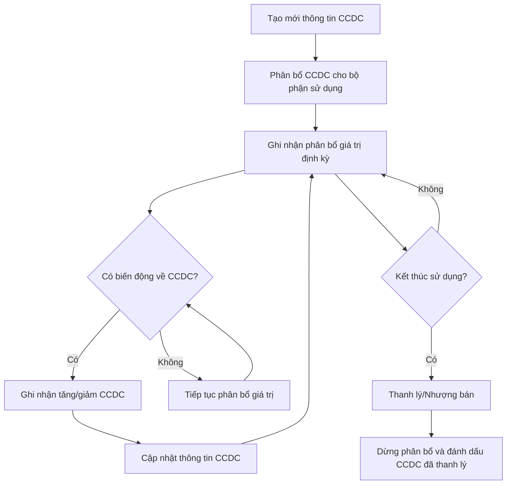
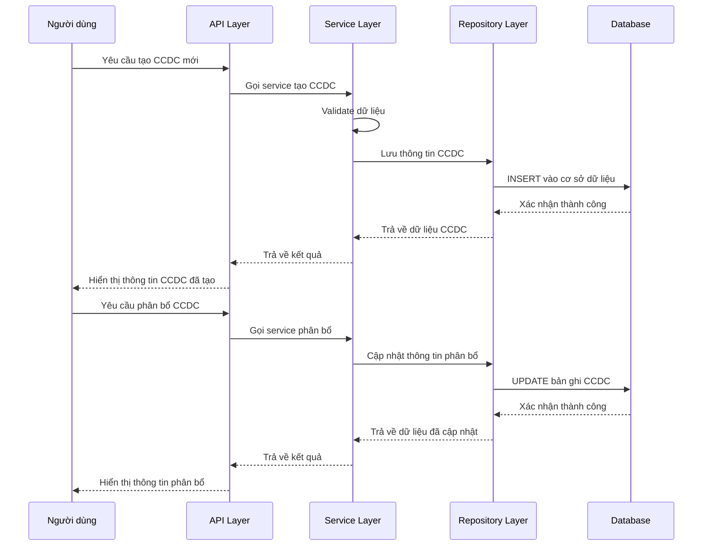
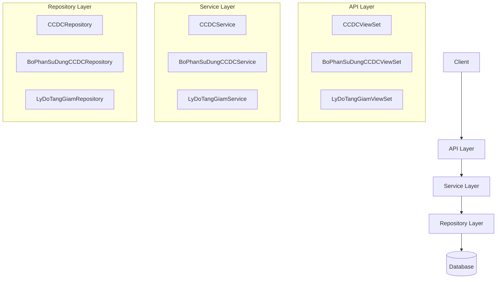
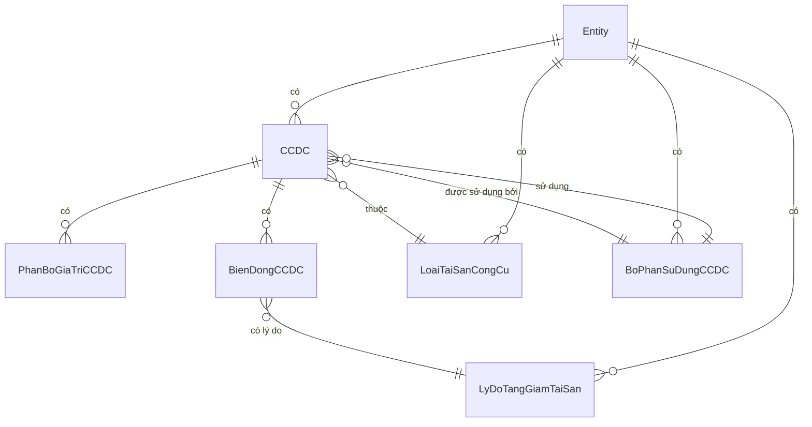

# AST_002_Quản Lý Công Cụ Dụng Cụ

*Phiên bản: 1.0*
*Người tạo: Claude AI Assistant*
*Ngày tạo: 2024-08-01*
*Cập nhật lần cuối: 2024-08-01*
*Người cập nhật: Claude AI Assistant*

## 1. Tổng Quan Nghiệp Vụ

### 1.1. Mô Tả Nghiệp Vụ
Nghiệp vụ Quản Lý Công Cụ Dụng Cụ (CCDC) cho phép doanh nghiệp theo dõi, quản lý, và phân bổ các công cụ, dụng cụ phục vụ hoạt động sản xuất kinh doanh. Khác với tài sản cố định, CCDC thường có giá trị nhỏ hơn, thời gian sử dụng ngắn hơn, nhưng số lượng lớn hơn. Việc quản lý CCDC giúp doanh nghiệp kiểm soát chi phí, tối ưu hóa quá trình sử dụng, phân bổ hợp lý và theo dõi hiệu quả việc sử dụng công cụ dụng cụ.

### 1.2. Phạm Vi Áp Dụng
- Áp dụng cho mọi công cụ, dụng cụ thuộc sở hữu hoặc quản lý của doanh nghiệp.
- Phạm vi bao gồm các bộ phận: Kế toán, Tài chính, Quản lý kho, và các bộ phận sử dụng CCDC.
- Mỗi đơn vị (Entity) trong hệ thống có thể có danh mục CCDC riêng và các quy định quản lý riêng.

### 1.3. Định Nghĩa Thuật Ngữ
| Thuật ngữ | Định nghĩa |
|-----------|------------|
| Công cụ dụng cụ (CCDC) | Những vật dụng có giá trị nhỏ, thời gian sử dụng thường ít hơn 1 năm, phục vụ hoạt động sản xuất kinh doanh. |
| Bộ phận sử dụng CCDC | Phòng ban, đơn vị được giao quản lý và sử dụng CCDC. Trong mã nguồn là `BoPhanSuDungCCDCModel`. |
| Phân bổ CCDC | Quá trình phân bổ giá trị CCDC vào chi phí trong suốt thời gian sử dụng. |
| Lý do tăng giảm | Các nguyên nhân dẫn đến việc tăng hoặc giảm số lượng CCDC như mua mới, thanh lý, mất mát. |
| Loại tài sản công cụ | Phân loại CCDC theo tính chất, mục đích sử dụng. Trong mã nguồn là `LoaiTaiSanCongCuModel`. |

### 1.4. Tài Liệu Liên Quan
| STT | Mã tài liệu | Tên tài liệu | Mô tả |
|-----|-------------|--------------|-------|
| 1   | AST_003 | Quản Lý Lý Do Tăng Giảm Tài Sản | Quy trình quản lý các lý do tăng giảm CCDC |
| 2   | AST_004 | Quản Lý Loại Tài Sản Công Cụ | Quy trình phân loại và quản lý loại tài sản công cụ |
| 3   | ORG_005 | Quản Lý Bộ Phận Sử Dụng CCDC | Quy trình phân bổ và theo dõi CCDC theo bộ phận |
| 4   | ACC_001 | Sơ Đồ Tài Khoản | Tài liệu về cấu trúc tài khoản kế toán, bao gồm tài khoản liên quan tới CCDC |

## 2. Quy Trình Nghiệp Vụ

### 2.1. Tổng Quan Quy Trình
Quy trình quản lý công cụ dụng cụ bao gồm việc thiết lập thông tin CCDC, phân bổ cho các bộ phận sử dụng, ghi nhận tăng giảm, phân bổ giá trị, và báo cáo về hiện trạng sử dụng. Hệ thống lưu trữ thông tin chi tiết về mỗi CCDC, cho phép truy vấn nhanh chóng và xuất báo cáo theo nhiều tiêu chí khác nhau.

### 2.2. Sơ Đồ Quy Trình (Business Flow)

### 2.3. Chi Tiết Các Bước Quy Trình

#### 2.3.1. Tạo Mới Thông Tin CCDC
- **Mô tả**: Người dùng nhập thông tin chi tiết của CCDC mới vào hệ thống.
- **Đầu vào**: Thông tin CCDC (mã, tên, loại, ngày mua, giá trị, thời gian phân bổ, tài khoản kế toán liên quan, v.v.)
- **Đầu ra**: Bản ghi CCDC mới trong hệ thống.
- **Người thực hiện**: Nhân viên kế toán CCDC.
- **Điều kiện tiên quyết**: Loại tài sản công cụ đã được định nghĩa trong hệ thống.
- **Xử lý ngoại lệ**: Thông tin không hợp lệ, mã CCDC bị trùng.

#### 2.3.2. Phân Bổ CCDC Cho Bộ Phận Sử Dụng
- **Mô tả**: Gán CCDC cho một bộ phận sử dụng cụ thể.
- **Đầu vào**: ID CCDC, ID bộ phận sử dụng, ngày bắt đầu sử dụng.
- **Đầu ra**: Liên kết giữa CCDC và bộ phận sử dụng.
- **Người thực hiện**: Nhân viên kế toán CCDC hoặc quản lý kho.
- **Điều kiện tiên quyết**: CCDC và bộ phận sử dụng đã tồn tại trong hệ thống.
- **Xử lý ngoại lệ**: Bộ phận không hợp lệ, CCDC đã được phân bổ cho bộ phận khác.

#### 2.3.3. Ghi Nhận Phân Bổ Giá Trị Định Kỳ
- **Mô tả**: Tính toán và ghi nhận phân bổ giá trị CCDC theo kỳ (tháng, quý, năm).
- **Đầu vào**: ID CCDC, kỳ phân bổ, phương pháp phân bổ.
- **Đầu ra**: Bút toán phân bổ được tạo tự động.
- **Người thực hiện**: Hệ thống (tự động) hoặc nhân viên kế toán.
- **Điều kiện tiên quyết**: CCDC đang trong trạng thái sử dụng, chưa phân bổ hết.
- **Xử lý ngoại lệ**: Lỗi tính toán, thay đổi phương pháp phân bổ.

#### 2.3.4. Ghi Nhận Tăng/Giảm CCDC
- **Mô tả**: Cập nhật thông tin khi CCDC có biến động (bổ sung, mất mát, hư hỏng).
- **Đầu vào**: ID CCDC, loại biến động, giá trị/số lượng thay đổi, lý do.
- **Đầu ra**: Thông tin CCDC được cập nhật, lịch sử biến động được lưu trữ.
- **Người thực hiện**: Nhân viên kế toán CCDC.
- **Điều kiện tiên quyết**: CCDC đang trong trạng thái sử dụng.
- **Xử lý ngoại lệ**: Giá trị không hợp lệ, lý do không rõ ràng.

#### 2.3.5. Thanh Lý/Nhượng Bán CCDC
- **Mô tả**: Ghi nhận việc kết thúc sử dụng CCDC (thanh lý, nhượng bán, hủy bỏ).
- **Đầu vào**: ID CCDC, ngày thanh lý, giá trị thanh lý, lý do thanh lý.
- **Đầu ra**: CCDC được đánh dấu đã thanh lý, bút toán kế toán được tạo.
- **Người thực hiện**: Nhân viên kế toán CCDC.
- **Điều kiện tiên quyết**: CCDC đang trong trạng thái sử dụng.
- **Xử lý ngoại lệ**: Chưa hoàn tất thủ tục thanh lý, giá trị thanh lý không hợp lệ.

### 2.4. Sơ Đồ Tuần Tự (Sequence Diagram)

### 2.5. Luồng Nghiệp Vụ Thay Thế
- **Điều chuyển CCDC**: Chuyển CCDC từ bộ phận này sang bộ phận khác, cập nhật người chịu trách nhiệm.
- **Điều chỉnh giá trị**: Điều chỉnh giá trị CCDC do đánh giá lại, tăng giá trị do nâng cấp.
- **Xử lý CCDC mất mát/hư hỏng**: Ghi nhận tình trạng hư hỏng, mất mát và thực hiện các thủ tục bồi thường, xử lý theo quy định.
- **Nhập kho CCDC đã qua sử dụng**: Xử lý việc nhận lại CCDC từ bộ phận không còn nhu cầu sử dụng.

## 3. Yêu Cầu Chức Năng

### 3.1. Danh Sách Chức Năng

| STT | Mã chức năng | Tên chức năng | Mô tả | Độ ưu tiên |
|-----|--------------|---------------|-------|------------|
| 1   | AST002-LIST | Danh sách CCDC | Xem danh sách CCDC với các bộ lọc | Cao |
| 2   | AST002-CREATE | Tạo mới CCDC | Thêm thông tin CCDC mới vào hệ thống | Cao |
| 3   | AST002-DETAIL | Chi tiết CCDC | Xem thông tin chi tiết của một CCDC | Cao |
| 4   | AST002-UPDATE | Cập nhật CCDC | Sửa đổi thông tin CCDC | Cao |
| 5   | AST002-DELETE | Xóa CCDC | Xóa thông tin CCDC khỏi hệ thống | Cao |
| 6   | AST002-ALLOCATE | Phân bổ CCDC | Phân bổ CCDC cho bộ phận sử dụng | Cao |
| 7   | AST002-DISTRIBUTE | Phân bổ giá trị | Tính và ghi nhận phân bổ giá trị CCDC | Cao |
| 8   | AST002-CHANGE | Ghi nhận biến động | Ghi nhận tăng/giảm số lượng CCDC | Trung bình |
| 9   | AST002-DISPOSE | Thanh lý CCDC | Ghi nhận thanh lý/nhượng bán CCDC | Trung bình |
| 10  | AST002-REPORT | Báo cáo CCDC | Xuất báo cáo về tình hình CCDC | Trung bình |

### 3.2. Chi Tiết Chức Năng

#### 3.2.1. AST002-CREATE: Tạo mới CCDC
- **Mô tả**: Cho phép người dùng nhập thông tin CCDC mới vào hệ thống
- **Đầu vào**: 
  * Thông tin cơ bản: mã CCDC, tên CCDC, loại CCDC
  * Thông tin tài chính: giá trị ban đầu, ngày mua, phương pháp phân bổ, thời gian sử dụng
  * Thông tin kế toán: tài khoản công cụ, tài khoản phân bổ
  * Thông tin khác: vị trí, người quản lý, tình trạng
- **Đầu ra**: Bản ghi CCDC mới được tạo trong hệ thống
- **Điều kiện tiên quyết**: Người dùng đã đăng nhập và có quyền tạo CCDC
- **Luồng xử lý chính**:
  1. Người dùng nhập thông tin CCDC
  2. Hệ thống kiểm tra tính hợp lệ của dữ liệu
  3. Hệ thống kiểm tra mã CCDC có bị trùng không
  4. Hệ thống tạo bản ghi CCDC mới
  5. Hệ thống thông báo tạo CCDC thành công
- **Luồng xử lý thay thế/ngoại lệ**:
  * Dữ liệu không hợp lệ: Hệ thống hiển thị thông báo lỗi
  * Mã CCDC bị trùng: Hệ thống yêu cầu nhập mã khác
- **Giao diện liên quan**: Màn hình tạo mới CCDC

#### 3.2.2. AST002-ALLOCATE: Phân bổ CCDC
- **Mô tả**: Phân bổ CCDC cho một bộ phận sử dụng
- **Đầu vào**: 
  * ID CCDC
  * ID bộ phận sử dụng
  * Ngày bắt đầu sử dụng
  * Người chịu trách nhiệm
  * Số lượng phân bổ
  * Ghi chú (nếu có)
- **Đầu ra**: CCDC được gán cho bộ phận sử dụng
- **Điều kiện tiên quyết**: CCDC và bộ phận đã tồn tại trong hệ thống
- **Luồng xử lý chính**:
  1. Người dùng chọn CCDC cần phân bổ
  2. Người dùng chọn bộ phận sử dụng
  3. Người dùng nhập thông tin phân bổ
  4. Hệ thống kiểm tra tính hợp lệ của dữ liệu
  5. Hệ thống cập nhật thông tin phân bổ
  6. Hệ thống thông báo phân bổ thành công
- **Luồng xử lý thay thế/ngoại lệ**:
  * Số lượng phân bổ vượt quá số lượng có sẵn: Hệ thống hiển thị thông báo lỗi
- **Giao diện liên quan**: Màn hình phân bổ CCDC

## 4. Thiết Kế Kỹ Thuật

### 4.1. Kiến Trúc Hệ Thống
Quản lý công cụ dụng cụ được xây dựng theo kiến trúc 3 lớp:
- **API Layer**: Xử lý request/response, kiểm tra quyền truy cập, định dạng dữ liệu
- **Service Layer**: Xử lý logic nghiệp vụ, kiểm tra hợp lệ dữ liệu
- **Repository Layer**: Tương tác với cơ sở dữ liệu, thực hiện các thao tác CRUD

### 4.2. API Endpoints

#### 4.2.1. Quản Lý CCDC
- **GET /api/{entity_slug}/tools/**: Lấy danh sách CCDC
- **POST /api/{entity_slug}/tools/**: Tạo mới CCDC
- **GET /api/{entity_slug}/tools/{uuid}/**: Xem chi tiết CCDC
- **PUT /api/{entity_slug}/tools/{uuid}/**: Cập nhật toàn bộ thông tin CCDC
- **PATCH /api/{entity_slug}/tools/{uuid}/**: Cập nhật một phần thông tin CCDC
- **DELETE /api/{entity_slug}/tools/{uuid}/**: Xóa CCDC

#### 4.2.2. Phân Bổ CCDC
- **GET /api/{entity_slug}/tool-departments/**: Lấy danh sách bộ phận sử dụng CCDC
- **POST /api/{entity_slug}/tool-departments/**: Tạo mới bộ phận sử dụng CCDC
- **GET /api/{entity_slug}/tool-departments/{uuid}/**: Xem chi tiết bộ phận sử dụng CCDC
- **PUT /api/{entity_slug}/tool-departments/{uuid}/**: Cập nhật thông tin bộ phận sử dụng
- **DELETE /api/{entity_slug}/tool-departments/{uuid}/**: Xóa bộ phận sử dụng

#### 4.2.3. Phân Bổ Giá Trị CCDC
- **POST /api/{entity_slug}/tool-distribution/**: Tính phân bổ giá trị cho CCDC
- **GET /api/{entity_slug}/tool-distribution/history/{tool_uuid}/**: Xem lịch sử phân bổ của CCDC

### 4.3. Service Logic

#### 4.3.1. CCDCService
- **Mô tả**: Xử lý logic nghiệp vụ liên quan đến CCDC
- **Chức năng chính**:
  1. Tạo mới CCDC
  2. Cập nhật thông tin CCDC
  3. Tính phân bổ giá trị CCDC
  4. Phân bổ CCDC cho bộ phận
  5. Ghi nhận tăng/giảm CCDC
  6. Thanh lý CCDC
- **Các dependencies**:
  1. CCDCRepository
  2. BoPhanSuDungCCDCRepository
  3. LyDoTangGiamRepository

#### 4.3.2. BoPhanSuDungCCDCService
- **Mô tả**: Xử lý logic nghiệp vụ liên quan đến bộ phận sử dụng CCDC
- **Chức năng chính**:
  1. Tạo mới bộ phận sử dụng
  2. Cập nhật thông tin bộ phận
  3. Lấy danh sách CCDC của bộ phận
  4. Cập nhật người chịu trách nhiệm
- **Các dependencies**:
  1. BoPhanSuDungCCDCRepository
  2. BoPhanRepository

### 4.4. Mô Hình Dữ Liệu

#### 4.4.1. Entity Relationship Diagram (ERD)

#### 4.4.2. Chi Tiết Bảng Dữ Liệu

##### Bảng: cong_cu_dung_cu
- **Mô tả**: Lưu trữ thông tin về công cụ dụng cụ
- **Các cột chính**:
  * uuid: UUID (khóa chính)
  * entity_model_id: UUID (khóa ngoại đến entity)
  * ma_ccdc: VARCHAR (mã CCDC)
  * ten_ccdc: VARCHAR (tên CCDC)
  * loai_ts_id: UUID (khóa ngoại đến loại tài sản)
  * bo_phan_su_dung_id: UUID (khóa ngoại đến bộ phận sử dụng)
  * so_luong: INTEGER (số lượng)
  * don_vi_tinh: VARCHAR (đơn vị tính)
  * gia_tri_ban_dau: DECIMAL (giá trị ban đầu)
  * gia_tri_con_lai: DECIMAL (giá trị còn lại)
  * ngay_mua: DATE (ngày mua)
  * ngay_bat_dau_su_dung: DATE (ngày bắt đầu sử dụng)
  * thoi_gian_su_dung: INTEGER (thời gian sử dụng, tháng)
  * phuong_phap_phan_bo: VARCHAR (phương pháp phân bổ)
  * tk_ccdc: VARCHAR (tài khoản CCDC)
  * tk_cp: VARCHAR (tài khoản chi phí)
  * tinh_trang: VARCHAR (tình trạng CCDC)
  * status: VARCHAR (trạng thái: active, inactive)
  * created: DATETIME (ngày tạo)
  * updated: DATETIME (ngày cập nhật)

##### Bảng: bo_phan_su_dung_ccdc
- **Mô tả**: Lưu trữ thông tin về bộ phận sử dụng CCDC
- **Các cột chính**:
  * uuid: UUID (khóa chính)
  * entity_model_id: UUID (khóa ngoại đến entity)
  * ma_bp: VARCHAR (mã bộ phận)
  * ten_bp: VARCHAR (tên bộ phận)
  * ten_bp2: VARCHAR (tên bộ phận thay thế)
  * ma_bp_phi_id: UUID (khóa ngoại đến bộ phận phí)
  * ghi_chu: TEXT (ghi chú)
  * status: VARCHAR (trạng thái: 1=active, 0=inactive)
  * created: DATETIME (ngày tạo)
  * updated: DATETIME (ngày cập nhật)

## 5. Kế Hoạch Kiểm Thử

### 5.1. Phạm Vi Kiểm Thử
- Kiểm thử chức năng tạo mới, cập nhật, xóa CCDC
- Kiểm thử chức năng phân bổ CCDC cho bộ phận sử dụng
- Kiểm thử chức năng tính phân bổ giá trị CCDC
- Kiểm thử chức năng ghi nhận tăng/giảm CCDC
- Kiểm thử chức năng thanh lý CCDC
- Kiểm thử các ràng buộc và quyền truy cập

### 5.2. Kịch Bản Kiểm Thử
| STT | Mã kịch bản | Tên kịch bản | Mô tả | Điều kiện tiên quyết | Các bước | Kết quả mong đợi |
|-----|------------|--------------|-------|---------------------|----------|-----------------|
| 1   | TC_AST002_001 | Tạo mới CCDC | Kiểm tra việc tạo mới CCDC | User đã đăng nhập, có quyền tạo CCDC | 1. Truy cập màn hình tạo CCDC 2. Nhập thông tin hợp lệ 3. Nhấn nút Lưu | 1. CCDC được tạo thành công 2. Hệ thống hiển thị thông báo thành công |
| 2   | TC_AST002_002 | Phân bổ CCDC | Kiểm tra việc phân bổ CCDC cho bộ phận | User đã đăng nhập, có CCDC chưa phân bổ | 1. Chọn CCDC cần phân bổ 2. Chọn bộ phận 3. Nhập thông tin phân bổ 4. Nhấn nút Lưu | 1. CCDC được phân bổ thành công 2. Thông tin bộ phận được cập nhật cho CCDC |
| 3   | TC_AST002_003 | Tính phân bổ giá trị | Kiểm tra việc tính phân bổ giá trị CCDC | User đã đăng nhập, có CCDC đang sử dụng | 1. Chọn CCDC 2. Chọn kỳ phân bổ 3. Nhấn nút Tính phân bổ | 1. Phân bổ được tính chính xác 2. Bút toán phân bổ được tạo |
| 4   | TC_AST002_004 | Thanh lý CCDC | Kiểm tra việc thanh lý CCDC | User đã đăng nhập, có CCDC đang sử dụng | 1. Chọn CCDC 2. Nhập thông tin thanh lý 3. Nhấn nút Thanh lý | 1. CCDC được đánh dấu đã thanh lý 2. Bút toán thanh lý được tạo |

## 6. Phụ Lục

### 6.1. Danh Sách Tài Liệu Tham Khảo
- Chuẩn mực kế toán Việt Nam (VAS) về công cụ dụng cụ
- Thông tư 45/2013/TT-BTC về quản lý, sử dụng và trích khấu hao tài sản
- Tài liệu mã nguồn hệ thống ERP-BE (`django_ledger/models/bo_phan_su_dung_ccdc.py`, `django_ledger/models/ly_do_tang_giam_tai_san.py`, etc.)

### 6.2. Danh Mục Thuật Ngữ
(Xem mục 1.3)

### 6.3. Lịch Sử Thay Đổi Tài Liệu
| Phiên bản | Ngày       | Người thực hiện | Mô tả thay đổi |
|-----------|------------|-----------------|----------------|
| 1.0       | 2024-08-01 | Claude AI       | Tạo tài liệu   | 