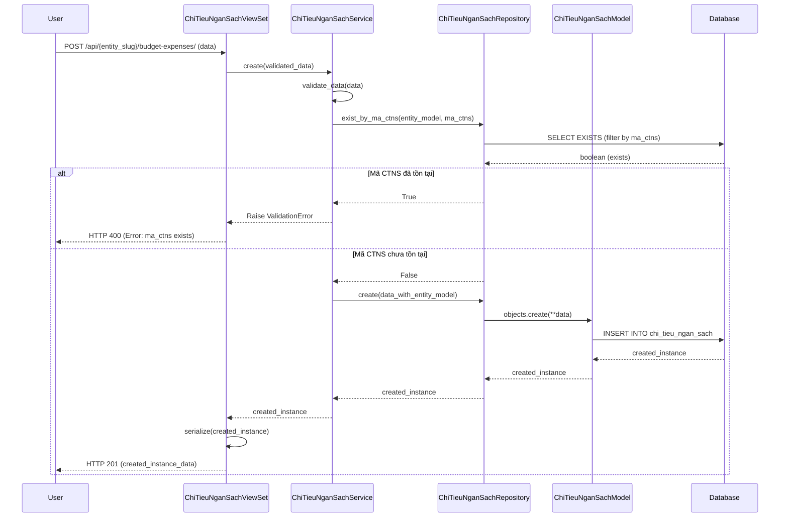
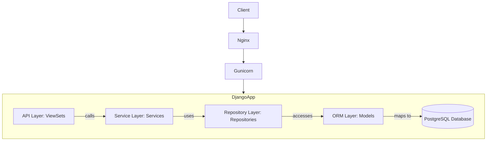

# BUD_001_Budget_Quản Lý Chỉ Tiêu Ngân Sách

*Phiên bản: 1.0*
*Người tạo: Gemini AI Assistant*
*Ngày tạo: 2024-07-30*
*Cập nhật lần cuối: 2024-07-30*
*Người cập nhật: Gemini AI Assistant*

## 1. Tổng Quan Nghiệp Vụ

### 1.1. Mô Tả Nghiệp Vụ
Nghiệp vụ Quản Lý Chỉ Tiêu Ngân Sách (còn được gọi là Quản lý Chi tiêu Ngân sách trong mã nguồn - `ChiTieuNganSach`) cho phép người dùng định nghĩa, theo dõi và quản lý các chỉ tiêu ngân sách của một đơn vị (entity). Mỗi chỉ tiêu ngân sách bao gồm các thông tin định danh, trạng thái, các tài khoản kế toán liên quan (tài khoản chính, tài khoản dư, tài khoản giá trị), và các thuộc tính phân loại (Nợ/Có, Dấu). Nghiệp vụ này cũng hỗ trợ quản lý chi tiết các chỉ tiêu ngân sách, cho phép định nghĩa các dòng chi tiết với các điều kiện lọc cụ thể. Mục đích là cung cấp một công cụ để kiểm soát và phân tích việc sử dụng ngân sách theo các mục tiêu đã đặt ra.

### 1.2. Phạm Vi Áp Dụng
- Áp dụng cho từng Đơn vị (Entity) trong hệ thống.
- Người dùng có quyền quản lý ngân sách, kế toán trưởng, ban giám đốc.

### 1.3. Định Nghĩa Thuật Ngữ
| Thuật ngữ | Định nghĩa |
|-----------|------------|
| Chỉ Tiêu Ngân Sách (CTNS) | Một mục ngân sách được định nghĩa với mã, tên, trạng thái, và các tài khoản kế toán liên quan. Trong mã nguồn được gọi là `ChiTieuNganSachModel`. |
| Chi Tiết Chỉ Tiêu Ngân Sách | Các dòng chi tiết cụ thể hóa một Chỉ Tiêu Ngân Sách, có thể bao gồm các điều kiện lọc. Trong mã nguồn được gọi là `ChiTieuNganSachChiTietModel`. |
| Đơn vị (Entity) | Tổ chức hoặc công ty mà chỉ tiêu ngân sách được áp dụng. |
| `ma_ctns` | Mã định danh duy nhất cho một chỉ tiêu ngân sách trong một đơn vị. |
| `tk` | Tài khoản kế toán chính liên quan đến chỉ tiêu. |
| `tk_du` | Tài khoản kế toán dư liên quan đến chỉ tiêu. |
| `tk_gt` | Tài khoản kế toán giá trị liên quan đến chỉ tiêu. |
| `id_dt_loc` | ID của đối tượng được sử dụng để lọc trong chi tiết chỉ tiêu ngân sách. |
| `ds_loc` | Mô tả về điều kiện lọc trong chi tiết chỉ tiêu ngân sách. |

### 1.4. Tài Liệu Liên Quan
| STT | Mã tài liệu | Tên tài liệu | Mô tả |
|-----|-------------|--------------|-------|
| 1   | `django_ledger/models/chi_tieu_ngan_sach.py` | Model Định Nghĩa Chỉ Tiêu Ngân Sách | Định nghĩa cấu trúc dữ liệu cho `ChiTieuNganSachModel` và `ChiTieuNganSachChiTietModel`. |
| 2   | `django_ledger/services/chi_tieu_ngan_sach/service.py` | Service Logic Chỉ Tiêu Ngân Sách | Logic nghiệp vụ cho việc tạo, cập nhật, xóa, truy vấn Chỉ Tiêu Ngân Sách và chi tiết. |
| 3   | `django_ledger/api/views/chi_tieu_ngan_sach.py` | API Endpoints Chỉ Tiêu Ngân Sách | Các điểm cuối API để tương tác với nghiệp vụ Chỉ Tiêu Ngân Sách. |
| 4   | `django_ledger/api/serializers/chi_tieu_ngan_sach.py` | Serializers Chỉ Tiêu Ngân Sách | Định dạng dữ liệu JSON cho API. |
| 5   | `django_ledger/repositories/chi_tieu_ngan_sach/repository.py` | Repository Chỉ Tiêu Ngân Sách | Lớp truy cập dữ liệu cho Chỉ Tiêu Ngân Sách. |

## 2. Quy Trình Nghiệp Vụ

### 2.1. Tổng Quan Quy Trình
Người dùng (thường là kế toán hoặc người quản lý ngân sách) sẽ tương tác với hệ thống thông qua giao diện người dùng hoặc API để thực hiện các thao tác CRUD (Create, Read, Update, Delete) trên các Chỉ Tiêu Ngân Sách và Chi Tiết Chỉ Tiêu Ngân Sách. Hệ thống sẽ validate dữ liệu đầu vào, xử lý logic nghiệp vụ thông qua các services và repositories, sau đó lưu trữ hoặc truy xuất dữ liệu từ cơ sở dữ liệu.

### 2.2. Sơ Đồ Quy Trình (Business Flow)

```mermaid
flowchart TD
    A[Người dùng yêu cầu thao tác CTNS] --> B{API Gateway nhận yêu cầu};
    B --> C[Xác thực & Ủy quyền];
    C --> D[ChiTieuNganSachViewSet];
    D --> E[ChiTieuNganSachService];
    E --> F[ChiTieuNganSachRepository];
    F --> G[(Cơ sở dữ liệu)];
    G --> F;
    F --> E;
    E --> D;
    D --> B;
    B --> A[Trả kết quả cho người dùng];

    subgraph "Quản lý CTNS Chính"
        direction LR
        AA[Tạo mới CTNS] --> AB{Validate dữ liệu CTNS};
        AB -- hợp lệ --> AC[Lưu CTNS (Repository)];
        AB -- không hợp lệ --> AD[Báo lỗi];
        AE[Xem danh sách/chi tiết CTNS] --> AF[Truy vấn CTNS (Service)];
        AG[Cập nhật CTNS] --> AH{Validate dữ liệu CTNS};
        AH -- hợp lệ --> AI[Cập nhật CTNS (Repository)];
        AH -- không hợp lệ --> AD;
        AJ[Xóa CTNS] --> AK[Xóa CTNS (Repository)];
    end

    subgraph "Quản lý Chi Tiết CTNS"
        direction LR
        BA[Tạo mới Chi Tiết CTNS] --> BB{Validate dữ liệu Chi Tiết};
        BB -- hợp lệ --> BC[Lưu Chi Tiết CTNS (Repository)];
        BB -- không hợp lệ --> BD[Báo lỗi];
        BE[Xem danh sách/chi tiết Chi Tiết CTNS] --> BF[Truy vấn Chi Tiết CTNS (Service)];
        BG[Cập nhật Chi Tiết CTNS] --> BH{Validate dữ liệu Chi Tiết};
        BH -- hợp lệ --> BI[Cập nhật Chi Tiết CTNS (Repository)];
        BH -- không hợp lệ --> BD;
        BJ[Xóa Chi Tiết CTNS] --> BK[Xóa Chi Tiết CTNS (Repository)];
    end
    D --> AA & AE & AG & AJ
    D --> BA & BE & BG & BJ
```

### 2.3. Chi Tiết Các Bước Quy Trình

#### 2.3.1. Tạo Mới Chỉ Tiêu Ngân Sách
- **Mô tả**: Người dùng nhập thông tin để tạo một chỉ tiêu ngân sách mới.
- **Đầu vào**: Dữ liệu chỉ tiêu ngân sách (mã, tên, trạng thái, nợ/có, dấu, các tài khoản,...).
- **Đầu ra**: Chỉ tiêu ngân sách mới được tạo thành công hoặc thông báo lỗi.
- **Người thực hiện**: Kế toán, Quản lý ngân sách.
- **Điều kiện tiên quyết**: Đăng nhập vào hệ thống, có quyền tạo chỉ tiêu ngân sách cho đơn vị. Mã chỉ tiêu ngân sách (`ma_ctns`) phải là duy nhất trong đơn vị.
- **Xử lý ngoại lệ**: Dữ liệu không hợp lệ (thiếu trường, sai định dạng), mã CTNS đã tồn tại, đơn vị không tồn tại.

#### 2.3.2. Xem/Tìm Kiếm Chỉ Tiêu Ngân Sách
- **Mô tả**: Người dùng xem danh sách hoặc chi tiết một chỉ tiêu ngân sách. Có thể tìm kiếm theo mã, tên, trạng thái.
- **Đầu vào**: UUID của chỉ tiêu (để xem chi tiết), hoặc các tiêu chí tìm kiếm (mã, trạng thái), thông tin phân trang.
- **Đầu ra**: Danh sách hoặc chi tiết chỉ tiêu ngân sách.
- **Người thực hiện**: Mọi người dùng có quyền xem.
- **Điều kiện tiên quyết**: Đăng nhập vào hệ thống.
- **Xử lý ngoại lệ**: Chỉ tiêu không tồn tại.

#### 2.3.3. Cập Nhật Chỉ Tiêu Ngân Sách
- **Mô tả**: Người dùng thay đổi thông tin của một chỉ tiêu ngân sách đã có.
- **Đầu vào**: UUID của chỉ tiêu và dữ liệu cần cập nhật.
- **Đầu ra**: Chỉ tiêu ngân sách được cập nhật thành công hoặc thông báo lỗi.
- **Người thực hiện**: Kế toán, Quản lý ngân sách.
- **Điều kiện tiên quyết**: Đăng nhập, có quyền sửa. Chỉ tiêu phải tồn tại. Nếu `ma_ctns` thay đổi, mã mới không được trùng.
- **Xử lý ngoại lệ**: Dữ liệu không hợp lệ, chỉ tiêu không tồn tại, mã CTNS mới bị trùng.

#### 2.3.4. Xóa Chỉ Tiêu Ngân Sách
- **Mô tả**: Người dùng xóa một chỉ tiêu ngân sách.
- **Đầu vào**: UUID của chỉ tiêu.
- **Đầu ra**: Thông báo xóa thành công hoặc lỗi.
- **Người thực hiện**: Kế toán, Quản lý ngân sách.
- **Điều kiện tiên quyết**: Đăng nhập, có quyền xóa. Chỉ tiêu phải tồn tại.
- **Xử lý ngoại lệ**: Chỉ tiêu không tồn tại. (Lưu ý: Cần xem xét việc xóa mềm hay xóa cứng, và các ràng buộc liên quan đến chi tiết).

*(Các bước tương tự áp dụng cho Quản lý Chi Tiết Chỉ Tiêu Ngân Sách)*

### 2.4. Sơ Đồ Tuần Tự (Sequence Diagram) - Tạo mới Chỉ Tiêu Ngân Sách



### 2.5. Luồng Nghiệp Vụ Thay Thế
- **Cập nhật `ma_ctns`**: Khi cập nhật `ma_ctns`, hệ thống phải kiểm tra tính duy nhất của `ma_ctns` mới.
- **Phân trang và sắp xếp**: Khi lấy danh sách, người dùng có thể yêu cầu phân trang và sắp xếp theo các trường được hỗ trợ.

## 3. Yêu Cầu Chức Năng

### 3.1. Danh Sách Chức Năng

| STT | Mã chức năng | Tên chức năng | Mô tả | Độ ưu tiên |
|-----|--------------|---------------|-------|------------|
| 1   | BUD001-CTNS-LIST | Xem danh sách Chỉ Tiêu Ngân Sách | Lấy danh sách các chỉ tiêu ngân sách, hỗ trợ lọc theo `ma_ctns`, `status`, phân trang và sắp xếp. | Cao |
| 2   | BUD001-CTNS-CREATE | Tạo mới Chỉ Tiêu Ngân Sách | Tạo một chỉ tiêu ngân sách mới cho đơn vị. | Cao |
| 3   | BUD001-CTNS-RETRIEVE | Xem chi tiết Chỉ Tiêu Ngân Sách | Lấy thông tin chi tiết của một chỉ tiêu ngân sách bằng UUID. | Cao |
| 4   | BUD001-CTNS-UPDATE | Cập nhật Chỉ Tiêu Ngân Sách | Cập nhật thông tin của một chỉ tiêu ngân sách đã có. | Cao |
| 5   | BUD001-CTNS-PARTIAL-UPDATE | Cập nhật một phần Chỉ Tiêu Ngân Sách | Cập nhật một phần thông tin của một chỉ tiêu ngân sách đã có. | Cao |
| 6   | BUD001-CTNS-DELETE | Xóa Chỉ Tiêu Ngân Sách | Xóa một chỉ tiêu ngân sách. | Cao |
| 7   | BUD001-CTNSCT-LIST | Xem danh sách Chi Tiết CTNS | Lấy danh sách chi tiết của các chỉ tiêu ngân sách, hỗ trợ lọc, phân trang. | Cao |
| 8   | BUD001-CTNSCT-CREATE | Tạo mới Chi Tiết CTNS | Tạo một dòng chi tiết mới cho một Chỉ Tiêu Ngân Sách. | Cao |
| 9   | BUD001-CTNSCT-RETRIEVE | Xem thông tin Chi Tiết CTNS | Lấy thông tin chi tiết của một dòng chi tiết CTNS bằng UUID. | Cao |
| 10  | BUD001-CTNSCT-UPDATE | Cập nhật Chi Tiết CTNS | Cập nhật thông tin của một dòng chi tiết CTNS đã có. | Cao |
| 11  | BUD001-CTNSCT-PARTIAL-UPDATE | Cập nhật một phần Chi Tiết CTNS | Cập nhật một phần thông tin của một dòng chi tiết CTNS đã có. | Cao |
| 12  | BUD001-CTNSCT-DELETE | Xóa Chi Tiết CTNS | Xóa một dòng chi tiết CTNS. | Cao |

### 3.2. Chi Tiết Chức Năng

#### 3.2.1. BUD001-CTNS-CREATE: Tạo mới Chỉ Tiêu Ngân Sách
- **Mô tả**: Cho phép tạo một chỉ tiêu ngân sách mới.
- **Đầu vào**: Dữ liệu JSON chứa các trường: `ma_ctns`, `ten_ctns`, `ten_ctns2` (optional), `status` (default '1'), `no_co`, `dau`, `tk`, `tk_du`, `tk_gt`. `entity_model` sẽ được xác định từ `entity_slug` trong URL.
- **Đầu ra**: Dữ liệu JSON của chỉ tiêu ngân sách vừa tạo.
- **Điều kiện tiên quyết**: `ma_ctns` phải là duy nhất cho `entity_model`. Các trường bắt buộc phải có.
- **Luồng xử lý chính**:
  1. `ChiTieuNganSachViewSet` nhận request POST.
  2. Validate dữ liệu bằng `ChiTieuNganSachModelSerializer`.
  3. Gắn `entity_model` dựa trên `entity_slug`.
  4. Gọi `ChiTieuNganSachService.create()`:
     a. Gọi `validate_data()` để kiểm tra các trường bắt buộc.
     b. Kiểm tra `ma_ctns` đã tồn tại chưa bằng `ChiTieuNganSachRepository.exist_by_ma_ctns()`. Nếu có, báo lỗi.
     c. Gọi `ChiTieuNganSachRepository.create()` để lưu vào DB.
  5. Trả về dữ liệu đã serialize của instance mới tạo với HTTP status 201.
- **Luồng xử lý thay thế/ngoại lệ**:
  - Dữ liệu không hợp lệ: Trả về HTTP 400 với chi tiết lỗi.
  - `ma_ctns` đã tồn tại: Trả về HTTP 400 với lỗi.
  - `entity_slug` không hợp lệ: Trả về HTTP 404.
- **Giao diện liên quan**: Form tạo mới Chỉ Tiêu Ngân Sách.

*(Các chức năng khác như LIST, RETRIEVE, UPDATE, DELETE cho CTNS và CTNSCT sẽ được mô tả tương tự, dựa trên các method trong ViewSet và Service tương ứng.)*

## 4. Thiết Kế Kỹ Thuật

### 4.1. Kiến Trúc Hệ Thống
Nghiệp vụ này tuân theo kiến trúc 3 lớp tiêu chuẩn của Django REST framework:
- **View (API Layer)**: `ChiTieuNganSachViewSet` và `ChiTieuNganSachChiTietViewSet` xử lý các HTTP request/response, xác thực, và gọi các services.
- **Service Layer**: `ChiTieuNganSachService` và `ChiTieuNganSachChiTietService` chứa logic nghiệp vụ chính, điều phối hoạt động giữa View và Repository, thực hiện validation.
- **Repository Layer**: `ChiTieuNganSachRepository` và `ChiTieuNganSachChiTietRepository` chịu trách nhiệm tương tác trực tiếp với cơ sở dữ liệu thông qua Django ORM (`ChiTieuNganSachModel`, `ChiTieuNganSachChiTietModel`).



### 4.2. API Endpoints

#### 4.2.1. Chỉ Tiêu Ngân Sách (`ChiTieuNganSachModel`)
- **Mô tả**: Quản lý các chỉ tiêu ngân sách chính.
- **Base URL**: `/api/{entity_slug}/budget-expenses/`
- **Endpoints**:
  - `GET /`: Lấy danh sách các chỉ tiêu ngân sách (hỗ trợ lọc, sắp xếp, phân trang).
    - Query params: `ma_ctns`, `status`, `page`, `page_size`, `order_by`.
  - `POST /`: Tạo một chỉ tiêu ngân sách mới.
  - `GET /{uuid}/`: Lấy chi tiết một chỉ tiêu ngân sách.
  - `PUT /{uuid}/`: Cập nhật toàn bộ một chỉ tiêu ngân sách.
  - `PATCH /{uuid}/`: Cập nhật một phần một chỉ tiêu ngân sách.
  - `DELETE /{uuid}/`: Xóa một chỉ tiêu ngân sách.

#### 4.2.2. Chi Tiết Chỉ Tiêu Ngân Sách (`ChiTieuNganSachChiTietModel`)
- **Mô tả**: Quản lý các dòng chi tiết cho mỗi chỉ tiêu ngân sách.
- **Base URL**: `/api/{entity_slug}/budget-expense-details/`
- **Endpoints**:
  - `GET /`: Lấy danh sách các chi tiết chỉ tiêu ngân sách (hỗ trợ lọc theo `chi_tieu_ngan_sach` (FK), `ma_ctns`, phân trang, sắp xếp).
    - Query params: `chi_tieu_ngan_sach_id` (UUID của CTNS cha), `ma_ctns`, `page`, `page_size`, `order_by`.
  - `POST /`: Tạo một chi tiết chỉ tiêu ngân sách mới.
  - `GET /{uuid}/`: Lấy chi tiết một dòng chi tiết chỉ tiêu ngân sách.
  - `PUT /{uuid}/`: Cập nhật toàn bộ một dòng chi tiết.
  - `PATCH /{uuid}/`: Cập nhật một phần một dòng chi tiết.
  - `DELETE /{uuid}/`: Xóa một dòng chi tiết.

### 4.3. Service Logic

#### 4.3.1. `ChiTieuNganSachService`
- **Mô tả**: Cung cấp logic nghiệp vụ cho `ChiTieuNganSachModel`.
- **Chức năng chính**:
  1. `validate_data(data)`: Kiểm tra các trường bắt buộc (`ma_ctns`, `ten_ctns`, `no_co`, `dau`, `tk`, `tk_du`, `tk_gt`).
  2. `create(data)`:
     - Validate dữ liệu.
     - Kiểm tra `ma_ctns` đã tồn tại cho đơn vị chưa.
     - Lấy `entity_model` từ `entity_slug`.
     - Gọi `repository.create()`.
  3. `update(uuid, data)`:
     - Lấy instance.
     - Nếu `ma_ctns` thay đổi, kiểm tra `ma_ctns` mới đã tồn tại chưa.
     - Gọi `repository.update()`.
  4. `delete(uuid)`: Lấy instance và gọi `repository.delete()`.
  5. `get_by_uuid(uuid)`: Gọi `repository.get_by_uuid()`.
  6. `get_by_ma_ctns(ma_ctns)`: Lấy `entity_model` và gọi `repository.get_by_ma_ctns()`.
  7. `get_list(...)`: Lấy `entity_model` và gọi `repository.get_list()` với các tham số lọc, phân trang, sắp xếp.
- **Các dependencies**: `ChiTieuNganSachRepository`, `EntityModel`.
- **Sơ đồ luồng xử lý (Ví dụ: create)**:
```mermaid
flowchart TD
    A[Service.create(data)] --> B[validate_data(data)]
    B --> C{Dữ liệu hợp lệ?}
    C --Không--> E[Raise ValidationError]
    C --Có--> F[repository.exist_by_ma_ctns(entity, ma_ctns)]
    F --> G{ma_ctns đã tồn tại?}
    G --Có--> E
    G --Không--> H[repository.create(data_with_entity)]
    H --> I[Return created_instance]
```

#### 4.3.2. `ChiTieuNganSachChiTietService`
- **Mô tả**: Cung cấp logic nghiệp vụ cho `ChiTieuNganSachChiTietModel`.
- **Chức năng chính**: Tương tự `ChiTieuNganSachService` nhưng cho model chi tiết.
  1. `validate_data(data)`: Kiểm tra các trường bắt buộc (`chi_tieu_ngan_sach_id`, `ma_ctns`, `line`, `id_dt_loc`, `ds_loc`).
  2. `create(data)`:
      - Validate dữ liệu.
      - Lấy `entity_model` từ `entity_slug`.
      - Kiểm tra `chi_tieu_ngan_sach` (FK) có tồn tại không.
      - Gọi `repository.create()`.
  *(Các hàm update, delete, get_by_uuid, get_list tương tự)*
- **Các dependencies**: `ChiTieuNganSachChiTietRepository`, `EntityModel`, `ChiTieuNganSachModel`.

### 4.4. Mô Hình Dữ Liệu

#### 4.4.1. Entity Relationship Diagram (ERD)

```mermaid
erDiagram
    EntityModel ||--o{ ChiTieuNganSachModel : "has"
    ChiTieuNganSachModel ||--o{ ChiTieuNganSachChiTietModel : "details_in"

    EntityModel {
        UUID uuid PK
        string slug
        string name
        # ... other fields
    }

    ChiTieuNganSachModel {
        UUID uuid PK
        UUID entity_model_id FK
        string ma_ctns "Mã CTNS (unique per entity)"
        string ten_ctns "Tên CTNS"
        string ten_ctns2 "Tên CTNS 2 (alt)"
        string status "Trạng thái (0/1)"
        string no_co "Nợ/Có"
        string dau "Dấu (+/-)"
        string tk "Tài khoản"
        string tk_du "Tài khoản dư"
        string tk_gt "Tài khoản giá trị"
        datetime created
        datetime updated
    }

    ChiTieuNganSachChiTietModel {
        UUID uuid PK
        UUID entity_model_id FK
        UUID chi_tieu_ngan_sach_id FK "Refers to ChiTieuNganSachModel"
        string ma_ctns "Mã CTNS (tham chiếu)"
        int line "Thứ tự dòng"
        int id_dt_loc "ID đối tượng lọc"
        string ds_loc "Mô tả lọc"
        datetime created
        datetime updated
    }
```

#### 4.4.2. Chi Tiết Bảng Dữ Liệu

##### Bảng: `chi_tieu_ngan_sach` (mapped from `ChiTieuNganSachModel`)
- **Mô tả**: Lưu trữ thông tin các chỉ tiêu ngân sách chính.
- **Các cột chính**:
  - `uuid` (PK, UUID): Định danh duy nhất.
  - `entity_model_id` (FK, UUID): Liên kết đến bảng `entity`.
  - `ma_ctns` (CharField(50)): Mã chỉ tiêu ngân sách, duy nhất trong phạm vi `entity_model`.
  - `ten_ctns` (CharField(255)): Tên chỉ tiêu ngân sách.
  - `ten_ctns2` (CharField(255), nullable): Tên thay thế.
  - `status` (CharField(10), default '1'): Trạng thái (ví dụ: '1' = active, '0' = inactive).
  - `no_co` (CharField(10)): Chỉ định Nợ hoặc Có.
  - `dau` (CharField(10)): Dấu (+/-).
  - `tk` (CharField(50)): Tài khoản kế toán.
  - `tk_du` (CharField(50)): Tài khoản dư.
  - `tk_gt` (CharField(50)): Tài khoản giá trị.
  - `created` (DateTimeField): Thời điểm tạo.
  - `updated` (DateTimeField): Thời điểm cập nhật cuối.
- **Indexes**: (`entity_model`, `ma_ctns`), (`status`).
- **Unique Together**: (`entity_model`, `ma_ctns`).

##### Bảng: `chi_tieu_ngan_sach_chi_tiet` (mapped from `ChiTieuNganSachChiTietModel`)
- **Mô tả**: Lưu trữ các dòng chi tiết cho mỗi chỉ tiêu ngân sách.
- **Các cột chính**:
  - `uuid` (PK, UUID): Định danh duy nhất.
  - `entity_model_id` (FK, UUID): Liên kết đến bảng `entity`.
  - `chi_tieu_ngan_sach_id` (FK, UUID): Liên kết đến bảng `chi_tieu_ngan_sach`.
  - `ma_ctns` (CharField(50)): Mã chỉ tiêu ngân sách (tham chiếu, có thể là từ CTNS cha).
  - `line` (IntegerField): Số thứ tự dòng.
  - `id_dt_loc` (IntegerField): ID đối tượng lọc.
  - `ds_loc` (CharField(255)): Mô tả/điều kiện lọc.
  - `created` (DateTimeField): Thời điểm tạo.
  - `updated` (DateTimeField): Thời điểm cập nhật cuối.
- **Indexes**: (`entity_model`, `chi_tieu_ngan_sach`), (`entity_model`, `ma_ctns`).
- **Ordering**: `line`.

## 5. Kế Hoạch Kiểm Thử

### 5.1. Phạm Vi Kiểm Thử
- Kiểm thử các chức năng CRUD cho Chỉ Tiêu Ngân Sách (`ChiTieuNganSachModel`).
- Kiểm thử các chức năng CRUD cho Chi Tiết Chỉ Tiêu Ngân Sách (`ChiTieuNganSachChiTietModel`).
- Kiểm thử validation dữ liệu đầu vào (trường bắt buộc, định dạng, tính duy nhất của `ma_ctns`).
- Kiểm thử logic phân quyền (ai được tạo/sửa/xóa).
- Kiểm thử API endpoints (status codes, response format, pagination, filtering, ordering).
- Kiểm thử ràng buộc giữa `ChiTieuNganSachModel` và `ChiTieuNganSachChiTietModel`.

### 5.2. Kịch Bản Kiểm Thử
| STT | Mã kịch bản | Tên kịch bản | Mô tả | Điều kiện tiên quyết | Các bước | Kết quả mong đợi |
|-----|------------|--------------|-------|---------------------|----------|-----------------|\
| 1   | TC_BUD001_CTNS_001 | Tạo CTNS thành công | Kiểm tra tạo mới CTNS với dữ liệu hợp lệ. | User đăng nhập, có quyền. `entity_slug` hợp lệ. | 1. Gửi POST request tới `/api/{entity_slug}/budget-expenses/` với data hợp lệ. | 1. Response status 201. 2. Response body chứa thông tin CTNS đã tạo. 3. Dữ liệu được lưu đúng trong DB. |
| 2   | TC_BUD001_CTNS_002 | Tạo CTNS thất bại - `ma_ctns` trùng | Kiểm tra không cho tạo CTNS nếu `ma_ctns` đã tồn tại. | User đăng nhập. `ma_ctns` đã tồn tại cho entity. | 1. Gửi POST request với `ma_ctns` đã có. | 1. Response status 400. 2. Thông báo lỗi về `ma_ctns` bị trùng. |
| 3   | TC_BUD001_CTNS_003 | Lấy danh sách CTNS | Kiểm tra lấy danh sách CTNS, có phân trang và lọc. | Có sẵn vài CTNS. | 1. Gửi GET request tới `/api/{entity_slug}/budget-expenses/?page=1&page_size=5&status=1`. | 1. Response status 200. 2. Response body chứa danh sách CTNS (tối đa 5), status=1, thông tin phân trang. |
| ... | ...          | ...            | ...   | ...                 | ...      | ...               |
| 10  | TC_BUD001_CTNSCT_001 | Tạo Chi Tiết CTNS thành công | Kiểm tra tạo chi tiết CTNS cho một CTNS đã có. | CTNS cha đã tồn tại. | 1. Gửi POST tới `/api/{entity_slug}/budget-expense-details/` với `chi_tieu_ngan_sach_id` hợp lệ và data chi tiết. | 1. Response status 201. 2. Chi tiết được lưu và liên kết đúng với CTNS cha. |

## 6. Phụ Lục

### 6.1. Danh Sách Tài Liệu Tham Khảo
- Mã nguồn dự án ERP-BE (các file đã liệt kê ở mục 1.4).
- Tài liệu Django REST framework.
- Tài liệu drf-spectacular (OpenAPI schema generation).

### 6.2. Danh Mục Thuật Ngữ
(Xem mục 1.3)

### 6.3. Lịch Sử Thay Đổi Tài Liệu
| Phiên bản | Ngày       | Người thực hiện      | Mô tả thay đổi                         |
|-----------|------------|----------------------|----------------------------------------|
| 1.0       | 2024-07-30 | Gemini AI Assistant  | Tạo tài liệu ban đầu dựa trên source code. |


</rewritten_file> 