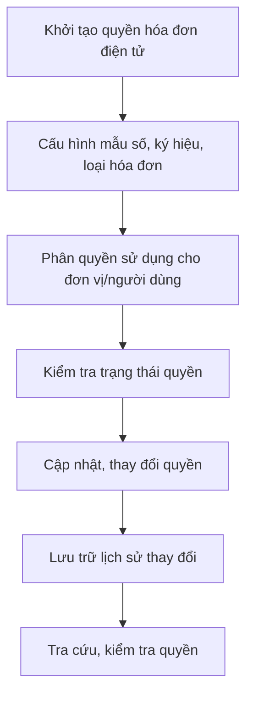
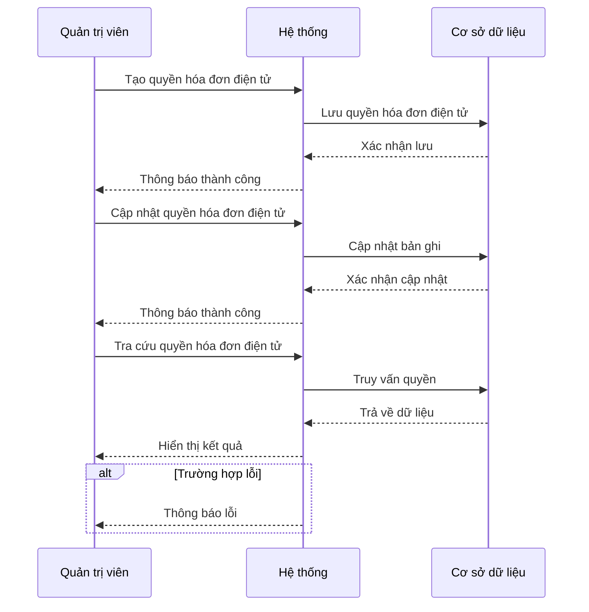
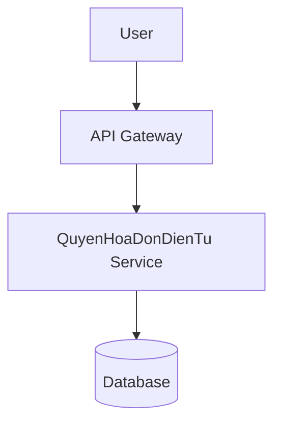
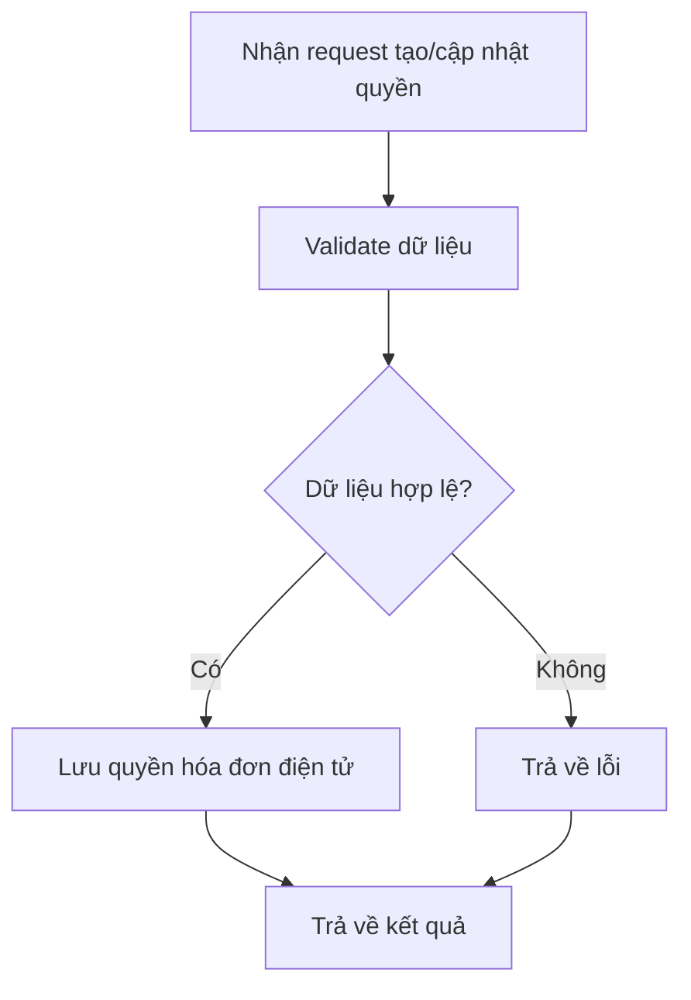

# DOC_002_Quản Lý Quyền Hóa Đơn Điện Tử

*Phiên bản: 1.0*  
*Người tạo: [Tên Tác Giả]*  
*Ngày tạo: [DD/MM/YYYY]*  
*Cập nhật lần cuối: [DD/MM/YYYY]*  
*Người cập nhật: [Tên Người Cập Nhật]*

## 1. Tổng Quan Nghiệp Vụ

### 1.1. Mô Tả Nghiệp Vụ
Quản lý quyền hóa đơn điện tử là nghiệp vụ cho phép thiết lập, kiểm soát và phân quyền sử dụng các mẫu hóa đơn điện tử trong doanh nghiệp. Nghiệp vụ này đảm bảo mỗi đơn vị, phòng ban, người dùng chỉ được phép sử dụng các mẫu hóa đơn điện tử phù hợp, đúng quy định, phục vụ công tác phát hành, quản lý, kiểm tra và truy vết hóa đơn điện tử.

### 1.2. Phạm Vi Áp Dụng
Áp dụng cho các phòng ban, bộ phận phát hành, sử dụng hóa đơn điện tử: Kế toán, Bán hàng, Quản trị hệ thống, ...

### 1.3. Định Nghĩa Thuật Ngữ
| Thuật ngữ | Định nghĩa |
|-----------|------------|
| Hóa đơn điện tử (HĐĐT) | Chứng từ điện tử ghi nhận giao dịch bán hàng, cung cấp dịch vụ, phát hành qua hệ thống điện tử |
| Quyền hóa đơn điện tử | Nhóm quyền kiểm soát việc sử dụng, phát hành các mẫu hóa đơn điện tử |
| Mẫu số hóa đơn | Định danh mẫu hóa đơn điện tử do cơ quan thuế cấp |
| Ký hiệu hóa đơn | Ký hiệu phân biệt từng loại hóa đơn điện tử |
| Loại hóa đơn | Phân loại hóa đơn: GTGT, bán hàng, xuất khẩu, ... |

### 1.4. Tài Liệu Liên Quan
| STT | Mã tài liệu | Tên tài liệu | Mô tả |
|-----|-------------|--------------|-------|
| 1   | DOC_003     | Quản Lý Chứng Từ | Quy trình quản lý chứng từ liên quan hóa đơn điện tử |
| 2   | ACC_003     | Bút Toán Kế Toán | Quy trình tạo bút toán từ hóa đơn điện tử |

## 2. Quy Trình Nghiệp Vụ

### 2.1. Tổng Quan Quy Trình
Quy trình quản lý quyền hóa đơn điện tử gồm các bước: khởi tạo quyền, cấu hình mẫu số, ký hiệu, loại hóa đơn, phân quyền sử dụng, kiểm tra trạng thái, cập nhật và lưu trữ lịch sử thay đổi.

### 2.2. Sơ Đồ Quy Trình (Business Flow)

### 2.3. Chi Tiết Các Bước Quy Trình

#### 2.3.1. Khởi tạo quyền hóa đơn điện tử
- **Mô tả**: Tạo mới quyền hóa đơn điện tử cho đơn vị, nhóm người dùng
- **Đầu vào**: Thông tin đơn vị, mã nhóm quyền, tên nhóm quyền
- **Đầu ra**: Quyền hóa đơn điện tử mới
- **Người thực hiện**: Quản trị hệ thống, kế toán trưởng
- **Điều kiện tiên quyết**: Có quyền quản trị hệ thống
- **Xử lý ngoại lệ**: Trùng mã nhóm quyền, thiếu thông tin bắt buộc

#### 2.3.2. Cấu hình mẫu số, ký hiệu, loại hóa đơn
- **Mô tả**: Thiết lập các thông tin mẫu số, ký hiệu, loại hóa đơn cho quyền
- **Đầu vào**: Mẫu số, ký hiệu, loại hóa đơn
- **Đầu ra**: Quyền hóa đơn điện tử đã cấu hình
- **Người thực hiện**: Quản trị hệ thống, kế toán
- **Điều kiện tiên quyết**: Quyền hóa đơn điện tử đã được khởi tạo
- **Xử lý ngoại lệ**: Mẫu số, ký hiệu không hợp lệ

#### 2.3.3. Phân quyền sử dụng
- **Mô tả**: Gán quyền sử dụng hóa đơn điện tử cho đơn vị, phòng ban, người dùng
- **Đầu vào**: Danh sách đơn vị/người dùng, quyền hóa đơn điện tử
- **Đầu ra**: Danh sách phân quyền sử dụng
- **Người thực hiện**: Quản trị hệ thống
- **Điều kiện tiên quyết**: Quyền hóa đơn điện tử đã cấu hình
- **Xử lý ngoại lệ**: Đơn vị/người dùng không tồn tại, quyền trùng lặp

#### 2.3.4. Kiểm tra trạng thái quyền
- **Mô tả**: Kiểm tra trạng thái hoạt động của quyền hóa đơn điện tử
- **Đầu vào**: Quyền hóa đơn điện tử
- **Đầu ra**: Trạng thái (hoạt động/không hoạt động)
- **Người thực hiện**: Hệ thống, quản trị
- **Điều kiện tiên quyết**: Quyền hóa đơn điện tử đã được phân quyền
- **Xử lý ngoại lệ**: Quyền không tồn tại

#### 2.3.5. Cập nhật, lưu trữ lịch sử thay đổi
- **Mô tả**: Cập nhật thông tin quyền, lưu lại lịch sử thay đổi
- **Đầu vào**: Thông tin cập nhật
- **Đầu ra**: Quyền hóa đơn điện tử đã cập nhật, bản ghi lịch sử
- **Người thực hiện**: Quản trị hệ thống
- **Điều kiện tiên quyết**: Có quyền cập nhật
- **Xử lý ngoại lệ**: Không có quyền cập nhật, dữ liệu không hợp lệ

### 2.4. Sơ Đồ Tuần Tự (Sequence Diagram)

### 2.5. Luồng Nghiệp Vụ Thay Thế
- Trường hợp quyền bị thu hồi: chuyển trạng thái "không hoạt động", lưu lịch sử thu hồi
- Trường hợp quyền bị thay đổi: lưu lại lịch sử thay đổi, thông báo cho các bên liên quan

## 3. Yêu Cầu Chức Năng

### 3.1. Danh Sách Chức Năng
| STT | Mã chức năng | Tên chức năng | Mô tả | Độ ưu tiên |
|-----|--------------|---------------|-------|------------|
| 1   | DOC_002_01   | Tạo quyền hóa đơn điện tử | Tạo mới quyền hóa đơn điện tử cho đơn vị | Cao |
| 2   | DOC_002_02   | Cấu hình mẫu số, ký hiệu, loại hóa đơn | Thiết lập thông tin mẫu số, ký hiệu, loại hóa đơn | Cao |
| 3   | DOC_002_03   | Phân quyền sử dụng | Gán quyền cho đơn vị, người dùng | Cao |
| 4   | DOC_002_04   | Kiểm tra trạng thái quyền | Kiểm tra trạng thái hoạt động của quyền | Trung bình |
| 5   | DOC_002_05   | Cập nhật, lưu trữ lịch sử | Cập nhật quyền, lưu lịch sử thay đổi | Trung bình |

### 3.2. Chi Tiết Chức Năng

#### 3.2.1. DOC_002_01: Tạo quyền hóa đơn điện tử
- **Mô tả**: Cho phép tạo mới quyền hóa đơn điện tử cho đơn vị
- **Đầu vào**: Thông tin đơn vị, mã nhóm quyền, tên nhóm quyền
- **Đầu ra**: Quyền hóa đơn điện tử mới
- **Điều kiện tiên quyết**: Có quyền quản trị hệ thống
- **Luồng xử lý chính**:
  1. Nhập thông tin đơn vị, mã nhóm quyền, tên nhóm quyền
  2. Lưu quyền hóa đơn điện tử
- **Luồng xử lý thay thế/ngoại lệ**:
  1. Trùng mã nhóm quyền
  2. Thiếu thông tin bắt buộc
- **Giao diện liên quan**: Form tạo quyền hóa đơn điện tử

#### 3.2.2. DOC_002_02: Cấu hình mẫu số, ký hiệu, loại hóa đơn
- **Mô tả**: Thiết lập thông tin mẫu số, ký hiệu, loại hóa đơn cho quyền
- **Đầu vào**: Mẫu số, ký hiệu, loại hóa đơn
- **Đầu ra**: Quyền hóa đơn điện tử đã cấu hình
- **Điều kiện tiên quyết**: Quyền hóa đơn điện tử đã được khởi tạo
- **Luồng xử lý chính**:
  1. Nhập mẫu số, ký hiệu, loại hóa đơn
  2. Lưu cấu hình
- **Luồng xử lý thay thế/ngoại lệ**:
  1. Mẫu số, ký hiệu không hợp lệ
- **Giao diện liên quan**: Form cấu hình quyền hóa đơn điện tử

#### 3.2.3. DOC_002_03: Phân quyền sử dụng
- **Mô tả**: Gán quyền sử dụng hóa đơn điện tử cho đơn vị, người dùng
- **Đầu vào**: Danh sách đơn vị/người dùng, quyền hóa đơn điện tử
- **Đầu ra**: Danh sách phân quyền sử dụng
- **Điều kiện tiên quyết**: Quyền hóa đơn điện tử đã cấu hình
- **Luồng xử lý chính**:
  1. Chọn đơn vị/người dùng
  2. Gán quyền sử dụng
- **Luồng xử lý thay thế/ngoại lệ**:
  1. Đơn vị/người dùng không tồn tại
  2. Quyền trùng lặp
- **Giao diện liên quan**: Màn hình phân quyền sử dụng hóa đơn điện tử

#### 3.2.4. DOC_002_04: Kiểm tra trạng thái quyền
- **Mô tả**: Kiểm tra trạng thái hoạt động của quyền hóa đơn điện tử
- **Đầu vào**: Quyền hóa đơn điện tử
- **Đầu ra**: Trạng thái quyền
- **Điều kiện tiên quyết**: Quyền hóa đơn điện tử đã được phân quyền
- **Luồng xử lý chính**:
  1. Chọn quyền hóa đơn điện tử
  2. Kiểm tra trạng thái
- **Luồng xử lý thay thế/ngoại lệ**:
  1. Quyền không tồn tại
- **Giao diện liên quan**: Màn hình tra cứu quyền hóa đơn điện tử

#### 3.2.5. DOC_002_05: Cập nhật, lưu trữ lịch sử
- **Mô tả**: Cập nhật thông tin quyền, lưu lại lịch sử thay đổi
- **Đầu vào**: Thông tin cập nhật
- **Đầu ra**: Quyền hóa đơn điện tử đã cập nhật, bản ghi lịch sử
- **Điều kiện tiên quyết**: Có quyền cập nhật
- **Luồng xử lý chính**:
  1. Nhập thông tin cập nhật
  2. Lưu bản ghi lịch sử
- **Luồng xử lý thay thế/ngoại lệ**:
  1. Không có quyền cập nhật
  2. Dữ liệu không hợp lệ
- **Giao diện liên quan**: Màn hình lịch sử thay đổi quyền hóa đơn điện tử

## 4. Thiết Kế Kỹ Thuật

### 4.1. Kiến Trúc Hệ Thống

### 4.2. API Endpoints
#### 4.2.1. Tạo quyền hóa đơn điện tử
- **Mô tả**: Tạo mới quyền hóa đơn điện tử
- **URL**: `POST /api/v1/{entity_slug}/quyen-hoa-don-dien-tu/`
#### 4.2.2. Cập nhật quyền hóa đơn điện tử
- **Mô tả**: Cập nhật thông tin quyền hóa đơn điện tử
- **URL**: `PUT /api/v1/{entity_slug}/quyen-hoa-don-dien-tu/{uuid}/`
#### 4.2.3. Tra cứu quyền hóa đơn điện tử
- **Mô tả**: Lấy danh sách/quyền hóa đơn điện tử
- **URL**: `GET /api/v1/{entity_slug}/quyen-hoa-don-dien-tu/`
#### 4.2.4. Xóa quyền hóa đơn điện tử
- **Mô tả**: Xóa quyền hóa đơn điện tử
- **URL**: `DELETE /api/v1/{entity_slug}/quyen-hoa-don-dien-tu/{uuid}/`

### 4.3. Service Logic
#### 4.3.1. QuyenHoaDonDienTu Service
- **Mô tả**: Xử lý toàn bộ logic liên quan đến quyền hóa đơn điện tử: tạo, cập nhật, phân quyền, kiểm tra trạng thái, lưu trữ lịch sử
- **Chức năng chính**:
  1. Tạo quyền hóa đơn điện tử
  2. Cấu hình mẫu số, ký hiệu, loại hóa đơn
  3. Phân quyền sử dụng
  4. Kiểm tra trạng thái quyền
  5. Cập nhật, lưu trữ lịch sử
- **Các dependencies**:
  1. Entity Service
  2. User Service
- **Sơ đồ luồng xử lý**:

## 5. Kế Hoạch Kiểm Thử
- **Phạm vi kiểm thử**: Toàn bộ quy trình tạo, cập nhật, phân quyền, kiểm tra trạng thái, xóa quyền hóa đơn điện tử
- **Kịch bản kiểm thử**:
  1. Tạo mới quyền hóa đơn điện tử với đầy đủ thông tin
  2. Tạo quyền hóa đơn điện tử thiếu thông tin bắt buộc
  3. Cập nhật quyền hóa đơn điện tử
  4. Xóa quyền hóa đơn điện tử
  5. Tra cứu quyền hóa đơn điện tử

## 6. Phụ Lục
- **Danh sách tài liệu tham khảo**: Xem mục 1.4
- **Danh mục thuật ngữ**: Xem mục 1.3
- **Lịch sử thay đổi tài liệu**:
  - [DD/MM/YYYY] Tạo mới

</rewritten_file> 