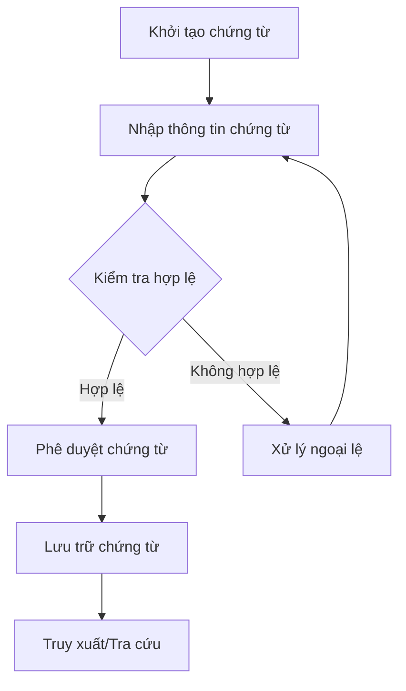
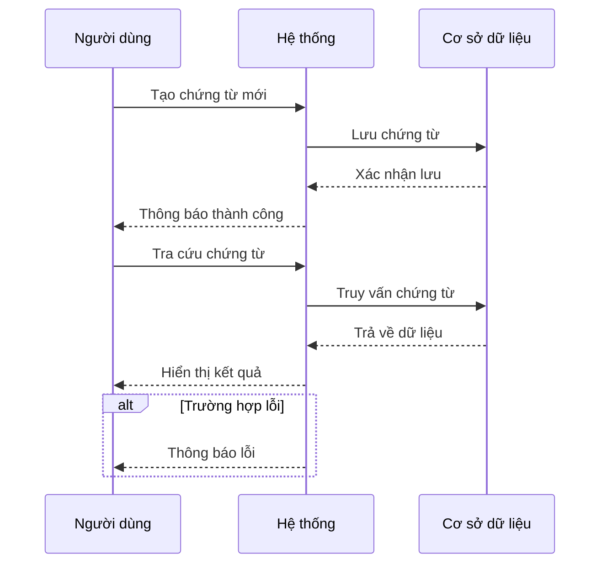
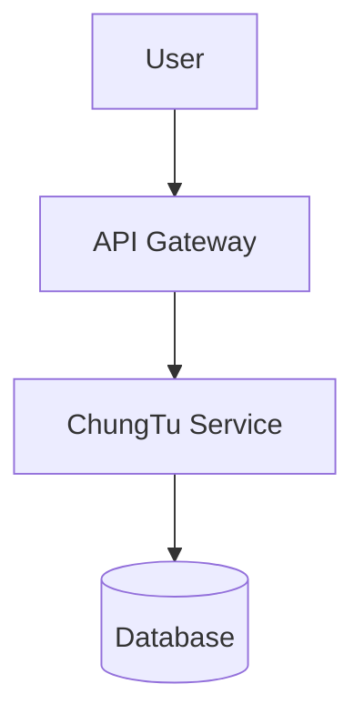
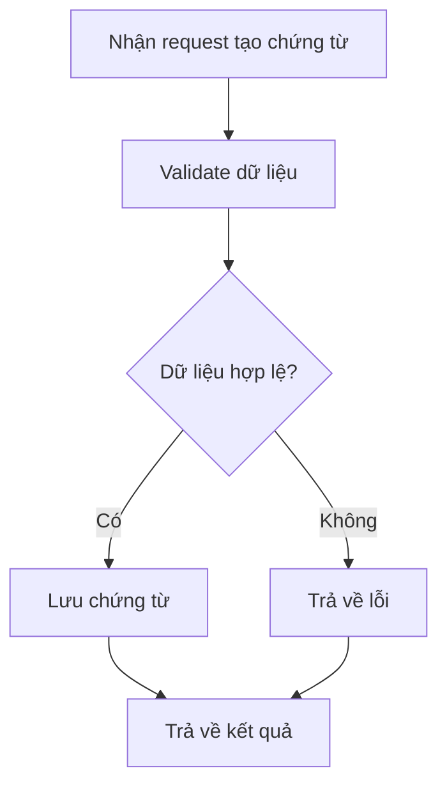

# DOC_003_Quản Lý Chứng Từ

*Phiên bản: 1.0*  
*Người tạo: [Tên Tác Giả]*  
*Ngày tạo: [DD/MM/YYYY]*  
*Cập nhật lần cuối: [DD/MM/YYYY]*  
*Người cập nhật: [Tên Người Cập Nhật]*

## 1. Tổng Quan Nghiệp Vụ

### 1.1. Mô Tả Nghiệp Vụ
Quản lý chứng từ là nghiệp vụ cốt lõi trong hệ thống ERP, đảm bảo việc tạo lập, lưu trữ, truy xuất và kiểm soát các loại chứng từ phát sinh trong toàn bộ quy trình nghiệp vụ của doanh nghiệp. Chức năng này giúp chuẩn hóa, tự động hóa và kiểm soát vòng đời chứng từ, từ khởi tạo, phê duyệt, thực hiện đến lưu trữ, phục vụ kiểm toán và truy vết.

### 1.2. Phạm Vi Áp Dụng
Áp dụng cho toàn bộ các phòng ban, bộ phận có phát sinh chứng từ: Kế toán, Bán hàng, Mua hàng, Kho, Tài chính, Nhân sự, ...

### 1.3. Định Nghĩa Thuật Ngữ
| Thuật ngữ | Định nghĩa |
|-----------|------------|
| Chứng từ (ChungTu) | Đối tượng đại diện cho một giao dịch, sự kiện nghiệp vụ cần ghi nhận, lưu trữ trong hệ thống |
| Mã chứng từ (ma_ct) | Mã định danh duy nhất cho từng loại chứng từ |
| Quyền chứng từ (QuyenChungTu) | Nhóm quyền kiểm soát việc tạo, sử dụng, phê duyệt chứng từ |
| Số chứng từ hiện tại (i_so_ct_ht) | Số thứ tự chứng từ phát sinh gần nhất |

### 1.4. Tài Liệu Liên Quan
| STT | Mã tài liệu | Tên tài liệu | Mô tả |
|-----|-------------|--------------|-------|
| 1   | DOC_001     | Quản Lý Quyền Chứng Từ | Quy trình phân quyền, kiểm soát sử dụng chứng từ |
| 2   | ACC_003     | Bút Toán Kế Toán       | Quy trình tạo và quản lý các bút toán liên quan chứng từ |

## 2. Quy Trình Nghiệp Vụ

### 2.1. Tổng Quan Quy Trình
Quy trình quản lý chứng từ bao gồm các bước: khởi tạo chứng từ, nhập thông tin, kiểm tra hợp lệ, phê duyệt, lưu trữ và truy xuất. Hệ thống hỗ trợ kiểm soát trạng thái, số thứ tự, loại chứng từ, liên kết các nghiệp vụ liên quan.

### 2.2. Sơ Đồ Quy Trình (Business Flow)

### 2.3. Chi Tiết Các Bước Quy Trình

#### 2.3.1. Khởi tạo chứng từ
- **Mô tả**: Người dùng tạo mới chứng từ, chọn loại chứng từ phù hợp
- **Đầu vào**: Loại chứng từ, thông tin nghiệp vụ
- **Đầu ra**: Bản ghi chứng từ mới với trạng thái "lập chứng từ"
- **Người thực hiện**: Nhân viên nghiệp vụ
- **Điều kiện tiên quyết**: Có quyền tạo chứng từ, loại chứng từ hợp lệ
- **Xử lý ngoại lệ**: Loại chứng từ không tồn tại, không có quyền tạo

#### 2.3.2. Nhập thông tin chứng từ
- **Mô tả**: Nhập các trường thông tin bắt buộc và bổ sung cho chứng từ
- **Đầu vào**: Dữ liệu nhập từ người dùng
- **Đầu ra**: Chứng từ với đầy đủ thông tin
- **Người thực hiện**: Nhân viên nghiệp vụ
- **Điều kiện tiên quyết**: Chứng từ ở trạng thái "lập chứng từ"
- **Xử lý ngoại lệ**: Thiếu thông tin bắt buộc, dữ liệu không hợp lệ

#### 2.3.3. Kiểm tra hợp lệ
- **Mô tả**: Hệ thống kiểm tra tính hợp lệ của dữ liệu chứng từ (định dạng, trạng thái, số dư, ...)
- **Đầu vào**: Chứng từ đã nhập thông tin
- **Đầu ra**: Kết quả kiểm tra (hợp lệ/không hợp lệ)
- **Người thực hiện**: Hệ thống
- **Điều kiện tiên quyết**: Chứng từ đã nhập đủ thông tin
- **Xử lý ngoại lệ**: Báo lỗi, yêu cầu nhập lại

#### 2.3.4. Phê duyệt chứng từ
- **Mô tả**: Người có thẩm quyền phê duyệt chứng từ
- **Đầu vào**: Chứng từ hợp lệ
- **Đầu ra**: Chứng từ chuyển trạng thái "đã duyệt"
- **Người thực hiện**: Quản lý/phê duyệt viên
- **Điều kiện tiên quyết**: Có quyền phê duyệt, chứng từ hợp lệ
- **Xử lý ngoại lệ**: Không có quyền, chứng từ không hợp lệ

#### 2.3.5. Lưu trữ và truy xuất
- **Mô tả**: Chứng từ được lưu trữ, cho phép tra cứu, truy xuất khi cần
- **Đầu vào**: Chứng từ đã duyệt
- **Đầu ra**: Chứng từ lưu trữ, có thể tìm kiếm
- **Người thực hiện**: Hệ thống, người dùng
- **Điều kiện tiên quyết**: Chứng từ đã duyệt
- **Xử lý ngoại lệ**: Lỗi lưu trữ, lỗi truy xuất

### 2.4. Sơ Đồ Tuần Tự (Sequence Diagram)

### 2.5. Luồng Nghiệp Vụ Thay Thế
- Trường hợp chứng từ bị từ chối/phản hồi: chuyển trạng thái về "lập chứng từ" để chỉnh sửa.
- Trường hợp chứng từ bị hủy: chuyển trạng thái "đóng" và lưu lịch sử.

## 3. Yêu Cầu Chức Năng

### 3.1. Danh Sách Chức Năng
| STT | Mã chức năng | Tên chức năng | Mô tả | Độ ưu tiên |
|-----|--------------|---------------|-------|------------|
| 1   | DOC_003_01   | Tạo chứng từ  | Cho phép tạo mới chứng từ với loại, số thứ tự, trạng thái | Cao |
| 2   | DOC_003_02   | Tra cứu chứng từ | Tìm kiếm, truy xuất chứng từ theo nhiều tiêu chí | Cao |
| 3   | DOC_003_03   | Phê duyệt chứng từ | Thực hiện phê duyệt, chuyển trạng thái chứng từ | Cao |
| 4   | DOC_003_04   | Lưu trữ chứng từ | Lưu trữ, quản lý vòng đời chứng từ | Trung bình |
| 5   | DOC_003_05   | Kiểm tra hợp lệ | Kiểm tra dữ liệu, trạng thái, số dư, ... | Cao |

### 3.2. Chi Tiết Chức Năng

#### 3.2.1. DOC_003_01: Tạo chứng từ
- **Mô tả**: Cho phép người dùng tạo mới chứng từ, nhập thông tin, chọn loại chứng từ
- **Đầu vào**: Loại chứng từ, thông tin nghiệp vụ
- **Đầu ra**: Chứng từ mới
- **Điều kiện tiên quyết**: Có quyền tạo chứng từ
- **Luồng xử lý chính**:
  1. Chọn loại chứng từ
  2. Nhập thông tin
  3. Lưu chứng từ
- **Luồng xử lý thay thế/ngoại lệ**:
  1. Loại chứng từ không tồn tại
  2. Không có quyền tạo
- **Giao diện liên quan**: Form tạo chứng từ

#### 3.2.2. DOC_003_02: Tra cứu chứng từ
- **Mô tả**: Cho phép tìm kiếm, truy xuất chứng từ theo mã, loại, trạng thái, ngày, ...
- **Đầu vào**: Tiêu chí tìm kiếm
- **Đầu ra**: Danh sách chứng từ phù hợp
- **Điều kiện tiên quyết**: Có quyền truy xuất
- **Luồng xử lý chính**:
  1. Nhập tiêu chí tìm kiếm
  2. Truy vấn hệ thống
  3. Hiển thị kết quả
- **Luồng xử lý thay thế/ngoại lệ**:
  1. Không tìm thấy chứng từ
- **Giao diện liên quan**: Màn hình tra cứu chứng từ

#### 3.2.3. DOC_003_03: Phê duyệt chứng từ
- **Mô tả**: Thực hiện phê duyệt chứng từ, chuyển trạng thái
- **Đầu vào**: Chứng từ hợp lệ
- **Đầu ra**: Chứng từ đã duyệt
- **Điều kiện tiên quyết**: Có quyền phê duyệt
- **Luồng xử lý chính**:
  1. Chọn chứng từ cần phê duyệt
  2. Thực hiện phê duyệt
  3. Cập nhật trạng thái
- **Luồng xử lý thay thế/ngoại lệ**:
  1. Không có quyền phê duyệt
- **Giao diện liên quan**: Màn hình phê duyệt chứng từ

#### 3.2.4. DOC_003_04: Lưu trữ chứng từ
- **Mô tả**: Lưu trữ chứng từ đã duyệt, hỗ trợ truy xuất, kiểm toán
- **Đầu vào**: Chứng từ đã duyệt
- **Đầu ra**: Chứng từ lưu trữ
- **Điều kiện tiên quyết**: Chứng từ đã duyệt
- **Luồng xử lý chính**:
  1. Lưu chứng từ vào kho dữ liệu
  2. Đánh dấu trạng thái lưu trữ
- **Luồng xử lý thay thế/ngoại lệ**:
  1. Lỗi lưu trữ
- **Giao diện liên quan**: Không gian lưu trữ chứng từ

#### 3.2.5. DOC_003_05: Kiểm tra hợp lệ
- **Mô tả**: Kiểm tra dữ liệu, trạng thái, số dư, ... của chứng từ
- **Đầu vào**: Chứng từ cần kiểm tra
- **Đầu ra**: Kết quả kiểm tra
- **Điều kiện tiên quyết**: Chứng từ đã nhập thông tin
- **Luồng xử lý chính**:
  1. Kiểm tra định dạng, trạng thái, số dư
  2. Thông báo kết quả
- **Luồng xử lý thay thế/ngoại lệ**:
  1. Dữ liệu không hợp lệ
- **Giao diện liên quan**: Form nhập/chỉnh sửa chứng từ

## 4. Thiết Kế Kỹ Thuật

### 4.1. Kiến Trúc Hệ Thống

### 4.2. API Endpoints
#### 4.2.1. Tạo chứng từ
- **Mô tả**: Tạo mới chứng từ
- **URL**: `POST /api/v1/chung-tu/`
#### 4.2.2. Tra cứu chứng từ
- **Mô tả**: Tìm kiếm, truy xuất chứng từ
- **URL**: `GET /api/v1/chung-tu/?filters...`
#### 4.2.3. Phê duyệt chứng từ
- **Mô tả**: Phê duyệt chứng từ
- **URL**: `POST /api/v1/chung-tu/{ma_ct}/approve/`

### 4.3. Service Logic
#### 4.3.1. ChungTu Service
- **Mô tả**: Xử lý toàn bộ logic liên quan đến chứng từ: tạo, cập nhật, phê duyệt, kiểm tra hợp lệ, lưu trữ, truy xuất
- **Chức năng chính**:
  1. Tạo chứng từ
  2. Tra cứu chứng từ
  3. Phê duyệt chứng từ
  4. Lưu trữ chứng từ
  5. Kiểm tra hợp lệ
- **Các dependencies**:
  1. QuyenChungTu Service
  2. User Service
- **Sơ đồ luồng xử lý**:

## 5. Kế Hoạch Kiểm Thử
- **Phạm vi kiểm thử**: Toàn bộ quy trình tạo, phê duyệt, lưu trữ, truy xuất chứng từ
- **Kịch bản kiểm thử**:
  1. Tạo mới chứng từ với đầy đủ thông tin
  2. Tạo chứng từ thiếu thông tin bắt buộc
  3. Phê duyệt chứng từ hợp lệ
  4. Phê duyệt chứng từ không hợp lệ
  5. Tra cứu chứng từ theo nhiều tiêu chí

## 6. Phụ Lục
- **Danh sách tài liệu tham khảo**: Xem mục 1.4
- **Danh mục thuật ngữ**: Xem mục 1.3
- **Lịch sử thay đổi tài liệu**:
  - [DD/MM/YYYY] Tạo mới

</rewritten_file> 