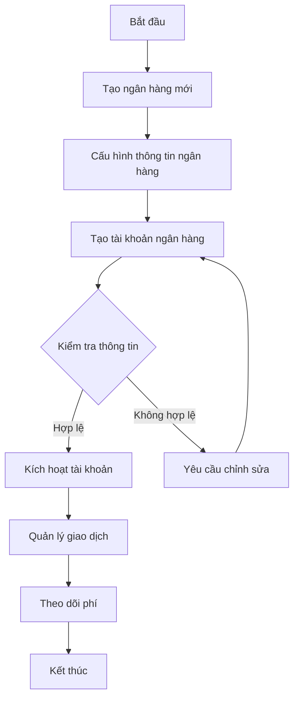
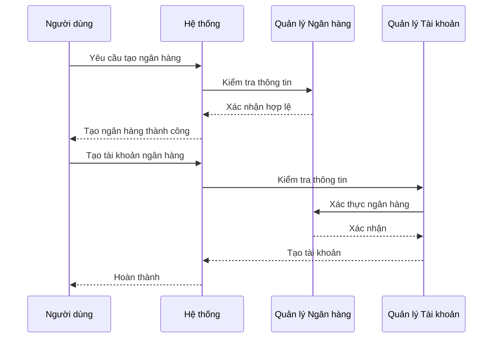
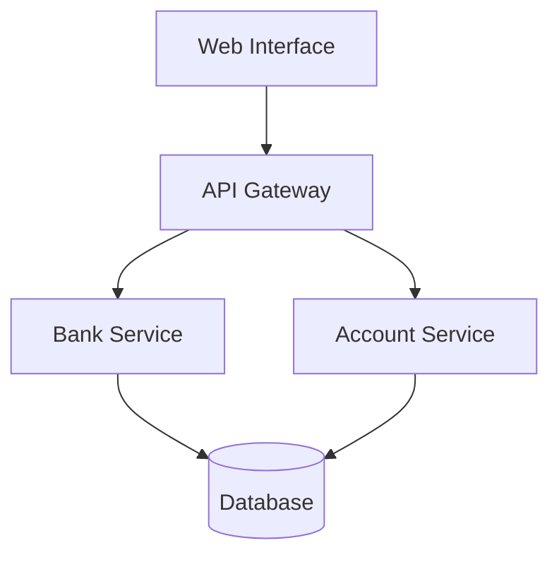
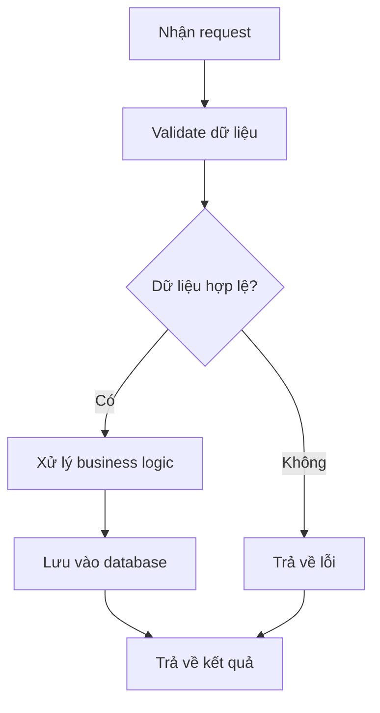
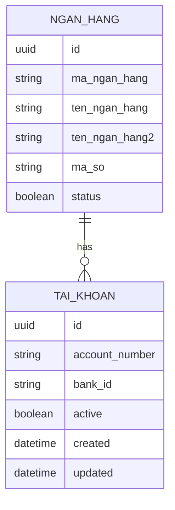

# FIN_001_Quản Lý Ngân Hàng

*Phiên bản: 1.0*  
*Người tạo: ChatGPT*  
*Ngày tạo: 13/05/2025*  
*Cập nhật lần cuối: 13/05/2025*  
*Người cập nhật: ChatGPT*

## 1. Tổng Quan Nghiệp Vụ

### 1.1. Mô Tả Nghiệp Vụ
Quy trình Quản Lý Ngân Hàng là một phần quan trọng trong phân hệ Tài Chính của hệ thống ERP, cho phép doanh nghiệp quản lý thông tin về các ngân hàng và tài khoản ngân hàng. Quy trình này giúp tổ chức theo dõi, quản lý và kiểm soát các hoạt động tài chính liên quan đến ngân hàng một cách hiệu quả.

### 1.2. Phạm Vi Áp Dụng
- **Bộ phận Tài Chính - Kế Toán**: Quản lý và theo dõi tài khoản ngân hàng
- **Ban Giám Đốc**: Phê duyệt và giám sát hoạt động tài khoản
- **Các phòng ban khác**: Tra cứu thông tin ngân hàng để thực hiện giao dịch

### 1.3. Định Nghĩa Thuật Ngữ
| Thuật ngữ | Định nghĩa |
|-----------|------------|
| Ngân hàng | Tổ chức tài chính cung cấp dịch vụ ngân hàng |
| Tài khoản ngân hàng | Tài khoản mở tại ngân hàng để thực hiện giao dịch |
| Phí ngân hàng | Các loại phí phát sinh khi sử dụng dịch vụ ngân hàng |
| TKNH | Số tài khoản ngân hàng |

### 1.4. Tài Liệu Liên Quan
| STT | Mã tài liệu | Tên tài liệu | Mô tả |
|-----|-------------|--------------|-------|
| 1   | FIN_002 | Quản Lý Thanh Toán | Quy trình quản lý phương thức thanh toán |
| 2   | FIN_004 | Quản Lý Phí | Quy trình quản lý các loại phí ngân hàng |
| 3   | ACC_002 | Sổ Cái | Quy trình quản lý sổ cái và bút toán kế toán |

## 2. Quy Trình Nghiệp Vụ

### 2.1. Tổng Quan Quy Trình
Quy trình Quản Lý Ngân Hàng bao gồm hai phần chính:
1. Quản lý thông tin ngân hàng (tên ngân hàng, mã ngân hàng, thông tin liên hệ)
2. Quản lý tài khoản ngân hàng (số tài khoản, trạng thái, phí giao dịch)

### 2.2. Sơ Đồ Quy Trình (Business Flow)

### 2.3. Chi Tiết Các Bước Quy Trình

#### 2.3.1. Tạo và Cấu Hình Ngân Hàng
- **Mô tả**: Tạo mới thông tin ngân hàng trong hệ thống
- **Đầu vào**: 
  - Mã ngân hàng
  - Tên ngân hàng
  - Thông tin bổ sung
- **Đầu ra**: Ngân hàng được tạo trong hệ thống
- **Người thực hiện**: Quản trị viên hệ thống
- **Điều kiện tiên quyết**: Có quyền quản trị hệ thống
- **Xử lý ngoại lệ**: Kiểm tra trùng lặp mã ngân hàng

#### 2.3.2. Quản Lý Tài Khoản Ngân Hàng
- **Mô tả**: Tạo và quản lý tài khoản ngân hàng cho doanh nghiệp
- **Đầu vào**: 
  - Số tài khoản
  - Ngân hàng liên kết
  - Loại tài khoản
- **Đầu ra**: Tài khoản ngân hàng được tạo và kích hoạt
- **Người thực hiện**: Kế toán trưởng
- **Điều kiện tiên quyết**: Ngân hàng đã được tạo trong hệ thống
- **Xử lý ngoại lệ**: Kiểm tra tính hợp lệ của số tài khoản

### 2.4. Sơ Đồ Tuần Tự (Sequence Diagram)

### 2.5. Luồng Nghiệp Vụ Thay Thế
1. **Vô hiệu hóa tài khoản**:
   - Đánh dấu tài khoản không hoạt động
   - Lưu trữ lịch sử giao dịch
   - Chuyển giao dịch sang tài khoản khác

2. **Cập nhật thông tin ngân hàng**:
   - Kiểm tra tài khoản liên quan
   - Cập nhật thông tin mới
   - Thông báo cho người dùng liên quan

## 3. Yêu Cầu Chức Năng

### 3.1. Danh Sách Chức Năng

| STT | Mã chức năng | Tên chức năng | Mô tả | Độ ưu tiên |
|-----|--------------|---------------|-------|------------|
| 1   | BANK_001 | Quản lý ngân hàng | Tạo và quản lý thông tin ngân hàng | Cao |
| 2   | BANK_002 | Quản lý tài khoản | Tạo và quản lý tài khoản ngân hàng | Cao |
| 3   | BANK_003 | Quản lý phí | Thiết lập và theo dõi phí ngân hàng | Trung bình |
| 4   | BANK_004 | Báo cáo | Xuất báo cáo tài khoản và giao dịch | Thấp |

### 3.2. Chi Tiết Chức Năng

#### 3.2.1. BANK_001: Quản lý ngân hàng
- **Mô tả**: Quản lý thông tin các ngân hàng trong hệ thống
- **Đầu vào**: Thông tin ngân hàng (mã, tên, địa chỉ)
- **Đầu ra**: Ngân hàng được tạo/cập nhật trong hệ thống
- **Điều kiện tiên quyết**: Quyền quản trị hệ thống
- **Luồng xử lý chính**:
  1. Nhập thông tin ngân hàng
  2. Kiểm tra tính hợp lệ
  3. Lưu vào cơ sở dữ liệu
- **Luồng xử lý thay thế/ngoại lệ**:
  1. Kiểm tra trùng mã ngân hàng
  2. Xử lý lỗi khi cập nhật
- **Giao diện liên quan**: Màn hình quản lý ngân hàng

## 4. Thiết Kế Kỹ Thuật

### 4.1. Kiến Trúc Hệ Thống

### 4.2. API Endpoints

#### 4.2.1. Quản Lý Ngân Hàng
- **Mô tả**: API quản lý thông tin ngân hàng
- **URL**: 
  - `GET /api/v1/banks/`
  - `POST /api/v1/banks/`
  - `PUT /api/v1/banks/{uuid}/`
  - `DELETE /api/v1/banks/{uuid}/`

#### 4.2.2. Quản Lý Tài Khoản
- **Mô tả**: API quản lý tài khoản ngân hàng
- **URL**:
  - `GET /api/v1/bank-accounts/`
  - `POST /api/v1/bank-accounts/`
  - `PUT /api/v1/bank-accounts/{uuid}/`
  - `DELETE /api/v1/bank-accounts/{uuid}/`

### 4.3. Service Logic

#### 4.3.1. Bank Service
- **Mô tả**: Xử lý logic nghiệp vụ ngân hàng
- **Chức năng chính**:
  1. Tạo và quản lý ngân hàng
  2. Kiểm tra thông tin
  3. Xử lý yêu cầu API
- **Các dependencies**:
  1. Database Service
  2. Validation Service
- **Sơ đồ luồng xử lý**:

### 4.4. Mô Hình Dữ Liệu

#### 4.4.1. Entity Relationship Diagram (ERD)

#### 4.4.2. Chi Tiết Bảng Dữ Liệu

##### Bảng: NGAN_HANG
- **Mô tả**: Lưu trữ thông tin ngân hàng
- **Các trường chính**:
  - id: UUID (Khóa chính)
  - ma_ngan_hang: VARCHAR(50)
  - ten_ngan_hang: VARCHAR(255)
  - status: BOOLEAN

##### Bảng: TAI_KHOAN
- **Mô tả**: Lưu trữ thông tin tài khoản ngân hàng
- **Các trường chính**:
  - id: UUID (Khóa chính)
  - ngan_hang_id: UUID (Khóa ngoại)
  - account_number: VARCHAR(50)
  - active: BOOLEAN

## 5. Kế Hoạch Kiểm Thử

### 5.1. Phạm Vi Kiểm Thử
- Kiểm thử tạo/sửa/xóa ngân hàng
- Kiểm thử tạo/sửa/xóa tài khoản
- Kiểm thử các ràng buộc và validation
- Kiểm thử quyền truy cập

### 5.2. Kịch Bản Kiểm Thử

| STT | Mã kịch bản | Tên kịch bản | Mô tả | Điều kiện tiên quyết | Các bước | Kết quả mong đợi |
|-----|------------|--------------|-------|---------------------|----------|-----------------|
| 1   | TC001 | Tạo ngân hàng | Tạo mới ngân hàng | Đăng nhập quyền admin | 1. Nhập thông tin 2. Submit form | Tạo thành công |
| 2   | TC002 | Tạo tài khoản | Tạo tài khoản mới | Có ngân hàng trong hệ thống | 1. Chọn ngân hàng 2. Nhập thông tin 3. Submit | Tạo thành công |

## 6. Phụ Lục

### 6.1. Danh Sách Tài Liệu Tham Khảo
1. Tài liệu thiết kế hệ thống ERP
2. Tài liệu API References
3. Hướng dẫn sử dụng Django Ledger

### 6.2. Danh Mục Thuật Ngữ
- ERP: Enterprise Resource Planning
- CRUD: Create, Read, Update, Delete
- API: Application Programming Interface

### 6.3. Lịch Sử Thay Đổi Tài Liệu

| Phiên bản | Ngày | Người thực hiện | Mô tả thay đổi |
|-----------|------|-----------------|---------------|
| 1.0 | 13/05/2025 | ChatGPT | Tạo mới tài liệu |
