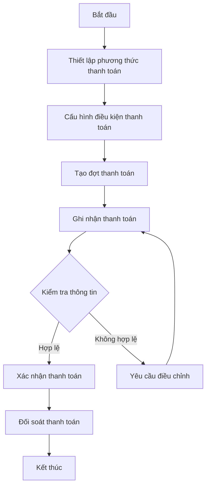
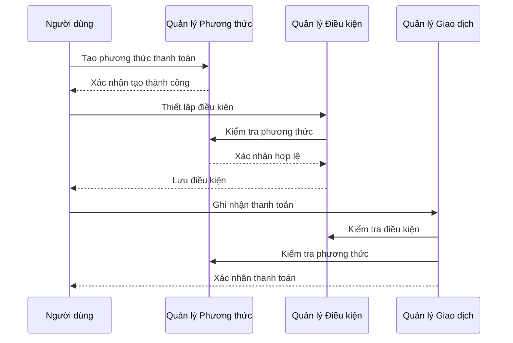
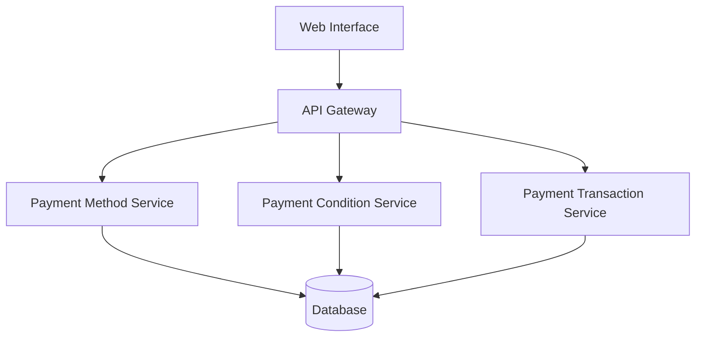
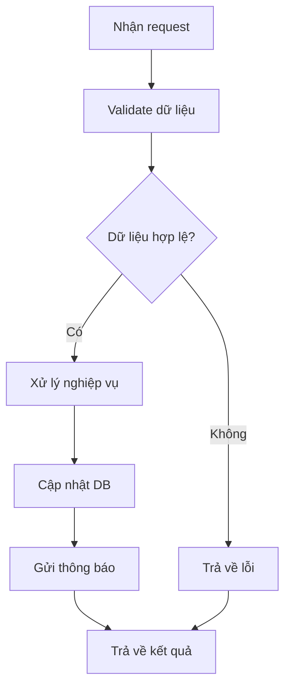
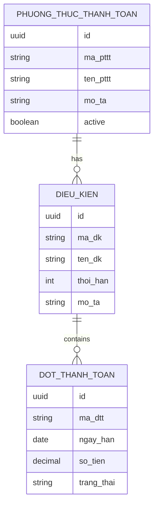

# FIN_002_Quản Lý Thanh Toán

*Phiên bản: 1.0*  
*Người tạo: ChatGPT*  
*Ngày tạo: 13/05/2025*  
*Cập nhật lần cuối: 13/05/2025*  
*Người cập nhật: ChatGPT*

## 1. Tổng Quan Nghiệp Vụ

### 1.1. Mô Tả Nghiệp Vụ
Quy trình Quản Lý Thanh Toán là một phần then chốt trong phân hệ Tài Chính của hệ thống ERP, cho phép doanh nghiệp thiết lập, theo dõi và quản lý các phương thức thanh toán, điều kiện thanh toán và thông tin thanh toán của các giao dịch. Quy trình này đảm bảo việc thanh toán được thực hiện đúng quy định, đúng thời hạn và dễ dàng theo dõi.

### 1.2. Phạm Vi Áp Dụng
- **Phòng Kế Toán**: Quản lý thanh toán và đối soát
- **Phòng Tài Chính**: Thiết lập chính sách thanh toán
- **Phòng Bán Hàng**: Áp dụng điều kiện thanh toán cho khách hàng
- **Phòng Mua Hàng**: Quản lý thanh toán cho nhà cung cấp

### 1.3. Định Nghĩa Thuật Ngữ
| Thuật ngữ | Định nghĩa |
|-----------|------------|
| Phương thức thanh toán | Cách thức thực hiện thanh toán (tiền mặt, chuyển khoản, v.v.) |
| Điều kiện thanh toán | Các điều khoản và điều kiện về thời hạn, số tiền thanh toán |
| Đợt thanh toán | Kỳ thanh toán theo định kỳ hoặc theo hợp đồng |
| Thông tin thanh toán | Chi tiết về một giao dịch thanh toán cụ thể |

### 1.4. Tài Liệu Liên Quan
| STT | Mã tài liệu | Tên tài liệu | Mô tả |
|-----|-------------|--------------|-------|
| 1   | FIN_001 | Quản Lý Ngân Hàng | Quy trình quản lý tài khoản ngân hàng |
| 2   | FIN_003 | Quản Lý Khoản Vay | Quy trình quản lý các khoản vay |
| 3   | FIN_004 | Quản Lý Phí | Quy trình quản lý các loại phí |

## 2. Quy Trình Nghiệp Vụ

### 2.1. Tổng Quan Quy Trình
Quy trình Quản Lý Thanh Toán bao gồm các phần chính:
1. Thiết lập phương thức thanh toán
2. Cấu hình điều kiện thanh toán
3. Quản lý đợt thanh toán
4. Theo dõi và đối soát thanh toán

### 2.2. Sơ Đồ Quy Trình (Business Flow)

### 2.3. Chi Tiết Các Bước Quy Trình

#### 2.3.1. Thiết Lập Phương Thức Thanh Toán
- **Mô tả**: Tạo và quản lý các phương thức thanh toán
- **Đầu vào**: 
  - Mã phương thức thanh toán
  - Tên phương thức
  - Thông tin tài khoản liên kết
- **Đầu ra**: Phương thức thanh toán được thiết lập
- **Người thực hiện**: Quản trị viên tài chính
- **Điều kiện tiên quyết**: Có quyền quản lý tài chính
- **Xử lý ngoại lệ**: Kiểm tra trùng lặp mã phương thức

#### 2.3.2. Cấu Hình Điều Kiện Thanh Toán
- **Mô tả**: Thiết lập các điều kiện thanh toán
- **Đầu vào**: 
  - Mã điều kiện
  - Thời hạn thanh toán
  - Yêu cầu đặc biệt
- **Đầu ra**: Điều kiện thanh toán được thiết lập
- **Người thực hiện**: Quản trị viên tài chính
- **Điều kiện tiên quyết**: Có phương thức thanh toán
- **Xử lý ngoại lệ**: Kiểm tra tính hợp lệ của điều kiện

### 2.4. Sơ Đồ Tuần Tự (Sequence Diagram)

### 2.5. Luồng Nghiệp Vụ Thay Thế
1. **Thanh toán không đúng hạn**:
   - Ghi nhận trạng thái trễ hạn
   - Tính toán phí phát sinh
   - Gửi thông báo nhắc nhở

2. **Điều chỉnh điều kiện thanh toán**:
   - Xem xét yêu cầu điều chỉnh
   - Phê duyệt thay đổi
   - Cập nhật điều kiện mới

## 3. Yêu Cầu Chức Năng

### 3.1. Danh Sách Chức Năng

| STT | Mã chức năng | Tên chức năng | Mô tả | Độ ưu tiên |
|-----|--------------|---------------|-------|------------|
| 1   | PAY_001 | Quản lý phương thức | Quản lý phương thức thanh toán | Cao |
| 2   | PAY_002 | Quản lý điều kiện | Quản lý điều kiện thanh toán | Cao |
| 3   | PAY_003 | Quản lý đợt thanh toán | Quản lý các đợt thanh toán | Trung bình |
| 4   | PAY_004 | Đối soát thanh toán | Kiểm tra và đối soát thanh toán | Cao |

### 3.2. Chi Tiết Chức Năng

#### 3.2.1. PAY_001: Quản lý phương thức
- **Mô tả**: Quản lý các phương thức thanh toán
- **Đầu vào**: Thông tin phương thức thanh toán
- **Đầu ra**: Phương thức được tạo/cập nhật
- **Điều kiện tiên quyết**: Quyền quản lý tài chính
- **Luồng xử lý chính**:
  1. Nhập thông tin phương thức
  2. Kiểm tra tính hợp lệ
  3. Lưu vào hệ thống
- **Luồng xử lý thay thế/ngoại lệ**:
  1. Kiểm tra trùng mã
  2. Xử lý lỗi validate
- **Giao diện liên quan**: Màn hình quản lý phương thức

## 4. Thiết Kế Kỹ Thuật

### 4.1. Kiến Trúc Hệ Thống

### 4.2. API Endpoints

#### 4.2.1. Quản Lý Phương Thức Thanh Toán
- **Mô tả**: API quản lý phương thức thanh toán
- **URL**: 
  - `GET /api/v1/payment-methods/`
  - `POST /api/v1/payment-methods/`
  - `PUT /api/v1/payment-methods/{uuid}/`
  - `DELETE /api/v1/payment-methods/{uuid}/`

#### 4.2.2. Quản Lý Điều Kiện Thanh Toán
- **Mô tả**: API quản lý điều kiện thanh toán
- **URL**:
  - `GET /api/v1/payment-conditions/`
  - `POST /api/v1/payment-conditions/`
  - `PUT /api/v1/payment-conditions/{uuid}/`
  - `DELETE /api/v1/payment-conditions/{uuid}/`

### 4.3. Service Logic

#### 4.3.1. Payment Service
- **Mô tả**: Xử lý logic thanh toán
- **Chức năng chính**:
  1. Quản lý phương thức thanh toán
  2. Xử lý điều kiện thanh toán
  3. Theo dõi giao dịch
- **Các dependencies**:
  1. Database Service
  2. Validation Service
  3. Notification Service
- **Sơ đồ luồng xử lý**:

### 4.4. Mô Hình Dữ Liệu

#### 4.4.1. Entity Relationship Diagram (ERD)

#### 4.4.2. Chi Tiết Bảng Dữ Liệu

##### Bảng: PHUONG_THUC_THANH_TOAN
- **Mô tả**: Lưu trữ thông tin phương thức thanh toán
- **Các trường chính**:
  - id: UUID (Khóa chính)
  - ma_pttt: VARCHAR(50)
  - ten_pttt: VARCHAR(255)
  - active: BOOLEAN

##### Bảng: DIEU_KIEN_THANH_TOAN
- **Mô tả**: Lưu trữ thông tin điều kiện thanh toán
- **Các trường chính**:
  - id: UUID (Khóa chính)
  - ma_dk: VARCHAR(50)
  - thoi_han: INTEGER
  - mo_ta: TEXT

## 5. Kế Hoạch Kiểm Thử

### 5.1. Phạm Vi Kiểm Thử
- Kiểm thử tạo/sửa/xóa phương thức thanh toán
- Kiểm thử thiết lập điều kiện thanh toán
- Kiểm thử quy trình thanh toán
- Kiểm thử tính toán thời hạn

### 5.2. Kịch Bản Kiểm Thử

| STT | Mã kịch bản | Tên kịch bản | Mô tả | Điều kiện tiên quyết | Các bước | Kết quả mong đợi |
|-----|------------|--------------|-------|---------------------|----------|-----------------|
| 1   | TC001 | Tạo phương thức | Tạo mới phương thức | Đăng nhập admin | 1. Nhập thông tin 2. Submit | Tạo thành công |
| 2   | TC002 | Thiết lập điều kiện | Tạo điều kiện mới | Có phương thức | 1. Chọn phương thức 2. Nhập điều kiện 3. Submit | Tạo thành công |

## 6. Phụ Lục

### 6.1. Danh Sách Tài Liệu Tham Khảo
1. Tài liệu thiết kế hệ thống ERP
2. Tài liệu API References
3. Tiêu chuẩn kế toán Việt Nam

### 6.2. Danh Mục Thuật Ngữ
- ERP: Enterprise Resource Planning
- API: Application Programming Interface
- UUID: Universally Unique Identifier

### 6.3. Lịch Sử Thay Đổi Tài Liệu

| Phiên bản | Ngày | Người thực hiện | Mô tả thay đổi |
|-----------|------|-----------------|---------------|
| 1.0 | 13/05/2025 | ChatGPT | Tạo mới tài liệu |
