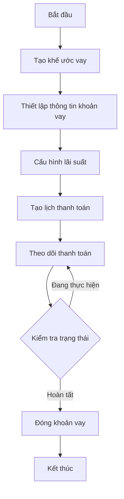
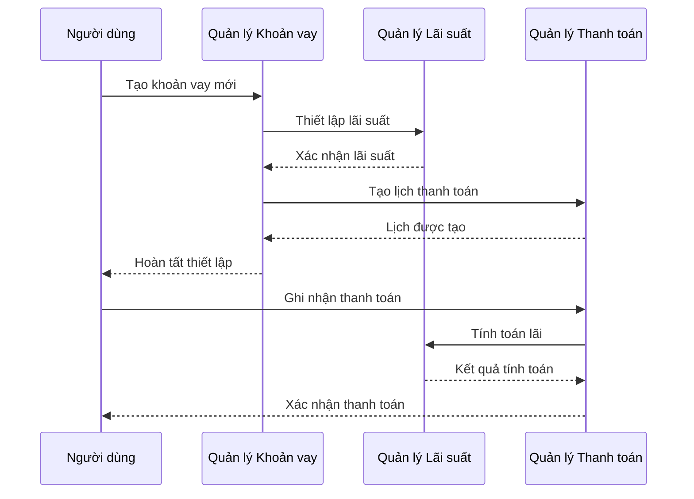
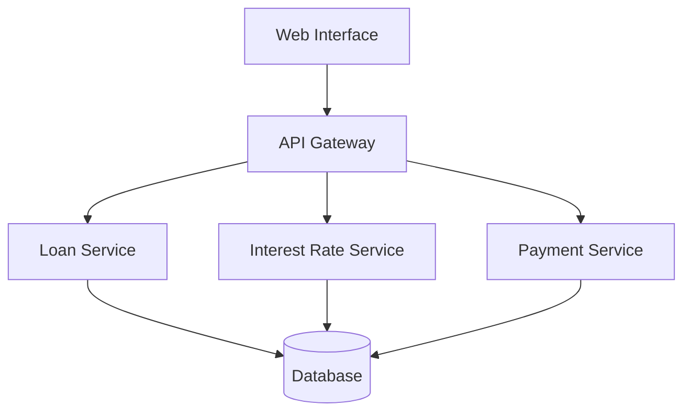
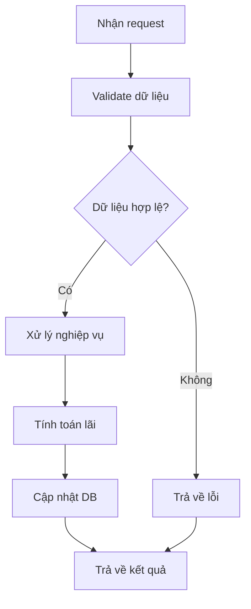
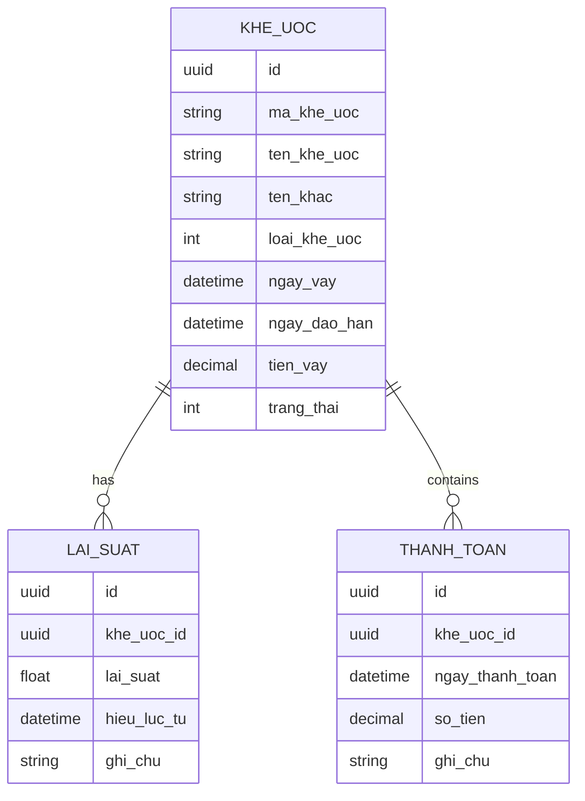

# FIN_003_Quản Lý Khoản Vay

*Phiên bản: 1.0*  
*Người tạo: ChatGPT*  
*Ngày tạo: 13/05/2025*  
*Cập nhật lần cuối: 13/05/2025*  
*Người cập nhật: ChatGPT*

## 1. Tổng Quan Nghiệp Vụ

### 1.1. Mô Tả Nghiệp Vụ
Quy trình Quản Lý Khoản Vay là một phần thiết yếu trong phân hệ Tài Chính của hệ thống ERP, cho phép doanh nghiệp quản lý các khoản vay, khế ước và hợp đồng tín dụng. Quy trình này bao gồm việc theo dõi các thông tin về khoản vay, lãi suất, lịch trả nợ và thanh toán, giúp doanh nghiệp quản lý hiệu quả các nghĩa vụ tài chính.

### 1.2. Phạm Vi Áp Dụng
- **Phòng Tài Chính**: Quản lý và theo dõi khoản vay
- **Phòng Kế Toán**: Ghi nhận và hạch toán các khoản vay
- **Ban Lãnh Đạo**: Phê duyệt và giám sát khoản vay
- **Bộ phận Pháp Chế**: Quản lý hợp đồng và khế ước

### 1.3. Định Nghĩa Thuật Ngữ
| Thuật ngữ | Định nghĩa |
|-----------|------------|
| Khế ước | Văn bản thỏa thuận vay nợ giữa các bên |
| Lãi suất | Tỷ lệ phần trăm tính trên số tiền vay |
| Kỳ hạn | Thời gian từ khi nhận nợ đến khi đáo hạn |
| Đáo hạn | Thời điểm phải hoàn trả khoản vay |

### 1.4. Tài Liệu Liên Quan
| STT | Mã tài liệu | Tên tài liệu | Mô tả |
|-----|-------------|--------------|-------|
| 1   | FIN_002 | Quản Lý Thanh Toán | Quy trình quản lý thanh toán |
| 2   | FIN_004 | Quản Lý Phí | Quy trình quản lý phí vay |
| 3   | ACC_002 | Sổ Cái | Quy trình ghi nhận bút toán |

## 2. Quy Trình Nghiệp Vụ

### 2.1. Tổng Quan Quy Trình
Quy trình Quản Lý Khoản Vay bao gồm các phần chính:
1. Thiết lập thông tin khoản vay
2. Quản lý lãi suất
3. Theo dõi lịch thanh toán
4. Ghi nhận các khoản thanh toán
5. Quản lý tình trạng khoản vay

### 2.2. Sơ Đồ Quy Trình (Business Flow)

### 2.3. Chi Tiết Các Bước Quy Trình

#### 2.3.1. Thiết Lập Khoản Vay
- **Mô tả**: Tạo mới thông tin khoản vay trong hệ thống
- **Đầu vào**: 
  - Mã khế ước
  - Thông tin người vay
  - Số tiền vay
  - Thời hạn vay
- **Đầu ra**: Khoản vay được thiết lập trong hệ thống
- **Người thực hiện**: Cán bộ tín dụng
- **Điều kiện tiên quyết**: Có hợp đồng vay được phê duyệt
- **Xử lý ngoại lệ**: Kiểm tra tính hợp lệ của thông tin

#### 2.3.2. Quản Lý Lãi Suất
- **Mô tả**: Thiết lập và điều chỉnh lãi suất khoản vay
- **Đầu vào**: 
  - Tỷ lệ lãi suất
  - Ngày hiệu lực
  - Phương pháp tính
- **Đầu ra**: Lãi suất được cập nhật
- **Người thực hiện**: Cán bộ tài chính
- **Điều kiện tiên quyết**: Có khoản vay trong hệ thống
- **Xử lý ngoại lệ**: Kiểm tra tính hợp lý của lãi suất

### 2.4. Sơ Đồ Tuần Tự (Sequence Diagram)

### 2.5. Luồng Nghiệp Vụ Thay Thế
1. **Tái cấu trúc khoản vay**:
   - Đánh giá khả năng trả nợ
   - Điều chỉnh kỳ hạn
   - Thay đổi lãi suất
   - Cập nhật lịch thanh toán

2. **Xử lý nợ quá hạn**:
   - Ghi nhận tình trạng quá hạn
   - Tính lãi phạt
   - Thực hiện các biện pháp thu hồi
   - Tái cơ cấu nợ nếu cần thiết

## 3. Yêu Cầu Chức Năng

### 3.1. Danh Sách Chức Năng

| STT | Mã chức năng | Tên chức năng | Mô tả | Độ ưu tiên |
|-----|--------------|---------------|-------|------------|
| 1   | LOAN_001 | Quản lý khế ước | Quản lý thông tin khế ước vay | Cao |
| 2   | LOAN_002 | Quản lý lãi suất | Quản lý thông tin lãi suất | Cao |
| 3   | LOAN_003 | Quản lý thanh toán | Theo dõi lịch và thực hiện thanh toán | Cao |
| 4   | LOAN_004 | Báo cáo khoản vay | Xuất báo cáo tổng hợp và chi tiết | Trung bình |

### 3.2. Chi Tiết Chức Năng

#### 3.2.1. LOAN_001: Quản lý khế ước
- **Mô tả**: Quản lý thông tin khế ước vay
- **Đầu vào**: Thông tin khế ước và khoản vay
- **Đầu ra**: Khế ước được tạo/cập nhật
- **Điều kiện tiên quyết**: Quyền quản lý khoản vay
- **Luồng xử lý chính**:
  1. Nhập thông tin khế ước
  2. Kiểm tra tính hợp lệ
  3. Lưu vào hệ thống
- **Luồng xử lý thay thế/ngoại lệ**:
  1. Kiểm tra trùng mã khế ước
  2. Xử lý lỗi validate
- **Giao diện liên quan**: Màn hình quản lý khế ước

## 4. Thiết Kế Kỹ Thuật

### 4.1. Kiến Trúc Hệ Thống

### 4.2. API Endpoints

#### 4.2.1. Quản Lý Khoản Vay
- **Mô tả**: API quản lý khoản vay
- **URL**: 
  - `GET /api/v1/loans/`
  - `POST /api/v1/loans/`
  - `PUT /api/v1/loans/{uuid}/`
  - `DELETE /api/v1/loans/{uuid}/`

#### 4.2.2. Quản Lý Lãi Suất
- **Mô tả**: API quản lý lãi suất
- **URL**:
  - `GET /api/v1/loan-interest-rates/`
  - `POST /api/v1/loan-interest-rates/`
  - `PUT /api/v1/loan-interest-rates/{uuid}/`
  - `DELETE /api/v1/loan-interest-rates/{uuid}/`

### 4.3. Service Logic

#### 4.3.1. Loan Service
- **Mô tả**: Xử lý logic khoản vay
- **Chức năng chính**:
  1. Quản lý thông tin khoản vay
  2. Tính toán lãi suất
  3. Theo dõi thanh toán
- **Các dependencies**:
  1. Database Service
  2. Validation Service
  3. Payment Service
- **Sơ đồ luồng xử lý**:

### 4.4. Mô Hình Dữ Liệu

#### 4.4.1. Entity Relationship Diagram (ERD)

#### 4.4.2. Chi Tiết Bảng Dữ Liệu

##### Bảng: KHE_UOC
- **Mô tả**: Lưu trữ thông tin khế ước vay
- **Các trường chính**:
  - id: UUID (Khóa chính)
  - ma_khe_uoc: VARCHAR(50)
  - ten_khe_uoc: VARCHAR(100)
  - trang_thai: INTEGER

##### Bảng: LAI_SUAT
- **Mô tả**: Lưu trữ thông tin lãi suất
- **Các trường chính**:
  - id: UUID (Khóa chính)
  - khe_uoc_id: UUID (Khóa ngoại)
  - lai_suat: DECIMAL
  - hieu_luc_tu: DATETIME

## 5. Kế Hoạch Kiểm Thử

### 5.1. Phạm Vi Kiểm Thử
- Kiểm thử tạo/sửa/xóa khoản vay
- Kiểm thử tính toán lãi suất
- Kiểm thử ghi nhận thanh toán
- Kiểm thử báo cáo khoản vay

### 5.2. Kịch Bản Kiểm Thử

| STT | Mã kịch bản | Tên kịch bản | Mô tả | Điều kiện tiên quyết | Các bước | Kết quả mong đợi |
|-----|------------|--------------|-------|---------------------|----------|-----------------|
| 1   | TC001 | Tạo khoản vay | Tạo mới khoản vay | Đăng nhập quyền admin | 1. Nhập thông tin 2. Submit form | Tạo thành công |
| 2   | TC002 | Cập nhật lãi suất | Thay đổi lãi suất | Có khoản vay | 1. Chọn khoản vay 2. Nhập lãi suất 3. Submit | Cập nhật thành công |

## 6. Phụ Lục

### 6.1. Danh Sách Tài Liệu Tham Khảo
1. Tài liệu thiết kế hệ thống ERP
2. Quy định về cho vay của ngân hàng nhà nước
3. Tiêu chuẩn kế toán về khoản vay

### 6.2. Danh Mục Thuật Ngữ
- ERP: Enterprise Resource Planning
- API: Application Programming Interface
- UUID: Universally Unique Identifier

### 6.3. Lịch Sử Thay Đổi Tài Liệu

| Phiên bản | Ngày | Người thực hiện | Mô tả thay đổi |
|-----------|------|-----------------|---------------|
| 1.0 | 13/05/2025 | ChatGPT | Tạo mới tài liệu |
