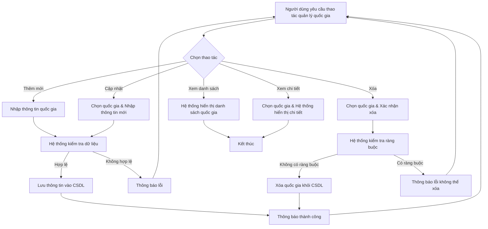
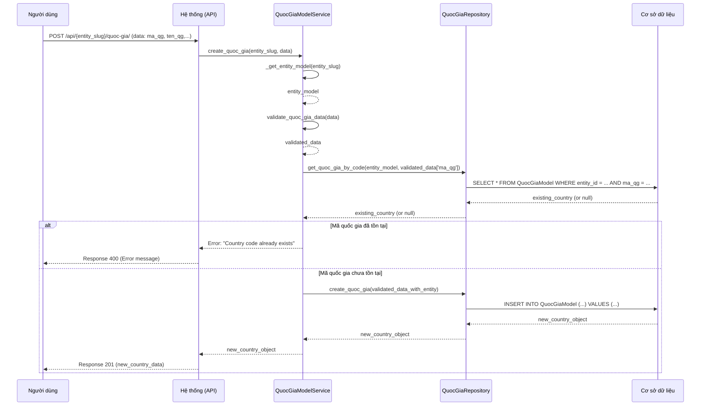

# GEO_001_Geography_Quản Lý Quốc Gia

*Phiên bản: 1.0*  
*Người tạo: Cline*  
*Ngày tạo: 13/05/2025*  
*Cập nhật lần cuối: 13/05/2025*  
*Người cập nhật: Cline*

## 1. Tổng Quan Nghiệp Vụ

### 1.1. Mô Tả Nghiệp Vụ
Nghiệp vụ này cho phép quản lý thông tin các quốc gia trong hệ thống ERP. Bao gồm việc tạo mới, xem, cập nhật và xóa thông tin quốc gia. Thông tin quốc gia là một phần quan trọng trong việc quản lý địa chỉ, khách hàng, nhà cung cấp và các giao dịch quốc tế.

### 1.2. Phạm Vi Áp Dụng
Áp dụng cho các bộ phận cần sử dụng thông tin địa lý, bao gồm bộ phận kinh doanh, mua hàng, kế toán, và quản lý kho. Người dùng có quyền quản trị hệ thống hoặc được phân quyền cụ thể mới có thể thực hiện các thao tác quản lý quốc gia.

### 1.3. Định Nghĩa Thuật Ngữ
| Thuật ngữ | Định nghĩa |
|-----------|------------|
| Mã Quốc Gia (ma_qg) | Mã định danh duy nhất cho mỗi quốc gia. |
| Tên Quốc Gia (ten_qg) | Tên chính thức của quốc gia. |
| Tên Quốc Gia Khác (ten_qg2) | Tên thay thế hoặc tên tiếng Anh của quốc gia. |
| Trạng Thái (status) | Trạng thái của quốc gia (ví dụ: 1 - Hoạt động, 0 - Không hoạt động). |
| Entity (Đơn vị) | Đơn vị/Công ty sử dụng hệ thống ERP. Mỗi quốc gia được quản lý trong phạm vi một Entity cụ thể. |

### 1.4. Tài Liệu Liên Quan
| STT | Mã tài liệu | Tên tài liệu | Mô tả |
|-----|-------------|--------------|-------|
| 1   | GEO_002 | Quản Lý Tỉnh Thành | Tài liệu mô tả quy trình quản lý thông tin tỉnh thành, có liên quan đến quốc gia. |
| 2   | GEO_005 | Quản Lý Địa Chỉ | Tài liệu mô tả quy trình quản lý thông tin địa chỉ, sử dụng thông tin quốc gia. |

## 2. Quy Trình Nghiệp Vụ

### 2.1. Tổng Quan Quy Trình
Quy trình quản lý quốc gia bao gồm các bước: người dùng yêu cầu thực hiện thao tác (thêm, sửa, xóa, xem danh sách, xem chi tiết), hệ thống kiểm tra dữ liệu và quyền hạn, sau đó thực thi yêu cầu và phản hồi kết quả cho người dùng.

### 2.2. Sơ Đồ Quy Trình (Business Flow)



### 2.3. Chi Tiết Các Bước Quy Trình

#### 2.3.1. Thêm Mới Quốc Gia
- **Mô tả**: Người dùng cung cấp thông tin để tạo một quốc gia mới.
- **Đầu vào**: Mã quốc gia, tên quốc gia, tên quốc gia khác (tùy chọn), trạng thái (mặc định là hoạt động).
- **Đầu ra**: Quốc gia mới được tạo trong hệ thống.
- **Người thực hiện**: Quản trị viên hệ thống hoặc người dùng được phân quyền.
- **Điều kiện tiên quyết**: Người dùng đã đăng nhập và có quyền thêm mới quốc gia. Mã quốc gia không được trùng lặp trong cùng một Entity.
- **Xử lý ngoại lệ**:
    - Nếu mã quốc gia đã tồn tại: Thông báo lỗi.
    - Nếu thông tin không hợp lệ (ví dụ: độ dài vượt quá giới hạn): Thông báo lỗi.

#### 2.3.2. Cập Nhật Thông Tin Quốc Gia
- **Mô tả**: Người dùng thay đổi thông tin của một quốc gia đã tồn tại.
- **Đầu vào**: UUID của quốc gia cần cập nhật, thông tin mới (mã quốc gia, tên quốc gia, tên quốc gia khác, trạng thái).
- **Đầu ra**: Thông tin quốc gia được cập nhật trong hệ thống.
- **Người thực hiện**: Quản trị viên hệ thống hoặc người dùng được phân quyền.
- **Điều kiện tiên quyết**: Quốc gia tồn tại trong hệ thống. Người dùng có quyền cập nhật.
- **Xử lý ngoại lệ**:
    - Nếu quốc gia không tồn tại: Thông báo lỗi.
    - Nếu mã quốc gia mới (nếu thay đổi) đã tồn tại cho một quốc gia khác: Thông báo lỗi.
    - Nếu thông tin không hợp lệ: Thông báo lỗi.

#### 2.3.3. Xóa Quốc Gia
- **Mô tả**: Người dùng xóa một quốc gia khỏi hệ thống.
- **Đầu vào**: UUID của quốc gia cần xóa.
- **Đầu ra**: Quốc gia bị xóa khỏi hệ thống (nếu không có ràng buộc).
- **Người thực hiện**: Quản trị viên hệ thống hoặc người dùng được phân quyền.
- **Điều kiện tiên quyết**: Quốc gia tồn tại trong hệ thống. Người dùng có quyền xóa.
- **Xử lý ngoại lệ**:
    - Nếu quốc gia không tồn tại: Thông báo lỗi.
    - Nếu quốc gia đang được sử dụng (ví dụ: có tỉnh thành liên kết): Thông báo lỗi không thể xóa hoặc yêu cầu xử lý các ràng buộc trước.

#### 2.3.4. Xem Danh Sách Quốc Gia
- **Mô tả**: Người dùng xem danh sách các quốc gia hiện có trong hệ thống, có thể kèm theo bộ lọc và phân trang.
- **Đầu vào**: Entity slug, tùy chọn: trang, kích thước trang, các tiêu chí lọc (ví dụ: theo tên, theo mã).
- **Đầu ra**: Danh sách các quốc gia thỏa mãn điều kiện.
- **Người thực hiện**: Bất kỳ người dùng nào có quyền truy cập chức năng.
- **Điều kiện tiên quyết**: Người dùng đã đăng nhập.
- **Xử lý ngoại lệ**: Không có.

#### 2.3.5. Xem Chi Tiết Quốc Gia
- **Mô tả**: Người dùng xem thông tin chi tiết của một quốc gia cụ thể.
- **Đầu vào**: UUID của quốc gia.
- **Đầu ra**: Thông tin chi tiết của quốc gia.
- **Người thực hiện**: Bất kỳ người dùng nào có quyền truy cập chức năng.
- **Điều kiện tiên quyết**: Quốc gia tồn tại trong hệ thống.
- **Xử lý ngoại lệ**: Nếu quốc gia không tồn tại: Thông báo lỗi.

### 2.4. Sơ Đồ Tuần Tự (Sequence Diagram) - Thêm Mới Quốc Gia



### 2.5. Luồng Nghiệp Vụ Thay Thế
- **Tìm kiếm quốc gia**: Người dùng có thể tìm kiếm quốc gia theo tên hoặc theo mã.

## 3. Yêu Cầu Chức Năng

### 3.1. Danh Sách Chức Năng

| STT | Mã chức năng | Tên chức năng | Mô tả | Độ ưu tiên |
|-----|--------------|---------------|-------|------------|
| 1   | GEO_001_F01 | Thêm mới quốc gia | Cho phép tạo một quốc gia mới với các thông tin cần thiết. | Cao |
| 2   | GEO_001_F02 | Cập nhật quốc gia | Cho phép sửa thông tin của một quốc gia đã có. | Cao |
| 3   | GEO_001_F03 | Xóa quốc gia | Cho phép xóa một quốc gia khỏi hệ thống. | Cao |
| 4   | GEO_001_F04 | Xem danh sách quốc gia | Hiển thị danh sách các quốc gia, hỗ trợ phân trang và lọc. | Cao |
| 5   | GEO_001_F05 | Xem chi tiết quốc gia | Hiển thị thông tin chi tiết của một quốc gia. | Cao |
| 6   | GEO_001_F06 | Tìm kiếm quốc gia theo tên | Cho phép tìm kiếm quốc gia dựa trên tên. | Trung bình |
| 7   | GEO_001_F07 | Tìm kiếm quốc gia theo mã | Cho phép tìm kiếm quốc gia dựa trên mã. | Trung bình |
| 8   | GEO_001_F08 | Lấy danh sách quốc gia đang hoạt động | Lấy danh sách các quốc gia có trạng thái là "Hoạt động". | Trung bình |

### 3.2. Chi Tiết Chức Năng

#### 3.2.1. GEO_001_F01: Thêm mới quốc gia
- **Mô tả**: Chức năng cho phép người dùng tạo mới một quốc gia trong hệ thống cho một Entity cụ thể.
- **Đầu vào**:
    - `entity_slug`: Slug của Entity.
    - `data`: Đối tượng chứa thông tin quốc gia:
        - `ma_qg` (bắt buộc): Mã quốc gia (string, max 100).
        - `ten_qg` (bắt buộc): Tên quốc gia (string, max 255).
        - `ten_qg2` (tùy chọn): Tên quốc gia khác (string, max 255). Nếu không cung cấp, sẽ lấy giá trị của `ten_qg`.
        - `status` (tùy chọn): Trạng thái (integer). Mặc định là 1 (Hoạt động).
- **Đầu ra**: Đối tượng QuocGiaModel vừa được tạo.
- **Điều kiện tiên quyết**: `entity_slug` phải hợp lệ và tồn tại. `ma_qg` không được trùng với bất kỳ quốc gia nào khác trong cùng `entity_slug`.
- **Luồng xử lý chính**:
  1. Nhận `entity_slug` và `data` từ request.
  2. Gọi `QuocGiaModelService.create_quoc_gia(entity_slug, data)`.
  3. Service lấy `EntityModel` dựa trên `entity_slug`.
  4. Service gọi `validate_quoc_gia_data(data)` để kiểm tra và chuẩn hóa dữ liệu:
     - Kiểm tra các trường bắt buộc (`ma_qg`, `ten_qg`).
     - Kiểm tra độ dài các trường.
     - Gán `ten_qg2` bằng `ten_qg` nếu `ten_qg2` rỗng.
     - Gán `status` mặc định là 1 nếu không có.
  5. Service thêm `entity_model` vào `validated_data`.
  6. Service gọi `QuocGiaRepository.get_quoc_gia_by_code()` để kiểm tra `ma_qg` đã tồn tại chưa.
  7. Nếu `ma_qg` đã tồn tại, trả về lỗi.
  8. Nếu chưa, Service gọi `QuocGiaRepository.create_quoc_gia(validated_data)` để tạo mới.
  9. Repository lưu đối tượng `QuocGiaModel` vào CSDL.
  10. Trả về đối tượng `QuocGiaModel` vừa tạo.
- **Luồng xử lý thay thế/ngoại lệ**:
  - Nếu `entity_slug` không hợp lệ: Trả về lỗi 404.
  - Nếu `ma_qg` đã tồn tại: Trả về lỗi "Country code already exists for this entity".
  - Nếu dữ liệu không hợp lệ (thiếu trường, sai kiểu, độ dài): Trả về lỗi tương ứng.
- **Giao diện liên quan**: Form thêm mới quốc gia.

#### 3.2.2. GEO_001_F02: Cập nhật quốc gia
- **Mô tả**: Chức năng cho phép người dùng cập nhật thông tin của một quốc gia đã tồn tại.
- **Đầu vào**:
    - `entity_slug`: Slug của Entity.
    - `uuid`: UUID của quốc gia cần cập nhật.
    - `data`: Đối tượng chứa thông tin cần cập nhật (tương tự như thêm mới, các trường là tùy chọn).
- **Đầu ra**: Đối tượng QuocGiaModel đã được cập nhật.
- **Điều kiện tiên quyết**: Quốc gia với `uuid` cung cấp phải tồn tại và thuộc `entity_slug`. Nếu `ma_qg` được thay đổi, mã mới không được trùng với quốc gia khác.
- **Luồng xử lý chính**:
  1. Nhận `entity_slug`, `uuid`, và `data` từ request.
  2. Gọi `QuocGiaModelService.update_quoc_gia(entity_slug, uuid, data)`.
  3. Service gọi `validate_quoc_gia_data(data)`.
  4. Service gọi `QuocGiaRepository.get_quoc_gia_by_uuid(uuid)` để lấy đối tượng quốc gia.
  5. Nếu quốc gia không tồn tại hoặc không thuộc `entity_slug`, trả về lỗi "Country not found".
  6. Nếu `ma_qg` trong `data` khác với `ma_qg` hiện tại của quốc gia:
     - Service lấy `EntityModel`.
     - Service gọi `QuocGiaRepository.get_quoc_gia_by_code()` để kiểm tra `ma_qg` mới có tồn tại không.
     - Nếu tồn tại, trả về lỗi "Country code already exists for this entity".
  7. Service gọi `QuocGiaRepository.update_quoc_gia(uuid, validated_data)` để cập nhật.
  8. Repository cập nhật thông tin đối tượng `QuocGiaModel` trong CSDL.
  9. Trả về đối tượng `QuocGiaModel` đã cập nhật.
- **Luồng xử lý thay thế/ngoại lệ**:
  - Nếu quốc gia không tồn tại: Trả về lỗi "Country not found".
  - Nếu `ma_qg` mới (nếu thay đổi) đã tồn tại: Trả về lỗi "Country code already exists for this entity".
  - Nếu dữ liệu không hợp lệ: Trả về lỗi tương ứng.
- **Giao diện liên quan**: Form cập nhật thông tin quốc gia.

#### 3.2.3. GEO_001_F03: Xóa quốc gia
- **Mô tả**: Chức năng cho phép người dùng xóa một quốc gia khỏi hệ thống.
- **Đầu vào**:
    - `entity_slug`: Slug của Entity.
    - `uuid`: UUID của quốc gia cần xóa.
- **Đầu ra**: Trạng thái xóa thành công (True/False) hoặc HTTP 204 No Content.
- **Điều kiện tiên quyết**: Quốc gia với `uuid` cung cấp phải tồn tại và thuộc `entity_slug`.
- **Luồng xử lý chính**:
  1. Nhận `entity_slug` và `uuid` từ request.
  2. Gọi `QuocGiaModelService.delete_quoc_gia(entity_slug, uuid)`.
  3. Service gọi `QuocGiaRepository.get_quoc_gia_by_uuid(uuid)` để lấy đối tượng quốc gia.
  4. Nếu quốc gia không tồn tại hoặc không thuộc `entity_slug`, trả về lỗi "Country not found".
  5. Service gọi `QuocGiaRepository.delete_quoc_gia(uuid)` để xóa.
  6. Repository xóa đối tượng `QuocGiaModel` khỏi CSDL.
  7. Trả về thông báo thành công.
- **Luồng xử lý thay thế/ngoại lệ**:
  - Nếu quốc gia không tồn tại: Trả về lỗi "Country not found".
  - Nếu có lỗi ràng buộc khóa ngoại khi xóa: Hệ thống CSDL sẽ báo lỗi, cần xử lý để thông báo cho người dùng.
- **Giao diện liên quan**: Nút xóa trên danh sách hoặc chi tiết quốc gia.

#### 3.2.4. GEO_001_F04: Xem danh sách quốc gia
- **Mô tả**: Hiển thị danh sách các quốc gia thuộc một Entity, hỗ trợ phân trang và lọc.
- **Đầu vào**:
    - `entity_slug`: Slug của Entity.
    - `user_model`: Thông tin người dùng hiện tại.
    - `page` (tùy chọn): Số trang (mặc định là 1).
    - `page_size` (tùy chọn): Số lượng mục trên mỗi trang (mặc định theo cấu hình).
    - `**kwargs` (tùy chọn): Các tham số lọc khác (ví dụ: `ten_qg__icontains`, `ma_qg`).
- **Đầu ra**:
    - Nếu `page` được cung cấp: Tuple (`QuerySet` các quốc gia của trang hiện tại, thông tin phân trang `dict`).
    - Nếu `page` không được cung cấp: `QuerySet` tất cả các quốc gia thỏa mãn điều kiện.
- **Điều kiện tiên quyết**: `entity_slug` hợp lệ.
- **Luồng xử lý chính**:
  1. Nhận các tham số đầu vào.
  2. Gọi `QuocGiaModelService.get_all_quoc_gia(entity_slug, user_model, page, page_size, **kwargs)`.
  3. Service lấy `EntityModel`.
  4. Service gọi `QuocGiaRepository.get_quoc_gia(page, page_size, entity_model, **kwargs)`.
  5. Repository thực hiện truy vấn CSDL để lấy danh sách quốc gia, áp dụng bộ lọc và phân trang.
  6. Trả về kết quả.
- **Giao diện liên quan**: Trang danh sách quốc gia.

#### 3.2.5. GEO_001_F05: Xem chi tiết quốc gia
- **Mô tả**: Hiển thị thông tin chi tiết của một quốc gia cụ thể.
- **Đầu vào**:
    - `entity_slug`: Slug của Entity (dùng để kiểm tra quốc gia có thuộc Entity không, mặc dù service hiện tại không dùng trực tiếp trong hàm get_quoc_gia).
    - `uuid`: UUID của quốc gia.
- **Đầu ra**: Đối tượng `QuocGiaModel` hoặc `None` nếu không tìm thấy.
- **Điều kiện tiên quyết**: Quốc gia với `uuid` tồn tại.
- **Luồng xử lý chính**:
  1. Nhận `entity_slug` và `uuid`.
  2. Gọi `QuocGiaModelService.get_quoc_gia(entity_slug, uuid)`.
  3. Service gọi `QuocGiaRepository.get_quoc_gia_by_uuid(uuid)`.
  4. Repository truy vấn CSDL để lấy quốc gia theo UUID.
  5. Trả về đối tượng `QuocGiaModel`.
- **Giao diện liên quan**: Trang chi tiết thông tin quốc gia.

#### 3.2.6. GEO_001_F06: Tìm kiếm quốc gia theo tên
- **Mô tả**: Tìm kiếm các quốc gia có tên chứa một chuỗi ký tự nhất định.
- **Đầu vào**:
    - `entity_slug`: Slug của Entity.
    - `ten_qg`: Chuỗi ký tự để tìm kiếm trong tên quốc gia.
- **Đầu ra**: `QuerySet` các `QuocGiaModel` phù hợp.
- **Luồng xử lý chính**:
  1. Gọi `QuocGiaModelService.search_by_name(entity_slug, ten_qg)`.
  2. Service lấy `EntityModel`.
  3. Service gọi `QuocGiaRepository.search_by_name(entity_model, ten_qg)`.
  4. Repository thực hiện truy vấn CSDL (ví dụ: `filter(entity_model=entity_model, ten_qg__icontains=ten_qg)`).
  5. Trả về `QuerySet`.

#### 3.2.7. GEO_001_F07: Tìm kiếm quốc gia theo mã
- **Mô tả**: Tìm kiếm các quốc gia có mã chứa một chuỗi ký tự nhất định.
- **Đầu vào**:
    - `entity_slug`: Slug của Entity.
    - `ma_qg`: Chuỗi ký tự để tìm kiếm trong mã quốc gia.
- **Đầu ra**: `QuerySet` các `QuocGiaModel` phù hợp.
- **Luồng xử lý chính**:
  1. Gọi `QuocGiaModelService.search_by_code(entity_slug, ma_qg)`.
  2. Service lấy `EntityModel`.
  3. Service gọi `QuocGiaRepository.search_by_code(entity_model, ma_qg)`.
  4. Repository thực hiện truy vấn CSDL (ví dụ: `filter(entity_model=entity_model, ma_qg__icontains=ma_qg)`).
  5. Trả về `QuerySet`.

#### 3.2.8. GEO_001_F08: Lấy danh sách quốc gia đang hoạt động
- **Mô tả**: Lấy danh sách tất cả các quốc gia có trạng thái là "Hoạt động" (status=1) thuộc một Entity.
- **Đầu vào**:
    - `entity_slug`: Slug của Entity.
    - `user_model`: Thông tin người dùng hiện tại.
- **Đầu ra**: `QuerySet` các `QuocGiaModel` đang hoạt động.
- **Luồng xử lý chính**:
  1. Gọi `QuocGiaModelService.get_active_quoc_gia(entity_slug, user_model)`.
  2. Service lấy `EntityModel`.
  3. Service gọi `QuocGiaRepository.get_active_quoc_gia()`.
  4. Repository truy vấn CSDL (`filter(status=1)`).
  5. Service tiếp tục lọc theo `entity_model`.
  6. Trả về `QuerySet`.

## 4. Thiết Kế Kỹ Thuật

### 4.1. Kiến Trúc Hệ Thống
Nghiệp vụ quản lý quốc gia tuân theo kiến trúc 3 lớp của Django:
- **Views/APIs**: Xử lý HTTP requests, gọi services.
- **Services (`QuocGiaModelService`)**: Chứa business logic, điều phối giữa API và Repository, thực hiện validation.
- **Repositories (`QuocGiaRepository`)**: Tương tác trực tiếp với CSDL thông qua Django ORM, thực hiện các thao tác CRUD.
- **Models (`QuocGiaModel`, `EntityModel`)**: Định nghĩa cấu trúc dữ liệu.

```mermaid
graph TD
    Client[Client (Web/Mobile App)] --> API[Django REST Framework API Views]
    API --> Service[QuocGiaModelService]
    Service --> Repository[QuocGiaRepository]
    Repository --> ORM[Django ORM]
    ORM --> DB[(Database - QuocGiaModel Table)]
```

### 4.2. API Endpoints

#### 4.2.1. Quản lý Quốc Gia
- **Mô tả**: Cung cấp các endpoints cho CRUD và tìm kiếm quốc gia.
- **Base URL**: `/api/{entity_slug}/quoc-gia/`
- **Endpoints**:
    - `GET /`: Lấy danh sách quốc gia (hỗ trợ phân trang, lọc). (GEO_001_F04)
        - Query params: `page`, `page_size`, `ma_qg`, `ten_qg`, `status`.
    - `POST /`: Tạo mới một quốc gia. (GEO_001_F01)
        - Request body: `{ "ma_qg": "VN", "ten_qg": "Việt Nam", "ten_qg2": "Vietnam", "status": 1 }`
    - `GET /{uuid}/`: Lấy chi tiết một quốc gia. (GEO_001_F05)
    - `PUT /{uuid}/`: Cập nhật thông tin một quốc gia. (GEO_001_F02)
        - Request body: Tương tự POST, các trường là tùy chọn.
    - `PATCH /{uuid}/`: Cập nhật một phần thông tin một quốc gia. (GEO_001_F02)
        - Request body: Tương tự POST, chỉ chứa các trường cần cập nhật.
    - `DELETE /{uuid}/`: Xóa một quốc gia. (GEO_001_F03)
    - `GET /active/`: Lấy danh sách các quốc gia đang hoạt động. (GEO_001_F08)
    - `GET /search-by-name/?name={ten_qg}`: Tìm kiếm quốc gia theo tên. (GEO_001_F06)
    - `GET /search-by-code/?code={ma_qg}`: Tìm kiếm quốc gia theo mã. (GEO_001_F07)

### 4.3. Service Logic (`QuocGiaModelService`)

#### 4.3.1. `QuocGiaModelService`
- **Mô tả**: Service chịu trách nhiệm xử lý logic nghiệp vụ liên quan đến `QuocGiaModel`.
- **Chức năng chính**:
  1. `_get_entity_model(entity_slug)`: Lấy `EntityModel` từ `entity_slug`.
  2. `validate_quoc_gia_data(data)`: Kiểm tra tính hợp lệ của dữ liệu đầu vào cho quốc gia.
     - Kiểm tra trường bắt buộc.
     - Kiểm tra độ dài.
     - Gán giá trị mặc định cho `ten_qg2` và `status`.
  3. `get_quoc_gia(entity_slug, uuid)`: Lấy một quốc gia theo UUID.
  4. `get_all_quoc_gia(entity_slug, user_model, page, page_size, **kwargs)`: Lấy danh sách quốc gia có phân trang và lọc.
  5. `get_active_quoc_gia(entity_slug, user_model)`: Lấy danh sách quốc gia đang hoạt động.
  6. `create_quoc_gia(entity_slug, data)`: Tạo mới quốc gia.
     - Lấy `EntityModel`.
     - Validate dữ liệu.
     - Gán `entity_model` vào dữ liệu.
     - Kiểm tra `ma_qg` đã tồn tại chưa.
     - Gọi repository để tạo.
  7. `update_quoc_gia(entity_slug, uuid, data)`: Cập nhật quốc gia.
     - Validate dữ liệu.
     - Kiểm tra quốc gia tồn tại và thuộc entity.
     - Nếu `ma_qg` thay đổi, kiểm tra mã mới có bị trùng không.
     - Gọi repository để cập nhật.
  8. `delete_quoc_gia(entity_slug, uuid)`: Xóa quốc gia.
     - Kiểm tra quốc gia tồn tại và thuộc entity.
     - Gọi repository để xóa.
  9. `search_by_name(entity_slug, ten_qg)`: Tìm kiếm quốc gia theo tên.
  10. `search_by_code(entity_slug, ma_qg)`: Tìm kiếm quốc gia theo mã.
- **Các dependencies**:
  - `django_ledger.models.QuocGiaModel`
  - `django_ledger.models.EntityModel`
  - `django_ledger.repositories.quoc_gia.QuocGiaRepository`
- **Sơ đồ luồng xử lý (Ví dụ: `create_quoc_gia`)**:

```mermaid
flowchart TD
    A[API nhận request POST /api/{entity_slug}/quoc-gia/] --> B[Gọi QuocGiaModelService.create_quoc_gia(slug, data)];
    B --> C[Service: _get_entity_model(slug)];
    C --> D{Entity tồn tại?};
    D --Không--> E[Trả lỗi 404];
    D --Có--> F[Service: validate_quoc_gia_data(data)];
    F --> G{Dữ liệu hợp lệ?};
    G --Không--> H[Trả lỗi validation (400)];
    G --Có--> I[Service: Gán entity_model vào data];
    I --> J[Service: Gọi Repository.get_quoc_gia_by_code(entity, data.ma_qg)];
    J --> K{Mã QG đã tồn tại?};
    K --Có--> L[Trả lỗi "Mã QG đã tồn tại" (400)];
    K --Không--> M[Service: Gọi Repository.create_quoc_gia(validated_data)];
    M --> N[Repository: Lưu QuocGiaModel vào DB];
    N --> O[Trả về QuocGiaModel mới (201)];
    E --> Z[Kết thúc];
    H --> Z;
    L --> Z;
    O --> Z;
```

### 4.4. Mô Hình Dữ Liệu

#### 4.4.1. Entity Relationship Diagram (ERD)

```mermaid
erDiagram
    ENTITY ||--|{ QUOC_GIA : "quản lý bởi"
    QUOC_GIA ||--o{ TINH_THANH : "có"

    ENTITY {
        uuid uuid PK
        string slug "Mã định danh Entity"
        string name "Tên Entity"
        --
        string default_country "Quốc gia mặc định (tham chiếu QUOC_GIA)"
        --
        <em>(các trường khác của EntityModel)</em>
    }

    QUOC_GIA {
        uuid uuid PK
        string ma_qg "Mã quốc gia (duy nhất trong Entity)"
        string ten_qg "Tên quốc gia"
        string ten_qg2 "Tên quốc gia khác"
        integer status "Trạng thái (1: Hoạt động, 0: Không hoạt động)"
        datetime created "Ngày tạo"
        datetime updated "Ngày cập nhật"
        uuid entity_id FK "Khóa ngoại tới ENTITY"
    }

    TINH_THANH {
        uuid uuid PK
        string ma_tinh "Mã tỉnh thành"
        string ten_tinh "Tên tỉnh thành"
        uuid quoc_gia_id FK "Khóa ngoại tới QUOC_GIA"
        uuid entity_id FK "Khóa ngoại tới ENTITY"
        <em>(các trường khác)</em>
    }
```

#### 4.4.2. Chi Tiết Bảng Dữ Liệu

##### Bảng: `QuocGiaModel` (django_ledger_quocgiamodel)
- **Mô tả**: Lưu trữ thông tin các quốc gia.
- **Các cột chính**:
    - `uuid` (UUID, Khóa chính): ID duy nhất của quốc gia.
    - `ma_qg` (CharField, max_length=100): Mã quốc gia, phải là duy nhất trong phạm vi một `EntityModel`.
    - `ten_qg` (CharField, max_length=255): Tên quốc gia.
    - `ten_qg2` (CharField, max_length=255, null=True, blank=True): Tên quốc gia thay thế.
    - `status` (IntegerField, default=1): Trạng thái (ví dụ: 1 cho hoạt động, 0 cho không hoạt động).
    - `entity_model` (ForeignKey đến `EntityModel`): Liên kết đến Entity mà quốc gia này thuộc về.
    - `created` (DateTimeField, auto_now_add=True): Thời điểm tạo.
    - `updated` (DateTimeField, auto_now=True): Thời điểm cập nhật cuối cùng.
- **Indexes**:
    - `unique_together = ('entity_model', 'ma_qg')`: Đảm bảo `ma_qg` là duy nhất cho mỗi `entity_model`.

##### Bảng: `EntityModel` (django_ledger_entitymodel)
- **Mô tả**: Lưu trữ thông tin các đơn vị/công ty sử dụng hệ thống.
- **Các cột liên quan**:
    - `uuid` (UUID, Khóa chính): ID duy nhất của Entity.
    - `slug` (SlugField, unique=True): Mã slug duy nhất của Entity.
    - `name` (CharField): Tên của Entity.
    - `default_country` (ForeignKey đến `QuocGiaModel`, null=True, blank=True): Quốc gia mặc định cho Entity này.

## 5. Kế Hoạch Kiểm Thử

### 5.1. Phạm Vi Kiểm Thử
- Kiểm thử tất cả các chức năng CRUD (Thêm, Xem, Sửa, Xóa) cho Quốc Gia.
- Kiểm thử chức năng tìm kiếm, lọc và phân trang.
- Kiểm thử validation dữ liệu đầu vào.
- Kiểm thử ràng buộc duy nhất của `ma_qg` theo `entity_model`.
- Kiểm thử quyền truy cập của người dùng.

### 5.2. Kịch Bản Kiểm Thử

| STT | Mã kịch bản | Tên kịch bản | Mô tả | Điều kiện tiên quyết | Các bước | Kết quả mong đợi |
|-----|------------|--------------|-------|---------------------|----------|-----------------|
| 1   | GEO_001_TC01 | Thêm mới quốc gia thành công | Kiểm tra việc thêm mới một quốc gia với dữ liệu hợp lệ. | User đã đăng nhập, có quyền. Entity tồn tại. | 1. Truy cập API POST `/api/{entity_slug}/quoc-gia/`. 2. Gửi payload: `{"ma_qg": "US", "ten_qg": "United States", "status": 1}`. | 1. Response HTTP 201. 2. Dữ liệu quốc gia được trả về. 3. Quốc gia được lưu vào CSDL. |
| 2   | GEO_001_TC02 | Thêm mới quốc gia với mã trùng | Kiểm tra việc thêm mới quốc gia có `ma_qg` đã tồn tại trong cùng Entity. | Như TC01. Quốc gia với `ma_qg="US"` đã tồn tại. | 1. Truy cập API POST `/api/{entity_slug}/quoc-gia/`. 2. Gửi payload: `{"ma_qg": "US", "ten_qg": "Hoa Kỳ"}`. | 1. Response HTTP 400. 2. Thông báo lỗi "Country code already exists for this entity". |
| 3   | GEO_001_TC03 | Thêm mới quốc gia thiếu trường bắt buộc | Kiểm tra việc thêm mới quốc gia thiếu `ten_qg`. | Như TC01. | 1. Truy cập API POST `/api/{entity_slug}/quoc-gia/`. 2. Gửi payload: `{"ma_qg": "CA"}`. | 1. Response HTTP 400. 2. Thông báo lỗi "ten_qg is required". |
| 4   | GEO_001_TC04 | Cập nhật quốc gia thành công | Kiểm tra cập nhật tên quốc gia. | Như TC01. Quốc gia "US" đã tồn tại (uuid_us). | 1. Truy cập API PUT `/api/{entity_slug}/quoc-gia/{uuid_us}/`. 2. Gửi payload: `{"ten_qg": "United States of America"}`. | 1. Response HTTP 200. 2. Dữ liệu quốc gia được cập nhật trả về. 3. Tên quốc gia trong CSDL được thay đổi. |
| 5   | GEO_001_TC05 | Cập nhật quốc gia với mã trùng | Kiểm tra cập nhật `ma_qg` thành mã đã tồn tại của quốc gia khác. | Như TC01. Quốc gia "US" (uuid_us) và "VN" (uuid_vn) đã tồn tại. | 1. Truy cập API PUT `/api/{entity_slug}/quoc-gia/{uuid_us}/`. 2. Gửi payload: `{"ma_qg": "VN"}`. | 1. Response HTTP 400. 2. Thông báo lỗi "Country code already exists for this entity". |
| 6   | GEO_001_TC06 | Xóa quốc gia thành công | Kiểm tra xóa quốc gia không có ràng buộc. | Như TC01. Quốc gia "CA" (uuid_ca) tồn tại, không có tỉnh thành nào thuộc "CA". | 1. Truy cập API DELETE `/api/{entity_slug}/quoc-gia/{uuid_ca}/`. | 1. Response HTTP 204. 2. Quốc gia "CA" bị xóa khỏi CSDL. |
| 7   | GEO_001_TC07 | Xóa quốc gia không tồn tại | Kiểm tra xóa quốc gia với UUID không tồn tại. | Như TC01. | 1. Truy cập API DELETE `/api/{entity_slug}/quoc-gia/{invalid_uuid}/`. | 1. Response HTTP 404. 2. Thông báo lỗi "Country not found". |
| 8   | GEO_001_TC08 | Xem danh sách quốc gia | Kiểm tra lấy danh sách quốc gia. | Có một số quốc gia đã được tạo. | 1. Truy cập API GET `/api/{entity_slug}/quoc-gia/`. | 1. Response HTTP 200. 2. Danh sách các quốc gia được trả về. |
| 9   | GEO_001_TC09 | Xem danh sách quốc gia có phân trang | Kiểm tra phân trang. | Có >5 quốc gia. | 1. Truy cập API GET `/api/{entity_slug}/quoc-gia/?page=1&page_size=5`. | 1. Response HTTP 200. 2. Trả về 5 quốc gia đầu tiên và thông tin phân trang. |
| 10  | GEO_001_TC10 | Xem chi tiết quốc gia | Kiểm tra lấy chi tiết một quốc gia. | Quốc gia "US" (uuid_us) tồn tại. | 1. Truy cập API GET `/api/{entity_slug}/quoc-gia/{uuid_us}/`. | 1. Response HTTP 200. 2. Thông tin chi tiết của quốc gia "US" được trả về. |

## 6. Phụ Lục

### 6.1. Danh Sách Tài Liệu Tham Khảo
- Mã nguồn Django Ledger: `django_ledger/services/quoc_gia/quoc_gia.py`
- Mã nguồn Django Ledger: `django_ledger/repositories/quoc_gia/quoc_gia.py`
- Mã nguồn Django Ledger: `django_ledger/models/quoc_gia.py` (nếu có, hoặc kiểm tra `BaseModel` và các trường được định nghĩa trong service/repository)

### 6.2. Danh Mục Thuật Ngữ
(Đã định nghĩa ở mục 1.3)

### 6.3. Lịch Sử Thay Đổi Tài Liệu

| Phiên bản | Ngày | Người thực hiện | Mô tả thay đổi |
|-----------|------|-----------------|---------------|
| 1.0 | 13/05/2025 | Cline | Tạo mới tài liệu. |
