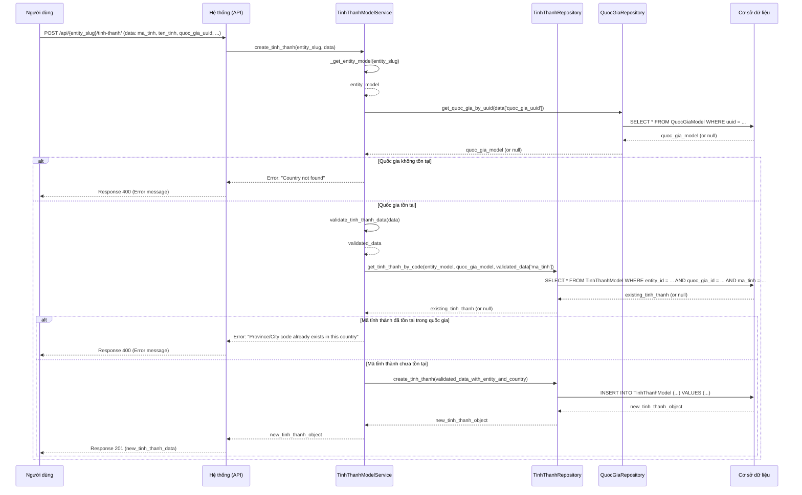

# GEO_002_Geography_Quản Lý Tỉnh Thành

*Phiên bản: 1.0*
*Người tạo: Cline*
*Ngày tạo: 13/05/2025*
*Cập nhật lần cuối: 13/05/2025*
*Người cập nhật: Cline*

## 1. Tổng Quan Nghiệp Vụ

### 1.1. Mô Tả Nghiệp Vụ
Nghiệp vụ này cho phép quản lý thông tin các tỉnh thành (hoặc thành phố trực thuộc trung ương) trong hệ thống ERP. Bao gồm việc tạo mới, xem, cập nhật và xóa thông tin tỉnh thành. Thông tin tỉnh thành là một phần quan trọng trong việc quản lý địa chỉ chi tiết, phân vùng địa lý cho khách hàng, nhà cung cấp.

### 1.2. Phạm Vi Áp Dụng
Áp dụng cho các bộ phận cần sử dụng thông tin địa lý chi tiết, bao gồm bộ phận kinh doanh, mua hàng, kế toán, và quản lý kho. Người dùng có quyền quản trị hệ thống hoặc được phân quyền cụ thể mới có thể thực hiện các thao tác quản lý tỉnh thành.

### 1.3. Định Nghĩa Thuật Ngữ
| Thuật ngữ | Định nghĩa |
|-----------|------------|
| Mã Tỉnh Thành (ma_tinh) | Mã định danh duy nhất cho mỗi tỉnh thành trong một quốc gia. |
| Tên Tỉnh Thành (ten_tinh) | Tên chính thức của tỉnh thành. |
| Tên Tỉnh Thành Khác (ten_tinh2) | Tên thay thế hoặc tên tiếng Anh của tỉnh thành. |
| Quốc Gia (quoc_gia) | Quốc gia mà tỉnh thành này trực thuộc. |
| Trạng Thái (status) | Trạng thái của tỉnh thành (ví dụ: 1 - Hoạt động, 0 - Không hoạt động). |
| Entity (Đơn vị) | Đơn vị/Công ty sử dụng hệ thống ERP. Mỗi tỉnh thành được quản lý trong phạm vi một Entity cụ thể. |

### 1.4. Tài Liệu Liên Quan
| STT | Mã tài liệu | Tên tài liệu | Mô tả |
|-----|-------------|--------------|-------|
| 1   | GEO_001 | Quản Lý Quốc Gia | Tài liệu mô tả quy trình quản lý thông tin quốc gia, là cấp cha của tỉnh thành. |
| 2   | GEO_003 | Quản Lý Quận Huyện | Tài liệu mô tả quy trình quản lý thông tin quận huyện, là cấp con của tỉnh thành. |
| 3   | GEO_006 | Quản Lý Địa Chỉ | Tài liệu mô tả quy trình quản lý thông tin địa chỉ, sử dụng thông tin tỉnh thành. |

## 2. Quy Trình Nghiệp Vụ

### 2.1. Tổng Quan Quy Trình
Quy trình quản lý tỉnh thành bao gồm các bước: người dùng yêu cầu thực hiện thao tác (thêm, sửa, xóa, xem danh sách, xem chi tiết), hệ thống kiểm tra dữ liệu và quyền hạn, sau đó thực thi yêu cầu và phản hồi kết quả cho người dùng.

### 2.2. Sơ Đồ Quy Trình (Business Flow)

```mermaid
flowchart TD
    A[Người dùng yêu cầu thao tác quản lý tỉnh thành] --> B{Chọn thao tác};
    B -->|Thêm mới| C[Nhập thông tin tỉnh thành (bao gồm chọn Quốc Gia)];
    B -->|Cập nhật| D[Chọn tỉnh thành & Nhập thông tin mới];
    B -->|Xóa| E[Chọn tỉnh thành & Xác nhận xóa];
    B -->|Xem danh sách| F[Hệ thống hiển thị danh sách tỉnh thành (có thể lọc theo Quốc Gia)];
    B -->|Xem chi tiết| G[Chọn tỉnh thành & Hệ thống hiển thị chi tiết];
    C --> H[Hệ thống kiểm tra dữ liệu];
    D --> H;
    H -->|Hợp lệ| I[Lưu thông tin vào CSDL];
    H -->|Không hợp lệ| J[Thông báo lỗi];
    I --> K[Thông báo thành công];
    E --> L[Hệ thống kiểm tra ràng buộc (ví dụ: Quận Huyện)];
    L -->|Không có ràng buộc| M[Xóa tỉnh thành khỏi CSDL];
    L -->|Có ràng buộc| N[Thông báo lỗi không thể xóa];
    M --> K;
    F --> Z[Kết thúc];
    G --> Z;
    J --> A;
    K --> A;
    N --> A;
```

### 2.3. Chi Tiết Các Bước Quy Trình

#### 2.3.1. Thêm Mới Tỉnh Thành
- **Mô tả**: Người dùng cung cấp thông tin để tạo một tỉnh thành mới, liên kết với một quốc gia cụ thể.
- **Đầu vào**: Mã tỉnh thành, tên tỉnh thành, tên tỉnh thành khác (tùy chọn), UUID của quốc gia, trạng thái (mặc định là hoạt động).
- **Đầu ra**: Tỉnh thành mới được tạo trong hệ thống.
- **Người thực hiện**: Quản trị viên hệ thống hoặc người dùng được phân quyền.
- **Điều kiện tiên quyết**: Người dùng đã đăng nhập và có quyền. Quốc gia liên kết phải tồn tại. Mã tỉnh thành không được trùng lặp trong cùng một quốc gia và Entity.
- **Xử lý ngoại lệ**:
    - Nếu mã tỉnh thành đã tồn tại trong quốc gia đó: Thông báo lỗi.
    - Nếu quốc gia không tồn tại: Thông báo lỗi.
    - Nếu thông tin không hợp lệ: Thông báo lỗi.

#### 2.3.2. Cập Nhật Thông Tin Tỉnh Thành
- **Mô tả**: Người dùng thay đổi thông tin của một tỉnh thành đã tồn tại.
- **Đầu vào**: UUID của tỉnh thành cần cập nhật, thông tin mới (mã tỉnh thành, tên tỉnh thành, tên tỉnh thành khác, UUID quốc gia, trạng thái).
- **Đầu ra**: Thông tin tỉnh thành được cập nhật trong hệ thống.
- **Người thực hiện**: Quản trị viên hệ thống hoặc người dùng được phân quyền.
- **Điều kiện tiên quyết**: Tỉnh thành tồn tại trong hệ thống. Người dùng có quyền cập nhật.
- **Xử lý ngoại lệ**:
    - Nếu tỉnh thành không tồn tại: Thông báo lỗi.
    - Nếu mã tỉnh thành mới (nếu thay đổi) đã tồn tại cho một tỉnh thành khác trong cùng quốc gia: Thông báo lỗi.
    - Nếu thông tin không hợp lệ: Thông báo lỗi.

#### 2.3.3. Xóa Tỉnh Thành
- **Mô tả**: Người dùng xóa một tỉnh thành khỏi hệ thống.
- **Đầu vào**: UUID của tỉnh thành cần xóa.
- **Đầu ra**: Tỉnh thành bị xóa khỏi hệ thống (nếu không có ràng buộc).
- **Người thực hiện**: Quản trị viên hệ thống hoặc người dùng được phân quyền.
- **Điều kiện tiên quyết**: Tỉnh thành tồn tại trong hệ thống. Người dùng có quyền xóa.
- **Xử lý ngoại lệ**:
    - Nếu tỉnh thành không tồn tại: Thông báo lỗi.
    - Nếu tỉnh thành đang được sử dụng (ví dụ: có quận huyện liên kết): Thông báo lỗi không thể xóa.

#### 2.3.4. Xem Danh Sách Tỉnh Thành
- **Mô tả**: Người dùng xem danh sách các tỉnh thành, có thể lọc theo quốc gia, và phân trang.
- **Đầu vào**: Entity slug, tùy chọn: UUID quốc gia, trang, kích thước trang, các tiêu chí lọc (tên, mã).
- **Đầu ra**: Danh sách các tỉnh thành thỏa mãn điều kiện.
- **Người thực hiện**: Bất kỳ người dùng nào có quyền truy cập chức năng.
- **Điều kiện tiên quyết**: Người dùng đã đăng nhập.

#### 2.3.5. Xem Chi Tiết Tỉnh Thành
- **Mô tả**: Người dùng xem thông tin chi tiết của một tỉnh thành cụ thể.
- **Đầu vào**: UUID của tỉnh thành.
- **Đầu ra**: Thông tin chi tiết của tỉnh thành.
- **Người thực hiện**: Bất kỳ người dùng nào có quyền truy cập chức năng.
- **Điều kiện tiên quyết**: Tỉnh thành tồn tại trong hệ thống.
- **Xử lý ngoại lệ**: Nếu tỉnh thành không tồn tại: Thông báo lỗi.

### 2.4. Sơ Đồ Tuần Tự (Sequence Diagram) - Thêm Mới Tỉnh Thành



### 2.5. Luồng Nghiệp Vụ Thay Thế
- **Tìm kiếm tỉnh thành**: Người dùng có thể tìm kiếm tỉnh thành theo tên hoặc theo mã.
- **Lọc tỉnh thành theo quốc gia**: Người dùng có thể xem danh sách tỉnh thành thuộc một quốc gia cụ thể.

## 3. Yêu Cầu Chức Năng

### 3.1. Danh Sách Chức Năng

| STT | Mã chức năng | Tên chức năng | Mô tả | Độ ưu tiên |
|-----|--------------|---------------|-------|------------|
| 1   | GEO_002_F01 | Thêm mới tỉnh thành | Cho phép tạo một tỉnh thành mới với các thông tin cần thiết, thuộc một quốc gia. | Cao |
| 2   | GEO_002_F02 | Cập nhật tỉnh thành | Cho phép sửa thông tin của một tỉnh thành đã có. | Cao |
| 3   | GEO_002_F03 | Xóa tỉnh thành | Cho phép xóa một tỉnh thành khỏi hệ thống. | Cao |
| 4   | GEO_002_F04 | Xem danh sách tỉnh thành | Hiển thị danh sách các tỉnh thành, hỗ trợ phân trang và lọc (theo quốc gia, tên, mã). | Cao |
| 5   | GEO_002_F05 | Xem chi tiết tỉnh thành | Hiển thị thông tin chi tiết của một tỉnh thành. | Cao |
| 6   | GEO_002_F06 | Tìm kiếm tỉnh thành theo tên | Cho phép tìm kiếm tỉnh thành dựa trên tên. | Trung bình |
| 7   | GEO_002_F07 | Tìm kiếm tỉnh thành theo mã | Cho phép tìm kiếm tỉnh thành dựa trên mã. | Trung bình |
| 8   | GEO_002_F08 | Lấy danh sách tỉnh thành đang hoạt động | Lấy danh sách các tỉnh thành có trạng thái là "Hoạt động". | Trung bình |
| 9   | GEO_002_F09 | Lấy danh sách tỉnh thành theo quốc gia | Lấy danh sách các tỉnh thành thuộc một quốc gia cụ thể. | Cao |

### 3.2. Chi Tiết Chức Năng

#### 3.2.1. GEO_002_F01: Thêm mới tỉnh thành
- **Mô tả**: Chức năng cho phép người dùng tạo mới một tỉnh thành.
- **Đầu vào**:
    - `entity_slug`: Slug của Entity.
    - `data`: Đối tượng chứa thông tin tỉnh thành:
        - `ma_tinh` (bắt buộc): Mã tỉnh thành (string, max 100).
        - `ten_tinh` (bắt buộc): Tên tỉnh thành (string, max 255).
        - `ten_tinh2` (tùy chọn): Tên tỉnh thành khác (string, max 255).
        - `quoc_gia_uuid` (bắt buộc): UUID của Quốc Gia.
        - `status` (tùy chọn): Trạng thái (integer). Mặc định là 1.
- **Đầu ra**: Đối tượng TinhThanhModel vừa được tạo.
- **Điều kiện tiên quyết**: `entity_slug` và `quoc_gia_uuid` hợp lệ. `ma_tinh` không trùng trong cùng `entity_slug` và `quoc_gia_uuid`.
- **Luồng xử lý chính**:
  1. Service lấy `EntityModel` và `QuocGiaModel`.
  2. Service validate dữ liệu (`ma_tinh`, `ten_tinh`, `quoc_gia_uuid`).
  3. Service kiểm tra `ma_tinh` đã tồn tại trong `Entity` và `QuocGia` chưa.
  4. Nếu chưa, Service gọi Repository để tạo mới.
- **Giao diện liên quan**: Form thêm mới tỉnh thành.

#### 3.2.2. GEO_002_F02: Cập nhật tỉnh thành
- **Mô tả**: Cập nhật thông tin tỉnh thành.
- **Đầu vào**:
    - `entity_slug`: Slug của Entity.
    - `uuid`: UUID của tỉnh thành.
    - `data`: Thông tin cập nhật (tương tự thêm mới, các trường tùy chọn).
- **Đầu ra**: Đối tượng TinhThanhModel đã cập nhật.
- **Điều kiện tiên quyết**: Tỉnh thành tồn tại. Nếu `ma_tinh` hoặc `quoc_gia_uuid` thay đổi, mã mới không được trùng.
- **Giao diện liên quan**: Form cập nhật tỉnh thành.

#### 3.2.3. GEO_002_F03: Xóa tỉnh thành
- **Mô tả**: Xóa một tỉnh thành.
- **Đầu vào**: `entity_slug`, `uuid` của tỉnh thành.
- **Đầu ra**: HTTP 204 No Content.
- **Điều kiện tiên quyết**: Tỉnh thành tồn tại và không có ràng buộc (ví dụ: Quận Huyện).
- **Giao diện liên quan**: Nút xóa.

#### 3.2.4. GEO_002_F04: Xem danh sách tỉnh thành
- **Mô tả**: Lấy danh sách tỉnh thành, có phân trang và lọc.
- **Đầu vào**: `entity_slug`, `page`, `page_size`, `quoc_gia_uuid` (lọc), `ma_tinh`, `ten_tinh`.
- **Đầu ra**: Danh sách TinhThanhModel.
- **Giao diện liên quan**: Trang danh sách tỉnh thành.

#### 3.2.5. GEO_002_F05: Xem chi tiết tỉnh thành
- **Mô tả**: Lấy chi tiết một tỉnh thành.
- **Đầu vào**: `entity_slug`, `uuid` của tỉnh thành.
- **Đầu ra**: Đối tượng TinhThanhModel.
- **Giao diện liên quan**: Trang chi tiết tỉnh thành.

#### 3.2.9. GEO_002_F09: Lấy danh sách tỉnh thành theo quốc gia
- **Mô tả**: Lấy danh sách các tỉnh thành thuộc một quốc gia cụ thể.
- **Đầu vào**: `entity_slug`, `quoc_gia_uuid`.
- **Đầu ra**: `QuerySet` các `TinhThanhModel`.

## 4. Thiết Kế Kỹ Thuật

### 4.1. Kiến Trúc Hệ Thống
Tương tự GEO_001, sử dụng Views/APIs, Services (`TinhThanhModelService`), Repositories (`TinhThanhRepository`), Models (`TinhThanhModel`, `QuocGiaModel`, `EntityModel`).

### 4.2. API Endpoints

- **Base URL**: `/api/{entity_slug}/tinh-thanh/`
- **Endpoints**:
    - `GET /`: Lấy danh sách tỉnh thành. (GEO_002_F04)
        - Query params: `page`, `page_size`, `quoc_gia_uuid`, `ma_tinh`, `ten_tinh`, `status`.
    - `POST /`: Tạo mới tỉnh thành. (GEO_002_F01)
        - Request body: `{ "ma_tinh": "HCM", "ten_tinh": "Hồ Chí Minh", "quoc_gia_uuid": "uuid_cua_VN", "status": 1 }`
    - `GET /{uuid}/`: Lấy chi tiết tỉnh thành. (GEO_002_F05)
    - `PUT /{uuid}/`: Cập nhật tỉnh thành. (GEO_002_F02)
    - `PATCH /{uuid}/`: Cập nhật một phần tỉnh thành. (GEO_002_F02)
    - `DELETE /{uuid}/`: Xóa tỉnh thành. (GEO_002_F03)
    - `GET /theo-quoc-gia/{quoc_gia_uuid}/`: Lấy tỉnh thành theo quốc gia. (GEO_002_F09)

### 4.3. Service Logic (`TinhThanhModelService`)
- Tương tự `QuocGiaModelService` nhưng cho `TinhThanhModel`.
- Sẽ có thêm logic kiểm tra sự tồn tại của `QuocGiaModel` khi tạo/cập nhật tỉnh thành.
- Validate `ma_tinh` phải duy nhất trong phạm vi `Entity` và `QuocGia`.

### 4.4. Mô Hình Dữ Liệu

#### 4.4.1. Entity Relationship Diagram (ERD)

```mermaid
erDiagram
    ENTITY ||--|{ QUOC_GIA : "quản lý"
    ENTITY ||--|{ TINH_THANH : "quản lý"
    ENTITY ||--|{ QUAN_HUYEN : "quản lý"

    QUOC_GIA ||--o{ TINH_THANH : "có"
    TINH_THANH ||--o{ QUAN_HUYEN : "có"

    ENTITY {
        uuid uuid PK
        string slug
        string name
        <em>(các trường khác)</em>
    }

    QUOC_GIA {
        uuid uuid PK
        string ma_qg
        string ten_qg
        uuid entity_id FK
        <em>(các trường khác)</em>
    }

    TINH_THANH {
        uuid uuid PK
        string ma_tinh "Mã tỉnh thành (duy nhất trong Quốc Gia & Entity)"
        string ten_tinh "Tên tỉnh thành"
        string ten_tinh2 "Tên tỉnh thành khác"
        integer status "Trạng thái"
        datetime created
        datetime updated
        uuid entity_id FK "Khóa ngoại tới ENTITY"
        uuid quoc_gia_id FK "Khóa ngoại tới QUOC_GIA"
    }

    QUAN_HUYEN {
        uuid uuid PK
        string ma_huyen "Mã quận huyện"
        string ten_huyen "Tên quận huyện"
        uuid tinh_thanh_id FK "Khóa ngoại tới TINH_THANH"
        uuid entity_id FK "Khóa ngoại tới ENTITY"
        <em>(các trường khác)</em>
    }
```

#### 4.4.2. Chi Tiết Bảng Dữ Liệu

##### Bảng: `TinhThanhModel` (django_ledger_tinhthanhmodel)
- **Mô tả**: Lưu trữ thông tin các tỉnh thành.
- **Các cột chính**:
    - `uuid` (UUID, Khóa chính).
    - `ma_tinh` (CharField, max_length=100).
    - `ten_tinh` (CharField, max_length=255).
    - `ten_tinh2` (CharField, max_length=255, null=True, blank=True).
    - `status` (IntegerField, default=1).
    - `entity_model` (ForeignKey đến `EntityModel`).
    - `quoc_gia` (ForeignKey đến `QuocGiaModel`).
    - `created` (DateTimeField, auto_now_add=True).
    - `updated` (DateTimeField, auto_now=True).
- **Indexes**:
    - `unique_together = ('entity_model', 'quoc_gia', 'ma_tinh')`.

## 5. Kế Hoạch Kiểm Thử

### 5.1. Phạm Vi Kiểm Thử
- CRUD cho Tỉnh Thành.
- Lọc theo Quốc Gia.
- Validation dữ liệu (bao gồm `quoc_gia_uuid`).
- Ràng buộc duy nhất của `ma_tinh` theo `entity_model` và `quoc_gia`.

### 5.2. Kịch Bản Kiểm Thử (Ví dụ)

| STT | Mã kịch bản | Tên kịch bản | Mô tả | Điều kiện tiên quyết | Các bước | Kết quả mong đợi |
|-----|------------|--------------|-------|---------------------|----------|-----------------|
| 1   | GEO_002_TC01 | Thêm mới tỉnh thành thành công | Kiểm tra thêm tỉnh thành với dữ liệu hợp lệ. | User đăng nhập, có quyền. Entity "E1", Quốc gia "VN" (uuid_vn) tồn tại. | 1. POST `/api/E1/tinh-thanh/`. 2. Payload: `{"ma_tinh": "HCM", "ten_tinh": "Hồ Chí Minh", "quoc_gia_uuid": "uuid_vn"}`. | 1. HTTP 201. 2. Dữ liệu tỉnh thành được trả về. 3. Tỉnh thành được lưu vào CSDL. |
| 2   | GEO_002_TC02 | Thêm mới tỉnh thành với mã trùng | Kiểm tra thêm tỉnh thành có `ma_tinh` đã tồn tại trong cùng Quốc gia & Entity. | Như TC01. Tỉnh thành "HCM" thuộc "VN" đã tồn tại. | 1. POST `/api/E1/tinh-thanh/`. 2. Payload: `{"ma_tinh": "HCM", "ten_tinh": "TP.HCM", "quoc_gia_uuid": "uuid_vn"}`. | 1. HTTP 400. 2. Lỗi "Province/City code already exists in this country". |
| 3   | GEO_002_TC03 | Thêm mới tỉnh thành với quốc gia không tồn tại | Kiểm tra thêm tỉnh thành với `quoc_gia_uuid` không tồn tại. | Như TC01. `invalid_uuid_qg` không tồn tại. | 1. POST `/api/E1/tinh-thanh/`. 2. Payload: `{"ma_tinh": "DN", "ten_tinh": "Đà Nẵng", "quoc_gia_uuid": "invalid_uuid_qg"}`. | 1. HTTP 400. 2. Lỗi "Country not found". |
| 4   | GEO_002_TC04 | Xem danh sách tỉnh thành theo quốc gia | Lấy danh sách tỉnh thành của quốc gia "VN". | Như TC01. Có tỉnh "HCM" và "HN" thuộc "VN". | 1. GET `/api/E1/tinh-thanh/?quoc_gia_uuid=uuid_vn`. | 1. HTTP 200. 2. Danh sách chứa "HCM" và "HN". |

## 6. Phụ Lục

### 6.1. Danh Sách Tài Liệu Tham Khảo
- Mã nguồn Django Ledger: `django_ledger/services/tinh_thanh/tinh_thanh.py` (dự kiến)
- Mã nguồn Django Ledger: `django_ledger/repositories/tinh_thanh/tinh_thanh.py` (dự kiến)
- Mã nguồn Django Ledger: `django_ledger/models/tinh_thanh.py` (dự kiến)

### 6.2. Danh Mục Thuật Ngữ
(Đã định nghĩa ở mục 1.3)

### 6.3. Lịch Sử Thay Đổi Tài Liệu

| Phiên bản | Ngày | Người thực hiện | Mô tả thay đổi |
|-----------|------|-----------------|---------------|
| 1.0 | 13/05/2025 | Cline | Tạo mới tài liệu. |
