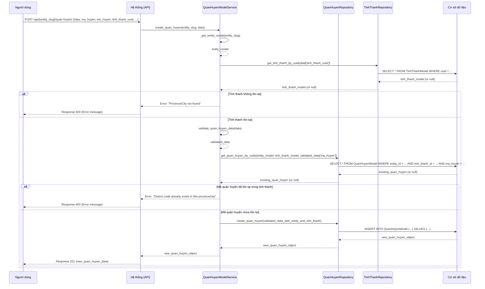

# GEO_003_Geography_Quản Lý Quận Huyện

*Phiên bản: 1.0*
*Người tạo: Cline*
*Ngày tạo: 13/05/2025*
*Cập nhật lần cuối: 13/05/2025*
*Người cập nhật: Cline*

## 1. Tổng Quan Nghiệp Vụ

### 1.1. Mô Tả Nghiệp Vụ
Nghiệp vụ này cho phép quản lý thông tin các quận/huyện/thị xã/thành phố thuộc tỉnh trong hệ thống ERP. Bao gồm việc tạo mới, xem, cập nhật và xóa thông tin quận huyện. Thông tin quận huyện là một phần quan trọng trong việc quản lý địa chỉ chi tiết hơn, phục vụ cho việc giao nhận, phân tích thị trường.

### 1.2. Phạm Vi Áp Dụng
Áp dụng cho các bộ phận cần sử dụng thông tin địa lý rất chi tiết, bao gồm bộ phận kinh doanh, giao vận, marketing. Người dùng có quyền quản trị hệ thống hoặc được phân quyền cụ thể mới có thể thực hiện các thao tác quản lý quận huyện.

### 1.3. Định Nghĩa Thuật Ngữ
| Thuật ngữ | Định nghĩa |
|-----------|------------|
| Mã Quận Huyện (ma_huyen) | Mã định danh duy nhất cho mỗi quận huyện trong một tỉnh thành. |
| Tên Quận Huyện (ten_huyen) | Tên chính thức của quận huyện. |
| Tên Quận Huyện Khác (ten_huyen2) | Tên thay thế hoặc tên tiếng Anh của quận huyện. |
| Tỉnh Thành (tinh_thanh) | Tỉnh thành mà quận huyện này trực thuộc. |
| Trạng Thái (status) | Trạng thái của quận huyện (ví dụ: 1 - Hoạt động, 0 - Không hoạt động). |
| Entity (Đơn vị) | Đơn vị/Công ty sử dụng hệ thống ERP. Mỗi quận huyện được quản lý trong phạm vi một Entity cụ thể. |

### 1.4. Tài Liệu Liên Quan
| STT | Mã tài liệu | Tên tài liệu | Mô tả |
|-----|-------------|--------------|-------|
| 1   | GEO_002 | Quản Lý Tỉnh Thành | Tài liệu mô tả quy trình quản lý thông tin tỉnh thành, là cấp cha của quận huyện. |
| 2   | GEO_004 | Quản Lý Xã Phường | Tài liệu mô tả quy trình quản lý thông tin xã phường, là cấp con của quận huyện. |
| 3   | GEO_006 | Quản Lý Địa Chỉ | Tài liệu mô tả quy trình quản lý thông tin địa chỉ, sử dụng thông tin quận huyện. |

## 2. Quy Trình Nghiệp Vụ

### 2.1. Tổng Quan Quy Trình
Quy trình quản lý quận huyện bao gồm các bước: người dùng yêu cầu thực hiện thao tác (thêm, sửa, xóa, xem danh sách, xem chi tiết), hệ thống kiểm tra dữ liệu và quyền hạn, sau đó thực thi yêu cầu và phản hồi kết quả cho người dùng.

### 2.2. Sơ Đồ Quy Trình (Business Flow)

```mermaid
flowchart TD
    A[Người dùng yêu cầu thao tác quản lý quận huyện] --> B{Chọn thao tác};
    B -->|Thêm mới| C[Nhập thông tin quận huyện (bao gồm chọn Tỉnh Thành)];
    B -->|Cập nhật| D[Chọn quận huyện & Nhập thông tin mới];
    B -->|Xóa| E[Chọn quận huyện & Xác nhận xóa];
    B -->|Xem danh sách| F[Hệ thống hiển thị danh sách quận huyện (có thể lọc theo Tỉnh Thành)];
    B -->|Xem chi tiết| G[Chọn quận huyện & Hệ thống hiển thị chi tiết];
    C --> H[Hệ thống kiểm tra dữ liệu];
    D --> H;
    H -->|Hợp lệ| I[Lưu thông tin vào CSDL];
    H -->|Không hợp lệ| J[Thông báo lỗi];
    I --> K[Thông báo thành công];
    E --> L[Hệ thống kiểm tra ràng buộc (ví dụ: Xã Phường)];
    L -->|Không có ràng buộc| M[Xóa quận huyện khỏi CSDL];
    L -->|Có ràng buộc| N[Thông báo lỗi không thể xóa];
    M --> K;
    F --> Z[Kết thúc];
    G --> Z;
    J --> A;
    K --> A;
    N --> A;
```

### 2.3. Chi Tiết Các Bước Quy Trình

#### 2.3.1. Thêm Mới Quận Huyện
- **Mô tả**: Người dùng cung cấp thông tin để tạo một quận huyện mới, liên kết với một tỉnh thành cụ thể.
- **Đầu vào**: Mã quận huyện, tên quận huyện, tên quận huyện khác (tùy chọn), UUID của tỉnh thành, trạng thái (mặc định là hoạt động).
- **Đầu ra**: Quận huyện mới được tạo trong hệ thống.
- **Người thực hiện**: Quản trị viên hệ thống hoặc người dùng được phân quyền.
- **Điều kiện tiên quyết**: Người dùng đã đăng nhập và có quyền. Tỉnh thành liên kết phải tồn tại. Mã quận huyện không được trùng lặp trong cùng một tỉnh thành và Entity.
- **Xử lý ngoại lệ**:
    - Nếu mã quận huyện đã tồn tại trong tỉnh thành đó: Thông báo lỗi.
    - Nếu tỉnh thành không tồn tại: Thông báo lỗi.
    - Nếu thông tin không hợp lệ: Thông báo lỗi.

#### 2.3.2. Cập Nhật Thông Tin Quận Huyện
- **Mô tả**: Người dùng thay đổi thông tin của một quận huyện đã tồn tại.
- **Đầu vào**: UUID của quận huyện cần cập nhật, thông tin mới (mã quận huyện, tên quận huyện, tên quận huyện khác, UUID tỉnh thành, trạng thái).
- **Đầu ra**: Thông tin quận huyện được cập nhật trong hệ thống.
- **Người thực hiện**: Quản trị viên hệ thống hoặc người dùng được phân quyền.
- **Điều kiện tiên quyết**: Quận huyện tồn tại trong hệ thống. Người dùng có quyền cập nhật.
- **Xử lý ngoại lệ**:
    - Nếu quận huyện không tồn tại: Thông báo lỗi.
    - Nếu mã quận huyện mới (nếu thay đổi) đã tồn tại cho một quận huyện khác trong cùng tỉnh thành: Thông báo lỗi.
    - Nếu thông tin không hợp lệ: Thông báo lỗi.

#### 2.3.3. Xóa Quận Huyện
- **Mô tả**: Người dùng xóa một quận huyện khỏi hệ thống.
- **Đầu vào**: UUID của quận huyện cần xóa.
- **Đầu ra**: Quận huyện bị xóa khỏi hệ thống (nếu không có ràng buộc).
- **Người thực hiện**: Quản trị viên hệ thống hoặc người dùng được phân quyền.
- **Điều kiện tiên quyết**: Quận huyện tồn tại trong hệ thống. Người dùng có quyền xóa.
- **Xử lý ngoại lệ**:
    - Nếu quận huyện không tồn tại: Thông báo lỗi.
    - Nếu quận huyện đang được sử dụng (ví dụ: có xã phường liên kết): Thông báo lỗi không thể xóa.

#### 2.3.4. Xem Danh Sách Quận Huyện
- **Mô tả**: Người dùng xem danh sách các quận huyện, có thể lọc theo tỉnh thành, và phân trang.
- **Đầu vào**: Entity slug, tùy chọn: UUID tỉnh thành, trang, kích thước trang, các tiêu chí lọc (tên, mã).
- **Đầu ra**: Danh sách các quận huyện thỏa mãn điều kiện.
- **Người thực hiện**: Bất kỳ người dùng nào có quyền truy cập chức năng.
- **Điều kiện tiên quyết**: Người dùng đã đăng nhập.

#### 2.3.5. Xem Chi Tiết Quận Huyện
- **Mô tả**: Người dùng xem thông tin chi tiết của một quận huyện cụ thể.
- **Đầu vào**: UUID của quận huyện.
- **Đầu ra**: Thông tin chi tiết của quận huyện.
- **Người thực hiện**: Bất kỳ người dùng nào có quyền truy cập chức năng.
- **Điều kiện tiên quyết**: Quận huyện tồn tại trong hệ thống.
- **Xử lý ngoại lệ**: Nếu quận huyện không tồn tại: Thông báo lỗi.

### 2.4. Sơ Đồ Tuần Tự (Sequence Diagram) - Thêm Mới Quận Huyện



### 2.5. Luồng Nghiệp Vụ Thay Thế
- **Tìm kiếm quận huyện**: Người dùng có thể tìm kiếm quận huyện theo tên hoặc theo mã.
- **Lọc quận huyện theo tỉnh thành**: Người dùng có thể xem danh sách quận huyện thuộc một tỉnh thành cụ thể.

## 3. Yêu Cầu Chức Năng

### 3.1. Danh Sách Chức Năng

| STT | Mã chức năng | Tên chức năng | Mô tả | Độ ưu tiên |
|-----|--------------|---------------|-------|------------|
| 1   | GEO_003_F01 | Thêm mới quận huyện | Cho phép tạo một quận huyện mới, thuộc một tỉnh thành. | Cao |
| 2   | GEO_003_F02 | Cập nhật quận huyện | Cho phép sửa thông tin của một quận huyện đã có. | Cao |
| 3   | GEO_003_F03 | Xóa quận huyện | Cho phép xóa một quận huyện khỏi hệ thống. | Cao |
| 4   | GEO_003_F04 | Xem danh sách quận huyện | Hiển thị danh sách các quận huyện, hỗ trợ phân trang và lọc (theo tỉnh thành, tên, mã). | Cao |
| 5   | GEO_003_F05 | Xem chi tiết quận huyện | Hiển thị thông tin chi tiết của một quận huyện. | Cao |
| 6   | GEO_003_F06 | Tìm kiếm quận huyện theo tên | Cho phép tìm kiếm quận huyện dựa trên tên. | Trung bình |
| 7   | GEO_003_F07 | Tìm kiếm quận huyện theo mã | Cho phép tìm kiếm quận huyện dựa trên mã. | Trung bình |
| 8   | GEO_003_F08 | Lấy danh sách quận huyện đang hoạt động | Lấy danh sách các quận huyện có trạng thái là "Hoạt động". | Trung bình |
| 9   | GEO_003_F09 | Lấy danh sách quận huyện theo tỉnh thành | Lấy danh sách các quận huyện thuộc một tỉnh thành cụ thể. | Cao |

### 3.2. Chi Tiết Chức Năng

#### 3.2.1. GEO_003_F01: Thêm mới quận huyện
- **Mô tả**: Chức năng cho phép người dùng tạo mới một quận huyện.
- **Đầu vào**:
    - `entity_slug`: Slug của Entity.
    - `data`: Đối tượng chứa thông tin quận huyện:
        - `ma_huyen` (bắt buộc): Mã quận huyện (string, max 100).
        - `ten_huyen` (bắt buộc): Tên quận huyện (string, max 255).
        - `ten_huyen2` (tùy chọn): Tên quận huyện khác (string, max 255).
        - `tinh_thanh_uuid` (bắt buộc): UUID của Tỉnh Thành.
        - `status` (tùy chọn): Trạng thái (integer). Mặc định là 1.
- **Đầu ra**: Đối tượng QuanHuyenModel vừa được tạo.
- **Điều kiện tiên quyết**: `entity_slug` và `tinh_thanh_uuid` hợp lệ. `ma_huyen` không trùng trong cùng `entity_slug` và `tinh_thanh_uuid`.
- **Luồng xử lý chính**:
  1. Service lấy `EntityModel` và `TinhThanhModel`.
  2. Service validate dữ liệu (`ma_huyen`, `ten_huyen`, `tinh_thanh_uuid`).
  3. Service kiểm tra `ma_huyen` đã tồn tại trong `Entity` và `TinhThanh` chưa.
  4. Nếu chưa, Service gọi Repository để tạo mới.
- **Giao diện liên quan**: Form thêm mới quận huyện.

#### 3.2.2. GEO_003_F02: Cập nhật quận huyện
- **Mô tả**: Cập nhật thông tin quận huyện.
- **Đầu vào**:
    - `entity_slug`: Slug của Entity.
    - `uuid`: UUID của quận huyện.
    - `data`: Thông tin cập nhật (tương tự thêm mới, các trường tùy chọn).
- **Đầu ra**: Đối tượng QuanHuyenModel đã cập nhật.
- **Điều kiện tiên quyết**: Quận huyện tồn tại. Nếu `ma_huyen` hoặc `tinh_thanh_uuid` thay đổi, mã mới không được trùng.
- **Giao diện liên quan**: Form cập nhật quận huyện.

#### 3.2.3. GEO_003_F03: Xóa quận huyện
- **Mô tả**: Xóa một quận huyện.
- **Đầu vào**: `entity_slug`, `uuid` của quận huyện.
- **Đầu ra**: HTTP 204 No Content.
- **Điều kiện tiên quyết**: Quận huyện tồn tại và không có ràng buộc (ví dụ: Xã Phường).
- **Giao diện liên quan**: Nút xóa.

#### 3.2.4. GEO_003_F04: Xem danh sách quận huyện
- **Mô tả**: Lấy danh sách quận huyện, có phân trang và lọc.
- **Đầu vào**: `entity_slug`, `page`, `page_size`, `tinh_thanh_uuid` (lọc), `ma_huyen`, `ten_huyen`.
- **Đầu ra**: Danh sách QuanHuyenModel.
- **Giao diện liên quan**: Trang danh sách quận huyện.

#### 3.2.5. GEO_003_F05: Xem chi tiết quận huyện
- **Mô tả**: Lấy chi tiết một quận huyện.
- **Đầu vào**: `entity_slug`, `uuid` của quận huyện.
- **Đầu ra**: Đối tượng QuanHuyenModel.
- **Giao diện liên quan**: Trang chi tiết quận huyện.

#### 3.2.9. GEO_003_F09: Lấy danh sách quận huyện theo tỉnh thành
- **Mô tả**: Lấy danh sách các quận huyện thuộc một tỉnh thành cụ thể.
- **Đầu vào**: `entity_slug`, `tinh_thanh_uuid`.
- **Đầu ra**: `QuerySet` các `QuanHuyenModel`.

## 4. Thiết Kế Kỹ Thuật

### 4.1. Kiến Trúc Hệ Thống
Tương tự GEO_002, sử dụng Views/APIs, Services (`QuanHuyenModelService`), Repositories (`QuanHuyenRepository`), Models (`QuanHuyenModel`, `TinhThanhModel`, `EntityModel`).

### 4.2. API Endpoints

- **Base URL**: `/api/{entity_slug}/quan-huyen/`
- **Endpoints**:
    - `GET /`: Lấy danh sách quận huyện. (GEO_003_F04)
        - Query params: `page`, `page_size`, `tinh_thanh_uuid`, `ma_huyen`, `ten_huyen`, `status`.
    - `POST /`: Tạo mới quận huyện. (GEO_003_F01)
        - Request body: `{ "ma_huyen": "Q1", "ten_huyen": "Quận 1", "tinh_thanh_uuid": "uuid_cua_HCM", "status": 1 }`
    - `GET /{uuid}/`: Lấy chi tiết quận huyện. (GEO_003_F05)
    - `PUT /{uuid}/`: Cập nhật quận huyện. (GEO_003_F02)
    - `PATCH /{uuid}/`: Cập nhật một phần quận huyện. (GEO_003_F02)
    - `DELETE /{uuid}/`: Xóa quận huyện. (GEO_003_F03)
    - `GET /theo-tinh-thanh/{tinh_thanh_uuid}/`: Lấy quận huyện theo tỉnh thành. (GEO_003_F09)

### 4.3. Service Logic (`QuanHuyenModelService`)
- Tương tự `TinhThanhModelService` nhưng cho `QuanHuyenModel`.
- Sẽ có thêm logic kiểm tra sự tồn tại của `TinhThanhModel` khi tạo/cập nhật quận huyện.
- Validate `ma_huyen` phải duy nhất trong phạm vi `Entity` và `TinhThanh`.

### 4.4. Mô Hình Dữ Liệu

#### 4.4.1. Entity Relationship Diagram (ERD)

```mermaid
erDiagram
    ENTITY ||--|{ QUOC_GIA : "quản lý"
    ENTITY ||--|{ TINH_THANH : "quản lý"
    ENTITY ||--|{ QUAN_HUYEN : "quản lý"
    ENTITY ||--|{ XA_PHUONG : "quản lý"

    QUOC_GIA ||--o{ TINH_THANH : "có"
    TINH_THANH ||--o{ QUAN_HUYEN : "có"
    QUAN_HUYEN ||--o{ XA_PHUONG : "có"

    ENTITY {
        uuid uuid PK
        string slug
        string name
        <em>(các trường khác)</em>
    }

    QUOC_GIA {
        uuid uuid PK
        string ma_qg
        string ten_qg
        uuid entity_id FK
        <em>(các trường khác)</em>
    }

    TINH_THANH {
        uuid uuid PK
        string ma_tinh
        string ten_tinh
        uuid quoc_gia_id FK
        uuid entity_id FK
        <em>(các trường khác)</em>
    }

    QUAN_HUYEN {
        uuid uuid PK
        string ma_huyen "Mã quận huyện (duy nhất trong Tỉnh Thành & Entity)"
        string ten_huyen "Tên quận huyện"
        string ten_huyen2 "Tên quận huyện khác"
        integer status "Trạng thái"
        datetime created
        datetime updated
        uuid entity_id FK "Khóa ngoại tới ENTITY"
        uuid tinh_thanh_id FK "Khóa ngoại tới TINH_THANH"
    }

    XA_PHUONG {
        uuid uuid PK
        string ma_xa "Mã xã phường"
        string ten_xa "Tên xã phường"
        uuid quan_huyen_id FK "Khóa ngoại tới QUAN_HUYEN"
        uuid entity_id FK "Khóa ngoại tới ENTITY"
        <em>(các trường khác)</em>
    }
```

#### 4.4.2. Chi Tiết Bảng Dữ Liệu

##### Bảng: `QuanHuyenModel` (django_ledger_quanhuyenmodel)
- **Mô tả**: Lưu trữ thông tin các quận huyện.
- **Các cột chính**:
    - `uuid` (UUID, Khóa chính).
    - `ma_huyen` (CharField, max_length=100).
    - `ten_huyen` (CharField, max_length=255).
    - `ten_huyen2` (CharField, max_length=255, null=True, blank=True).
    - `status` (IntegerField, default=1).
    - `entity_model` (ForeignKey đến `EntityModel`).
    - `tinh_thanh` (ForeignKey đến `TinhThanhModel`).
    - `created` (DateTimeField, auto_now_add=True).
    - `updated` (DateTimeField, auto_now=True).
- **Indexes**:
    - `unique_together = ('entity_model', 'tinh_thanh', 'ma_huyen')`.

## 5. Kế Hoạch Kiểm Thử

### 5.1. Phạm Vi Kiểm Thử
- CRUD cho Quận Huyện.
- Lọc theo Tỉnh Thành.
- Validation dữ liệu (bao gồm `tinh_thanh_uuid`).
- Ràng buộc duy nhất của `ma_huyen` theo `entity_model` và `tinh_thanh`.

### 5.2. Kịch Bản Kiểm Thử (Ví dụ)

| STT | Mã kịch bản | Tên kịch bản | Mô tả | Điều kiện tiên quyết | Các bước | Kết quả mong đợi |
|-----|------------|--------------|-------|---------------------|----------|-----------------|
| 1   | GEO_003_TC01 | Thêm mới quận huyện thành công | Kiểm tra thêm quận huyện với dữ liệu hợp lệ. | User đăng nhập, có quyền. Entity "E1", Tỉnh Thành "HCM" (uuid_hcm) tồn tại. | 1. POST `/api/E1/quan-huyen/`. 2. Payload: `{"ma_huyen": "Q1", "ten_huyen": "Quận 1", "tinh_thanh_uuid": "uuid_hcm"}`. | 1. HTTP 201. 2. Dữ liệu quận huyện được trả về. 3. Quận huyện được lưu vào CSDL. |
| 2   | GEO_003_TC02 | Thêm mới quận huyện với mã trùng | Kiểm tra thêm quận huyện có `ma_huyen` đã tồn tại trong cùng Tỉnh Thành & Entity. | Như TC01. Quận huyện "Q1" thuộc "HCM" đã tồn tại. | 1. POST `/api/E1/quan-huyen/`. 2. Payload: `{"ma_huyen": "Q1", "ten_huyen": "Quận Một", "tinh_thanh_uuid": "uuid_hcm"}`. | 1. HTTP 400. 2. Lỗi "District code already exists in this province/city". |
| 3   | GEO_003_TC03 | Thêm mới quận huyện với tỉnh thành không tồn tại | Kiểm tra thêm quận huyện với `tinh_thanh_uuid` không tồn tại. | Như TC01. `invalid_uuid_tinh` không tồn tại. | 1. POST `/api/E1/quan-huyen/`. 2. Payload: `{"ma_huyen": "BT", "ten_huyen": "Bình Thạnh", "tinh_thanh_uuid": "invalid_uuid_tinh"}`. | 1. HTTP 400. 2. Lỗi "Province/City not found". |
| 4   | GEO_003_TC04 | Xem danh sách quận huyện theo tỉnh thành | Lấy danh sách quận huyện của tỉnh thành "HCM". | Như TC01. Có quận "Q1" và "Q2" thuộc "HCM". | 1. GET `/api/E1/quan-huyen/?tinh_thanh_uuid=uuid_hcm`. | 1. HTTP 200. 2. Danh sách chứa "Q1" và "Q2". |

## 6. Phụ Lục

### 6.1. Danh Sách Tài Liệu Tham Khảo
- Mã nguồn Django Ledger: `django_ledger/services/quan_huyen/quan_huyen.py` (dự kiến)
- Mã nguồn Django Ledger: `django_ledger/repositories/quan_huyen/quan_huyen.py` (dự kiến)
- Mã nguồn Django Ledger: `django_ledger/models/quan_huyen.py` (dự kiến)

### 6.2. Danh Mục Thuật Ngữ
(Đã định nghĩa ở mục 1.3)

### 6.3. Lịch Sử Thay Đổi Tài Liệu

| Phiên bản | Ngày | Người thực hiện | Mô tả thay đổi |
|-----------|------|-----------------|---------------|
| 1.0 | 13/05/2025 | Cline | Tạo mới tài liệu. |
