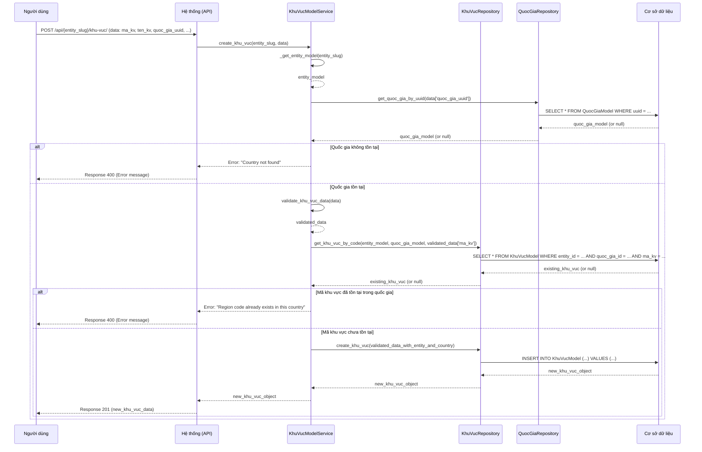

# GEO_005_Geography_Quản Lý Khu Vực

*Phiên bản: 1.0*
*Người tạo: Cline*
*Ngày tạo: 13/05/2025*
*Cập nhật lần cuối: 13/05/2025*
*Người cập nhật: Cline*

## 1. Tổng Quan Nghiệp Vụ

### 1.1. Mô Tả Nghiệp Vụ
Nghiệp vụ này cho phép quản lý thông tin các khu vực địa lý (ví dụ: Miền Bắc, Miền Trung, Miền Nam) trong hệ thống ERP. Mỗi khu vực thuộc một quốc gia và có thể bao gồm nhiều tỉnh thành. Bao gồm việc tạo mới, xem, cập nhật và xóa thông tin khu vực. Thông tin khu vực giúp phân vùng địa lý ở cấp độ cao hơn tỉnh thành, phục vụ cho mục đích phân tích, báo cáo, và quản lý kinh doanh theo vùng.

### 1.2. Phạm Vi Áp Dụng
Áp dụng cho các bộ phận cần phân tích dữ liệu theo vùng địa lý lớn, bao gồm bộ phận kinh doanh, marketing, kế hoạch. Người dùng có quyền quản trị hệ thống hoặc được phân quyền cụ thể mới có thể thực hiện các thao tác quản lý khu vực.

### 1.3. Định Nghĩa Thuật Ngữ
| Thuật ngữ | Định nghĩa |
|-----------|------------|
| Mã Khu Vực (ma_kv) | Mã định danh duy nhất cho mỗi khu vực trong một quốc gia. |
| Tên Khu Vực (ten_kv) | Tên chính thức của khu vực. |
| Tên Khu Vực Khác (ten_kv2) | Tên thay thế hoặc tên tiếng Anh của khu vực. |
| Quốc Gia (quoc_gia) | Quốc gia mà khu vực này trực thuộc. |
| Trạng Thái (status) | Trạng thái của khu vực (ví dụ: 1 - Hoạt động, 0 - Không hoạt động). |
| Entity (Đơn vị) | Đơn vị/Công ty sử dụng hệ thống ERP. Mỗi khu vực được quản lý trong phạm vi một Entity cụ thể. |

### 1.4. Tài Liệu Liên Quan
| STT | Mã tài liệu | Tên tài liệu | Mô tả |
|-----|-------------|--------------|-------|
| 1   | GEO_001 | Quản Lý Quốc Gia | Tài liệu mô tả quy trình quản lý thông tin quốc gia, là cấp cha của khu vực. |
| 2   | GEO_002 | Quản Lý Tỉnh Thành | Tài liệu mô tả quy trình quản lý thông tin tỉnh thành. Tỉnh thành có thể được nhóm theo khu vực. |
| 3   | RPT_XXX | Báo cáo theo Khu Vực | (Ví dụ) Các báo cáo có thể sử dụng thông tin khu vực để tổng hợp dữ liệu. |

## 2. Quy Trình Nghiệp Vụ

### 2.1. Tổng Quan Quy Trình
Quy trình quản lý khu vực bao gồm các bước: người dùng yêu cầu thực hiện thao tác (thêm, sửa, xóa, xem danh sách, xem chi tiết), hệ thống kiểm tra dữ liệu và quyền hạn, sau đó thực thi yêu cầu và phản hồi kết quả cho người dùng.

### 2.2. Sơ Đồ Quy Trình (Business Flow)

```mermaid
flowchart TD
    A[Người dùng yêu cầu thao tác quản lý khu vực] --> B{Chọn thao tác};
    B -->|Thêm mới| C[Nhập thông tin khu vực (bao gồm chọn Quốc Gia)];
    B -->|Cập nhật| D[Chọn khu vực & Nhập thông tin mới];
    B -->|Xóa| E[Chọn khu vực & Xác nhận xóa];
    B -->|Xem danh sách| F[Hệ thống hiển thị danh sách khu vực (có thể lọc theo Quốc Gia)];
    B -->|Xem chi tiết| G[Chọn khu vực & Hệ thống hiển thị chi tiết];
    C --> H[Hệ thống kiểm tra dữ liệu];
    D --> H;
    H -->|Hợp lệ| I[Lưu thông tin vào CSDL];
    H -->|Không hợp lệ| J[Thông báo lỗi];
    I --> K[Thông báo thành công];
    E --> L[Hệ thống kiểm tra ràng buộc (ví dụ: Tỉnh Thành đang tham chiếu)];
    L -->|Không có ràng buộc| M[Xóa khu vực khỏi CSDL];
    L -->|Có ràng buộc| N[Thông báo lỗi không thể xóa];
    M --> K;
    F --> Z[Kết thúc];
    G --> Z;
    J --> A;
    K --> A;
    N --> A;
```

### 2.3. Chi Tiết Các Bước Quy Trình

#### 2.3.1. Thêm Mới Khu Vực
- **Mô tả**: Người dùng cung cấp thông tin để tạo một khu vực mới, liên kết với một quốc gia cụ thể.
- **Đầu vào**: Mã khu vực, tên khu vực, tên khu vực khác (tùy chọn), UUID của quốc gia, trạng thái (mặc định là hoạt động).
- **Đầu ra**: Khu vực mới được tạo trong hệ thống.
- **Người thực hiện**: Quản trị viên hệ thống hoặc người dùng được phân quyền.
- **Điều kiện tiên quyết**: Người dùng đã đăng nhập và có quyền. Quốc gia liên kết phải tồn tại. Mã khu vực không được trùng lặp trong cùng một quốc gia và Entity.
- **Xử lý ngoại lệ**:
    - Nếu mã khu vực đã tồn tại trong quốc gia đó: Thông báo lỗi.
    - Nếu quốc gia không tồn tại: Thông báo lỗi.
    - Nếu thông tin không hợp lệ: Thông báo lỗi.

#### 2.3.2. Cập Nhật Thông Tin Khu Vực
- **Mô tả**: Người dùng thay đổi thông tin của một khu vực đã tồn tại.
- **Đầu vào**: UUID của khu vực cần cập nhật, thông tin mới (mã khu vực, tên khu vực, tên khu vực khác, UUID quốc gia, trạng thái).
- **Đầu ra**: Thông tin khu vực được cập nhật trong hệ thống.
- **Người thực hiện**: Quản trị viên hệ thống hoặc người dùng được phân quyền.
- **Điều kiện tiên quyết**: Khu vực tồn tại trong hệ thống. Người dùng có quyền cập nhật.
- **Xử lý ngoại lệ**:
    - Nếu khu vực không tồn tại: Thông báo lỗi.
    - Nếu mã khu vực mới (nếu thay đổi) đã tồn tại cho một khu vực khác trong cùng quốc gia: Thông báo lỗi.
    - Nếu thông tin không hợp lệ: Thông báo lỗi.

#### 2.3.3. Xóa Khu Vực
- **Mô tả**: Người dùng xóa một khu vực khỏi hệ thống.
- **Đầu vào**: UUID của khu vực cần xóa.
- **Đầu ra**: Khu vực bị xóa khỏi hệ thống (nếu không có ràng buộc).
- **Người thực hiện**: Quản trị viên hệ thống hoặc người dùng được phân quyền.
- **Điều kiện tiên quyết**: Khu vực tồn tại trong hệ thống. Người dùng có quyền xóa.
- **Xử lý ngoại lệ**:
    - Nếu khu vực không tồn tại: Thông báo lỗi.
    - Nếu khu vực đang được sử dụng (ví dụ: có tỉnh thành liên kết): Thông báo lỗi không thể xóa (hoặc yêu cầu bỏ liên kết tỉnh thành trước).

#### 2.3.4. Xem Danh Sách Khu Vực
- **Mô tả**: Người dùng xem danh sách các khu vực, có thể lọc theo quốc gia, và phân trang.
- **Đầu vào**: Entity slug, tùy chọn: UUID quốc gia, trang, kích thước trang, các tiêu chí lọc (tên, mã).
- **Đầu ra**: Danh sách các khu vực thỏa mãn điều kiện.
- **Người thực hiện**: Bất kỳ người dùng nào có quyền truy cập chức năng.
- **Điều kiện tiên quyết**: Người dùng đã đăng nhập.

#### 2.3.5. Xem Chi Tiết Khu Vực
- **Mô tả**: Người dùng xem thông tin chi tiết của một khu vực cụ thể.
- **Đầu vào**: UUID của khu vực.
- **Đầu ra**: Thông tin chi tiết của khu vực.
- **Người thực hiện**: Bất kỳ người dùng nào có quyền truy cập chức năng.
- **Điều kiện tiên quyết**: Khu vực tồn tại trong hệ thống.
- **Xử lý ngoại lệ**: Nếu khu vực không tồn tại: Thông báo lỗi.

### 2.4. Sơ Đồ Tuần Tự (Sequence Diagram) - Thêm Mới Khu Vực



### 2.5. Luồng Nghiệp Vụ Thay Thế
- **Tìm kiếm khu vực**: Người dùng có thể tìm kiếm khu vực theo tên hoặc theo mã.
- **Lọc khu vực theo quốc gia**: Người dùng có thể xem danh sách khu vực thuộc một quốc gia cụ thể.
- **Quản lý Tỉnh Thành thuộc Khu Vực**: Chức năng riêng để gán/bỏ gán Tỉnh Thành vào một Khu Vực (có thể thực hiện từ màn hình quản lý Tỉnh Thành hoặc Khu Vực).

## 3. Yêu Cầu Chức Năng

### 3.1. Danh Sách Chức Năng

| STT | Mã chức năng | Tên chức năng | Mô tả | Độ ưu tiên |
|-----|--------------|---------------|-------|------------|
| 1   | GEO_005_F01 | Thêm mới khu vực | Cho phép tạo một khu vực mới, thuộc một quốc gia. | Cao |
| 2   | GEO_005_F02 | Cập nhật khu vực | Cho phép sửa thông tin của một khu vực đã có. | Cao |
| 3   | GEO_005_F03 | Xóa khu vực | Cho phép xóa một khu vực khỏi hệ thống. | Cao |
| 4   | GEO_005_F04 | Xem danh sách khu vực | Hiển thị danh sách các khu vực, hỗ trợ phân trang và lọc (theo quốc gia, tên, mã). | Cao |
| 5   | GEO_005_F05 | Xem chi tiết khu vực | Hiển thị thông tin chi tiết của một khu vực. | Cao |
| 6   | GEO_005_F06 | Tìm kiếm khu vực theo tên | Cho phép tìm kiếm khu vực dựa trên tên. | Trung bình |
| 7   | GEO_005_F07 | Tìm kiếm khu vực theo mã | Cho phép tìm kiếm khu vực dựa trên mã. | Trung bình |
| 8   | GEO_005_F08 | Lấy danh sách khu vực đang hoạt động | Lấy danh sách các khu vực có trạng thái là "Hoạt động". | Trung bình |
| 9   | GEO_005_F09 | Lấy danh sách khu vực theo quốc gia | Lấy danh sách các khu vực thuộc một quốc gia cụ thể. | Cao |
| 10  | GEO_005_F10 | Xem danh sách Tỉnh Thành thuộc Khu Vực | Hiển thị danh sách các Tỉnh Thành được gán cho một Khu Vực. | Trung bình |

### 3.2. Chi Tiết Chức Năng

#### 3.2.1. GEO_005_F01: Thêm mới khu vực
- **Mô tả**: Chức năng cho phép người dùng tạo mới một khu vực.
- **Đầu vào**:
    - `entity_slug`: Slug của Entity.
    - `data`: Đối tượng chứa thông tin khu vực:
        - `ma_kv` (bắt buộc): Mã khu vực (string, max 100).
        - `ten_kv` (bắt buộc): Tên khu vực (string, max 255).
        - `ten_kv2` (tùy chọn): Tên khu vực khác (string, max 255).
        - `quoc_gia_uuid` (bắt buộc): UUID của Quốc Gia.
        - `status` (tùy chọn): Trạng thái (integer). Mặc định là 1.
- **Đầu ra**: Đối tượng KhuVucModel vừa được tạo.
- **Điều kiện tiên quyết**: `entity_slug` và `quoc_gia_uuid` hợp lệ. `ma_kv` không trùng trong cùng `entity_slug` và `quoc_gia_uuid`.
- **Luồng xử lý chính**:
  1. Service lấy `EntityModel` và `QuocGiaModel`.
  2. Service validate dữ liệu (`ma_kv`, `ten_kv`, `quoc_gia_uuid`).
  3. Service kiểm tra `ma_kv` đã tồn tại trong `Entity` và `QuocGia` chưa.
  4. Nếu chưa, Service gọi Repository để tạo mới.
- **Giao diện liên quan**: Form thêm mới khu vực.

#### 3.2.2. GEO_005_F02: Cập nhật khu vực
- **Mô tả**: Cập nhật thông tin khu vực.
- **Đầu vào**:
    - `entity_slug`: Slug của Entity.
    - `uuid`: UUID của khu vực.
    - `data`: Thông tin cập nhật (tương tự thêm mới, các trường tùy chọn).
- **Đầu ra**: Đối tượng KhuVucModel đã cập nhật.
- **Điều kiện tiên quyết**: Khu vực tồn tại. Nếu `ma_kv` hoặc `quoc_gia_uuid` thay đổi, mã mới không được trùng.
- **Giao diện liên quan**: Form cập nhật khu vực.

#### 3.2.3. GEO_005_F03: Xóa khu vực
- **Mô tả**: Xóa một khu vực.
- **Đầu vào**: `entity_slug`, `uuid` của khu vực.
- **Đầu ra**: HTTP 204 No Content.
- **Điều kiện tiên quyết**: Khu vực tồn tại và không có Tỉnh Thành nào đang tham chiếu đến.
- **Giao diện liên quan**: Nút xóa.

#### 3.2.4. GEO_005_F04: Xem danh sách khu vực
- **Mô tả**: Lấy danh sách khu vực, có phân trang và lọc.
- **Đầu vào**: `entity_slug`, `page`, `page_size`, `quoc_gia_uuid` (lọc), `ma_kv`, `ten_kv`.
- **Đầu ra**: Danh sách KhuVucModel.
- **Giao diện liên quan**: Trang danh sách khu vực.

#### 3.2.5. GEO_005_F05: Xem chi tiết khu vực
- **Mô tả**: Lấy chi tiết một khu vực.
- **Đầu vào**: `entity_slug`, `uuid` của khu vực.
- **Đầu ra**: Đối tượng KhuVucModel (có thể kèm danh sách Tỉnh Thành thuộc khu vực).
- **Giao diện liên quan**: Trang chi tiết khu vực.

#### 3.2.9. GEO_005_F09: Lấy danh sách khu vực theo quốc gia
- **Mô tả**: Lấy danh sách các khu vực thuộc một quốc gia cụ thể.
- **Đầu vào**: `entity_slug`, `quoc_gia_uuid`.
- **Đầu ra**: `QuerySet` các `KhuVucModel`.

#### 3.2.10. GEO_005_F10: Xem danh sách Tỉnh Thành thuộc Khu Vực
- **Mô tả**: Lấy danh sách các Tỉnh Thành được gán cho một Khu Vực cụ thể.
- **Đầu vào**: `entity_slug`, `khu_vuc_uuid`.
- **Đầu ra**: Danh sách `TinhThanhModel`.
- **Giao diện liên quan**: Tab/Phần trong trang chi tiết Khu Vực.

## 4. Thiết Kế Kỹ Thuật

### 4.1. Kiến Trúc Hệ Thống
Sử dụng Views/APIs, Services (`KhuVucModelService`), Repositories (`KhuVucRepository`), Models (`KhuVucModel`, `QuocGiaModel`, `TinhThanhModel`, `EntityModel`).

### 4.2. API Endpoints

- **Base URL**: `/api/{entity_slug}/khu-vuc/`
- **Endpoints**:
    - `GET /`: Lấy danh sách khu vực. (GEO_005_F04)
        - Query params: `page`, `page_size`, `quoc_gia_uuid`, `ma_kv`, `ten_kv`, `status`.
    - `POST /`: Tạo mới khu vực. (GEO_005_F01)
        - Request body: `{ "ma_kv": "MB", "ten_kv": "Miền Bắc", "quoc_gia_uuid": "uuid_cua_VN", "status": 1 }`
    - `GET /{uuid}/`: Lấy chi tiết khu vực. (GEO_005_F05)
    - `PUT /{uuid}/`: Cập nhật khu vực. (GEO_005_F02)
    - `PATCH /{uuid}/`: Cập nhật một phần khu vực. (GEO_005_F02)
    - `DELETE /{uuid}/`: Xóa khu vực. (GEO_005_F03)
    - `GET /theo-quoc-gia/{quoc_gia_uuid}/`: Lấy khu vực theo quốc gia. (GEO_005_F09)
    - `GET /{uuid}/tinh-thanh/`: Lấy danh sách tỉnh thành thuộc khu vực. (GEO_005_F10)

### 4.3. Service Logic (`KhuVucModelService`)
- Tương tự `TinhThanhModelService` nhưng cho `KhuVucModel`.
- Kiểm tra sự tồn tại của `QuocGiaModel` khi tạo/cập nhật.
- Validate `ma_kv` phải duy nhất trong phạm vi `Entity` và `QuocGia`.
- Logic lấy danh sách Tỉnh Thành theo `khu_vuc_uuid`.

### 4.4. Mô Hình Dữ Liệu

#### 4.4.1. Entity Relationship Diagram (ERD)

```mermaid
erDiagram
    ENTITY ||--|{ QUOC_GIA : "quản lý"
    ENTITY ||--|{ KHU_VUC : "quản lý"
    ENTITY ||--|{ TINH_THANH : "quản lý"
    ENTITY ||--|{ QUAN_HUYEN : "quản lý"
    ENTITY ||--|{ XA_PHUONG : "quản lý"

    QUOC_GIA ||--o{ KHU_VUC : "có"
    QUOC_GIA ||--o{ TINH_THANH : "có"
    KHU_VUC ||--o{ TINH_THANH : "nhóm (tùy chọn)"
    TINH_THANH ||--o{ QUAN_HUYEN : "có"
    QUAN_HUYEN ||--o{ XA_PHUONG : "có"

    ENTITY {
        uuid uuid PK
        string slug
        string name
        <em>(các trường khác)</em>
    }

    QUOC_GIA {
        uuid uuid PK
        string ma_qg
        string ten_qg
        uuid entity_id FK
        <em>(các trường khác)</em>
    }

    KHU_VUC {
        uuid uuid PK
        string ma_kv "Mã khu vực (duy nhất trong Quốc Gia & Entity)"
        string ten_kv "Tên khu vực"
        string ten_kv2 "Tên khu vực khác"
        integer status "Trạng thái"
        datetime created
        datetime updated
        uuid entity_id FK "Khóa ngoại tới ENTITY"
        uuid quoc_gia_id FK "Khóa ngoại tới QUOC_GIA"
    }

    TINH_THANH {
        uuid uuid PK
        string ma_tinh
        string ten_tinh
        uuid quoc_gia_id FK "Khóa ngoại tới QUOC_GIA"
        uuid khu_vuc_id FK "Khóa ngoại tới KHU_VUC (tùy chọn)"
        uuid entity_id FK "Khóa ngoại tới ENTITY"
        <em>(các trường khác)</em>
    }

    QUAN_HUYEN {
        uuid uuid PK
        string ma_huyen
        string ten_huyen
        uuid tinh_thanh_id FK
        uuid entity_id FK
        <em>(các trường khác)</em>
    }

    XA_PHUONG {
        uuid uuid PK
        string ma_xa
        string ten_xa
        uuid quan_huyen_id FK
        uuid entity_id FK
        <em>(các trường khác)</em>
    }
```

#### 4.4.2. Chi Tiết Bảng Dữ Liệu

##### Bảng: `KhuVucModel` (django_ledger_khuvucmodel)
- **Mô tả**: Lưu trữ thông tin các khu vực.
- **Các cột chính**:
    - `uuid` (UUID, Khóa chính).
    - `ma_kv` (CharField, max_length=100).
    - `ten_kv` (CharField, max_length=255).
    - `ten_kv2` (CharField, max_length=255, null=True, blank=True).
    - `status` (IntegerField, default=1).
    - `entity_model` (ForeignKey đến `EntityModel`).
    - `quoc_gia` (ForeignKey đến `QuocGiaModel`).
    - `created` (DateTimeField, auto_now_add=True).
    - `updated` (DateTimeField, auto_now=True).
- **Indexes**:
    - `unique_together = ('entity_model', 'quoc_gia', 'ma_kv')`.

##### Bảng: `TinhThanhModel` (django_ledger_tinhthanhmodel) - Cập nhật
- Thêm cột:
    - `khu_vuc` (ForeignKey đến `KhuVucModel`, null=True, blank=True, on_delete=models.SET_NULL).

## 5. Kế Hoạch Kiểm Thử

### 5.1. Phạm Vi Kiểm Thử
- CRUD cho Khu Vực.
- Lọc theo Quốc Gia.
- Validation dữ liệu (bao gồm `quoc_gia_uuid`).
- Ràng buộc duy nhất của `ma_kv` theo `entity_model` và `quoc_gia`.
- Liên kết Tỉnh Thành với Khu Vực (cập nhật Tỉnh Thành để gán `khu_vuc_id`).
- Xóa Khu Vực (kiểm tra ràng buộc với Tỉnh Thành).

### 5.2. Kịch Bản Kiểm Thử (Ví dụ)

| STT | Mã kịch bản | Tên kịch bản | Mô tả | Điều kiện tiên quyết | Các bước | Kết quả mong đợi |
|-----|------------|--------------|-------|---------------------|----------|-----------------|
| 1   | GEO_005_TC01 | Thêm mới khu vực thành công | Kiểm tra thêm khu vực với dữ liệu hợp lệ. | User đăng nhập, có quyền. Entity "E1", Quốc gia "VN" (uuid_vn) tồn tại. | 1. POST `/api/E1/khu-vuc/`. 2. Payload: `{"ma_kv": "MB", "ten_kv": "Miền Bắc", "quoc_gia_uuid": "uuid_vn"}`. | 1. HTTP 201. 2. Dữ liệu khu vực được trả về. 3. Khu vực được lưu vào CSDL. |
| 2   | GEO_005_TC02 | Thêm mới khu vực với mã trùng | Kiểm tra thêm khu vực có `ma_kv` đã tồn tại trong cùng Quốc gia & Entity. | Như TC01. Khu vực "MB" thuộc "VN" đã tồn tại. | 1. POST `/api/E1/khu-vuc/`. 2. Payload: `{"ma_kv": "MB", "ten_kv": "Khu Vực Miền Bắc", "quoc_gia_uuid": "uuid_vn"}`. | 1. HTTP 400. 2. Lỗi "Region code already exists in this country". |
| 3   | GEO_005_TC03 | Thêm mới khu vực với quốc gia không tồn tại | Kiểm tra thêm khu vực với `quoc_gia_uuid` không tồn tại. | Như TC01. `invalid_uuid_qg` không tồn tại. | 1. POST `/api/E1/khu-vuc/`. 2. Payload: `{"ma_kv": "MT", "ten_kv": "Miền Trung", "quoc_gia_uuid": "invalid_uuid_qg"}`. | 1. HTTP 400. 2. Lỗi "Country not found". |
| 4   | GEO_005_TC04 | Xem danh sách khu vực theo quốc gia | Lấy danh sách khu vực của quốc gia "VN". | Như TC01. Có khu vực "MB" và "MN" thuộc "VN". | 1. GET `/api/E1/khu-vuc/?quoc_gia_uuid=uuid_vn`. | 1. HTTP 200. 2. Danh sách chứa "MB" và "MN". |
| 5   | GEO_005_TC05 | Gán Tỉnh Thành cho Khu Vực | Cập nhật Tỉnh Thành "HN" để thuộc Khu Vực "MB". | Entity "E1", Quốc gia "VN", Tỉnh Thành "HN" (uuid_hn), Khu Vực "MB" (uuid_mb) tồn tại. | 1. PATCH `/api/E1/tinh-thanh/uuid_hn/`. 2. Payload: `{"khu_vuc_uuid": "uuid_mb"}`. | 1. HTTP 200. 2. Tỉnh Thành "HN" có `khu_vuc_id` là `uuid_mb`. |
| 6   | GEO_005_TC06 | Xem Tỉnh Thành thuộc Khu Vực | Lấy danh sách Tỉnh Thành thuộc Khu Vực "MB". | Như TC05. "HN" thuộc "MB". | 1. GET `/api/E1/khu-vuc/uuid_mb/tinh-thanh/`. | 1. HTTP 200. 2. Danh sách chứa Tỉnh Thành "HN". |
| 7   | GEO_005_TC07 | Xóa Khu Vực có Tỉnh Thành liên kết | Cố gắng xóa Khu Vực "MB" khi "HN" đang liên kết. | Như TC06. | 1. DELETE `/api/E1/khu-vuc/uuid_mb/`. | 1. HTTP 400. 2. Lỗi thông báo không thể xóa do có Tỉnh Thành liên kết. |

## 6. Phụ Lục

### 6.1. Danh Sách Tài Liệu Tham Khảo
- Mã nguồn Django Ledger: `django_ledger/services/khu_vuc/khu_vuc.py` (dự kiến)
- Mã nguồn Django Ledger: `django_ledger/repositories/khu_vuc/khu_vuc.py` (dự kiến)
- Mã nguồn Django Ledger: `django_ledger/models/khu_vuc.py` (dự kiến)
- Mã nguồn Django Ledger: `django_ledger/models/tinh_thanh.py` (cập nhật)

### 6.2. Danh Mục Thuật Ngữ
(Đã định nghĩa ở mục 1.3)

### 6.3. Lịch Sử Thay Đổi Tài Liệu

| Phiên bản | Ngày | Người thực hiện | Mô tả thay đổi |
|-----------|------|-----------------|---------------|
| 1.0 | 13/05/2025 | Cline | Tạo mới tài liệu. |
