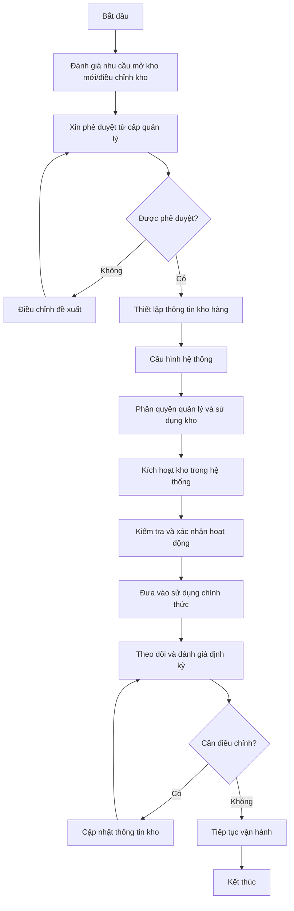
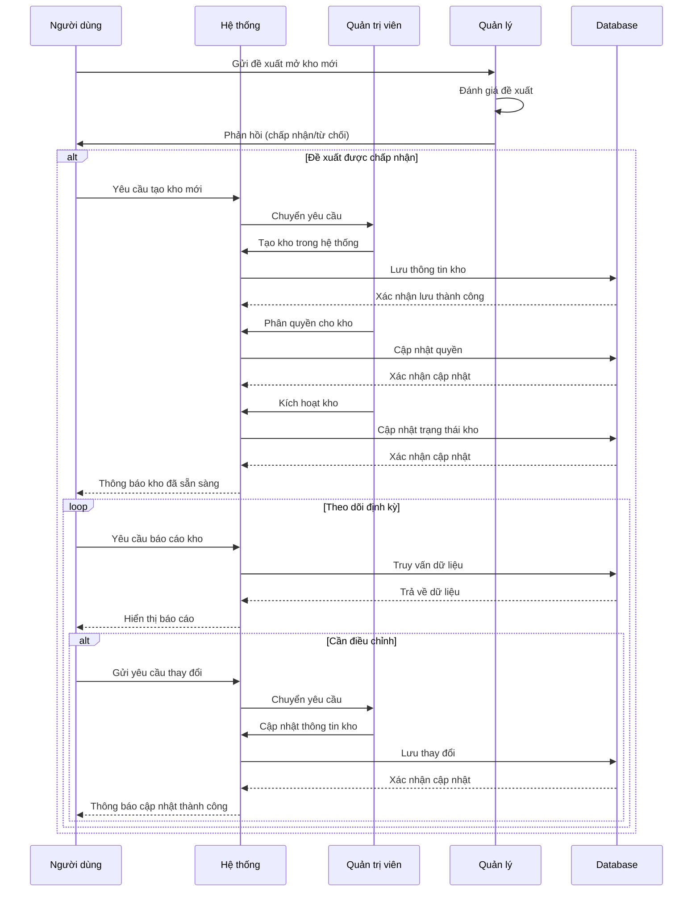
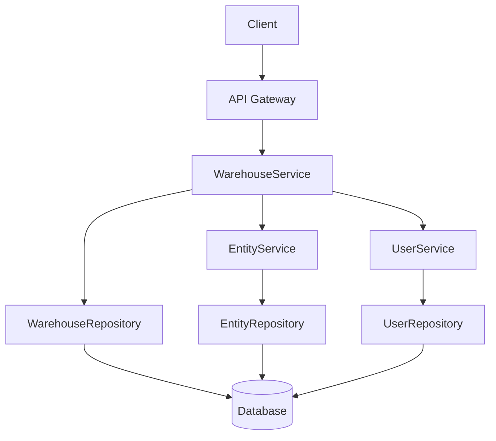
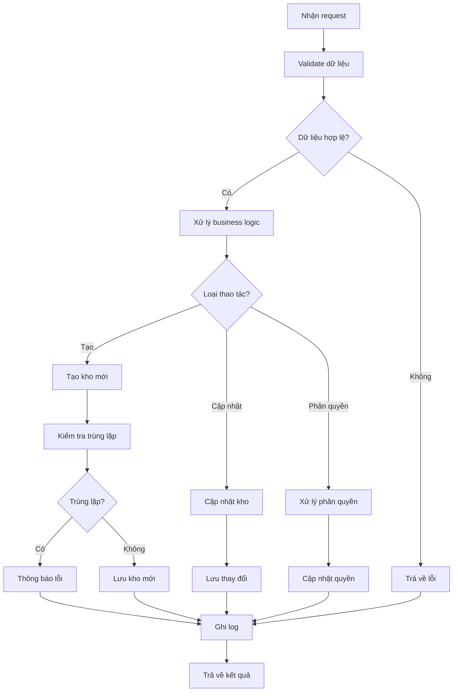

# INV_001_Quản Lý Kho Hàng

*Phiên bản: 1.0*  
*Người tạo: Auto Generated*  
*Ngày tạo: 25/07/2023*  
*Cập nhật lần cuối: 25/07/2023*  
*Người cập nhật: Auto Generated*

## 1. Tổng Quan Nghiệp Vụ

### 1.1. Mô Tả Nghiệp Vụ
Quản lý kho hàng là quy trình thiết lập và quản lý các kho hàng trong doanh nghiệp. Quy trình này bao gồm việc tạo lập, cập nhật thông tin, phân quyền sử dụng, và theo dõi trạng thái hoạt động của các kho hàng. Quản lý kho hàng hiệu quả giúp doanh nghiệp kiểm soát tốt hàng hóa, tối ưu hóa không gian lưu trữ, giảm thiểu rủi ro thất thoát và đảm bảo độ tin cậy trong quản lý hàng tồn kho.

### 1.2. Phạm Vi Áp Dụng
Quy trình này áp dụng cho việc quản lý tất cả các kho hàng trong doanh nghiệp, bao gồm:
- Bộ phận kho vận
- Bộ phận kế toán kho
- Bộ phận mua hàng
- Ban lãnh đạo
- Các đơn vị có liên quan đến quản lý và sử dụng kho hàng

### 1.3. Định Nghĩa Thuật Ngữ
| Thuật ngữ | Định nghĩa |
|-----------|------------|
| Kho hàng | Không gian vật lý hoặc khu vực dùng để lưu trữ, quản lý hàng hóa, vật tư |
| Mã kho | Mã định danh duy nhất cho mỗi kho hàng trong hệ thống |
| Vị trí kho | Vị trí cụ thể trong kho (kệ, ngăn, tầng...) |
| Đại lý | Kho hàng thuộc quyền quản lý của đại lý (không trực tiếp quản lý bởi doanh nghiệp) |
| Đơn vị kho | Đơn vị phụ trách quản lý kho |
| Entity | Đơn vị doanh nghiệp sở hữu kho hàng |

### 1.4. Tài Liệu Liên Quan

| STT | Mã tài liệu | Tên tài liệu | Mô tả |
|-----|-------------|--------------|-------|
| 1   | INV_005 | Quản Lý Nhập Xuất Kho | Quy trình nhập xuất kho |
| 2   | INV_006 | Quản Lý Vị Trí Kho Hàng | Quy trình quản lý vị trí trong kho |
| 3   | INV_002 | Quản Lý Vật Tư Sản Phẩm | Quy trình quản lý vật tư và sản phẩm |
| 4   | ORG_001 | Quản Lý Bộ Phận | Quy trình thiết lập và quản lý cấu trúc tổ chức |

## 2. Quy Trình Nghiệp Vụ

### 2.1. Tổng Quan Quy Trình
Quy trình quản lý kho hàng bao gồm việc thiết lập kho hàng mới, cập nhật thông tin kho, phân quyền quản lý và sử dụng kho, theo dõi trạng thái hoạt động, và đánh giá hiệu quả sử dụng kho. Quá trình này đảm bảo doanh nghiệp có cái nhìn tổng quan về hệ thống kho hàng và có thể quản lý chúng một cách hiệu quả.

### 2.2. Sơ Đồ Quy Trình (Business Flow)



### 2.3. Chi Tiết Các Bước Quy Trình

#### 2.3.1. Đánh giá nhu cầu và xin phê duyệt
- **Mô tả**: Đánh giá nhu cầu mở kho mới hoặc điều chỉnh kho hiện tại, lập đề xuất và xin phê duyệt
- **Đầu vào**: Báo cáo tình hình kho hiện tại, dự báo nhu cầu, kế hoạch kinh doanh
- **Đầu ra**: Đề xuất mở kho mới/điều chỉnh kho được phê duyệt
- **Người thực hiện**: Trưởng bộ phận kho vận, quản lý cấp cao
- **Điều kiện tiên quyết**: Có nhu cầu mở rộng/điều chỉnh hệ thống kho
- **Xử lý ngoại lệ**: Nếu đề xuất không được phê duyệt, cần điều chỉnh lại đề xuất hoặc tìm giải pháp thay thế

#### 2.3.2. Thiết lập và cấu hình kho hàng
- **Mô tả**: Thiết lập thông tin kho hàng và cấu hình trong hệ thống
- **Đầu vào**: Thông tin chi tiết về kho (tên, mã, địa chỉ, đơn vị quản lý...)
- **Đầu ra**: Kho hàng mới được thiết lập trong hệ thống
- **Người thực hiện**: Quản trị hệ thống, nhân viên kho vận
- **Điều kiện tiên quyết**: Đề xuất đã được phê duyệt
- **Xử lý ngoại lệ**: Xử lý các trường hợp trùng mã kho, thông tin không đầy đủ

#### 2.3.3. Phân quyền và kích hoạt kho
- **Mô tả**: Phân quyền quản lý và sử dụng kho, kích hoạt kho trong hệ thống
- **Đầu vào**: Thông tin kho, danh sách người quản lý/sử dụng
- **Đầu ra**: Kho được phân quyền và kích hoạt
- **Người thực hiện**: Quản trị hệ thống
- **Điều kiện tiên quyết**: Kho đã được thiết lập trong hệ thống
- **Xử lý ngoại lệ**: Xử lý các trường hợp phân quyền không đúng, xung đột quyền

#### 2.3.4. Theo dõi và đánh giá
- **Mô tả**: Theo dõi hoạt động của kho và đánh giá hiệu quả sử dụng
- **Đầu vào**: Dữ liệu hoạt động kho, các chỉ số KPI
- **Đầu ra**: Báo cáo đánh giá, đề xuất cải tiến
- **Người thực hiện**: Quản lý kho, trưởng bộ phận kho vận
- **Điều kiện tiên quyết**: Kho đã đi vào hoạt động
- **Xử lý ngoại lệ**: Xác định và xử lý các vấn đề phát sinh trong quá trình vận hành

### 2.4. Sơ Đồ Tuần Tự (Sequence Diagram)



### 2.5. Luồng Nghiệp Vụ Thay Thế
- **Tạm ngưng hoạt động kho**: Trong trường hợp cần bảo trì, sửa chữa hoặc tổ chức lại kho, có thể tạm ngưng hoạt động kho trong một khoảng thời gian xác định
- **Chuyển đổi loại kho**: Chuyển đổi từ kho thông thường sang kho đại lý hoặc ngược lại
- **Sáp nhập/tách kho**: Trong trường hợp tái cấu trúc, có thể thực hiện sáp nhập nhiều kho thành một kho lớn hoặc tách một kho lớn thành nhiều kho nhỏ

## 3. Yêu Cầu Chức Năng

### 3.1. Danh Sách Chức Năng

| STT | Mã chức năng | Tên chức năng | Mô tả | Độ ưu tiên |
|-----|--------------|---------------|-------|------------|
| 1   | WH_LIST | Xem danh sách kho hàng | Hiển thị danh sách kho hàng với các bộ lọc và tìm kiếm | Cao |
| 2   | WH_CREATE | Tạo kho hàng mới | Thêm kho hàng mới vào hệ thống | Cao |
| 3   | WH_UPDATE | Cập nhật kho hàng | Chỉnh sửa thông tin kho hàng | Cao |
| 4   | WH_VIEW | Xem chi tiết kho hàng | Xem toàn bộ thông tin chi tiết của kho hàng | Cao |
| 5   | WH_STATUS | Thay đổi trạng thái | Đánh dấu kho hàng là active/inactive | Cao |
| 6   | WH_ASSIGN | Phân quyền kho hàng | Phân quyền quản lý và sử dụng kho hàng | Cao |
| 7   | WH_REPORT | Báo cáo tình trạng kho | Tạo báo cáo về tình trạng kho hàng | Trung bình |
| 8   | WH_EXPORT | Xuất danh sách ra file | Xuất danh sách kho hàng ra file Excel | Thấp |

### 3.2. Chi Tiết Chức Năng

#### 3.2.1. WH_CREATE: Tạo kho hàng mới
- **Mô tả**: Cho phép người dùng tạo kho hàng mới trong hệ thống
- **Đầu vào**: Thông tin kho hàng (mã kho, tên kho, địa chỉ, đơn vị, các thông tin khác)
- **Đầu ra**: Bản ghi kho hàng mới trong hệ thống
- **Điều kiện tiên quyết**: Người dùng đã đăng nhập và có quyền tạo kho hàng
- **Luồng xử lý chính**:
  1. Người dùng chọn "Tạo kho hàng mới"
  2. Hệ thống hiển thị form nhập thông tin
  3. Người dùng nhập thông tin kho hàng
  4. Người dùng nhấn "Lưu"
  5. Hệ thống kiểm tra tính hợp lệ của dữ liệu
  6. Hệ thống kiểm tra trùng lặp mã kho
  7. Hệ thống lưu thông tin kho hàng mới
- **Luồng xử lý thay thế/ngoại lệ**:
  1. Nếu dữ liệu không hợp lệ, hiển thị thông báo lỗi
  2. Nếu mã kho đã tồn tại, yêu cầu nhập mã khác
- **Giao diện liên quan**: Form tạo kho hàng

#### 3.2.2. WH_ASSIGN: Phân quyền kho hàng
- **Mô tả**: Cho phép phân quyền quản lý và sử dụng kho hàng
- **Đầu vào**: ID kho hàng, danh sách người dùng, loại quyền
- **Đầu ra**: Phân quyền được cập nhật
- **Điều kiện tiên quyết**: Kho hàng đã tồn tại, người dùng có quyền phân quyền
- **Luồng xử lý chính**:
  1. Người dùng chọn kho hàng cần phân quyền
  2. Hệ thống hiển thị danh sách quyền hiện tại
  3. Người dùng thêm/sửa/xóa quyền
  4. Người dùng nhấn "Lưu"
  5. Hệ thống cập nhật quyền và ghi log
- **Luồng xử lý thay thế/ngoại lệ**:
  1. Nếu có xung đột quyền, hiển thị cảnh báo
- **Giao diện liên quan**: Màn hình quản lý quyền kho hàng

## 4. Thiết Kế Kỹ Thuật

### 4.1. Kiến Trúc Hệ Thống



### 4.2. API Endpoints

#### 4.2.1. Lấy danh sách kho hàng
- **Mô tả**: Trả về danh sách kho hàng theo điều kiện lọc
- **URL**: `GET /api/v1/entity/{entity_slug}/warehouses/`
- **Query Parameters**:
  - `active`: Lọc theo trạng thái active (true/false)
  - `search`: Từ khóa tìm kiếm (tên kho, mã kho)
  - `page`: Số trang
  - `page_size`: Số bản ghi trên mỗi trang
  - `ordering`: Trường sắp xếp
- **Response**: Danh sách kho hàng, phân trang

#### 4.2.2. Lấy chi tiết kho hàng
- **Mô tả**: Trả về thông tin chi tiết của một kho hàng
- **URL**: `GET /api/v1/entity/{entity_slug}/warehouses/{uuid}/`
- **Response**: Chi tiết kho hàng

#### 4.2.3. Tạo kho hàng mới
- **Mô tả**: Tạo kho hàng mới trong hệ thống
- **URL**: `POST /api/v1/entity/{entity_slug}/warehouses/`
- **Request Body**: Thông tin kho hàng
- **Response**: Thông tin kho hàng đã tạo

#### 4.2.4. Cập nhật kho hàng
- **Mô tả**: Cập nhật thông tin kho hàng
- **URL**: `PUT /api/v1/entity/{entity_slug}/warehouses/{uuid}/`
- **Request Body**: Thông tin cập nhật
- **Response**: Thông tin kho hàng đã cập nhật

#### 4.2.5. Phân quyền kho hàng
- **Mô tả**: Phân quyền quản lý và sử dụng kho hàng
- **URL**: `POST /api/v1/entity/{entity_slug}/warehouses/{uuid}/permissions/`
- **Request Body**: Thông tin quyền
- **Response**: Kết quả phân quyền

### 4.3. Service Logic

#### 4.3.1. WarehouseService
- **Mô tả**: Xử lý logic nghiệp vụ liên quan đến quản lý kho hàng
- **Chức năng chính**:
  1. Tạo và quản lý kho hàng
  2. Phân quyền kho hàng
  3. Tạo báo cáo kho hàng
  4. Quản lý trạng thái kho
- **Các dependencies**:
  1. WarehouseRepository
  2. EntityService
  3. UserService
- **Sơ đồ luồng xử lý**:



### 4.4. Mô Hình Dữ Liệu

#### 4.4.1. Entity Relationship Diagram (ERD)

```mermaid
erDiagram
    EntityModel ||--o{ KhoHangModel : "có"
    EntityModel ||--o{ EntityUnitModel : "có"
    EntityUnitModel ||--o{ KhoHangModel : "quản lý"
    KhoHangModel ||--o{ UserPermissionModel : "có quyền"
    UserModel ||--o{ UserPermissionModel : "được gán"
    
    KhoHangModel {
        UUID uuid PK
        FK EntityModel entity_model
        FK EntityUnitModel unit_id
        String ma_kho
        String ten_kho
        String ten_khac
        Boolean vi_tri
        Boolean dai_ly
        String dia_chi
        String dien_thoai
        Integer trang_thai
        DateTime created
        DateTime updated
    }
    
    UserPermissionModel {
        UUID uuid PK
        FK KhoHangModel kho_hang
        FK UserModel user
        String permission_type
        DateTime created
        DateTime updated
    }
```

#### 4.4.2. Chi Tiết Bảng Dữ Liệu

##### Bảng: KhoHangModel
- **Mô tả**: Lưu trữ thông tin về kho hàng
- **Các trường chính**:
  - `uuid`: Khóa chính, định danh duy nhất
  - `entity_model`: Khóa ngoại tham chiếu đến EntityModel
  - `unit_id`: Khóa ngoại tham chiếu đến đơn vị quản lý (EntityUnitModel)
  - `ma_kho`: Mã kho
  - `ten_kho`: Tên kho
  - `ten_khac`: Tên khác (tùy chọn)
  - `vi_tri`: Có theo dõi vị trí hay không
  - `dai_ly`: Có phải kho đại lý hay không
  - `dia_chi`: Địa chỉ
  - `dien_thoai`: Số điện thoại liên hệ
  - `trang_thai`: Trạng thái kho (1: active, 0: inactive)
  - `created`: Thời gian tạo
  - `updated`: Thời gian cập nhật

##### Bảng: UserPermissionModel
- **Mô tả**: Lưu trữ thông tin về quyền của người dùng đối với kho hàng
- **Các trường chính**:
  - `uuid`: Khóa chính, định danh duy nhất
  - `kho_hang`: Khóa ngoại tham chiếu đến KhoHangModel
  - `user`: Khóa ngoại tham chiếu đến UserModel
  - `permission_type`: Loại quyền (admin, manager, user)
  - `created`: Thời gian tạo
  - `updated`: Thời gian cập nhật

## 5. Kế Hoạch Kiểm Thử

### 5.1. Phạm Vi Kiểm Thử
Kiểm thử sẽ bao gồm tất cả các chức năng liên quan đến quản lý kho hàng, bao gồm:
- Tạo mới kho hàng
- Cập nhật thông tin kho hàng
- Tìm kiếm và lọc kho hàng
- Thay đổi trạng thái kho hàng
- Phân quyền kho hàng
- Báo cáo và thống kê kho hàng

### 5.2. Kịch Bản Kiểm Thử

| STT | Mã kịch bản | Tên kịch bản | Mô tả | Điều kiện tiên quyết | Các bước | Kết quả mong đợi |
|-----|------------|--------------|-------|---------------------|----------|-----------------|
| 1   | TC_WH_C01 | Tạo kho hàng mới thành công | Kiểm tra việc tạo kho hàng mới | Người dùng đã đăng nhập và có quyền | 1. Truy cập form tạo kho<br>2. Nhập thông tin hợp lệ<br>3. Nhấn Lưu | Kho hàng mới được tạo thành công |
| 2   | TC_WH_C02 | Tạo kho với mã trùng | Kiểm tra validate mã kho trùng | Đã có kho hàng trong hệ thống | 1. Truy cập form tạo kho<br>2. Nhập mã kho đã tồn tại<br>3. Nhấn Lưu | Hiển thị thông báo lỗi về mã kho trùng |
| 3   | TC_WH_U01 | Cập nhật thông tin kho | Kiểm tra cập nhật thông tin | Kho hàng đã tồn tại | 1. Mở form cập nhật<br>2. Thay đổi thông tin<br>3. Nhấn Lưu | Thông tin được cập nhật thành công |
| 4   | TC_WH_S01 | Thay đổi trạng thái kho | Kiểm tra thay đổi trạng thái | Kho hàng đang hoạt động | 1. Chọn kho hàng<br>2. Đổi trạng thái sang inactive<br>3. Lưu | Trạng thái được cập nhật, kho không xuất hiện trong danh sách active |
| 5   | TC_WH_P01 | Phân quyền kho hàng | Kiểm tra phân quyền | Kho hàng đã tồn tại | 1. Chọn kho hàng<br>2. Thêm quyền cho người dùng<br>3. Lưu | Quyền được cập nhật thành công |

## 6. Phụ Lục

### 6.1. Danh Sách Tài Liệu Tham Khảo
1. Tài liệu thiết kế cơ sở dữ liệu ERP
2. Tài liệu API đặc tả
3. Quy định về quản lý kho hàng của doanh nghiệp

### 6.2. Danh Mục Thuật Ngữ
- **KhoHangModel**: Mô hình dữ liệu lưu trữ thông tin kho hàng
- **EntityUnitModel**: Mô hình dữ liệu đơn vị quản lý
- **UserPermissionModel**: Mô hình dữ liệu phân quyền người dùng
- **Active/Inactive**: Trạng thái hoạt động/không hoạt động của kho

### 6.3. Lịch Sử Thay Đổi Tài Liệu

| Phiên bản | Ngày | Người thực hiện | Mô tả thay đổi |
|-----------|------|-----------------|---------------|
| 1.0 | 25/07/2023 | Auto Generated | Tạo tài liệu ban đầu |