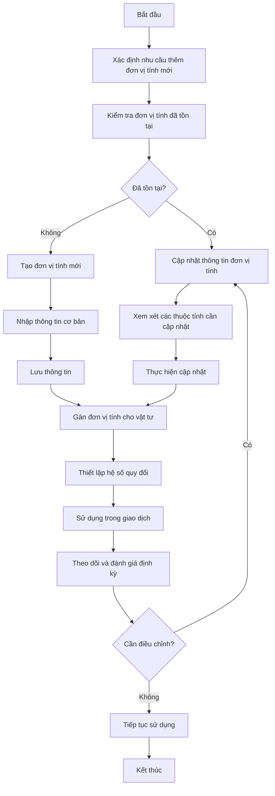
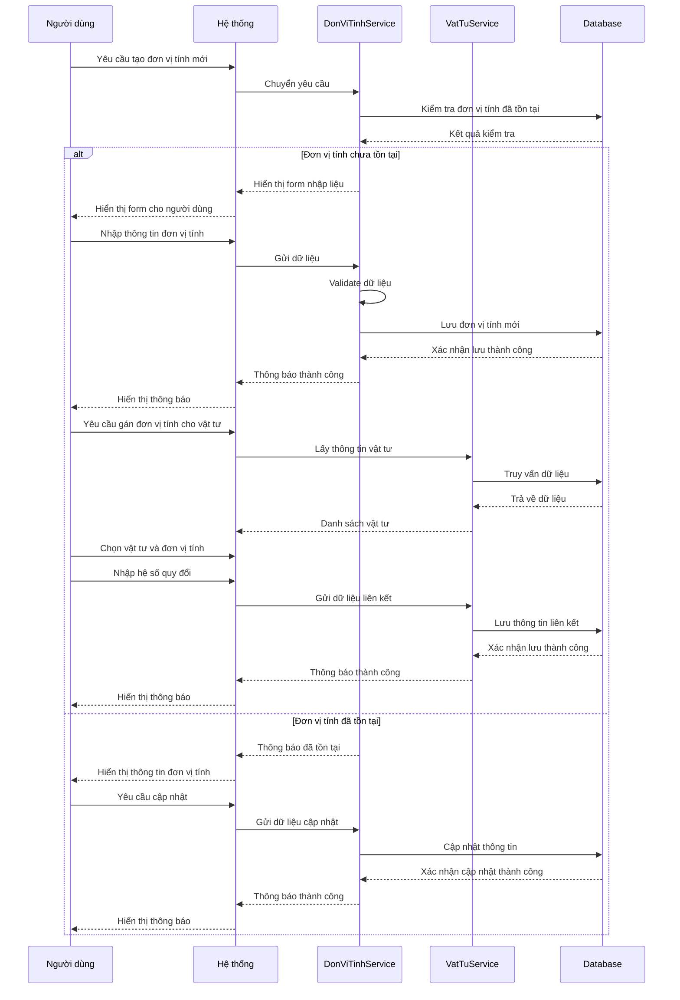
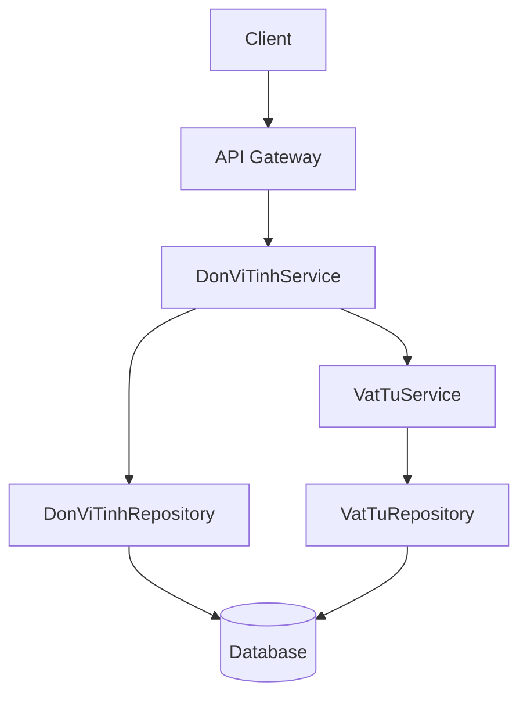
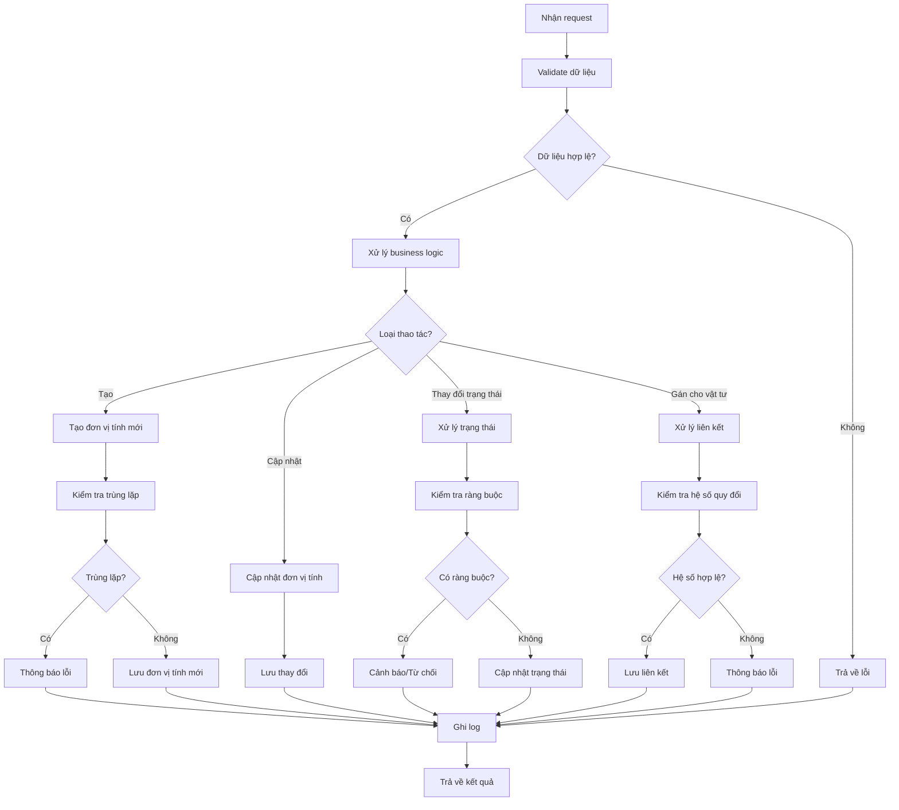

# INV_004_Quản Lý Đơn Vị Tính

*Phiên bản: 1.0*  
*Người tạo: Auto Generated*  
*Ngày tạo: 25/07/2023*  
*Cập nhật lần cuối: 25/07/2023*  
*Người cập nhật: Auto Generated*

## 1. Tổng Quan Nghiệp Vụ

### 1.1. Mô Tả Nghiệp Vụ
Quản lý đơn vị tính là quy trình thiết lập và quản lý các đơn vị đo lường được sử dụng trong hệ thống. Quy trình này bao gồm việc tạo lập đơn vị tính cơ bản, thiết lập đơn vị tính phụ và các hệ số quy đổi giữa các đơn vị tính của cùng một vật tư/sản phẩm. Việc quản lý đơn vị tính hiệu quả giúp doanh nghiệp đảm bảo tính chính xác trong các giao dịch mua bán, quản lý hàng tồn kho, và tạo thuận lợi trong quá trình báo cáo, đối chiếu.

### 1.2. Phạm Vi Áp Dụng
Quy trình này áp dụng cho việc quản lý tất cả các đơn vị tính trong doanh nghiệp, bao gồm:
- Bộ phận kho vận
- Bộ phận mua hàng
- Bộ phận bán hàng
- Bộ phận kế toán
- Các đơn vị liên quan đến quản lý vật tư, hàng hóa

### 1.3. Định Nghĩa Thuật Ngữ
| Thuật ngữ | Định nghĩa |
|-----------|------------|
| Đơn vị tính | Là đơn vị đo lường sử dụng cho vật tư, hàng hóa (cái, thùng, kg...) |
| Mã đơn vị tính | Mã định danh duy nhất cho mỗi đơn vị tính trong hệ thống |
| Đơn vị tính cơ bản | Đơn vị tính gốc dùng để quy đổi các đơn vị tính khác |
| Hệ số quy đổi | Hệ số dùng để chuyển đổi giữa các đơn vị tính |
| Quy đổi đơn vị | Quá trình chuyển đổi giữa các đơn vị tính khác nhau |
| Entity | Đơn vị doanh nghiệp sở hữu đơn vị tính |

### 1.4. Tài Liệu Liên Quan

| STT | Mã tài liệu | Tên tài liệu | Mô tả |
|-----|-------------|--------------|-------|
| 1   | INV_002 | Quản Lý Vật Tư Sản Phẩm | Quy trình quản lý vật tư và sản phẩm |
| 2   | INV_005 | Quản Lý Nhập Xuất Kho | Quy trình nhập xuất kho |
| 3   | PUR_002 | Quản Lý Đơn Mua Hàng | Quy trình tạo và quản lý đơn mua hàng |
| 4   | SAL_004 | Quản Lý Hóa Đơn Bán Hàng | Quy trình tạo và quản lý hóa đơn bán hàng |

## 2. Quy Trình Nghiệp Vụ

### 2.1. Tổng Quan Quy Trình
Quy trình quản lý đơn vị tính bao gồm việc thiết lập đơn vị tính cơ bản, tạo các đơn vị tính phụ, thiết lập hệ số quy đổi, gán đơn vị tính cho vật tư/sản phẩm, và ứng dụng trong các giao dịch mua bán, nhập xuất kho. Quy trình này đảm bảo tính nhất quán và chính xác trong việc đo lường và quản lý hàng hóa.

### 2.2. Sơ Đồ Quy Trình (Business Flow)



### 2.3. Chi Tiết Các Bước Quy Trình

#### 2.3.1. Xác định nhu cầu và kiểm tra đơn vị tính
- **Mô tả**: Xác định nhu cầu thêm đơn vị tính mới và kiểm tra xem đơn vị tính đã tồn tại trong hệ thống chưa
- **Đầu vào**: Thông tin yêu cầu đơn vị tính mới, thông tin tìm kiếm
- **Đầu ra**: Kết quả kiểm tra (tồn tại/không tồn tại)
- **Người thực hiện**: Nhân viên quản lý danh mục
- **Điều kiện tiên quyết**: Có nhu cầu thêm đơn vị tính mới
- **Xử lý ngoại lệ**: Nếu có nhiều đơn vị tính tương tự, cần xác định rõ sự khác biệt

#### 2.3.2. Tạo đơn vị tính mới và nhập thông tin
- **Mô tả**: Tạo đơn vị tính mới và nhập các thông tin cơ bản
- **Đầu vào**: Thông tin đơn vị tính (mã, tên, tên khác, trạng thái)
- **Đầu ra**: Đơn vị tính mới được tạo
- **Người thực hiện**: Nhân viên quản lý danh mục
- **Điều kiện tiên quyết**: Đơn vị tính chưa tồn tại trong hệ thống
- **Xử lý ngoại lệ**: Kiểm tra trùng lặp mã đơn vị tính

#### 2.3.3. Gán đơn vị tính cho vật tư và thiết lập hệ số quy đổi
- **Mô tả**: Gán đơn vị tính cho vật tư và thiết lập hệ số quy đổi giữa các đơn vị tính
- **Đầu vào**: ID vật tư, ID đơn vị tính, hệ số quy đổi
- **Đầu ra**: Liên kết giữa vật tư và đơn vị tính với hệ số quy đổi
- **Người thực hiện**: Nhân viên quản lý danh mục, nhân viên quản lý vật tư
- **Điều kiện tiên quyết**: Đơn vị tính và vật tư đã tồn tại trong hệ thống
- **Xử lý ngoại lệ**: Đảm bảo hệ số quy đổi chính xác và nhất quán

#### 2.3.4. Sử dụng trong giao dịch và theo dõi
- **Mô tả**: Sử dụng đơn vị tính trong các giao dịch và theo dõi hiệu quả
- **Đầu vào**: Thông tin giao dịch, đơn vị tính sử dụng
- **Đầu ra**: Giao dịch được ghi nhận với đơn vị tính chính xác
- **Người thực hiện**: Người dùng hệ thống
- **Điều kiện tiên quyết**: Đơn vị tính đã được thiết lập và gán cho vật tư
- **Xử lý ngoại lệ**: Xử lý các trường hợp cần quy đổi giữa các đơn vị tính

### 2.4. Sơ Đồ Tuần Tự (Sequence Diagram)



### 2.5. Luồng Nghiệp Vụ Thay Thế
- **Nhập hàng loạt**: Thay vì tạo từng đơn vị tính một, người dùng có thể nhập hàng loạt nhiều đơn vị tính cùng lúc thông qua file Excel
- **Quy đổi tự động**: Hệ thống tự động quy đổi giữa các đơn vị tính khi người dùng nhập thông tin với đơn vị tính khác với đơn vị tính mặc định
- **Sao chép từ vật tư khác**: Sử dụng cấu hình đơn vị tính từ vật tư tương tự đã có trong hệ thống

## 3. Yêu Cầu Chức Năng

### 3.1. Danh Sách Chức Năng

| STT | Mã chức năng | Tên chức năng | Mô tả | Độ ưu tiên |
|-----|--------------|---------------|-------|------------|
| 1   | UOM_LIST | Xem danh sách đơn vị tính | Hiển thị danh sách đơn vị tính với các bộ lọc và tìm kiếm | Cao |
| 2   | UOM_CREATE | Tạo đơn vị tính mới | Thêm đơn vị tính mới vào hệ thống | Cao |
| 3   | UOM_UPDATE | Cập nhật đơn vị tính | Chỉnh sửa thông tin đơn vị tính | Cao |
| 4   | UOM_VIEW | Xem chi tiết đơn vị tính | Xem toàn bộ thông tin chi tiết của đơn vị tính | Cao |
| 5   | UOM_STATUS | Thay đổi trạng thái | Đánh dấu đơn vị tính là active/inactive | Cao |
| 6   | UOM_ASSIGN | Gán đơn vị tính cho vật tư | Liên kết đơn vị tính với vật tư | Cao |
| 7   | UOM_CONVERT | Thiết lập hệ số quy đổi | Thiết lập hệ số quy đổi giữa các đơn vị tính | Cao |
| 8   | UOM_IMPORT | Nhập dữ liệu hàng loạt | Nhập nhiều đơn vị tính từ file Excel | Trung bình |

### 3.2. Chi Tiết Chức Năng

#### 3.2.1. UOM_CREATE: Tạo đơn vị tính mới
- **Mô tả**: Cho phép người dùng tạo đơn vị tính mới trong hệ thống
- **Đầu vào**: Thông tin đơn vị tính (mã đơn vị tính, tên đơn vị tính, tên khác, trạng thái)
- **Đầu ra**: Bản ghi đơn vị tính mới trong hệ thống
- **Điều kiện tiên quyết**: Người dùng đã đăng nhập và có quyền tạo đơn vị tính
- **Luồng xử lý chính**:
  1. Người dùng chọn "Tạo đơn vị tính mới"
  2. Hệ thống hiển thị form nhập thông tin
  3. Người dùng nhập thông tin cơ bản (mã, tên, tên khác)
  4. Người dùng nhấn "Lưu"
  5. Hệ thống kiểm tra tính hợp lệ của dữ liệu
  6. Hệ thống kiểm tra trùng lặp mã đơn vị tính
  7. Hệ thống lưu đơn vị tính mới
- **Luồng xử lý thay thế/ngoại lệ**:
  1. Nếu dữ liệu không hợp lệ, hiển thị thông báo lỗi
  2. Nếu mã đơn vị tính đã tồn tại, yêu cầu nhập mã khác
- **Giao diện liên quan**: Form tạo đơn vị tính mới

#### 3.2.2. UOM_ASSIGN: Gán đơn vị tính cho vật tư
- **Mô tả**: Cho phép gán đơn vị tính cho vật tư và thiết lập hệ số quy đổi
- **Đầu vào**: ID vật tư, ID đơn vị tính, tên hiển thị, hệ số quy đổi
- **Đầu ra**: Liên kết giữa vật tư và đơn vị tính
- **Điều kiện tiên quyết**: Vật tư và đơn vị tính đã tồn tại trong hệ thống
- **Luồng xử lý chính**:
  1. Người dùng chọn vật tư cần gán đơn vị tính
  2. Hệ thống hiển thị danh sách đơn vị tính hiện có
  3. Người dùng chọn đơn vị tính
  4. Người dùng nhập tên hiển thị và hệ số quy đổi
  5. Người dùng nhấn "Lưu"
  6. Hệ thống kiểm tra tính hợp lệ của dữ liệu
  7. Hệ thống lưu thông tin liên kết
- **Luồng xử lý thay thế/ngoại lệ**:
  1. Nếu hệ số quy đổi không hợp lệ, hiển thị thông báo lỗi
  2. Nếu đơn vị tính đã được gán cho vật tư, hiển thị thông báo và cập nhật thông tin hiện có
- **Giao diện liên quan**: Form gán đơn vị tính cho vật tư

## 4. Thiết Kế Kỹ Thuật

### 4.1. Kiến Trúc Hệ Thống



### 4.2. API Endpoints

#### 4.2.1. Lấy danh sách đơn vị tính
- **Mô tả**: Trả về danh sách đơn vị tính theo điều kiện lọc
- **URL**: `GET /api/v1/entity/{entity_slug}/don-vi-tinh/`
- **Query Parameters**:
  - `status`: Lọc theo trạng thái (1: active, 0: inactive)
  - `search`: Từ khóa tìm kiếm (tên, mã đơn vị tính)
  - `page`: Số trang
  - `page_size`: Số bản ghi trên mỗi trang
  - `ordering`: Trường sắp xếp
- **Response**: Danh sách đơn vị tính, phân trang

#### 4.2.2. Lấy chi tiết đơn vị tính
- **Mô tả**: Trả về thông tin chi tiết của một đơn vị tính
- **URL**: `GET /api/v1/entity/{entity_slug}/don-vi-tinh/{uuid}/`
- **Response**: Chi tiết đơn vị tính

#### 4.2.3. Tạo đơn vị tính mới
- **Mô tả**: Tạo đơn vị tính mới trong hệ thống
- **URL**: `POST /api/v1/entity/{entity_slug}/don-vi-tinh/`
- **Request Body**: Thông tin đơn vị tính
- **Response**: Thông tin đơn vị tính đã tạo

#### 4.2.4. Cập nhật đơn vị tính
- **Mô tả**: Cập nhật thông tin đơn vị tính
- **URL**: `PUT /api/v1/entity/{entity_slug}/don-vi-tinh/{uuid}/`
- **Request Body**: Thông tin cập nhật
- **Response**: Thông tin đơn vị tính đã cập nhật

#### 4.2.5. Gán đơn vị tính cho vật tư
- **Mô tả**: Gán đơn vị tính cho vật tư và thiết lập hệ số quy đổi
- **URL**: `POST /api/v1/entity/{entity_slug}/vat-tu/{vat_tu_uuid}/don-vi-tinh/`
- **Request Body**: Thông tin liên kết và hệ số quy đổi
- **Response**: Thông tin liên kết đã tạo

### 4.3. Service Logic

#### 4.3.1. DonViTinhService
- **Mô tả**: Xử lý logic nghiệp vụ liên quan đến quản lý đơn vị tính
- **Chức năng chính**:
  1. Tạo và quản lý đơn vị tính
  2. Cập nhật thông tin đơn vị tính
  3. Quản lý trạng thái đơn vị tính
  4. Kiểm tra ràng buộc khi thay đổi trạng thái
- **Các dependencies**:
  1. DonViTinhRepository
  2. VatTuService
- **Sơ đồ luồng xử lý**:



### 4.4. Mô Hình Dữ Liệu

#### 4.4.1. Entity Relationship Diagram (ERD)

```mermaid
erDiagram
    EntityModel ||--o{ DonViTinhModel : "có"
    DonViTinhModel ||--o{ VatTuSanPhamDonViTinhModel : "sử dụng trong"
    VatTuModel ||--o{ VatTuSanPhamDonViTinhModel : "có"
    
    DonViTinhModel {
        UUID uuid PK
        FK EntityModel entity_model
        String dvt
        String ten_dvt
        String ten_khac
        String dvt2
        Integer status
        DateTime created
        DateTime updated
    }
    
    VatTuSanPhamDonViTinhModel {
        UUID uuid PK
        FK VatTuModel vat_tu_san_pham_id
        FK DonViTinhModel don_vi_tinh_id
        String ten_dvt
        Decimal he_so
        DateTime created
        DateTime updated
    }
```

#### 4.4.2. Chi Tiết Bảng Dữ Liệu

##### Bảng: DonViTinhModel
- **Mô tả**: Lưu trữ thông tin về đơn vị tính
- **Các trường chính**:
  - `uuid`: Khóa chính, định danh duy nhất
  - `entity_model`: Khóa ngoại tham chiếu đến EntityModel
  - `dvt`: Mã đơn vị tính
  - `ten_dvt`: Tên đơn vị tính
  - `ten_khac`: Tên khác (tùy chọn)
  - `dvt2`: Mã đơn vị tính thứ 2 (tùy chọn)
  - `status`: Trạng thái (1: active, 0: inactive)
  - `created`: Thời gian tạo
  - `updated`: Thời gian cập nhật

##### Bảng: VatTuSanPhamDonViTinhModel
- **Mô tả**: Lưu trữ thông tin về liên kết giữa vật tư và đơn vị tính
- **Các trường chính**:
  - `uuid`: Khóa chính, định danh duy nhất
  - `vat_tu_san_pham_id`: Khóa ngoại tham chiếu đến VatTuModel
  - `don_vi_tinh_id`: Khóa ngoại tham chiếu đến DonViTinhModel
  - `ten_dvt`: Tên hiển thị của đơn vị tính
  - `he_so`: Hệ số quy đổi
  - `created`: Thời gian tạo
  - `updated`: Thời gian cập nhật

## 5. Kế Hoạch Kiểm Thử

### 5.1. Phạm Vi Kiểm Thử
Kiểm thử sẽ bao gồm tất cả các chức năng liên quan đến quản lý đơn vị tính, bao gồm:
- Tạo mới đơn vị tính
- Cập nhật thông tin đơn vị tính
- Tìm kiếm và lọc đơn vị tính
- Thay đổi trạng thái đơn vị tính
- Gán đơn vị tính cho vật tư
- Thiết lập hệ số quy đổi
- Quy đổi giữa các đơn vị tính

### 5.2. Kịch Bản Kiểm Thử

| STT | Mã kịch bản | Tên kịch bản | Mô tả | Điều kiện tiên quyết | Các bước | Kết quả mong đợi |
|-----|------------|--------------|-------|---------------------|----------|-----------------|
| 1   | TC_UOM_C01 | Tạo đơn vị tính mới thành công | Kiểm tra việc tạo đơn vị tính mới | Người dùng đã đăng nhập và có quyền | 1. Truy cập form tạo đơn vị tính<br>2. Nhập thông tin hợp lệ<br>3. Nhấn Lưu | Đơn vị tính mới được tạo thành công |
| 2   | TC_UOM_C02 | Tạo đơn vị tính với mã trùng | Kiểm tra validate mã đơn vị tính trùng | Đã có đơn vị tính trong hệ thống | 1. Truy cập form tạo đơn vị tính<br>2. Nhập mã đơn vị tính đã tồn tại<br>3. Nhấn Lưu | Hiển thị thông báo lỗi về mã đơn vị tính trùng |
| 3   | TC_UOM_U01 | Cập nhật thông tin đơn vị tính | Kiểm tra cập nhật thông tin | Đơn vị tính đã tồn tại | 1. Mở form cập nhật<br>2. Thay đổi thông tin<br>3. Nhấn Lưu | Thông tin được cập nhật thành công |
| 4   | TC_UOM_A01 | Gán đơn vị tính cho vật tư | Kiểm tra chức năng gán đơn vị tính | Vật tư và đơn vị tính đã tồn tại | 1. Chọn vật tư<br>2. Thêm đơn vị tính<br>3. Nhập hệ số quy đổi<br>4. Lưu | Đơn vị tính được gán thành công |
| 5   | TC_UOM_C01 | Quy đổi giữa các đơn vị tính | Kiểm tra tính năng quy đổi | Vật tư có nhiều đơn vị tính | 1. Chọn vật tư<br>2. Nhập số lượng với đơn vị tính A<br>3. Chuyển sang đơn vị tính B | Hệ thống tự động quy đổi chính xác |

## 6. Phụ Lục

### 6.1. Danh Sách Tài Liệu Tham Khảo
1. Tài liệu thiết kế cơ sở dữ liệu ERP
2. Tài liệu API đặc tả
3. Quy định về quản lý vật tư của doanh nghiệp

### 6.2. Danh Mục Thuật Ngữ
- **DonViTinhModel**: Mô hình dữ liệu lưu trữ thông tin đơn vị tính
- **VatTuSanPhamDonViTinhModel**: Mô hình dữ liệu liên kết giữa vật tư và đơn vị tính
- **Hệ số quy đổi**: Giá trị dùng để chuyển đổi giữa các đơn vị tính
- **Đơn vị tính cơ bản**: Đơn vị tính chính của vật tư, làm cơ sở để quy đổi

### 6.3. Lịch Sử Thay Đổi Tài Liệu

| Phiên bản | Ngày | Người thực hiện | Mô tả thay đổi |
|-----------|------|-----------------|---------------|
| 1.0 | 25/07/2023 | Auto Generated | Tạo tài liệu ban đầu |