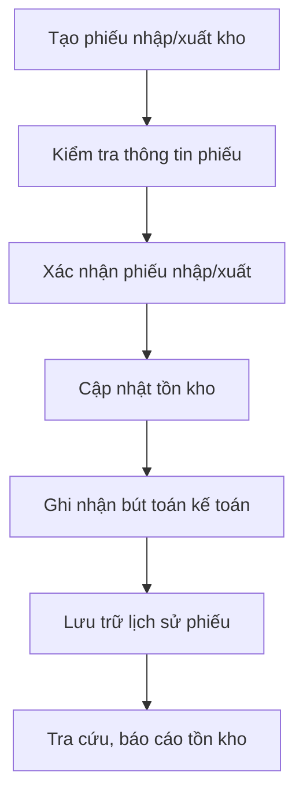
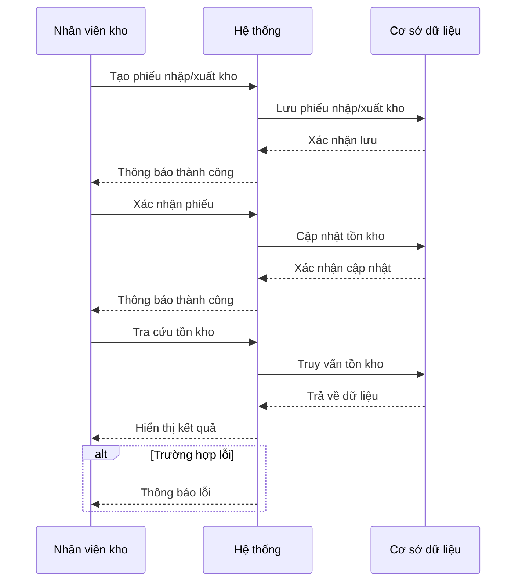
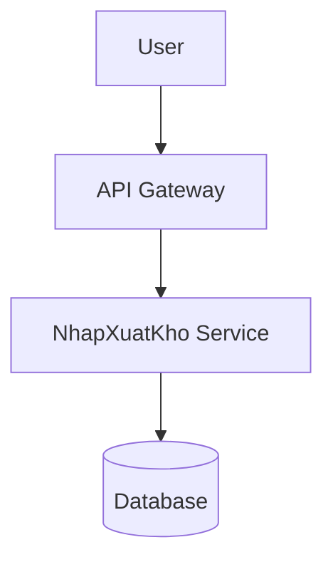
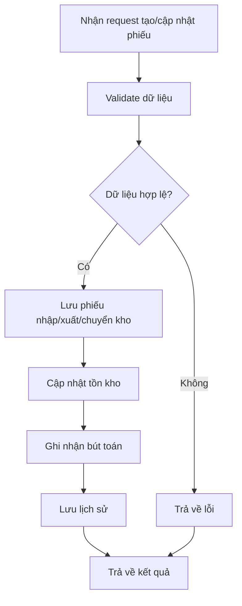

# INV_005_Quản Lý Nhập Xuất Kho

*Phiên bản: 1.0*  
*Người tạo: [Tên Tác Giả]*  
*Ngày tạo: [DD/MM/YYYY]*  
*Cập nhật lần cuối: [DD/MM/YYYY]*  
*Người cập nhật: [Tên Người Cập Nhật]*

## 1. Tổng Quan Nghiệp Vụ

### 1.1. Mô Tả Nghiệp Vụ
Quản lý nhập xuất kho là nghiệp vụ cốt lõi trong hệ thống ERP, đảm bảo kiểm soát chặt chẽ toàn bộ quá trình nhập, xuất, chuyển kho vật tư, hàng hóa. Nghiệp vụ này giúp doanh nghiệp kiểm soát tồn kho, tối ưu dòng tiền, giảm thất thoát, hỗ trợ ra quyết định mua hàng, sản xuất, bán hàng và kiểm toán.

### 1.2. Phạm Vi Áp Dụng
Áp dụng cho các bộ phận: Kho, Kế toán, Mua hàng, Bán hàng, Sản xuất, Quản trị hệ thống.

### 1.3. Định Nghĩa Thuật Ngữ
| Thuật ngữ | Định nghĩa |
|-----------|------------|
| Nhập kho | Ghi nhận vật tư, hàng hóa vào kho |
| Xuất kho | Ghi nhận vật tư, hàng hóa ra khỏi kho |
| Chuyển kho | Di chuyển vật tư, hàng hóa giữa các kho |
| Tồn kho | Số lượng vật tư, hàng hóa còn lại trong kho tại một thời điểm |
| Mã kho | Định danh kho hàng trong hệ thống |
| Mã vật tư | Định danh vật tư, hàng hóa |

### 1.4. Tài Liệu Liên Quan
| STT | Mã tài liệu | Tên tài liệu | Mô tả |
|-----|-------------|--------------|-------|
| 1   | INV_001     | Quản Lý Kho Hàng | Thiết lập, quản lý thông tin kho |
| 2   | INV_002     | Quản Lý Vật Tư Sản Phẩm | Quản lý danh mục vật tư, sản phẩm |
| 3   | ACC_003     | Bút Toán Kế Toán | Ghi nhận bút toán nhập xuất kho |

## 2. Quy Trình Nghiệp Vụ

### 2.1. Tổng Quan Quy Trình
Quy trình nhập xuất kho gồm các bước: tạo phiếu nhập/xuất, kiểm tra thông tin, xác nhận, cập nhật tồn kho, ghi nhận kế toán, lưu trữ lịch sử.

### 2.2. Sơ Đồ Quy Trình (Business Flow)

### 2.3. Chi Tiết Các Bước Quy Trình

#### 2.3.1. Tạo phiếu nhập/xuất kho
- **Mô tả**: Tạo mới phiếu nhập kho, xuất kho hoặc chuyển kho
- **Đầu vào**: Thông tin vật tư, số lượng, kho, lý do nhập/xuất, ngày chứng từ
- **Đầu ra**: Phiếu nhập/xuất kho mới
- **Người thực hiện**: Nhân viên kho, kế toán
- **Điều kiện tiên quyết**: Có quyền tạo phiếu
- **Xử lý ngoại lệ**: Thiếu thông tin bắt buộc, vật tư không tồn tại

#### 2.3.2. Kiểm tra thông tin phiếu
- **Mô tả**: Kiểm tra tính hợp lệ của thông tin phiếu nhập/xuất
- **Đầu vào**: Phiếu nhập/xuất kho
- **Đầu ra**: Phiếu hợp lệ hoặc thông báo lỗi
- **Người thực hiện**: Thủ kho, kế toán
- **Điều kiện tiên quyết**: Phiếu đã được tạo
- **Xử lý ngoại lệ**: Số lượng âm, kho không hợp lệ, vật tư không đủ tồn kho

#### 2.3.3. Xác nhận phiếu nhập/xuất
- **Mô tả**: Xác nhận hoàn tất nghiệp vụ nhập/xuất kho
- **Đầu vào**: Phiếu nhập/xuất đã kiểm tra
- **Đầu ra**: Phiếu đã xác nhận
- **Người thực hiện**: Thủ kho, kế toán trưởng
- **Điều kiện tiên quyết**: Phiếu hợp lệ
- **Xử lý ngoại lệ**: Không có quyền xác nhận

#### 2.3.4. Cập nhật tồn kho
- **Mô tả**: Cập nhật số lượng tồn kho thực tế sau khi nhập/xuất
- **Đầu vào**: Phiếu đã xác nhận
- **Đầu ra**: Số lượng tồn kho mới
- **Người thực hiện**: Hệ thống
- **Điều kiện tiên quyết**: Phiếu đã xác nhận
- **Xử lý ngoại lệ**: Lỗi cập nhật dữ liệu

#### 2.3.5. Ghi nhận bút toán kế toán
- **Mô tả**: Ghi nhận bút toán nhập xuất kho vào sổ kế toán
- **Đầu vào**: Phiếu nhập/xuất đã xác nhận
- **Đầu ra**: Bút toán kế toán
- **Người thực hiện**: Hệ thống, kế toán
- **Điều kiện tiên quyết**: Phiếu đã xác nhận
- **Xử lý ngoại lệ**: Lỗi ghi nhận bút toán

#### 2.3.6. Lưu trữ lịch sử phiếu
- **Mô tả**: Lưu lại lịch sử các phiếu nhập/xuất kho
- **Đầu vào**: Phiếu nhập/xuất đã xác nhận
- **Đầu ra**: Bản ghi lịch sử
- **Người thực hiện**: Hệ thống
- **Điều kiện tiên quyết**: Phiếu đã xác nhận
- **Xử lý ngoại lệ**: Lỗi lưu trữ

### 2.4. Sơ Đồ Tuần Tự (Sequence Diagram)

### 2.5. Luồng Nghiệp Vụ Thay Thế
- Trường hợp phiếu bị hủy: chuyển trạng thái phiếu, ghi nhận lý do, lưu lịch sử
- Trường hợp điều chỉnh tồn kho: tạo phiếu điều chỉnh, cập nhật tồn kho, lưu lịch sử

## 3. Yêu Cầu Chức Năng

### 3.1. Danh Sách Chức Năng
| STT | Mã chức năng | Tên chức năng | Mô tả | Độ ưu tiên |
|-----|--------------|---------------|-------|------------|
| 1   | INV_005_01   | Tạo phiếu nhập kho | Tạo mới phiếu nhập kho | Cao |
| 2   | INV_005_02   | Tạo phiếu xuất kho | Tạo mới phiếu xuất kho | Cao |
| 3   | INV_005_03   | Tạo phiếu chuyển kho | Tạo mới phiếu chuyển kho giữa các kho | Trung bình |
| 4   | INV_005_04   | Kiểm tra, xác nhận phiếu | Kiểm tra, xác nhận phiếu nhập/xuất/chuyển kho | Cao |
| 5   | INV_005_05   | Cập nhật tồn kho | Cập nhật số lượng tồn kho thực tế | Cao |
| 6   | INV_005_06   | Ghi nhận bút toán kế toán | Ghi nhận bút toán nhập xuất kho | Cao |
| 7   | INV_005_07   | Lưu trữ, tra cứu lịch sử phiếu | Lưu trữ, tra cứu lịch sử phiếu nhập/xuất/chuyển kho | Trung bình |

### 3.2. Chi Tiết Chức Năng

#### 3.2.1. INV_005_01: Tạo phiếu nhập kho
- **Mô tả**: Cho phép tạo mới phiếu nhập kho
- **Đầu vào**: Thông tin vật tư, số lượng, kho, lý do nhập, ngày chứng từ
- **Đầu ra**: Phiếu nhập kho mới
- **Điều kiện tiên quyết**: Có quyền tạo phiếu
- **Luồng xử lý chính**:
  1. Nhập thông tin vật tư, số lượng, kho, lý do nhập, ngày chứng từ
  2. Lưu phiếu nhập kho
- **Luồng xử lý thay thế/ngoại lệ**:
  1. Thiếu thông tin bắt buộc
  2. Vật tư không tồn tại
- **Giao diện liên quan**: Form tạo phiếu nhập kho

#### 3.2.2. INV_005_02: Tạo phiếu xuất kho
- **Mô tả**: Cho phép tạo mới phiếu xuất kho
- **Đầu vào**: Thông tin vật tư, số lượng, kho, lý do xuất, ngày chứng từ
- **Đầu ra**: Phiếu xuất kho mới
- **Điều kiện tiên quyết**: Có quyền tạo phiếu
- **Luồng xử lý chính**:
  1. Nhập thông tin vật tư, số lượng, kho, lý do xuất, ngày chứng từ
  2. Lưu phiếu xuất kho
- **Luồng xử lý thay thế/ngoại lệ**:
  1. Thiếu thông tin bắt buộc
  2. Vật tư không đủ tồn kho
- **Giao diện liên quan**: Form tạo phiếu xuất kho

#### 3.2.3. INV_005_03: Tạo phiếu chuyển kho
- **Mô tả**: Cho phép tạo mới phiếu chuyển kho giữa các kho
- **Đầu vào**: Thông tin vật tư, số lượng, kho đi, kho đến, ngày chứng từ
- **Đầu ra**: Phiếu chuyển kho mới
- **Điều kiện tiên quyết**: Có quyền tạo phiếu
- **Luồng xử lý chính**:
  1. Nhập thông tin vật tư, số lượng, kho đi, kho đến, ngày chứng từ
  2. Lưu phiếu chuyển kho
- **Luồng xử lý thay thế/ngoại lệ**:
  1. Thiếu thông tin bắt buộc
  2. Kho không hợp lệ
- **Giao diện liên quan**: Form tạo phiếu chuyển kho

#### 3.2.4. INV_005_04: Kiểm tra, xác nhận phiếu
- **Mô tả**: Kiểm tra, xác nhận phiếu nhập/xuất/chuyển kho
- **Đầu vào**: Phiếu nhập/xuất/chuyển kho
- **Đầu ra**: Phiếu đã xác nhận
- **Điều kiện tiên quyết**: Phiếu hợp lệ
- **Luồng xử lý chính**:
  1. Kiểm tra thông tin phiếu
  2. Xác nhận phiếu
- **Luồng xử lý thay thế/ngoại lệ**:
  1. Không có quyền xác nhận
- **Giao diện liên quan**: Màn hình xác nhận phiếu

#### 3.2.5. INV_005_05: Cập nhật tồn kho
- **Mô tả**: Cập nhật số lượng tồn kho thực tế sau khi nhập/xuất/chuyển kho
- **Đầu vào**: Phiếu đã xác nhận
- **Đầu ra**: Số lượng tồn kho mới
- **Điều kiện tiên quyết**: Phiếu đã xác nhận
- **Luồng xử lý chính**:
  1. Lấy thông tin phiếu đã xác nhận
  2. Cập nhật số lượng tồn kho
- **Luồng xử lý thay thế/ngoại lệ**:
  1. Lỗi cập nhật dữ liệu
- **Giao diện liên quan**: Màn hình tồn kho

#### 3.2.6. INV_005_06: Ghi nhận bút toán kế toán
- **Mô tả**: Ghi nhận bút toán nhập xuất kho vào sổ kế toán
- **Đầu vào**: Phiếu nhập/xuất đã xác nhận
- **Đầu ra**: Bút toán kế toán
- **Điều kiện tiên quyết**: Phiếu đã xác nhận
- **Luồng xử lý chính**:
  1. Lấy thông tin phiếu đã xác nhận
  2. Ghi nhận bút toán
- **Luồng xử lý thay thế/ngoại lệ**:
  1. Lỗi ghi nhận bút toán
- **Giao diện liên quan**: Màn hình bút toán kế toán

#### 3.2.7. INV_005_07: Lưu trữ, tra cứu lịch sử phiếu
- **Mô tả**: Lưu lại lịch sử các phiếu nhập/xuất/chuyển kho, cho phép tra cứu
- **Đầu vào**: Phiếu nhập/xuất/chuyển kho đã xác nhận
- **Đầu ra**: Bản ghi lịch sử
- **Điều kiện tiên quyết**: Phiếu đã xác nhận
- **Luồng xử lý chính**:
  1. Lưu bản ghi lịch sử
  2. Tra cứu lịch sử phiếu
- **Luồng xử lý thay thế/ngoại lệ**:
  1. Lỗi lưu trữ
- **Giao diện liên quan**: Màn hình lịch sử phiếu

## 4. Thiết Kế Kỹ Thuật

### 4.1. Kiến Trúc Hệ Thống

### 4.2. API Endpoints
#### 4.2.1. Tạo phiếu nhập kho
- **Mô tả**: Tạo mới phiếu nhập kho
- **URL**: `POST /api/v1/{entity_slug}/phieu-nhap-kho/`
#### 4.2.2. Tạo phiếu xuất kho
- **Mô tả**: Tạo mới phiếu xuất kho
- **URL**: `POST /api/v1/{entity_slug}/phieu-xuat-kho/`
#### 4.2.3. Tạo phiếu chuyển kho
- **Mô tả**: Tạo mới phiếu chuyển kho
- **URL**: `POST /api/v1/{entity_slug}/phieu-chuyen-kho/`
#### 4.2.4. Xác nhận phiếu nhập/xuất/chuyển kho
- **Mô tả**: Xác nhận phiếu nhập/xuất/chuyển kho
- **URL**: `PUT /api/v1/{entity_slug}/phieu-nhap-xuat-kho/{uuid}/xac-nhan/`
#### 4.2.5. Tra cứu tồn kho
- **Mô tả**: Lấy thông tin tồn kho
- **URL**: `GET /api/v1/{entity_slug}/ton-kho/`

### 4.3. Service Logic
#### 4.3.1. NhapXuatKho Service
- **Mô tả**: Xử lý toàn bộ logic nhập, xuất, chuyển kho, cập nhật tồn kho, ghi nhận bút toán, lưu trữ lịch sử
- **Chức năng chính**:
  1. Tạo phiếu nhập kho
  2. Tạo phiếu xuất kho
  3. Tạo phiếu chuyển kho
  4. Kiểm tra, xác nhận phiếu
  5. Cập nhật tồn kho
  6. Ghi nhận bút toán kế toán
  7. Lưu trữ, tra cứu lịch sử phiếu
- **Các dependencies**:
  1. KhoHang Service
  2. VatTu Service
  3. Account Service
- **Sơ đồ luồng xử lý**:

## 5. Kế Hoạch Kiểm Thử
- **Phạm vi kiểm thử**: Toàn bộ quy trình tạo, xác nhận, cập nhật tồn kho, ghi nhận bút toán, lưu trữ lịch sử phiếu nhập/xuất/chuyển kho
- **Kịch bản kiểm thử**:
  1. Tạo mới phiếu nhập kho với đầy đủ thông tin
  2. Tạo phiếu xuất kho với vật tư không đủ tồn kho
  3. Tạo phiếu chuyển kho giữa hai kho
  4. Xác nhận phiếu nhập/xuất/chuyển kho
  5. Tra cứu tồn kho

## 6. Phụ Lục
- **Danh sách tài liệu tham khảo**: Xem mục 1.4
- **Danh mục thuật ngữ**: Xem mục 1.3
- **Lịch sử thay đổi tài liệu**:
  - [DD/MM/YYYY] Tạo mới