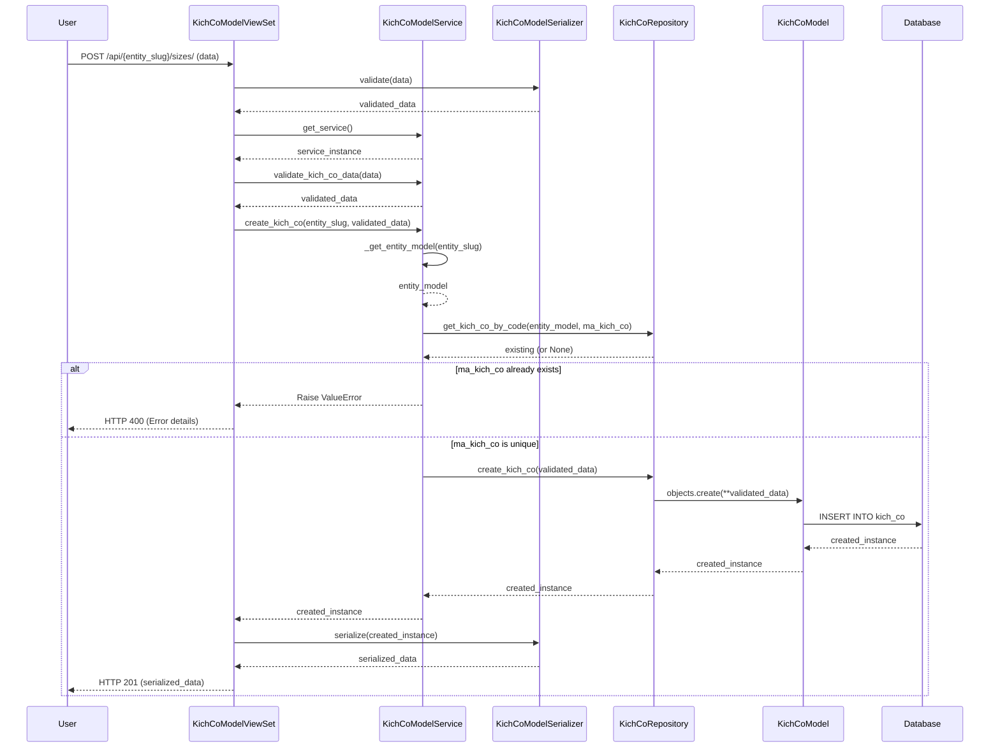
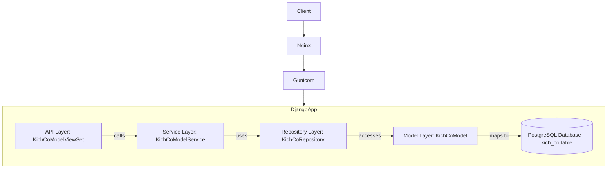

# INV_008_Quản Lý Kích Cỡ

*Phiên bản: 1.0*
*Người tạo: Gemini AI Assistant*
*Ngày tạo: 2024-07-31*
*Cập nhật lần cuối: 2024-07-31*
*Người cập nhật: Gemini AI Assistant*

## 1. Tổng Quan Nghiệp Vụ

### 1.1. Mô Tả Nghiệp Vụ
Nghiệp vụ Quản Lý Kích Cỡ (trong mã nguồn là `KichCoModel`) cho phép người dùng định nghĩa và quản lý các kích cỡ khác nhau cho sản phẩm trong hệ thống. Mỗi kích cỡ bao gồm các thông tin như mã kích cỡ, tên kích cỡ, tên thay thế và trạng thái. Mục đích là tạo ra một danh mục chuẩn hóa các kích cỡ để sử dụng khi quản lý sản phẩm, lưu trữ hàng tồn kho, và thực hiện các giao dịch bán hàng/mua hàng.

### 1.2. Phạm Vi Áp Dụng
- Áp dụng cho từng Đơn vị (Entity) trong hệ thống.
- Các bộ phận liên quan đến quản lý sản phẩm, kho hàng, và bán hàng.

### 1.3. Định Nghĩa Thuật Ngữ
| Thuật ngữ | Định nghĩa |
|-----------|------------|
| Kích Cỡ | Một đặc tính về kích thước của sản phẩm (như S, M, L, XL hoặc các kích cỡ khác). Trong mã nguồn là `KichCoModel`. |
| Đơn vị (Entity) | Tổ chức hoặc công ty mà kích cỡ được định nghĩa và áp dụng. |
| `ma_kich_co` | Mã định danh duy nhất cho một kích cỡ trong một đơn vị. |
| `ten_kich_co` | Tên chính của kích cỡ. |
| `ten_kich_co2` | Tên thay thế/phụ của kích cỡ. |
| `status` | Trạng thái của kích cỡ: 1 (Active - Hoạt động), 0 (Inactive - Không hoạt động). |

### 1.4. Tài Liệu Liên Quan
| STT | Mã tài liệu | Tên tài liệu | Mô tả |
|-----|-------------|--------------|-------|
| 1   | `django_ledger/models/size.py` | Model Định Nghĩa Kích Cỡ | Định nghĩa cấu trúc dữ liệu cho `KichCoModel`. |
| 2   | `django_ledger/api/views/kich_co.py` | API Endpoints Kích Cỡ | Các điểm cuối API để tương tác với nghiệp vụ Quản Lý Kích Cỡ. |
| 3   | `django_ledger/api/serializers/kich_co.py` | Serializers Kích Cỡ | Định dạng dữ liệu JSON cho API, thực hiện validation. |
| 4   | `django_ledger/services/kich_co/kich_co.py` | Service Logic Kích Cỡ | Logic nghiệp vụ cho việc tạo, cập nhật, xóa, truy vấn Kích Cỡ. |
| 5   | `django_ledger/repositories/kich_co/kich_co.py` | Repository Kích Cỡ | Lớp truy cập dữ liệu cho Kích Cỡ. |
| 6   | `django_ledger/api/urls.py` | URL Configuration | Đăng ký endpoint `/api/{entity_slug}/sizes/` cho Kích Cỡ. |

## 2. Quy Trình Nghiệp Vụ

### 2.1. Tổng Quan Quy Trình
Người dùng có thẩm quyền (ví dụ: quản trị viên, quản lý) tương tác với hệ thống thông qua giao diện người dùng hoặc API để thực hiện các thao tác CRUD (Create, Read, Update, Delete) đối với các Kích Cỡ. Hệ thống sẽ xử lý các yêu cầu này thông qua `KichCoModelViewSet`, sử dụng `KichCoModelService` để thực thi logic nghiệp vụ và `KichCoRepository` để tương tác với cơ sở dữ liệu. Dữ liệu đầu vào sẽ được kiểm tra (validate) bởi `KichCoModelSerializer` và `KichCoModelService`.

### 2.2. Sơ Đồ Quy Trình (Business Flow)

```mermaid
flowchart TD
    A[Người dùng yêu cầu thao tác Kích Cỡ] --> B{API Gateway nhận yêu cầu};
    B --> C[Xác thực & Ủy quyền (IsAuthenticated)];
    C --> D[KichCoModelViewSet];
    D --> E[KichCoModelService];
    E --> F[KichCoRepository];
    F --> G[(Cơ sở dữ liệu - Bảng kich_co)];
    G --> F;
    F --> E;
    E --> D;
    subgraph "Validation"
        direction LR
        H[Request Data] --> I[KichCoModelSerializer];
        I --> J[KichCoModelService.validate_kich_co_data];
    end
    D --> H;
    J -- Dữ liệu hợp lệ --> E;
    J -- Dữ liệu không hợp lệ --> K[Báo lỗi cho ViewSet];
    K --> B;
    D --> L[Trả kết quả cho người dùng];
    B --> L;
```

### 2.3. Chi Tiết Các Bước Quy Trình

#### 2.3.1. Tạo Mới Kích Cỡ
- **Mô tả**: Người dùng cung cấp thông tin để tạo một Kích Cỡ mới cho một Đơn vị.
- **Đầu vào**: Dữ liệu Kích Cỡ (`ma_kich_co`, `ten_kich_co`, `ten_kich_co2`, và trạng thái). `entity_slug` được lấy từ URL.
- **Đầu ra**: Kích Cỡ mới được tạo thành công hoặc thông báo lỗi.
- **Người thực hiện**: Quản trị viên, quản lý.
- **Điều kiện tiên quyết**: Đăng nhập hệ thống, có quyền truy cập vào Đơn vị. `ma_kich_co` phải là duy nhất trong Đơn vị đó.
- **Xử lý ngoại lệ**: Dữ liệu không hợp lệ (thiếu trường, sai định dạng, `ma_kich_co` bị trùng), Đơn vị không tồn tại.

#### 2.3.2. Xem/Tìm Kiếm Kích Cỡ
- **Mô tả**: Người dùng xem danh sách các Kích Cỡ của một Đơn vị hoặc chi tiết một Kích Cỡ cụ thể. Hỗ trợ phân trang và lọc theo tên.
- **Đầu vào**: `entity_slug` (từ URL). Tùy chọn: `uuid` của Kích Cỡ (để xem chi tiết), tham số phân trang (`page`, `page_size`), tham số lọc (`ten_kich_co`, `active_only`).
- **Đầu ra**: Danh sách các Kích Cỡ hoặc thông tin chi tiết của một Kích Cỡ.
- **Người thực hiện**: Mọi người dùng có quyền xem.
- **Điều kiện tiên quyết**: Đăng nhập hệ thống.
- **Xử lý ngoại lệ**: Kích Cỡ không tồn tại, Đơn vị không tồn tại.

#### 2.3.3. Cập Nhật Kích Cỡ
- **Mô tả**: Người dùng thay đổi thông tin của một Kích Cỡ đã tồn tại.
- **Đầu vào**: `entity_slug`, `uuid` của Kích Cỡ, và dữ liệu cần cập nhật.
- **Đầu ra**: Kích Cỡ được cập nhật thành công hoặc thông báo lỗi.
- **Người thực hiện**: Quản trị viên, quản lý.
- **Điều kiện tiên quyết**: Đăng nhập, Kích Cỡ phải tồn tại và thuộc Đơn vị chỉ định. Nếu `ma_kich_co` thay đổi, mã mới không được trùng.
- **Xử lý ngoại lệ**: Dữ liệu không hợp lệ, Kích Cỡ không tồn tại, `ma_kich_co` mới bị trùng.

#### 2.3.4. Xóa Kích Cỡ
- **Mô tả**: Người dùng xóa một Kích Cỡ khỏi hệ thống.
- **Đầu vào**: `entity_slug`, `uuid` của Kích Cỡ.
- **Đầu ra**: Thông báo xóa thành công hoặc thông báo lỗi.
- **Người thực hiện**: Quản trị viên, quản lý.
- **Điều kiện tiên quyết**: Đăng nhập, Kích Cỡ phải tồn tại và thuộc Đơn vị chỉ định.
- **Xử lý ngoại lệ**: Kích Cỡ không tồn tại, Kích Cỡ đang được sử dụng.

### 2.4. Sơ Đồ Tuần Tự (Sequence Diagram) - Tạo mới Kích Cỡ



### 2.5. Luồng Nghiệp Vụ Thay Thế
- **Lọc theo tên**: Người dùng có thể lọc kích cỡ theo tên (thông qua tham số `ten_kich_co`).
- **Lọc theo trạng thái**: Người dùng có thể lọc kích cỡ theo trạng thái hoạt động (thông qua tham số `active_only`).
- **Tìm kiếm kích cỡ**: Hệ thống cung cấp phương thức tìm kiếm kích cỡ theo tên (mờ) thông qua `search_by_name`.

## 3. Yêu Cầu Chức Năng

### 3.1. Danh Sách Chức Năng

| STT | Mã chức năng | Tên chức năng | Mô tả | Độ ưu tiên |
|-----|--------------|---------------|-------|------------|
| 1   | INV008-LIST | Xem danh sách Kích Cỡ | Lấy danh sách Kích Cỡ theo Đơn vị, hỗ trợ phân trang và lọc. | Cao |
| 2   | INV008-CREATE | Tạo mới Kích Cỡ | Tạo một Kích Cỡ mới cho một Đơn vị. | Cao |
| 3   | INV008-RETRIEVE | Xem chi tiết Kích Cỡ | Lấy thông tin chi tiết của một Kích Cỡ bằng UUID. | Cao |
| 4   | INV008-UPDATE | Cập nhật Kích Cỡ | Cập nhật thông tin của một Kích Cỡ đã có. | Cao |
| 5   | INV008-DELETE | Xóa Kích Cỡ | Xóa một Kích Cỡ. | Cao |
| 6   | INV008-SEARCH | Tìm kiếm Kích Cỡ | Tìm kiếm Kích Cỡ theo tên. | Trung bình |

### 3.2. Chi Tiết Chức Năng

#### 3.2.1. INV008-CREATE: Tạo mới Kích Cỡ
- **Mô tả**: Cho phép tạo một Kích Cỡ mới.
- **Đầu vào**: `entity_slug` (trong URL). Dữ liệu JSON body: `ma_kich_co` (string, bắt buộc), `ten_kich_co` (string, bắt buộc), `ten_kich_co2` (string, tùy chọn), `status` (int, tùy chọn, default 1).
- **Đầu ra**: Dữ liệu JSON của Kích Cỡ vừa tạo.
- **Điều kiện tiên quyết**: `ma_kich_co` phải là duy nhất cho `entity_model`.
- **Luồng xử lý chính**:
  1. Gửi POST request với dữ liệu hợp lệ.
  2. Hệ thống validate dữ liệu.
  3. Hệ thống kiểm tra tính duy nhất của `ma_kich_co`.
  4. Hệ thống tạo Kích Cỡ mới.
  5. Hệ thống trả về dữ liệu Kích Cỡ đã tạo.
- **Luồng xử lý thay thế/ngoại lệ**:
  - Dữ liệu không hợp lệ: Trả về HTTP 400 với thông báo lỗi.
  - `ma_kich_co` bị trùng: Trả về HTTP 400 với thông báo lỗi.
- **Giao diện liên quan**: Form tạo mới Kích Cỡ.

## 4. Thiết Kế Kỹ Thuật

### 4.1. Kiến Trúc Hệ Thống
Nghiệp vụ này tuân theo kiến trúc 3 lớp với sự hỗ trợ của Repository pattern:
- **View (API Layer)**: `KichCoModelViewSet` xử lý HTTP request/response, xác thực, phân trang, và gọi các services.
- **Service Layer**: `KichCoModelService` chứa logic nghiệp vụ chính, điều phối hoạt động giữa View và Repository, thực hiện validation nghiệp vụ.
- **Repository Layer**: `KichCoRepository` chịu trách nhiệm tương tác trực tiếp với cơ sở dữ liệu thông qua Django ORM (`KichCoModel`).
- **Model Layer**: `KichCoModel` định nghĩa cấu trúc dữ liệu, bao gồm các trường, ràng buộc và custom manager/queryset.



### 4.2. API Endpoints

#### 4.2.1. Kích Cỡ (`KichCoModel`)
- **Mô tả**: Quản lý các kích cỡ sản phẩm.
- **Base URL**: `/api/{entity_slug}/sizes/`
- **Endpoints**:
  - `GET /`: Lấy danh sách Kích Cỡ (hỗ trợ phân trang `ERPPagination`).
    - Query params: `page`, `page_size`, `ten_kich_co` (lọc theo tên), `active_only` (lọc kích cỡ đang hoạt động).
  - `POST /`: Tạo một Kích Cỡ mới.
  - `GET /{uuid}/`: Lấy chi tiết một Kích Cỡ.
  - `PUT /{uuid}/`: Cập nhật toàn bộ một Kích Cỡ.
  - `PATCH /{uuid}/`: Cập nhật một phần một Kích Cỡ.
  - `DELETE /{uuid}/`: Xóa một Kích Cỡ.

### 4.3. Service Logic (`KichCoModelService`)
- **Mô tả**: Cung cấp logic nghiệp vụ cho `KichCoModel`.
- **Chức năng chính**:
  1. `validate_kich_co_data(data)`: Kiểm tra các trường bắt buộc và định dạng dữ liệu.
  2. `get_kich_co(entity_slug, uuid)`: Lấy một Kích Cỡ cụ thể.
  3. `_get_entity_model(entity_slug)`: Lấy model Entity từ slug.
  4. `get_all_kich_co(entity_slug, user_model, page, page_size, **kwargs)`: Lấy danh sách Kích Cỡ có phân trang và lọc.
  5. `get_active_kich_co(entity_slug, user_model)`: Lấy danh sách Kích Cỡ đang hoạt động.
  6. `create_kich_co(entity_slug, data)`: Tạo một Kích Cỡ mới.
  7. `update_kich_co(entity_slug, uuid, data)`: Cập nhật một Kích Cỡ hiện có.
  8. `delete_kich_co(entity_slug, uuid)`: Xóa một Kích Cỡ.
  9. `search_by_name(entity_slug, ten_kich_co)`: Tìm kiếm Kích Cỡ theo tên.
- **Các dependencies**: `KichCoRepository`, `EntityModel`.

### 4.4. Mô Hình Dữ Liệu

#### 4.4.1. Entity Relationship Diagram (ERD)

```mermaid
erDiagram
    EntityModel ||--o{ KichCoModel : "has"

    EntityModel {
        UUID uuid PK
        string slug
        string name
        # ... other fields
    }

    KichCoModel {
        UUID uuid PK
        UUID entity_model_id FK
        string ma_kich_co "Size code"
        string ten_kich_co "Size name"
        string ten_kich_co2 "Alternative size name"
        int status "Status (1=active, 0=inactive)"
        datetime created
        datetime updated
    }
```

#### 4.4.2. Chi Tiết Bảng Dữ Liệu

##### Bảng: `kich_co` (mapped from `KichCoModel`)
- **Mô tả**: Lưu trữ thông tin các kích cỡ sản phẩm.
- **Các cột chính**:
  - `uuid` (PK, UUIDField): Định danh duy nhất.
  - `entity_model_id` (FK, UUIDField): Liên kết đến bảng `entity`.
  - `ma_kich_co` (CharField, max_length=10): Mã kích cỡ.
  - `ten_kich_co` (CharField, max_length=100): Tên kích cỡ.
  - `ten_kich_co2` (CharField, max_length=100): Tên kích cỡ thay thế.
  - `status` (IntegerField, default=1): Trạng thái (1=hoạt động, 0=không hoạt động).
  - `created` (DateTimeField): Thời điểm tạo.
  - `updated` (DateTimeField): Thời điểm cập nhật cuối.
- **Indexes**: (`entity_model`), (`ma_kich_co`), (`created`), (`updated`), (`status`).
- **Unique Together**: (`entity_model`, `ma_kich_co`).

## 5. Kế Hoạch Kiểm Thử

### 5.1. Phạm Vi Kiểm Thử
- Kiểm thử các chức năng CRUD cho Kích Cỡ qua API endpoints.
- Kiểm thử validation dữ liệu đầu vào (trường bắt buộc, tính duy nhất của `ma_kich_co`).
- Kiểm thử logic phân quyền (người dùng chỉ thao tác được Kích Cỡ của Entity mình có quyền).
- Kiểm thử lọc theo tên và trạng thái.
- Kiểm thử tìm kiếm kích cỡ theo tên.

### 5.2. Kịch Bản Kiểm Thử
| STT | Mã kịch bản | Tên kịch bản | Mô tả | Điều kiện tiên quyết | Các bước | Kết quả mong đợi |
|-----|------------|--------------|-------|---------------------|----------|-----------------|
| 1   | TC_INV008_001 | Tạo Kích Cỡ thành công | Kiểm tra tạo mới Kích Cỡ với dữ liệu hợp lệ. | User đăng nhập, có quyền. `entity_slug` hợp lệ. | 1. Gửi POST request tới `/api/{entity_slug}/sizes/` với data hợp lệ. | 1. Response status 201. 2. Response body chứa thông tin Kích Cỡ đã tạo. 3. Dữ liệu được lưu đúng trong DB. |
| 2   | TC_INV008_002 | Tạo Kích Cỡ thất bại - `ma_kich_co` trùng | Kiểm tra không cho tạo Kích Cỡ nếu `ma_kich_co` đã tồn tại cho entity. | User đăng nhập. `ma_kich_co` đã tồn tại cho entity. | 1. Gửi POST request với `ma_kich_co` đã có. | 1. Response status 400. 2. Thông báo lỗi về `ma_kich_co` bị trùng. |
| 3   | TC_INV008_003 | Tạo Kích Cỡ thất bại - thiếu trường bắt buộc | Kiểm tra lỗi khi thiếu trường bắt buộc. | User đăng nhập. | 1. Gửi POST request thiếu một trong các trường bắt buộc. | 1. Response status 400. 2. Thông báo lỗi trường bắt buộc. |
| 4   | TC_INV008_004 | Lấy danh sách Kích Cỡ | Kiểm tra lấy danh sách Kích Cỡ, có phân trang và lọc. | Có sẵn vài Kích Cỡ. | 1. Gửi GET request tới `/api/{entity_slug}/sizes/?page=1&page_size=2`. | 1. Response status 200. 2. Response body chứa danh sách Kích Cỡ (tối đa 2), thông tin phân trang. |
| 5   | TC_INV008_005 | Lọc Kích Cỡ theo tên | Kiểm tra lọc danh sách Kích Cỡ theo tên. | Có sẵn Kích Cỡ với các tên khác nhau. | 1. Gửi GET request tới `/api/{entity_slug}/sizes/?ten_kich_co=XL`. | 1. Response status 200. 2. Response body chứa danh sách Kích Cỡ có tên chứa "XL". |
| 6   | TC_INV008_006 | Cập nhật Kích Cỡ | Kiểm tra cập nhật thông tin Kích Cỡ. | Kích Cỡ tồn tại. | 1. Gửi PUT request tới `/api/{entity_slug}/sizes/{uuid}/` với data mới. | 1. Response status 200. 2. Dữ liệu Kích Cỡ được cập nhật trong DB. |
| 7   | TC_INV008_007 | Xóa Kích Cỡ | Kiểm tra xóa Kích Cỡ. | Kích Cỡ tồn tại. | 1. Gửi DELETE request tới `/api/{entity_slug}/sizes/{uuid}/`. | 1. Response status 204. 2. Kích Cỡ bị xóa khỏi DB. |

## 6. Phụ Lục

### 6.1. Danh Sách Tài Liệu Tham Khảo
- Mã nguồn dự án ERP-BE (các file đã liệt kê ở mục 1.4).
- Tài liệu Django REST framework.
- Tài liệu drf-spectacular (cho schema generation).

### 6.2. Danh Mục Thuật Ngữ
(Xem mục 1.3)

### 6.3. Lịch Sử Thay Đổi Tài Liệu
| Phiên bản | Ngày       | Người thực hiện      | Mô tả thay đổi                         |
|-----------|------------|----------------------|----------------------------------------|
| 1.0       | 2024-07-31 | Gemini AI Assistant  | Tạo tài liệu ban đầu dựa trên source code. | 