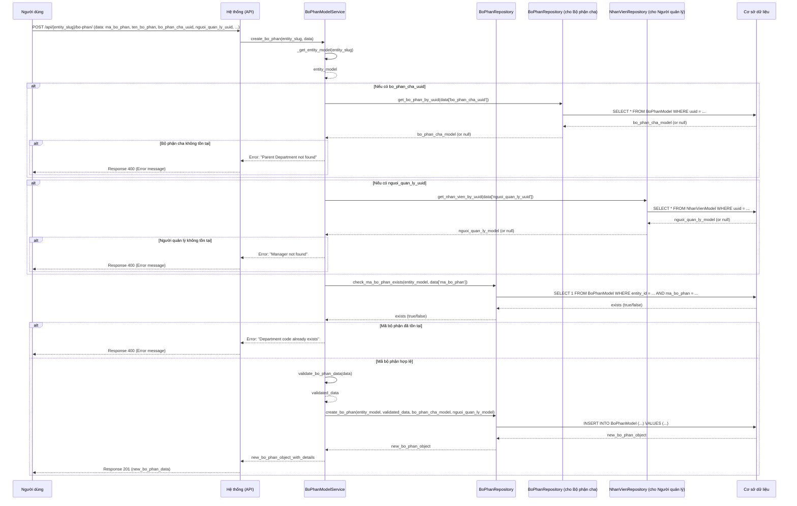

# ORG_001_Organization_Quản Lý Bộ Phận

*Phiên bản: 1.0*
*Người tạo: Cline*
*Ngày tạo: 13/05/2025*
*Cập nhật lần cuối: 13/05/2025*
*Người cập nhật: Cline*

## 1. Tổng Quan Nghiệp Vụ

### 1.1. Mô Tả Nghiệp Vụ
Nghiệp vụ Quản Lý Bộ Phận cho phép người dùng định nghĩa, tổ chức và quản lý cấu trúc các phòng ban, bộ phận, đơn vị trong một công ty hoặc tổ chức. Mỗi bộ phận có thể được xác định bởi các thông tin như mã bộ phận, tên bộ phận, mô tả chi tiết, bộ phận cấp trên trực tiếp (bộ phận cha), và người quản lý trực tiếp. Nghiệp vụ này là nền tảng để xây dựng sơ đồ tổ chức, phân công trách nhiệm, quản lý nhân sự theo đơn vị, và phục vụ cho các quy trình báo cáo, phân quyền trong hệ thống ERP.

### 1.2. Phạm Vi Áp Dụng
Áp dụng cho bộ phận Nhân sự, Ban Giám đốc, và các Quản trị viên hệ thống có quyền thiết lập và duy trì cấu trúc tổ chức của công ty. Thông tin bộ phận được sử dụng rộng rãi trong các phân hệ khác như Kế toán (phân bổ chi phí), Nhân sự (quản lý nhân viên), Quản lý Tài sản (phân bổ tài sản), v.v.

### 1.3. Định Nghĩa Thuật Ngữ
| Thuật ngữ | Định nghĩa |
|-----------|------------|
| Bộ Phận (BoPhanModel) | Một đơn vị, phòng ban, hoặc nhóm chức năng trong cơ cấu tổ chức của công ty. |
| Mã Bộ Phận (ma_bo_phan) | Mã định danh duy nhất cho mỗi bộ phận trong phạm vi một Entity. |
| Tên Bộ Phận (ten_bo_phan) | Tên gọi chính thức của bộ phận. |
| Bộ Phận Cha (bo_phan_cha) | Bộ phận cấp trên trực tiếp quản lý bộ phận hiện tại. Nếu là `null`, bộ phận này là cấp cao nhất (root). |
| Người Quản Lý (nguoi_quan_ly) | Nhân viên được chỉ định làm người quản lý/trưởng của bộ phận. Liên kết tới `NhanVienModel` (ORG_002). |
| Cây Cơ Cấu Tổ Chức | Sơ đồ phân cấp trực quan thể hiện mối quan hệ cha-con giữa các bộ phận. |
| Trạng Thái (status) | Trạng thái hoạt động của bộ phận (ví dụ: 1 - Đang hoạt động, 0 - Ngừng hoạt động). |
| Entity (Đơn vị) | Đơn vị/Công ty sử dụng hệ thống ERP. Mỗi bộ phận được quản lý trong phạm vi một Entity cụ thể. |

### 1.4. Tài Liệu Liên Quan
| STT | Mã tài liệu | Tên tài liệu | Mô tả |
|-----|-------------|--------------|-------|
| 1   | ORG_002 | Quản Lý Nhân Viên | Nhân viên thuộc về các bộ phận; người quản lý bộ phận là một nhân viên. |
| 2   | ORG_003 | Phân Quyền Người Dùng | Quyền truy cập có thể được gán dựa trên vai trò và bộ phận của người dùng. |
| 3   | ACC_001 | Sơ Đồ Tài Khoản | Chi phí có thể được hạch toán hoặc theo dõi theo bộ phận. |
| 4   | AST_001 | Quản Lý Tài Sản Cố Định | Tài sản có thể được phân bổ và quản lý theo bộ phận sử dụng. |

## 2. Quy Trình Nghiệp Vụ

### 2.1. Tổng Quan Quy Trình
Quy trình quản lý bộ phận bao gồm các hoạt động chính: tạo mới một bộ phận, cập nhật thông tin bộ phận hiện có, xem danh sách và chi tiết bộ phận, xem cây cơ cấu tổ chức, và vô hiệu hóa/xóa bộ phận (nếu các điều kiện cho phép).

### 2.2. Sơ Đồ Quy Trình (Business Flow)

```mermaid
flowchart TD
    A[Người dùng yêu cầu thao tác quản lý bộ phận] --> B{Chọn thao tác};
    B -->|Thêm mới| C[Nhập thông tin bộ phận (Mã, Tên, Bộ phận cha, Người quản lý, ...)];
    B -->|Cập nhật| D[Chọn bộ phận & Nhập thông tin mới];
    B -->|Xóa/Vô hiệu hóa| E[Chọn bộ phận & Xác nhận];
    B -->|Xem danh sách| F[Hệ thống hiển thị danh sách bộ phận (có thể lọc, tìm kiếm)];
    B -->|Xem chi tiết| G[Chọn bộ phận & Hệ thống hiển thị chi tiết];
    B -->|Xem cây cơ cấu| H[Hệ thống hiển thị cây cơ cấu tổ chức];
    
    C --> I[Hệ thống kiểm tra dữ liệu (Mã trùng, Bộ phận cha hợp lệ, ...)];
    D --> I;
    
    I -->|Hợp lệ| J[Lưu thông tin vào CSDL];
    I -->|Không hợp lệ| K[Thông báo lỗi];
    
    J --> L[Thông báo thành công];
    
    E --> M[Hệ thống kiểm tra ràng buộc (Còn nhân viên? Còn tài sản phụ thuộc?)];
    M -->|Không có ràng buộc nghiêm trọng / Cho phép vô hiệu hóa| N[Cập nhật trạng thái (vô hiệu hóa) hoặc xóa nếu không có tham chiếu];
    M -->|Có ràng buộc không thể xóa| O[Thông báo lỗi không thể xóa/vô hiệu hóa];
    
    N --> L;
    
    F --> Z[Kết thúc];
    G --> Z;
    H --> Z;
    K --> A;
    L --> A;
    O --> A;
```

### 2.3. Chi Tiết Các Bước Quy Trình

#### 2.3.1. Thêm Mới Bộ Phận
- **Mô tả**: Người dùng tạo một bộ phận mới trong cơ cấu tổ chức.
- **Đầu vào**: Mã bộ phận, tên bộ phận, mô tả (tùy chọn), UUID của bộ phận cha (tùy chọn), UUID của người quản lý (tùy chọn), trạng thái (mặc định là hoạt động).
- **Đầu ra**: Bộ phận mới được tạo trong hệ thống.
- **Người thực hiện**: Quản trị viên hệ thống, Bộ phận Nhân sự.
- **Điều kiện tiên quyết**: Người dùng đã đăng nhập và có quyền. Bộ phận cha (nếu có) phải tồn tại. Người quản lý (nếu có) phải tồn tại. Mã bộ phận phải là duy nhất trong Entity.
- **Xử lý ngoại lệ**:
    - Mã bộ phận trùng: Thông báo lỗi.
    - Bộ phận cha không tồn tại: Thông báo lỗi.
    - Người quản lý không tồn tại: Thông báo lỗi.
    - Không được tạo vòng lặp trong cây (A là cha B, B là cha A).

#### 2.3.2. Cập Nhật Thông Tin Bộ Phận
- **Mô tả**: Người dùng thay đổi thông tin của một bộ phận đã tồn tại.
- **Đầu vào**: UUID của bộ phận cần cập nhật, các thông tin mới (tên, mô tả, bộ phận cha, người quản lý, trạng thái).
- **Đầu ra**: Thông tin bộ phận được cập nhật.
- **Người thực hiện**: Quản trị viên hệ thống, Bộ phận Nhân sự.
- **Điều kiện tiên quyết**: Bộ phận tồn tại. Các điều kiện tương tự như thêm mới nếu các trường liên quan được thay đổi.
- **Xử lý ngoại lệ**: Tương tự như thêm mới. Cẩn thận khi thay đổi bộ phận cha để tránh tạo vòng lặp hoặc phá vỡ cấu trúc.

#### 2.3.3. Xóa/Vô Hiệu Hóa Bộ Phận
- **Mô tả**: Người dùng xóa (logic bằng cách cập nhật trạng thái thành "ngừng hoạt động", hoặc xóa vật lý nếu không có ràng buộc) một bộ phận.
- **Đầu vào**: UUID của bộ phận cần xóa/vô hiệu hóa.
- **Đầu ra**: Bộ phận được đánh dấu ngừng hoạt động hoặc bị xóa.
- **Người thực hiện**: Quản trị viên hệ thống, Bộ phận Nhân sự.
- **Điều kiện tiên quyết**: Bộ phận tồn tại.
- **Xử lý ngoại lệ**:
    - Nếu bộ phận có bộ phận con đang hoạt động: Không cho xóa/vô hiệu hóa (hoặc yêu cầu xử lý các bộ phận con trước).
    - Nếu bộ phận có nhân viên đang thuộc về: Không cho xóa (yêu cầu chuyển nhân viên sang bộ phận khác hoặc xử lý nhân viên trước).
    - Nếu bộ phận đang được tham chiếu bởi các dữ liệu quan trọng khác: Cân nhắc chỉ cho phép vô hiệu hóa.

#### 2.3.4. Xem Danh Sách Bộ Phận
- **Mô tả**: Người dùng xem danh sách các bộ phận, có thể kèm theo tìm kiếm, lọc theo trạng thái, bộ phận cha, và phân trang.
- **Đầu vào**: Entity slug, các tham số lọc và phân trang.
- **Đầu ra**: Danh sách các bộ phận.
- **Người thực hiện**: Mọi người dùng có quyền xem.

#### 2.3.5. Xem Chi Tiết Bộ Phận
- **Mô tả**: Người dùng xem thông tin chi tiết của một bộ phận cụ thể, bao gồm danh sách nhân viên thuộc bộ phận (nếu có quyền).
- **Đầu vào**: UUID của bộ phận.
- **Đầu ra**: Thông tin chi tiết của bộ phận.
- **Người thực hiện**: Mọi người dùng có quyền xem.

#### 2.3.6. Xem Cây Cơ Cấu Tổ Chức
- **Mô tả**: Hiển thị trực quan cấu trúc phân cấp của các bộ phận.
- **Đầu vào**: Entity slug.
- **Đầu ra**: Sơ đồ cây các bộ phận.
- **Người thực hiện**: Mọi người dùng có quyền xem.

### 2.4. Sơ Đồ Tuần Tự (Sequence Diagram) - Thêm Mới Bộ Phận



### 2.5. Luồng Nghiệp Vụ Thay Thế
- **Thay đổi cấu trúc hàng loạt**: Có thể có nhu cầu tái cấu trúc (di chuyển bộ phận, sáp nhập) thông qua một giao diện chuyên biệt hoặc import.
- **Quản lý lịch sử thay đổi người quản lý**: Lưu lại lịch sử ai đã quản lý bộ phận vào thời điểm nào.

## 3. Yêu Cầu Chức Năng

### 3.1. Danh Sách Chức Năng

| STT | Mã chức năng | Tên chức năng | Mô tả | Độ ưu tiên |
|-----|--------------|---------------|-------|------------|
| 1   | ORG_001_F01 | Thêm mới bộ phận | Cho phép tạo một bộ phận mới. | Cao |
| 2   | ORG_001_F02 | Cập nhật bộ phận | Cho phép sửa thông tin của một bộ phận đã có. | Cao |
| 3   | ORG_001_F03 | Xóa/Vô hiệu hóa bộ phận | Cho phép xóa (logic/vật lý) hoặc vô hiệu hóa một bộ phận. | Cao |
| 4   | ORG_001_F04 | Xem danh sách bộ phận | Hiển thị danh sách các bộ phận, hỗ trợ phân trang, tìm kiếm và lọc. | Cao |
| 5   | ORG_001_F05 | Xem chi tiết bộ phận | Hiển thị thông tin chi tiết của một bộ phận. | Cao |
| 6   | ORG_001_F06 | Xem cây cơ cấu tổ chức | Hiển thị cấu trúc phân cấp của các bộ phận. | Cao |
| 7   | ORG_001_F07 | Gán/thay đổi người quản lý | Cho phép gán hoặc thay đổi người quản lý cho bộ phận. | Cao |

### 3.2. Chi Tiết Chức Năng

#### 3.2.1. ORG_001_F01: Thêm mới bộ phận
- **Mô tả**: Chức năng cho phép người dùng tạo mới một bộ phận.
- **Đầu vào**:
    - `entity_slug`: Slug của Entity.
    - `data`: Đối tượng chứa thông tin bộ phận:
        - `ma_bo_phan` (bắt buộc, unique): Mã bộ phận.
        - `ten_bo_phan` (bắt buộc): Tên bộ phận.
        - `mo_ta` (tùy chọn): Mô tả.
        - `bo_phan_cha_uuid` (tùy chọn): UUID của bộ phận cha.
        - `nguoi_quan_ly_uuid` (tùy chọn): UUID của nhân viên quản lý.
        - `status` (tùy chọn, default=1): Trạng thái.
- **Đầu ra**: Đối tượng `BoPhanModel` vừa được tạo.
- **Điều kiện tiên quyết**: `entity_slug` hợp lệ. `ma_bo_phan` chưa tồn tại. `bo_phan_cha_uuid` (nếu có) phải hợp lệ và không tạo vòng lặp. `nguoi_quan_ly_uuid` (nếu có) phải hợp lệ.
- **Luồng xử lý chính**:
  1. Service kiểm tra `EntityModel`.
  2. Service kiểm tra tính duy nhất của `ma_bo_phan`.
  3. Service kiểm tra sự tồn tại và hợp lệ của `BoPhanModel` cha (nếu có).
  4. Service kiểm tra sự tồn tại của `NhanVienModel` quản lý (nếu có).
  5. Service gọi Repository để tạo mới.
- **Giao diện liên quan**: Form thêm mới bộ phận.

#### 3.2.2. ORG_001_F02: Cập nhật bộ phận
- **Mô tả**: Cập nhật thông tin bộ phận.
- **Đầu vào**: `entity_slug`, `uuid` của bộ phận, `data` thông tin cập nhật.
- **Đầu ra**: Đối tượng `BoPhanModel` đã cập nhật.
- **Điều kiện tiên quyết**: Bộ phận tồn tại. Các điều kiện tương tự F01 nếu các trường liên quan được thay đổi.
- **Giao diện liên quan**: Form cập nhật bộ phận.

#### 3.2.3. ORG_001_F03: Xóa/Vô hiệu hóa bộ phận
- **Mô tả**: Xóa hoặc vô hiệu hóa một bộ phận.
- **Đầu vào**: `entity_slug`, `uuid` của bộ phận.
- **Đầu ra**: HTTP 204 No Content (nếu xóa vật lý) hoặc đối tượng bộ phận đã cập nhật trạng thái.
- **Điều kiện tiên quyết**: Bộ phận tồn tại. Kiểm tra các ràng buộc (bộ phận con, nhân viên, tài sản...).
- **Giao diện liên quan**: Nút xóa/vô hiệu hóa.

#### 3.2.4. ORG_001_F04: Xem danh sách bộ phận
- **Mô tả**: Lấy danh sách bộ phận, có phân trang, tìm kiếm, lọc.
- **Đầu vào**: `entity_slug`, `page`, `page_size`, các tham số lọc (ví dụ: `search_term`, `status`, `bo_phan_cha_uuid`).
- **Đầu ra**: Danh sách `BoPhanModel`.
- **Giao diện liên quan**: Trang danh sách bộ phận.

#### 3.2.5. ORG_001_F06: Xem cây cơ cấu tổ chức
- **Mô tả**: Lấy dữ liệu để hiển thị cây cơ cấu tổ chức.
- **Đầu vào**: `entity_slug`.
- **Đầu ra**: Dữ liệu dạng cây (ví dụ: JSON lồng nhau) của các bộ phận.
- **Giao diện liên quan**: Trang hiển thị cây cơ cấu.

## 4. Thiết Kế Kỹ Thuật

### 4.1. Kiến Trúc Hệ Thống
Sử dụng Views/APIs, Services (`BoPhanModelService`), Repositories (`BoPhanRepository`), Models (`BoPhanModel`, `NhanVienModel`, `EntityModel`). Cân nhắc sử dụng thư viện như `django-mptt` để quản lý hiệu quả cấu trúc cây.

### 4.2. API Endpoints

- **Base URL**: `/api/{entity_slug}/bo-phan/`
- **Endpoints**:
    - `GET /`: Lấy danh sách bộ phận. (ORG_001_F04)
        - Query params: `page`, `page_size`, `search`, `status`, `bo_phan_cha_uuid`.
    - `GET /tree/`: Lấy dữ liệu cây cơ cấu tổ chức. (ORG_001_F06)
    - `POST /`: Tạo mới bộ phận. (ORG_001_F01)
    - `GET /{uuid}/`: Lấy chi tiết bộ phận. (ORG_001_F05)
    - `PUT /{uuid}/`: Cập nhật toàn bộ bộ phận. (ORG_001_F02)
    - `PATCH /{uuid}/`: Cập nhật một phần bộ phận. (ORG_001_F02)
    - `DELETE /{uuid}/`: Xóa bộ phận (thường là vô hiệu hóa). (ORG_001_F03)

### 4.3. Service Logic (`BoPhanModelService`)
- Xử lý logic tạo/cập nhật bộ phận, đảm bảo tính toàn vẹn của cấu trúc cây (không có vòng lặp, bộ phận cha hợp lệ).
- Kiểm tra ràng buộc trước khi xóa/vô hiệu hóa.
- Logic lấy dữ liệu cho cây cơ cấu (nếu không dùng `django-mptt` thì cần xây dựng đệ quy hoặc truy vấn phù hợp).

### 4.4. Mô Hình Dữ Liệu

#### 4.4.1. Entity Relationship Diagram (ERD)

```mermaid
erDiagram
    ENTITY ||--|{ BO_PHAN : "quản lý"
    BO_PHAN }o--|| BO_PHAN : "là cha của (parent_of)"
    NHAN_VIEN {
        uuid uuid PK
        string ho_ten
        <em>(các trường khác)</em>
    }
    BO_PHAN }o--|| NHAN_VIEN : "được quản lý bởi (managed_by)"
    BO_PHAN ||--o{ NHAN_VIEN : "bao gồm (contains_employees)"

    ENTITY {
        uuid uuid PK
        string slug
        string name
        <em>(các trường khác)</em>
    }

    BO_PHAN {
        uuid uuid PK
        string ma_bo_phan "Mã bộ phận (unique)"
        string ten_bo_phan "Tên bộ phận"
        text mo_ta "Mô tả"
        integer status "Trạng thái"
        datetime created
        datetime updated
        uuid entity_id FK "Khóa ngoại tới ENTITY"
        uuid bo_phan_cha_id FK "Khóa ngoại tới BO_PHAN (self)"
        uuid nguoi_quan_ly_id FK "Khóa ngoại tới NHAN_VIEN"
        <em>integer lft (django-mptt)</em>
        <em>integer rght (django-mptt)</em>
        <em>integer tree_id (django-mptt)</em>
        <em>integer level (django-mptt)</em>
    }
```
*Lưu ý: Các trường `lft`, `rght`, `tree_id`, `level` là tùy chọn nếu sử dụng `django-mptt`.*

#### 4.4.2. Chi Tiết Bảng Dữ Liệu

##### Bảng: `BoPhanModel` (django_ledger_bophanmodel)
- **Mô tả**: Lưu trữ thông tin các bộ phận trong công ty.
- **Các cột chính**:
    - `uuid` (UUID, Khóa chính).
    - `entity_model` (ForeignKey đến `EntityModel`).
    - `ma_bo_phan` (CharField, max_length=50, unique_together_with=`entity_model`).
    - `ten_bo_phan` (CharField, max_length=255).
    - `mo_ta` (TextField, null=True, blank=True).
    - `bo_phan_cha` (ForeignKey đến `self` trên `BoPhanModel`, on_delete=models.PROTECT, null=True, blank=True, related_name='bo_phan_con').
    - `nguoi_quan_ly` (ForeignKey đến `NhanVienModel` (ORG_002), on_delete=models.SET_NULL, null=True, blank=True).
    - `status` (IntegerField, default=1, choices=((1, 'Đang hoạt động'), (0, 'Ngừng hoạt động'))).
    - `created` (DateTimeField, auto_now_add=True).
    - `updated` (DateTimeField, auto_now=True).
    - *(Nếu dùng django-mptt: `lft`, `rght`, `tree_id`, `level`)*
- **Indexes**:
    - Index trên (`entity_model`, `ma_bo_phan`).
    - Index trên (`entity_model`, `bo_phan_cha`).
    - *(django-mptt sẽ tự tạo các index cần thiết cho các trường của nó)*.

## 5. Kế Hoạch Kiểm Thử

### 5.1. Phạm Vi Kiểm Thử
- CRUD cho Bộ Phận.
- Quản lý cấu trúc cây: gán bộ phận cha, di chuyển bộ phận trong cây.
- Kiểm tra không cho phép tạo vòng lặp trong cây.
- Gán/thay đổi người quản lý.
- Xử lý xóa/vô hiệu hóa bộ phận và các ràng buộc liên quan (nhân viên, bộ phận con).
- Tìm kiếm, lọc, phân trang danh sách bộ phận.
- Hiển thị cây cơ cấu tổ chức.

### 5.2. Kịch Bản Kiểm Thử (Ví dụ)

| STT | Mã kịch bản | Tên kịch bản | Mô tả | Điều kiện tiên quyết | Các bước | Kết quả mong đợi |
|-----|------------|--------------|-------|---------------------|----------|-----------------|
| 1   | ORG_001_TC01 | Thêm mới bộ phận gốc thành công | Tạo bộ phận không có cha. | User đăng nhập, có quyền. Entity "E1" tồn tại. | 1. POST `/api/E1/bo-phan/`. 2. Payload: `{"ma_bo_phan": "GD", "ten_bo_phan": "Ban Giám Đốc"}`. | 1. HTTP 201. 2. Dữ liệu bộ phận được trả về. 3. Bộ phận được lưu vào CSDL, `bo_phan_cha` là null. |
| 2   | ORG_001_TC02 | Thêm mới bộ phận con thành công | Tạo bộ phận có cha là "GD". | Bộ phận "GD" (uuid_gd) tồn tại. | 1. POST `/api/E1/bo-phan/`. 2. Payload: `{"ma_bo_phan": "KT", "ten_bo_phan": "Phòng Kế Toán", "bo_phan_cha_uuid": "uuid_gd"}`. | 1. HTTP 201. 2. Dữ liệu bộ phận được trả về. 3. Bộ phận "KT" có `bo_phan_cha` là "GD". |
| 3   | ORG_001_TC03 | Thêm mới bộ phận với mã trùng | Cố gắng tạo bộ phận có mã "KT" đã tồn tại. | Bộ phận "KT" đã tồn tại. | 1. POST `/api/E1/bo-phan/`. 2. Payload: `{"ma_bo_phan": "KT", "ten_bo_phan": "Phòng Kỹ Thuật"}`. | 1. HTTP 400. 2. Lỗi "Mã bộ phận đã tồn tại". |
| 4   | ORG_001_TC04 | Cập nhật tên bộ phận | Thay đổi tên bộ phận "KT". | Bộ phận "KT" (uuid_kt) tồn tại. | 1. PATCH `/api/E1/bo-phan/uuid_kt/`. 2. Payload: `{"ten_bo_phan": "Phòng Kế Toán Tài Chính"}`. | 1. HTTP 200. 2. Tên bộ phận được cập nhật. |
| 5   | ORG_001_TC05 | Vô hiệu hóa bộ phận có nhân viên | Cố gắng vô hiệu hóa bộ phận "KT" khi còn nhân viên. | Bộ phận "KT" có nhân viên. | 1. DELETE `/api/E1/bo-phan/uuid_kt/` (hoặc PATCH để cập nhật status=0). | 1. HTTP 400 (nếu logic không cho phép) hoặc HTTP 200 với thông báo/cảnh báo. 2. Lỗi "Bộ phận còn nhân viên" hoặc bộ phận được vô hiệu hóa nhưng có cảnh báo. (Tùy theo logic xử lý). |
| 6   | ORG_001_TC06 | Xem cây cơ cấu tổ chức | Kiểm tra hiển thị cây. | Có ít nhất 2 bộ phận cha-con. | 1. GET `/api/E1/bo-phan/tree/`. | 1. HTTP 200. 2. Dữ liệu trả về có cấu trúc cây JSON đúng. |

## 6. Phụ Lục

### 6.1. Danh Sách Tài Liệu Tham Khảo
- Django MPTT documentation (nếu sử dụng): [https://django-mptt.readthedocs.io/](https://django-mptt.readthedocs.io/)
- Mã nguồn Django Ledger: `django_ledger/models/organization.py` (dự kiến, có thể chứa `BoPhanModel`)
- Mã nguồn Django Ledger: `django_ledger/services/organization/department.py` (dự kiến)

### 6.2. Danh Mục Thuật Ngữ
(Đã định nghĩa ở mục 1.3)

### 6.3. Lịch Sử Thay Đổi Tài Liệu

| Phiên bản | Ngày | Người thực hiện | Mô tả thay đổi |
|-----------|------|-----------------|---------------|
| 1.0 | 13/05/2025 | Cline | Tạo mới tài liệu. |
