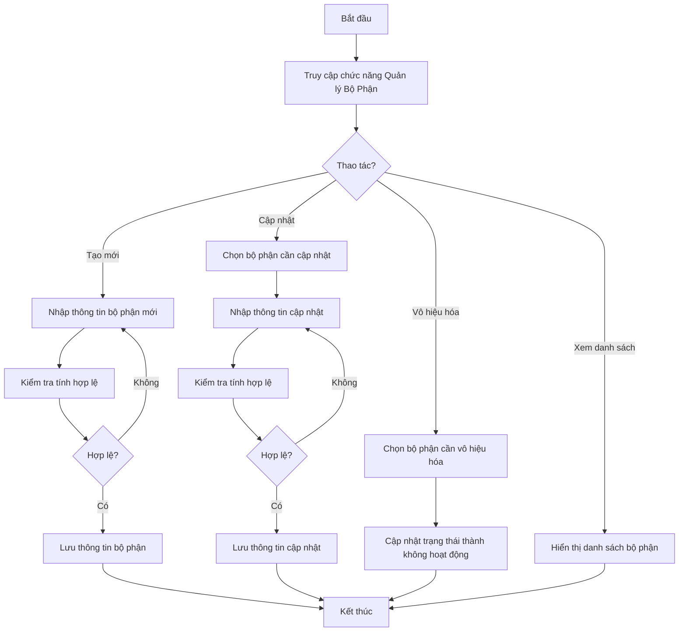
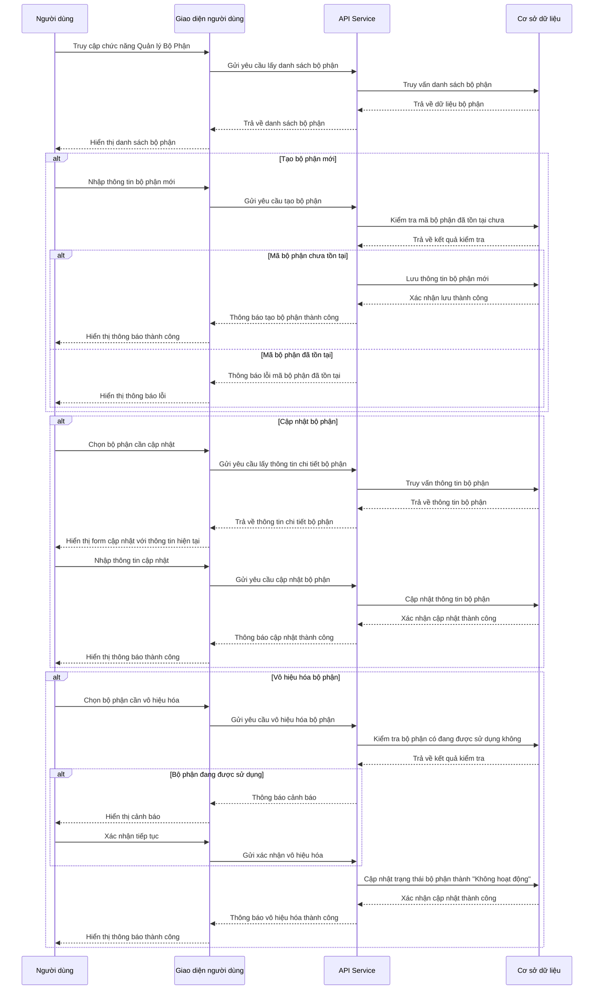

# ORG_001_Quản lý Bộ Phận

*Phiên bản: 1.0*  
*Người tạo: BA Team*  
*Ngày tạo: 25/07/2024*  
*Cập nhật lần cuối: 25/07/2024*  
*Người cập nhật: BA Team*

## 1. Tổng Quan Nghiệp Vụ

### 1.1. Mô Tả Nghiệp Vụ
Quy trình Quản lý Bộ Phận đóng vai trò quan trọng trong việc thiết lập và duy trì cấu trúc tổ chức của doanh nghiệp trong hệ thống ERP. Quy trình này cho phép người dùng tạo, quản lý và phân cấp các bộ phận trong tổ chức, giúp phân bổ nhân sự, quản lý tài sản và phân quyền hiệu quả. Bộ phận là đơn vị cơ bản trong cấu trúc tổ chức, và việc quản lý chúng đúng cách sẽ hỗ trợ các hoạt động báo cáo, kiểm soát chi phí và quản lý hiệu suất trên toàn doanh nghiệp.

### 1.2. Phạm Vi Áp Dụng
Quy trình này áp dụng cho tất cả các bộ phận trong doanh nghiệp và được sử dụng bởi:
- Quản trị viên hệ thống
- Phòng Nhân sự và Tổ chức
- Quản lý cấp cao
- Người quản lý được phân quyền

### 1.3. Định Nghĩa Thuật Ngữ
| Thuật ngữ | Định nghĩa |
|-----------|------------|
| Bộ phận | Đơn vị tổ chức trong doanh nghiệp có chức năng, nhiệm vụ và mục tiêu riêng biệt |
| Mã bộ phận | Mã định danh duy nhất cho mỗi bộ phận trong hệ thống |
| Bộ phận phí | Bộ phận được chỉ định quản lý chi phí liên quan đến một bộ phận sử dụng tài sản hoặc công cụ dụng cụ |
| Trạng thái bộ phận | Chỉ trạng thái hoạt động (1) hoặc không hoạt động (0) của bộ phận |

### 1.4. Tài Liệu Liên Quan
| STT | Mã tài liệu | Tên tài liệu | Mô tả |
|-----|-------------|--------------|-------|
| 1   | ORG_002 | Quản lý Nhân Viên | Quy trình quản lý thông tin nhân viên liên kết với bộ phận |
| 2   | ORG_004 | Quản lý Bộ Phận Sử Dụng Tài Sản | Quy trình quản lý bộ phận sử dụng tài sản |
| 3   | ORG_005 | Quản lý Bộ Phận Sử Dụng CCDC | Quy trình quản lý bộ phận sử dụng công cụ dụng cụ |

## 2. Quy Trình Nghiệp Vụ

### 2.1. Tổng Quan Quy Trình
Quy trình Quản lý Bộ Phận bao gồm việc tạo mới, cập nhật, xem và vô hiệu hóa các bộ phận trong hệ thống. Mỗi bộ phận được định danh bằng mã duy nhất và có thể được gắn với các thông tin bổ sung như tên phụ, ghi chú và trạng thái. Quy trình đảm bảo cấu trúc tổ chức được duy trì chính xác và cập nhật, phục vụ cho các hoạt động quản lý nhân sự, tài sản và phân quyền trong hệ thống.

### 2.2. Sơ Đồ Quy Trình (Business Flow)

### 2.3. Chi Tiết Các Bước Quy Trình

#### 2.3.1. Truy cập chức năng Quản lý Bộ Phận
- **Mô tả**: Người dùng truy cập vào chức năng Quản lý Bộ Phận trong hệ thống
- **Đầu vào**: Tài khoản người dùng đã được cấp quyền quản lý bộ phận
- **Đầu ra**: Giao diện quản lý bộ phận được hiển thị
- **Người thực hiện**: Quản trị viên, Người quản lý được phân quyền
- **Điều kiện tiên quyết**: Người dùng đã đăng nhập vào hệ thống và có quyền truy cập chức năng

#### 2.3.2. Tạo bộ phận mới
- **Mô tả**: Người dùng tạo một bộ phận mới trong hệ thống
- **Đầu vào**: 
  - Mã bộ phận (ma_bp)
  - Tên bộ phận (ten_bp)
  - Tên bộ phận 2 (ten_bp2) - tùy chọn
  - Ghi chú (ghi_chu) - tùy chọn
  - Trạng thái (status) - mặc định là "Hoạt động" (1)
- **Đầu ra**: Bộ phận mới được tạo và lưu vào hệ thống
- **Người thực hiện**: Quản trị viên, Người quản lý được phân quyền
- **Điều kiện tiên quyết**: Người dùng đã truy cập vào chức năng Quản lý Bộ Phận
- **Xử lý ngoại lệ**: 
  - Nếu mã bộ phận đã tồn tại, hệ thống sẽ hiển thị thông báo lỗi
  - Nếu các trường bắt buộc không được nhập, hệ thống sẽ yêu cầu nhập đầy đủ thông tin

#### 2.3.3. Xem danh sách bộ phận
- **Mô tả**: Người dùng xem danh sách tất cả các bộ phận trong hệ thống
- **Đầu vào**: Tiêu chí lọc (nếu có)
- **Đầu ra**: Danh sách bộ phận theo tiêu chí lọc
- **Người thực hiện**: Quản trị viên, Người quản lý được phân quyền
- **Điều kiện tiên quyết**: Người dùng đã truy cập vào chức năng Quản lý Bộ Phận
- **Xử lý ngoại lệ**: Nếu không có bộ phận nào thỏa mãn tiêu chí lọc, hiển thị thông báo "Không có dữ liệu"

#### 2.3.4. Cập nhật thông tin bộ phận
- **Mô tả**: Người dùng cập nhật thông tin của một bộ phận đã tồn tại
- **Đầu vào**: 
  - Bộ phận cần cập nhật
  - Thông tin cập nhật (tên bộ phận, tên bộ phận 2, ghi chú, trạng thái)
- **Đầu ra**: Thông tin bộ phận được cập nhật
- **Người thực hiện**: Quản trị viên, Người quản lý được phân quyền
- **Điều kiện tiên quyết**: Bộ phận cần cập nhật đã tồn tại trong hệ thống
- **Xử lý ngoại lệ**: Nếu thông tin cập nhật không hợp lệ, hiển thị thông báo lỗi tương ứng

#### 2.3.5. Vô hiệu hóa bộ phận
- **Mô tả**: Người dùng vô hiệu hóa một bộ phận (đổi trạng thái thành "Không hoạt động")
- **Đầu vào**: Bộ phận cần vô hiệu hóa
- **Đầu ra**: Trạng thái bộ phận được cập nhật thành "Không hoạt động" (0)
- **Người thực hiện**: Quản trị viên, Người quản lý được phân quyền
- **Điều kiện tiên quyết**: Bộ phận cần vô hiệu hóa đang ở trạng thái "Hoạt động" (1)
- **Xử lý ngoại lệ**: 
  - Nếu bộ phận đang được sử dụng bởi nhân viên hoặc tài sản, hiển thị cảnh báo
  - Người dùng có thể xác nhận tiếp tục hoặc hủy thao tác

### 2.4. Sơ Đồ Tuần Tự (Sequence Diagram)

### 2.5. Luồng Nghiệp Vụ Thay Thế
Một số luồng nghiệp vụ thay thế có thể xảy ra:
1. **Kích hoạt lại bộ phận đã vô hiệu hóa**:
   - Người dùng chọn bộ phận đang ở trạng thái "Không hoạt động"
   - Người dùng cập nhật trạng thái thành "Hoạt động"
   - Hệ thống cập nhật trạng thái và hiển thị thông báo thành công

2. **Sao chép thông tin bộ phận**:
   - Người dùng chọn chức năng sao chép từ một bộ phận hiện có
   - Hệ thống tạo form với thông tin sẵn có, ngoại trừ mã bộ phận
   - Người dùng nhập mã bộ phận mới và có thể điều chỉnh thông tin khác
   - Hệ thống tạo bộ phận mới dựa trên thông tin đã nhập

## 3. Yêu Cầu Chức Năng

### 3.1. Danh Sách Chức Năng

| STT | Mã chức năng | Tên chức năng | Mô tả | Độ ưu tiên |
|-----|--------------|---------------|-------|------------|
| 1   | ORG001-F01 | Xem danh sách bộ phận | Hiển thị danh sách tất cả các bộ phận trong hệ thống | Cao |
| 2   | ORG001-F02 | Tạo bộ phận mới | Tạo một bộ phận mới trong hệ thống | Cao |
| 3   | ORG001-F03 | Xem thông tin chi tiết bộ phận | Xem thông tin chi tiết của một bộ phận | Cao |
| 4   | ORG001-F04 | Cập nhật thông tin bộ phận | Cập nhật thông tin của một bộ phận | Cao |
| 5   | ORG001-F05 | Vô hiệu hóa/Kích hoạt bộ phận | Thay đổi trạng thái hoạt động của bộ phận | Cao |
| 6   | ORG001-F06 | Tìm kiếm và lọc bộ phận | Tìm kiếm bộ phận theo các tiêu chí khác nhau | Trung bình |
| 7   | ORG001-F07 | Xuất danh sách bộ phận | Xuất danh sách bộ phận ra file Excel hoặc PDF | Thấp |

### 3.2. Chi Tiết Chức Năng

#### 3.2.1. ORG001-F01: Xem danh sách bộ phận
- **Mô tả**: Hiển thị danh sách tất cả các bộ phận trong hệ thống với các thông tin cơ bản
- **Đầu vào**: Tiêu chí lọc (nếu có): trạng thái, từ khóa tìm kiếm
- **Đầu ra**: Danh sách bộ phận bao gồm các thông tin: mã bộ phận, tên bộ phận, trạng thái
- **Điều kiện tiên quyết**: Người dùng đã đăng nhập và có quyền xem danh sách bộ phận
- **Luồng xử lý chính**:
  1. Người dùng truy cập chức năng Quản lý Bộ Phận
  2. Hệ thống hiển thị danh sách tất cả các bộ phận
  3. Người dùng có thể áp dụng các bộ lọc để thu hẹp kết quả
  4. Hệ thống hiển thị danh sách bộ phận theo các tiêu chí lọc
- **Luồng xử lý thay thế/ngoại lệ**:
  1. Nếu không có bộ phận nào thỏa mãn tiêu chí lọc, hiển thị thông báo "Không có dữ liệu"
- **Giao diện liên quan**: Màn hình Danh sách bộ phận

#### 3.2.2. ORG001-F02: Tạo bộ phận mới
- **Mô tả**: Cho phép người dùng tạo một bộ phận mới trong hệ thống
- **Đầu vào**: 
  - Mã bộ phận (ma_bp) - bắt buộc
  - Tên bộ phận (ten_bp) - bắt buộc
  - Tên bộ phận 2 (ten_bp2) - tùy chọn
  - Ghi chú (ghi_chu) - tùy chọn
  - Trạng thái (status) - mặc định là "Hoạt động" (1)
- **Đầu ra**: Thông báo tạo bộ phận thành công và hiển thị bộ phận mới trong danh sách
- **Điều kiện tiên quyết**: Người dùng đã đăng nhập và có quyền tạo bộ phận
- **Luồng xử lý chính**:
  1. Người dùng chọn "Tạo mới" từ màn hình Danh sách bộ phận
  2. Hệ thống hiển thị form nhập thông tin bộ phận mới
  3. Người dùng nhập các thông tin cần thiết
  4. Người dùng xác nhận tạo bộ phận
  5. Hệ thống kiểm tra tính hợp lệ của thông tin
  6. Hệ thống lưu thông tin bộ phận mới
  7. Hệ thống hiển thị thông báo tạo bộ phận thành công
- **Luồng xử lý thay thế/ngoại lệ**:
  1. Nếu mã bộ phận đã tồn tại, hiển thị thông báo lỗi
  2. Nếu thiếu thông tin bắt buộc, hiển thị thông báo yêu cầu nhập đầy đủ thông tin
- **Giao diện liên quan**: Form tạo bộ phận mới

#### 3.2.3. ORG001-F03: Xem thông tin chi tiết bộ phận
- **Mô tả**: Hiển thị thông tin chi tiết của một bộ phận
- **Đầu vào**: Mã bộ phận hoặc UUID của bộ phận cần xem
- **Đầu ra**: Thông tin chi tiết của bộ phận
- **Điều kiện tiên quyết**: Bộ phận cần xem đã tồn tại trong hệ thống
- **Luồng xử lý chính**:
  1. Người dùng chọn một bộ phận từ danh sách
  2. Hệ thống hiển thị thông tin chi tiết của bộ phận đó
- **Luồng xử lý thay thế/ngoại lệ**:
  1. Nếu bộ phận không tồn tại, hiển thị thông báo lỗi
- **Giao diện liên quan**: Màn hình chi tiết bộ phận

#### 3.2.4. ORG001-F04: Cập nhật thông tin bộ phận
- **Mô tả**: Cho phép người dùng cập nhật thông tin của một bộ phận đã tồn tại
- **Đầu vào**:
  - Bộ phận cần cập nhật
  - Thông tin cập nhật: tên bộ phận, tên bộ phận 2, ghi chú, trạng thái
- **Đầu ra**: Thông báo cập nhật thành công và hiển thị thông tin đã cập nhật
- **Điều kiện tiên quyết**: Bộ phận cần cập nhật đã tồn tại và người dùng có quyền cập nhật
- **Luồng xử lý chính**:
  1. Người dùng chọn bộ phận cần cập nhật từ danh sách
  2. Hệ thống hiển thị form cập nhật với thông tin hiện tại
  3. Người dùng chỉnh sửa thông tin cần thiết
  4. Người dùng xác nhận cập nhật
  5. Hệ thống kiểm tra tính hợp lệ của thông tin
  6. Hệ thống lưu thông tin cập nhật
  7. Hệ thống hiển thị thông báo cập nhật thành công
- **Luồng xử lý thay thế/ngoại lệ**:
  1. Nếu thông tin cập nhật không hợp lệ, hiển thị thông báo lỗi
- **Giao diện liên quan**: Form cập nhật bộ phận

#### 3.2.5. ORG001-F05: Vô hiệu hóa/Kích hoạt bộ phận
- **Mô tả**: Cho phép người dùng thay đổi trạng thái hoạt động của bộ phận
- **Đầu vào**: Bộ phận cần thay đổi trạng thái
- **Đầu ra**: Thông báo thay đổi trạng thái thành công và cập nhật trạng thái trong danh sách
- **Điều kiện tiên quyết**: Bộ phận cần thay đổi trạng thái đã tồn tại và người dùng có quyền thay đổi
- **Luồng xử lý chính**:
  1. Người dùng chọn bộ phận cần thay đổi trạng thái từ danh sách
  2. Người dùng chọn thao tác "Vô hiệu hóa" hoặc "Kích hoạt"
  3. Hệ thống hiển thị thông báo xác nhận
  4. Người dùng xác nhận thay đổi
  5. Hệ thống cập nhật trạng thái bộ phận
  6. Hệ thống hiển thị thông báo thay đổi trạng thái thành công
- **Luồng xử lý thay thế/ngoại lệ**:
  1. Nếu bộ phận đang được sử dụng và người dùng chọn vô hiệu hóa, hiển thị cảnh báo
  2. Người dùng có thể xác nhận tiếp tục hoặc hủy thao tác
- **Giao diện liên quan**: Màn hình danh sách bộ phận, Hộp thoại xác nhận thay đổi trạng thái

#### 3.2.6. ORG001-F06: Tìm kiếm và lọc bộ phận
- **Mô tả**: Cho phép người dùng tìm kiếm và lọc bộ phận theo các tiêu chí khác nhau
- **Đầu vào**: Các tiêu chí tìm kiếm và lọc: mã bộ phận, tên bộ phận, trạng thái
- **Đầu ra**: Danh sách bộ phận thỏa mãn các tiêu chí tìm kiếm và lọc
- **Điều kiện tiên quyết**: Người dùng đã đăng nhập và có quyền xem danh sách bộ phận
- **Luồng xử lý chính**:
  1. Người dùng nhập các tiêu chí tìm kiếm và lọc
  2. Người dùng chọn "Tìm kiếm"
  3. Hệ thống thực hiện tìm kiếm và lọc theo các tiêu chí
  4. Hệ thống hiển thị danh sách kết quả
- **Luồng xử lý thay thế/ngoại lệ**:
  1. Nếu không có bộ phận nào thỏa mãn tiêu chí, hiển thị thông báo "Không có dữ liệu"
- **Giao diện liên quan**: Màn hình danh sách bộ phận với các công cụ tìm kiếm và lọc

#### 3.2.7. ORG001-F07: Xuất danh sách bộ phận
- **Mô tả**: Cho phép người dùng xuất danh sách bộ phận ra file Excel hoặc PDF
- **Đầu vào**: Danh sách bộ phận đang hiển thị, Định dạng xuất (Excel hoặc PDF)
- **Đầu ra**: File Excel hoặc PDF chứa danh sách bộ phận
- **Điều kiện tiên quyết**: Có ít nhất một bộ phận trong danh sách và người dùng có quyền xuất file
- **Luồng xử lý chính**:
  1. Người dùng chọn "Xuất file" từ màn hình Danh sách bộ phận
  2. Hệ thống hiển thị hộp thoại cho phép chọn định dạng xuất
  3. Người dùng chọn định dạng và xác nhận
  4. Hệ thống tạo file theo định dạng đã chọn
  5. Hệ thống tải file xuống cho người dùng
- **Luồng xử lý thay thế/ngoại lệ**:
  1. Nếu danh sách trống, hiển thị thông báo không có dữ liệu để xuất
- **Giao diện liên quan**: Màn hình danh sách bộ phận, Hộp thoại chọn định dạng xuất