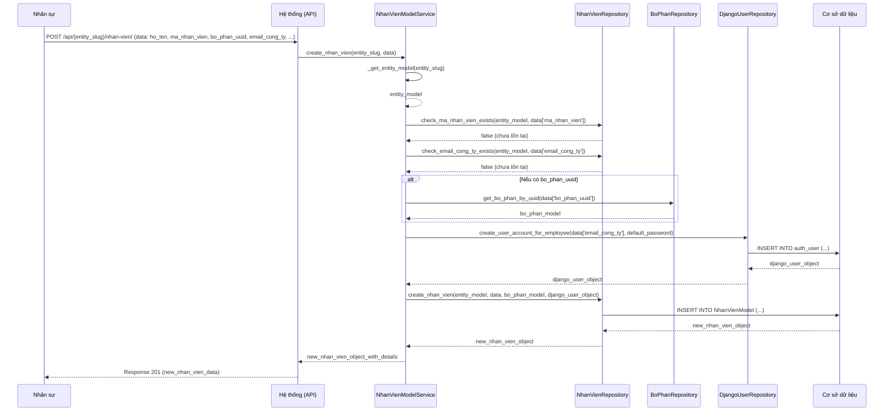

# ORG_002_Organization_Quản Lý Nhân Viên

*Phiên bản: 1.0*
*Người tạo: Cline*
*Ngày tạo: 13/05/2025*
*Cập nhật lần cuối: 13/05/2025*
*Người cập nhật: Cline*

## 1. Tổng Quan Nghiệp Vụ

### 1.1. Mô Tả Nghiệp Vụ
Nghiệp vụ Quản Lý Nhân Viên cho phép quản lý toàn diện thông tin hồ sơ của tất cả nhân viên trong công ty. Điều này bao gồm thông tin cá nhân (họ tên, ngày sinh, giới tính, số CMND/CCCD, địa chỉ liên lạc, số điện thoại, email), thông tin công việc (mã nhân viên, chức danh, bộ phận công tác, ngày bắt đầu làm việc, loại hợp đồng lao động, trạng thái làm việc hiện tại), thông tin liên hệ khẩn cấp, trình độ học vấn, kinh nghiệm làm việc trước đây, thông tin tài khoản ngân hàng để trả lương, và các tài liệu đính kèm liên quan (sơ yếu lý lịch, bằng cấp). Nghiệp vụ này là trung tâm của quản lý nguồn nhân lực, hỗ trợ các quy trình tuyển dụng, tính lương, đánh giá, đào tạo và phát triển nhân viên.

### 1.2. Phạm Vi Áp Dụng
Áp dụng chủ yếu cho Bộ phận Nhân sự (HR) trong việc tạo mới, cập nhật, và quản lý hồ sơ nhân viên. Các Trưởng bộ phận có thể có quyền xem thông tin nhân viên thuộc bộ phận mình quản lý. Bản thân nhân viên có thể được cấp quyền xem (và trong một số trường hợp, tự cập nhật) một phần thông tin cá nhân của mình thông qua cổng thông tin nhân viên (employee self-service portal).

### 1.3. Định Nghĩa Thuật Ngữ
| Thuật ngữ | Định nghĩa |
|-----------|------------|
| Nhân Viên (NhanVienModel) | Một cá nhân được tuyển dụng và làm việc cho công ty, có hồ sơ được quản lý trong hệ thống. |
| Mã Nhân Viên (ma_nhan_vien) | Mã định danh duy nhất cho mỗi nhân viên trong công ty. |
| Hồ Sơ Nhân Viên | Tập hợp đầy đủ các thông tin liên quan đến một nhân viên, bao gồm thông tin cá nhân, công việc, hợp đồng, v.v. |
| Chức Danh (ChucDanhModel/chuc_danh) | Vị trí công việc hoặc vai trò chính thức của nhân viên trong công ty (ví dụ: Kế toán viên, Trưởng phòng Marketing). |
| Bộ Phận (BoPhanModel) | Đơn vị/phòng ban mà nhân viên trực thuộc. Liên kết tới `BoPhanModel` (ORG_001). |
| Hợp Đồng Lao Động (HopDongLaoDongModel) | Văn bản pháp lý ghi nhận thỏa thuận giữa nhân viên và công ty về điều kiện làm việc, quyền lợi và nghĩa vụ. |
| Trạng Thái Làm Việc (trang_thai_lam_viec) | Tình trạng hiện tại của nhân viên trong mối quan hệ lao động với công ty (ví dụ: Đang thử việc, Chính thức, Đã nghỉ việc, Nghỉ thai sản). |
| Tài Khoản Người Dùng (User Account) | Tài khoản đăng nhập vào hệ thống ERP, thường được liên kết với một hồ sơ nhân viên. |
| Entity (Đơn vị) | Đơn vị/Công ty sử dụng hệ thống ERP. Mỗi nhân viên được quản lý trong phạm vi một Entity cụ thể. |

### 1.4. Tài Liệu Liên Quan
| STT | Mã tài liệu | Tên tài liệu | Mô tả |
|-----|-------------|--------------|-------|
| 1   | ORG_001 | Quản Lý Bộ Phận | Nhân viên được gán vào một bộ phận cụ thể. |
| 2   | ORG_003 | Phân Quyền Người Dùng | Tài khoản người dùng của nhân viên được dùng để xác thực và phân quyền. |
| 3   | ACC_PAY | Quản Lý Lương (Chưa có) | Thông tin nhân viên là đầu vào cho quy trình tính lương, BHXH. |
| 4   | SYS_001 | Quản Lý Người Dùng Hệ Thống | Hồ sơ nhân viên thường liên kết với một tài khoản người dùng Django. |
| 5   | GEO_006 | Quản Lý Địa Chỉ | Lưu trữ thông tin địa chỉ thường trú, tạm trú của nhân viên. |
| 6   | ORG_XXX | Quản Lý Chức Danh (Chưa có) | Danh mục các chức danh trong công ty. |

## 2. Quy Trình Nghiệp Vụ

### 2.1. Tổng Quan Quy Trình
Quy trình quản lý nhân viên bao gồm các giai đoạn từ khi một người được tuyển dụng (tạo hồ sơ mới), cập nhật thông tin trong suốt quá trình làm việc (thay đổi thông tin cá nhân, chức vụ, bộ phận, hợp đồng), quản lý trạng thái làm việc (thử việc, chính thức, nghỉ phép, nghỉ việc), cho đến khi nhân viên chấm dứt hợp đồng lao động (offboarding).

### 2.2. Sơ Đồ Quy Trình (Business Flow) - Thêm mới và Cập nhật Nhân viên

```mermaid
flowchart TD
    A[Yêu cầu quản lý hồ sơ nhân viên] --> B{Chọn thao tác};
    B -->|Thêm mới (Onboarding)| C[Nhập thông tin nhân viên mới (cá nhân, công việc, hợp đồng...)];
    B -->|Cập nhật| D[Chọn nhân viên & Nhập thông tin cần thay đổi];
    B -->|Thay đổi trạng thái| E[Chọn nhân viên & Chọn trạng thái mới (nghỉ việc, chuyển chính thức...)];
    B -->|Xem danh sách| F[Hệ thống hiển thị danh sách nhân viên];
    B -->|Xem chi tiết| G[Chọn nhân viên & Hệ thống hiển thị hồ sơ chi tiết];
    
    C --> H[Hệ thống kiểm tra dữ liệu (Mã NV trùng, thông tin bắt buộc, liên kết User...)];
    D --> H;
    E --> H;
    
    H -->|Hợp lệ| I[Lưu thông tin vào CSDL (NhanVienModel, HopDongLaoDongModel...)];
    H -->|Không hợp lệ| J[Thông báo lỗi];
    
    I --> K[Thông báo thành công];
    
    F --> Z[Kết thúc];
    G --> Z;
    J --> A;
    K --> A;
```

### 2.3. Chi Tiết Các Bước Quy Trình

#### 2.3.1. Thêm Mới Hồ Sơ Nhân Viên (Onboarding)
- **Mô tả**: Tạo hồ sơ cho một nhân viên mới được tuyển dụng.
- **Đầu vào**: Thông tin cá nhân (họ tên, ngày sinh, giới tính, CMND/CCCD, địa chỉ, SĐT, email), thông tin công việc (mã nhân viên, chức danh, bộ phận, ngày vào làm, loại hợp đồng ban đầu, trạng thái ban đầu - thường là "Thử việc" hoặc "Chính thức").
- **Đầu ra**: Hồ sơ nhân viên mới được tạo trong hệ thống. Có thể tự động tạo tài khoản người dùng liên kết.
- **Người thực hiện**: Bộ phận Nhân sự.
- **Điều kiện tiên quyết**: Người dùng có quyền. Mã nhân viên phải là duy nhất. Bộ phận, chức danh (nếu là danh mục) phải tồn tại.
- **Xử lý ngoại lệ**:
    - Mã nhân viên trùng: Thông báo lỗi.
    - Thiếu thông tin bắt buộc: Thông báo lỗi.
    - Email công ty (nếu có) đã tồn tại: Thông báo lỗi.

#### 2.3.2. Cập Nhật Thông Tin Nhân Viên
- **Mô tả**: Thay đổi, bổ sung thông tin trong hồ sơ nhân viên hiện có (ví dụ: thay đổi địa chỉ, số điện thoại, tình trạng hôn nhân, bằng cấp mới, thông tin tài khoản ngân hàng).
- **Đầu vào**: UUID của nhân viên, các thông tin cần cập nhật.
- **Đầu ra**: Hồ sơ nhân viên được cập nhật.
- **Người thực hiện**: Bộ phận Nhân sự, hoặc nhân viên (đối với một số trường thông tin được phép).
- **Điều kiện tiên quyết**: Nhân viên tồn tại.

#### 2.3.3. Quản Lý Hợp Đồng Lao Động
- **Mô tả**: Tạo mới, cập nhật, gia hạn, hoặc chấm dứt hợp đồng lao động cho nhân viên. Mỗi nhân viên có thể có nhiều hợp đồng theo dòng thời gian.
- **Đầu vào**: Thông tin hợp đồng (số hợp đồng, loại, ngày ký, ngày hiệu lực, ngày hết hạn, lương, phụ cấp, file đính kèm).
- **Đầu ra**: Bản ghi hợp đồng được tạo/cập nhật, liên kết với nhân viên.
- **Người thực hiện**: Bộ phận Nhân sự.

#### 2.3.4. Thay Đổi Trạng Thái Làm Việc
- **Mô tả**: Cập nhật trạng thái làm việc của nhân viên (ví dụ: từ "Thử việc" sang "Chính thức", "Đang làm việc" sang "Nghỉ việc", "Nghỉ thai sản").
- **Đầu vào**: UUID của nhân viên, trạng thái mới, ngày hiệu lực của trạng thái mới, lý do (nếu cần).
- **Đầu ra**: Trạng thái làm việc của nhân viên được cập nhật. Nếu nghỉ việc, cần cập nhật `ngay_nghi_viec`.
- **Người thực hiện**: Bộ phận Nhân sự.

#### 2.3.5. Chấm Dứt Hợp Đồng/Nghỉ Việc (Offboarding)
- **Mô tả**: Quy trình xử lý khi nhân viên nghỉ việc, bao gồm cập nhật trạng thái, ngày nghỉ việc, lý do nghỉ việc, và các thủ tục liên quan (thu hồi tài sản, khóa tài khoản...).
- **Đầu vào**: UUID của nhân viên, ngày nghỉ việc, lý do.
- **Đầu ra**: Hồ sơ nhân viên được cập nhật trạng thái "Đã nghỉ việc". Tài khoản người dùng có thể bị vô hiệu hóa.
- **Người thực hiện**: Bộ phận Nhân sự.

### 2.4. Sơ Đồ Tuần Tự (Sequence Diagram) - Thêm Mới Nhân Viên



## 3. Yêu Cầu Chức Năng

### 3.1. Danh Sách Chức Năng

| STT | Mã chức năng | Tên chức năng | Mô tả | Độ ưu tiên |
|-----|--------------|---------------|-------|------------|
| 1   | ORG_002_F01 | Thêm mới hồ sơ nhân viên | Cho phép tạo hồ sơ đầy đủ cho nhân viên mới. | Cao |
| 2   | ORG_002_F02 | Cập nhật thông tin nhân viên | Cho phép sửa đổi, bổ sung thông tin trong hồ sơ nhân viên. | Cao |
| 3   | ORG_002_F03 | Quản lý hợp đồng lao động | Tạo, xem, cập nhật, quản lý lịch sử hợp đồng của nhân viên. | Cao |
| 4   | ORG_002_F04 | Thay đổi trạng thái làm việc | Cập nhật trạng thái của nhân viên (thử việc, chính thức, nghỉ việc,...). | Cao |
| 5   | ORG_002_F05 | Xem danh sách nhân viên | Hiển thị danh sách nhân viên, hỗ trợ tìm kiếm, lọc, phân trang. | Cao |
| 6   | ORG_002_F06 | Xem chi tiết hồ sơ nhân viên | Hiển thị đầy đủ thông tin của một nhân viên. | Cao |
| 7   | ORG_002_F07 | Liên kết/Quản lý tài khoản người dùng | Liên kết hồ sơ nhân viên với tài khoản đăng nhập hệ thống. | Cao |
| 8   | ORG_002_F08 | Quản lý quá trình công tác | Ghi nhận lịch sử thay đổi bộ phận, chức danh của nhân viên. | Trung bình |
| 9   | ORG_002_F09 | Export danh sách nhân viên | Xuất danh sách nhân viên ra file (Excel, CSV). | Trung bình |

### 3.2. Chi Tiết Chức Năng

#### 3.2.1. ORG_002_F01: Thêm mới hồ sơ nhân viên
- **Mô tả**: Tạo hồ sơ nhân viên mới với các thông tin cơ bản và thông tin công việc.
- **Đầu vào**:
    - `entity_slug`: Slug của Entity.
    - `data`: Đối tượng chứa thông tin nhân viên:
        - `ma_nhan_vien` (bắt buộc, unique)
        - `ho_dem`, `ten` (bắt buộc)
        - `ngay_sinh`, `gioi_tinh`
        - `so_cmnd_cccd` (unique nếu có)
        - `dia_chi_thuong_tru_data` (object để tạo DiaChiModel)
        - `so_dien_thoai_ca_nhan`, `email_ca_nhan`
        - `email_cong_ty` (bắt buộc, unique, dùng để tạo User account)
        - `bo_phan_uuid` (FK đến BoPhanModel)
        - `chuc_danh` (string hoặc FK đến ChucDanhModel)
        - `ngay_vao_lam` (bắt buộc)
        - `trang_thai_lam_viec` (bắt buộc)
        - (Các thông tin hợp đồng ban đầu nếu có)
- **Đầu ra**: Đối tượng `NhanVienModel` vừa được tạo, và tài khoản `User` liên kết.
- **Điều kiện tiên quyết**: `entity_slug` hợp lệ. Các thông tin unique (mã NV, email công ty, CMND) chưa tồn tại. `bo_phan_uuid` hợp lệ.
- **Luồng xử lý chính**:
  1. Service kiểm tra `EntityModel`.
  2. Validate dữ liệu đầu vào (tính duy nhất, sự tồn tại của FK).
  3. Tạo tài khoản `User` Django từ `email_cong_ty`.
  4. Tạo `DiaChiModel` nếu có `dia_chi_thuong_tru_data`.
  5. Tạo `NhanVienModel` và liên kết với `User`, `BoPhanModel`, `DiaChiModel`.
  6. (Tùy chọn) Tạo `HopDongLaoDongModel` ban đầu.
- **Giao diện liên quan**: Form thêm mới nhân viên.

#### 3.2.2. ORG_002_F02: Cập nhật thông tin nhân viên
- **Mô tả**: Cập nhật các trường thông tin trong hồ sơ nhân viên.
- **Đầu vào**: `entity_slug`, `uuid` của nhân viên, `data` chứa các trường cần cập nhật.
- **Đầu ra**: Đối tượng `NhanVienModel` đã cập nhật.
- **Giao diện liên quan**: Form chỉnh sửa hồ sơ nhân viên.

#### 3.2.3. ORG_002_F03: Quản lý hợp đồng lao động
- **Mô tả**: Thêm mới, xem, sửa, xóa (logic) các hợp đồng lao động của nhân viên.
- **API Endpoints riêng**: `/api/{entity_slug}/nhan-vien/{nhan_vien_uuid}/hop-dong/`
- **Đầu vào (Thêm mới HĐ)**: `nhan_vien_uuid`, thông tin hợp đồng (số HĐ, loại, ngày ký, ngày hiệu lực, lương...).
- **Đầu ra**: Danh sách/chi tiết `HopDongLaoDongModel`.
- **Giao diện liên quan**: Tab/mục quản lý hợp đồng trong chi tiết hồ sơ nhân viên.

## 4. Thiết Kế Kỹ Thuật

### 4.1. Kiến Trúc Hệ Thống
Sử dụng Views/APIs, Services (`NhanVienModelService`, `HopDongLaoDongModelService`), Repositories, Models.

### 4.2. API Endpoints

- **Base URL Nhân Viên**: `/api/{entity_slug}/nhan-vien/`
    - `GET /`: Lấy danh sách nhân viên. (ORG_002_F05)
    - `POST /`: Tạo mới nhân viên. (ORG_002_F01)
    - `GET /{uuid}/`: Lấy chi tiết nhân viên. (ORG_002_F06)
    - `PUT /{uuid}/`: Cập nhật toàn bộ nhân viên. (ORG_002_F02)
    - `PATCH /{uuid}/`: Cập nhật một phần nhân viên. (ORG_002_F02)
    - `DELETE /{uuid}/`: (Thường là thay đổi trạng thái sang "Nghỉ việc" thay vì xóa vật lý). (ORG_002_F04)
- **Base URL Hợp Đồng**: `/api/{entity_slug}/nhan-vien/{nhan_vien_uuid}/hop-dong/`
    - `GET /`: Lấy danh sách hợp đồng của nhân viên.
    - `POST /`: Tạo mới hợp đồng cho nhân viên.
    - `GET /{hop_dong_uuid}/`: Lấy chi tiết hợp đồng.
    - `PUT /{hop_dong_uuid}/`: Cập nhật hợp đồng.
    - `DELETE /{hop_dong_uuid}/`: Xóa (logic) hợp đồng.

### 4.3. Service Logic (`NhanVienModelService`)
- Xử lý logic tạo nhân viên, bao gồm tạo tài khoản Django User liên kết.
- Validate dữ liệu, kiểm tra tính duy nhất của mã nhân viên, email công ty, CMND/CCCD.
- Xử lý cập nhật trạng thái làm việc, ngày nghỉ việc.
- Quản lý liên kết với các model khác (Bộ phận, Địa chỉ).

### 4.4. Mô Hình Dữ Liệu

#### 4.4.1. Entity Relationship Diagram (ERD)

```mermaid
erDiagram
    ENTITY ||--|{ NHAN_VIEN : "quản lý"
    DJANGO_USER ||--o| NHAN_VIEN : "là tài khoản của"
    BO_PHAN ||--o{ NHAN_VIEN : "có nhân viên"
    DIA_CHI ||--o{ NHAN_VIEN : "có địa chỉ thường trú"
    DIA_CHI ||--o{ NHAN_VIEN : "có địa chỉ tạm trú"
    NHAN_VIEN ||--|{ HOP_DONG_LAO_DONG : "có"
    CHUC_DANH ||--o{ NHAN_VIEN : "giữ chức danh"

    ENTITY { uuid uuid PK; string slug; string name }
    DJANGO_USER { id int PK; string username }
    BO_PHAN { uuid uuid PK; string ten_bo_phan }
    DIA_CHI { uuid uuid PK; string dia_chi_day_du }
    CHUC_DANH { uuid uuid PK; string ten_chuc_danh }

    NHAN_VIEN {
        uuid uuid PK
        string ma_nhan_vien "Mã nhân viên (unique)"
        string ho_dem
        string ten
        date ngay_sinh
        string gioi_tinh
        string so_cmnd_cccd "(unique)"
        string email_cong_ty "(unique)"
        date ngay_vao_lam
        date ngay_nghi_viec
        string trang_thai_lam_viec
        uuid entity_id FK
        integer user_account_id FK "(Django User)"
        uuid bo_phan_id FK
        uuid chuc_danh_id FK
        uuid dia_chi_thuong_tru_id FK
        uuid dia_chi_tam_tru_id FK
    }

    HOP_DONG_LAO_DONG {
        uuid uuid PK
        string so_hop_dong
        string loai_hop_dong
        date ngay_ky
        date ngay_hieu_luc
        date ngay_het_han
        decimal luong_co_ban
        uuid nhan_vien_id FK
        uuid entity_id FK
    }
```

#### 4.4.2. Chi Tiết Bảng Dữ Liệu

##### Bảng: `NhanVienModel` (django_ledger_nhanvienmodel)
- **Mô tả**: Lưu trữ thông tin chi tiết về nhân viên.
- **Các cột chính**:
    - `uuid` (UUID, PK).
    - `entity_model` (ForeignKey đến `EntityModel`).
    - `user_account` (OneToOneField đến `User` của Django, on_delete=models.SET_NULL, null=True, blank=True).
    - `ma_nhan_vien` (CharField, max_length=50, unique_together_with=`entity_model`).
    - `ho_dem` (CharField, max_length=100).
    - `ten` (CharField, max_length=50).
    - `ngay_sinh` (DateField, null=True, blank=True).
    - `gioi_tinh` (CharField, max_length=10, choices=(('nam', 'Nam'), ('nu', 'Nữ'), ('khac', 'Khác')), null=True, blank=True).
    - `so_cmnd_cccd` (CharField, max_length=20, null=True, blank=True, unique=True).
    - `ngay_cap_cmnd_cccd` (DateField, null=True, blank=True).
    - `noi_cap_cmnd_cccd` (CharField, max_length=255, null=True, blank=True).
    - `dia_chi_thuong_tru` (ForeignKey đến `DiaChiModel`, related_name='nhan_vien_thuong_tru', on_delete=models.SET_NULL, null=True, blank=True).
    - `dia_chi_tam_tru` (ForeignKey đến `DiaChiModel`, related_name='nhan_vien_tam_tru', on_delete=models.SET_NULL, null=True, blank=True).
    - `so_dien_thoai_ca_nhan` (CharField, max_length=20, null=True, blank=True).
    - `email_ca_nhan` (EmailField, null=True, blank=True).
    - `email_cong_ty` (EmailField, unique=True).
    - `bo_phan` (ForeignKey đến `BoPhanModel`, on_delete=models.PROTECT, null=True, blank=True).
    - `chuc_danh` (ForeignKey đến `ChucDanhModel` hoặc CharField, null=True, blank=True).
    - `ngay_vao_lam` (DateField).
    - `ngay_nghi_viec` (DateField, null=True, blank=True).
    - `trang_thai_lam_viec` (CharField, max_length=50, default='dang_lam_viec', choices=(...)).
    - `anh_dai_dien_url` (URLField, null=True, blank=True).
    - `ghi_chu` (TextField, null=True, blank=True).
    - `created`, `updated`.

##### Bảng: `HopDongLaoDongModel` (django_ledger_hopdonglaodongmodel)
- **Mô tả**: Lưu trữ thông tin các hợp đồng lao động của nhân viên.
- **Các cột chính**:
    - `uuid` (UUID, PK).
    - `entity_model` (ForeignKey đến `EntityModel`).
    - `nhan_vien` (ForeignKey đến `NhanVienModel`, on_delete=models.CASCADE).
    - `so_hop_dong` (CharField, max_length=100).
    - `loai_hop_dong` (CharField, max_length=100, choices=(...)).
    - `ngay_ky` (DateField).
    - `ngay_hieu_luc` (DateField).
    - `ngay_het_han` (DateField, null=True, blank=True).
    - `luong_co_ban` (DecimalField).
    - `phu_cap` (DecimalField, default=0).
    - `file_dinh_kem_url` (URLField, null=True, blank=True).
    - `status` (CharField, default='hieu_luc').
    - `created`, `updated`.

## 5. Kế Hoạch Kiểm Thử

### 5.1. Phạm Vi Kiểm Thử
- CRUD hồ sơ nhân viên.
- CRUD hợp đồng lao động.
- Liên kết nhân viên với tài khoản người dùng Django.
- Thay đổi trạng thái làm việc, xử lý nghỉ việc.
- Gán nhân viên vào bộ phận, chức danh.
- Tìm kiếm, lọc, phân trang danh sách nhân viên.
- Validation dữ liệu (unique fields, required fields).

### 5.2. Kịch Bản Kiểm Thử (Ví dụ)

| STT | Mã kịch bản | Tên kịch bản | Mô tả | Điều kiện tiên quyết | Các bước | Kết quả mong đợi |
|-----|------------|--------------|-------|---------------------|----------|-----------------|
| 1   | ORG_002_TC01 | Thêm mới nhân viên thành công | Tạo hồ sơ nhân viên với đầy đủ thông tin hợp lệ. | User HR đăng nhập, có quyền. Entity "E1", Bộ phận "BP1" tồn tại. | 1. POST `/api/E1/nhan-vien/`. 2. Payload: `{"ma_nhan_vien": "NV001", "ho_dem": "Nguyễn Văn", "ten": "An", "email_cong_ty": "an.nv@company.com", "ngay_vao_lam": "2024-01-01", "bo_phan_uuid": "uuid_bp1", ...}`. | 1. HTTP 201. 2. Dữ liệu nhân viên được trả về. 3. Nhân viên được lưu vào CSDL. 4. Tài khoản User Django được tạo. |
| 2   | ORG_002_TC02 | Thêm mới nhân viên với mã trùng | Cố gắng tạo nhân viên với `ma_nhan_vien` đã tồn tại. | Nhân viên với `ma_nhan_vien` "NV001" đã tồn tại. | 1. POST `/api/E1/nhan-vien/`. 2. Payload: `{"ma_nhan_vien": "NV001", ...}`. | 1. HTTP 400. 2. Lỗi "Mã nhân viên đã tồn tại". |
| 3   | ORG_002_TC03 | Cập nhật địa chỉ nhân viên | Thay đổi địa chỉ thường trú của nhân viên "NV001". | Nhân viên "NV001" (uuid_nv001) tồn tại. | 1. PATCH `/api/E1/nhan-vien/uuid_nv001/`. 2. Payload: `{"dia_chi_thuong_tru_data": {"so_nha_duong_pho": "123 Đường Mới", "xa_phuong_uuid": "uuid_xp_moi"}}`. | 1. HTTP 200. 2. Địa chỉ thường trú của nhân viên được cập nhật. |
| 4   | ORG_002_TC04 | Thêm hợp đồng lao động cho nhân viên | Tạo hợp đồng mới cho "NV001". | Nhân viên "NV001" tồn tại. | 1. POST `/api/E1/nhan-vien/uuid_nv001/hop-dong/`. 2. Payload: `{"so_hop_dong": "HD001", "loai_hop_dong": "Xác định thời hạn", ...}`. | 1. HTTP 201. 2. Hợp đồng được tạo và liên kết với NV001. |
| 5   | ORG_002_TC05 | Nhân viên nghỉ việc | Cập nhật trạng thái nghỉ việc cho "NV001". | Nhân viên "NV001" tồn tại. | 1. PATCH `/api/E1/nhan-vien/uuid_nv001/`. 2. Payload: `{"trang_thai_lam_viec": "da_nghi_viec", "ngay_nghi_viec": "2025-12-31"}`. | 1. HTTP 200. 2. Trạng thái và ngày nghỉ việc được cập nhật. Tài khoản User có thể bị vô hiệu hóa. |

## 6. Phụ Lục

### 6.1. Danh Sách Tài Liệu Tham Khảo
- Luật Lao động Việt Nam (liên quan đến hợp đồng, thông tin nhân viên).
- Mã nguồn Django Ledger: `django_ledger/models/organization.py` (dự kiến, có thể chứa `NhanVienModel`, `HopDongLaoDongModel`)
- Mã nguồn Django Ledger: `django_ledger/services/organization/employee.py` (dự kiến)

### 6.2. Danh Mục Thuật Ngữ
(Đã định nghĩa ở mục 1.3)

### 6.3. Lịch Sử Thay Đổi Tài Liệu

| Phiên bản | Ngày | Người thực hiện | Mô tả thay đổi |
|-----------|------|-----------------|---------------|
| 1.0 | 13/05/2025 | Cline | Tạo mới tài liệu. |
