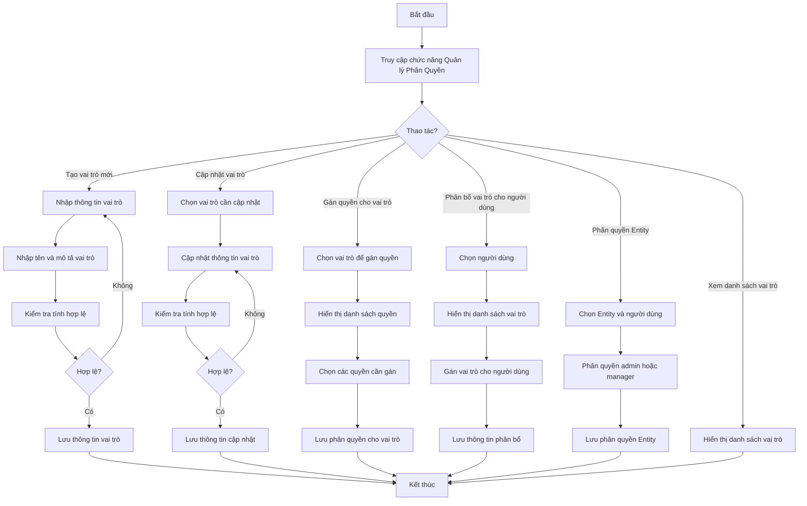
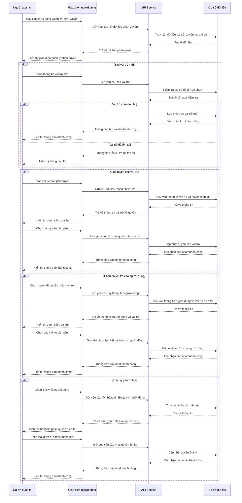
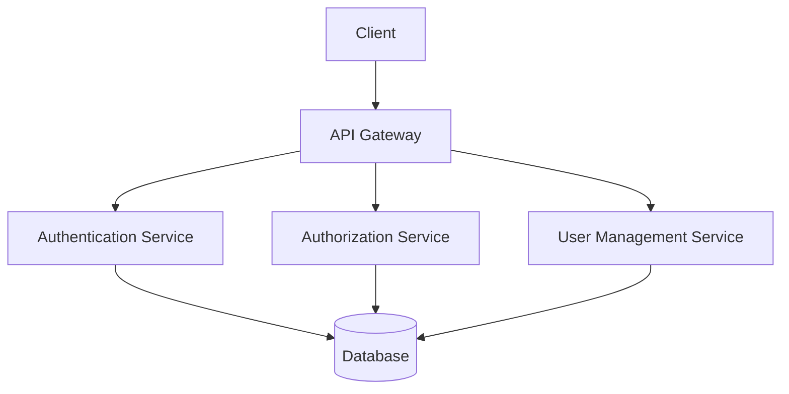

# ORG_003_Phân Quyền Người Dùng

*Phiên bản: 1.0*  
*Người tạo: BA Team*  
*Ngày tạo: 25/07/2024*  
*Cập nhật lần cuối: 25/07/2024*  
*Người cập nhật: BA Team*

## 1. Tổng Quan Nghiệp Vụ

### 1.1. Mô Tả Nghiệp Vụ
Quy trình Phân Quyền Người Dùng là một phần quan trọng trong phân hệ Quản lý Tổ Chức, đảm bảo an toàn thông tin và bảo mật dữ liệu trong hệ thống ERP. Quy trình này cho phép quản trị viên thiết lập và quản lý quyền truy cập của người dùng đối với các chức năng, dữ liệu và tài nguyên trong hệ thống. Hệ thống phân quyền được thiết kế dựa trên nguyên tắc phân quyền tối thiểu, chỉ cấp quyền truy cập cần thiết cho người dùng để thực hiện nhiệm vụ của họ. Việc phân quyền phù hợp giúp bảo vệ dữ liệu nhạy cảm, phòng tránh truy cập trái phép và đảm bảo tuân thủ các quy định về bảo mật và kiểm toán.

### 1.2. Phạm Vi Áp Dụng
Quy trình này áp dụng cho tất cả người dùng trong hệ thống và được quản lý bởi:
- Quản trị viên hệ thống
- Quản lý cấp cao được ủy quyền
- Người phụ trách an ninh thông tin

### 1.3. Định Nghĩa Thuật Ngữ
| Thuật ngữ | Định nghĩa |
|-----------|------------|
| Người dùng | Cá nhân có tài khoản truy cập vào hệ thống ERP |
| Quyền | Khả năng thực hiện một hành động cụ thể trong hệ thống |
| Vai trò | Tập hợp các quyền được gán cho một nhóm người dùng có chức năng tương tự |
| Quản trị viên | Người dùng có toàn quyền quản lý hệ thống |
| Entity | Một đơn vị tổ chức trong hệ thống ERP, thường là một công ty hoặc pháp nhân |
| Manager | Người dùng được phân quyền quản lý một Entity cụ thể |

### 1.4. Tài Liệu Liên Quan
| STT | Mã tài liệu | Tên tài liệu | Mô tả |
|-----|-------------|--------------|-------|
| 1   | ORG_001 | Quản lý Bộ Phận | Quy trình quản lý bộ phận trong tổ chức |
| 2   | ORG_002 | Quản lý Nhân Viên | Quy trình quản lý thông tin nhân viên |
| 3   | SYS_001 | Quản lý Người Dùng | Quy trình quản lý tài khoản người dùng trong hệ thống |

## 2. Quy Trình Nghiệp Vụ

### 2.1. Tổng Quan Quy Trình
Quy trình Phân Quyền Người Dùng bao gồm việc tạo và quản lý vai trò, gán quyền cho vai trò, và phân bổ vai trò cho người dùng. Hệ thống phân quyền được thiết kế theo mô hình phân cấp, trong đó các Entity được quản lý bởi admin và managers. Mỗi người dùng có thể có quyền khác nhau trên các Entity khác nhau. Quy trình đảm bảo mỗi người dùng chỉ có thể truy cập vào các chức năng và dữ liệu phù hợp với vai trò và trách nhiệm của họ trong tổ chức.

### 2.2. Sơ Đồ Quy Trình (Business Flow)

### 2.3. Chi Tiết Các Bước Quy Trình

#### 2.3.1. Truy cập chức năng Quản lý Phân Quyền
- **Mô tả**: Người dùng truy cập vào chức năng Quản lý Phân Quyền trong hệ thống
- **Đầu vào**: Tài khoản quản trị viên hoặc người dùng có quyền quản lý phân quyền
- **Đầu ra**: Giao diện quản lý phân quyền được hiển thị
- **Người thực hiện**: Quản trị viên, Người quản lý được ủy quyền
- **Điều kiện tiên quyết**: Người dùng đã đăng nhập và có quyền truy cập chức năng

#### 2.3.2. Tạo vai trò mới
- **Mô tả**: Người quản trị tạo một vai trò mới trong hệ thống
- **Đầu vào**: 
  - Tên vai trò
  - Mô tả vai trò
- **Đầu ra**: Vai trò mới được tạo trong hệ thống
- **Người thực hiện**: Quản trị viên, Người quản lý được ủy quyền
- **Điều kiện tiên quyết**: Người dùng đã truy cập vào chức năng Quản lý Phân Quyền
- **Xử lý ngoại lệ**: 
  - Nếu tên vai trò đã tồn tại, hệ thống sẽ hiển thị thông báo lỗi
  - Nếu các trường bắt buộc không được nhập, hệ thống sẽ yêu cầu nhập đầy đủ thông tin

#### 2.3.3. Gán quyền cho vai trò
- **Mô tả**: Người quản trị gán các quyền cụ thể cho một vai trò
- **Đầu vào**: 
  - Vai trò cần phân quyền
  - Danh sách quyền cần gán
- **Đầu ra**: Vai trò được cập nhật với các quyền mới
- **Người thực hiện**: Quản trị viên, Người quản lý được ủy quyền
- **Điều kiện tiên quyết**: Vai trò đã tồn tại trong hệ thống
- **Xử lý ngoại lệ**: Nếu cấu hình quyền không hợp lệ, hệ thống hiển thị thông báo lỗi

#### 2.3.4. Phân bổ vai trò cho người dùng
- **Mô tả**: Người quản trị gán vai trò cho người dùng
- **Đầu vào**: 
  - Người dùng cần phân vai trò
  - Danh sách vai trò cần gán
- **Đầu ra**: Người dùng được cập nhật với các vai trò mới
- **Người thực hiện**: Quản trị viên, Người quản lý được ủy quyền
- **Điều kiện tiên quyết**: Người dùng và vai trò đã tồn tại trong hệ thống
- **Xử lý ngoại lệ**: Nếu cấu hình vai trò không hợp lệ, hệ thống hiển thị thông báo lỗi

#### 2.3.5. Phân quyền Entity
- **Mô tả**: Phân quyền admin hoặc manager cho người dùng trên một Entity cụ thể
- **Đầu vào**: 
  - Entity cần phân quyền
  - Người dùng được phân quyền
  - Loại quyền (admin hoặc manager)
- **Đầu ra**: Người dùng được cập nhật quyền trên Entity
- **Người thực hiện**: Quản trị viên, Admin của Entity
- **Điều kiện tiên quyết**: Người dùng và Entity đã tồn tại trong hệ thống
- **Xử lý ngoại lệ**: 
  - Nếu người dùng đã có quyền trên Entity, hệ thống hiển thị thông báo xác nhận
  - Người quản trị có thể xác nhận ghi đè hoặc hủy thao tác

### 2.4. Sơ Đồ Tuần Tự (Sequence Diagram)

### 2.5. Luồng Nghiệp Vụ Thay Thế
Một số luồng nghiệp vụ thay thế có thể xảy ra:
1. **Thu hồi quyền**:
   - Người quản trị chọn vai trò cần thu hồi quyền
   - Người quản trị bỏ chọn các quyền cần thu hồi
   - Hệ thống cập nhật vai trò và hiển thị thông báo thành công

2. **Thu hồi vai trò**:
   - Người quản trị chọn người dùng cần thu hồi vai trò
   - Người quản trị bỏ chọn các vai trò cần thu hồi
   - Hệ thống cập nhật thông tin người dùng và hiển thị thông báo thành công

3. **Vô hiệu hóa vai trò**:
   - Người quản trị chọn vai trò cần vô hiệu hóa
   - Người quản trị cập nhật trạng thái vai trò thành "Không hoạt động"
   - Hệ thống cập nhật trạng thái và hiển thị thông báo thành công

## 3. Yêu Cầu Chức Năng

### 3.1. Danh Sách Chức Năng

| STT | Mã chức năng | Tên chức năng | Mô tả | Độ ưu tiên |
|-----|--------------|---------------|-------|------------|
| 1   | ORG003-F01 | Quản lý vai trò | Tạo, cập nhật, xem và vô hiệu hóa vai trò | Cao |
| 2   | ORG003-F02 | Phân quyền cho vai trò | Gán và thu hồi quyền cho vai trò | Cao |
| 3   | ORG003-F03 | Phân bổ vai trò cho người dùng | Gán và thu hồi vai trò cho người dùng | Cao |
| 4   | ORG003-F04 | Phân quyền Entity | Phân quyền admin hoặc manager trên Entity | Cao |
| 5   | ORG003-F05 | Xem lịch sử phân quyền | Xem lịch sử thay đổi quyền của người dùng | Trung bình |
| 6   | ORG003-F06 | Quản lý template phân quyền | Tạo và áp dụng template phân quyền | Thấp |

### 3.2. Chi Tiết Chức Năng

#### 3.2.1. ORG003-F01: Quản lý vai trò
- **Mô tả**: Cho phép tạo, cập nhật, xem và vô hiệu hóa các vai trò trong hệ thống
- **Đầu vào**: 
  - Tên vai trò
  - Mô tả vai trò
  - Trạng thái (hoạt động/không hoạt động)
- **Đầu ra**: Thông báo thao tác thành công và cập nhật danh sách vai trò
- **Điều kiện tiên quyết**: Người dùng đã đăng nhập và có quyền quản lý vai trò
- **Luồng xử lý chính**:
  1. Người dùng truy cập chức năng Quản lý vai trò
  2. Người dùng chọn thao tác (tạo mới, cập nhật, xem chi tiết hoặc vô hiệu hóa)
  3. Hệ thống hiển thị form tương ứng
  4. Người dùng nhập thông tin cần thiết
  5. Hệ thống kiểm tra tính hợp lệ của dữ liệu
  6. Hệ thống lưu thay đổi và hiển thị thông báo thành công
- **Luồng xử lý thay thế/ngoại lệ**:
  1. Nếu tên vai trò đã tồn tại khi tạo mới, hiển thị thông báo lỗi
  2. Nếu vai trò đang được sử dụng và người dùng muốn vô hiệu hóa, hiển thị cảnh báo
- **Giao diện liên quan**: Màn hình Quản lý vai trò

#### 3.2.2. ORG003-F02: Phân quyền cho vai trò
- **Mô tả**: Cho phép gán và thu hồi quyền cho vai trò
- **Đầu vào**: 
  - Vai trò cần phân quyền
  - Danh sách quyền cần gán hoặc thu hồi
- **Đầu ra**: Thông báo thao tác thành công và cập nhật quyền của vai trò
- **Điều kiện tiên quyết**: Vai trò đã tồn tại và người dùng có quyền phân quyền
- **Luồng xử lý chính**:
  1. Người dùng chọn vai trò cần phân quyền
  2. Hệ thống hiển thị danh sách quyền hiện tại của vai trò
  3. Người dùng chọn hoặc bỏ chọn các quyền
  4. Người dùng xác nhận thay đổi
  5. Hệ thống lưu thay đổi và hiển thị thông báo thành công
- **Luồng xử lý thay thế/ngoại lệ**:
  1. Nếu cấu hình quyền không hợp lệ, hiển thị thông báo lỗi
- **Giao diện liên quan**: Màn hình Phân quyền vai trò

#### 3.2.3. ORG003-F03: Phân bổ vai trò cho người dùng
- **Mô tả**: Cho phép gán và thu hồi vai trò cho người dùng
- **Đầu vào**: 
  - Người dùng cần phân vai trò
  - Danh sách vai trò cần gán hoặc thu hồi
- **Đầu ra**: Thông báo thao tác thành công và cập nhật vai trò của người dùng
- **Điều kiện tiên quyết**: Người dùng đã tồn tại và người thực hiện có quyền phân bổ vai trò
- **Luồng xử lý chính**:
  1. Người quản trị chọn người dùng cần phân vai trò
  2. Hệ thống hiển thị danh sách vai trò hiện tại của người dùng
  3. Người quản trị chọn hoặc bỏ chọn các vai trò
  4. Người quản trị xác nhận thay đổi
  5. Hệ thống lưu thay đổi và hiển thị thông báo thành công
- **Luồng xử lý thay thế/ngoại lệ**:
  1. Nếu cấu hình vai trò không hợp lệ, hiển thị thông báo lỗi
- **Giao diện liên quan**: Màn hình Phân bổ vai trò

#### 3.2.4. ORG003-F04: Phân quyền Entity
- **Mô tả**: Cho phép phân quyền admin hoặc manager trên Entity cho người dùng
- **Đầu vào**: 
  - Entity cần phân quyền
  - Người dùng được phân quyền
  - Loại quyền (admin hoặc manager)
- **Đầu ra**: Thông báo thao tác thành công và cập nhật quyền Entity của người dùng
- **Điều kiện tiên quyết**: Entity và người dùng đã tồn tại, người thực hiện là admin của Entity hoặc super admin
- **Luồng xử lý chính**:
  1. Người quản trị chọn Entity cần phân quyền
  2. Người quản trị chọn người dùng cần phân quyền
  3. Người quản trị chọn loại quyền (admin hoặc manager)
  4. Người quản trị xác nhận thay đổi
  5. Hệ thống lưu thay đổi và hiển thị thông báo thành công
- **Luồng xử lý thay thế/ngoại lệ**:
  1. Nếu người dùng đã có quyền trên Entity, hiển thị thông báo xác nhận ghi đè
  2. Người quản trị xác nhận tiếp tục hoặc hủy thao tác
- **Giao diện liên quan**: Màn hình Phân quyền Entity

#### 3.2.5. ORG003-F05: Xem lịch sử phân quyền
- **Mô tả**: Cho phép xem lịch sử thay đổi quyền của người dùng
- **Đầu vào**: Người dùng cần xem lịch sử, khoảng thời gian (tùy chọn)
- **Đầu ra**: Danh sách các thay đổi quyền của người dùng
- **Điều kiện tiên quyết**: Người dùng đã tồn tại và người thực hiện có quyền xem lịch sử phân quyền
- **Luồng xử lý chính**:
  1. Người quản trị chọn người dùng cần xem lịch sử
  2. Người quản trị chọn khoảng thời gian (tùy chọn)
  3. Hệ thống hiển thị danh sách các thay đổi quyền của người dùng
- **Luồng xử lý thay thế/ngoại lệ**:
  1. Nếu không có dữ liệu lịch sử, hiển thị thông báo "Không có dữ liệu"
- **Giao diện liên quan**: Màn hình Lịch sử phân quyền

#### 3.2.6. ORG003-F06: Quản lý template phân quyền
- **Mô tả**: Cho phép tạo và áp dụng template phân quyền
- **Đầu vào**: 
  - Tên template
  - Mô tả template
  - Danh sách vai trò và quyền trong template
- **Đầu ra**: Thông báo thao tác thành công và cập nhật danh sách template
- **Điều kiện tiên quyết**: Người dùng có quyền quản lý template phân quyền
- **Luồng xử lý chính**:
  1. Người quản trị truy cập chức năng Quản lý template phân quyền
  2. Người quản trị chọn thao tác (tạo mới, cập nhật, xem chi tiết hoặc xóa)
  3. Hệ thống hiển thị form tương ứng
  4. Người quản trị nhập thông tin cần thiết
  5. Hệ thống kiểm tra tính hợp lệ của dữ liệu
  6. Hệ thống lưu thay đổi và hiển thị thông báo thành công
- **Luồng xử lý thay thế/ngoại lệ**:
  1. Nếu tên template đã tồn tại khi tạo mới, hiển thị thông báo lỗi
  2. Nếu template đang được sử dụng và người dùng muốn xóa, hiển thị cảnh báo
- **Giao diện liên quan**: Màn hình Quản lý template phân quyền

## 4. Thiết Kế Kỹ Thuật

### 4.1. Kiến Trúc Hệ Thống

### 4.2. API Endpoints

#### 4.2.1. Quản lý vai trò
- **Mô tả**: API để quản lý vai trò
- **URL**: 
  - `GET /api/roles` - Lấy danh sách vai trò
  - `POST /api/roles` - Tạo vai trò mới
  - `GET /api/roles/{uuid}` - Lấy thông tin chi tiết vai trò
  - `PUT /api/roles/{uuid}` - Cập nhật vai trò
  - `DELETE /api/roles/{uuid}` - Xóa vai trò

#### 4.2.2. Phân quyền cho vai trò
- **Mô tả**: API để phân quyền cho vai trò
- **URL**: 
  - `GET /api/roles/{uuid}/permissions` - Lấy danh sách quyền của vai trò
  - `POST /api/roles/{uuid}/permissions` - Gán quyền cho vai trò
  - `DELETE /api/roles/{uuid}/permissions/{permission_id}` - Thu hồi quyền từ vai trò

#### 4.2.3. Phân bổ vai trò cho người dùng
- **Mô