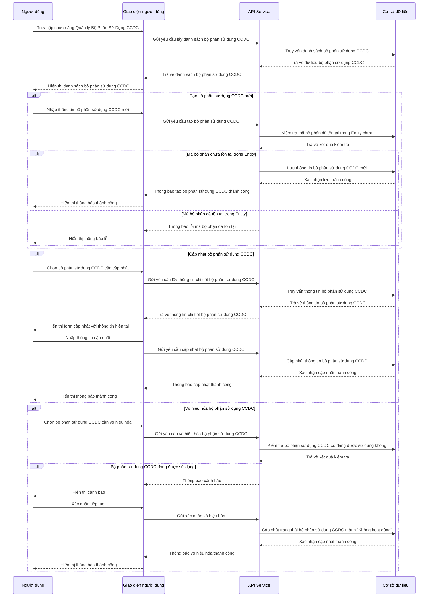

# ORG_005_Quản lý Bộ Phận Sử Dụng CCDC

*Phiên bản: 1.0*  
*Người tạo: BA Team*  
*Ngày tạo: 25/07/2024*  
*Cập nhật lần cuối: 25/07/2024*  
*Người cập nhật: BA Team*

## 1. Tổng Quan Nghiệp Vụ

### 1.1. Mô Tả Nghiệp Vụ
Quy trình Quản lý Bộ Phận Sử Dụng CCDC (BoPhanSuDungCCDCModel) là một phần quan trọng trong phân hệ Quản lý Tổ Chức, cho phép doanh nghiệp quản lý và phân bổ công cụ dụng cụ (CCDC) đến các bộ phận sử dụng. Quy trình này giúp theo dõi việc sử dụng công cụ dụng cụ theo bộ phận, phục vụ cho việc phân bổ chi phí, tính khấu hao và quản lý hiệu quả sử dụng CCDC trong doanh nghiệp. Mỗi bộ phận sử dụng CCDC được liên kết với một bộ phận phí (nếu có) để phục vụ cho việc phân bổ chi phí liên quan đến CCDC. Việc quản lý bộ phận sử dụng CCDC hiệu quả giúp tối ưu hóa việc sử dụng công cụ dụng cụ và kiểm soát chi phí trong doanh nghiệp.

### 1.2. Phạm Vi Áp Dụng
Quy trình này áp dụng cho việc quản lý các bộ phận sử dụng công cụ dụng cụ trong doanh nghiệp và được sử dụng bởi:
- Phòng Kế toán
- Phòng Quản lý tài sản và công cụ dụng cụ
- Quản trị viên hệ thống
- Quản lý các bộ phận có sử dụng công cụ dụng cụ

### 1.3. Định Nghĩa Thuật Ngữ
| Thuật ngữ | Định nghĩa |
|-----------|------------|
| Bộ phận sử dụng CCDC | Đơn vị trong tổ chức được phân bổ và sử dụng công cụ dụng cụ |
| CCDC | Công cụ dụng cụ, là những tài sản có giá trị nhỏ hoặc thời gian sử dụng ngắn hơn tài sản cố định |
| Mã bộ phận | Mã định danh duy nhất cho mỗi bộ phận sử dụng CCDC |
| Bộ phận phí | Bộ phận quản lý và chịu trách nhiệm về chi phí liên quan đến CCDC |
| Trạng thái | Chỉ trạng thái hoạt động (1) hoặc không hoạt động (0) của bộ phận sử dụng CCDC |
| Entity | Đơn vị tổ chức trong hệ thống ERP, thường là một công ty hoặc pháp nhân |

### 1.4. Tài Liệu Liên Quan
| STT | Mã tài liệu | Tên tài liệu | Mô tả |
|-----|-------------|--------------|-------|
| 1   | ORG_001 | Quản lý Bộ Phận | Quy trình quản lý bộ phận trong tổ chức |
| 2   | AST_002 | Quản lý Công Cụ Dụng Cụ | Quy trình quản lý công cụ dụng cụ |
| 3   | AST_004 | Quản lý Loại Tài Sản Công Cụ | Quy trình phân loại và quản lý loại tài sản công cụ |

## 2. Quy Trình Nghiệp Vụ

### 2.1. Tổng Quan Quy Trình
Quy trình Quản lý Bộ Phận Sử Dụng CCDC bao gồm việc tạo mới, cập nhật, xem và vô hiệu hóa các bộ phận sử dụng công cụ dụng cụ trong hệ thống. Mỗi bộ phận sử dụng CCDC thuộc về một Entity cụ thể và có thể được liên kết với một bộ phận phí. Quy trình đảm bảo thông tin về các bộ phận sử dụng CCDC được duy trì chính xác và cập nhật, phục vụ cho việc phân bổ, theo dõi và quản lý công cụ dụng cụ trong doanh nghiệp.

### 2.2. Sơ Đồ Quy Trình (Business Flow)

```mermaid
flowchart TD
    A[Bắt đầu] --> B[Truy cập chức năng Quản lý Bộ Phận Sử Dụng CCDC]
    B --> C{Thao tác?}
    C -->|Tạo mới| D[Nhập thông tin bộ phận sử dụng CCDC mới]
    C -->|Xem danh sách| E[Hiển thị danh sách bộ phận sử dụng CCDC]
    C -->|Cập nhật| F[Chọn bộ phận sử dụng CCDC cần cập nhật]
    C -->|Vô hiệu hóa| G[Chọn bộ phận sử dụng CCDC cần vô hiệu hóa]
    
    D --> H[Nhập mã và tên bộ phận]
    H --> I[Chọn Entity]
    I --> J[Chọn bộ phận phí (nếu có)]
    J --> K[Nhập thông tin bổ sung]
    K --> L[Kiểm tra tính hợp lệ]
    L --> M{Hợp lệ?}
    M -->|Có| N[Lưu thông tin bộ phận sử dụng CCDC]
    M -->|Không| D
    
    F --> O[Cập nhật thông tin cần thiết]
    O --> P[Kiểm tra tính hợp lệ]
    P --> Q{Hợp lệ?}
    Q -->|Có| R[Lưu thông tin cập nhật]
    Q -->|Không| O
    
    G --> S[Cập nhật trạng thái thành không hoạt động]
    
    N --> T[Kết thúc]
    R --> T
    S --> T
    E --> T
```

### 2.3. Chi Tiết Các Bước Quy Trình

#### 2.3.1. Truy cập chức năng Quản lý Bộ Phận Sử Dụng CCDC
- **Mô tả**: Người dùng truy cập vào chức năng Quản lý Bộ Phận Sử Dụng CCDC trong hệ thống
- **Đầu vào**: Tài khoản người dùng đã được cấp quyền quản lý bộ phận sử dụng CCDC
- **Đầu ra**: Giao diện quản lý bộ phận sử dụng CCDC được hiển thị
- **Người thực hiện**: Quản trị viên, Người quản lý tài sản, Kế toán
- **Điều kiện tiên quyết**: Người dùng đã đăng nhập và có quyền truy cập chức năng

#### 2.3.2. Tạo bộ phận sử dụng CCDC mới
- **Mô tả**: Người dùng tạo một bộ phận sử dụng CCDC mới trong hệ thống
- **Đầu vào**: 
  - Entity (entity_model)
  - Mã bộ phận (ma_bp)
  - Tên bộ phận (ten_bp)
  - Tên bộ phận 2 (ten_bp2) - tùy chọn
  - Bộ phận phí (ma_bp_phi) - tùy chọn
  - Ghi chú (ghi_chu) - tùy chọn
  - Trạng thái (status) - mặc định là "Hoạt động" (1)
- **Đầu ra**: Bộ phận sử dụng CCDC mới được tạo và lưu vào hệ thống
- **Người thực hiện**: Quản trị viên, Người quản lý tài sản, Kế toán
- **Điều kiện tiên quyết**: Người dùng đã truy cập vào chức năng Quản lý Bộ Phận Sử Dụng CCDC
- **Xử lý ngoại lệ**: 
  - Nếu mã bộ phận đã tồn tại trong Entity, hệ thống sẽ hiển thị thông báo lỗi
  - Nếu các trường bắt buộc không được nhập, hệ thống sẽ yêu cầu nhập đầy đủ thông tin

#### 2.3.3. Xem danh sách bộ phận sử dụng CCDC
- **Mô tả**: Người dùng xem danh sách tất cả các bộ phận sử dụng CCDC trong hệ thống
- **Đầu vào**: Entity, Tiêu chí lọc (nếu có)
- **Đầu ra**: Danh sách bộ phận sử dụng CCDC theo tiêu chí lọc
- **Người thực hiện**: Quản trị viên, Người quản lý tài sản, Kế toán
- **Điều kiện tiên quyết**: Người dùng đã truy cập vào chức năng Quản lý Bộ Phận Sử Dụng CCDC
- **Xử lý ngoại lệ**: Nếu không có bộ phận sử dụng CCDC nào thỏa mãn tiêu chí lọc, hiển thị thông báo "Không có dữ liệu"

#### 2.3.4. Cập nhật thông tin bộ phận sử dụng CCDC
- **Mô tả**: Người dùng cập nhật thông tin của một bộ phận sử dụng CCDC đã tồn tại
- **Đầu vào**: 
  - Bộ phận sử dụng CCDC cần cập nhật
  - Thông tin cập nhật (tên bộ phận, tên bộ phận 2, bộ phận phí, ghi chú, trạng thái)
- **Đầu ra**: Thông tin bộ phận sử dụng CCDC được cập nhật
- **Người thực hiện**: Quản trị viên, Người quản lý tài sản, Kế toán
- **Điều kiện tiên quyết**: Bộ phận sử dụng CCDC cần cập nhật đã tồn tại trong hệ thống
- **Xử lý ngoại lệ**: Nếu thông tin cập nhật không hợp lệ, hiển thị thông báo lỗi tương ứng

#### 2.3.5. Vô hiệu hóa bộ phận sử dụng CCDC
- **Mô tả**: Người dùng vô hiệu hóa một bộ phận sử dụng CCDC (đổi trạng thái thành "Không hoạt động")
- **Đầu vào**: Bộ phận sử dụng CCDC cần vô hiệu hóa
- **Đầu ra**: Trạng thái bộ phận sử dụng CCDC được cập nhật thành "Không hoạt động" (0)
- **Người thực hiện**: Quản trị viên, Người quản lý tài sản, Kế toán
- **Điều kiện tiên quyết**: Bộ phận sử dụng CCDC cần vô hiệu hóa đang ở trạng thái "Hoạt động" (1)
- **Xử lý ngoại lệ**: 
  - Nếu bộ phận sử dụng CCDC đang được sử dụng bởi công cụ dụng cụ, hiển thị cảnh báo
  - Người dùng có thể xác nhận tiếp tục hoặc hủy thao tác

### 2.4. Sơ Đồ Tuần Tự (Sequence Diagram)



### 2.5. Luồng Nghiệp Vụ Thay Thế
Một số luồng nghiệp vụ thay thế có thể xảy ra:
1. **Kích hoạt lại bộ phận sử dụng CCDC đã vô hiệu hóa**:
   - Người dùng chọn bộ phận sử dụng CCDC đang ở trạng thái "Không hoạt động"
   - Người dùng cập nhật trạng thái thành "Hoạt động"
   - Hệ thống cập nhật trạng thái và hiển thị thông báo thành công

2. **Thay đổi bộ phận phí của bộ phận sử dụng CCDC**:
   - Người dùng chọn bộ phận sử dụng CCDC cần thay đổi bộ phận phí
   - Người dùng cập nhật thông tin bộ phận phí mới
   - Hệ thống cập nhật thông tin và hiển thị thông báo thành công

3. **Sao chép thông tin bộ phận sử dụng CCDC**:
   - Người dùng chọn chức năng sao chép từ một bộ phận sử dụng CCDC hiện có
   - Hệ thống tạo form với thông tin sẵn có, ngoại trừ mã bộ phận
   - Người dùng nhập mã bộ phận mới và có thể điều chỉnh thông tin khác
   - Hệ thống tạo bộ phận sử dụng CCDC mới dựa trên thông tin đã nhập

## 3. Yêu Cầu Chức Năng

### 3.1. Danh Sách Chức Năng

| STT | Mã chức năng | Tên chức năng | Mô tả | Độ ưu tiên |
|-----|--------------|---------------|-------|------------|
| 1   | ORG005-F01 | Xem danh sách bộ phận sử dụng CCDC | Hiển thị danh sách tất cả các bộ phận sử dụng CCDC trong hệ thống | Cao |
| 2   | ORG005-F02 | Tạo bộ phận sử dụng CCDC mới | Tạo một bộ phận sử dụng CCDC mới trong hệ thống | Cao |
| 3   | ORG005-F03 | Xem thông tin chi tiết bộ phận sử dụng CCDC | Xem thông tin chi tiết của một bộ phận sử dụng CCDC | Cao |
| 4   | ORG005-F04 | Cập nhật thông tin bộ phận sử dụng CCDC | Cập nhật thông tin của một bộ phận sử dụng CCDC | Cao |
| 5   | ORG005-F05 | Vô hiệu hóa/Kích hoạt bộ phận sử dụng CCDC | Thay đổi trạng thái hoạt động của bộ phận sử dụng CCDC | Cao |
| 6   | ORG005-F06 | Tìm kiếm và lọc bộ phận sử dụng CCDC | Tìm kiếm bộ phận sử dụng CCDC theo các tiêu chí khác nhau | Trung bình |
| 7   | ORG005-F07 | Xuất danh sách bộ phận sử dụng CCDC | Xuất danh sách bộ phận sử dụng CCDC ra file Excel hoặc PDF | Thấp |
| 8   | ORG005-F08 | Quản lý bộ phận phí | Gán và thay đổi bộ phận phí cho bộ phận sử dụng CCDC | Cao |

### 3.2. Chi Tiết Chức Năng

#### 3.2.1. ORG005-F01: Xem danh sách bộ phận sử dụng CCDC
- **Mô tả**: Hiển thị danh sách tất cả các bộ phận sử dụng CCDC trong hệ thống với các thông tin cơ bản
- **Đầu vào**: Entity, Tiêu chí lọc (nếu có): trạng thái, từ khóa tìm kiếm
- **Đầu ra**: Danh sách bộ phận sử dụng CCDC bao gồm các thông tin: mã bộ phận, tên bộ phận, bộ phận phí, trạng thái
- **Điều kiện tiên quyết**: Người dùng đã đăng nhập và có quyền xem danh sách bộ phận sử dụng CCDC
- **Luồng xử lý chính**:
  1. Người dùng truy cập chức năng Quản lý Bộ Phận Sử Dụng CCDC
  2. Hệ thống hiển thị danh sách tất cả các bộ phận sử dụng CCDC
  3. Người dùng có thể áp dụng các bộ lọc để thu hẹp kết quả
  4. Hệ thống hiển thị danh sách bộ phận sử dụng CCDC theo các tiêu chí lọc
- **Luồng xử lý thay thế/ngoại lệ**:
  1. Nếu không có bộ phận sử dụng CCDC nào thỏa mãn tiêu chí lọc, hiển thị thông báo "Không có dữ liệu"
- **Giao diện liên quan**: Màn hình Danh sách bộ phận sử dụng CCDC

#### 3.2.2. ORG005-F02: Tạo bộ phận sử dụng CCDC mới
- **Mô tả**: Cho phép người dùng tạo một bộ phận sử dụng CCDC mới trong hệ thống
- **Đầu vào**: 
  - Entity (entity_model) - bắt buộc
  - Mã bộ phận (ma_bp) - bắt buộc
  - Tên bộ phận (ten_bp) - bắt buộc
  - Tên bộ phận 2 (ten_bp2) - tùy chọn
  - Bộ phận phí (ma_bp_phi) - tùy chọn
  - Ghi chú (ghi_chu) - tùy chọn
  - Trạng thái (status) - mặc định là "Hoạt động" (1)
- **Đầu ra**: Thông báo tạo bộ phận sử dụng CCDC thành công và hiển thị bộ phận sử dụng CCDC mới trong danh sách
- **Điều kiện tiên quyết**: Người dùng đã đăng nhập và có quyền tạo bộ phận sử dụng CCDC
- **Luồng xử lý chính**:
  1. Người dùng chọn "Tạo mới" từ màn hình Danh sách bộ phận sử dụng CCDC
  2. Hệ thống hiển thị form nhập thông tin bộ phận sử dụng CCDC mới
  3. Người dùng nhập các thông tin cần thiết
  4. Người dùng xác nhận tạo bộ phận sử dụng CCDC
  5. Hệ thống kiểm tra tính hợp lệ của thông tin
  6. Hệ thống lưu thông tin bộ phận sử dụng CCDC mới
  7. Hệ thống hiển thị thông báo tạo bộ phận sử dụng CCDC thành công
- **Luồng xử lý thay thế/ngoại lệ**:
  1. Nếu mã bộ phận đã tồn tại trong Entity, hiển thị thông báo lỗi
  2. Nếu thiếu thông tin bắt buộc, hiển thị thông báo yêu cầu nhập đầy đủ thông tin
- **Giao diện liên quan**: Form tạo bộ phận sử dụng CCDC mới

#### 3.2.3. ORG005-F03: Xem thông tin chi tiết bộ phận sử dụng CCDC
- **Mô tả**: Hiển thị thông tin chi tiết của một bộ phận sử dụng CCDC
- **Đầu vào**: Mã bộ phận hoặc UUID của bộ phận sử dụng CCDC cần xem
- **Đầu ra**: Thông tin chi tiết của bộ phận sử dụng CCDC
- **Điều kiện tiên quyết**: Bộ phận sử dụng CCDC cần xem đã tồn tại trong hệ thống
- **Luồng xử lý chính**:
  1. Người dùng chọn một bộ phận sử dụng CCDC từ danh sách
  2. Hệ thống hiển thị thông tin chi tiết của bộ phận sử dụng CCDC đó
- **Luồng xử lý thay thế/ngoại lệ**:
  1. Nếu bộ phận sử dụng CCDC không tồn tại, hiển thị thông báo lỗi
- **Giao diện liên quan**: Màn hình chi tiết bộ phận sử dụng CCDC

#### 3.2.4. ORG005-F04: Cập nhật thông tin bộ phận sử dụng CCDC
- **Mô tả**: Cho phép người dùng cập nhật thông tin của một bộ phận sử dụng CCDC đã tồn tại
- **Đầu vào**:
  - Bộ phận sử dụng CCDC cần cập nhật
  - Thông tin cập nhật: tên bộ phận, tên bộ phận 2, bộ phận phí, ghi chú, trạng thái
- **Đầu ra**: Thông báo cập nhật thành công và hiển thị thông tin đã cập nhật
- **Điều kiện tiên quyết**: Bộ phận sử dụng CCDC cần cập nhật đã tồn tại và người dùng có quyền cập nhật
- **Luồng xử lý chính**:
  1. Người dùng chọn bộ phận sử dụng CCDC cần cập nhật từ danh sách
  2. Hệ thống hiển thị form cập nhật với thông tin hiện tại
  3. Người dùng chỉnh sửa thông tin cần thiết
  4. Người dùng xác nhận cập nhật
  5. Hệ thống kiểm tra tính hợp lệ của thông tin
  6. Hệ thống lưu thông tin cập nhật