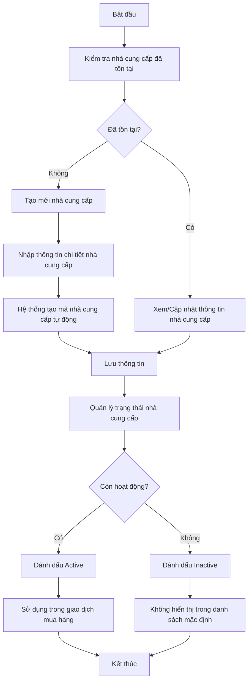
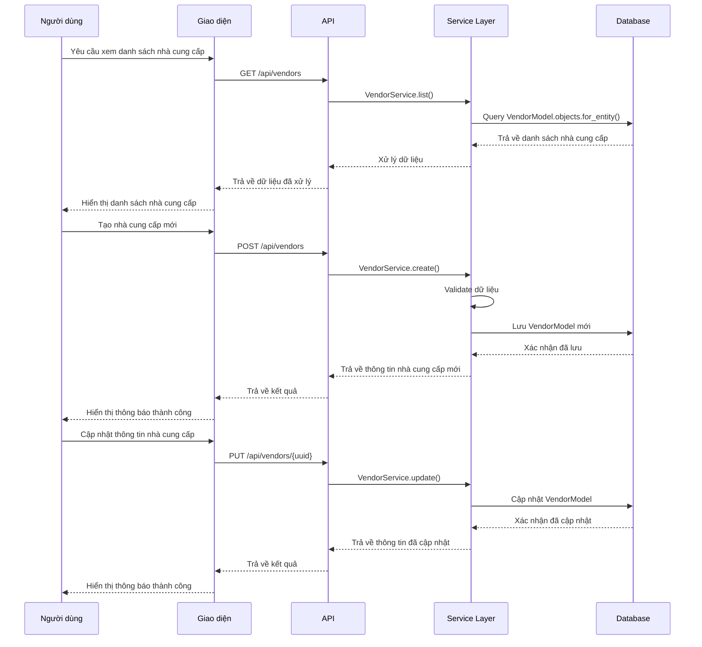
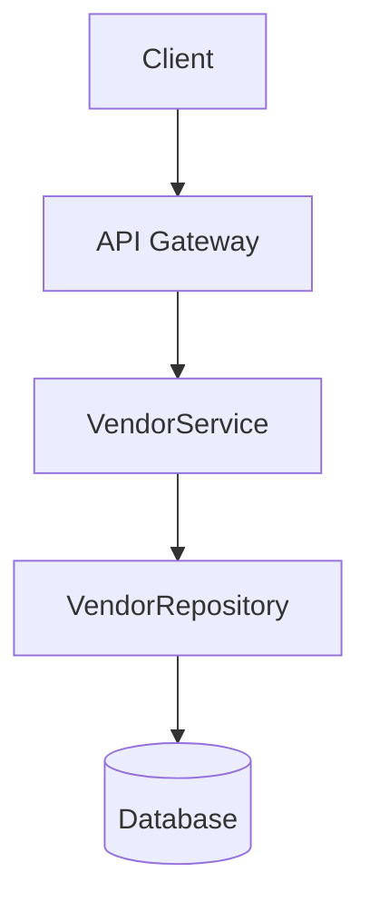
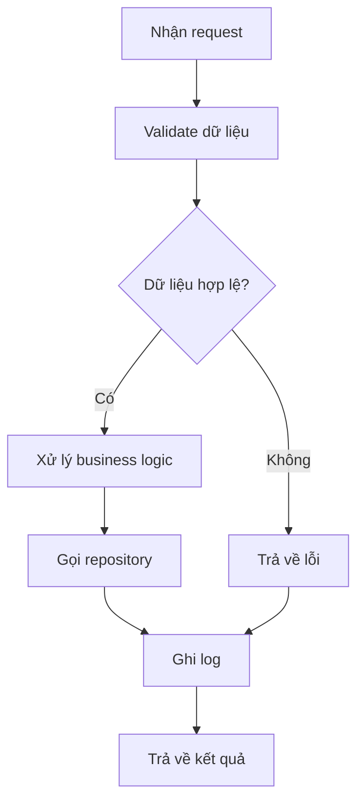
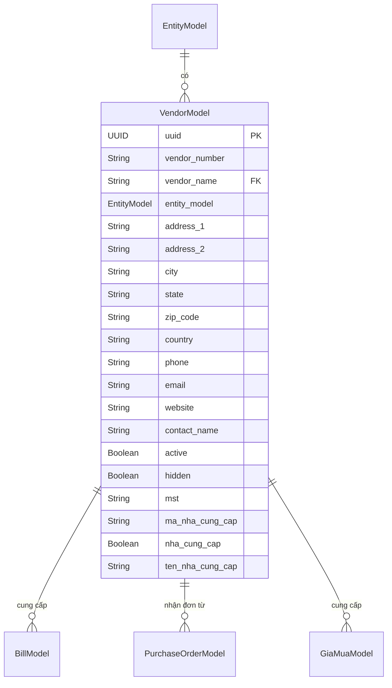

# PUR_001_Quản Lý Nhà Cung Cấp

*Phiên bản: 1.1*  
*Người tạo: Auto Generated*  
*Ngày tạo: 25/07/2023*  
*Cập nhật lần cuối: 09/07/2024*  
*Người cập nhật: AI Assistant*

## 1. Tổng Quan Nghiệp Vụ

### 1.1. Mô Tả Nghiệp Vụ
Quản lý nhà cung cấp là một quy trình quản lý thông tin của các tổ chức, cá nhân cung cấp hàng hóa, dịch vụ cho doanh nghiệp. Quy trình này giúp doanh nghiệp theo dõi, quản lý và đánh giá các nhà cung cấp, đảm bảo cung ứng hiệu quả và tối ưu chi phí mua hàng. Thông qua hệ thống này, doanh nghiệp có thể quản lý thông tin chi tiết của nhà cung cấp, bao gồm thông tin liên hệ, điều khoản thanh toán, tài khoản ngân hàng, phương thức thanh toán và các thông tin liên quan khác. Hệ thống cho phép đánh dấu nhà cung cấp là đang hoạt động (active) hoặc không hoạt động (inactive), cũng như ẩn hoặc hiển thị trong giao diện người dùng.

### 1.2. Phạm Vi Áp Dụng
Quy trình này áp dụng cho toàn bộ hoạt động quản lý nhà cung cấp trong doanh nghiệp, bao gồm:
- Bộ phận mua hàng
- Bộ phận kế toán
- Ban lãnh đạo
- Các đơn vị có nhu cầu mua hàng hóa/dịch vụ từ nhà cung cấp

### 1.3. Định Nghĩa Thuật Ngữ
| Thuật ngữ | Định nghĩa |
|-----------|------------|
| Nhà cung cấp (VendorModel) | Tổ chức hoặc cá nhân cung cấp hàng hóa, dịch vụ cho doanh nghiệp |
| Mã nhà cung cấp (vendor_number) | Mã định danh duy nhất cho mỗi nhà cung cấp trong hệ thống, được tự động tạo theo định dạng "VEN-XXXX" |
| Điều khoản thanh toán (ma_tt) | Các điều kiện về cách thức, thời gian thanh toán đã thỏa thuận với nhà cung cấp |
| Phương thức thanh toán (ma_pttt) | Phương thức thanh toán ưu tiên cho nhà cung cấp |
| Entity (entity_model) | Đơn vị quản lý trong hệ thống, có thể là một công ty, chi nhánh hoặc bộ phận |
| Active | Trạng thái nhà cung cấp đang hoạt động và sử dụng trong hệ thống |
| Hidden | Trạng thái nhà cung cấp bị ẩn khỏi giao diện người dùng nhưng vẫn có thể sử dụng thông qua API |

### 1.4. Tài Liệu Liên Quan

| STT | Mã tài liệu | Tên tài liệu | Mô tả |
|-----|-------------|--------------|-------|
| 1   | PUR_002 | Quản Lý Đơn Mua Hàng | Quy trình tạo và quản lý đơn mua hàng |
| 2   | PUR_003 | Quản Lý Hóa Đơn Mua Vào | Quy trình quản lý hóa đơn mua vào |
| 3   | PUR_004 | Quản Lý Giá Mua | Quy trình thiết lập và quản lý giá mua |

## 2. Quy Trình Nghiệp Vụ

### 2.1. Tổng Quan Quy Trình
Quy trình quản lý nhà cung cấp bao gồm các bước: đăng ký thông tin nhà cung cấp mới, cập nhật thông tin nhà cung cấp, quản lý trạng thái (active/inactive), và lưu trữ lịch sử giao dịch với nhà cung cấp. Người dùng có thể tìm kiếm, lọc nhà cung cấp theo nhiều tiêu chí khác nhau.

### 2.2. Sơ Đồ Quy Trình (Business Flow)

### 2.3. Chi Tiết Các Bước Quy Trình

#### 2.3.1. Kiểm tra nhà cung cấp đã tồn tại
- **Mô tả**: Người dùng tìm kiếm nhà cung cấp trong hệ thống bằng mã số thuế hoặc tên để kiểm tra xem đã tồn tại hay chưa
- **Đầu vào**: Mã số thuế, tên nhà cung cấp
- **Đầu ra**: Danh sách nhà cung cấp phù hợp với điều kiện tìm kiếm
- **Người thực hiện**: Nhân viên phụ trách mua hàng, kế toán
- **Điều kiện tiên quyết**: Người dùng có quyền truy cập module quản lý nhà cung cấp
- **Xử lý ngoại lệ**: Nếu không tìm thấy, hệ thống thông báo và gợi ý tạo mới

#### 2.3.2. Tạo mới nhà cung cấp
- **Mô tả**: Người dùng nhập các thông tin chi tiết của nhà cung cấp mới
- **Đầu vào**: Thông tin nhà cung cấp (tên, địa chỉ, mã số thuế, người liên hệ, điện thoại, email, v.v.)
- **Đầu ra**: Bản ghi nhà cung cấp mới với mã được tạo tự động
- **Người thực hiện**: Nhân viên phụ trách mua hàng, kế toán
- **Điều kiện tiên quyết**: Người dùng có quyền tạo mới nhà cung cấp
- **Xử lý ngoại lệ**: Kiểm tra trùng lặp mã số thuế, yêu cầu nhập các trường bắt buộc

#### 2.3.3. Cập nhật thông tin nhà cung cấp
- **Mô tả**: Người dùng cập nhật thông tin của nhà cung cấp đã tồn tại
- **Đầu vào**: Thông tin cần cập nhật, ID nhà cung cấp
- **Đầu ra**: Bản ghi nhà cung cấp được cập nhật
- **Người thực hiện**: Nhân viên phụ trách mua hàng, kế toán
- **Điều kiện tiên quyết**: Nhà cung cấp đã tồn tại trong hệ thống
- **Xử lý ngoại lệ**: Ghi lại lịch sử thay đổi thông tin

#### 2.3.4. Quản lý trạng thái nhà cung cấp
- **Mô tả**: Người dùng thay đổi trạng thái hoạt động của nhà cung cấp
- **Đầu vào**: Trạng thái mới (active/inactive), ID nhà cung cấp
- **Đầu ra**: Bản ghi nhà cung cấp với trạng thái đã cập nhật
- **Người thực hiện**: Nhân viên phụ trách mua hàng, kế toán
- **Điều kiện tiên quyết**: Nhà cung cấp đã tồn tại trong hệ thống
- **Xử lý ngoại lệ**: Kiểm tra xem nhà cung cấp có đang được sử dụng trong các giao dịch đang xử lý không

### 2.4. Sơ Đồ Tuần Tự (Sequence Diagram)

### 2.5. Luồng Nghiệp Vụ Thay Thế
- **Luồng nhập từ file**: Người dùng có thể tải lên file Excel/CSV chứa thông tin nhiều nhà cung cấp để nhập hàng loạt vào hệ thống
- **Luồng vô hiệu hóa tạm thời**: Đánh dấu nhà cung cấp là hidden thay vì inactive để không hiển thị trong danh sách mặc định nhưng vẫn có thể tra cứu khi cần

## 3. Yêu Cầu Chức Năng

### 3.1. Danh Sách Chức Năng

| STT | Mã chức năng | Tên chức năng | Mô tả | Độ ưu tiên |
|-----|--------------|---------------|-------|------------|
| 1   | VEN_LIST | Xem danh sách nhà cung cấp | Hiển thị danh sách nhà cung cấp với các bộ lọc và tìm kiếm | Cao |
| 2   | VEN_CREATE | Tạo nhà cung cấp mới | Thêm nhà cung cấp mới vào hệ thống | Cao |
| 3   | VEN_UPDATE | Cập nhật nhà cung cấp | Sửa đổi thông tin nhà cung cấp | Cao |
| 4   | VEN_VIEW | Xem chi tiết nhà cung cấp | Xem toàn bộ thông tin chi tiết của nhà cung cấp | Cao |
| 5   | VEN_STATUS | Thay đổi trạng thái | Đánh dấu nhà cung cấp là active/inactive | Trung bình |
| 6   | VEN_IMPORT | Nhập danh sách từ file | Tải lên và nhập danh sách nhà cung cấp từ file | Thấp |
| 7   | VEN_EXPORT | Xuất danh sách ra file | Xuất danh sách nhà cung cấp ra file Excel/PDF | Thấp |

### 3.2. Chi Tiết Chức Năng

#### 3.2.1. VEN_LIST: Xem danh sách nhà cung cấp
- **Mô tả**: Hiển thị danh sách các nhà cung cấp với khả năng phân trang, tìm kiếm, lọc và sắp xếp
- **Đầu vào**: Các tham số tìm kiếm, lọc (tên, mã, trạng thái, v.v.)
- **Đầu ra**: Danh sách nhà cung cấp đáp ứng điều kiện
- **Điều kiện tiên quyết**: Người dùng đã đăng nhập và có quyền truy cập module nhà cung cấp
- **Luồng xử lý chính**:
  1. Người dùng truy cập trang danh sách nhà cung cấp
  2. Hệ thống load danh sách mặc định (active, sắp xếp theo tên)
  3. Người dùng có thể tìm kiếm, lọc và sắp xếp theo nhu cầu
  4. Hệ thống hiển thị kết quả phù hợp
- **Luồng xử lý thay thế/ngoại lệ**:
  1. Nếu không có nhà cung cấp nào thỏa mãn điều kiện, hiển thị thông báo "Không tìm thấy nhà cung cấp"
- **Giao diện liên quan**: Trang danh sách nhà cung cấp

#### 3.2.2. VEN_CREATE: Tạo nhà cung cấp mới
- **Mô tả**: Cho phép người dùng tạo nhà cung cấp mới trong hệ thống
- **Đầu vào**: Thông tin nhà cung cấp (tên, địa chỉ, mã số thuế, thông tin liên hệ, điều khoản thanh toán...)
- **Đầu ra**: Bản ghi nhà cung cấp mới trong hệ thống
- **Điều kiện tiên quyết**: Người dùng đã đăng nhập và có quyền tạo nhà cung cấp
- **Luồng xử lý chính**:
  1. Người dùng chọn "Thêm nhà cung cấp mới"
  2. Hệ thống hiển thị form nhập thông tin
  3. Người dùng điền thông tin nhà cung cấp
  4. Người dùng nhấn "Lưu"
  5. Hệ thống kiểm tra tính hợp lệ của dữ liệu
  6. Hệ thống tạo mã nhà cung cấp tự động (nếu chưa có)
  7. Hệ thống lưu nhà cung cấp mới và hiển thị thông báo thành công
- **Luồng xử lý thay thế/ngoại lệ**:
  1. Nếu dữ liệu không hợp lệ, hiển thị thông báo lỗi tương ứng
  2. Nếu mã số thuế đã tồn tại, cảnh báo người dùng
- **Giao diện liên quan**: Form tạo nhà cung cấp mới

#### 3.2.3. VEN_UPDATE: Cập nhật nhà cung cấp
- **Mô tả**: Cho phép người dùng cập nhật thông tin nhà cung cấp
- **Đầu vào**: ID nhà cung cấp, thông tin cần cập nhật
- **Đầu ra**: Bản ghi nhà cung cấp đã cập nhật
- **Điều kiện tiên quyết**: Nhà cung cấp đã tồn tại trong hệ thống
- **Luồng xử lý chính**:
  1. Người dùng chọn nhà cung cấp cần cập nhật
  2. Hệ thống hiển thị form với thông tin hiện tại
  3. Người dùng chỉnh sửa thông tin
  4. Người dùng nhấn "Lưu"
  5. Hệ thống kiểm tra tính hợp lệ của dữ liệu
  6. Hệ thống lưu thông tin đã cập nhật và hiển thị thông báo thành công
- **Luồng xử lý thay thế/ngoại lệ**:
  1. Nếu dữ liệu không hợp lệ, hiển thị thông báo lỗi tương ứng
- **Giao diện liên quan**: Form cập nhật nhà cung cấp

## 4. Thiết Kế Kỹ Thuật

### 4.1. Kiến Trúc Hệ Thống

### 4.2. API Endpoints

#### 4.2.1. Lấy danh sách nhà cung cấp
- **Mô tả**: Trả về danh sách nhà cung cấp theo điều kiện lọc
- **URL**: `GET /api/v1/entity/{entity_slug}/vendors/`
- **Query Parameters**:
  - `search`: Từ khóa tìm kiếm
  - `active`: Lọc theo trạng thái active (true/false)
  - `page`: Số trang
  - `page_size`: Số bản ghi trên mỗi trang
  - `ordering`: Trường sắp xếp
- **Response**: Danh sách nhà cung cấp, phân trang

#### 4.2.2. Lấy chi tiết nhà cung cấp
- **Mô tả**: Trả về thông tin chi tiết của một nhà cung cấp
- **URL**: `GET /api/v1/entity/{entity_slug}/vendors/{uuid}/`
- **Response**: Chi tiết nhà cung cấp

#### 4.2.3. Tạo nhà cung cấp mới
- **Mô tả**: Tạo nhà cung cấp mới trong hệ thống
- **URL**: `POST /api/v1/entity/{entity_slug}/vendors/`
- **Request Body**: Thông tin nhà cung cấp
- **Response**: Thông tin nhà cung cấp đã tạo

#### 4.2.4. Cập nhật nhà cung cấp
- **Mô tả**: Cập nhật thông tin nhà cung cấp
- **URL**: `PUT /api/v1/entity/{entity_slug}/vendors/{uuid}/`
- **Request Body**: Thông tin cập nhật
- **Response**: Thông tin nhà cung cấp đã cập nhật

#### 4.2.5. Cập nhật một phần thông tin nhà cung cấp
- **Mô tả**: Cập nhật một phần thông tin nhà cung cấp
- **URL**: `PATCH /api/v1/entity/{entity_slug}/vendors/{uuid}/`
- **Request Body**: Thông tin cần cập nhật
- **Response**: Thông tin nhà cung cấp đã cập nhật

### 4.3. Service Logic

#### 4.3.1. VendorService
- **Mô tả**: Xử lý logic nghiệp vụ liên quan đến quản lý nhà cung cấp
- **Chức năng chính**:
  1. Tìm kiếm và lọc nhà cung cấp
  2. Tạo mới nhà cung cấp
  3. Cập nhật thông tin nhà cung cấp
  4. Thay đổi trạng thái nhà cung cấp
  5. Tự động sinh mã nhà cung cấp
- **Các dependencies**:
  1. VendorRepository
  2. EntityService
- **Sơ đồ luồng xử lý**:

### 4.4. Mô Hình Dữ Liệu

#### 4.4.1. Entity Relationship Diagram (ERD)

#### 4.4.2. Chi Tiết Bảng Dữ Liệu

##### Bảng: VendorModel
- **Mô tả**: Lưu trữ thông tin về nhà cung cấp
- **Các trường chính**:
  - `uuid`: Khóa chính, định danh duy nhất
  - `vendor_number`: Mã nhà cung cấp, tự động sinh
  - `vendor_name`: Tên nhà cung cấp
  - `entity_model`: Khóa ngoại tham chiếu đến EntityModel
  - `address_1`: Địa chỉ dòng 1
  - `address_2`: Địa chỉ dòng 2 (tùy chọn)
  - `city`: Thành phố
  - `state`: Tỉnh/bang
  - `zip_code`: Mã bưu chính
  - `country`: Quốc gia
  - `phone`: Số điện thoại
  - `email`: Địa chỉ email
  - `website`: Website
  - `contact_name`: Tên người liên hệ
  - `active`: Trạng thái hoạt động
  - `hidden`: Trạng thái ẩn
  - `mst`: Mã số thuế
  - `ma_nha_cung_cap`: Mã nhà cung cấp (để tương thích với hệ thống cũ)
  - `nha_cung_cap`: Cờ đánh dấu là nhà cung cấp
  - `ten_nha_cung_cap`: Tên nhà cung cấp (tiếng Việt)

## 5. Kế Hoạch Kiểm Thử

### 5.1. Phạm Vi Kiểm Thử
Kiểm thử sẽ bao gồm tất cả các chức năng liên quan đến quản lý nhà cung cấp, bao gồm:
- Tạo mới nhà cung cấp
- Cập nhật thông tin nhà cung cấp
- Tìm kiếm và lọc nhà cung cấp
- Đổi trạng thái nhà cung cấp
- Kiểm tra tích hợp với các phân hệ liên quan (đơn mua hàng, hóa đơn)

### 5.2. Kịch Bản Kiểm Thử

| STT | Mã kịch bản | Tên kịch bản | Mô tả | Điều kiện tiên quyết | Các bước | Kết quả mong đợi |
|-----|------------|--------------|-------|---------------------|----------|-----------------|
| 1   | TC_VEN_C01 | Tạo nhà cung cấp mới thành công | Kiểm tra việc tạo nhà cung cấp mới | Người dùng đã đăng nhập và có quyền tạo | 1. Truy cập form tạo nhà cung cấp 2. Nhập thông tin hợp lệ 3. Nhấn Lưu | Nhà cung cấp mới được tạo với mã tự động |
| 2   | TC_VEN_C02 | Tạo nhà cung cấp với dữ liệu thiếu | Kiểm tra validate dữ liệu bắt buộc | Người dùng đã đăng nhập và có quyền tạo | 1. Truy cập form tạo nhà cung cấp 2. Bỏ trống các trường bắt buộc 3. Nhấn Lưu | Hiển thị thông báo lỗi về các trường bắt buộc |
| 3   | TC_VEN_U01 | Cập nhật thông tin nhà cung cấp | Kiểm tra cập nhật thông tin | Nhà cung cấp đã tồn tại | 1. Mở form cập nhật 2. Thay đổi thông tin 3. Nhấn Lưu | Thông tin được cập nhật thành công |
| 4   | TC_VEN_S01 | Tìm kiếm nhà cung cấp | Kiểm tra chức năng tìm kiếm | Có nhiều nhà cung cấp trong hệ thống | 1. Nhập từ khóa tìm kiếm 2. Nhấn Tìm kiếm | Hiển thị danh sách nhà cung cấp phù hợp |
| 5   | TC_VEN_ST01 | Thay đổi trạng thái nhà cung cấp | Kiểm tra chức năng thay đổi trạng thái | Nhà cung cấp đang active | 1. Chọn nhà cung cấp 2. Đổi trạng thái sang inactive 3. Lưu | Trạng thái được cập nhật, nhà cung cấp không xuất hiện trong danh sách active |

## 6. Phụ Lục

### 6.1. Danh Sách Tài Liệu Tham Khảo
1. Tài liệu thiết kế cơ sở dữ liệu ERP
2. Tài liệu API đặc tả
3. Quy định về quản lý nhà cung cấp của doanh nghiệp

### 6.2. Danh Mục Thuật Ngữ
- **Vendor**: Nhà cung cấp
- **MST**: Mã số thuế
- **Active**: Trạng thái hoạt động, có thể sử dụng trong các giao dịch
- **Inactive**: Trạng thái không hoạt động, không thể sử dụng trong các giao dịch mới
- **Hidden**: Ẩn khỏi danh sách mặc định nhưng vẫn tồn tại trong hệ thống

### 6.3. Lịch Sử Thay Đổi Tài Liệu

| Phiên bản | Ngày | Người thực hiện | Mô tả thay đổi |
|-----------|------|-----------------|---------------|
| 1.0 | 25/07/2023 | Auto Generated | Tạo tài liệu ban đầu |