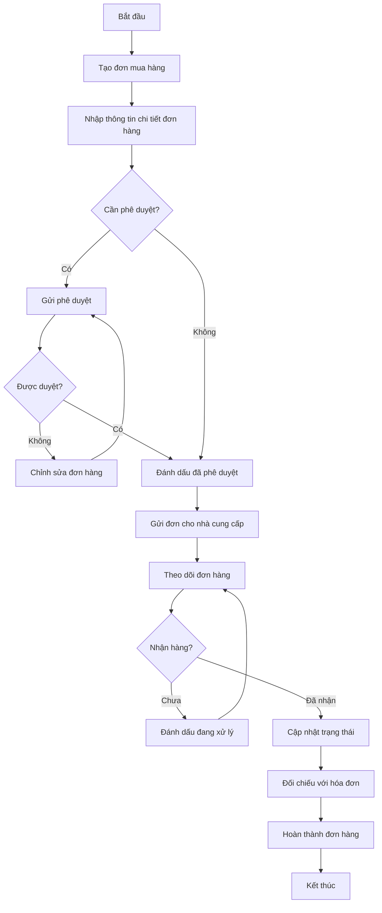
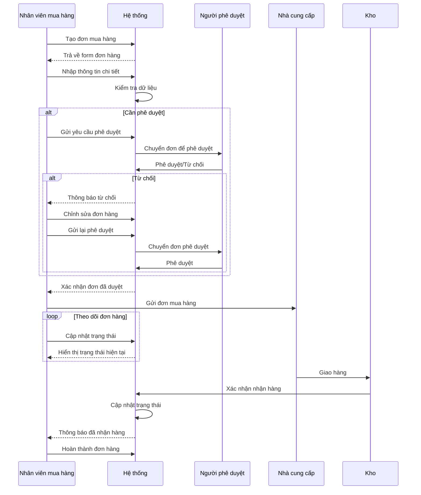
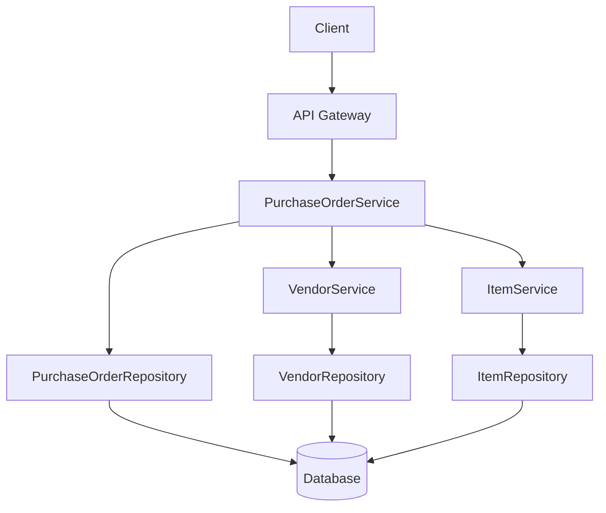
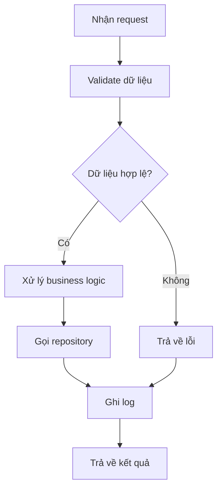

# PUR_002_Quản Lý Đơn Mua Hàng

*Phiên bản: 1.1*  
*Người tạo: Auto Generated*  
*Ngày tạo: 25/07/2023*  
*Cập nhật lần cuối: 09/07/2024*  
*Người cập nhật: AI Assistant*

## 1. Tổng Quan Nghiệp Vụ

### 1.1. Mô Tả Nghiệp Vụ
Quản lý đơn mua hàng là quy trình xử lý và theo dõi các đơn đặt hàng với nhà cung cấp từ lúc tạo đơn cho đến khi nhận hàng và thanh toán. Đơn mua hàng (Purchase Order) là tài liệu chính thức được doanh nghiệp gửi đến nhà cung cấp để yêu cầu cung cấp hàng hóa hoặc dịch vụ với số lượng, chất lượng, giá cả, và thời gian giao hàng cụ thể. Hệ thống lưu trữ thông tin chi tiết về nhà cung cấp, ngày chứng từ, ngày hiệu lực, điều khoản thanh toán, thông tin giao hàng, và các chi tiết tài chính như tỷ giá, tổng số lượng, tổng tiền, thuế và tổng thanh toán. Quy trình này giúp doanh nghiệp kiểm soát chi phí mua hàng, đảm bảo tính minh bạch, và tạo cơ sở cho việc đối chiếu hóa đơn sau này.

### 1.2. Phạm Vi Áp Dụng
Quy trình này áp dụng cho tất cả các hoạt động mua hàng trong doanh nghiệp, bao gồm:
- Bộ phận mua hàng
- Bộ phận kế toán
- Bộ phận kho
- Các phòng ban có nhu cầu mua sắm hàng hóa/dịch vụ
- Ban lãnh đạo phê duyệt đơn hàng có giá trị lớn

### 1.3. Định Nghĩa Thuật Ngữ
| Thuật ngữ | Định nghĩa |
|-----------|------------|
| Đơn mua hàng (DonMuaHangModel) | Tài liệu chính thức gửi cho nhà cung cấp để yêu cầu cung cấp hàng hóa/dịch vụ |
| Nhà cung cấp (ma_ncc) | Tổ chức/cá nhân cung cấp hàng hóa, dịch vụ cho doanh nghiệp |
| Điều khoản thanh toán (han_thanh_toan) | Các điều kiện về thời gian, phương thức thanh toán |
| Mã ngoại tệ (ma_nt) | Loại tiền tệ sử dụng trong giao dịch |
| Tỷ giá (ty_gia) | Tỷ lệ chuyển đổi giữa ngoại tệ và tiền tệ địa phương |
| Số chứng từ (so_ct) | Mã định danh duy nhất cho mỗi đơn mua hàng |
| Ngày chứng từ (ngay_ct) | Ngày lập chứng từ đơn mua hàng |
| Ngày hiệu lực (ngay_hl) | Ngày đơn mua hàng có hiệu lực |
| Status | Trạng thái của đơn mua hàng, mặc định là "1" (hoạt động) |

### 1.4. Tài Liệu Liên Quan

| STT | Mã tài liệu | Tên tài liệu | Mô tả |
|-----|-------------|--------------|-------|
| 1   | PUR_001 | Quản Lý Nhà Cung Cấp | Quy trình quản lý thông tin nhà cung cấp |
| 2   | PUR_003 | Quản Lý Hóa Đơn Mua Vào | Quy trình quản lý hóa đơn mua vào |
| 3   | PUR_004 | Quản Lý Giá Mua | Quy trình thiết lập và quản lý giá mua |
| 4   | INV_005 | Quản Lý Nhập Xuất Kho | Quy trình nhập xuất kho |

## 2. Quy Trình Nghiệp Vụ

### 2.1. Tổng Quan Quy Trình
Quy trình quản lý đơn mua hàng bao gồm các bước chính: tạo yêu cầu mua hàng, tạo đơn mua hàng, phê duyệt đơn, gửi đơn cho nhà cung cấp, nhận hàng và xác nhận hoàn thành đơn hàng. Các bên liên quan chính bao gồm người yêu cầu mua hàng, nhân viên mua hàng, người phê duyệt, nhà cung cấp và nhân viên kho.

### 2.2. Sơ Đồ Quy Trình (Business Flow)



### 2.3. Chi Tiết Các Bước Quy Trình

#### 2.3.1. Tạo đơn mua hàng
- **Mô tả**: Nhân viên mua hàng tạo đơn mua hàng mới trong hệ thống
- **Đầu vào**: Thông tin yêu cầu mua hàng, thông tin nhà cung cấp
- **Đầu ra**: Đơn mua hàng ở trạng thái nháp
- **Người thực hiện**: Nhân viên mua hàng
- **Điều kiện tiên quyết**: Nhà cung cấp đã tồn tại trong hệ thống
- **Xử lý ngoại lệ**: Nếu nhà cung cấp chưa tồn tại, cần tạo mới trong hệ thống

#### 2.3.2. Nhập thông tin chi tiết đơn hàng
- **Mô tả**: Nhập đầy đủ thông tin về các mặt hàng, số lượng, giá, thuế và các điều khoản khác
- **Đầu vào**: Danh sách hàng hóa/dịch vụ, số lượng, giá, thuế, ngày giao hàng dự kiến
- **Đầu ra**: Đơn mua hàng với thông tin chi tiết
- **Người thực hiện**: Nhân viên mua hàng
- **Điều kiện tiên quyết**: Đơn mua hàng đã được tạo ở trạng thái nháp
- **Xử lý ngoại lệ**: Kiểm tra tính hợp lệ của giá, số lượng và các thông tin khác

#### 2.3.3. Phê duyệt đơn mua hàng
- **Mô tả**: Người có thẩm quyền xem xét và phê duyệt đơn mua hàng
- **Đầu vào**: Đơn mua hàng cần phê duyệt
- **Đầu ra**: Đơn mua hàng được phê duyệt hoặc từ chối
- **Người thực hiện**: Người quản lý/phê duyệt
- **Điều kiện tiên quyết**: Đơn mua hàng đã được tạo đầy đủ thông tin
- **Xử lý ngoại lệ**: Trường hợp từ chối, cần ghi rõ lý do

#### 2.3.4. Gửi đơn cho nhà cung cấp
- **Mô tả**: Gửi đơn mua hàng đã được phê duyệt đến nhà cung cấp
- **Đầu vào**: Đơn mua hàng đã phê duyệt
- **Đầu ra**: Xác nhận đã gửi đơn
- **Người thực hiện**: Nhân viên mua hàng
- **Điều kiện tiên quyết**: Đơn mua hàng đã được phê duyệt
- **Xử lý ngoại lệ**: Xử lý trường hợp không thể liên hệ với nhà cung cấp

#### 2.3.5. Theo dõi và cập nhật đơn hàng
- **Mô tả**: Theo dõi tiến độ thực hiện đơn hàng, liên hệ với nhà cung cấp nếu cần
- **Đầu vào**: Mã đơn mua hàng, thông tin liên hệ nhà cung cấp
- **Đầu ra**: Cập nhật trạng thái đơn hàng
- **Người thực hiện**: Nhân viên mua hàng
- **Điều kiện tiên quyết**: Đơn hàng đã được gửi cho nhà cung cấp
- **Xử lý ngoại lệ**: Xử lý các trường hợp giao hàng trễ hoặc thay đổi điều khoản

#### 2.3.6. Nhận hàng và hoàn thành đơn hàng
- **Mô tả**: Xác nhận việc nhận hàng và cập nhật trạng thái đơn hàng
- **Đầu vào**: Biên bản giao nhận hàng, thông tin đơn hàng
- **Đầu ra**: Đơn mua hàng được cập nhật trạng thái "Đã nhận hàng"
- **Người thực hiện**: Nhân viên kho, nhân viên mua hàng
- **Điều kiện tiên quyết**: Hàng hóa đã được giao đến
- **Xử lý ngoại lệ**: Xử lý trường hợp hàng hóa không đúng số lượng, chất lượng

### 2.4. Sơ Đồ Tuần Tự (Sequence Diagram)



### 2.5. Luồng Nghiệp Vụ Thay Thế
- **Hủy đơn hàng**: Trong trường hợp cần hủy đơn hàng đã phê duyệt, nhân viên mua hàng cần liên hệ với nhà cung cấp, xác nhận hủy đơn và cập nhật trạng thái trong hệ thống
- **Thay đổi đơn hàng**: Nếu cần thay đổi thông tin đơn hàng sau khi đã phê duyệt, cần tạo phiên bản mới và qua quy trình phê duyệt lại
- **Nhận hàng một phần**: Trong trường hợp chỉ nhận được một phần hàng, cần cập nhật số lượng đã nhận và giữ đơn hàng ở trạng thái "Đang xử lý" cho đến khi nhận đủ

## 3. Yêu Cầu Chức Năng

### 3.1. Danh Sách Chức Năng

| STT | Mã chức năng | Tên chức năng | Mô tả | Độ ưu tiên |
|-----|--------------|---------------|-------|------------|
| 1   | PO_LIST | Xem danh sách đơn mua hàng | Hiển thị danh sách đơn mua hàng với các bộ lọc và tìm kiếm | Cao |
| 2   | PO_CREATE | Tạo đơn mua hàng | Tạo mới đơn mua hàng trong hệ thống | Cao |
| 3   | PO_UPDATE | Cập nhật đơn mua hàng | Chỉnh sửa thông tin đơn mua hàng | Cao |
| 4   | PO_VIEW | Xem chi tiết đơn mua hàng | Xem toàn bộ thông tin chi tiết của đơn mua hàng | Cao |
| 5   | PO_APPROVE | Phê duyệt đơn mua hàng | Phê duyệt hoặc từ chối đơn mua hàng | Cao |
| 6   | PO_STATUS | Cập nhật trạng thái | Cập nhật trạng thái của đơn mua hàng | Cao |
| 7   | PO_PRINT | In đơn mua hàng | Xuất đơn mua hàng ra file PDF để in | Trung bình |
| 8   | PO_EXPORT | Xuất danh sách ra file | Xuất danh sách đơn mua hàng ra file Excel | Thấp |

### 3.2. Chi Tiết Chức Năng

#### 3.2.1. PO_CREATE: Tạo đơn mua hàng
- **Mô tả**: Cho phép người dùng tạo đơn mua hàng mới trong hệ thống
- **Đầu vào**: Thông tin nhà cung cấp, danh sách hàng hóa/dịch vụ, số lượng, giá, thuế, điều khoản thanh toán, ngày giao hàng dự kiến
- **Đầu ra**: Đơn mua hàng mới được tạo trong hệ thống
- **Điều kiện tiên quyết**: Người dùng đã đăng nhập và có quyền tạo đơn mua hàng
- **Luồng xử lý chính**:
  1. Người dùng chọn "Tạo đơn mua hàng mới"
  2. Hệ thống hiển thị form nhập thông tin
  3. Người dùng chọn nhà cung cấp
  4. Hệ thống tự động điền thông tin nhà cung cấp
  5. Người dùng thêm các mặt hàng, số lượng, giá, thuế
  6. Hệ thống tính toán tổng tiền, thuế
  7. Người dùng nhập các thông tin khác (ngày giao hàng, điều khoản thanh toán)
  8. Người dùng nhấn "Lưu" hoặc "Gửi phê duyệt"
  9. Hệ thống kiểm tra tính hợp lệ của dữ liệu
  10. Hệ thống lưu đơn mua hàng và hiển thị thông báo thành công
- **Luồng xử lý thay thế/ngoại lệ**:
  1. Nếu dữ liệu không hợp lệ, hiển thị thông báo lỗi tương ứng
  2. Nếu nhà cung cấp không tồn tại, gợi ý tạo mới nhà cung cấp
- **Giao diện liên quan**: Form tạo đơn mua hàng

#### 3.2.2. PO_UPDATE: Cập nhật đơn mua hàng
- **Mô tả**: Cho phép người dùng cập nhật thông tin đơn mua hàng
- **Đầu vào**: ID đơn mua hàng, thông tin cần cập nhật
- **Đầu ra**: Đơn mua hàng đã cập nhật
- **Điều kiện tiên quyết**: Đơn mua hàng đã tồn tại và đang ở trạng thái cho phép chỉnh sửa
- **Luồng xử lý chính**:
  1. Người dùng chọn đơn mua hàng cần cập nhật
  2. Hệ thống hiển thị form với thông tin hiện tại
  3. Người dùng chỉnh sửa thông tin
  4. Người dùng nhấn "Lưu"
  5. Hệ thống kiểm tra tính hợp lệ của dữ liệu
  6. Hệ thống lưu thông tin đã cập nhật và hiển thị thông báo thành công
- **Luồng xử lý thay thế/ngoại lệ**:
  1. Nếu đơn đã được phê duyệt, không cho phép chỉnh sửa trực tiếp
  2. Nếu cần chỉnh sửa đơn đã phê duyệt, yêu cầu tạo phiên bản mới
- **Giao diện liên quan**: Form cập nhật đơn mua hàng

## 4. Thiết Kế Kỹ Thuật

### 4.1. Kiến Trúc Hệ Thống



### 4.2. API Endpoints

#### 4.2.1. Lấy danh sách đơn mua hàng
- **Mô tả**: Trả về danh sách đơn mua hàng theo điều kiện lọc
- **URL**: `GET /api/v1/entity/{entity_slug}/purchase/`
- **Query Parameters**:
  - `status`: Lọc theo trạng thái
  - `vendor`: Lọc theo nhà cung cấp
  - `date_range`: Lọc theo khoảng thời gian
  - `search`: Từ khóa tìm kiếm
  - `page`: Số trang
  - `page_size`: Số bản ghi trên mỗi trang
  - `ordering`: Trường sắp xếp
- **Response**: Danh sách đơn mua hàng, phân trang

#### 4.2.2. Lấy chi tiết đơn mua hàng
- **Mô tả**: Trả về thông tin chi tiết của một đơn mua hàng
- **URL**: `GET /api/v1/entity/{entity_slug}/purchase/{uuid}/`
- **Response**: Chi tiết đơn mua hàng và các dòng chi tiết

#### 4.2.3. Tạo đơn mua hàng mới
- **Mô tả**: Tạo đơn mua hàng mới trong hệ thống
- **URL**: `POST /api/v1/entity/{entity_slug}/purchase/`
- **Request Body**: Thông tin đơn mua hàng
- **Response**: Thông tin đơn mua hàng đã tạo

#### 4.2.4. Cập nhật đơn mua hàng
- **Mô tả**: Cập nhật thông tin đơn mua hàng
- **URL**: `PUT /api/v1/entity/{entity_slug}/purchase/{uuid}/`
- **Request Body**: Thông tin cập nhật
- **Response**: Thông tin đơn mua hàng đã cập nhật

#### 4.2.5. Cập nhật trạng thái đơn mua hàng
- **Mô tả**: Cập nhật trạng thái của đơn mua hàng
- **URL**: `PATCH /api/v1/entity/{entity_slug}/purchase/{uuid}/status/`
- **Request Body**: Trạng thái mới, ghi chú
- **Response**: Thông tin trạng thái đã cập nhật

### 4.3. Service Logic

#### 4.3.1. PurchaseOrderService
- **Mô tả**: Xử lý logic nghiệp vụ liên quan đến quản lý đơn mua hàng
- **Chức năng chính**:
  1. Tạo đơn mua hàng mới
  2. Cập nhật thông tin đơn mua hàng
  3. Quản lý trạng thái đơn mua hàng
  4. Tính toán tổng tiền, thuế
  5. Phê duyệt đơn mua hàng
- **Các dependencies**:
  1. PurchaseOrderRepository
  2. VendorService
  3. ItemService
- **Sơ đồ luồng xử lý**:



### 4.4. Mô Hình Dữ Liệu

#### 4.4.1. Entity Relationship Diagram (ERD)

```mermaid
erDiagram
    EntityModel ||--o{ DonMuaHangModel : "có"
    CustomerModel ||--o{ DonMuaHangModel : "cung cấp cho"
    NhanVienModel ||--o{ DonMuaHangModel : "tạo bởi"
    KhoHangModel ||--o{ DonMuaHangModel : "giao đến"
    
    DonMuaHangModel ||--o{ ChiTietDonMuaHangModel : "có"
    
    DonMuaHangModel {
        UUID uuid PK
        FK EntityModel entity_model
        FK CustomerModel ma_ncc
        String mst
        String ten_ncc
        String nguoi_lien_he
        String dia_chi
        String e_mail
        FK NhanVienModel ma_nvmh
        FK HanThanhToanModel han_thanh_toan
        String dien_giai
        FK QuyenChungTu so_ct
        Date ngay_ct
        Date ngay_lct
        Date ngay_hl
        String so_hd
        FK NgoaiTeModel ma_nt
        Decimal ty_gia
        String status
        String dien_thoai
        FK KhoHangModel ma_kho
        FK PhuongThucThanhToanModel phuong_thuc_thanh_toan
        FK DiaChiNhanHangModel noi_nhan
        String giao_dich
        String ly_do_huy
        String ghi_chu
        Decimal t_so_luong
        Decimal t_chi_phi
        Decimal t_tien
        Decimal t_thue
        Decimal t_tt
    }
    
    ChiTietDonMuaHangModel {
        UUID uuid PK
        FK DonMuaHangModel don_mua_hang
        FK VatTuModel ma_vt
        String ten_vt
        String dvt
        Decimal so_luong
        Decimal gia
        Decimal thanh_tien
        Decimal ty_le_ck
        Decimal tien_ck
        FK ThueSuatModel thue_suat
        Decimal tien_thue
        Decimal tong_tien
        String ghi_chu
    }
```

#### 4.4.2. Chi Tiết Bảng Dữ Liệu

##### Bảng: DonMuaHangModel
- **Mô tả**: Lưu trữ thông tin về đơn mua hàng
- **Các trường chính**:
  - `uuid`: Khóa chính, định danh duy nhất
  - `entity_model`: Khóa ngoại tham chiếu đến EntityModel
  - `ma_ncc`: Khóa ngoại tham chiếu đến nhà cung cấp (CustomerModel)
  - `mst`: Mã số thuế của nhà cung cấp
  - `ten_ncc`: Tên nhà cung cấp
  - `nguoi_lien_he`: Người liên hệ tại nhà cung cấp
  - `dia_chi`: Địa chỉ nhà cung cấp
  - `e_mail`: Email nhà cung cấp
  - `ma_nvmh`: Khóa ngoại tham chiếu đến nhân viên mua hàng (NhanVienModel)
  - `han_thanh_toan`: Khóa ngoại tham chiếu đến hạn thanh toán (HanThanhToanModel)
  - `dien_giai`: Mô tả chi tiết về đơn mua hàng
  - `so_ct`: Khóa ngoại tham chiếu đến số chứng từ (QuyenChungTu)
  - `ngay_ct`: Ngày chứng từ
  - `ngay_lct`: Ngày lập chứng từ
  - `ngay_hl`: Ngày hiệu lực
  - `so_hd`: Số hợp đồng (nếu có)
  - `ma_nt`: Khóa ngoại tham chiếu đến ngoại tệ (NgoaiTeModel)
  - `ty_gia`: Tỷ giá quy đổi
  - `status`: Trạng thái đơn mua hàng
  - `dien_thoai`: Số điện thoại liên hệ
  - `ma_kho`: Khóa ngoại tham chiếu đến kho nhận hàng (KhoHangModel)
  - `phuong_thuc_thanh_toan`: Khóa ngoại tham chiếu đến phương thức thanh toán (PhuongThucThanhToanModel)
  - `noi_nhan`: Khóa ngoại tham chiếu đến địa chỉ nhận hàng (DiaChiNhanHangModel)
  - `ly_do_huy`: Lý do hủy đơn (nếu có)
  - `ghi_chu`: Ghi chú thêm
  - `t_so_luong`: Tổng số lượng
  - `t_chi_phi`: Tổng chi phí
  - `t_tien`: Tổng tiền trước thuế
  - `t_thue`: Tổng thuế
  - `t_tt`: Tổng thanh toán (sau thuế)

##### Bảng: ChiTietDonMuaHangModel
- **Mô tả**: Lưu trữ thông tin chi tiết về các mặt hàng trong đơn mua hàng
- **Các trường chính**:
  - `uuid`: Khóa chính, định danh duy nhất
  - `don_mua_hang`: Khóa ngoại tham chiếu đến đơn mua hàng (DonMuaHangModel)
  - `ma_vt`: Khóa ngoại tham chiếu đến vật tư/hàng hóa (VatTuModel)
  - `ten_vt`: Tên vật tư/hàng hóa
  - `dvt`: Đơn vị tính
  - `so_luong`: Số lượng đặt mua
  - `gia`: Đơn giá
  - `thanh_tien`: Thành tiền (số lượng x đơn giá)
  - `ty_le_ck`: Tỷ lệ chiết khấu (%)
  - `tien_ck`: Tiền chiết khấu
  - `thue_suat`: Khóa ngoại tham chiếu đến thuế suất (ThueSuatModel)
  - `tien_thue`: Tiền thuế
  - `tong_tien`: Tổng tiền (thành tiền - tiền chiết khấu + tiền thuế)
  - `ghi_chu`: Ghi chú thêm

## 5. Kế Hoạch Kiểm Thử

### 5.1. Phạm Vi Kiểm Thử
Kiểm thử sẽ bao gồm tất cả các chức năng liên quan đến quản lý đơn mua hàng, bao gồm:
- Tạo mới đơn mua hàng
- Cập nhật thông tin đơn mua hàng
- Thêm, sửa, xóa chi tiết đơn hàng
- Phê duyệt đơn mua hàng
- Thay đổi trạng thái đơn mua hàng
- Tích hợp với các phân hệ liên quan (nhà cung cấp, hàng hóa, kho)

### 5.2. Kịch Bản Kiểm Thử

| STT | Mã kịch bản | Tên kịch bản | Mô tả | Điều kiện tiên quyết | Các bước | Kết quả mong đợi |
|-----|------------|--------------|-------|---------------------|----------|-----------------|
| 1   | TC_PO_C01 | Tạo đơn mua hàng mới thành công | Kiểm tra việc tạo đơn mua hàng mới | Người dùng đã đăng nhập và có quyền tạo | 1. Truy cập form tạo đơn<br>2. Chọn nhà cung cấp<br>3. Thêm các mặt hàng<br>4. Nhập thông tin khác<br>5. Nhấn Lưu | Đơn mua hàng mới được tạo với số chứng từ tự động |
| 2   | TC_PO_C02 | Tạo đơn với dữ liệu thiếu | Kiểm tra validate dữ liệu bắt buộc | Người dùng đã đăng nhập và có quyền tạo | 1. Truy cập form tạo đơn<br>2. Bỏ trống các trường bắt buộc<br>3. Nhấn Lưu | Hiển thị thông báo lỗi về các trường bắt buộc |
| 3   | TC_PO_U01 | Cập nhật thông tin đơn mua hàng | Kiểm tra cập nhật thông tin | Đơn mua hàng đã tồn tại ở trạng thái nháp | 1. Mở form cập nhật<br>2. Thay đổi thông tin<br>3. Nhấn Lưu | Thông tin được cập nhật thành công |
| 4   | TC_PO_A01 | Phê duyệt đơn mua hàng | Kiểm tra quy trình phê duyệt | Đơn mua hàng đã tồn tại chờ phê duyệt | 1. Chọn đơn cần phê duyệt<br>2. Nhấn nút Phê duyệt<br>3. Xác nhận | Trạng thái đơn chuyển thành "Đã phê duyệt" |
| 5   | TC_PO_S01 | Thay đổi trạng thái đơn mua hàng | Kiểm tra thay đổi trạng thái | Đơn mua hàng đã tồn tại | 1. Chọn đơn hàng<br>2. Chọn trạng thái mới<br>3. Nhấn cập nhật | Trạng thái được cập nhật thành công |

## 6. Phụ Lục

### 6.1. Danh Sách Tài Liệu Tham Khảo
1. Tài liệu thiết kế cơ sở dữ liệu ERP
2. Tài liệu API đặc tả
3. Quy định về quy trình mua hàng của doanh nghiệp

### 6.2. Danh Mục Thuật Ngữ
- **PO**: Purchase Order - Đơn mua hàng
- **MST**: Mã số thuế
- **Số CT**: Số chứng từ
- **Ngoại tệ**: Loại tiền tệ sử dụng trong giao dịch
- **Tỷ giá**: Tỷ lệ quy đổi giữa ngoại tệ và tiền tệ địa phương

### 6.3. Lịch Sử Thay Đổi Tài Liệu

| Phiên bản | Ngày | Người thực hiện | Mô tả thay đổi |
|-----------|------|-----------------|---------------|
| 1.0 | 25/07/2023 | Auto Generated | Tạo mới tài liệu |
| 1.1 | 09/07/2024 | AI Assistant | Cập nhật tài liệu theo mã nguồn thực tế |