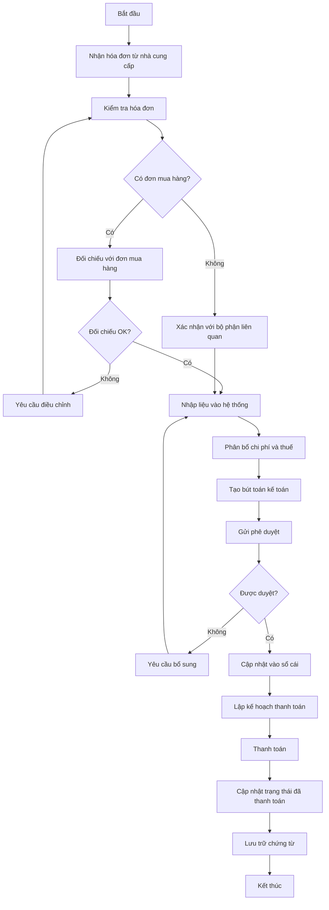
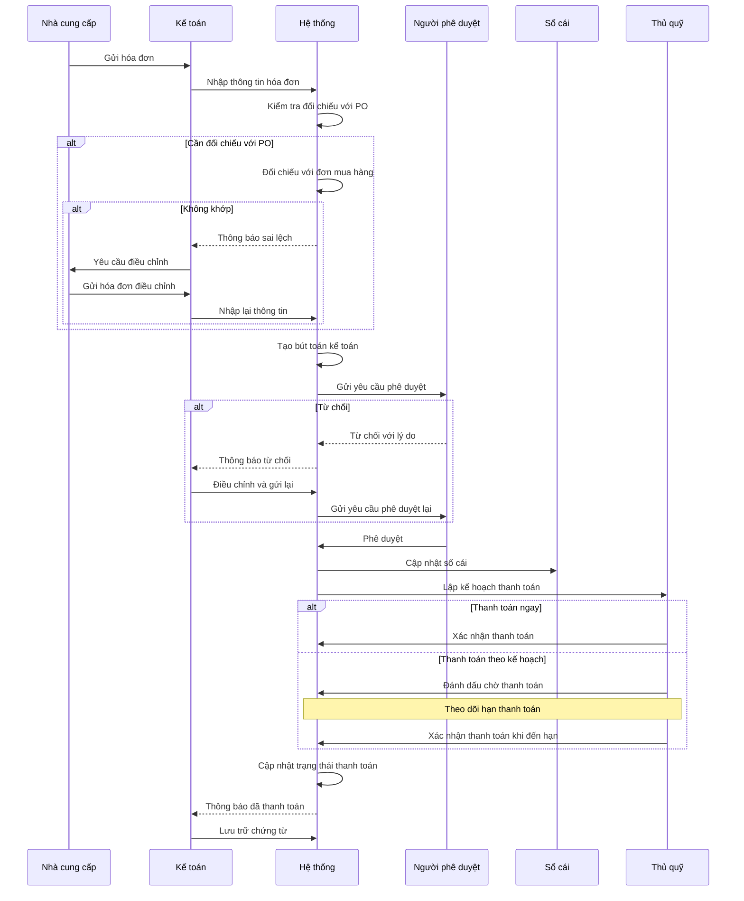
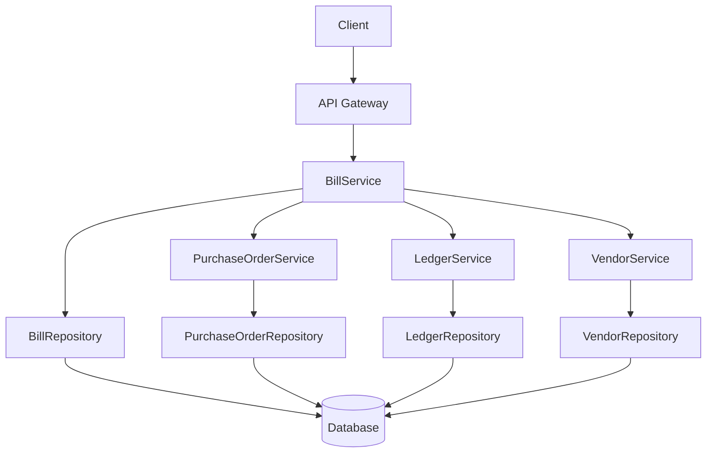
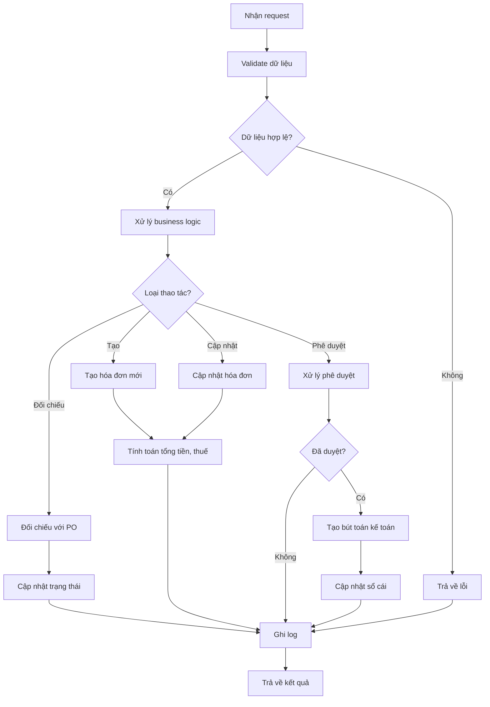

# PUR_003_Quản Lý Hóa Đơn Mua Vào

*Phiên bản: 1.1*  
*Người tạo: Auto Generated*  
*Ngày tạo: 25/07/2023*  
*Cập nhật lần cuối: 09/07/2024*  
*Người cập nhật: AI Assistant*

## 1. Tổng Quan Nghiệp Vụ

### 1.1. Mô Tả Nghiệp Vụ
Quản lý hóa đơn mua vào (bill management) là quy trình xử lý, kiểm soát và theo dõi các hóa đơn, chứng từ từ nhà cung cấp liên quan đến việc mua hàng hóa và dịch vụ. Hệ thống theo dõi toàn bộ chu trình của hóa đơn từ trạng thái nháp (draft), đến đang xem xét (in review), đã phê duyệt (approved), đã thanh toán (paid), hủy bỏ (canceled) và vô hiệu hóa (void). Quy trình này đảm bảo tất cả các khoản phải trả được ghi nhận chính xác, được phê duyệt đúng quy định và được thanh toán đúng hạn. Ngoài ra, quy trình này cũng là cơ sở để ghi nhận chi phí, hàng hóa vào hệ thống kế toán, đối chiếu với đơn mua hàng, và làm cơ sở cho việc khấu trừ thuế giá trị gia tăng đầu vào.

### 1.2. Phạm Vi Áp Dụng
Quy trình này áp dụng cho tất cả các hóa đơn mua vào trong doanh nghiệp, bao gồm:
- Bộ phận kế toán
- Bộ phận mua hàng
- Bộ phận kho
- Ban lãnh đạo phê duyệt thanh toán
- Các bộ phận liên quan đến việc nhận hàng hóa, dịch vụ từ nhà cung cấp

### 1.3. Định Nghĩa Thuật Ngữ
| Thuật ngữ | Định nghĩa |
|-----------|------------|
| Hóa đơn mua vào (BillModel) | Chứng từ do nhà cung cấp phát hành để yêu cầu thanh toán cho hàng hóa/dịch vụ đã cung cấp |
| Đơn mua hàng (PO) | Tài liệu chính thức gửi cho nhà cung cấp để yêu cầu cung cấp hàng hóa/dịch vụ |
| Phiếu nhập kho | Chứng từ ghi nhận việc nhập hàng hóa vào kho |
| Tài khoản phải trả | Tài khoản kế toán ghi nhận các khoản nợ phải trả cho nhà cung cấp |
| HĐGTGT | Hóa đơn giá trị gia tăng |
| Sổ cái (Ledger) | Hệ thống ghi chép kế toán chính của doanh nghiệp |
| BILL_STATUS_DRAFT | Trạng thái nháp của hóa đơn, chưa tác động đến sổ cái |
| BILL_STATUS_REVIEW | Trạng thái đang xem xét của hóa đơn |
| BILL_STATUS_APPROVED | Trạng thái đã phê duyệt của hóa đơn, đã ghi nhận vào sổ cái |
| BILL_STATUS_PAID | Trạng thái đã thanh toán của hóa đơn |
| BILL_STATUS_VOID | Trạng thái đã vô hiệu hóa của hóa đơn |
| BILL_STATUS_CANCELED | Trạng thái đã hủy của hóa đơn |

### 1.4. Tài Liệu Liên Quan

| STT | Mã tài liệu | Tên tài liệu | Mô tả |
|-----|-------------|--------------|-------|
| 1   | PUR_001 | Quản Lý Nhà Cung Cấp | Quy trình quản lý thông tin nhà cung cấp |
| 2   | PUR_002 | Quản Lý Đơn Mua Hàng | Quy trình tạo và quản lý đơn mua hàng |
| 3   | INV_005 | Quản Lý Nhập Xuất Kho | Quy trình nhập xuất kho |
| 4   | ACC_003 | Bút Toán Kế Toán | Quy trình tạo và quản lý các bút toán |
| 5   | ACC_006 | Quản Lý Thuế | Quy trình quản lý thuế GTGT và các loại thuế khác |

## 2. Quy Trình Nghiệp Vụ

### 2.1. Tổng Quan Quy Trình
Quy trình quản lý hóa đơn mua vào bao gồm các bước chính: nhận hóa đơn từ nhà cung cấp, kiểm tra đối chiếu với đơn mua hàng và phiếu nhập kho, nhập liệu vào hệ thống, phê duyệt, ghi nhận bút toán kế toán và thanh toán. Quy trình này đảm bảo tính chính xác và minh bạch trong quản lý các khoản phải trả cho nhà cung cấp.

### 2.2. Sơ Đồ Quy Trình (Business Flow)



### 2.3. Chi Tiết Các Bước Quy Trình

#### 2.3.1. Nhận hóa đơn từ nhà cung cấp
- **Mô tả**: Nhận hóa đơn từ nhà cung cấp qua email, bưu điện hoặc trực tiếp
- **Đầu vào**: Hóa đơn từ nhà cung cấp (bản cứng hoặc điện tử)
- **Đầu ra**: Hóa đơn đã tiếp nhận
- **Người thực hiện**: Nhân viên kế toán hoặc người được phân công
- **Điều kiện tiên quyết**: Nhà cung cấp đã gửi hóa đơn
- **Xử lý ngoại lệ**: Nếu hóa đơn không rõ ràng, liên hệ với nhà cung cấp để làm rõ

#### 2.3.2. Kiểm tra hóa đơn và đối chiếu
- **Mô tả**: Kiểm tra tính hợp lệ của hóa đơn và đối chiếu với đơn mua hàng, phiếu nhập kho
- **Đầu vào**: Hóa đơn, đơn mua hàng, phiếu nhập kho
- **Đầu ra**: Kết quả kiểm tra và đối chiếu
- **Người thực hiện**: Nhân viên kế toán
- **Điều kiện tiên quyết**: Đã có hóa đơn và đơn mua hàng liên quan
- **Xử lý ngoại lệ**: Nếu có sai lệch, làm việc với nhà cung cấp để xác nhận và điều chỉnh

#### 2.3.3. Nhập liệu và phân bổ
- **Mô tả**: Nhập thông tin hóa đơn vào hệ thống và phân bổ chi phí, thuế
- **Đầu vào**: Hóa đơn đã kiểm tra
- **Đầu ra**: Bản ghi hóa đơn trong hệ thống
- **Người thực hiện**: Nhân viên kế toán
- **Điều kiện tiên quyết**: Hóa đơn đã được kiểm tra và xác nhận là hợp lệ
- **Xử lý ngoại lệ**: Nếu có sai sót trong quá trình nhập liệu, cần sửa lại trước khi tiếp tục

#### 2.3.4. Tạo bút toán kế toán
- **Mô tả**: Tạo các bút toán kế toán liên quan đến hóa đơn
- **Đầu vào**: Thông tin hóa đơn đã nhập
- **Đầu ra**: Bút toán kế toán
- **Người thực hiện**: Nhân viên kế toán
- **Điều kiện tiên quyết**: Hóa đơn đã được nhập vào hệ thống
- **Xử lý ngoại lệ**: Nếu có lỗi trong bút toán, kiểm tra lại thông tin hóa đơn và điều chỉnh

#### 2.3.5. Phê duyệt và cập nhật sổ cái
- **Mô tả**: Gửi hóa đơn để phê duyệt và cập nhật vào sổ cái sau khi được duyệt
- **Đầu vào**: Hóa đơn và bút toán
- **Đầu ra**: Hóa đơn được phê duyệt và cập nhật vào sổ cái
- **Người thực hiện**: Kế toán trưởng/người được ủy quyền
- **Điều kiện tiên quyết**: Hóa đơn và bút toán đã được tạo đầy đủ
- **Xử lý ngoại lệ**: Nếu hóa đơn không được phê duyệt, cần xem xét lại và bổ sung thông tin

#### 2.3.6. Thanh toán và lưu trữ
- **Mô tả**: Lập kế hoạch thanh toán, thực hiện thanh toán và lưu trữ chứng từ
- **Đầu vào**: Hóa đơn đã được phê duyệt
- **Đầu ra**: Chứng từ thanh toán và trạng thái đã thanh toán
- **Người thực hiện**: Nhân viên kế toán, thủ quỹ
- **Điều kiện tiên quyết**: Hóa đơn đã được phê duyệt và đến hạn thanh toán
- **Xử lý ngoại lệ**: Xử lý các trường hợp thanh toán không thành công, thanh toán một phần

### 2.4. Sơ Đồ Tuần Tự (Sequence Diagram)



### 2.5. Luồng Nghiệp Vụ Thay Thế
- **Hóa đơn không có đơn mua hàng**: Trong trường hợp nhận hóa đơn cho các khoản chi phí không có đơn mua hàng trước đó (ví dụ: chi phí tiện ích, dịch vụ định kỳ), cần có quy trình xác nhận nội bộ từ bộ phận sử dụng dịch vụ
- **Thanh toán trước**: Với một số nhà cung cấp yêu cầu thanh toán trước, cần có quy trình phê duyệt đặc biệt và theo dõi việc nhận hàng/dịch vụ sau khi thanh toán
- **Hóa đơn điện tử**: Đối với hóa đơn điện tử, cần có quy trình xác thực, lưu trữ và quản lý phù hợp theo quy định của pháp luật

## 3. Yêu Cầu Chức Năng

### 3.1. Danh Sách Chức Năng

| STT | Mã chức năng | Tên chức năng | Mô tả | Độ ưu tiên |
|-----|--------------|---------------|-------|------------|
| 1   | BILL_LIST | Xem danh sách hóa đơn | Hiển thị danh sách hóa đơn mua vào với các bộ lọc và tìm kiếm | Cao |
| 2   | BILL_CREATE | Tạo hóa đơn mới | Nhập thông tin hóa đơn mới vào hệ thống | Cao |
| 3   | BILL_UPDATE | Cập nhật hóa đơn | Chỉnh sửa thông tin hóa đơn | Cao |
| 4   | BILL_VIEW | Xem chi tiết hóa đơn | Xem toàn bộ thông tin chi tiết của hóa đơn | Cao |
| 5   | BILL_APPROVE | Phê duyệt hóa đơn | Phê duyệt hoặc từ chối hóa đơn | Cao |
| 6   | BILL_STATUS | Cập nhật trạng thái | Cập nhật trạng thái của hóa đơn | Cao |
| 7   | BILL_PAYMENT | Quản lý thanh toán | Lập kế hoạch và thực hiện thanh toán hóa đơn | Cao |
| 8   | BILL_MATCH | Đối chiếu hóa đơn | Đối chiếu hóa đơn với đơn mua hàng và phiếu nhập kho | Cao |
| 9   | BILL_REPORT | Báo cáo hóa đơn | Tạo báo cáo về tình hình hóa đơn mua vào | Trung bình |
| 10  | BILL_EXPORT | Xuất dữ liệu | Xuất danh sách hóa đơn ra file Excel/PDF | Thấp |

### 3.2. Chi Tiết Chức Năng

#### 3.2.1. BILL_CREATE: Tạo hóa đơn mới
- **Mô tả**: Cho phép người dùng nhập thông tin hóa đơn mới vào hệ thống
- **Đầu vào**: Thông tin hóa đơn từ nhà cung cấp, bao gồm: nhà cung cấp, số hóa đơn, ngày hóa đơn, các mặt hàng/dịch vụ, số tiền, thuế, điều khoản thanh toán
- **Đầu ra**: Bản ghi hóa đơn mới trong hệ thống
- **Điều kiện tiên quyết**: Người dùng đã đăng nhập và có quyền tạo hóa đơn
- **Luồng xử lý chính**:
  1. Người dùng chọn "Tạo hóa đơn mới"
  2. Hệ thống hiển thị form nhập thông tin
  3. Người dùng chọn nhà cung cấp
  4. Hệ thống hiển thị các đơn mua hàng chưa đối chiếu với nhà cung cấp đó (nếu có)
  5. Người dùng có thể chọn đơn mua hàng để đối chiếu hoặc nhập hóa đơn độc lập
  6. Người dùng nhập thông tin hóa đơn: số hóa đơn, ngày, các mặt hàng, số tiền...
  7. Hệ thống tính toán tổng tiền, thuế
  8. Người dùng nhấn "Lưu" hoặc "Gửi phê duyệt"
  9. Hệ thống kiểm tra tính hợp lệ của dữ liệu
  10. Hệ thống lưu hóa đơn và hiển thị thông báo thành công
- **Luồng xử lý thay thế/ngoại lệ**:
  1. Nếu dữ liệu không hợp lệ, hiển thị thông báo lỗi
  2. Nếu số hóa đơn đã tồn tại cho cùng nhà cung cấp, cảnh báo trùng lặp
- **Giao diện liên quan**: Form tạo hóa đơn

#### 3.2.2. BILL_MATCH: Đối chiếu hóa đơn
- **Mô tả**: Cho phép đối chiếu hóa đơn với đơn mua hàng và phiếu nhập kho
- **Đầu vào**: ID hóa đơn, ID đơn mua hàng, ID phiếu nhập kho
- **Đầu ra**: Kết quả đối chiếu và bản ghi hóa đơn đã cập nhật trạng thái
- **Điều kiện tiên quyết**: Hóa đơn, đơn mua hàng và phiếu nhập kho đã tồn tại trong hệ thống
- **Luồng xử lý chính**:
  1. Người dùng chọn hóa đơn cần đối chiếu
  2. Hệ thống hiển thị thông tin hóa đơn và các đơn mua hàng/phiếu nhập kho liên quan
  3. Người dùng kiểm tra và xác nhận việc đối chiếu
  4. Hệ thống cập nhật trạng thái hóa đơn và đơn mua hàng
  5. Hệ thống hiển thị kết quả đối chiếu
- **Luồng xử lý thay thế/ngoại lệ**:
  1. Nếu có sai lệch, người dùng ghi chú lý do và có thể chọn chấp nhận sai lệch hoặc yêu cầu điều chỉnh
- **Giao diện liên quan**: Màn hình đối chiếu hóa đơn

## 4. Thiết Kế Kỹ Thuật

### 4.1. Kiến Trúc Hệ Thống



### 4.2. API Endpoints

#### 4.2.1. Lấy danh sách hóa đơn
- **Mô tả**: Trả về danh sách hóa đơn mua vào theo điều kiện lọc
- **URL**: `GET /api/v1/entity/{entity_slug}/bills/`
- **Query Parameters**:
  - `status`: Lọc theo trạng thái
  - `vendor`: Lọc theo nhà cung cấp
  - `date_range`: Lọc theo khoảng thời gian
  - `search`: Từ khóa tìm kiếm
  - `paid`: Lọc theo trạng thái thanh toán (true/false)
  - `page`: Số trang
  - `page_size`: Số bản ghi trên mỗi trang
  - `ordering`: Trường sắp xếp
- **Response**: Danh sách hóa đơn, phân trang

#### 4.2.2. Lấy chi tiết hóa đơn
- **Mô tả**: Trả về thông tin chi tiết của một hóa đơn
- **URL**: `GET /api/v1/entity/{entity_slug}/bills/{uuid}/`
- **Response**: Chi tiết hóa đơn và các dòng chi tiết

#### 4.2.3. Tạo hóa đơn mới
- **Mô tả**: Tạo hóa đơn mới trong hệ thống
- **URL**: `POST /api/v1/entity/{entity_slug}/bills/`
- **Request Body**: Thông tin hóa đơn
- **Response**: Thông tin hóa đơn đã tạo

#### 4.2.4. Cập nhật hóa đơn
- **Mô tả**: Cập nhật thông tin hóa đơn
- **URL**: `PUT /api/v1/entity/{entity_slug}/bills/{uuid}/`
- **Request Body**: Thông tin cập nhật
- **Response**: Thông tin hóa đơn đã cập nhật

#### 4.2.5. Cập nhật trạng thái hóa đơn
- **Mô tả**: Cập nhật trạng thái của hóa đơn
- **URL**: `PATCH /api/v1/entity/{entity_slug}/bills/{uuid}/status/`
- **Request Body**: Trạng thái mới, ghi chú
- **Response**: Thông tin trạng thái đã cập nhật

#### 4.2.6. Đối chiếu hóa đơn với đơn mua hàng
- **Mô tả**: Đối chiếu hóa đơn với đơn mua hàng
- **URL**: `POST /api/v1/entity/{entity_slug}/bills/{uuid}/match/`
- **Request Body**: Thông tin đối chiếu
- **Response**: Kết quả đối chiếu

### 4.3. Service Logic

#### 4.3.1. BillService
- **Mô tả**: Xử lý logic nghiệp vụ liên quan đến quản lý hóa đơn mua vào
- **Chức năng chính**:
  1. Tạo và quản lý hóa đơn
  2. Đối chiếu hóa đơn với đơn mua hàng
  3. Quản lý trạng thái hóa đơn
  4. Tính toán thuế, tổng tiền
  5. Tạo bút toán kế toán từ hóa đơn
- **Các dependencies**:
  1. BillRepository
  2. PurchaseOrderService
  3. LedgerService
  4. VendorService
- **Sơ đồ luồng xử lý**:



### 4.4. Mô Hình Dữ Liệu

#### 4.4.1. Entity Relationship Diagram (ERD)

```mermaid
erDiagram
    EntityModel ||--o{ BillModel : "có"
    VendorModel ||--o{ BillModel : "phát hành"
    PurchaseOrderModel ||--o{ BillModel : "liên kết với"
    LedgerModel ||--|| BillModel : "ghi nhận"
    
    BillModel ||--o{ ItemTransactionModel : "có"
    AccountModel }o--|| BillModel : "cash_account"
    AccountModel }o--|| BillModel : "prepaid_account"
    
    BillModel {
        UUID uuid PK
        FK EntityModel entity_model
        FK VendorModel vendor
        String terms
        String xref
        String bill_number
        String bill_status
        FK LedgerModel ledger
        FK AccountModel cash_account
        FK AccountModel prepaid_account
        FK AccountModel unearned_account
        Date date_draft
        Date date_in_review
        Date date_approved
        Date date_paid
        Date date_void
        Date date_canceled
        Date date_due
        String markdown_notes
        Decimal amount_due
        Decimal amount_paid
        Decimal amount_receivable
        Decimal amount_unearned
        Decimal amount_earned
    }
    
    ItemTransactionModel {
        UUID uuid PK
        FK BillModel bill_model
        FK ItemModel item_model
        String item_name
        String item_description
        Decimal quantity
        Decimal unit_cost
        Decimal total_amount
        String item_status
        String po_item_status
        String entity_unit
        Date date_draft
    }
```

#### 4.4.2. Chi Tiết Bảng Dữ Liệu

##### Bảng: BillModel
- **Mô tả**: Lưu trữ thông tin về hóa đơn mua vào
- **Các trường chính**:
  - `uuid`: Khóa chính, định danh duy nhất
  - `entity_model`: Khóa ngoại tham chiếu đến EntityModel
  - `vendor`: Khóa ngoại tham chiếu đến nhà cung cấp (VendorModel)
  - `terms`: Điều khoản thanh toán
  - `xref`: Tham chiếu ngoài (số hóa đơn của nhà cung cấp)
  - `bill_number`: Số hóa đơn trong hệ thống
  - `bill_status