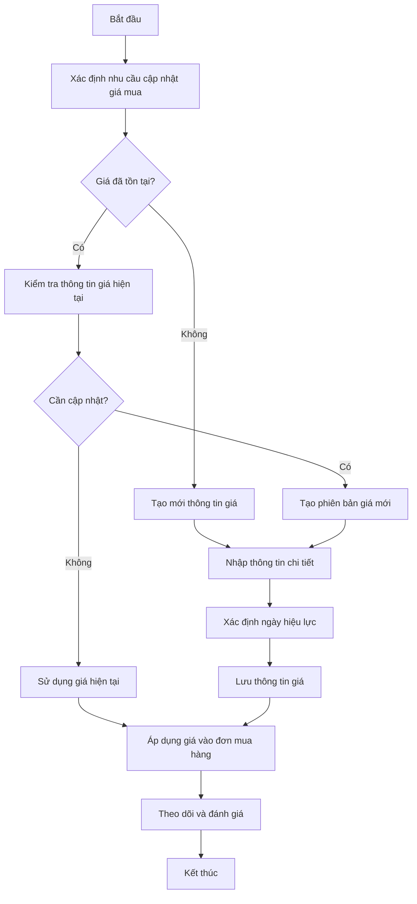
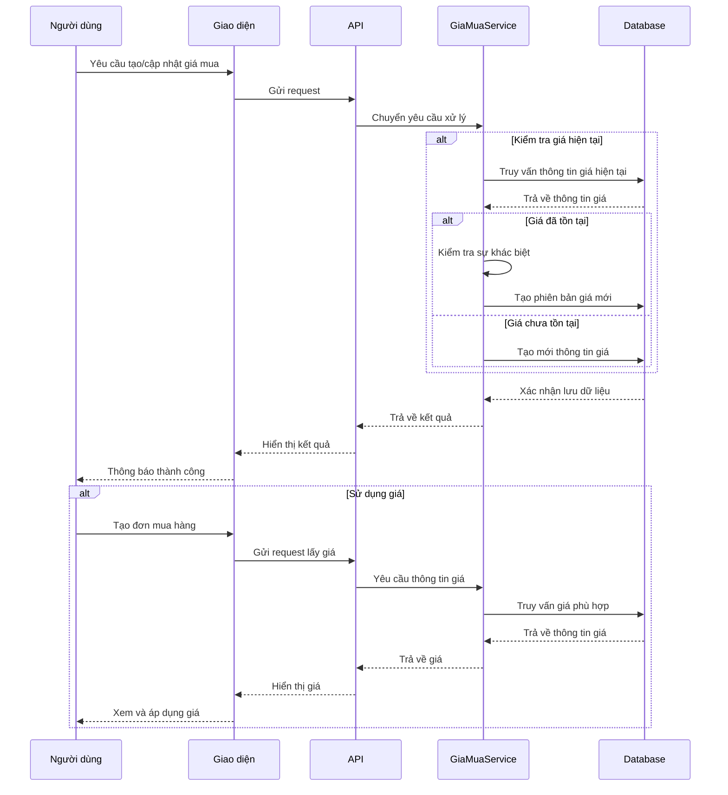
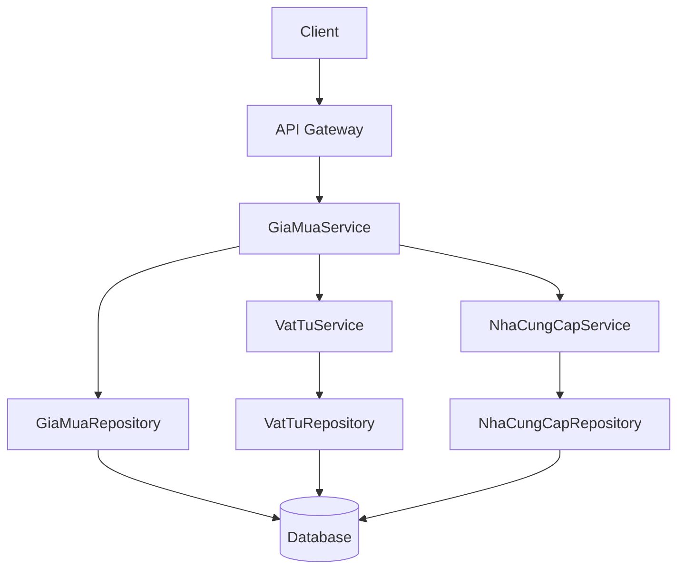
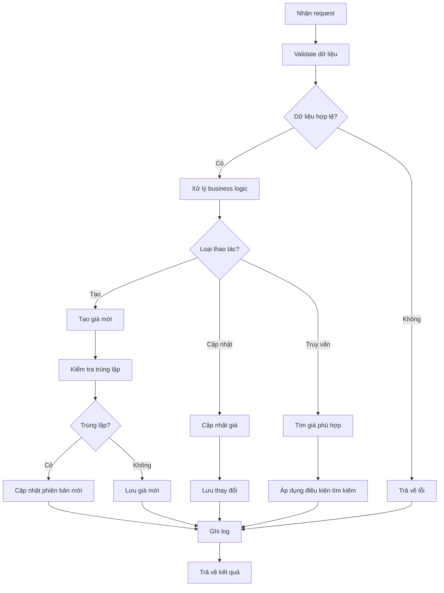

# PUR_004_Quản Lý Giá Mua

*Phiên bản: 1.1*  
*Người tạo: Auto Generated*  
*Ngày tạo: 25/07/2023*  
*Cập nhật lần cuối: 09/07/2024*  
*Người cập nhật: AI Assistant*

## 1. Tổng Quan Nghiệp Vụ

### 1.1. Mô Tả Nghiệp Vụ
Quản lý giá mua là quy trình thiết lập, cập nhật và theo dõi giá mua của hàng hóa, dịch vụ từ các nhà cung cấp khác nhau. Quy trình này giúp doanh nghiệp theo dõi sự thay đổi về giá, so sánh giữa các nhà cung cấp khác nhau, và tối ưu hóa chi phí mua hàng. Hệ thống cho phép lưu trữ lịch sử giá theo thời gian, thiết lập giá theo từng nhà cung cấp, và áp dụng các mức giá khác nhau tùy thuộc vào số lượng mua. Quản lý giá mua hiệu quả sẽ giúp doanh nghiệp kiểm soát chi phí đầu vào, đàm phán tốt hơn với nhà cung cấp, và đưa ra quyết định mua hàng thông minh hơn.

### 1.2. Phạm Vi Áp Dụng
Quy trình này áp dụng cho việc quản lý giá mua của tất cả hàng hóa và dịch vụ trong doanh nghiệp, bao gồm:
- Bộ phận mua hàng
- Bộ phận kế toán
- Bộ phận kho
- Ban lãnh đạo
- Các đơn vị có liên quan đến việc mua hàng

### 1.3. Định Nghĩa Thuật Ngữ
| Thuật ngữ | Định nghĩa |
|-----------|------------|
| Giá mua | Giá tiền để mua một đơn vị hàng hóa/dịch vụ từ nhà cung cấp |
| Vật tư | Hàng hóa, nguyên vật liệu cần mua |
| Đơn vị tính | Đơn vị đo lường của hàng hóa (cái, kg, thùng...) |
| Số lượng tối thiểu | Số lượng mua tối thiểu để áp dụng mức giá (dùng cho giá theo khối lượng) |
| Ngày hiệu lực | Ngày bắt đầu áp dụng mức giá |
| Ngoại tệ | Loại tiền tệ sử dụng trong giao dịch |
| Phiên bản giá | Các phiên bản giá khác nhau theo thời gian hoặc đợt điều chỉnh |
| Chiết khấu theo số lượng | Giảm giá dựa trên số lượng mua |

### 1.4. Tài Liệu Liên Quan

| STT | Mã tài liệu | Tên tài liệu | Mô tả |
|-----|-------------|--------------|-------|
| 1   | PUR_001 | Quản Lý Nhà Cung Cấp | Quy trình quản lý thông tin nhà cung cấp |
| 2   | PUR_002 | Quản Lý Đơn Mua Hàng | Quy trình tạo và quản lý đơn mua hàng |
| 3   | INV_002 | Quản Lý Vật Tư Sản Phẩm | Quy trình quản lý vật tư và sản phẩm |
| 4   | INV_004 | Quản Lý Đơn Vị Tính | Quy trình quản lý đơn vị tính và quy đổi đơn vị |

## 2. Quy Trình Nghiệp Vụ

### 2.1. Tổng Quan Quy Trình
Quy trình quản lý giá mua bao gồm việc thiết lập giá mua mới, cập nhật giá khi có thay đổi, quản lý phiên bản giá qua thời gian, và sử dụng thông tin giá trong quá trình mua hàng. Quá trình này đảm bảo doanh nghiệp luôn có thông tin giá cả chính xác và cập nhật nhất để đưa ra quyết định mua hàng hiệu quả.

### 2.2. Sơ Đồ Quy Trình (Business Flow)



### 2.3. Chi Tiết Các Bước Quy Trình

#### 2.3.1. Xác định nhu cầu cập nhật giá mua
- **Mô tả**: Xác định nhu cầu cập nhật thông tin giá mua từ nhà cung cấp
- **Đầu vào**: Báo giá mới từ nhà cung cấp, thông tin thị trường, kế hoạch mua hàng
- **Đầu ra**: Quyết định cập nhật giá
- **Người thực hiện**: Nhân viên mua hàng
- **Điều kiện tiên quyết**: Có thông tin giá mới hoặc cần thiết lập giá cho sản phẩm mới
- **Xử lý ngoại lệ**: Nếu thông tin không đầy đủ, cần liên hệ với nhà cung cấp để làm rõ

#### 2.3.2. Kiểm tra thông tin giá hiện tại
- **Mô tả**: Kiểm tra thông tin giá đã tồn tại trong hệ thống
- **Đầu vào**: Mã vật tư, mã nhà cung cấp
- **Đầu ra**: Thông tin giá hiện tại
- **Người thực hiện**: Nhân viên mua hàng
- **Điều kiện tiên quyết**: Vật tư và nhà cung cấp đã tồn tại trong hệ thống
- **Xử lý ngoại lệ**: Nếu không tìm thấy thông tin giá, chuyển sang tạo mới

#### 2.3.3. Tạo mới hoặc cập nhật thông tin giá
- **Mô tả**: Nhập thông tin giá mới hoặc cập nhật giá hiện tại
- **Đầu vào**: Thông tin giá mới (đơn giá, đơn vị tính, số lượng tối thiểu, ngày hiệu lực, ngoại tệ)
- **Đầu ra**: Bản ghi giá mua mới
- **Người thực hiện**: Nhân viên mua hàng
- **Điều kiện tiên quyết**: Đã có thông tin giá chính xác
- **Xử lý ngoại lệ**: Kiểm tra tính hợp lệ của dữ liệu (giá không âm, ngày hiệu lực hợp lệ...)

#### 2.3.4. Áp dụng giá vào đơn mua hàng
- **Mô tả**: Sử dụng thông tin giá trong quá trình tạo đơn mua hàng
- **Đầu vào**: Thông tin giá, thông tin đơn mua hàng
- **Đầu ra**: Đơn mua hàng với giá được áp dụng
- **Người thực hiện**: Nhân viên mua hàng
- **Điều kiện tiên quyết**: Đã có thông tin giá và đang tạo đơn mua hàng
- **Xử lý ngoại lệ**: Xử lý trường hợp nhiều mức giá khác nhau (theo số lượng, thời gian...)

#### 2.3.5. Theo dõi và đánh giá
- **Mô tả**: Theo dõi sự thay đổi giá và đánh giá hiệu quả
- **Đầu vào**: Lịch sử giá, dữ liệu mua hàng
- **Đầu ra**: Báo cáo phân tích giá
- **Người thực hiện**: Quản lý mua hàng
- **Điều kiện tiên quyết**: Đã có dữ liệu giá và mua hàng
- **Xử lý ngoại lệ**: Xử lý các trường hợp biến động giá bất thường

### 2.4. Sơ Đồ Tuần Tự (Sequence Diagram)



### 2.5. Luồng Nghiệp Vụ Thay Thế
- **Giá theo số lượng**: Thiết lập nhiều mức giá khác nhau cho cùng một sản phẩm dựa trên số lượng mua (giảm giá theo khối lượng)
- **Giá theo thời gian**: Thiết lập giá có thời hạn hiệu lực cụ thể (giá theo mùa, giá khuyến mãi)
- **Giá đàm phán**: Trong một số trường hợp đặc biệt, giá có thể được đàm phán riêng cho từng đơn hàng mà không sử dụng giá mặc định

## 3. Yêu Cầu Chức Năng

### 3.1. Danh Sách Chức Năng

| STT | Mã chức năng | Tên chức năng | Mô tả | Độ ưu tiên |
|-----|--------------|---------------|-------|------------|
| 1   | PRICE_LIST | Xem danh sách giá mua | Hiển thị danh sách giá mua với các bộ lọc và tìm kiếm | Cao |
| 2   | PRICE_CREATE | Tạo giá mua mới | Thêm thông tin giá mua mới vào hệ thống | Cao |
| 3   | PRICE_UPDATE | Cập nhật giá mua | Sửa đổi thông tin giá mua | Cao |
| 4   | PRICE_VIEW | Xem chi tiết giá mua | Xem toàn bộ thông tin chi tiết của giá mua | Cao |
| 5   | PRICE_HISTORY | Xem lịch sử giá | Xem lịch sử thay đổi giá của một sản phẩm | Trung bình |
| 6   | PRICE_COMPARE | So sánh giá | So sánh giá của cùng một sản phẩm giữa các nhà cung cấp | Trung bình |
| 7   | PRICE_IMPORT | Nhập giá từ file | Tải lên và nhập danh sách giá từ file Excel | Thấp |
| 8   | PRICE_EXPORT | Xuất danh sách ra file | Xuất danh sách giá ra file Excel | Thấp |

### 3.2. Chi Tiết Chức Năng

#### 3.2.1. PRICE_CREATE: Tạo giá mua mới
- **Mô tả**: Cho phép người dùng tạo thông tin giá mua mới trong hệ thống
- **Đầu vào**: Thông tin giá mua (vật tư, nhà cung cấp, đơn vị tính, ngày hiệu lực, ngoại tệ, số lượng tối thiểu, giá mua, trạng thái)
- **Đầu ra**: Bản ghi giá mua mới trong hệ thống
- **Điều kiện tiên quyết**: Người dùng đã đăng nhập và có quyền tạo giá mua, vật tư và nhà cung cấp đã tồn tại
- **Luồng xử lý chính**:
  1. Người dùng chọn "Tạo giá mua mới"
  2. Hệ thống hiển thị form nhập thông tin
  3. Người dùng chọn vật tư và nhà cung cấp
  4. Người dùng nhập các thông tin khác (đơn vị tính, số lượng, giá...)
  5. Người dùng nhấn "Lưu"
  6. Hệ thống kiểm tra tính hợp lệ của dữ liệu
  7. Hệ thống kiểm tra trùng lặp
  8. Hệ thống lưu thông tin giá mua mới
- **Luồng xử lý thay thế/ngoại lệ**:
  1. Nếu dữ liệu không hợp lệ, hiển thị thông báo lỗi
  2. Nếu đã tồn tại giá cho cùng vật tư, nhà cung cấp, đơn vị tính và số lượng, cảnh báo trùng lặp
- **Giao diện liên quan**: Form tạo giá mua

#### 3.2.2. PRICE_HISTORY: Xem lịch sử giá
- **Mô tả**: Cho phép người dùng xem lịch sử thay đổi giá của một sản phẩm
- **Đầu vào**: Mã vật tư, mã nhà cung cấp, khoảng thời gian
- **Đầu ra**: Danh sách các mức giá theo thời gian
- **Điều kiện tiên quyết**: Người dùng có quyền xem thông tin giá, vật tư đã tồn tại
- **Luồng xử lý chính**:
  1. Người dùng chọn vật tư cần xem lịch sử giá
  2. Người dùng chọn nhà cung cấp (tùy chọn)
  3. Người dùng chọn khoảng thời gian (tùy chọn)
  4. Hệ thống hiển thị lịch sử giá theo thời gian
  5. Người dùng có thể xem biểu đồ biến động giá
- **Luồng xử lý thay thế/ngoại lệ**:
  1. Nếu không có lịch sử giá, hiển thị thông báo "Không có dữ liệu lịch sử giá"
- **Giao diện liên quan**: Màn hình lịch sử giá, biểu đồ biến động giá

## 4. Thiết Kế Kỹ Thuật

### 4.1. Kiến Trúc Hệ Thống



### 4.2. API Endpoints

#### 4.2.1. Lấy danh sách giá mua
- **Mô tả**: Trả về danh sách giá mua theo điều kiện lọc
- **URL**: `GET /api/v1/entity/{entity_slug}/gia-mua/`
- **Query Parameters**:
  - `ma_vat_tu`: Lọc theo mã vật tư
  - `nha_cung_cap`: Lọc theo nhà cung cấp
  - `don_vi_tinh`: Lọc theo đơn vị tính
  - `ngay_hieu_luc`: Lọc theo ngày hiệu lực
  - `trang_thai`: Lọc theo trạng thái (1: active, 0: inactive)
  - `search`: Từ khóa tìm kiếm
  - `page`: Số trang
  - `page_size`: Số bản ghi trên mỗi trang
  - `ordering`: Trường sắp xếp
- **Response**: Danh sách giá mua, phân trang

#### 4.2.2. Lấy chi tiết giá mua
- **Mô tả**: Trả về thông tin chi tiết của một giá mua
- **URL**: `GET /api/v1/entity/{entity_slug}/gia-mua/{uuid}/`
- **Response**: Chi tiết giá mua

#### 4.2.3. Tạo giá mua mới
- **Mô tả**: Tạo giá mua mới trong hệ thống
- **URL**: `POST /api/v1/entity/{entity_slug}/gia-mua/`
- **Request Body**: Thông tin giá mua
- **Response**: Thông tin giá mua đã tạo

#### 4.2.4. Cập nhật giá mua
- **Mô tả**: Cập nhật thông tin giá mua
- **URL**: `PUT /api/v1/entity/{entity_slug}/gia-mua/{uuid}/`
- **Request Body**: Thông tin cập nhật
- **Response**: Thông tin giá mua đã cập nhật

#### 4.2.5. Lấy lịch sử giá
- **Mô tả**: Trả về lịch sử giá của một sản phẩm với nhà cung cấp
- **URL**: `GET /api/v1/entity/{entity_slug}/gia-mua/history/`
- **Query Parameters**:
  - `ma_vat_tu`: Mã vật tư (bắt buộc)
  - `nha_cung_cap`: Mã nhà cung cấp (tùy chọn)
  - `from_date`: Từ ngày
  - `to_date`: Đến ngày
- **Response**: Danh sách lịch sử giá theo thời gian

### 4.3. Service Logic

#### 4.3.1. GiaMuaService
- **Mô tả**: Xử lý logic nghiệp vụ liên quan đến quản lý giá mua
- **Chức năng chính**:
  1. Tạo và quản lý giá mua
  2. Truy vấn giá mua theo điều kiện
  3. Lưu trữ lịch sử giá
  4. Tìm giá phù hợp cho đơn mua hàng
  5. So sánh giá giữa các nhà cung cấp
- **Các dependencies**:
  1. GiaMuaRepository
  2. VatTuService
  3. NhaCungCapService
- **Sơ đồ luồng xử lý**:



### 4.4. Mô Hình Dữ Liệu

#### 4.4.1. Entity Relationship Diagram (ERD)

```mermaid
erDiagram
    EntityModel ||--o{ GiaMuaModel : "có"
    VatTuModel ||--o{ GiaMuaModel : "có giá"
    CustomerModel ||--o{ GiaMuaModel : "cung cấp giá"
    DonViTinhModel ||--o{ GiaMuaModel : "áp dụng cho"
    NgoaiTeModel ||--o{ GiaMuaModel : "tính bằng"
    
    GiaMuaModel {
        UUID uuid PK
        FK EntityModel entity_model
        FK VatTuModel ma_vat_tu
        FK DonViTinhModel don_vi_tinh
        DateTime ngay_hieu_luc
        FK CustomerModel nha_cung_cap
        FK NgoaiTeModel ngoai_te
        Int so_luong_tu
        Decimal gia_mua
        Int trang_thai
        DateTime created
        DateTime updated
    }
```

#### 4.4.2. Chi Tiết Bảng Dữ Liệu

##### Bảng: GiaMuaModel
- **Mô tả**: Lưu trữ thông tin về giá mua của vật tư từ nhà cung cấp
- **Các trường chính**:
  - `uuid`: Khóa chính, định danh duy nhất
  - `entity_model`: Khóa ngoại tham chiếu đến EntityModel
  - `ma_vat_tu`: Khóa ngoại tham chiếu đến vật tư (VatTuModel)
  - `don_vi_tinh`: Khóa ngoại tham chiếu đến đơn vị tính (DonViTinhModel)
  - `ngay_hieu_luc`: Ngày bắt đầu áp dụng giá
  - `nha_cung_cap`: Khóa ngoại tham chiếu đến nhà cung cấp (CustomerModel)
  - `ngoai_te`: Khóa ngoại tham chiếu đến ngoại tệ (NgoaiTeModel)
  - `so_luong_tu`: Số lượng tối thiểu để áp dụng mức giá
  - `gia_mua`: Giá mua
  - `trang_thai`: Trạng thái (1: active, 0: inactive)
  - `created`: Thời gian tạo
  - `updated`: Thời gian cập nhật

## 5. Kế Hoạch Kiểm Thử

### 5.1. Phạm Vi Kiểm Thử
Kiểm thử sẽ bao gồm tất cả các chức năng liên quan đến quản lý giá mua, bao gồm:
- Tạo mới giá mua
- Cập nhật giá mua
- Tìm kiếm và lọc giá mua
- Xem lịch sử giá
- Áp dụng giá vào đơn mua hàng
- Kiểm tra các trường hợp đặc biệt (trùng lặp, điều kiện số lượng...)

### 5.2. Kịch Bản Kiểm Thử

| STT | Mã kịch bản | Tên kịch bản | Mô tả | Điều kiện tiên quyết | Các bước | Kết quả mong đợi |
|-----|------------|--------------|-------|---------------------|----------|-----------------|
| 1   | TC_PRICE_C01 | Tạo giá mua mới thành công | Kiểm tra việc tạo giá mua mới | Vật tư và nhà cung cấp đã tồn tại | 1. Truy cập form tạo giá<br>2. Chọn vật tư, nhà cung cấp<br>3. Nhập giá và thông tin khác<br>4. Nhấn Lưu | Giá mua mới được tạo thành công |
| 2   | TC_PRICE_C02 | Tạo giá với dữ liệu thiếu | Kiểm tra validate dữ liệu bắt buộc | Người dùng đã đăng nhập | 1. Truy cập form tạo giá<br>2. Bỏ trống các trường bắt buộc<br>3. Nhấn Lưu | Hiển thị thông báo lỗi về các trường bắt buộc |
| 3   | TC_PRICE_U01 | Cập nhật giá mua | Kiểm tra cập nhật giá | Giá mua đã tồn tại | 1. Mở form cập nhật<br>2. Thay đổi giá<br>3. Nhấn Lưu | Thông tin giá được cập nhật thành công |
| 4   | TC_PRICE_H01 | Xem lịch sử giá | Kiểm tra hiển thị lịch sử giá | Có nhiều bản ghi giá cho cùng vật tư | 1. Chọn vật tư<br>2. Xem lịch sử giá | Hiển thị danh sách lịch sử giá theo thời gian |
| 5   | TC_PRICE_Q01 | Tìm giá phù hợp | Kiểm tra việc tìm giá phù hợp | Có nhiều mức giá cho cùng vật tư | 1. Tạo đơn mua hàng<br>2. Chọn vật tư và nhà cung cấp<br>3. Nhập số lượng | Hệ thống tự động áp dụng mức giá phù hợp nhất |

## 6. Phụ Lục

### 6.1. Danh Sách Tài Liệu Tham Khảo
1. Tài liệu thiết kế cơ sở dữ liệu ERP
2. Tài liệu API đặc tả
3. Quy định về quản lý giá mua của doanh nghiệp

### 6.2. Danh Mục Thuật Ngữ
- **GiaMuaModel**: Mô hình dữ liệu lưu trữ thông tin giá mua
- **VatTuModel**: Mô hình dữ liệu vật tư/hàng hóa
- **CustomerModel**: Mô hình dữ liệu khách hàng/nhà cung cấp
- **Volume pricing**: Giá theo khối lượng, giảm giá