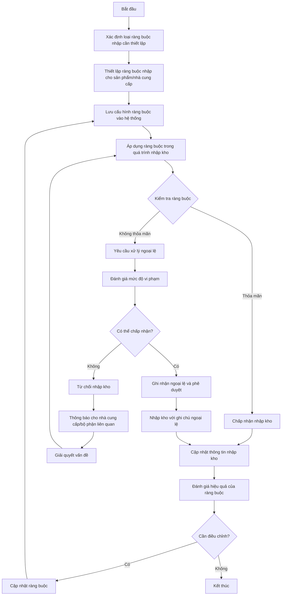
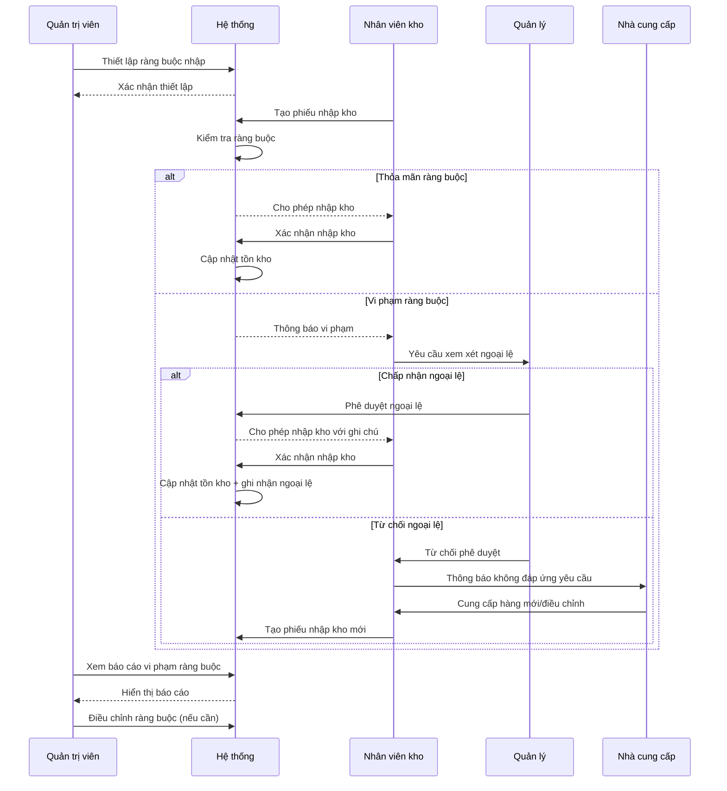
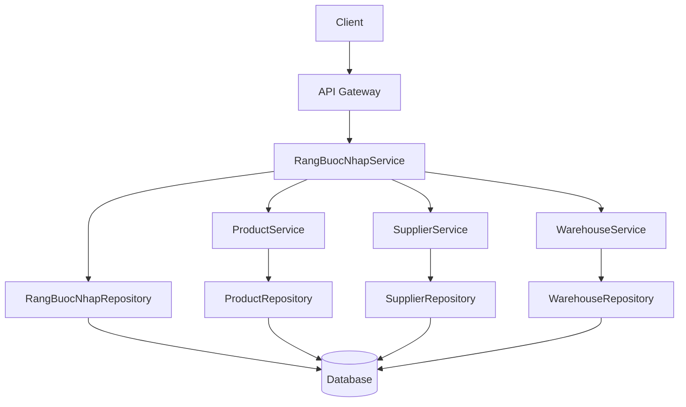
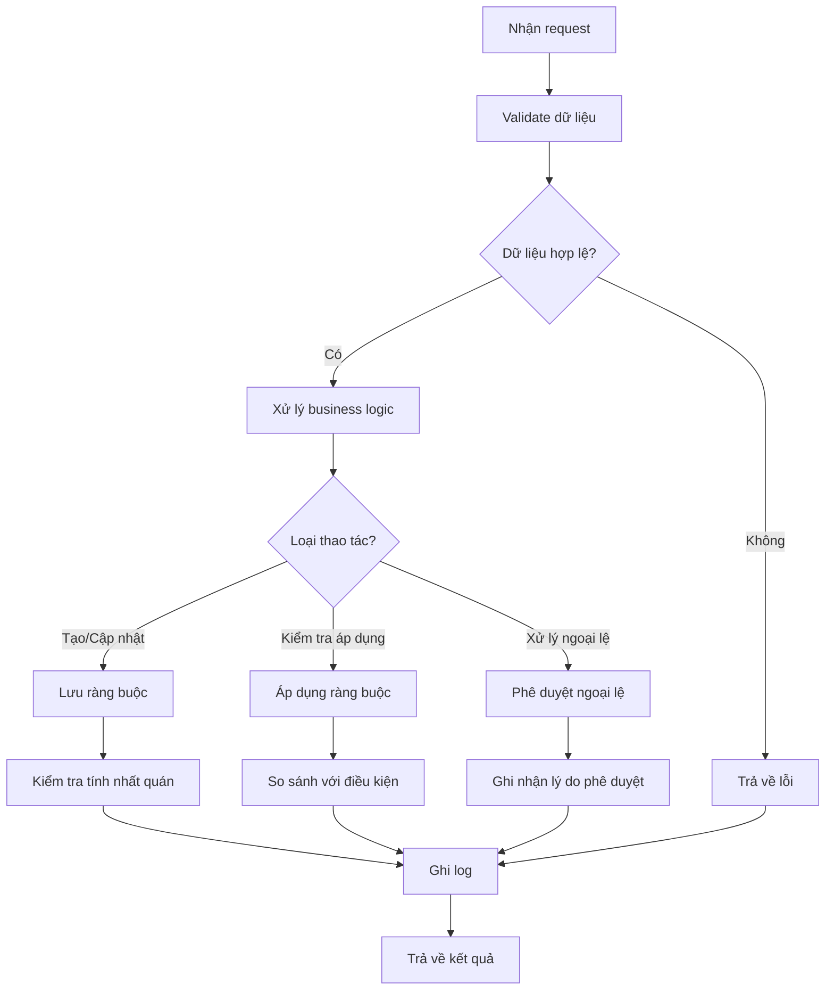

# PUR_005_Quản Lý Ràng Buộc Nhập

*Phiên bản: 1.1*  
*Người tạo: Auto Generated*  
*Ngày tạo: 25/07/2023*  
*Cập nhật lần cuối: 09/07/2024*  
*Người cập nhật: AI Assistant*

## 1. Tổng Quan Nghiệp Vụ

### 1.1. Mô Tả Nghiệp Vụ
Quản lý ràng buộc nhập là quy trình thiết lập và quản lý các điều kiện, ràng buộc khi thực hiện ghi chép kế toán liên quan đến các tài khoản trong hệ thống. Mỗi tài khoản có thể có một hoặc nhiều ràng buộc cần phải nhập khi thực hiện ghi chép kế toán, ví dụ như bộ phận, dự án, hoặc các thông tin bắt buộc khác. Hệ thống cho phép cấu hình các ràng buộc này là bắt buộc hoặc không bắt buộc, đảm bảo tính chính xác và đầy đủ của dữ liệu kế toán. Quy trình này giúp doanh nghiệp kiểm soát chặt chẽ quá trình nhập liệu, ngăn ngừa rủi ro sai sót và đảm bảo tính hiệu quả trong quản lý kế toán.

### 1.2. Phạm Vi Áp Dụng
Quy trình này áp dụng cho tất cả các hoạt động liên quan đến nhập hàng vào kho trong doanh nghiệp, bao gồm:
- Bộ phận kho
- Bộ phận mua hàng
- Bộ phận kiểm soát chất lượng
- Kế toán kho
- Người quản lý có liên quan đến quá trình phê duyệt

### 1.3. Định Nghĩa Thuật Ngữ
| Thuật ngữ | Định nghĩa |
|-----------|------------|
| AccountConstraintModel | Model đại diện cho các ràng buộc/yêu cầu cho các bút toán tài khoản |
| Ràng buộc nhập | Các điều kiện, quy định bắt buộc phải tuân thủ khi nhập dữ liệu kế toán |
| constraint_code | Mã đại diện cho ràng buộc (ví dụ: BP cho Bộ phận, VV cho Vụ việc) |
| constraint_line | Số thứ tự dòng/trật tự của ràng buộc |
| constraint_name | Tên người đọc được của ràng buộc |
| is_mandatory | Trường Boolean xác định ràng buộc này có bắt buộc hay không |
| Account | Tài khoản kế toán mà ràng buộc được áp dụng |

### 1.4. Tài Liệu Liên Quan

| STT | Mã tài liệu | Tên tài liệu | Mô tả |
|-----|-------------|--------------|-------|
| 1   | ACC_001 | Sơ Đồ Tài Khoản | Quy trình thiết lập và quản lý hệ thống tài khoản kế toán |
| 2   | ACC_003 | Bút Toán Kế Toán | Quy trình tạo và quản lý các bút toán |
| 3   | PUR_002 | Quản Lý Đơn Mua Hàng | Quy trình tạo và quản lý đơn mua hàng |
| 4   | PUR_003 | Quản Lý Hóa Đơn Mua Vào | Quy trình quản lý hóa đơn mua vào |

## 2. Quy Trình Nghiệp Vụ

### 2.1. Tổng Quan Quy Trình
Quy trình quản lý ràng buộc nhập bao gồm việc thiết lập các ràng buộc cho các tài khoản kế toán, xác định tính bắt buộc của mỗi ràng buộc, áp dụng các ràng buộc này trong quá trình nhập liệu kế toán, kiểm tra sự tuân thủ, và xử lý các trường hợp ngoại lệ. Quy trình này đảm bảo dữ liệu kế toán được ghi nhận đầy đủ các thông tin cần thiết theo yêu cầu quản lý của doanh nghiệp.

### 2.2. Sơ Đồ Quy Trình (Business Flow)



### 2.3. Chi Tiết Các Bước Quy Trình

#### 2.3.1. Xác định và thiết lập ràng buộc nhập
- **Mô tả**: Xác định các loại ràng buộc cần thiết và thiết lập điều kiện cụ thể
- **Đầu vào**: Yêu cầu nghiệp vụ, đặc tính sản phẩm, quy định của doanh nghiệp
- **Đầu ra**: Danh sách ràng buộc được thiết lập
- **Người thực hiện**: Quản lý kho, quản lý mua hàng
- **Điều kiện tiên quyết**: Đã có thông tin đầy đủ về sản phẩm, nhà cung cấp
- **Xử lý ngoại lệ**: Tham khảo ý kiến từ bộ phận chuyên môn nếu cần

#### 2.3.2. Áp dụng ràng buộc trong quá trình nhập kho
- **Mô tả**: Sử dụng các ràng buộc đã thiết lập khi tiến hành nhập hàng
- **Đầu vào**: Thông tin hàng nhập, ràng buộc đã thiết lập
- **Đầu ra**: Kết quả kiểm tra ràng buộc
- **Người thực hiện**: Nhân viên kho
- **Điều kiện tiên quyết**: Ràng buộc đã được thiết lập trong hệ thống
- **Xử lý ngoại lệ**: Báo cáo trường hợp không đáp ứng ràng buộc

#### 2.3.3. Xử lý ngoại lệ
- **Mô tả**: Đánh giá và xử lý các trường hợp không đáp ứng ràng buộc
- **Đầu vào**: Thông tin vi phạm ràng buộc
- **Đầu ra**: Quyết định chấp nhận hoặc từ chối
- **Người thực hiện**: Quản lý kho, người có thẩm quyền
- **Điều kiện tiên quyết**: Đã phát hiện trường hợp vi phạm ràng buộc
- **Xử lý ngoại lệ**: Ghi nhận lý do chấp nhận ngoại lệ nếu được phê duyệt

#### 2.3.4. Đánh giá và cập nhật ràng buộc
- **Mô tả**: Đánh giá hiệu quả của ràng buộc và điều chỉnh nếu cần
- **Đầu vào**: Dữ liệu về việc áp dụng ràng buộc, phản hồi từ người dùng
- **Đầu ra**: Ràng buộc được cập nhật
- **Người thực hiện**: Quản lý kho, quản lý mua hàng
- **Điều kiện tiên quyết**: Đã thu thập đủ dữ liệu để đánh giá
- **Xử lý ngoại lệ**: Xem xét các yếu tố thị trường, thay đổi trong chuỗi cung ứng

### 2.4. Sơ Đồ Tuần Tự (Sequence Diagram)



### 2.5. Luồng Nghiệp Vụ Thay Thế
- **Ràng buộc tạm thời**: Trong một số trường hợp đặc biệt (như mùa cao điểm, sự kiện đặc biệt), có thể thiết lập các ràng buộc tạm thời với độ nghiêm ngặt khác với ràng buộc thông thường
- **Ràng buộc theo lô hàng**: Áp dụng các ràng buộc khác nhau cho từng lô hàng cụ thể dựa trên yêu cầu đặc biệt của dự án hoặc đơn hàng
- **Quy trình nhập khẩn cấp**: Trong trường hợp khẩn cấp, có thể áp dụng quy trình rút gọn với các ràng buộc tối thiểu, nhưng phải có sự phê duyệt từ cấp quản lý cao

## 3. Yêu Cầu Chức Năng

### 3.1. Danh Sách Chức Năng

| STT | Mã chức năng | Tên chức năng | Mô tả | Độ ưu tiên |
|-----|--------------|---------------|-------|------------|
| 1   | RB_LIST | Xem danh sách ràng buộc | Hiển thị danh sách các ràng buộc nhập với bộ lọc và tìm kiếm | Cao |
| 2   | RB_CREATE | Tạo ràng buộc mới | Thêm ràng buộc nhập mới vào hệ thống | Cao |
| 3   | RB_UPDATE | Cập nhật ràng buộc | Chỉnh sửa thông tin ràng buộc | Cao |
| 4   | RB_VIEW | Xem chi tiết ràng buộc | Xem toàn bộ thông tin chi tiết của ràng buộc | Cao |
| 5   | RB_DELETE | Xóa ràng buộc | Xóa ràng buộc khỏi hệ thống | Trung bình |
| 6   | RB_APPLY | Áp dụng ràng buộc | Sử dụng ràng buộc khi nhập kho | Cao |
| 7   | RB_EXCEPTION | Quản lý ngoại lệ | Xử lý các trường hợp ngoại lệ không đáp ứng ràng buộc | Cao |
| 8   | RB_REPORT | Báo cáo vi phạm | Tạo báo cáo về các vi phạm ràng buộc | Trung bình |

### 3.2. Chi Tiết Chức Năng

#### 3.2.1. RB_CREATE: Tạo ràng buộc mới
- **Mô tả**: Cho phép người dùng tạo ràng buộc nhập mới trong hệ thống
- **Đầu vào**: Thông tin ràng buộc (loại ràng buộc, đối tượng áp dụng, điều kiện, giá trị)
- **Đầu ra**: Bản ghi ràng buộc mới trong hệ thống
- **Điều kiện tiên quyết**: Người dùng đã đăng nhập và có quyền tạo ràng buộc
- **Luồng xử lý chính**:
  1. Người dùng chọn "Tạo ràng buộc mới"
  2. Hệ thống hiển thị form nhập thông tin
  3. Người dùng chọn loại ràng buộc (chất lượng, số lượng, thời gian...)
  4. Người dùng chọn đối tượng áp dụng (sản phẩm, nhà cung cấp, kho...)
  5. Người dùng thiết lập điều kiện và giá trị giới hạn
  6. Người dùng nhấn "Lưu"
  7. Hệ thống kiểm tra tính hợp lệ của dữ liệu
  8. Hệ thống lưu ràng buộc mới và hiển thị thông báo thành công
- **Luồng xử lý thay thế/ngoại lệ**:
  1. Nếu dữ liệu không hợp lệ, hiển thị thông báo lỗi
  2. Nếu ràng buộc mâu thuẫn với ràng buộc khác, cảnh báo người dùng
- **Giao diện liên quan**: Form tạo ràng buộc

#### 3.2.2. RB_APPLY: Áp dụng ràng buộc
- **Mô tả**: Cho phép áp dụng ràng buộc trong quá trình nhập kho
- **Đầu vào**: Thông tin phiếu nhập kho, danh sách ràng buộc áp dụng
- **Đầu ra**: Kết quả kiểm tra ràng buộc
- **Điều kiện tiên quyết**: Đang thực hiện nhập kho, ràng buộc đã được thiết lập
- **Luồng xử lý chính**:
  1. Người dùng tạo phiếu nhập kho
  2. Hệ thống tự động áp dụng các ràng buộc liên quan
  3. Hệ thống kiểm tra từng mục trong phiếu nhập với ràng buộc tương ứng
  4. Hệ thống hiển thị kết quả kiểm tra (đạt/không đạt)
  5. Nếu tất cả đều đạt, cho phép hoàn tất nhập kho
- **Luồng xử lý thay thế/ngoại lệ**:
  1. Nếu có mục không đạt, hiển thị thông báo chi tiết
  2. Cho phép người dùng yêu cầu phê duyệt ngoại lệ
- **Giao diện liên quan**: Màn hình nhập kho, form kiểm tra ràng buộc

## 4. Thiết Kế Kỹ Thuật

### 4.1. Kiến Trúc Hệ Thống



### 4.2. API Endpoints

#### 4.2.1. Lấy danh sách ràng buộc nhập
- **Mô tả**: Trả về danh sách ràng buộc nhập theo điều kiện lọc
- **URL**: `GET /api/v1/entity/{entity_slug}/rang-buoc-nhap/`
- **Query Parameters**:
  - `loai_rang_buoc`: Lọc theo loại ràng buộc
  - `doi_tuong`: Lọc theo đối tượng áp dụng (sản phẩm, nhà cung cấp...)
  - `id_doi_tuong`: ID của đối tượng áp dụng
  - `trang_thai`: Lọc theo trạng thái (active/inactive)
  - `search`: Từ khóa tìm kiếm
  - `page`: Số trang
  - `page_size`: Số bản ghi trên mỗi trang
  - `ordering`: Trường sắp xếp
- **Response**: Danh sách ràng buộc nhập, phân trang

#### 4.2.2. Lấy chi tiết ràng buộc nhập
- **Mô tả**: Trả về thông tin chi tiết của một ràng buộc nhập
- **URL**: `GET /api/v1/entity/{entity_slug}/rang-buoc-nhap/{uuid}/`
- **Response**: Chi tiết ràng buộc nhập

#### 4.2.3. Tạo ràng buộc nhập mới
- **Mô tả**: Tạo ràng buộc nhập mới trong hệ thống
- **URL**: `POST /api/v1/entity/{entity_slug}/rang-buoc-nhap/`
- **Request Body**: Thông tin ràng buộc nhập
- **Response**: Thông tin ràng buộc nhập đã tạo

#### 4.2.4. Cập nhật ràng buộc nhập
- **Mô tả**: Cập nhật thông tin ràng buộc nhập
- **URL**: `PUT /api/v1/entity/{entity_slug}/rang-buoc-nhap/{uuid}/`
- **Request Body**: Thông tin cập nhật
- **Response**: Thông tin ràng buộc nhập đã cập nhật

#### 4.2.5. Kiểm tra áp dụng ràng buộc
- **Mô tả**: Kiểm tra một loạt mục có đáp ứng ràng buộc hay không
- **URL**: `POST /api/v1/entity/{entity_slug}/rang-buoc-nhap/check/`
- **Request Body**: Danh sách mục cần kiểm tra
- **Response**: Kết quả kiểm tra từng mục

### 4.3. Service Logic

#### 4.3.1. RangBuocNhapService
- **Mô tả**: Xử lý logic nghiệp vụ liên quan đến quản lý ràng buộc nhập
- **Chức năng chính**:
  1. Tạo và quản lý ràng buộc nhập
  2. Áp dụng ràng buộc khi nhập kho
  3. Kiểm tra sự tuân thủ
  4. Xử lý ngoại lệ
  5. Báo cáo vi phạm
- **Các dependencies**:
  1. RangBuocNhapRepository
  2. ProductService
  3. SupplierService
  4. WarehouseService
- **Sơ đồ luồng xử lý**:



### 4.4. Mô Hình Dữ Liệu

#### 4.4.1. Entity Relationship Diagram (ERD)

```mermaid
erDiagram
    EntityModel ||--o{ RangBuocNhapModel : "có"
    RangBuocNhapModel ||--o{ RangBuocNhapDetailModel : "có"
    
    RangBuocNhapModel {
        UUID uuid PK
        FK EntityModel entity_model
        String ma_rang_buoc
        String ten_rang_buoc
        String mo_ta
        Int trang_thai
        DateTime created
        DateTime updated
    }
    
    RangBuocNhapDetailModel {
        UUID uuid PK
        FK RangBuocNhapModel rang_buoc_nhap
        String loai_rang_buoc
        String loai_doi_tuong
        String id_doi_tuong
        String ten_doi_tuong
        String dieu_kien
        String gia_tri
        String thong_bao
        Int muc_do
        Int cho_phep_ngoai_le
        Int trang_thai
    }
    
    RangBuocNhapExceptionModel {
        UUID uuid PK
        FK RangBuocNhapDetailModel rang_buoc_detail
        FK PhieuNhapKhoModel phieu_nhap_kho
        String ly_do
        FK UserModel nguoi_phe_duyet
        DateTime ngay_phe_duyet
        String ghi_chu
    }
```

#### 4.4.2. Chi Tiết Bảng Dữ Liệu

##### Bảng: RangBuocNhapModel
- **Mô tả**: Lưu trữ thông tin về nhóm ràng buộc nhập
- **Các trường chính**:
  - `uuid`: Khóa chính, định danh duy nhất
  - `entity_model`: Khóa ngoại tham chiếu đến EntityModel
  - `ma_rang_buoc`: Mã ràng buộc
  - `ten_rang_buoc`: Tên ràng buộc
  - `mo_ta`: Mô tả chi tiết về ràng buộc
  - `trang_thai`: Trạng thái (1: active, 0: inactive)
  - `created`: Thời gian tạo
  - `updated`: Thời gian cập nhật

##### Bảng: RangBuocNhapDetailModel
- **Mô tả**: Lưu trữ chi tiết các điều kiện của ràng buộc
- **Các trường chính**:
  - `uuid`: Khóa chính, định danh duy nhất
  - `rang_buoc_nhap`: Khóa ngoại tham chiếu đến RangBuocNhapModel
  - `loai_rang_buoc`: Loại ràng buộc (chất lượng, số lượng, thời gian...)
  - `loai_doi_tuong`: Loại đối tượng áp dụng (sản phẩm, nhà cung cấp, kho...)
  - `id_doi_tuong`: ID của đối tượng áp dụng
  - `ten_doi_tuong`: Tên của đối tượng áp dụng
  - `dieu_kien`: Điều kiện áp dụng (=, >, <, >=, <=, between...)
  - `gia_tri`: Giá trị của điều kiện
  - `thong_bao`: Thông báo khi vi phạm ràng buộc
  - `muc_do`: Mức độ nghiêm trọng (1: cảnh báo, 2: lỗi)
  - `cho_phep_ngoai_le`: Có cho phép ngoại lệ hay không (1: có, 0: không)
  - `trang_thai`: Trạng thái (1: active, 0: inactive)

##### Bảng: RangBuocNhapExceptionModel
- **Mô tả**: Lưu trữ thông tin về các ngoại lệ đã được phê duyệt
- **Các trường chính**:
  - `uuid`: Khóa chính, định danh duy nhất
  - `rang_buoc_detail`: Khóa ngoại tham chiếu đến RangBuocNhapDetailModel
  - `phieu_nhap_kho`: Khóa ngoại tham chiếu đến PhieuNhapKhoModel
  - `ly_do`: Lý do chấp nhận ngoại lệ
  - `nguoi_phe_duyet`: Khóa ngoại tham chiếu đến UserModel
  - `ngay_phe_duyet`: Ngày phê duyệt ngoại lệ
  - `ghi_chu`: Ghi chú thêm

## 5. Kế Hoạch Kiểm Thử

### 5.1. Phạm Vi Kiểm Thử
Kiểm thử sẽ bao gồm tất cả các chức năng liên quan đến quản lý ràng buộc nhập, bao gồm:
- Tạo mới ràng buộc nhập
- Cập nhật ràng buộc nhập
- Áp dụng ràng buộc trong quá trình nhập kho
- Xử lý các trường hợp ngoại lệ
- Báo cáo vi phạm ràng buộc

### 5.2. Kịch Bản Kiểm Thử

| STT | Mã kịch bản | Tên kịch bản | Mô tả | Điều kiện tiên quyết | Các bước | Kết quả mong đợi |
|-----|------------|--------------|-------|---------------------|----------|-----------------|
| 1   | TC_RB_C01 | Tạo ràng buộc mới thành công | Kiểm tra việc tạo ràng buộc mới | Người dùng đã đăng nhập và có quyền | 1. Truy cập form tạo ràng buộc<br>2. Nhập thông tin hợp lệ<br>3. Nhấn Lưu | Ràng buộc mới được tạo thành công |
| 2   | TC_RB_C02 | Tạo ràng buộc với dữ liệu thiếu | Kiểm tra validate dữ liệu bắt buộc | Người dùng đã đăng nhập | 1. Truy cập form tạo ràng buộc<br>2. Bỏ trống các trường bắt buộc<br>3. Nhấn Lưu | Hiển thị thông báo lỗi về các trường bắt buộc |
| 3   | TC_RB_A01 | Áp dụng ràng buộc khi nhập kho | Kiểm tra áp dụng ràng buộc | Đã có ràng buộc và đang nhập kho | 1. Tạo phiếu nhập kho<br>2. Nhập thông tin vi phạm ràng buộc<br>3. Xác nhận | Hệ thống thông báo vi phạm ràng buộc |
| 4   | TC_RB_E01 | Xử lý ngoại lệ | Kiểm tra quy trình xử lý ngoại lệ | Đã có vi phạm ràng buộc | 1. Yêu cầu xử lý ngoại lệ<br>2. Phê duyệt ngoại lệ | Hệ thống cho phép nhập kho với ghi chú ngoại lệ |

## 6. Phụ Lục

### 6.1. Danh Sách Tài Liệu Tham Khảo
1. Tài liệu thiết kế cơ sở dữ liệu ERP
2. Tài liệu API đặc tả
3. Quy định về quản lý nhập kho của doanh nghiệp

### 6.2. Danh Mục Thuật Ngữ
- **Ràng buộc nhập**: Điều kiện bắt buộc khi nhập hàng vào kho
- **Ngoại lệ**: Trường hợp được chấp nhận nhập hàng mặc dù vi phạm ràng buộc
- **Phiếu nhập kho**: Chứng từ ghi nhận việc nhập hàng vào kho
- **Mức độ nghiêm trọng**: Phân loại mức độ quan trọng của ràng buộc (cảnh báo/lỗi)

### 6.3. Lịch Sử Thay Đổi Tài Liệu

| Phiên bản | Ngày | Người thực hiện | Mô tả thay đổi |
|-----------|------|-----------------|---------------|
| 1.0 | 25/07/2023 | Auto Generated | Tạo tài liệu ban đầu |