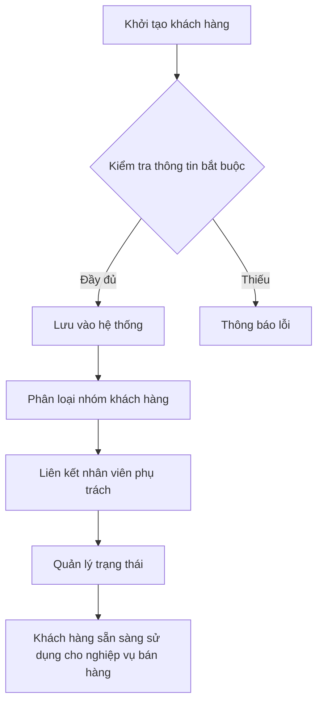
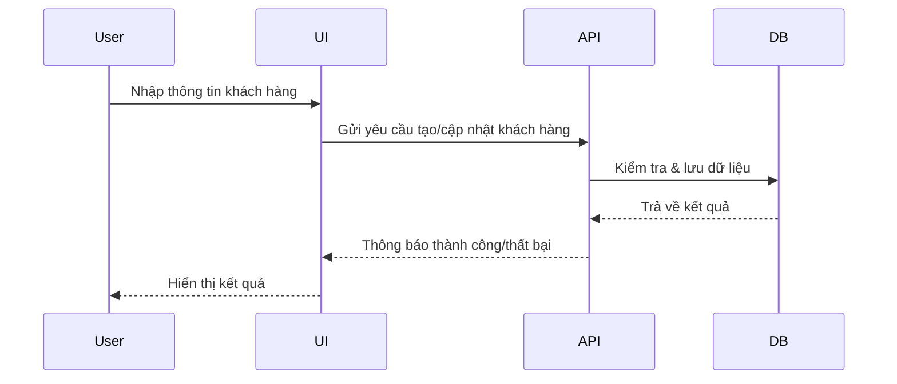

# SAL_001_Quản_Lý_Khách_Hàng

*Phiên bản: 1.0*  
*Người tạo: [Tên Tác Giả]*  
*Ngày tạo: [DD/MM/YYYY]*  
*Cập nhật lần cuối: [DD/MM/YYYY]*  
*Người cập nhật: [Tên Người Cập Nhật]*

---

## 1. Tổng Quan Nghiệp Vụ

### 1.1. Mô Tả Nghiệp Vụ
Quản lý toàn bộ thông tin khách hàng (Customer), bao gồm tạo mới, cập nhật, xóa, tìm kiếm, phân loại nhóm khách hàng, quản lý trạng thái hoạt động, liên kết với nhân viên bán hàng, tài khoản, phương thức thanh toán, hạn mức tín dụng, khu vực, thông tin liên hệ, v.v. Đảm bảo dữ liệu khách hàng đầy đủ, chính xác, phục vụ các nghiệp vụ bán hàng, hóa đơn, báo cáo và chăm sóc khách hàng.

### 1.2. Phạm Vi Áp Dụng
Áp dụng cho bộ phận bán hàng, kế toán, quản lý khách hàng, quản trị hệ thống và các phòng ban liên quan.

### 1.3. Định Nghĩa Thuật Ngữ
- **Khách hàng (Customer):** Đối tượng mua hàng hóa/dịch vụ của doanh nghiệp.
- **Nhóm khách hàng:** Phân loại khách hàng theo các tiêu chí (VIP, thường, tiềm năng...)
- **Hạn mức tín dụng:** Số tiền tối đa khách hàng được nợ.
- **Trạng thái:** Hoạt động/Không hoạt động/Ẩn trên giao diện.

### 1.4. Tài Liệu Liên Quan
- [SAL_002_Quản Lý Nhóm Khách Hàng](./SAL_002_Quan_Ly_Nhom_Khach_Hang.md)
- [SAL_004_Quản Lý Hóa Đơn Bán Hàng](./SAL_004_Quan_Ly_Hoa_Don_Ban_Hang.md)

---

## 2. Quy Trình Nghiệp Vụ

### 2.1. Tổng Quan Quy Trình
Khởi tạo, cập nhật, tìm kiếm, phân loại, quản lý trạng thái khách hàng. Kết nối với các nghiệp vụ bán hàng, hóa đơn, báo cáo.

### 2.2. Sơ Đồ Quy Trình (Business Flow)

### 2.3. Chi Tiết Các Bước Quy Trình
1. Nhập thông tin khách hàng (tên, mã, địa chỉ, MST, liên hệ, nhóm, trạng thái...)
2. Kiểm tra thông tin bắt buộc (tên, mã, trạng thái...)
3. Lưu dữ liệu vào hệ thống
4. Phân loại nhóm khách hàng (VIP, thường...)
5. Liên kết nhân viên phụ trách, tài khoản, phương thức thanh toán
6. Quản lý trạng thái (hoạt động/không hoạt động/ẩn)
7. Sử dụng khách hàng cho các nghiệp vụ bán hàng, hóa đơn, báo cáo

### 2.4. Sơ Đồ Tuần Tự (Sequence Diagram)

### 2.5. Luồng Nghiệp Vụ Thay Thế
- Nếu thông tin bắt buộc thiếu: hệ thống báo lỗi, yêu cầu nhập lại.
- Nếu mã khách hàng trùng: báo lỗi, không cho lưu.
- Nếu khách hàng không hoạt động: không cho chọn khi lập hóa đơn mới.

---

## 3. Yêu Cầu Chức Năng

### 3.1. Danh Sách Chức Năng
- Thêm mới khách hàng
- Cập nhật thông tin khách hàng
- Xóa khách hàng
- Tìm kiếm, lọc khách hàng
- Phân loại nhóm khách hàng
- Quản lý trạng thái hoạt động/ẩn
- Liên kết nhân viên phụ trách, tài khoản, phương thức thanh toán

### 3.2. Chi Tiết Chức Năng
| Chức năng | Mô tả |
|-----------|-------|
| Thêm mới | Nhập thông tin, kiểm tra, lưu vào DB |
| Cập nhật | Sửa thông tin, kiểm tra, lưu lại |
| Xóa | Xóa mềm (đánh dấu không hoạt động) |
| Tìm kiếm | Theo tên, mã, nhóm, trạng thái... |
| Phân loại | Gán nhóm khách hàng |
| Liên kết | Gán nhân viên, tài khoản, phương thức thanh toán |
| Quản lý trạng thái | Đổi trạng thái hoạt động/ẩn |

---

## 4. Thiết Kế Kỹ Thuật

### 4.1. Kiến Trúc Hệ Thống
- Model: `CustomerModel` (file: `django_ledger/models/customer.py`)
- Service: (nằm trong các nghiệp vụ liên quan, ví dụ: group, payment, ...)
- Serializer: `CustomerModelSerializer` (file: `django_ledger/api/serializers/customer.py`)
- API/View: (file: `django_ledger/api/views/customer_erp.py`)

### 4.2. API Endpoints (ví dụ)
| Method | Endpoint | Mô tả |
|--------|----------|-------|
| GET | /api/customers/ | Danh sách khách hàng |
| POST | /api/customers/ | Thêm mới khách hàng |
| GET | /api/customers/{uuid}/ | Xem chi tiết khách hàng |
| PUT/PATCH | /api/customers/{uuid}/ | Cập nhật khách hàng |
| DELETE | /api/customers/{uuid}/ | Xóa khách hàng |

### 4.3. Service Logic (tóm tắt)
- Kiểm tra thông tin đầu vào, validate dữ liệu
- Sinh mã khách hàng tự động nếu chưa có
- Kiểm tra trùng mã, trạng thái
- Lưu dữ liệu, cập nhật liên kết nhóm, nhân viên, tài khoản, phương thức thanh toán

### 4.4. Mô Hình Dữ Liệu (trích yếu)
| Trường | Kiểu | Mô tả |
|--------|------|-------|
| uuid | UUID | Khóa chính |
| customer_name | str | Tên khách hàng |
| customer_code | str | Mã khách hàng |
| address | str | Địa chỉ |
| tax_code | str | Mã số thuế |
| contact_person | str | Người liên hệ |
| sales_rep | FK | Nhân viên phụ trách |
| account | FK | Tài khoản mặc định |
| payment_term | FK | Điều kiện thanh toán |
| payment_method | FK | Hình thức thanh toán |
| credit_limit | decimal | Hạn mức tín dụng |
| region | FK | Khu vực |
| phone | str | Điện thoại |
| email | str | Email |
| status | str | Trạng thái |
| ... | ... | ... |

---

## 5. Kế Hoạch Kiểm Thử

### 5.1. Phạm Vi Kiểm Thử
- Thêm, sửa, xóa, tìm kiếm, phân loại, đổi trạng thái khách hàng

### 5.2. Kịch Bản Kiểm Thử (ví dụ)
| STT | Bước kiểm thử | Kết quả mong đợi |
|-----|---------------|------------------|
| 1 | Thêm mới khách hàng với đủ thông tin | Thành công |
| 2 | Thêm mới thiếu trường bắt buộc | Báo lỗi |
| 3 | Thêm mới trùng mã khách hàng | Báo lỗi |
| 4 | Sửa thông tin khách hàng | Thành công |
| 5 | Xóa khách hàng | Không còn trong danh sách hoạt động |
| 6 | Tìm kiếm theo tên/mã | Đúng kết quả |
| 7 | Đổi trạng thái hoạt động/ẩn | Đúng trạng thái |

---

## 6. Phụ Lục

### 6.1. Danh Sách Tài Liệu Tham Khảo
- Source code: `django_ledger/models/customer.py`, `django_ledger/api/serializers/customer.py`, `django_ledger/api/views/customer_erp.py`
- Tài liệu nghiệp vụ liên quan: [SAL_002_Quản Lý Nhóm Khách Hàng](./SAL_002_Quan_Ly_Nhom_Khach_Hang.md)

### 6.2. Danh Mục Thuật Ngữ
- Customer, Group, Sales Rep, Payment Term, Payment Method, Credit Limit, Region, ...

### 6.3. Lịch Sử Thay Đổi Tài Liệu
| Ngày | Người thay đổi | Nội dung |
|------|----------------|----------|
| [DD/MM/YYYY] | [Tên] | Tạo mới |

</rewritten_file> 