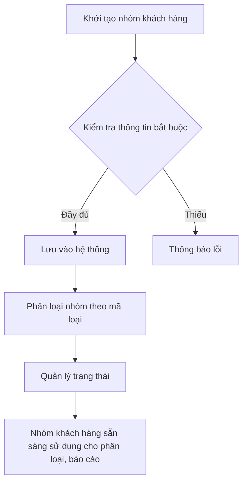
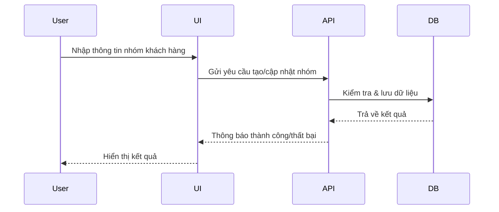

# SAL_002_Quản_Lý_Nhóm_Khách_Hàng

*Phiên bản: 1.0*  
*Người tạo: [Tên Tác Giả]*  
*Ngày tạo: [DD/MM/YYYY]*  
*Cập nhật lần cuối: [DD/MM/YYYY]*  
*Người cập nhật: [Tên Người Cập Nhật]*

---

## 1. Tổng Quan Nghiệp Vụ

### 1.1. Mô Tả Nghiệp Vụ
Quản lý các nhóm khách hàng (Customer Group) nhằm phân loại, tổ chức khách hàng theo các tiêu chí phục vụ cho báo cáo, chính sách giá, chương trình chăm sóc khách hàng, v.v. Hỗ trợ tạo mới, cập nhật, xóa, tìm kiếm, phân loại nhóm khách hàng, quản lý trạng thái hoạt động.

### 1.2. Phạm Vi Áp Dụng
Áp dụng cho bộ phận bán hàng, marketing, quản lý khách hàng, quản trị hệ thống và các phòng ban liên quan.

### 1.3. Định Nghĩa Thuật Ngữ
- **Nhóm khách hàng (Customer Group):** Tập hợp khách hàng có chung đặc điểm để áp dụng chính sách riêng.
- **Mã loại nhóm:** Phân loại nhóm (ví dụ: KH1, KH2...)
- **Trạng thái:** Hoạt động/Không hoạt động.

### 1.4. Tài Liệu Liên Quan
- [SAL_001_Quản Lý Khách Hàng](./SAL_001_Quan_Ly_Khach_Hang.md)
- [SAL_003_Quản Lý Giá Bán](./SAL_003_Quan_Ly_Gia_Ban.md)

---

## 2. Quy Trình Nghiệp Vụ

### 2.1. Tổng Quan Quy Trình
Khởi tạo, cập nhật, tìm kiếm, phân loại, quản lý trạng thái nhóm khách hàng. Kết nối với các nghiệp vụ khách hàng, giá bán, báo cáo.

### 2.2. Sơ Đồ Quy Trình (Business Flow)

### 2.3. Chi Tiết Các Bước Quy Trình
1. Nhập thông tin nhóm khách hàng (mã loại, mã nhóm, tên, trạng thái...)
2. Kiểm tra thông tin bắt buộc (mã loại, mã nhóm, tên, trạng thái...)
3. Lưu dữ liệu vào hệ thống
4. Phân loại nhóm theo mã loại (KH1, KH2...)
5. Quản lý trạng thái (hoạt động/không hoạt động)
6. Sử dụng nhóm khách hàng cho phân loại, báo cáo, chính sách giá

### 2.4. Sơ Đồ Tuần Tự (Sequence Diagram)

### 2.5. Luồng Nghiệp Vụ Thay Thế
- Nếu thông tin bắt buộc thiếu: hệ thống báo lỗi, yêu cầu nhập lại.
- Nếu mã nhóm trùng: báo lỗi, không cho lưu.
- Nếu nhóm không hoạt động: không cho chọn khi phân loại khách hàng.

---

## 3. Yêu Cầu Chức Năng

### 3.1. Danh Sách Chức Năng
- Thêm mới nhóm khách hàng
- Cập nhật thông tin nhóm khách hàng
- Xóa nhóm khách hàng
- Tìm kiếm, lọc nhóm khách hàng
- Phân loại nhóm theo mã loại
- Quản lý trạng thái hoạt động

### 3.2. Chi Tiết Chức Năng
| Chức năng | Mô tả |
|-----------|-------|
| Thêm mới | Nhập thông tin, kiểm tra, lưu vào DB |
| Cập nhật | Sửa thông tin, kiểm tra, lưu lại |
| Xóa | Xóa mềm (đánh dấu không hoạt động) |
| Tìm kiếm | Theo mã loại, mã nhóm, tên, trạng thái... |
| Phân loại | Gán mã loại nhóm |
| Quản lý trạng thái | Đổi trạng thái hoạt động |

---

## 4. Thiết Kế Kỹ Thuật

### 4.1. Kiến Trúc Hệ Thống
- Model: `NhomKhachHang` (file: `django_ledger/models/nhom_khach_hang.py`)
- Service: (nằm trong các nghiệp vụ liên quan, ví dụ: group, ...)
- Serializer: `NhomKhachHangSerializer` (file: `django_ledger/api/serializers/customer_erp.py`)
- API/View: `NhomKhachHangViewSet` (file: `django_ledger/api/views/customer_erp.py`)

### 4.2. API Endpoints (ví dụ)
| Method | Endpoint | Mô tả |
|--------|----------|-------|
| GET | /api/customer-groups/ | Danh sách nhóm khách hàng |
| POST | /api/customer-groups/ | Thêm mới nhóm khách hàng |
| GET | /api/customer-groups/{id}/ | Xem chi tiết nhóm khách hàng |
| PUT/PATCH | /api/customer-groups/{id}/ | Cập nhật nhóm khách hàng |
| DELETE | /api/customer-groups/{id}/ | Xóa nhóm khách hàng |

### 4.3. Service Logic (tóm tắt)
- Kiểm tra thông tin đầu vào, validate dữ liệu
- Kiểm tra trùng mã nhóm, trạng thái
- Lưu dữ liệu, cập nhật phân loại

### 4.4. Mô Hình Dữ Liệu (trích yếu)
| Trường | Kiểu | Mô tả |
|--------|------|-------|
| ma_loai_nh | str | Mã loại nhóm |
| ma_nh | str | Mã nhóm khách hàng |
| ten_nh | str | Tên nhóm khách hàng |
| ten_nh2 | str | Tên thay thế (nếu có) |
| status | str | Trạng thái |
| ngay_tao | datetime | Ngày tạo |
| ngay_cap_nhat | datetime | Ngày cập nhật |

---

## 5. Kế Hoạch Kiểm Thử

### 5.1. Phạm Vi Kiểm Thử
- Thêm, sửa, xóa, tìm kiếm, phân loại, đổi trạng thái nhóm khách hàng

### 5.2. Kịch Bản Kiểm Thử (ví dụ)
| STT | Bước kiểm thử | Kết quả mong đợi |
|-----|---------------|------------------|
| 1 | Thêm mới nhóm khách hàng với đủ thông tin | Thành công |
| 2 | Thêm mới thiếu trường bắt buộc | Báo lỗi |
| 3 | Thêm mới trùng mã nhóm | Báo lỗi |
| 4 | Sửa thông tin nhóm khách hàng | Thành công |
| 5 | Xóa nhóm khách hàng | Không còn trong danh sách hoạt động |
| 6 | Tìm kiếm theo mã loại, mã nhóm | Đúng kết quả |
| 7 | Đổi trạng thái hoạt động | Đúng trạng thái |

---

## 6. Phụ Lục

### 6.1. Danh Sách Tài Liệu Tham Khảo
- Source code: `django_ledger/models/nhom_khach_hang.py`, `django_ledger/api/serializers/customer_erp.py`, `django_ledger/api/views/customer_erp.py`
- Tài liệu nghiệp vụ liên quan: [SAL_001_Quản Lý Khách Hàng](./SAL_001_Quan_Ly_Khach_Hang.md)

### 6.2. Danh Mục Thuật Ngữ
- Customer Group, Group Type, Status, ...

### 6.3. Lịch Sử Thay Đổi Tài Liệu
| Ngày | Người thay đổi | Nội dung |
|------|----------------|----------|
| [DD/MM/YYYY] | [Tên] | Tạo mới | 