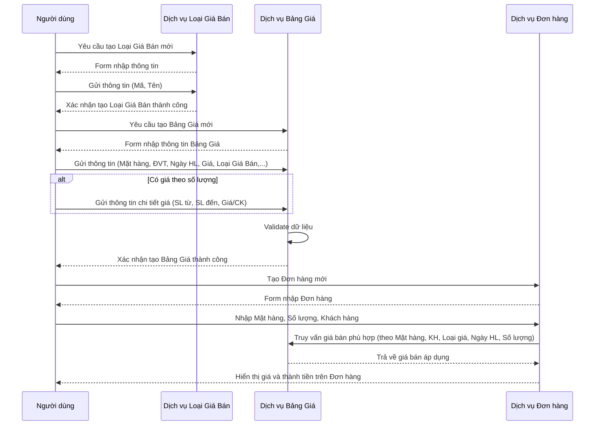
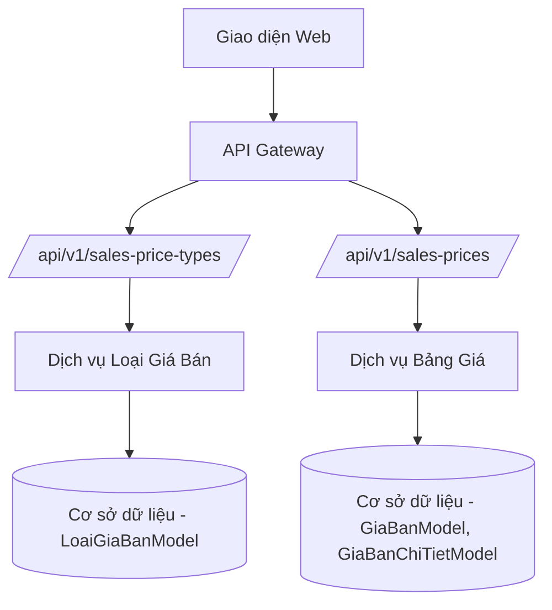

# SAL_003_Quản Lý Giá Bán

*Phiên bản: 1.0*  
*Người tạo: ChatGPT*  
*Ngày tạo: 13/05/2025*  
*Cập nhật lần cuối: 13/05/2025*  
*Người cập nhật: ChatGPT*

## 1. Tổng Quan Nghiệp Vụ

### 1.1. Mô Tả Nghiệp Vụ
Quy trình Quản Lý Giá Bán là một thành phần cốt lõi trong phân hệ Quản Lý Bán Hàng của hệ thống ERP. Quy trình này cho phép doanh nghiệp thiết lập, quản lý và áp dụng các chính sách giá bán đa dạng cho sản phẩm và dịch vụ. Bao gồm việc định nghĩa các loại giá bán khác nhau (ví dụ: giá bán lẻ, giá bán sỉ, giá khuyến mãi), tạo bảng giá chi tiết cho từng mặt hàng, quản lý giá theo khách hàng hoặc nhóm khách hàng, thiết lập giá theo số lượng (tiered pricing), và theo dõi lịch sử thay đổi giá.

### 1.2. Phạm Vi Áp Dụng
- **Phòng Kinh Doanh**: Thiết lập chính sách giá, tạo và cập nhật bảng giá, áp dụng giá cho đơn hàng.
- **Phòng Marketing**: Đề xuất và quản lý các chương trình giá khuyến mãi.
- **Phòng Kế Toán**: Đối soát giá trên hóa đơn, phân tích hiệu quả giá.
- **Ban Lãnh Đạo**: Phê duyệt chính sách giá, theo dõi báo cáo doanh thu theo giá.

### 1.3. Định Nghĩa Thuật Ngữ
| Thuật ngữ | Định nghĩa |
|-----------|------------|
| Loại giá bán (Sales Price Type) | Phân loại các bảng giá khác nhau (ví dụ: giá bán lẻ, giá bán sỉ, giá đại lý cấp 1). Mã: `ma_loai_gb`. |
| Bảng giá (Price List / Sales Price) | Danh sách giá bán cụ thể cho từng mặt hàng, có thể áp dụng cho một loại giá bán, khách hàng, hoặc có hiệu lực trong một khoảng thời gian nhất định. Mã: `GiaBanModel`. |
| Giá bán chi tiết (Tiered Pricing / Sales Price Detail) | Cấu trúc giá bán theo từng khoảng số lượng mua, cho phép áp dụng các mức giá hoặc chiết khấu khác nhau tùy theo số lượng. Mã: `GiaBanChiTietModel`. |
| Ngày hiệu lực | Ngày bắt đầu có hiệu lực của một bảng giá hoặc một mức giá cụ thể. |
| Đơn vị tính (ĐVT) | Đơn vị của sản phẩm được áp dụng giá (ví dụ: Cái, Hộp, Kg). |
| Ngoại tệ | Đơn vị tiền tệ của giá bán (ví dụ: VND, USD). |

### 1.4. Tài Liệu Liên Quan
| STT | Mã tài liệu | Tên tài liệu | Mô tả |
|-----|-------------|--------------|-------|
| 1   | SAL_001 | Quản Lý Khách Hàng | Thông tin khách hàng để áp dụng giá đặc biệt. |
| 2   | SAL_002 | Quản Lý Nhóm Khách Hàng | Phân nhóm khách hàng để áp dụng chính sách giá theo nhóm. |
| 3   | SAL_004 | Quản Lý Hóa Đơn Bán Hàng | Áp dụng giá bán vào hóa đơn. |
| 4   | INV_002 | Quản Lý Vật Tư Sản Phẩm | Thông tin mặt hàng để thiết lập giá. |
| 5   | ACC_007 | Quản Lý Tỷ Giá | Quản lý tỷ giá khi giá bán bằng ngoại tệ. |

## 2. Quy Trình Nghiệp Vụ

### 2.1. Tổng Quan Quy Trình
Quy trình Quản Lý Giá Bán bao gồm các giai đoạn chính:
1.  Thiết lập các loại giá bán.
2.  Tạo và quản lý bảng giá cho từng mặt hàng, có thể theo loại giá, khách hàng, ngày hiệu lực.
3.  Thiết lập giá bán chi tiết theo số lượng (tiered pricing).
4.  Áp dụng giá bán vào các giao dịch bán hàng.
5.  Theo dõi và báo cáo về giá bán.

### 2.2. Sơ Đồ Quy Trình (Business Flow)

```mermaid
flowchart TD
    A[Bắt đầu] --> B[Thiết lập Loại Giá Bán (ma_loai_gb)]
    B --> C[Tạo Bảng Giá (GiaBanModel)]
    C --> D[Nhập thông tin: Mặt hàng, ĐVT, Ngày hiệu lực, Tiền tệ, Giá cơ bản]
    D --> E{Giá theo khách hàng/nhóm KH?}
    E --Có--> F[Chọn Khách hàng/Nhóm KH]
    F --> G
    E --Không--> G{Giá theo số lượng (Tiered Pricing)?}
    G --Có--> H[Tạo Giá Bán Chi Tiết (GiaBanChiTietModel)]
    H --> I[Nhập: Khoảng số lượng, Giá/Chiết khấu tương ứng]
    I --> J[Lưu Bảng Giá và Chi Tiết Giá]
    G --Không--> J
    J --> K[Áp dụng vào Đơn hàng/Hóa đơn]
    K --> L[Kết thúc]
```

### 2.3. Chi Tiết Các Bước Quy Trình

#### 2.3.1. Thiết Lập Loại Giá Bán
- **Mô tả**: Định nghĩa các danh mục giá bán khác nhau mà doanh nghiệp sử dụng.
- **Đầu vào**:
    - Mã loại giá bán (`ma_loai_gb`)
    - Tên loại giá bán (`ten_loai_gb`)
    - Tên thay thế (nếu có) (`ten_loai_gb2`)
    - Trạng thái
- **Đầu ra**: Danh mục các loại giá bán được lưu trong hệ thống.
- **Người thực hiện**: Nhân viên Phòng Kinh Doanh/Quản trị hệ thống.
- **Điều kiện tiên quyết**: Có quyền quản lý loại giá bán.
- **Xử lý ngoại lệ**: Kiểm tra trùng mã loại giá bán.

#### 2.3.2. Tạo Bảng Giá (Sales Price)
- **Mô tả**: Thiết lập giá bán cụ thể cho một mặt hàng.
- **Đầu vào**:
    - Mã vật tư (`ma_vt`)
    - Đơn vị tính (`dvt`)
    - Ngày hiệu lực (`ngay_hl`)
    - Mã ngoại tệ (`ma_nt`)
    - Giá bán (`gia_ban`)
    - Mã loại giá bán (`ma_loai_gb`) (liên kết đến Loại Giá Bán)
    - Mã khách hàng (`ma_kh`) (tùy chọn)
    - Nhóm khách hàng 1, 2, 3 (tùy chọn)
    - Trạng thái
- **Đầu ra**: Một mục giá bán được tạo trong bảng giá.
- **Người thực hiện**: Nhân viên Phòng Kinh Doanh.
- **Điều kiện tiên quyết**: Đã có thông tin mặt hàng, loại giá bán (nếu áp dụng).
- **Xử lý ngoại lệ**: Kiểm tra tính hợp lệ của ngày, giá trị giá bán phải dương.

#### 2.3.3. Thiết Lập Giá Bán Chi Tiết (Tiered Pricing)
- **Mô tả**: Cấu hình các mức giá khác nhau dựa trên số lượng mua của một mặt hàng trong một bảng giá cụ thể.
- **Đầu vào**:
    - Liên kết đến Bảng Giá (`gia_ban_id`)
    - Số lượng từ (`sl_tu`)
    - Số lượng đến (`sl_den`)
    - Giá bán cho khoảng số lượng này (`gia_ban`)
    - Tỷ lệ chiết khấu (nếu có) (`chiet_khau`)
- **Đầu ra**: Các bậc giá theo số lượng được lưu và liên kết với bảng giá gốc.
- **Người thực hiện**: Nhân viên Phòng Kinh Doanh.
- **Điều kiện tiên quyết**: Đã tạo Bảng Giá (Sales Price) tương ứng.
- **Xử lý ngoại lệ**: Kiểm tra các khoảng số lượng không được trùng lắp, giá trị giá bán phải dương.

### 2.4. Sơ Đồ Tuần Tự (Sequence Diagram)



### 2.5. Luồng Nghiệp Vụ Thay Thế
1.  **Cập nhật giá bán**:
    *   Thay đổi thông tin trên bảng giá hiện có (ví dụ: giá, ngày hiệu lực).
    *   Hệ thống cần ghi nhận lịch sử thay đổi giá (nếu có yêu cầu).
    *   Cân nhắc việc cập nhật này ảnh hưởng đến các đơn hàng chưa xuất hóa đơn như thế nào.
2.  **Ngừng áp dụng bảng giá**:
    *   Chuyển trạng thái của bảng giá thành "Không hoạt động" hoặc thiết lập ngày hết hiệu lực.
    *   Bảng giá này sẽ không được áp dụng cho các giao dịch mới.
3.  **Tra cứu giá bán**:
    *   Người dùng có thể tra cứu giá bán của một mặt hàng dựa trên các tiêu chí (khách hàng, số lượng, ngày).

## 3. Yêu Cầu Chức Năng

### 3.1. Danh Sách Chức Năng

| STT | Mã chức năng | Tên chức năng | Mô tả | Độ ưu tiên |
|-----|--------------|---------------|-------|------------|
| 1   | SP_001 | Quản lý Loại Giá Bán | Tạo, sửa, xóa, xem danh sách các loại giá bán. | Cao |
| 2   | SP_002 | Quản lý Bảng Giá | Tạo, sửa, xóa, xem danh sách các mục trong bảng giá. | Cao |
| 3   | SP_003 | Quản lý Giá Bán Chi Tiết (Tiered Pricing) | Thiết lập giá theo khoảng số lượng cho một mục trong bảng giá. | Cao |
| 4   | SP_004 | Áp dụng giá tự động | Hệ thống tự động gợi ý/áp dụng giá vào đơn hàng, hóa đơn. | Cao |
| 5   | SP_005 | Tra cứu lịch sử giá | Xem lại lịch sử thay đổi giá của một mặt hàng. | Trung bình |
| 6   | SP_006 | Báo cáo phân tích giá | Các báo cáo liên quan đến giá bán, doanh thu theo giá. | Trung bình |

### 3.2. Chi Tiết Chức Năng

#### 3.2.1. SP_001: Quản lý Loại Giá Bán
- **Mô tả**: Cho phép người dùng định nghĩa và quản lý các danh mục/loại giá bán.
- **Đầu vào**: Mã loại giá, tên loại giá, trạng thái.
- **Đầu ra**: Danh sách các loại giá bán, form tạo/sửa loại giá bán.
- **Điều kiện tiên quyết**: Người dùng có quyền quản lý loại giá bán.
- **Luồng xử lý chính**:
  1.  Truy cập màn hình quản lý Loại Giá Bán.
  2.  Hiển thị danh sách các loại giá bán hiện có.
  3.  Cho phép thêm mới, sửa thông tin, thay đổi trạng thái của loại giá bán.
- **Luồng xử lý thay thế/ngoại lệ**:
  -   Lỗi trùng mã loại giá bán.
  -   Không cho xóa loại giá bán đã được sử dụng trong các bảng giá.
- **Giao diện liên quan**: Màn hình danh sách Loại Giá Bán, Form chi tiết Loại Giá Bán.

#### 3.2.2. SP_002: Quản lý Bảng Giá
- **Mô tả**: Cho phép người dùng tạo và duy trì các bảng giá cho từng mặt hàng.
- **Đầu vào**: Thông tin mặt hàng, ĐVT, ngày hiệu lực, tiền tệ, giá cơ bản, loại giá bán, khách hàng (nếu có).
- **Đầu ra**: Danh sách các mục trong bảng giá, form tạo/sửa mục bảng giá.
- **Điều kiện tiên quyết**: Có thông tin mặt hàng, loại giá bán (nếu cần).
- **Luồng xử lý chính**:
  1.  Truy cập màn hình quản lý Bảng Giá.
  2.  Lọc/tìm kiếm bảng giá theo mặt hàng, loại giá, khách hàng.
  3.  Thêm mới một mục giá: chọn mặt hàng, nhập các thông tin liên quan.
  4.  Sửa đổi một mục giá hiện có.
- **Luồng xử lý thay thế/ngoại lệ**:
  -   Giá trị không hợp lệ (ví dụ: giá âm).
  -   Xung đột ngày hiệu lực nếu có nhiều bảng giá cho cùng một điều kiện.
- **Giao diện liên quan**: Màn hình danh sách Bảng Giá, Form chi tiết Bảng Giá.

#### 3.2.3. SP_003: Quản lý Giá Bán Chi Tiết (Tiered Pricing)
- **Mô tả**: Cho phép thiết lập các bậc giá khác nhau cho một mục trong bảng giá dựa trên số lượng mua.
- **Đầu vào**: Liên kết đến mục bảng giá, khoảng số lượng (từ - đến), giá hoặc tỷ lệ chiết khấu cho khoảng đó.
- **Đầu ra**: Cấu trúc giá theo bậc được lưu lại.
- **Điều kiện tiên quyết**: Đã có mục bảng giá (SP_002).
- **Luồng xử lý chính**:
  1.  Trong form chi tiết Bảng Giá, chọn mục "Giá theo số lượng".
  2.  Thêm các dòng chi tiết, mỗi dòng là một khoảng số lượng và giá/chiết khấu tương ứng.
  3.  Lưu lại.
- **Luồng xử lý thay thế/ngoại lệ**:
  -   Các khoảng số lượng không được chồng chéo.
  -   Giá trị không hợp lệ.
- **Giao diện liên quan**: Mục/Tab "Giá theo số lượng" trong Form chi tiết Bảng Giá.

## 4. Thiết Kế Kỹ Thuật

### 4.1. Kiến Trúc Hệ Thống



### 4.2. API Endpoints

#### 4.2.1. Loại Giá Bán (LoaiGiaBanModel)
- **Mô tả**: API quản lý các loại giá bán.
- **URL**:
  - `GET /api/v1/entity/{entity_slug}/erp/sales-price-types/`
  - `POST /api/v1/entity/{entity_slug}/erp/sales-price-types/`
  - `GET /api/v1/entity/{entity_slug}/erp/sales-price-types/{uuid}/`
  - `PUT /api/v1/entity/{entity_slug}/erp/sales-price-types/{uuid}/`
  - `PATCH /api/v1/entity/{entity_slug}/erp/sales-price-types/{uuid}/`
  - `DELETE /api/v1/entity/{entity_slug}/erp/sales-price-types/{uuid}/`

#### 4.2.2. Bảng Giá (GiaBanModel) và Chi Tiết Giá (GiaBanChiTietModel)
- **Mô tả**: API quản lý bảng giá và chi tiết giá theo số lượng.
- **URL**:
  - `GET /api/v1/entity/{entity_slug}/erp/sales-prices/` (List, filter by material, customer, price type)
  - `POST /api/v1/entity/{entity_slug}/erp/sales-prices/` (Create new price list, potentially with details)
  - `GET /api/v1/entity/{entity_slug}/erp/sales-prices/{uuid}/` (Retrieve specific price list)
  - `PUT /api/v1/entity/{entity_slug}/erp/sales-prices/{uuid}/` (Update price list, potentially with details)
  - `DELETE /api/v1/entity/{entity_slug}/erp/sales-prices/{uuid}/` (Delete price list)
  - `GET /api/v1/entity/{entity_slug}/erp/sales-prices/{gia_ban_uuid}/details/` (List details for a price list)
  - `POST /api/v1/entity/{entity_slug}/erp/sales-prices/{gia_ban_uuid}/details/` (Add a detail)
  - `PUT /api/v1/entity/{entity_slug}/erp/sales-prices/{gia_ban_uuid}/details/{detail_uuid}/` (Update a detail)
  - `DELETE /api/v1/entity/{entity_slug}/erp/sales-prices/{gia_ban_uuid}/details/{detail_uuid}/` (Delete a detail)

### 4.3. Service Logic

#### 4.3.1. LoaiGiaBanModelService
- **Mô tả**: Xử lý logic nghiệp vụ cho Loại Giá Bán.
- **Chức năng chính**: CRUD, validation, lấy danh sách active/all.
- **Dependencies**: `LoaiGiaBanRepository`.

#### 4.3.2. GiaBanService
- **Mô tả**: Xử lý logic nghiệp vụ cho Bảng Giá và Chi Tiết Giá.
- **Chức năng chính**:
    - CRUD cho `GiaBanModel`.
    - Quản lý lồng ghép (nested) cho `GiaBanChiTietModel` khi tạo/cập nhật `GiaBanModel`.
    - Validate dữ liệu (giá dương, không trùng lặp khoảng số lượng trong chi tiết).
    - Logic truy vấn giá bán phù hợp cho đơn hàng.
- **Dependencies**: `GiaBanRepository`, `GiaBanChiTietRepository`, `VatTuRepository`, `CustomerRepository`.

### 4.4. Mô Hình Dữ Liệu

#### 4.4.1. Entity Relationship Diagram (ERD)

```mermaid
erDiagram
    LOAI_GIA_BAN ||--|{ GIA_BAN : "áp dụng cho"
    VAT_TU ||--|{ GIA_BAN : "có giá"
    KHACH_HANG ||--o{ GIA_BAN : "có giá riêng"
    NHOM_KHACH_HANG ||--o{ GIA_BAN : "có giá riêng"
    GIA_BAN ||--|{ GIA_BAN_CHI_TIET : "có chi tiết theo SL"
    DON_VI_TINH ||--|{ GIA_BAN : "theo"
    NGOAI_TE ||--|{ GIA_BAN : "theo"

    LOAI_GIA_BAN {
        uuid uuid PK
        string ma_loai_gb "Mã loại giá bán"
        string ten_loai_gb "Tên loại giá bán"
        string ten_loai_gb2
        integer status
        uuid entity_model_id FK
    }

    GIA_BAN {
        uuid uuid PK
        uuid ma_vt_id FK "Mã vật tư"
        uuid dvt_id FK "Đơn vị tính"
        date ngay_hl "Ngày hiệu lực"
        date ngay_het_hl "Ngày hết hiệu lực"
        uuid ma_nt_id FK "Mã ngoại tệ"
        decimal gia_ban "Giá bán"
        boolean thue_yn "Có thuế GTGT?"
        uuid ma_loai_gb_id FK "Mã loại giá bán"
        uuid ma_kh_id FK "Mã khách hàng (nếu có)"
        uuid nh_kh1_id FK "Nhóm KH 1 (nếu có)"
        uuid nh_kh2_id FK "Nhóm KH 2 (nếu có)"
        uuid nh_kh3_id FK "Nhóm KH 3 (nếu có)"
        string ghi_chu
        integer status
        uuid entity_model_id FK
    }

    GIA_BAN_CHI_TIET {
        uuid uuid PK
        uuid gia_ban_id FK "Liên kết bảng giá"
        decimal sl_tu "Số lượng từ"
        decimal sl_den "Số lượng đến"
        decimal gia_ban "Giá cho khoảng SL này"
        decimal chiet_khau "Chiết khấu %"
        integer status
        uuid entity_model_id FK
    }

    VAT_TU { uuid uuid PK; string ma_vt; string ten_vt; }
    KHACH_HANG { uuid uuid PK; string ma_kh; string ten_kh; }
    NHOM_KHACH_HANG { uuid uuid PK; string ma_nhom; string ten_nhom; }
    DON_VI_TINH { uuid uuid PK; string ma_dvt; }
    NGOAI_TE { uuid uuid PK; string ma_nt; }
```

#### 4.4.2. Chi Tiết Bảng Dữ Liệu

##### Bảng: LOAI_GIA_BAN (LoaiGiaBan)
- **Mô tả**: Lưu trữ các loại giá bán.
- **Các trường chính**: `uuid`, `ma_loai_gb`, `ten_loai_gb`, `status`, `entity_model_id`.

##### Bảng: DMVT_GIA_BAN (GiaBanModel)
- **Mô tả**: Lưu trữ bảng giá bán cho từng mặt hàng.
- **Các trường chính**: `uuid`, `ma_vt_id` (FK VatTuModel), `dvt_id` (FK DonViTinhModel), `ngay_hl`, `ngay_het_hl`, `ma_nt_id` (FK NgoaiTeModel), `gia_ban`, `ma_loai_gb_id` (FK LoaiGiaBan), `ma_kh_id` (FK CustomerModel, nullable), `nh_kh1_id` (FK NhomKhachHang, nullable), `status`, `entity_model_id`.

##### Bảng: DMVT_GIA_BAN_CT (GiaBanChiTietModel)
- **Mô tả**: Lưu trữ chi tiết giá theo từng khoảng số lượng (tiered pricing).
- **Các trường chính**: `uuid`, `gia_ban_id` (FK GiaBanModel), `sl_tu`, `sl_den`, `gia_ban`, `chiet_khau`, `status`, `entity_model_id`.

## 5. Kế Hoạch Kiểm Thử

### 5.1. Phạm Vi Kiểm Thử
- Tạo/sửa/xóa Loại Giá Bán.
- Tạo/sửa/xóa Bảng Giá (cho mặt hàng, theo loại giá, theo khách hàng, theo ngày hiệu lực).
- Tạo/sửa/xóa Giá Bán Chi Tiết (tiered pricing).
- Hệ thống tự động chọn đúng giá khi tạo đơn hàng/hóa đơn dựa trên các tiêu chí (mặt hàng, khách hàng, số lượng, ngày).
- Kiểm tra tính đúng đắn của giá khi có nhiều bảng giá cùng điều kiện nhưng khác ngày hiệu lực.

### 5.2. Kịch Bản Kiểm Thử

| STT | Mã kịch bản | Tên kịch bản | Mô tả | Điều kiện tiên quyết | Các bước | Kết quả mong đợi |
|-----|------------|--------------|-------|---------------------|----------|-----------------|
| 1   | TC_SP_001 | Tạo Loại Giá Bán | Tạo mới một loại giá bán "Giá bán lẻ". | Đăng nhập, có quyền. | 1. Vào QL Loại Giá Bán.<br>2. Thêm mới.<br>3. Nhập Mã="RETAIL", Tên="Giá bán lẻ".<br>4. Lưu. | Loại giá "RETAIL" được tạo thành công. |
| 2   | TC_SP_002 | Tạo Bảng Giá cơ bản | Tạo giá cho SP001, loại giá RETAIL, giá 100,000 VND, hiệu lực từ hôm nay. | Có SP001, Loại giá RETAIL. | 1. Vào QL Bảng Giá.<br>2. Thêm mới.<br>3. Chọn SP001, ĐVT=Cái, Ngày HL=nay, Tiền tệ=VND, Giá=100000, Loại giá=RETAIL.<br>4. Lưu. | Bảng giá được tạo. |
| 3   | TC_SP_003 | Tạo Giá Bán Chi Tiết | Cho SP001, loại RETAIL: SL 1-10 giá 100K, SL 11-50 giá 95K. | Đã có TC_SP_002. | 1. Mở bảng giá của SP001 (từ TC_SP_002).<br>2. Thêm chi tiết: SL 1-10, Giá 100000.<br>3. Thêm chi tiết: SL 11-50, Giá 95000.<br>4. Lưu. | Chi tiết giá được lưu. |
| 4   | TC_SP_004 | Áp dụng giá vào Đơn hàng (SL < 10) | Tạo đơn hàng cho SP001, SL=5. | Đã có TC_SP_003. | 1. Tạo Đơn hàng.<br>2. Thêm SP001, SL=5.<br>3. Chọn Khách hàng (không có giá riêng). | Hệ thống tự động áp giá 100,000. |
| 5   | TC_SP_005 | Áp dụng giá vào Đơn hàng (SL > 10) | Tạo đơn hàng cho SP001, SL=20. | Đã có TC_SP_003. | 1. Tạo Đơn hàng.<br>2. Thêm SP001, SL=20.<br>3. Chọn Khách hàng (không có giá riêng). | Hệ thống tự động áp giá 95,000. |
| 6   | TC_SP_006 | Tạo Bảng Giá cho Khách hàng VIP | Tạo giá riêng cho SP001, KH VIP001, giá 90,000 VND. | Có SP001, KH VIP001. | 1. Vào QL Bảng Giá.<br>2. Thêm mới.<br>3. Chọn SP001, ĐVT=Cái, Ngày HL=nay, Tiền tệ=VND, Giá=90000, Khách hàng=VIP001.<br>4. Lưu. | Bảng giá riêng cho VIP001 được tạo. |
| 7   | TC_SP_007 | Áp dụng giá KH VIP | Tạo đơn hàng cho SP001, SL=5, KH VIP001. | Đã có TC_SP_003, TC_SP_006. | 1. Tạo Đơn hàng.<br>2. Thêm SP001, SL=5.<br>3. Chọn Khách hàng VIP001. | Hệ thống tự động áp giá 90,000 (ưu tiên giá KH). |

## 6. Phụ Lục

### 6.1. Danh Sách Tài Liệu Tham Khảo
1. Tài liệu thiết kế hệ thống Django Ledger (Models: `LoaiGiaBan`, `GiaBanModel`, `GiaBanChiTietModel`).
2. Các thông lệ về quản lý chính sách giá trong doanh nghiệp.

### 6.2. Danh Mục Thuật Ngữ
- ERP: Enterprise Resource Planning
- API: Application Programming Interface
- UUID: Universally Unique Identifier
- GTGT: Giá Trị Gia Tăng (VAT)
- ĐVT: Đơn Vị Tính
- SL: Số Lượng
- CK: Chiết Khấu

### 6.3. Lịch Sử Thay Đổi Tài Liệu

| Phiên bản | Ngày | Người thực hiện | Mô tả thay đổi |
|-----------|------|-----------------|---------------|
| 1.0 | 13/05/2025 | ChatGPT | Tạo mới tài liệu |
