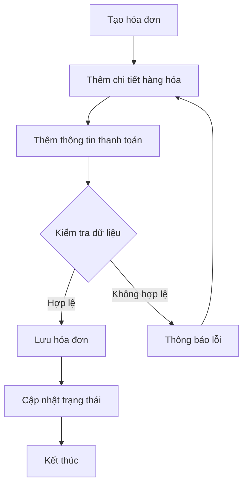
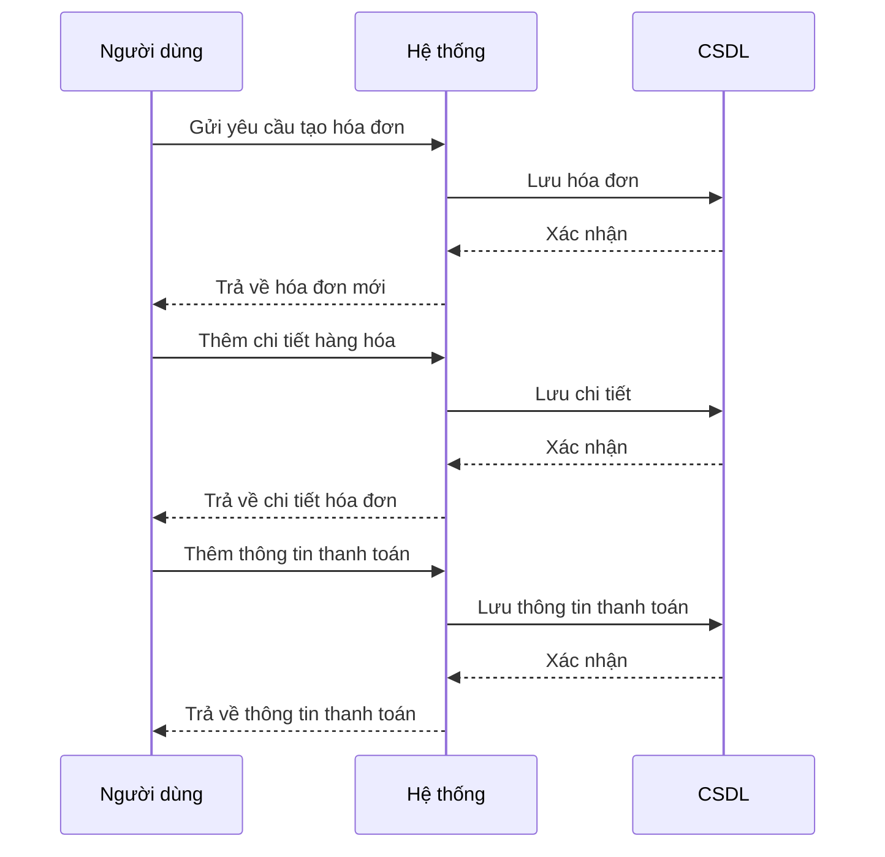
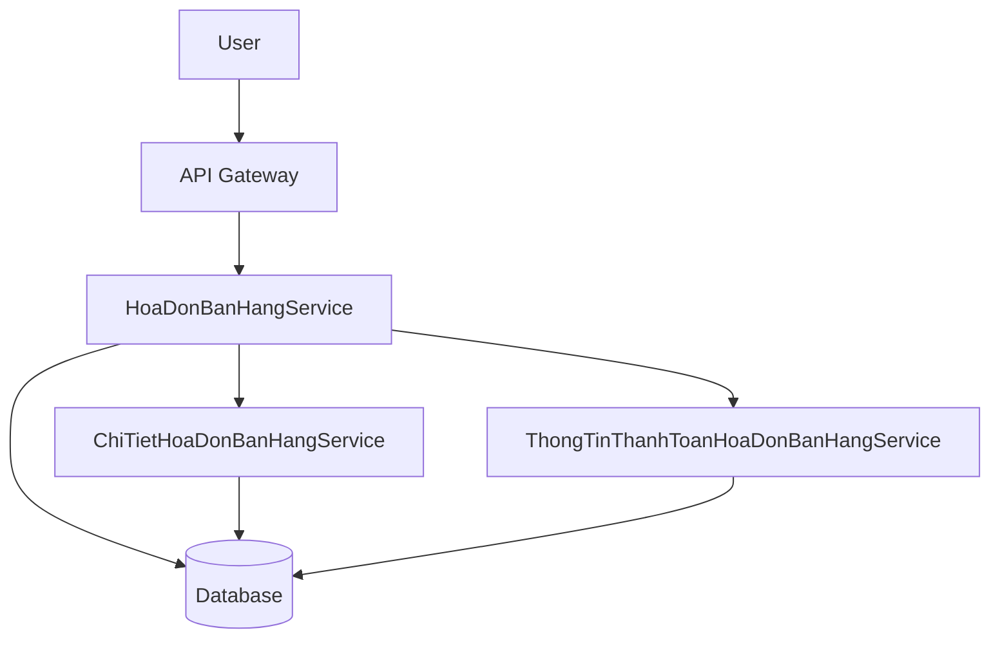
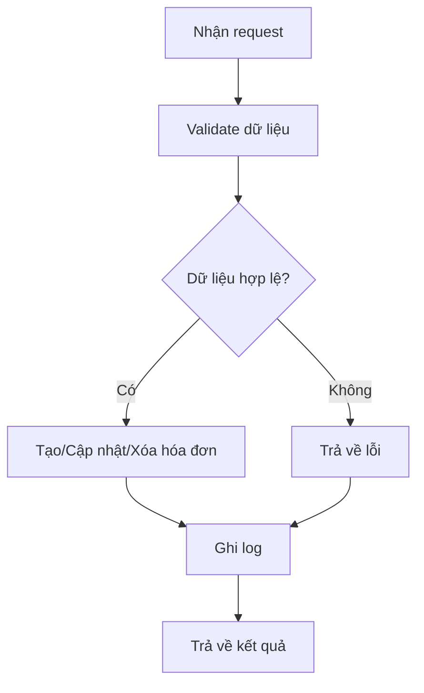

# SAL_004_Quản_Lý_Hóa_Đơn_Bán_Hàng

*Phiên bản: 1.0*  
*Người tạo: [Tên Tác Giả]*  
*Ngày tạo: [DD/MM/YYYY]*  
*Cập nhật lần cuối: [DD/MM/YYYY]*  
*Người cập nhật: [Tên Người Cập Nhật]*

## 1. Tổng Quan Nghiệp Vụ

### 1.1. Mô Tả Nghiệp Vụ
Quản lý toàn bộ vòng đời hóa đơn bán hàng, bao gồm tạo mới, cập nhật, xóa, xem chi tiết, quản lý các dòng hàng hóa, thông tin thanh toán và liên kết với các đối tượng khách hàng, nhân viên, kho, tài khoản, phương thức thanh toán, v.v. Đảm bảo tính chính xác, minh bạch và truy vết cho các nghiệp vụ bán hàng.

### 1.2. Phạm Vi Áp Dụng
Áp dụng cho bộ phận bán hàng, kế toán, quản lý kho, quản lý tài chính và các phòng ban liên quan đến quy trình bán hàng và xuất hóa đơn.

### 1.3. Định Nghĩa Thuật Ngữ
| Thuật ngữ | Định nghĩa |
|-----------|------------|
| Hóa đơn bán hàng | Chứng từ ghi nhận giao dịch bán hàng với khách hàng |
| Chi tiết hóa đơn | Dòng hàng hóa/dịch vụ trên hóa đơn |
| Thông tin thanh toán | Dữ liệu về phương thức, tài khoản, trạng thái thanh toán |
| Khách hàng | Đối tượng mua hàng, nhận hóa đơn |
| Nhân viên bán hàng | Người thực hiện giao dịch bán hàng |

### 1.4. Tài Liệu Liên Quan
| STT | Mã tài liệu | Tên tài liệu | Mô tả |
|-----|-------------|--------------|-------|
| 1   | SAL_001     | Quản lý khách hàng | Quản lý thông tin khách hàng |
| 2   | ACC_001     | Sơ đồ tài khoản | Quản lý hệ thống tài khoản kế toán |
| 3   | INV_001     | Quản lý kho hàng | Quản lý kho, vật tư, hàng hóa |

## 2. Quy Trình Nghiệp Vụ

### 2.1. Tổng Quan Quy Trình
1. Tạo mới hóa đơn bán hàng
2. Thêm/sửa/xóa chi tiết hàng hóa, dịch vụ
3. Thêm/sửa/xóa thông tin thanh toán
4. Cập nhật trạng thái hóa đơn (đã thanh toán, đã xuất kho, đã hủy...)
5. Xem, tìm kiếm, lọc hóa đơn
6. Xóa hóa đơn (nếu chưa phát sinh nghiệp vụ liên quan)

### 2.2. Sơ Đồ Quy Trình (Business Flow)

### 2.3. Chi Tiết Các Bước Quy Trình
#### 2.3.1. Tạo mới hóa đơn
- **Mô tả**: Người dùng nhập thông tin chung hóa đơn (khách hàng, ngày, kho, nhân viên, v.v.)
- **Đầu vào**: Thông tin khách hàng, kho, nhân viên, ngày chứng từ, loại tiền, v.v.
- **Đầu ra**: Hóa đơn bán hàng mới
- **Người thực hiện**: Nhân viên bán hàng/kế toán
- **Điều kiện tiên quyết**: Khách hàng, kho, nhân viên đã tồn tại
- **Xử lý ngoại lệ**: Báo lỗi nếu thiếu thông tin bắt buộc

#### 2.3.2. Thêm chi tiết hàng hóa
- **Mô tả**: Thêm các dòng hàng hóa/dịch vụ vào hóa đơn
- **Đầu vào**: Danh sách vật tư, số lượng, đơn giá, thuế suất, v.v.
- **Đầu ra**: Danh sách chi tiết hóa đơn
- **Người thực hiện**: Nhân viên bán hàng/kế toán
- **Điều kiện tiên quyết**: Hóa đơn đã được tạo
- **Xử lý ngoại lệ**: Báo lỗi nếu vật tư không tồn tại hoặc số lượng không hợp lệ

#### 2.3.3. Thêm thông tin thanh toán
- **Mô tả**: Thêm các dòng thanh toán cho hóa đơn (chuyển khoản, tiền mặt, v.v.)
- **Đầu vào**: Phương thức thanh toán, tài khoản, số tiền, ngày thanh toán
- **Đầu ra**: Danh sách thông tin thanh toán
- **Người thực hiện**: Nhân viên bán hàng/kế toán
- **Điều kiện tiên quyết**: Hóa đơn đã được tạo
- **Xử lý ngoại lệ**: Báo lỗi nếu thiếu thông tin hoặc số tiền không hợp lệ

#### 2.3.4. Cập nhật trạng thái hóa đơn
- **Mô tả**: Cập nhật trạng thái hóa đơn (đã thanh toán, đã xuất kho, đã hủy...)
- **Đầu vào**: Trạng thái mới
- **Đầu ra**: Hóa đơn với trạng thái mới
- **Người thực hiện**: Nhân viên bán hàng/kế toán
- **Điều kiện tiên quyết**: Hóa đơn đã tồn tại
- **Xử lý ngoại lệ**: Báo lỗi nếu trạng thái không hợp lệ

### 2.4. Sơ Đồ Tuần Tự (Sequence Diagram)

### 2.5. Luồng Nghiệp Vụ Thay Thế
- Hủy hóa đơn: Chỉ cho phép khi chưa phát sinh nghiệp vụ liên quan (xuất kho, thanh toán...)
- Sửa/xóa chi tiết: Chỉ cho phép khi hóa đơn chưa bị khóa hoặc chưa phát sinh nghiệp vụ liên quan

## 3. Yêu Cầu Chức Năng

### 3.1. Danh Sách Chức Năng
| STT | Mã chức năng | Tên chức năng | Mô tả | Độ ưu tiên |
|-----|--------------|---------------|-------|------------|
| 1   | SAL_004_01   | Tạo hóa đơn bán hàng | Tạo mới hóa đơn bán hàng | Cao |
| 2   | SAL_004_02   | Thêm/sửa/xóa chi tiết hóa đơn | Quản lý các dòng hàng hóa/dịch vụ | Cao |
| 3   | SAL_004_03   | Thêm/sửa/xóa thông tin thanh toán | Quản lý các dòng thanh toán | Cao |
| 4   | SAL_004_04   | Cập nhật trạng thái hóa đơn | Đổi trạng thái hóa đơn | Trung bình |
| 5   | SAL_004_05   | Xem/tìm kiếm hóa đơn | Tìm kiếm, lọc, xem chi tiết hóa đơn | Cao |
| 6   | SAL_004_06   | Xóa hóa đơn | Xóa hóa đơn chưa phát sinh nghiệp vụ | Trung bình |

### 3.2. Chi Tiết Chức Năng
#### 3.2.1. SAL_004_01: Tạo hóa đơn bán hàng
- **Mô tả**: Tạo mới hóa đơn với thông tin chung, liên kết khách hàng, kho, nhân viên, v.v.
- **Đầu vào**: Thông tin khách hàng, kho, nhân viên, ngày chứng từ, loại tiền, v.v.
- **Đầu ra**: Hóa đơn bán hàng mới
- **Điều kiện tiên quyết**: Khách hàng, kho, nhân viên đã tồn tại
- **Luồng xử lý chính**:
  1. Nhập thông tin chung
  2. Lưu hóa đơn
- **Luồng xử lý thay thế/ngoại lệ**:
  1. Báo lỗi nếu thiếu thông tin bắt buộc
- **Giao diện liên quan**: Form tạo hóa đơn

#### 3.2.2. SAL_004_02: Thêm/sửa/xóa chi tiết hóa đơn
- **Mô tả**: Thêm, sửa, xóa các dòng hàng hóa/dịch vụ trên hóa đơn
- **Đầu vào**: Danh sách vật tư, số lượng, đơn giá, thuế suất, v.v.
- **Đầu ra**: Danh sách chi tiết hóa đơn
- **Điều kiện tiên quyết**: Hóa đơn đã được tạo
- **Luồng xử lý chính**:
  1. Thêm dòng mới
  2. Sửa dòng
  3. Xóa dòng
- **Luồng xử lý thay thế/ngoại lệ**:
  1. Báo lỗi nếu vật tư không tồn tại hoặc số lượng không hợp lệ
- **Giao diện liên quan**: Form chi tiết hóa đơn

#### 3.2.3. SAL_004_03: Thêm/sửa/xóa thông tin thanh toán
- **Mô tả**: Thêm, sửa, xóa các dòng thanh toán cho hóa đơn
- **Đầu vào**: Phương thức thanh toán, tài khoản, số tiền, ngày thanh toán
- **Đầu ra**: Danh sách thông tin thanh toán
- **Điều kiện tiên quyết**: Hóa đơn đã được tạo
- **Luồng xử lý chính**:
  1. Thêm dòng mới
  2. Sửa dòng
  3. Xóa dòng
- **Luồng xử lý thay thế/ngoại lệ**:
  1. Báo lỗi nếu thiếu thông tin hoặc số tiền không hợp lệ
- **Giao diện liên quan**: Form thông tin thanh toán

#### 3.2.4. SAL_004_04: Cập nhật trạng thái hóa đơn
- **Mô tả**: Đổi trạng thái hóa đơn (đã thanh toán, đã xuất kho, đã hủy...)
- **Đầu vào**: Trạng thái mới
- **Đầu ra**: Hóa đơn với trạng thái mới
- **Điều kiện tiên quyết**: Hóa đơn đã tồn tại
- **Luồng xử lý chính**:
  1. Chọn trạng thái mới
  2. Lưu trạng thái
- **Luồng xử lý thay thế/ngoại lệ**:
  1. Báo lỗi nếu trạng thái không hợp lệ
- **Giao diện liên quan**: Form cập nhật trạng thái

#### 3.2.5. SAL_004_05: Xem/tìm kiếm hóa đơn
- **Mô tả**: Tìm kiếm, lọc, xem chi tiết hóa đơn
- **Đầu vào**: Từ khóa, bộ lọc
- **Đầu ra**: Danh sách hóa đơn phù hợp
- **Điều kiện tiên quyết**: Có dữ liệu hóa đơn
- **Luồng xử lý chính**:
  1. Nhập từ khóa/bộ lọc
  2. Hiển thị kết quả
- **Luồng xử lý thay thế/ngoại lệ**:
  1. Báo lỗi nếu không tìm thấy hóa đơn
- **Giao diện liên quan**: Danh sách hóa đơn, chi tiết hóa đơn

#### 3.2.6. SAL_004_06: Xóa hóa đơn
- **Mô tả**: Xóa hóa đơn chưa phát sinh nghiệp vụ liên quan
- **Đầu vào**: Mã hóa đơn
- **Đầu ra**: Hóa đơn bị xóa
- **Điều kiện tiên quyết**: Hóa đơn chưa phát sinh nghiệp vụ liên quan
- **Luồng xử lý chính**:
  1. Chọn hóa đơn cần xóa
  2. Xác nhận xóa
- **Luồng xử lý thay thế/ngoại lệ**:
  1. Báo lỗi nếu hóa đơn đã phát sinh nghiệp vụ
- **Giao diện liên quan**: Danh sách hóa đơn

## 4. Thiết Kế Kỹ Thuật

### 4.1. Kiến Trúc Hệ Thống

### 4.2. API Endpoints
#### 4.2.1. Tạo hóa đơn bán hàng
- **Mô tả**: Tạo mới hóa đơn bán hàng cùng chi tiết và thông tin thanh toán
- **URL**: `POST /api/v1/ban_hang/hoa_don_ban_ra/`
#### 4.2.2. Cập nhật hóa đơn bán hàng
- **Mô tả**: Cập nhật thông tin hóa đơn, chi tiết, thanh toán
- **URL**: `PUT /api/v1/ban_hang/hoa_don_ban_ra/{uuid}/`
#### 4.2.3. Xóa hóa đơn bán hàng
- **Mô tả**: Xóa hóa đơn bán hàng
- **URL**: `DELETE /api/v1/ban_hang/hoa_don_ban_ra/{uuid}/`
#### 4.2.4. Lấy danh sách hóa đơn bán hàng
- **Mô tả**: Lấy danh sách hóa đơn bán hàng theo bộ lọc
- **URL**: `GET /api/v1/ban_hang/hoa_don_ban_ra/`
#### 4.2.5. Lấy chi tiết hóa đơn bán hàng
- **Mô tả**: Lấy chi tiết hóa đơn, bao gồm các dòng hàng hóa và thông tin thanh toán
- **URL**: `GET /api/v1/ban_hang/hoa_don_ban_ra/{uuid}/`

### 4.3. Service Logic
#### 4.3.1. HoaDonBanHangService
- **Mô tả**: Xử lý nghiệp vụ chính cho hóa đơn bán hàng: tạo, cập nhật, xóa, lấy danh sách, lấy chi tiết, quản lý trạng thái, liên kết chi tiết và thanh toán
- **Chức năng chính**:
  1. Tạo hóa đơn
  2. Cập nhật hóa đơn
  3. Xóa hóa đơn
  4. Lấy danh sách hóa đơn
  5. Lấy chi tiết hóa đơn
  6. Quản lý trạng thái hóa đơn
- **Các dependencies**:
  1. ChiTietHoaDonBanHangService
  2. ThongTinThanhToanHoaDonBanHangService
- **Sơ đồ luồng xử lý**:

## 5. Kế Hoạch Kiểm Thử
- Kiểm thử tạo mới hóa đơn với đầy đủ thông tin
- Kiểm thử thêm/sửa/xóa chi tiết hóa đơn
- Kiểm thử thêm/sửa/xóa thông tin thanh toán
- Kiểm thử cập nhật trạng thái hóa đơn
- Kiểm thử xóa hóa đơn chưa phát sinh nghiệp vụ
- Kiểm thử các trường hợp ngoại lệ (thiếu thông tin, dữ liệu không hợp lệ...)

## 6. Phụ Lục
- Danh sách tài liệu tham khảo: Xem mục 1.4
- Danh mục thuật ngữ: Xem mục 1.3
- Lịch sử thay đổi tài liệu: [Cập nhật tại đây] 