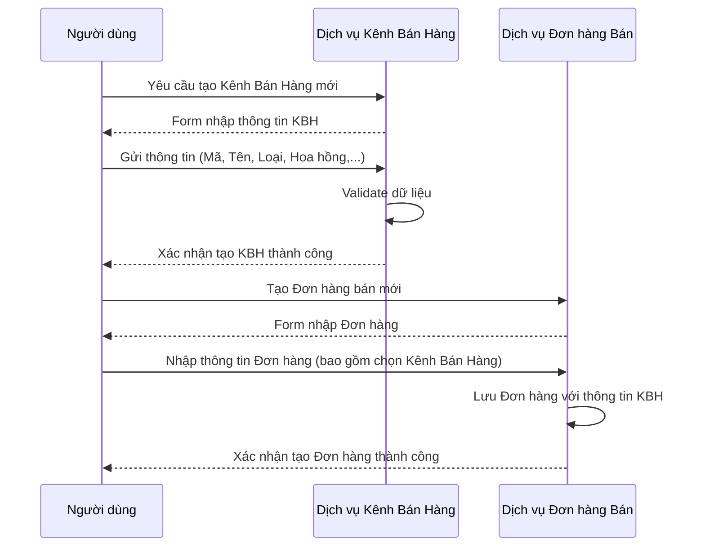
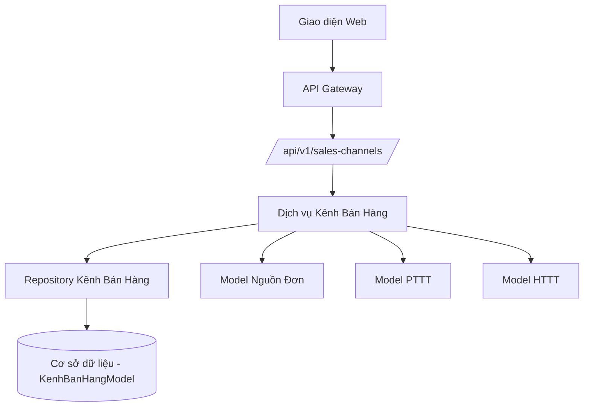

# SAL_005_Quản Lý Kênh Bán Hàng

*Phiên bản: 1.0*  
*Người tạo: ChatGPT*  
*Ngày tạo: 13/05/2025*  
*Cập nhật lần cuối: 13/05/2025*  
*Người cập nhật: ChatGPT*

## 1. Tổng Quan Nghiệp Vụ

### 1.1. Mô Tả Nghiệp Vụ
Quy trình Quản Lý Kênh Bán Hàng cho phép doanh nghiệp định nghĩa, theo dõi và quản lý hiệu suất của các kênh bán hàng khác nhau mà doanh nghiệp sử dụng để tiếp cận khách hàng và bán sản phẩm/dịch vụ. Các kênh bán hàng có thể bao gồm bán hàng trực tiếp, bán hàng qua đại lý, bán hàng trực tuyến (website, e-commerce platform), bán hàng qua điện thoại (telesales), v.v. Việc quản lý kênh bán hàng giúp phân tích hiệu quả từng kênh, tính toán hoa hồng, và tối ưu hóa chiến lược phân phối.

### 1.2. Phạm Vi Áp Dụng
- **Phòng Kinh Doanh**: Thiết lập và quản lý danh mục kênh bán hàng, gán kênh cho giao dịch bán hàng.
- **Phòng Marketing**: Phân tích hiệu quả các kênh để điều chỉnh chiến lược marketing.
- **Phòng Kế Toán**: Tính toán hoa hồng cho nhân viên/đối tác theo từng kênh, theo dõi doanh thu theo kênh.
- **Ban Lãnh Đạo**: Đánh giá hiệu suất tổng thể của các kênh bán hàng để ra quyết định chiến lược.

### 1.3. Định Nghĩa Thuật Ngữ
| Thuật ngữ | Định nghĩa |
|-----------|------------|
| Kênh bán hàng (KBH) | Phương thức hoặc con đường mà qua đó sản phẩm/dịch vụ được bán cho khách hàng. Mã: `ma_kbh`. |
| Loại kênh | Phân loại kênh bán hàng (ví dụ: Trực tiếp, Đại lý, Online). |
| Tỷ lệ hoa hồng | Phần trăm hoa hồng được hưởng từ doanh thu bán hàng qua một kênh cụ thể. |
| Nguồn đơn hàng | Nguồn gốc phát sinh đơn hàng, có thể liên quan đến kênh bán hàng. |
| Phương thức thanh toán (PTTT) | Cách thức khách hàng thanh toán (ví dụ: Tiền mặt, Chuyển khoản), có thể được cấu hình mặc định cho kênh. |
| Hình thức thanh toán (HTTT) | Chi tiết hơn về phương thức thanh toán (ví dụ: Thanh toán ngay, Công nợ), có thể được cấu hình mặc định cho kênh. |

### 1.4. Tài Liệu Liên Quan
| STT | Mã tài liệu | Tên tài liệu | Mô tả |
|-----|-------------|--------------|-------|
| 1   | SAL_004 | Quản Lý Hóa Đơn Bán Hàng | Ghi nhận kênh bán hàng trên hóa đơn. |
| 2   | FIN_002 | Quản Lý Thanh Toán | Danh mục các phương thức và hình thức thanh toán. |
| 3   | ORG_002 | Quản Lý Nhân Viên | Thông tin nhân viên bán hàng để tính hoa hồng. |
| 4   | ACC_002 | Sổ Cái | Hạch toán doanh thu, chi phí hoa hồng theo kênh. |

## 2. Quy Trình Nghiệp Vụ

### 2.1. Tổng Quan Quy Trình
Quy trình Quản Lý Kênh Bán Hàng bao gồm:
1.  Tạo mới và cấu hình thông tin kênh bán hàng.
2.  Liên kết kênh bán hàng với các yếu tố liên quan như nguồn đơn hàng, phương thức/hình thức thanh toán mặc định.
3.  Sử dụng thông tin kênh bán hàng trong các giao dịch bán hàng.
4.  Theo dõi và báo cáo hiệu suất, doanh thu, hoa hồng theo kênh.

### 2.2. Sơ Đồ Quy Trình (Business Flow)

```mermaid
flowchart TD
    A[Bắt đầu] --> B[Tạo/Cập nhật Kênh Bán Hàng (KBH)]
    B --> C[Nhập thông tin: Mã KBH, Tên KBH, Loại kênh, Tỷ lệ hoa hồng]
    C --> D{Liên kết Nguồn đơn/PTTT/HTTT?}
    D --Có--> E[Chọn Nguồn đơn hàng, PTTT, HTTT mặc định]
    E --> F[Lưu thông tin KBH]
    D --Không--> F
    F --> G[Sử dụng KBH trong Đơn hàng/Hóa đơn]
    G --> H[Theo dõi Doanh thu/Hoa hồng theo KBH]
    H --> I[Kết thúc]
```

### 2.3. Chi Tiết Các Bước Quy Trình

#### 2.3.1. Tạo Mới Kênh Bán Hàng
- **Mô tả**: Thiết lập một kênh bán hàng mới trong hệ thống.
- **Đầu vào**:
    - Mã kênh bán hàng (`ma_kbh`)
    - Tên kênh bán hàng (`ten_kbh`)
    - Loại kênh (`loai_kenh`)
    - Tỷ lệ hoa hồng (`tl_hoahong`) (nếu có)
    - Mã nguồn đơn hàng (`ma_nguondon`) (tùy chọn)
    - Mã phương thức thanh toán (`ma_pttt`) (tùy chọn)
    - Mã hình thức thanh toán (`ma_httt`) (tùy chọn)
    - Trạng thái (`status`)
- **Đầu ra**: Kênh bán hàng được tạo và lưu trữ.
- **Người thực hiện**: Nhân viên Phòng Kinh Doanh/Quản trị hệ thống.
- **Điều kiện tiên quyết**: Có quyền quản lý kênh bán hàng. Danh mục nguồn đơn, PTTT, HTTT đã được thiết lập (nếu muốn liên kết).
- **Xử lý ngoại lệ**: Kiểm tra trùng mã kênh bán hàng.

#### 2.3.2. Cập Nhật Thông Tin Kênh Bán Hàng
- **Mô tả**: Thay đổi thông tin của một kênh bán hàng hiện có.
- **Đầu vào**: Thông tin cần cập nhật cho kênh bán hàng.
- **Đầu ra**: Thông tin kênh bán hàng được cập nhật.
- **Người thực hiện**: Nhân viên Phòng Kinh Doanh/Quản trị hệ thống.
- **Điều kiện tiên quyết**: Kênh bán hàng đã tồn tại.
- **Xử lý ngoại lệ**: Đảm bảo tính nhất quán dữ liệu khi cập nhật.

### 2.4. Sơ Đồ Tuần Tự (Sequence Diagram)



### 2.5. Luồng Nghiệp Vụ Thay Thế
1.  **Ngừng hoạt động kênh bán hàng**:
    *   Chuyển trạng thái của kênh bán hàng thành "Không hoạt động".
    *   Kênh này sẽ không hiển thị để chọn cho các giao dịch mới nhưng vẫn lưu trữ cho các giao dịch cũ.
2.  **Xóa kênh bán hàng**:
    *   Chỉ cho phép xóa nếu kênh chưa được sử dụng trong bất kỳ giao dịch nào.

## 3. Yêu Cầu Chức Năng

### 3.1. Danh Sách Chức Năng

| STT | Mã chức năng | Tên chức năng | Mô tả | Độ ưu tiên |
|-----|--------------|---------------|-------|------------|
| 1   | SC_001 | Quản lý Kênh Bán Hàng | Tạo, sửa, xóa, xem danh sách các kênh bán hàng. | Cao |
| 2   | SC_002 | Liên kết KBH | Gán KBH với nguồn đơn, PTTT, HTTT mặc định. | Trung bình |
| 3   | SC_003 | Áp dụng KBH vào giao dịch | Cho phép chọn KBH khi tạo đơn hàng/hóa đơn. | Cao |
| 4   | SC_004 | Báo cáo theo KBH | Xem báo cáo doanh thu, hoa hồng theo từng kênh bán hàng. | Cao |

### 3.2. Chi Tiết Chức Năng

#### 3.2.1. SC_001: Quản lý Kênh Bán Hàng
- **Mô tả**: Cho phép người dùng quản lý danh mục các kênh bán hàng của doanh nghiệp.
- **Đầu vào**: Thông tin kênh bán hàng (mã, tên, loại, tỷ lệ hoa hồng, trạng thái, các liên kết).
- **Đầu ra**: Danh sách kênh bán hàng, form tạo/sửa kênh bán hàng.
- **Điều kiện tiên quyết**: Người dùng có quyền truy cập chức năng.
- **Luồng xử lý chính**:
  1.  Người dùng truy cập màn hình quản lý Kênh Bán Hàng.
  2.  Hệ thống hiển thị danh sách kênh bán hàng hiện có.
  3.  Người dùng có thể thực hiện: Xem, Thêm mới, Sửa, Thay đổi trạng thái.
- **Luồng xử lý thay thế/ngoại lệ**:
  -   Lỗi khi lưu (trùng mã, dữ liệu không hợp lệ).
  -   Xử lý khi xóa kênh đã được sử dụng.
- **Giao diện liên quan**: Màn hình danh sách Kênh Bán Hàng, Form chi tiết Kênh Bán Hàng.

## 4. Thiết Kế Kỹ Thuật

### 4.1. Kiến Trúc Hệ Thống



### 4.2. API Endpoints

#### 4.2.1. Kênh Bán Hàng (KenhBanHangModel)
- **Mô tả**: API quản lý các kênh bán hàng.
- **URL**:
  - `GET /api/v1/entity/{entity_slug}/erp/sales-channels/`
  - `POST /api/v1/entity/{entity_slug}/erp/sales-channels/`
  - `GET /api/v1/entity/{entity_slug}/erp/sales-channels/{uuid}/`
  - `PUT /api/v1/entity/{entity_slug}/erp/sales-channels/{uuid}/`
  - `PATCH /api/v1/entity/{entity_slug}/erp/sales-channels/{uuid}/`
  - `DELETE /api/v1/entity/{entity_slug}/erp/sales-channels/{uuid}/`

### 4.3. Service Logic

#### 4.3.1. KenhBanHangModelService
- **Mô tả**: Xử lý logic nghiệp vụ cho Kênh Bán Hàng.
- **Chức năng chính**:
  1.  Tạo, cập nhật, xóa kênh bán hàng.
  2.  Validate dữ liệu (ví dụ: mã kênh duy nhất, tỷ lệ hoa hồng hợp lệ).
  3.  Lấy danh sách kênh bán hàng (có thể kèm filter, pagination).
  4.  Kiểm tra điều kiện xóa (không cho xóa nếu đã phát sinh giao dịch).
- **Dependencies**: `KenhBanHangRepository`, `DanhMucNguonDonModel`, `PhuongThucThanhToanModel`, `HinhThucThanhToanModel`.

### 4.4. Mô Hình Dữ Liệu

#### 4.4.1. Entity Relationship Diagram (ERD)

```mermaid
erDiagram
    KENH_BAN_HANG ||--o{ HOA_DON_BAN_HANG : "áp dụng cho"
    KENH_BAN_HANG }|--|| DANH_MUC_NGUON_DON : "có thể có nguồn đơn mặc định"
    KENH_BAN_HANG }|--|| PHUONG_THUC_THANH_TOAN : "có thể có PTTT mặc định"
    KENH_BAN_HANG }|--|| HINH_THUC_THANH_TOAN : "có thể có HTTT mặc định"
    ENTITY ||--|{ KENH_BAN_HANG : "thuộc về"

    KENH_BAN_HANG {
        uuid uuid PK
        string ma_kbh "Mã kênh bán hàng"
        string ten_kbh "Tên kênh bán hàng"
        integer loai_kenh "Loại kênh (ChoiceField)"
        decimal tl_hoahong "Tỷ lệ hoa hồng"
        uuid ma_nguondon_id FK "Nguồn đơn hàng"
        uuid ma_pttt_id FK "Phương thức thanh toán"
        uuid ma_httt_id FK "Hình thức thanh toán"
        integer status "Trạng thái"
        uuid entity_model_id FK
    }

    HOA_DON_BAN_HANG {
        uuid uuid PK
        string so_hoa_don
        uuid kenh_ban_hang_id FK "Kênh bán hàng"
        -- các trường khác
    }
    
    DANH_MUC_NGUON_DON {
        uuid uuid PK
        string ma_nguondon
        string ten_nguondon
    }

    PHUONG_THUC_THANH_TOAN {
        uuid uuid PK
        string ma_pttt
        string ten_pttt
    }

    HINH_THUC_THANH_TOAN {
        uuid uuid PK
        string ma_httt
        string ten_httt
    }

    ENTITY {
        uuid uuid PK
        string name
    }
```

#### 4.4.2. Chi Tiết Bảng Dữ Liệu

##### Bảng: KENH_BAN_HANG (KenhBanHangModel)
- **Mô tả**: Lưu trữ thông tin các kênh bán hàng.
- **Các trường chính**:
  - `uuid`: Khóa chính.
  - `ma_kbh`: Mã kênh bán hàng, duy nhất trong một Entity.
  - `ten_kbh`: Tên kênh bán hàng.
  - `loai_kenh`: Loại kênh (ví dụ: 1 - Trực tiếp, 2 - Đại lý, 3 - Online). Cần định nghĩa các lựa chọn (choices).
  - `tl_hoahong`: Tỷ lệ hoa hồng (Decimal).
  - `ma_nguondon_id`: Khóa ngoại, liên kết đến `DANH_MUC_NGUON_DON` (nullable).
  - `ma_pttt_id`: Khóa ngoại, liên kết đến `PHUONG_THUC_THANH_TOAN` (nullable).
  - `ma_httt_id`: Khóa ngoại, liên kết đến `HINH_THUC_THANH_TOAN` (nullable).
  - `status`: Trạng thái (ví dụ: 1 - Hoạt động, 0 - Không hoạt động).
  - `entity_model_id`: Khóa ngoại, liên kết đến `ENTITY`.

## 5. Kế Hoạch Kiểm Thử

### 5.1. Phạm Vi Kiểm Thử
- Tạo, sửa, xóa, xem danh sách Kênh Bán Hàng.
- Kiểm tra việc gán các giá trị mặc định (nguồn đơn, PTTT, HTTT) cho kênh.
- Kiểm tra việc áp dụng kênh bán hàng vào hóa đơn/đơn hàng.
- Kiểm tra tính toán hoa hồng (nếu có module riêng hoặc logic trong báo cáo).
- Kiểm tra trạng thái hoạt động/không hoạt động của kênh.

### 5.2. Kịch Bản Kiểm Thử

| STT | Mã kịch bản | Tên kịch bản | Mô tả | Điều kiện tiên quyết | Các bước | Kết quả mong đợi |
|-----|------------|--------------|-------|---------------------|----------|-----------------|
| 1   | TC_SC_001 | Tạo Kênh Bán Hàng mới | Tạo KBH "Đại lý miền Bắc" với tỷ lệ hoa hồng 5%. | Đăng nhập, có quyền. | 1. Vào QL Kênh Bán Hàng.<br>2. Nhấn "Thêm mới".<br>3. Nhập Mã="DLMB", Tên="Đại lý miền Bắc", Loại kênh=Đại lý, Tỷ lệ HH=5.<br>4. Lưu. | KBH "DLMB" được tạo thành công. |
| 2   | TC_SC_002 | Sửa Kênh Bán Hàng | Thay đổi tỷ lệ hoa hồng của KBH "DLMB" thành 6%. | KBH "DLMB" đã tồn tại. | 1. Tìm KBH "DLMB".<br>2. Chọn sửa.<br>3. Thay đổi Tỷ lệ HH = 6.<br>4. Lưu. | Tỷ lệ hoa hồng của KBH "DLMB" được cập nhật thành 6%. |
| 3   | TC_SC_003 | Áp dụng KBH vào Hóa đơn | Tạo hóa đơn và chọn KBH "DLMB". | KBH "DLMB" hoạt động. | 1. Tạo Hóa đơn bán hàng mới.<br>2. Chọn Kênh Bán Hàng là "DLMB".<br>3. Hoàn tất các thông tin khác và lưu. | Hóa đơn được lưu với KBH là "DLMB". |
| 4   | TC_SC_004 | Ngừng hoạt động KBH | Chuyển KBH "DLMB" sang trạng thái không hoạt động. | KBH "DLMB" tồn tại. | 1. Tìm KBH "DLMB".<br>2. Chọn sửa.<br>3. Đổi Trạng thái = Không hoạt động.<br>4. Lưu. | KBH "DLMB" không còn hiển thị để chọn trong các giao dịch mới. |

## 6. Phụ Lục

### 6.1. Danh Sách Tài Liệu Tham Khảo
1. Tài liệu thiết kế hệ thống Django Ledger (Model: `KenhBanHangModel`).
2. Các quy chuẩn chung về quản lý kênh phân phối và bán hàng.

### 6.2. Danh Mục Thuật Ngữ
- KBH: Kênh Bán Hàng
- PTTT: Phương Thức Thanh Toán
- HTTT: Hình Thức Thanh Toán
- HH: Hoa Hồng
- ERP: Enterprise Resource Planning

### 6.3. Lịch Sử Thay Đổi Tài Liệu

| Phiên bản | Ngày | Người thực hiện | Mô tả thay đổi |
|-----------|------|-----------------|---------------|
| 1.0 | 13/05/2025 | ChatGPT | Tạo mới tài liệu |
