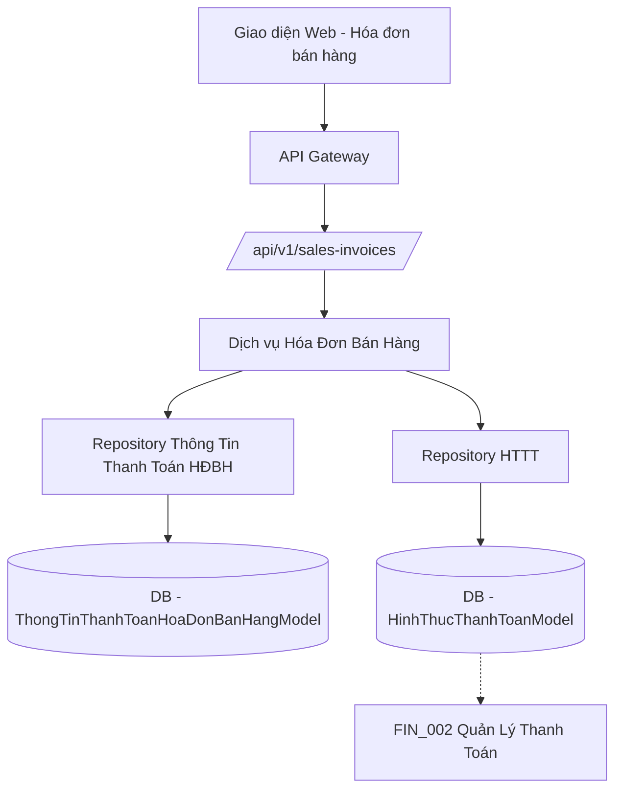

# SAL_006_Quản Lý Hình Thức Thanh Toán (Cho Bán Hàng)

*Phiên bản: 1.0*  
*Người tạo: ChatGPT*  
*Ngày tạo: 13/05/2025*  
*Cập nhật lần cuối: 13/05/2025*  
*Người cập nhật: ChatGPT*

## 1. Tổng Quan Nghiệp Vụ

### 1.1. Mô Tả Nghiệp Vụ
Quy trình Quản Lý Hình Thức Thanh Toán cho Bán Hàng tập trung vào việc áp dụng và quản lý các hình thức thanh toán trong các giao dịch bán hàng. Trong khi việc thiết lập danh mục các hình thức thanh toán (HTTT) được thực hiện trong phân hệ Tài Chính (tham khảo FIN_002), quy trình này mô tả cách các HTTT được sử dụng trong đơn hàng bán, hóa đơn bán hàng, và cách thông tin thanh toán chi tiết được ghi nhận. Điều này bao gồm việc chọn HTTT, ghi nhận số tiền thanh toán theo từng hình thức, và xử lý các trường hợp thanh toán đặc biệt (ví dụ: đặt cọc, thanh toán nhiều lần).

### 1.2. Phạm Vi Áp Dụng
- **Phòng Kinh Doanh**: Chọn hình thức thanh toán khi tạo đơn hàng, thỏa thuận điều kiện thanh toán với khách hàng.
- **Phòng Kế Toán**: Ghi nhận thanh toán trên hóa đơn, đối chiếu công nợ, theo dõi các khoản thanh toán từ khách hàng.
- **Nhân viên bán hàng/thu ngân**: Xử lý thanh toán tại điểm bán hoặc khi giao hàng (COD).

### 1.3. Định Nghĩa Thuật Ngữ
| Thuật ngữ | Định nghĩa |
|-----------|------------|
| Hình thức thanh toán (HTTT) | Các cách thức cụ thể mà khách hàng sử dụng để thanh toán cho hàng hóa/dịch vụ (ví dụ: Tiền mặt tại quầy, Chuyển khoản ngân hàng, Thẻ tín dụng, COD). Được định nghĩa trong FIN_002. Mã: `ma_httt`. |
| Thông tin thanh toán hóa đơn | Chi tiết các khoản thanh toán được thực hiện cho một hóa đơn bán hàng, có thể bao gồm nhiều dòng với các HTTT và số tiền khác nhau. |
| Điều kiện thanh toán | Các điều khoản về thời hạn và cách thức thanh toán đã thỏa thuận (ví dụ: Thanh toán ngay, Trả chậm 30 ngày). Tham khảo FIN_006. |

### 1.4. Tài Liệu Liên Quan
| STT | Mã tài liệu | Tên tài liệu | Mô tả |
|-----|-------------|--------------|-------|
| 1   | FIN_002 | Quản Lý Thanh Toán | Định nghĩa và quản lý danh mục Hình Thức Thanh Toán (HTTT). |
| 2   | SAL_004 | Quản Lý Hóa Đơn Bán Hàng | Nơi áp dụng và ghi nhận HTTT cho giao dịch bán hàng. |
| 3   | SAL_001 | Quản Lý Khách Hàng | Có thể lưu trữ HTTT ưu tiên hoặc mặc định cho khách hàng. |
| 4   | SAL_005 | Quản Lý Kênh Bán Hàng | Có thể lưu trữ HTTT mặc định cho kênh bán hàng. |
| 5   | FIN_006 | Quản Lý Điều Kiện Thanh Toán | Xác định thời hạn và các điều khoản thanh toán. |

## 2. Quy Trình Nghiệp Vụ

### 2.1. Tổng Quan Quy Trình
1.  Hình thức thanh toán (HTTT) được định nghĩa sẵn trong hệ thống (tham khảo FIN_002).
2.  Khi tạo Đơn hàng bán hoặc Hóa đơn bán hàng, người dùng chọn một hoặc nhiều HTTT phù hợp.
3.  Hệ thống có thể gợi ý HTTT mặc định dựa trên thông tin Khách hàng hoặc Kênh bán hàng.
4.  Thông tin chi tiết về các khoản thanh toán theo từng HTTT được ghi nhận trên Hóa đơn bán hàng.
5.  Xử lý các nghiệp vụ thanh toán liên quan như thu tiền, đối soát.

### 2.2. Sơ Đồ Quy Trình (Business Flow)

```mermaid
flowchart TD
    A[Bắt đầu: Tạo Đơn hàng/Hóa đơn bán hàng] --> B{HTTT mặc định từ KH/Kênh bán hàng?}
    B --Có--> C[Hệ thống gợi ý HTTT]
    B --Không / Muốn thay đổi--> D[Người dùng chọn HTTT từ danh mục]
    C --> E
    D --> E{Thanh toán bằng một hay nhiều HTTT?}
    E --Một HTTT--> F[Chọn 1 HTTT, nhập tổng số tiền]
    E --Nhiều HTTT--> G[Thêm dòng thông tin thanh toán]
    G --> H[Chọn HTTT, nhập số tiền cho từng dòng]
    H --> I{Tổng tiền các dòng TT = Tổng hóa đơn?}
    I --Đúng--> J[Lưu thông tin thanh toán trên Hóa đơn]
    I --Sai--> H
    F --> J
    J --> K[Xử lý thu tiền/Đối soát (Phân hệ Kế toán/Tài chính)]
    K --> L[Kết thúc]
```
*Lưu ý: Việc định nghĩa HTTT (mã, tên, loại) được thực hiện trong quy trình FIN_002.*

### 2.3. Chi Tiết Các Bước Quy Trình

#### 2.3.1. Áp Dụng Hình Thức Thanh Toán vào Hóa Đơn Bán Hàng
- **Mô tả**: Ghi nhận cách thức khách hàng sẽ thanh toán hoặc đã thanh toán cho một hóa đơn bán hàng.
- **Đầu vào**:
    - Hóa đơn bán hàng.
    - Danh mục Hình Thức Thanh Toán đã được thiết lập (từ FIN_002).
    - Thông tin thanh toán từ khách hàng.
- **Đầu ra**:
    - Thông tin thanh toán được cập nhật trên hóa đơn bán hàng, bao gồm:
        - Mã hình thức thanh toán (`ma_httt`) cho mỗi khoản.
        - Số tiền thanh toán theo từng hình thức.
        - Ngày thanh toán (nếu có).
        - Tài khoản ngân hàng nhận tiền (nếu áp dụng).
        - Tham chiếu giao dịch (nếu có).
- **Người thực hiện**: Nhân viên Kế toán, Nhân viên Kinh doanh.
- **Điều kiện tiên quyết**: Hóa đơn bán hàng đã được tạo. Danh mục HTTT đã có.
- **Xử lý ngoại lệ**:
    - Tổng số tiền thanh toán theo các hình thức không khớp với tổng giá trị hóa đơn (tùy cấu hình có cho phép hay không).
    - Hình thức thanh toán không hợp lệ hoặc không hoạt động.

## 3. Yêu Cầu Chức Năng

### 3.1. Danh Sách Chức Năng

| STT | Mã chức năng | Tên chức năng | Mô tả | Độ ưu tiên |
|-----|--------------|---------------|-------|------------|
| 1   | SPP_001 | Chọn HTTT cho Hóa đơn | Cho phép người dùng chọn một hoặc nhiều HTTT khi lập hóa đơn bán hàng. | Cao |
| 2   | SPP_002 | Ghi nhận chi tiết thanh toán | Cho phép nhập số tiền và các thông tin liên quan cho từng HTTT trên hóa đơn. | Cao |
| 3   | SPP_003 | Gợi ý HTTT mặc định | Hệ thống tự động gợi ý HTTT dựa trên Khách hàng hoặc Kênh bán hàng. | Trung bình |
| 4   | SPP_004 | Xem lịch sử thanh toán theo HTTT | Báo cáo, tra cứu các giao dịch bán hàng theo HTTT. | Trung bình |

### 3.2. Chi Tiết Chức Năng

#### 3.2.1. SPP_001: Chọn HTTT cho Hóa đơn
- **Mô tả**: Tại màn hình Hóa đơn bán hàng, cho phép người dùng chọn các hình thức thanh toán mà khách hàng sử dụng.
- **Đầu vào**: Danh sách HTTT đang hoạt động.
- **Đầu ra**: HTTT được chọn và gán vào mục/dòng thông tin thanh toán của hóa đơn.
- **Điều kiện tiên quyết**: Đang trong quá trình tạo/sửa hóa đơn bán hàng.
- **Luồng xử lý chính**:
  1.  Trong tab/section "Thông tin thanh toán" của hóa đơn.
  2.  Người dùng thêm một dòng thanh toán mới.
  3.  Hệ thống hiển thị dropdown/lookup để chọn `ma_httt`.
  4.  Người dùng chọn HTTT mong muốn.
- **Giao diện liên quan**: Màn hình chi tiết Hóa đơn bán hàng (Tab/Section Thông tin thanh toán).

#### 3.2.2. SPP_002: Ghi nhận chi tiết thanh toán
- **Mô tả**: Cho phép nhập số tiền và các thông tin khác (ngày TT, tài khoản, tham chiếu) cho mỗi hình thức thanh toán đã chọn trên hóa đơn.
- **Đầu vào**: HTTT đã chọn, số tiền, ngày thanh toán, thông tin bổ sung.
- **Đầu ra**: Dòng thông tin thanh toán được lưu trữ, liên kết với hóa đơn.
- **Điều kiện tiên quyết**: Đã chọn HTTT cho dòng thanh toán.
- **Luồng xử lý chính**:
  1.  Sau khi chọn HTTT, người dùng nhập số tiền tương ứng.
  2.  Nhập các thông tin tùy chọn khác (ngày, tài khoản...).
  3.  Hệ thống kiểm tra tính hợp lệ (ví dụ: số tiền không âm).
- **Luồng xử lý thay thế/ngoại lệ**:
  -   Tổng tiền các dòng thanh toán phải bằng tổng tiền hóa đơn (trừ khi cho phép thanh toán một phần/đặt cọc).
- **Giao diện liên quan**: Màn hình chi tiết Hóa đơn bán hàng (Tab/Section Thông tin thanh toán).

## 4. Thiết Kế Kỹ Thuật

### 4.1. Kiến Trúc Hệ Thống
Việc quản lý danh mục `HinhThucThanhToanModel` được mô tả trong FIN_002. Phần này tập trung vào model `ThongTinThanhToanHoaDonBanHangModel`.



### 4.2. API Endpoints
Việc quản lý Hình Thức Thanh Toán (master data) có API riêng (xem FIN_002).
Việc áp dụng HTTT vào hóa đơn bán hàng được thực hiện thông qua API của Hóa Đơn Bán Hàng:
- `POST /api/v1/entity/{entity_slug}/erp/sales-invoices/` (Khi tạo hóa đơn, payload có thể chứa mảng thông tin thanh toán)
- `PUT /api/v1/entity/{entity_slug}/erp/sales-invoices/{uuid}/` (Khi cập nhật hóa đơn, payload có thể chứa mảng thông tin thanh toán)

Payload cho thông tin thanh toán trong Hóa đơn có thể có dạng:
```json
{
  // ... các trường khác của hóa đơn ...
  "thong_tin_thanh_toan": [
    {
      "ma_httt_id": "uuid_cua_httt_1", // FK đến HinhThucThanhToanModel
      "so_tien": 1000000,
      "ngay_thanh_toan": "2025-05-13",
      "tai_khoan_nhan_id": "uuid_cua_tai_khoan_ngan_hang", // FK đến BankAccountModel (nếu có)
      "ghi_chu": "Thanh toán lần 1"
    },
    {
      "ma_httt_id": "uuid_cua_httt_2",
      "so_tien": 500000,
      // ...
    }
  ]
}
```

### 4.3. Service Logic

#### 4.3.1. HoaDonBanHangService (Phần liên quan đến thanh toán)
- **Mô tả**: Xử lý logic nghiệp vụ cho Hóa Đơn Bán Hàng, bao gồm việc quản lý các dòng thông tin thanh toán.
- **Chức năng chính**:
  - Khi tạo/cập nhật Hóa đơn bán hàng:
    - Validate dữ liệu các dòng `ThongTinThanhToanHoaDonBanHangModel` (ví dụ: `ma_httt_id` hợp lệ, `so_tien` dương).
    - Xóa các dòng thông tin thanh toán cũ (nếu cập nhật) và tạo mới dựa trên payload.
    - Đảm bảo tổng các `so_tien` trong `thong_tin_thanh_toan` khớp với logic của hóa đơn (ví dụ: bằng tổng tiền phải thu, hoặc cho phép thanh toán một phần tùy theo trạng thái).
- **Dependencies**: `ThongTinThanhToanHoaDonBanHangRepository`, `HinhThucThanhToanRepository`, `BankAccountRepository`.

### 4.4. Mô Hình Dữ Liệu

#### 4.4.1. Entity Relationship Diagram (ERD)

```mermaid
erDiagram
    HOA_DON_BAN_HANG ||--|{ THONG_TIN_THANH_TOAN_HD_BH : "có chi tiết"
    THONG_TIN_THANH_TOAN_HD_BH }|--|| HINH_THUC_THANH_TOAN : "sử dụng"
    THONG_TIN_THANH_TOAN_HD_BH }o--|| BANK_ACCOUNT : "vào tài khoản"

    HOA_DON_BAN_HANG {
        uuid uuid PK
        string so_hoa_don
        decimal tong_tien
        -- các trường khác
    }

    THONG_TIN_THANH_TOAN_HD_BH {
        uuid uuid PK
        uuid hoa_don_ban_hang_id FK "Hóa đơn bán hàng"
        integer line "Số dòng"
        uuid ma_httt_id FK "Hình thức thanh toán"
        decimal so_tien "Số tiền"
        date ngay_thanh_toan "Ngày thanh toán"
        uuid tai_khoan_nhan_id FK "Tài khoản nhận tiền (nếu có)"
        string dien_giai "Diễn giải"
        string tham_chieu "Tham chiếu giao dịch"
    }

    HINH_THUC_THANH_TOAN {
        uuid uuid PK
        string ma_httt "Mã HTTT"
        string ten_httt "Tên HTTT"
        -- (Xem FIN_002 để biết thêm chi tiết)
    }
    
    BANK_ACCOUNT {
        uuid uuid PK
        string account_number "Số tài khoản"
        -- (Xem FIN_001 để biết thêm chi tiết)
    }
```
*Lưu ý: `HINH_THUC_THANH_TOAN` được quản lý trong FIN_002.*

#### 4.4.2. Chi Tiết Bảng Dữ Liệu

##### Bảng: THONG_TIN_THANH_TOAN_HOA_DON_BAN_HANG (ThongTinThanhToanHoaDonBanHangModel)
- **Mô tả**: Lưu trữ chi tiết các khoản thanh toán cho một hóa đơn bán hàng. Một hóa đơn có thể có nhiều dòng thanh toán với các hình thức khác nhau.
- **Các trường chính**:
  - `uuid`: Khóa chính.
  - `hoa_don_ban_hang_id`: Khóa ngoại, liên kết đến `HOA_DON_BAN_HANG`.
  - `line`: Số thứ tự dòng.
  - `ma_httt_id`: Khóa ngoại, liên kết đến `HINH_THUC_THANH_TOAN`.
  - `so_tien`: Số tiền thanh toán cho dòng này.
  - `ngay_thanh_toan`: Ngày thực hiện thanh toán.
  - `tai_khoan_nhan_id`: Khóa ngoại, liên kết đến `BANK_ACCOUNT` (tài khoản ngân hàng của công ty nhận tiền, nullable).
  - `dien_giai`: Diễn giải thêm.
  - `tham_chieu`: Mã tham chiếu giao dịch (ví dụ: mã giao dịch ngân hàng, số phiếu thu).

## 5. Kế Hoạch Kiểm Thử

### 5.1. Phạm Vi Kiểm Thử
- Áp dụng một HTTT cho toàn bộ giá trị hóa đơn.
- Áp dụng nhiều HTTT cho một hóa đơn (thanh toán kết hợp).
- Kiểm tra việc gợi ý HTTT mặc định (nếu có cấu hình từ Khách hàng/Kênh bán hàng).
- Tính đúng đắn của tổng số tiền thanh toán so với giá trị hóa đơn.
- Ghi nhận các thông tin bổ sung như ngày thanh toán, tài khoản nhận, tham chiếu.

### 5.2. Kịch Bản Kiểm Thử

| STT | Mã kịch bản | Tên kịch bản | Mô tả | Điều kiện tiên quyết | Các bước | Kết quả mong đợi |
|-----|------------|--------------|-------|---------------------|----------|-----------------|
| 1   | TC_SPP_001 | Thanh toán hóa đơn bằng 1 HTTT | Tạo hóa đơn 1,000,000 VND, thanh toán toàn bộ bằng "Chuyển khoản". | Hóa đơn đã tạo. HTTT "Chuyển khoản" (CK) tồn tại. | 1. Mở hóa đơn.<br>2. Vào mục Thông tin thanh toán.<br>3. Thêm dòng TT, chọn HTTT="CK", Số tiền=1,000,000.<br>4. Lưu. | Hóa đơn ghi nhận thanh toán 1,000,000 bằng CK. |
| 2   | TC_SPP_002 | Thanh toán hóa đơn bằng nhiều HTTT | Tạo hóa đơn 1,500,000 VND. Thanh toán 1,000,000 bằng "Chuyển khoản", 500,000 bằng "Tiền mặt". | Hóa đơn đã tạo. HTTT "CK", "Tiền mặt" (TM) tồn tại. | 1. Mở hóa đơn.<br>2. Vào mục Thông tin thanh toán.<br>3. Thêm dòng TT 1: HTTT="CK", Số tiền=1,000,000.<br>4. Thêm dòng TT 2: HTTT="TM", Số tiền=500,000.<br>5. Lưu. | Hóa đơn ghi nhận 2 dòng thanh toán với tổng tiền 1,500,000. |
| 3   | TC_SPP_003 | Thanh toán một phần hóa đơn | Tạo hóa đơn 2,000,000 VND. Khách đặt cọc 500,000 bằng "Chuyển khoản". | Hóa đơn đã tạo. HTTT "CK" tồn tại. Hệ thống cho phép thanh toán một phần. | 1. Mở hóa đơn.<br>2. Vào mục Thông tin thanh toán.<br>3. Thêm dòng TT: HTTT="CK", Số tiền=500,000.<br>4. Lưu. | Hóa đơn ghi nhận thanh toán 500,000. Công nợ còn lại 1,500,000. |

## 6. Phụ Lục

### 6.1. Danh Sách Tài Liệu Tham Khảo
1.  FIN_002_Quản Lý Thanh Toán
2.  SAL_004_Quản Lý Hóa Đơn Bán Hàng
3.  Mô hình dữ liệu: `HinhThucThanhToanModel`, `ThongTinThanhToanHoaDonBanHangModel`.

### 6.2. Danh Mục Thuật Ngữ
- HTTT: Hình Thức Thanh Toán
- PTTT: Phương Thức Thanh Toán
- HĐBH: Hóa Đơn Bán Hàng
- COD: Cash On Delivery (Giao hàng thu tiền hộ)
- CK: Chuyển Khoản
- TM: Tiền Mặt

### 6.3. Lịch Sử Thay Đổi Tài Liệu

| Phiên bản | Ngày | Người thực hiện | Mô tả thay đổi |
|-----------|------|-----------------|---------------|
| 1.0 | 13/05/2025 | ChatGPT | Tạo mới tài liệu |
