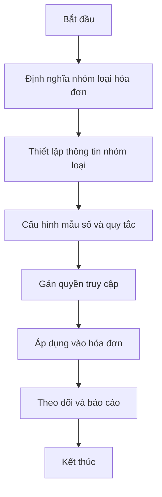
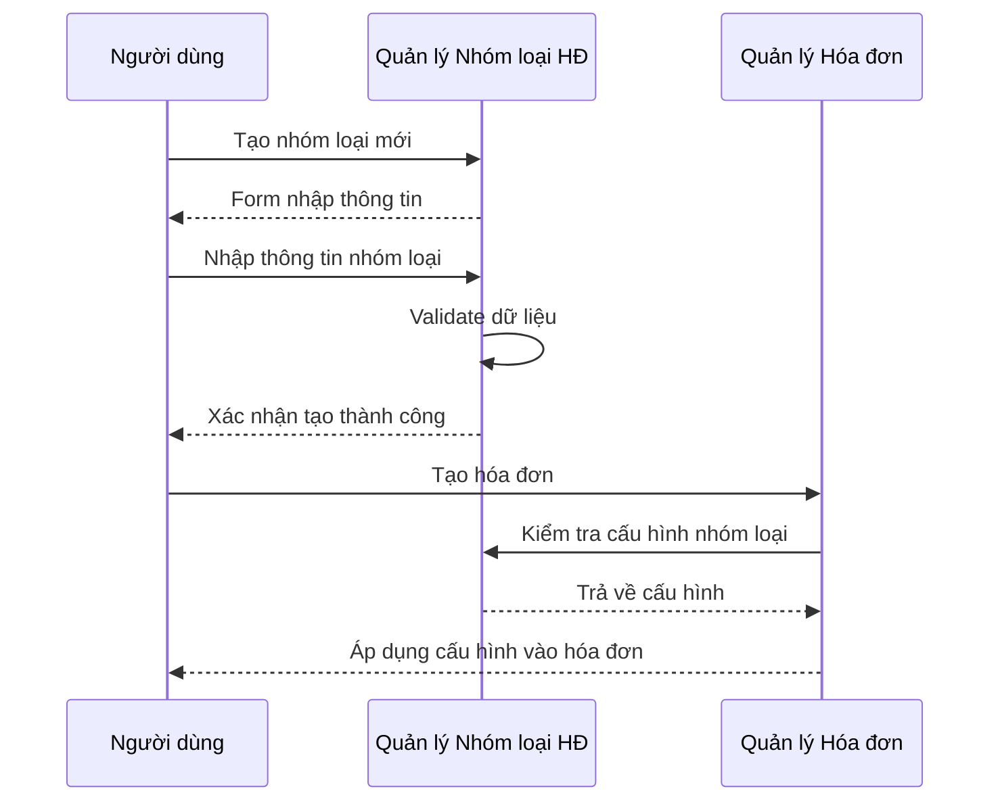
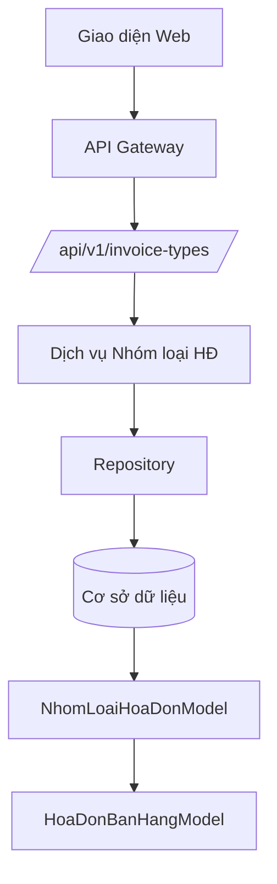

# SAL_008_Quản Lý Nhóm Loại Hóa Đơn

*Phiên bản: 1.0*  
*Người tạo: ChatGPT*  
*Ngày tạo: 13/05/2025*  
*Cập nhật lần cuối: 13/05/2025*  
*Người cập nhật: ChatGPT*

## 1. Tổng Quan Nghiệp Vụ

### 1.1. Mô Tả Nghiệp Vụ
Quy trình Quản Lý Nhóm Loại Hóa Đơn cho phép doanh nghiệp phân loại và quản lý các loại hóa đơn khác nhau theo nhóm, phục vụ cho việc tổ chức, phân quyền và báo cáo. Mỗi nhóm loại hóa đơn có thể có các đặc điểm riêng về mẫu số sử dụng, cách đánh số, quy tắc xử lý và yêu cầu về thuế. Quy trình này giúp đảm bảo việc phát hành hóa đơn tuân thủ đúng quy định và dễ dàng trong việc quản lý, thống kê.

### 1.2. Phạm Vi Áp Dụng
- **Phòng Kế Toán**: Thiết lập và quản lý các nhóm loại hóa đơn theo quy định.
- **Phòng Bán Hàng**: Sử dụng đúng loại hóa đơn cho từng giao dịch.
- **Ban Giám Đốc**: Xem báo cáo theo nhóm loại hóa đơn.
- **Bộ phận IT**: Cấu hình hệ thống theo các nhóm loại hóa đơn.

### 1.3. Định Nghĩa Thuật Ngữ
| Thuật ngữ | Định nghĩa |
|-----------|------------|
| Nhóm loại hóa đơn | Cách phân nhóm các hóa đơn có cùng đặc điểm về mục đích sử dụng, yêu cầu pháp lý hoặc cách xử lý. |
| HĐĐT | Hóa đơn điện tử. |
| GTGT | Giá trị gia tăng (VAT). |
| Mẫu số | Ký hiệu định danh mẫu hóa đơn được cơ quan thuế cấp. |

### 1.4. Tài Liệu Liên Quan
| STT | Mã tài liệu | Tên tài liệu | Mô tả |
|-----|-------------|--------------|-------|
| 1   | SAL_004 | Quản Lý Hóa Đơn Bán Hàng | Quy trình phát hành hóa đơn. |
| 2   | SAL_007 | Quản Lý Mẫu Số Hóa Đơn | Quy định về mẫu số cho từng loại hóa đơn. |
| 3   | DOC_002 | Quản Lý Quyền Hóa Đơn Điện Tử | Phân quyền theo nhóm loại hóa đơn. |
| 4   | ACC_006 | Quản Lý Thuế | Quy định về thuế cho từng loại hóa đơn. |

## 2. Quy Trình Nghiệp Vụ

### 2.1. Tổng Quan Quy Trình
1.  Thiết lập các nhóm loại hóa đơn.
2.  Cấu hình thông tin cho từng nhóm.
3.  Áp dụng nhóm loại khi phát hành hóa đơn.
4.  Theo dõi và báo cáo theo nhóm loại.

### 2.2. Sơ Đồ Quy Trình (Business Flow)



### 2.3. Chi Tiết Các Bước Quy Trình

#### 2.3.1. Thiết Lập Nhóm Loại Hóa Đơn
- **Mô tả**: Định nghĩa các nhóm loại hóa đơn cần quản lý.
- **Đầu vào**:
    - Mã nhóm loại (`ma_nhom_loai`)
    - Tên nhóm loại (`ten_nhom_loai`)
    - Mô tả (`mo_ta`)
    - Các thuộc tính cấu hình:
        - Áp dụng thuế GTGT (`ap_dung_thue_gtgt`)
        - Cho phép điều chỉnh (`cho_phep_dieu_chinh`)
        - Nhóm cha (nếu có) (`nhom_cha_id`)
- **Đầu ra**: Nhóm loại hóa đơn được tạo trong hệ thống.
- **Người thực hiện**: Quản trị hệ thống, Kế toán trưởng.
- **Điều kiện tiên quyết**: Có quyền quản trị danh mục.

#### 2.3.2. Cấu Hình Chi Tiết Nhóm Loại
- **Mô tả**: Thiết lập các thông số chi tiết cho nhóm loại.
- **Đầu vào**:
    - Mẫu số mặc định (`mau_so_mac_dinh`)
    - Quy tắc đánh số (`quy_tac_danh_so`)
    - Yêu cầu phê duyệt (`yeu_cau_phe_duyet`)
    - Các tài khoản kế toán liên quan (`tai_khoan_lien_quan`)
- **Đầu ra**: Cấu hình được lưu và áp dụng.
- **Điều kiện tiên quyết**: Nhóm loại đã được tạo.

### 2.4. Sơ Đồ Tuần Tự (Sequence Diagram)



### 2.5. Luồng Nghiệp Vụ Thay Thế
1.  **Thay đổi cấu hình nhóm loại**:
    *   Cập nhật các thông số với hiệu lực từ ngày cụ thể.
    *   Không ảnh hưởng đến các hóa đơn đã phát hành.
2.  **Ngưng sử dụng nhóm loại**:
    *   Đánh dấu không còn sử dụng từ ngày cụ thể.
    *   Lưu trữ lịch sử cho mục đích tra cứu.

## 3. Yêu Cầu Chức Năng

### 3.1. Danh Sách Chức Năng

| STT | Mã chức năng | Tên chức năng | Mô tả | Độ ưu tiên |
|-----|--------------|---------------|-------|------------|
| 1   | ITP_001 | Quản lý Nhóm loại HĐ | Tạo, sửa, xóa các nhóm loại hóa đơn. | Cao |
| 2   | ITP_002 | Cấu hình chi tiết | Thiết lập các thông số cho nhóm loại. | Cao |
| 3   | ITP_003 | Phân quyền | Gán quyền truy cập theo nhóm loại. | Cao |
| 4   | ITP_004 | Báo cáo theo nhóm | Xem báo cáo phân tích theo nhóm loại. | Trung bình |

### 3.2. Chi Tiết Chức Năng

#### 3.2.1. ITP_001: Quản lý Nhóm loại HĐ
- **Mô tả**: Cho phép người dùng quản lý danh mục nhóm loại hóa đơn.
- **Đầu vào**: Thông tin nhóm loại (mã, tên, mô tả, cấu hình).
- **Đầu ra**: Danh sách nhóm loại, form tạo/sửa nhóm loại.
- **Điều kiện tiên quyết**: Người dùng có quyền quản trị danh mục.
- **Luồng xử lý chính**:
  1.  Truy cập màn hình Quản lý Nhóm loại HĐ.
  2.  Hiển thị danh sách nhóm loại hiện có.
  3.  Cho phép thêm mới, sửa thông tin, thay đổi trạng thái.
- **Luồng xử lý thay thế/ngoại lệ**:
  -   Lỗi khi lưu (trùng mã, dữ liệu không hợp lệ).
  -   Xử lý khi xóa nhóm loại đã được sử dụng.

## 4. Thiết Kế Kỹ Thuật

### 4.1. Kiến Trúc Hệ Thống



### 4.2. API Endpoints
- **URL**: `/api/v1/entity/{entity_slug}/erp/invoice-types/`
- **Phương thức**:
  - `GET /`: Lấy danh sách nhóm loại
  - `POST /`: Tạo nhóm loại mới
  - `GET /{uuid}/`: Xem chi tiết một nhóm loại
  - `PUT /{uuid}/`: Cập nhật nhóm loại
  - `DELETE /{uuid}/`: Xóa nhóm loại

### 4.3. Service Logic

#### 4.3.1. NhomLoaiHoaDonModelService
- **Mô tả**: Xử lý logic nghiệp vụ cho Nhóm loại hóa đơn.
- **Chức năng chính**:
  1.  Validate dữ liệu (ví dụ: mã nhóm loại hợp lệ, cấu hình phù hợp).
  2.  CRUD operations cho `NhomLoaiHoaDonModel`.
  3.  Kiểm tra ràng buộc khi thay đổi cấu hình.
  4.  Xử lý phân cấp nhóm cha-con (nếu có).
- **Dependencies**: `NhomLoaiHoaDonRepository`.

### 4.4. Mô Hình Dữ Liệu

#### 4.4.1. Entity Relationship Diagram (ERD)

```mermaid
erDiagram
    NHOM_LOAI_HOA_DON ||--o{ HOA_DON_BAN_HANG : "áp dụng cho"
    NHOM_LOAI_HOA_DON ||--o{ MAU_SO_HOA_DON : "sử dụng"
    NHOM_LOAI_HOA_DON }|--|| ENTITY : "thuộc về"

    NHOM_LOAI_HOA_DON {
        uuid uuid PK
        string ma_nhom_loai "Mã nhóm loại"
        string ten_nhom_loai "Tên nhóm loại"
        text mo_ta "Mô tả"
        boolean ap_dung_thue_gtgt "Áp dụng thuế GTGT"
        boolean cho_phep_dieu_chinh "Cho phép điều chỉnh"
        uuid nhom_cha_id FK "Nhóm cha (nullable)"
        uuid entity_model_id FK
        integer status "Trạng thái"
    }

    HOA_DON_BAN_HANG {
        uuid uuid PK
        uuid nhom_loai_id FK "Nhóm loại hóa đơn"
        -- các trường khác của hóa đơn
    }

    MAU_SO_HOA_DON {
        uuid uuid PK
        string ma_mau_so
        -- các trường khác của mẫu số
    }
```

#### 4.4.2. Chi Tiết Bảng Dữ Liệu

##### Bảng: NHOM_LOAI_HOA_DON (NhomLoaiHoaDonModel)
- **Mô tả**: Lưu trữ thông tin các nhóm loại hóa đơn.
- **Các trường chính**:
  - `uuid`: Khóa chính.
  - `ma_nhom_loai`: Mã nhóm loại (unique trong một entity).
  - `ten_nhom_loai`: Tên nhóm loại.
  - `mo_ta`: Mô tả chi tiết.
  - `ap_dung_thue_gtgt`: Có áp dụng thuế GTGT không.
  - `cho_phep_dieu_chinh`: Cho phép điều chỉnh hóa đơn không.
  - `nhom_cha_id`: Khóa ngoại đến chính bảng này (self-referencing, nullable).
  - `entity_model_id`: Khóa ngoại đến ENTITY.
  - `status`: Trạng thái hoạt động.

## 5. Kế Hoạch Kiểm Thử

### 5.1. Phạm Vi Kiểm Thử
- Tạo, sửa, xóa nhóm loại hóa đơn.
- Cấu hình và áp dụng các thông số.
- Kiểm tra tính năng phân cấp nhóm.
- Áp dụng nhóm loại vào hóa đơn.
- Báo cáo và thống kê theo nhóm loại.

### 5.2. Kịch Bản Kiểm Thử

| STT | Mã kịch bản | Tên kịch bản | Mô tả | Điều kiện tiên quyết | Các bước | Kết quả mong đợi |
|-----|------------|--------------|-------|---------------------|----------|-----------------|
| 1   | TC_ITP_001 | Tạo Nhóm loại HĐ | Tạo nhóm "Hóa đơn GTGT". | Đăng nhập, có quyền. | 1. Vào QL Nhóm loại HĐ.<br>2. Nhấn "Thêm mới".<br>3. Nhập thông tin nhóm.<br>4. Lưu. | Nhóm loại được tạo thành công. |
| 2   | TC_ITP_002 | Áp dụng vào HĐ | Tạo hóa đơn với nhóm loại đã định nghĩa. | Nhóm loại tồn tại. | 1. Tạo hóa đơn mới.<br>2. Chọn nhóm loại.<br>3. Kiểm tra cấu hình được áp dụng.<br>4. Lưu. | Hóa đơn được tạo với cấu hình đúng. |
| 3   | TC_ITP_003 | Báo cáo theo nhóm | Xem báo cáo doanh số theo nhóm loại. | Có dữ liệu hóa đơn. | 1. Vào mục Báo cáo.<br>2. Chọn tiêu chí theo nhóm.<br>3. Xem báo cáo. | Hiển thị thống kê chính xác. |

## 6. Phụ Lục

### 6.1. Danh Sách Tài Liệu Tham Khảo
1.  Thông tư quy định về hóa đơn, chứng từ.
2.  Tài liệu hướng dẫn sử dụng hóa đơn điện tử.
3.  Quy định về phân loại hóa đơn trong doanh nghiệp.

### 6.2. Danh Mục Thuật Ngữ
- HĐĐT: Hóa Đơn Điện Tử
- GTGT: Giá Trị Gia Tăng
- HĐ: Hóa Đơn

### 6.3. Lịch Sử Thay Đổi Tài Liệu

| Phiên bản | Ngày | Người thực hiện | Mô tả thay đổi |
|-----------|------|-----------------|---------------|
| 1.0 | 13/05/2025 | ChatGPT | Tạo mới tài liệu |
