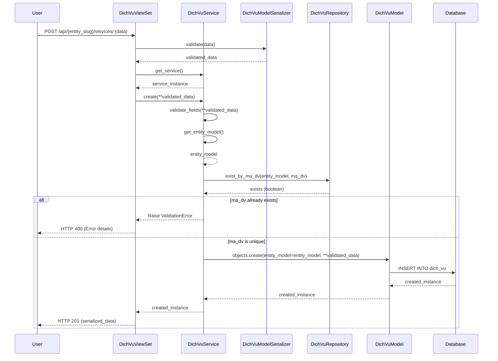
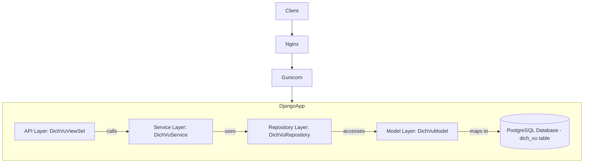

# SRV_001_Service_Quản Lý Dịch Vụ

*Phiên bản: 1.0*
*Người tạo: Gemini AI Assistant*
*Ngày tạo: 2024-07-31*
*Cập nhật lần cuối: 2024-07-31*
*Người cập nhật: Gemini AI Assistant*

## 1. Tổng Quan Nghiệp Vụ

### 1.1. Mô Tả Nghiệp Vụ
Nghiệp vụ Quản Lý Dịch Vụ (trong mã nguồn là `DichVuModel`) cho phép người dùng định nghĩa và quản lý các dịch vụ trong hệ thống. Mỗi dịch vụ bao gồm các thông tin như mã, tên, đơn vị tính, tài khoản doanh thu, tài khoản chi phí, mã thuế, giá và các thông tin liên quan khác. Mục đích là cung cấp một danh mục chuẩn hóa các dịch vụ để sử dụng trong các quy trình nghiệp vụ khác như lập hóa đơn, tính giá, ghi nhận doanh thu, và báo cáo.

### 1.2. Phạm Vi Áp Dụng
- Áp dụng cho từng Đơn vị (Entity) trong hệ thống.
- Các bộ phận liên quan đến quản lý dịch vụ, kế toán, bán hàng, và báo cáo.

### 1.3. Định Nghĩa Thuật Ngữ
| Thuật ngữ | Định nghĩa |
|-----------|------------|
| Dịch Vụ | Một sản phẩm không hữu hình được cung cấp cho khách hàng. Trong mã nguồn là `DichVuModel`. |
| Đơn vị (Entity) | Tổ chức hoặc công ty mà dịch vụ được định nghĩa và áp dụng. |
| `ma_dv` | Mã định danh duy nhất cho một dịch vụ trong một đơn vị. |
| `ten_dv` | Tên chính của dịch vụ. |
| `ten_dv2` | Tên thay thế/phụ của dịch vụ. |
| `action` | Hành động liên quan đến dịch vụ. |
| `param` | Tham số tùy chọn cho dịch vụ. |
| `dvt` | Đơn vị tính của dịch vụ (liên kết đến `DonViTinhModel`). |
| `tk_dt` | Tài khoản doanh thu liên quan đến dịch vụ (liên kết đến `AccountModel`). |
| `tk_cp` | Tài khoản chi phí liên quan đến dịch vụ (liên kết đến `AccountModel`). |
| `ma_thue` | Mã thuế liên quan đến dịch vụ (liên kết đến `TaxModel`). |
| `gia_nt` | Giá ngoại tệ chính của dịch vụ. |
| `gia_nt2` | Giá ngoại tệ thứ hai của dịch vụ. |
| `status` | Trạng thái của dịch vụ: 1 (Active - Hoạt động), 0 (Inactive - Không hoạt động). |

### 1.4. Tài Liệu Liên Quan
| STT | Mã tài liệu | Tên tài liệu | Mô tả |
|-----|-------------|--------------|-------|
| 1   | `django_ledger/models/dich_vu.py` | Model Định Nghĩa Dịch Vụ | Định nghĩa cấu trúc dữ liệu cho `DichVuModel`. |
| 2   | `django_ledger/api/views/dich_vu.py` | API Endpoints Dịch Vụ | Các điểm cuối API để tương tác với nghiệp vụ Quản Lý Dịch Vụ. |
| 3   | `django_ledger/api/serializers/dich_vu.py` | Serializers Dịch Vụ | Định dạng dữ liệu JSON cho API, thực hiện validation. |
| 4   | `django_ledger/services/dich_vu/service.py` | Service Logic Dịch Vụ | Logic nghiệp vụ cho việc tạo, cập nhật, xóa, truy vấn Dịch Vụ. |
| 5   | `django_ledger/repositories/dich_vu/repository.py` | Repository Dịch Vụ | Lớp truy cập dữ liệu cho Dịch Vụ. |
| 6   | `django_ledger/api/urls.py` | URL Configuration | Đăng ký endpoint `/api/{entity_slug}/services/` cho Dịch Vụ. |

## 2. Quy Trình Nghiệp Vụ

### 2.1. Tổng Quan Quy Trình
Người dùng có thẩm quyền (ví dụ: quản trị viên, quản lý) tương tác với hệ thống thông qua giao diện người dùng hoặc API để thực hiện các thao tác CRUD (Create, Read, Update, Delete) đối với các Dịch Vụ. Hệ thống sẽ xử lý các yêu cầu này thông qua `DichVuViewSet`, sử dụng `DichVuService` để thực thi logic nghiệp vụ và `DichVuRepository` để tương tác với cơ sở dữ liệu. Dữ liệu đầu vào sẽ được kiểm tra (validate) bởi `DichVuModelSerializer` và `DichVuService`.

### 2.2. Sơ Đồ Quy Trình (Business Flow)

```mermaid
flowchart TD
    A[Người dùng yêu cầu thao tác Dịch Vụ] --> B{API Gateway nhận yêu cầu};
    B --> C[Xác thực & Ủy quyền (IsAuthenticated)];
    C --> D[DichVuViewSet];
    D --> E[DichVuService];
    E --> F[DichVuRepository];
    F --> G[(Cơ sở dữ liệu - Bảng dich_vu)];
    G --> F;
    F --> E;
    E --> D;
    subgraph "Validation"
        direction LR
        H[Request Data] --> I[DichVuModelSerializer];
        I --> J[DichVuService.validate_fields];
    end
    D --> H;
    J -- Dữ liệu hợp lệ --> E;
    J -- Dữ liệu không hợp lệ --> K[Báo lỗi cho ViewSet];
    K --> B;
    D --> L[Trả kết quả cho người dùng];
    B --> L;
```

### 2.3. Chi Tiết Các Bước Quy Trình

#### 2.3.1. Tạo Mới Dịch Vụ
- **Mô tả**: Người dùng cung cấp thông tin để tạo một Dịch Vụ mới cho một Đơn vị.
- **Đầu vào**: Dữ liệu Dịch Vụ (`ma_dv`, `ten_dv`, `action`, và các thông tin khác). `entity_slug` được lấy từ URL.
- **Đầu ra**: Dịch Vụ mới được tạo thành công hoặc thông báo lỗi.
- **Người thực hiện**: Quản trị viên, quản lý.
- **Điều kiện tiên quyết**: Đăng nhập hệ thống, có quyền truy cập vào Đơn vị. `ma_dv` phải là duy nhất trong Đơn vị đó. `ma_dv`, `ten_dv`, và `action` là bắt buộc.
- **Xử lý ngoại lệ**: Dữ liệu không hợp lệ (thiếu trường, sai định dạng, `ma_dv` bị trùng), Đơn vị không tồn tại.

#### 2.3.2. Xem/Tìm Kiếm Dịch Vụ
- **Mô tả**: Người dùng xem danh sách các Dịch Vụ của một Đơn vị hoặc chi tiết một Dịch Vụ cụ thể. Hỗ trợ phân trang và lọc theo trạng thái.
- **Đầu vào**: `entity_slug` (từ URL). Tùy chọn: `uuid` của Dịch Vụ (để xem chi tiết), tham số phân trang (`page`, `page_size`).
- **Đầu ra**: Danh sách các Dịch Vụ hoặc thông tin chi tiết của một Dịch Vụ.
- **Người thực hiện**: Mọi người dùng có quyền xem.
- **Điều kiện tiên quyết**: Đăng nhập hệ thống.
- **Xử lý ngoại lệ**: Dịch Vụ không tồn tại, Đơn vị không tồn tại.

#### 2.3.3. Cập Nhật Dịch Vụ
- **Mô tả**: Người dùng thay đổi thông tin của một Dịch Vụ đã tồn tại.
- **Đầu vào**: `entity_slug`, `uuid` của Dịch Vụ, và dữ liệu cần cập nhật.
- **Đầu ra**: Dịch Vụ được cập nhật thành công hoặc thông báo lỗi.
- **Người thực hiện**: Quản trị viên, quản lý.
- **Điều kiện tiên quyết**: Đăng nhập, Dịch Vụ phải tồn tại và thuộc Đơn vị chỉ định. Nếu `ma_dv` thay đổi, mã mới không được trùng.
- **Xử lý ngoại lệ**: Dữ liệu không hợp lệ, Dịch Vụ không tồn tại, `ma_dv` mới bị trùng.

#### 2.3.4. Xóa Dịch Vụ
- **Mô tả**: Người dùng xóa một Dịch Vụ khỏi hệ thống.
- **Đầu vào**: `entity_slug`, `uuid` của Dịch Vụ.
- **Đầu ra**: Thông báo xóa thành công hoặc thông báo lỗi.
- **Người thực hiện**: Quản trị viên, quản lý.
- **Điều kiện tiên quyết**: Đăng nhập, Dịch Vụ phải tồn tại và thuộc Đơn vị chỉ định. (Cần xem xét ràng buộc nếu Dịch Vụ đang được sử dụng ở nơi khác).
- **Xử lý ngoại lệ**: Dịch Vụ không tồn tại, Dịch Vụ đang được sử dụng.

### 2.4. Sơ Đồ Tuần Tự (Sequence Diagram) - Tạo mới Dịch Vụ



### 2.5. Luồng Nghiệp Vụ Thay Thế
- **Lấy hoặc tạo**: Khi cần một Dịch Vụ, hệ thống có thể sử dụng phương thức `get_or_create` để lấy một Dịch Vụ hiện có hoặc tạo một Dịch Vụ mới nếu không tồn tại.
- **Cập nhật hoặc tạo**: Hệ thống cũng cung cấp phương thức `update_or_create` để cập nhật một Dịch Vụ hiện có hoặc tạo một Dịch Vụ mới nếu không tồn tại.
- **Lọc theo trạng thái**: Người dùng có thể lọc Dịch Vụ theo trạng thái (hoạt động/không hoạt động) để dễ dàng quản lý.

## 3. Yêu Cầu Chức Năng

### 3.1. Danh Sách Chức Năng

| STT | Mã chức năng | Tên chức năng | Mô tả | Độ ưu tiên |
|-----|--------------|---------------|-------|------------|
| 1   | SRV001-LIST | Xem danh sách Dịch Vụ | Lấy danh sách Dịch Vụ theo Đơn vị, hỗ trợ phân trang. | Cao |
| 2   | SRV001-CREATE | Tạo mới Dịch Vụ | Tạo một Dịch Vụ mới cho một Đơn vị. | Cao |
| 3   | SRV001-RETRIEVE | Xem chi tiết Dịch Vụ | Lấy thông tin chi tiết của một Dịch Vụ bằng UUID. | Cao |
| 4   | SRV001-UPDATE | Cập nhật Dịch Vụ | Cập nhật thông tin của một Dịch Vụ đã có (PUT). | Cao |
| 5   | SRV001-PARTIAL-UPDATE | Cập nhật một phần Dịch Vụ | Cập nhật một phần thông tin của một Dịch Vụ đã có (PATCH). | Trung bình |
| 6   | SRV001-DELETE | Xóa Dịch Vụ | Xóa một Dịch Vụ. | Cao |
| 7   | SRV001-FILTER | Lọc Dịch Vụ | Lọc danh sách Dịch Vụ theo các tiêu chí. | Trung bình |
| 8   | SRV001-COUNT | Đếm số lượng Dịch Vụ | Đếm số lượng Dịch Vụ theo Đơn vị và các tiêu chí lọc. | Thấp |

### 3.2. Chi Tiết Chức Năng

#### 3.2.1. SRV001-CREATE: Tạo mới Dịch Vụ
- **Mô tả**: Cho phép tạo một Dịch Vụ mới.
- **Đầu vào**: `entity_slug` (trong URL). Dữ liệu JSON body: `ma_dv` (string, bắt buộc), `ten_dv` (string, bắt buộc), `action` (string, bắt buộc), `ten_dv2` (string, tùy chọn), `status` (int, tùy chọn, default 1), và các trường khác.
- **Đầu ra**: Dữ liệu JSON của Dịch Vụ vừa tạo.
- **Điều kiện tiên quyết**: `ma_dv`, `ten_dv`, `action` phải được cung cấp. `ma_dv` phải là duy nhất cho `entity_model`.
- **Luồng xử lý chính**:
  1. `DichVuViewSet.perform_create()` nhận dữ liệu đã được validate bởi serializer.
  2. Lấy `service` instance.
  3. Gọi `service.create(**serializer.validated_data)`.
     a. Service validate các trường: `ma_dv`, `ten_dv`, `action` bắt buộc.
     b. Service lấy `entity_model` từ `entity_slug`.
     c. Service kiểm tra xem `ma_dv` đã tồn tại chưa.
     d. Service tạo bản ghi `DichVuModel` trong DB.
  4. ViewSet trả về HTTP 201 với dữ liệu Dịch Vụ đã tạo.
- **Luồng xử lý thay thế/ngoại lệ**:
  - Validation thất bại (Serializer hoặc Service): Trả về HTTP 400 với chi tiết lỗi.
  - `entity_slug` không hợp lệ: Service sẽ raise ValidationError.
  - `ma_dv` bị trùng: Service sẽ raise ValidationError.
- **Giao diện liên quan**: Form tạo mới Dịch Vụ.

## 4. Thiết Kế Kỹ Thuật

### 4.1. Kiến Trúc Hệ Thống
Nghiệp vụ này tuân theo kiến trúc 3 lớp với sự hỗ trợ của Repository pattern:
- **View (API Layer)**: `DichVuViewSet` xử lý HTTP request/response, xác thực, phân trang, và gọi các services.
- **Service Layer**: `DichVuService` chứa logic nghiệp vụ chính, điều phối hoạt động giữa View và Repository, thực hiện validation nghiệp vụ.
- **Repository Layer**: `DichVuRepository` chịu trách nhiệm tương tác trực tiếp với cơ sở dữ liệu thông qua Django ORM (`DichVuModel`).
- **Model Layer**: `DichVuModel` định nghĩa cấu trúc dữ liệu, bao gồm các trường, ràng buộc và custom manager/queryset.



### 4.2. API Endpoints

#### 4.2.1. Dịch Vụ (`DichVuModel`)
- **Mô tả**: Quản lý các dịch vụ.
- **Base URL**: `/api/{entity_slug}/services/`
- **Endpoints**:
  - `GET /`: Lấy danh sách Dịch Vụ (hỗ trợ phân trang `ERPPagination`).
    - Query params: `page`, `page_size`.
  - `POST /`: Tạo một Dịch Vụ mới.
  - `GET /{uuid}/`: Lấy chi tiết một Dịch Vụ.
  - `PUT /{uuid}/`: Cập nhật toàn bộ một Dịch Vụ.
  - `PATCH /{uuid}/`: Cập nhật một phần một Dịch Vụ.
  - `DELETE /{uuid}/`: Xóa một Dịch Vụ.

### 4.3. Service Logic (`DichVuService`)
- **Mô tả**: Cung cấp logic nghiệp vụ cho `DichVuModel`.
- **Chức năng chính**:
  1. `validate_fields(**kwargs)`: Kiểm tra các trường bắt buộc (`ma_dv`, `ten_dv`, `action`).
  2. `get_entity_model()`: Lấy `EntityModel` từ slug.
  3. `create(**kwargs)`: Tạo một Dịch Vụ mới.
  4. `update(instance, **kwargs)`: Cập nhật một Dịch Vụ hiện có.
  5. `delete(instance)`: Xóa một Dịch Vụ.
  6. `get(raise_404=False, **kwargs)`: Lấy một Dịch Vụ cụ thể.
  7. `filter(page=None, page_size=None, **kwargs)`: Lọc Dịch Vụ theo các tiêu chí, có phân trang.
  8. `all(page=None, page_size=None)`: Lấy tất cả Dịch Vụ, có phân trang.
  9. `count()`: Đếm số lượng Dịch Vụ.
  10. `exists(**kwargs)`: Kiểm tra một Dịch Vụ có tồn tại không.
  11. `get_or_create(defaults=None, **kwargs)`: Lấy hoặc tạo một Dịch Vụ.
  12. `update_or_create(defaults=None, **kwargs)`: Cập nhật hoặc tạo một Dịch Vụ.
- **Các dependencies**: `DichVuRepository`, `EntityModel`.

### 4.4. Mô Hình Dữ Liệu

#### 4.4.1. Entity Relationship Diagram (ERD)

```mermaid
erDiagram
    EntityModel ||--o{ DichVuModel : "has"
    DichVuModel }o--o{ AccountModel : "has revenue/cost accounts"
    DichVuModel }o--o| DonViTinhModel : "has unit"
    DichVuModel }o--o| TaxModel : "has tax"
    DichVuModel }o--o| ChiPhiModel : "has cost"
    DichVuModel }o--o| PhiModel : "has fee"
    DichVuModel }o--o| BoPhanModel : "belongs to department"
    DichVuModel }o--o| ContractModel : "associated with contract"
    DichVuModel }o--o| KheUocModel : "associated with agreement"
    DichVuModel }o--o| VuViecModel : "associated with case"

    EntityModel {
        UUID uuid PK
        string slug
        string name
        # ... other fields
    }

    DichVuModel {
        UUID uuid PK
        UUID entity_model_id FK
        string ma_dv "Service code"
        string ten_dv "Service name"
        string ten_dv2 "Alternative service name"
        string action "Service action"
        string param "Optional parameter"
        UUID dvt_id FK "Unit of measurement"
        UUID tk_dt_id FK "Revenue account"
        UUID tk_cp_id FK "Cost account"
        UUID ma_thue_id FK "Tax code"
        float gia_nt "Foreign currency price"
        float gia_nt2 "Foreign currency price 2"
        UUID ma_cp_id FK "Cost code"
        UUID ma_phi_id FK "Fee code"
        UUID ma_bp_id FK "Department code"
        UUID ma_hd_id FK "Contract code"
        UUID ma_ku_id FK "Agreement code"
        UUID ma_vv_id FK "Case code"
        int status "Status (1=active, 0=inactive)"
        datetime created
        datetime updated
    }
```

#### 4.4.2. Chi Tiết Bảng Dữ Liệu

##### Bảng: `dich_vu` (mapped from `DichVuModel`)
- **Mô tả**: Lưu trữ thông tin các dịch vụ.
- **Các cột chính**:
  - `uuid` (PK, UUIDField): Định danh duy nhất.
  - `entity_model_id` (FK, UUIDField): Liên kết đến bảng `entity`.
  - `ma_dv` (CharField): Mã dịch vụ.
  - `ten_dv` (CharField): Tên dịch vụ.
  - `ten_dv2` (CharField): Tên thay thế của dịch vụ.
  - `action` (CharField): Hành động liên quan đến dịch vụ.
  - `param` (CharField, nullable): Tham số tùy chọn cho dịch vụ.
  - `dvt_id` (FK, UUIDField, nullable): Liên kết đến bảng `don_vi_tinh`.
  - `tk_dt_id` (FK, UUIDField, nullable): Liên kết đến bảng `account` (tài khoản doanh thu).
  - `tk_cp_id` (FK, UUIDField, nullable): Liên kết đến bảng `account` (tài khoản chi phí).
  - `ma_thue_id` (FK, UUIDField, nullable): Liên kết đến bảng `tax`.
  - `gia_nt` (FloatField): Giá ngoại tệ chính.
  - `gia_nt2` (FloatField): Giá ngoại tệ thứ hai.
  - `ma_cp_id` (FK, UUIDField, nullable): Liên kết đến bảng `chi_phi`.
  - `ma_phi_id` (FK, UUIDField, nullable): Liên kết đến bảng `phi`.
  - `ma_bp_id` (FK, UUIDField, nullable): Liên kết đến bảng `bo_phan`.
  - `ma_hd_id` (FK, UUIDField, nullable): Liên kết đến bảng `contract`.
  - `ma_ku_id` (FK, UUIDField, nullable): Liên kết đến bảng `khe_uoc`.
  - `ma_vv_id` (FK, UUIDField, nullable): Liên kết đến bảng `vu_viec`.
  - `status` (IntegerField, default 1): Trạng thái (1=hoạt động, 0=không hoạt động).
  - `created` (DateTimeField): Thời điểm tạo.
  - `updated` (DateTimeField): Thời điểm cập nhật cuối.
- **Indexes**: (`entity_model`, `ma_dv`), (`status`), (`created`), (`updated`).

## 5. Kế Hoạch Kiểm Thử

### 5.1. Phạm Vi Kiểm Thử
- Kiểm thử các chức năng CRUD cho Dịch Vụ qua API endpoints.
- Kiểm thử validation dữ liệu đầu vào (trường bắt buộc, tính duy nhất của `ma_dv`).
- Kiểm thử logic phân quyền (người dùng chỉ thao tác được Dịch Vụ của Entity mình có quyền).
- Kiểm thử các phương thức đặc biệt như `get_or_create`, `update_or_create`.
- Kiểm thử API endpoints (status codes, response format, pagination).

### 5.2. Kịch Bản Kiểm Thử
| STT | Mã kịch bản | Tên kịch bản | Mô tả | Điều kiện tiên quyết | Các bước | Kết quả mong đợi |
|-----|------------|--------------|-------|---------------------|----------|-----------------|
| 1   | TC_SRV001_001 | Tạo Dịch Vụ thành công | Kiểm tra tạo mới Dịch Vụ với dữ liệu hợp lệ. | User đăng nhập, có quyền. `entity_slug` hợp lệ. | 1. Gửi POST request tới `/api/{entity_slug}/services/` với data hợp lệ (`ma_dv`, `ten_dv`, `action`). | 1. Response status 201. 2. Response body chứa thông tin Dịch Vụ đã tạo. 3. Dữ liệu được lưu đúng trong DB. |
| 2   | TC_SRV001_002 | Tạo Dịch Vụ thất bại - `ma_dv` trùng | Kiểm tra không cho tạo Dịch Vụ nếu `ma_dv` đã tồn tại cho entity. | User đăng nhập. `ma_dv` đã tồn tại cho entity. | 1. Gửi POST request với `ma_dv` đã có. | 1. Response status 400. 2. Thông báo lỗi về `ma_dv` bị trùng. |
| 3   | TC_SRV001_003 | Tạo Dịch Vụ thất bại - thiếu trường bắt buộc | Kiểm tra lỗi khi thiếu trường bắt buộc. | User đăng nhập. | 1. Gửi POST request thiếu một trong các trường: `ma_dv`, `ten_dv`, `action`. | 1. Response status 400. 2. Thông báo lỗi trường bắt buộc. |
| 4   | TC_SRV001_004 | Lấy danh sách Dịch Vụ | Kiểm tra lấy danh sách Dịch Vụ, có phân trang. | Có sẵn vài Dịch Vụ. | 1. Gửi GET request tới `/api/{entity_slug}/services/?page=1&page_size=2`. | 1. Response status 200. 2. Response body chứa danh sách Dịch Vụ (tối đa 2), thông tin phân trang. |
| 5   | TC_SRV001_005 | Cập nhật Dịch Vụ | Kiểm tra cập nhật thông tin Dịch Vụ. | Dịch Vụ tồn tại. | 1. Gửi PUT request tới `/api/{entity_slug}/services/{uuid}/` với data mới. | 1. Response status 200. 2. Dữ liệu Dịch Vụ được cập nhật trong DB. |
| 6   | TC_SRV001_006 | Xóa Dịch Vụ | Kiểm tra xóa Dịch Vụ. | Dịch Vụ tồn tại. | 1. Gửi DELETE request tới `/api/{entity_slug}/services/{uuid}/`. | 1. Response status 204. 2. Dịch Vụ bị xóa khỏi DB. |
| 7   | TC_SRV001_007 | Kiểm tra get_or_create | Kiểm tra lấy Dịch Vụ nếu tồn tại hoặc tạo mới nếu không. | Environment sẵn sàng. | 1. Gọi phương thức `get_or_create` với `ma_dv` đã tồn tại. 2. Gọi lại với `ma_dv` chưa tồn tại. | 1. Lần 1: Trả về instance hiện có và `created=False`. 2. Lần 2: Trả về instance mới và `created=True`. |

## 6. Phụ Lục

### 6.1. Danh Sách Tài Liệu Tham Khảo
- Mã nguồn dự án ERP-BE (các file đã liệt kê ở mục 1.4).
- Tài liệu Django REST framework.
- Tài liệu drf-spectacular (cho schema generation).

### 6.2. Danh Mục Thuật Ngữ
(Xem mục 1.3)

### 6.3. Lịch Sử Thay Đổi Tài Liệu
| Phiên bản | Ngày       | Người thực hiện      | Mô tả thay đổi                         |
|-----------|------------|----------------------|----------------------------------------|
| 1.0       | 2024-07-31 | Gemini AI Assistant  | Tạo tài liệu ban đầu dựa trên source code. | 