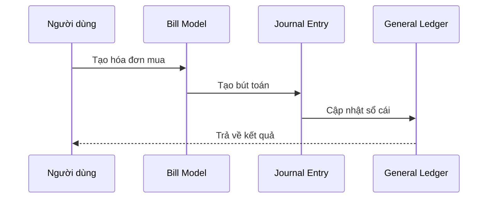
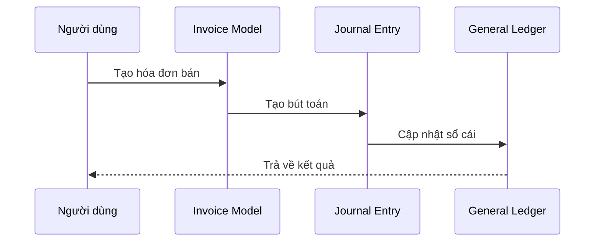

# Hướng Dẫn Sử Dụng Nghiệp Vụ Kế Toán Trong Django Ledger

## 1. Bút Toán Kế Toán (Journal Entries)

### 1.1. Tạo Bút Toán Mới

```python
from django_ledger.models import JournalEntryModel, TransactionModel
from decimal import Decimal

def tao_but_toan_mua_hang(entity_model, ledger_model, amount: Decimal):
    """
    Ví dụ bút toán mua hàng hóa trả tiền mặt
    """
    je = JournalEntryModel.objects.create(
        ledger=ledger_model,
        description='Mua hàng hóa trả tiền mặt'
    )
    
    # Ghi nợ TK 156 - Hàng hóa
    TransactionModel.objects.create(
        journal_entry=je,
        account_id='156',  # Mã TK Hàng hóa
        tx_type='debit',
        amount=amount
    )
    
    # Ghi có TK 111 - Tiền mặt
    TransactionModel.objects.create(
        journal_entry=je,
        account_id='111',  # Mã TK Tiền mặt  
        tx_type='credit',
        amount=amount
    )
```

### 1.2. API Endpoints cho Bút Toán

#### Tạo bút toán mới:
```http
POST /api/entity/{entity_slug}/ledgers/{ledger_slug}/je/create/

{
    "date": "2024-04-04",
    "description": "Mua hàng hóa",
    "transactions": [
        {
            "account_id": "156",
            "tx_type": "debit",
            "amount": "1000000"
        },
        {
            "account_id": "111", 
            "tx_type": "credit",
            "amount": "1000000"
        }
    ]
}
```

#### Lấy danh sách bút toán:
```http
GET /api/entity/{entity_slug}/ledgers/{ledger_slug}/je/list/
```

## 2. Báo Cáo Kế Toán

### 2.1. Bảng Cân Đối Kế Toán

```python
from django_ledger.io.io_generator import BalanceSheetGenerator

def xuat_bang_can_doi(entity_model, start_date, end_date):
    bs_generator = BalanceSheetGenerator(
        entity_slug=entity_model.slug,
        from_date=start_date,
        to_date=end_date
    )
    balance_sheet = bs_generator.get_balance_sheet_data()
    return balance_sheet

# Sử dụng API
"""
GET /api/entity/{entity_slug}/balance-sheet/
Parameters:
- from_date: YYYY-MM-DD
- to_date: YYYY-MM-DD
"""
```

### 2.2. Báo Cáo Kết Quả Kinh Doanh

```python
from django_ledger.io.io_generator import IncomeStatementGenerator

def xuat_bao_cao_kqkd(entity_model, start_date, end_date):
    is_generator = IncomeStatementGenerator(
        entity_slug=entity_model.slug,
        from_date=start_date,
        to_date=end_date
    )
    income_statement = is_generator.get_income_statement_data()
    return income_statement

# Sử dụng API
"""
GET /api/entity/{entity_slug}/income-statement/
Parameters:
- from_date: YYYY-MM-DD
- to_date: YYYY-MM-DD
"""
```

## 3. Các Nghiệp Vụ Thường Gặp

### 3.1. Mua Hàng

```python
from django_ledger.models import BillModel

def tao_hoa_don_mua_hang(entity_model, vendor_model, items):
    """
    Tạo hóa đơn mua hàng
    """
    bill = BillModel.objects.create(
        entity=entity_model,
        vendor=vendor_model,
        terms='net_30'  # Kỳ hạn thanh toán
    )
    
    # Thêm các mặt hàng
    for item in items:
        bill.add_item(
            item_model=item['model'],
            quantity=item['quantity'],
            unit_cost=item['unit_cost']
        )
    
    return bill

# API Endpoint
"""
POST /api/entity/{entity_slug}/bills/create/
{
    "vendor_id": "uuid",
    "terms": "net_30",
    "items": [
        {
            "item_id": "uuid",
            "quantity": 5,
            "unit_cost": "100000"
        }
    ]
}
"""
```

### 3.2. Bán Hàng

```python
from django_ledger.models import InvoiceModel

def tao_hoa_don_ban_hang(entity_model, customer_model, items):
    """
    Tạo hóa đơn bán hàng
    """
    invoice = InvoiceModel.objects.create(
        entity=entity_model,
        customer=customer_model,
        terms='net_30'
    )
    
    for item in items:
        invoice.add_item(
            item_model=item['model'],
            quantity=item['quantity'],
            unit_cost=item['unit_cost']
        )
    
    return invoice

# API Endpoint
"""
POST /api/entity/{entity_slug}/invoices/create/
{
    "customer_id": "uuid",
    "terms": "net_30",
    "items": [
        {
            "item_id": "uuid",
            "quantity": 2,
            "unit_cost": "150000"
        }
    ]
}
"""
```

## 4. Sơ Đồ Luồng Nghiệp Vụ

### 4.1. Quy Trình Mua Hàng


### 4.2. Quy Trình Bán Hàng


## 5. Các Báo Cáo Đặc Thù

### 5.1. Sổ Nhật Ký Chung
```python
def xuat_so_nhat_ky(entity_model, start_date, end_date):
    """
    Xuất sổ nhật ký chung
    """
    journal_entries = JournalEntryModel.objects.filter(
        ledger__entity=entity_model,
        date__range=[start_date, end_date]
    ).prefetch_related('transactionmodel_set')
    
    return journal_entries

# API Endpoint
"""
GET /api/entity/{entity_slug}/journal-entries/
Parameters:
- from_date: YYYY-MM-DD
- to_date: YYYY-MM-DD
"""
```

### 5.2. Sổ Cái
```python
def xuat_so_cai(entity_model, account_id, start_date, end_date):
    """
    Xuất sổ cái theo tài khoản
    """
    transactions = TransactionModel.objects.filter(
        journal_entry__ledger__entity=entity_model,
        account_id=account_id,
        journal_entry__date__range=[start_date, end_date]
    )
    
    return transactions

# API Endpoint
"""
GET /api/entity/{entity_slug}/accounts/{account_id}/transactions/
Parameters:
- from_date: YYYY-MM-DD
- to_date: YYYY-MM-DD
"""
```

## 6. Các Báo Cáo Phân Tích

### 6.1. Phân Tích Tài Chính
```python
from django_ledger.io.ratios import FinancialRatioCalculator

def tinh_chi_so_tai_chinh(entity_model, report_date):
    calculator = FinancialRatioCalculator(
        entity_model=entity_model,
        report_date=report_date
    )
    
    return {
        'current_ratio': calculator.current_ratio(),
        'quick_ratio': calculator.quick_ratio(),
        'debt_to_equity': calculator.debt_to_equity(),
        'return_on_equity': calculator.return_on_equity(),
        'return_on_assets': calculator.return_on_assets()
    }

# API Endpoint
"""
GET /api/entity/{entity_slug}/ratios/
Parameters:
- date: YYYY-MM-DD
"""
```

### 6.2. Báo Cáo Lưu Chuyển Tiền Tệ
```python
from django_ledger.io.io_generator import CashFlowStatementGenerator

def xuat_bao_cao_lctt(entity_model, start_date, end_date):
    cf_generator = CashFlowStatementGenerator(
        entity_slug=entity_model.slug,
        from_date=start_date,
        to_date=end_date
    )
    cash_flow_statement = cf_generator.get_cash_flow_statement()
    return cash_flow_statement

# API Endpoint
"""
GET /api/entity/{entity_slug}/cash-flow/
Parameters:
- from_date: YYYY-MM-DD
- to_date: YYYY-MM-DD
"""
```

## 7. Bảo Mật và Kiểm Soát

### 7.1. Khóa Sổ Kỳ Kế Toán
```python
def khoa_so_ke_toan(entity_model, fiscal_year, fiscal_month):
    """
    Khóa sổ kế toán theo kỳ
    """
    from django_ledger.models import LedgerModel
    
    ledger = LedgerModel.objects.get(
        entity=entity_model,
        fiscal_year=fiscal_year,
        fiscal_month=fiscal_month
    )
    ledger.locked = True
    ledger.save()

# API Endpoint
"""
POST /api/entity/{entity_slug}/ledgers/{ledger_slug}/lock/
{
    "fiscal_year": 2024,
    "fiscal_month": 4
}
"""
```

### 7.2. Kiểm Tra Số Dư
```python
def kiem_tra_can_doi(journal_entry):
    """
    Kiểm tra cân đối nợ có của bút toán
    """
    debit_sum = journal_entry.transactionmodel_set.filter(
        tx_type='debit'
    ).aggregate(
        total=Sum('amount')
    )['total'] or 0
    
    credit_sum = journal_entry.transactionmodel_set.filter(
        tx_type='credit'
    ).aggregate(
        total=Sum('amount')
    )['total'] or 0
    
    return abs(debit_sum - credit_sum) < Decimal('0.02')
```

## 8. Xuất Báo Cáo

### 8.1. Xuất PDF
```python
def xuat_bao_cao_pdf(entity_model, report_type, start_date, end_date):
    """
    Xuất báo cáo dạng PDF
    """
    if report_type == 'balance_sheet':
        data = xuat_bang_can_doi(entity_model, start_date, end_date)
    elif report_type == 'income_statement':
        data = xuat_bao_cao_kqkd(entity_model, start_date, end_date)
    elif report_type == 'cash_flow':
        data = xuat_bao_cao_lctt(entity_model, start_date, end_date)
        
    # Tạo PDF từ data
    return generate_pdf(data)

# API Endpoint
"""
GET /api/entity/{entity_slug}/reports/{report_type}/pdf/
Parameters:
- from_date: YYYY-MM-DD
- to_date: YYYY-MM-DD
"""
```

### 8.2. Xuất Excel
```python
def xuat_bao_cao_excel(entity_model, report_type, start_date, end_date):
    """
    Xuất báo cáo dạng Excel
    """
    if report_type == 'balance_sheet':
        data = xuat_bang_can_doi(entity_model, start_date, end_date)
    elif report_type == 'income_statement':
        data = xuat_bao_cao_kqkd(entity_model, start_date, end_date)
    elif report_type == 'cash_flow':
        data = xuat_bao_cao_lctt(entity_model, start_date, end_date)
        
    # Tạo Excel từ data
    return generate_excel(data)

# API Endpoint
"""
GET /api/entity/{entity_slug}/reports/{report_type}/excel/
Parameters:
- from_date: YYYY-MM-DD
- to_date: YYYY-MM-DD
"""
