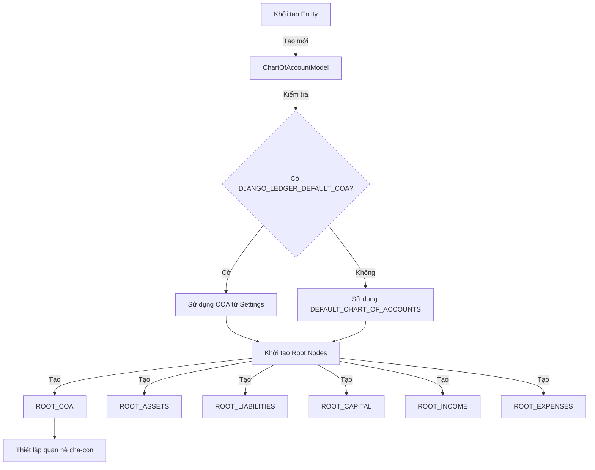

# Cơ Chế Tạo Hệ Thống Tài Khoản trong Django Ledger

## Tổng Quan

Django Ledger sử dụng một hệ thống tài khoản linh hoạt, có thể tùy chỉnh dựa trên chuẩn kế toán Việt Nam (TT200). Tài liệu này mô tả chi tiết cơ chế hoạt động và luồng xử lý của hệ thống.

## Sơ Đồ Luồng Xử Lý



## Cấu Trúc Hệ Thống

### 1. Mô Hình Dữ Liệu Chính

#### ChartOfAccountModel
- UUID: Định danh duy nhất
- Entity: Liên kết với đơn vị kế toán
- Name: Tên hệ thống tài khoản
- Slug: Định danh URL
- Active: Trạng thái hoạt động

#### AccountModel
- UUID: Định danh duy nhất
- Code: Mã tài khoản (ví dụ: 111, 112)
- Name: Tên tài khoản
- Role: Vai trò (ví dụ: ASSET_CA_CASH)
- Balance_type: Loại số dư (Debit/Credit)
- Parent: Tài khoản cha

### 2. Quy Trình Khởi Tạo

#### 2.1. Khởi Tạo Ban Đầu
```python
DEFAULT_CHART_OF_ACCOUNTS = [
    {'code': '111', 'role': 'ASSET_CA_CASH', 'name': 'Tiền mặt', ...},
    {'code': '112', 'role': 'ASSET_CA_CASH', 'name': 'Tiền gửi ngân hàng', ...},
    # ...
]
```

#### 2.2. Cấu Hình Qua Settings
```python
DJANGO_LEDGER_DEFAULT_COA = [
    # Cấu hình tùy chỉnh
]
```

### 3. Endpoints và Views

#### 3.1. Tạo Mới Chart of Accounts
- URL: `/entity/<slug:entity_slug>/coa/create/`
- View: `ChartOfAccountsCreateView`
- Method: POST
- Quyền truy cập: Entity Admin/Manager

#### 3.2. Danh Sách Chart of Accounts
- URL: `/entity/<slug:entity_slug>/coa/list/`
- View: `ChartOfAccountsListView`
- Method: GET
- Quyền truy cập: Entity Admin/Manager

#### 3.3. Chi Tiết Chart of Accounts
- URL: `/entity/<slug:entity_slug>/coa/<slug:coa_slug>/detail/`
- View: `ChartOfAccountsDetailView`
- Method: GET
- Quyền truy cập: Entity Admin/Manager

## Hệ Thống Vai Trò (Roles)

### 1. Nhóm Tài Sản
- ASSET_CA_CASH: Tiền mặt
- ASSET_CA_RECEIVABLES: Phải thu
- ASSET_PPE_BUILDINGS: Tài sản cố định

### 2. Nhóm Nợ Phải Trả
- LIABILITY_CL_ACC_PAYABLE: Phải trả người bán
- LIABILITY_CL_WAGES_PAYABLE: Phải trả người lao động

### 3. Nhóm Vốn Chủ Sở Hữu
- EQUITY_CAPITAL: Vốn góp
- EQUITY_COMMON_STOCK: Cổ phiếu phổ thông

## Quy Trình Sử Dụng

### 1. Tạo Entity Mới
```python
from django_ledger.models import EntityModel

entity = EntityModel.objects.create(
    name='Công ty ABC',
    admin=user_model
)
```

### 2. Khởi Tạo Chart of Accounts
```python
from django_ledger.models import ChartOfAccountModel

coa = ChartOfAccountModel.objects.create(
    name='Hệ thống tài khoản chuẩn',
    entity=entity
)
coa.configure()  # Thiết lập cấu trúc cây tài khoản
```

### 3. Thêm Tài Khoản Mới
```python
coa.create_account(
    code='1111',
    role='ASSET_CA_CASH',
    name='Tiền mặt VND',
    balance_type='debit',
    active=True
)
```

## Xử Lý Đặc Biệt

### 1. Tự Động Tạo Root Nodes
- Hệ thống tự động tạo các node gốc khi configure()
- Các node gốc không thể xóa hoặc sửa đổi

### 2. Kiểm Tra Tính Hợp Lệ
- Kiểm tra mã tài khoản trùng lặp
- Kiểm tra quan hệ cha-con hợp lệ
- Kiểm tra balance type phù hợp với role

## Best Practices

1. **Tổ Chức Mã Tài Khoản**
   - Sử dụng tiền tố rõ ràng
   - Giữ độ dài nhất quán
   - Đánh số theo logic phân cấp

2. **Quản Lý Roles**
   - Định nghĩa roles mới qua settings
   - Kiểm tra tính hợp lệ của roles
   - Tài liệu hóa roles mới

3. **Bảo Mật**
   - Kiểm soát quyền truy cập
   - Ghi log thay đổi
   - Backup định kỳ

4. **Hiệu Suất**
   - Cache danh sách tài khoản
   - Tối ưu truy vấn
   - Phân trang kết quả

## Tham Khảo

1. [Django Ledger Documentation](https://django-ledger.readthedocs.io/)
2. [Thông tư 200/2014/TT-BTC](https://thuvienphapluat.vn/van-ban/Ke-toan-Kiem-toan/Thong-tu-200-2014-TT-BTC-huong-dan-Che-do-ke-toan-Doanh-nghiep-263599.aspx)
3. [Django Documentation](https://docs.djangoproject.com/)
