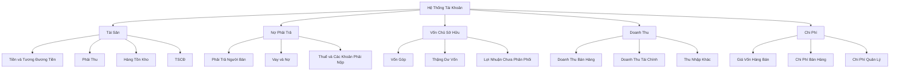
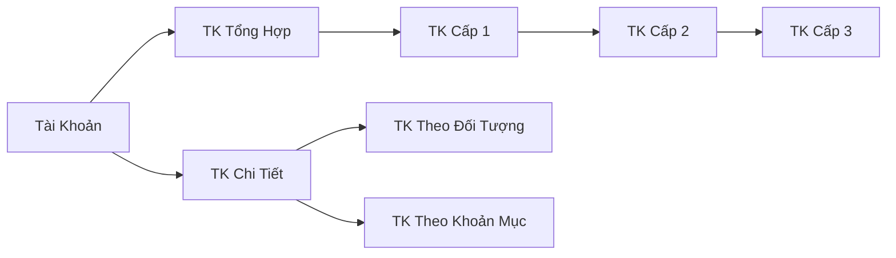
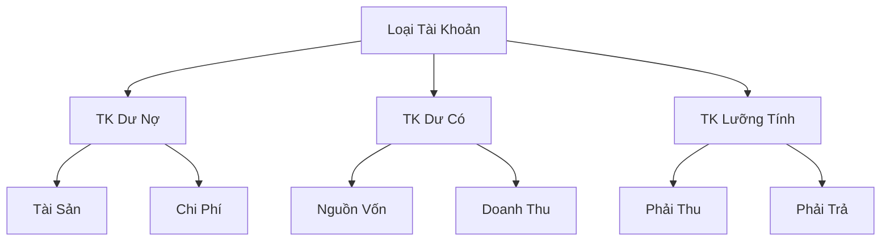
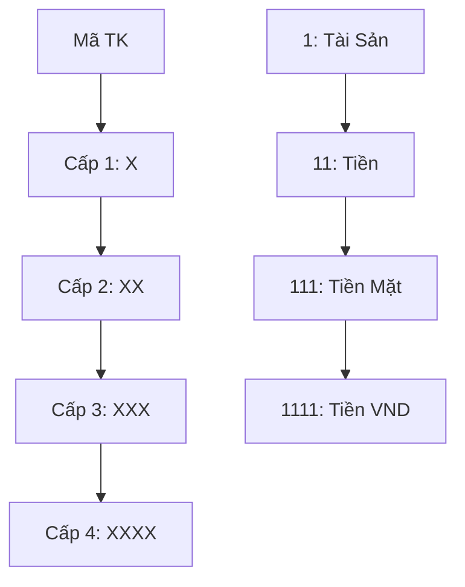
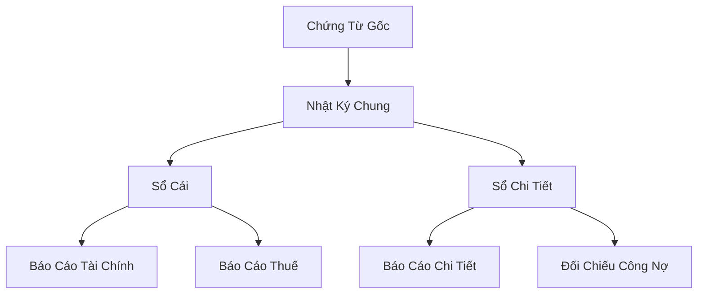

# Sơ Đồ Cấu Trúc Tài Khoản

## 1. Cấu Trúc Hệ Thống Tài Khoản



## 2. Phân Loại Tài Khoản



## 3. Quan Hệ Số Dư



## 4. Cấu Trúc Mã Tài Khoản



## 5. Luồng Ghi Sổ



## 6. Quy Trình Khóa Sổ

```mermaid
graph TB
    A[Đầu Kỳ] --> B[Ghi Sổ Hàng Ngày]
    B --> C[Khóa Sổ Tạm]
    C --> D[Bút Toán Điều Chỉnh]
    D --> E[Khóa Sổ Cuối Kỳ]
    E --> F[Lập Báo Cáo]
    F --> G[Bút Toán Kết Chuyển]
    G --> H[Mở Sổ Kỳ Mới]
