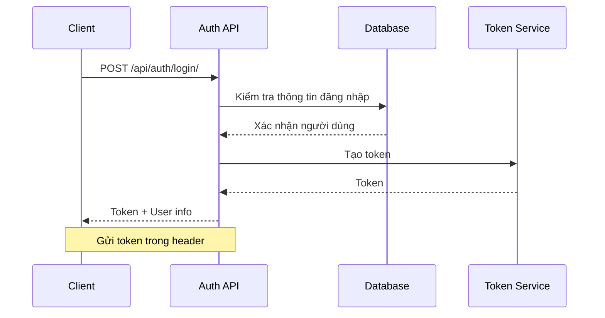
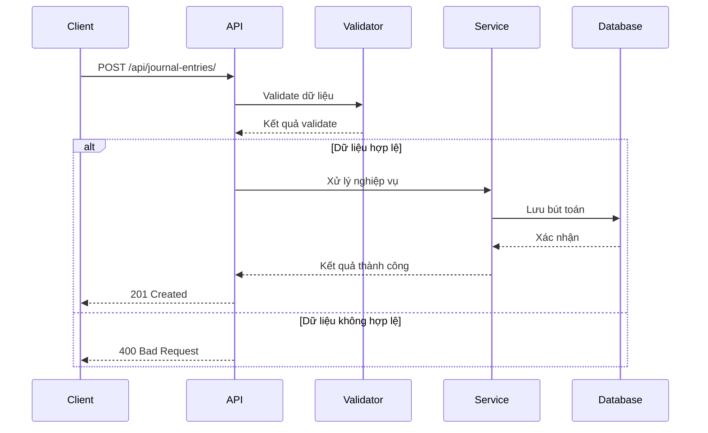
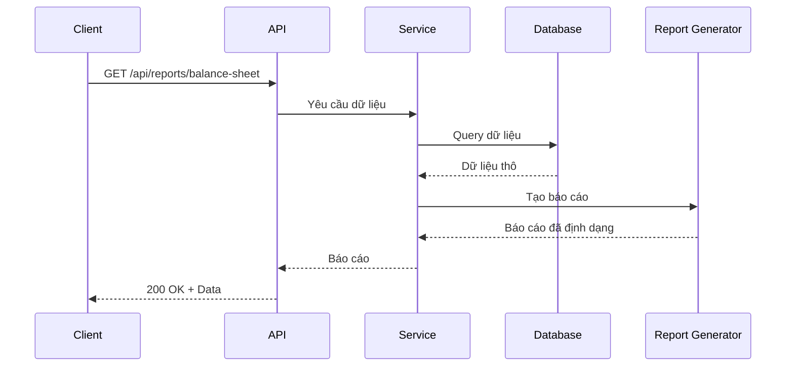
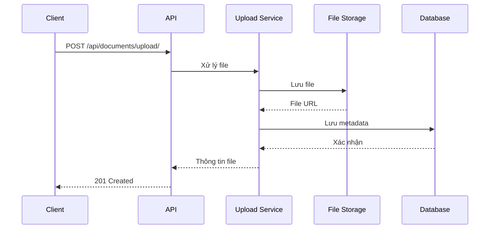
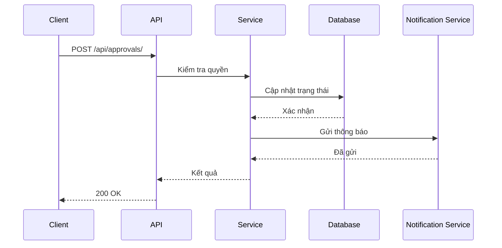
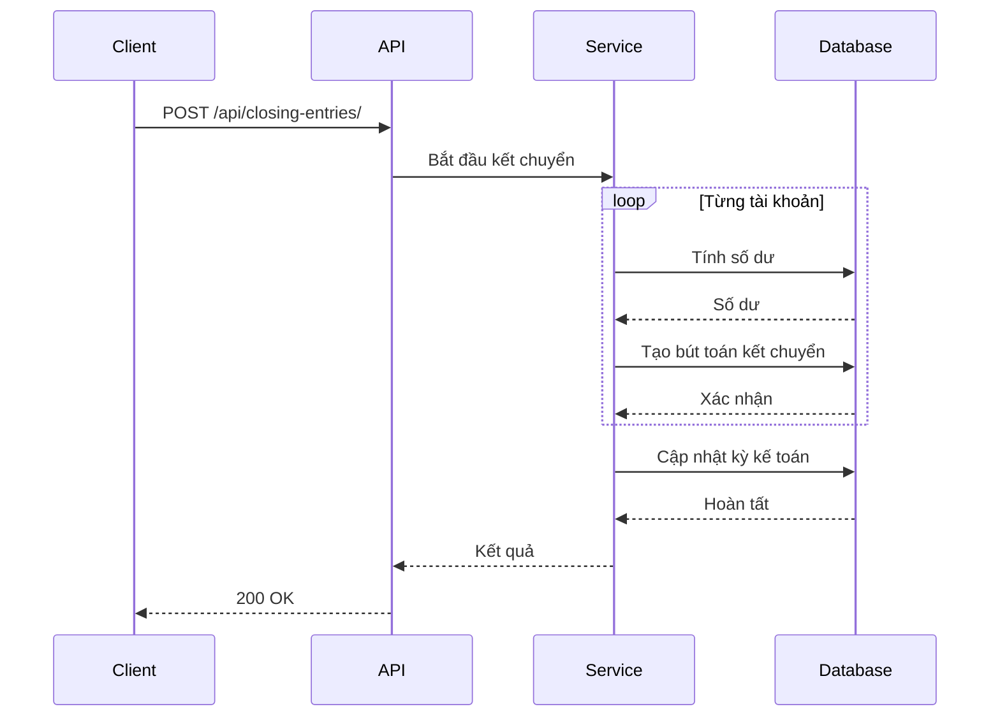
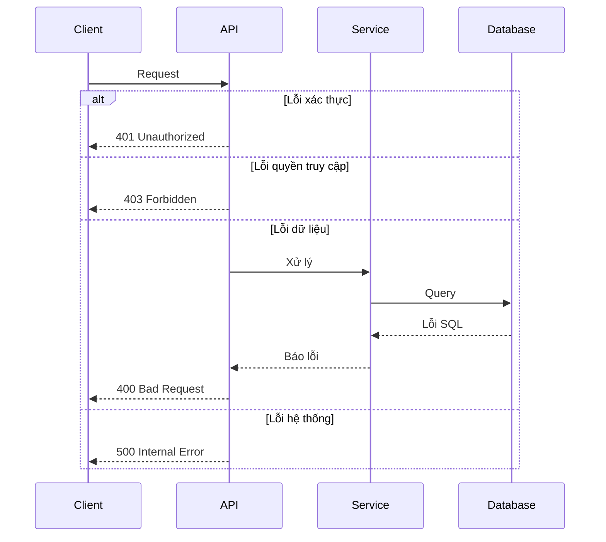

# Sơ Đồ Luồng API

## 1. Luồng Xác Thực



## 2. Luồng Ghi Sổ



## 3. Luồng Báo Cáo



## 4. Luồng Tải File



## 5. Luồng Phê Duyệt



## 6. Luồng Kết Chuyển



## 7. Xử Lý Lỗi



## 8. Định Dạng Response

```mermaid
graph TD
    A[API Response] --> B[Thành công]
    A --> C[Lỗi]
    
    B --> B1[data: Object/Array]
    B --> B2[metadata: Object]
    B --> B3[message: String]
    
    C --> C1[error_code: String]
    C --> C2[error_message: String]
    C --> C3[details: Object]
