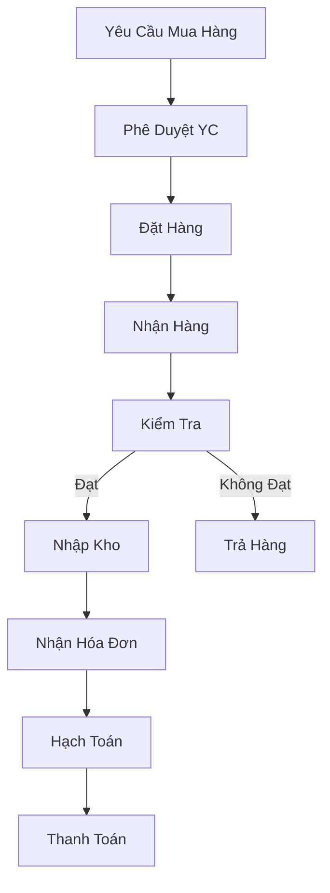
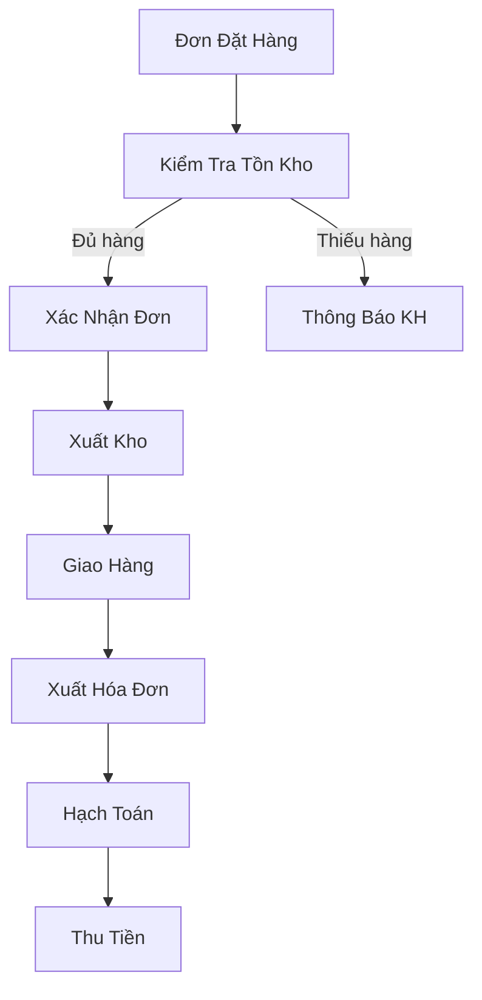
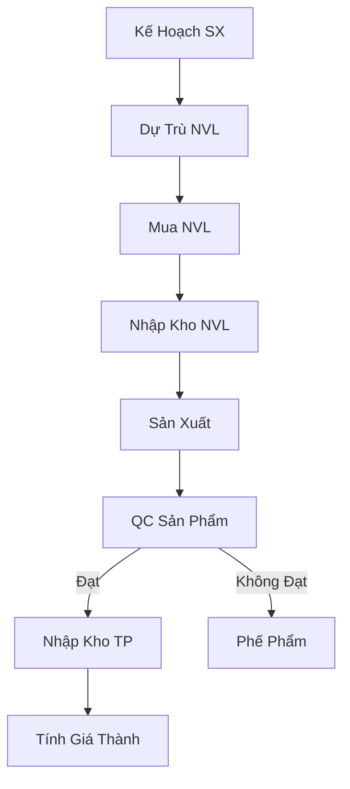
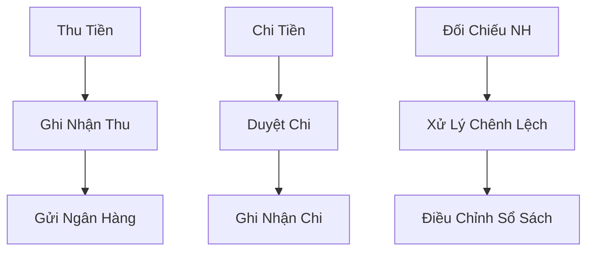
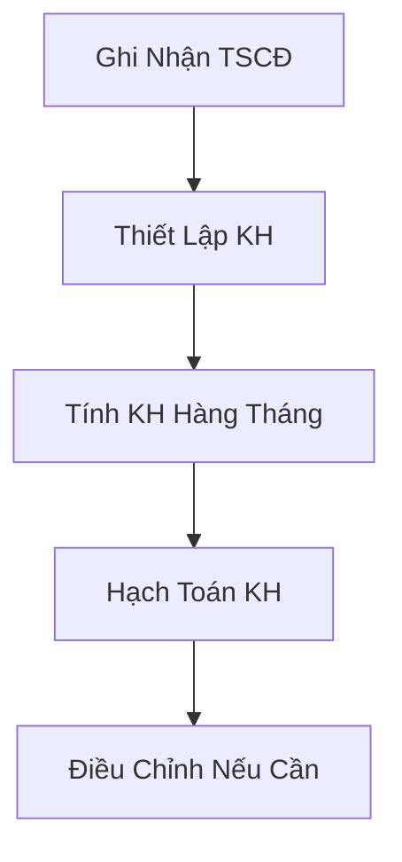
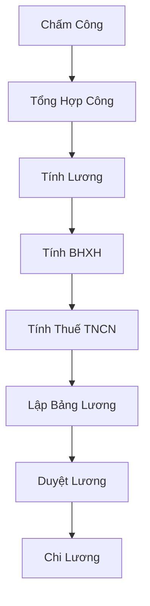
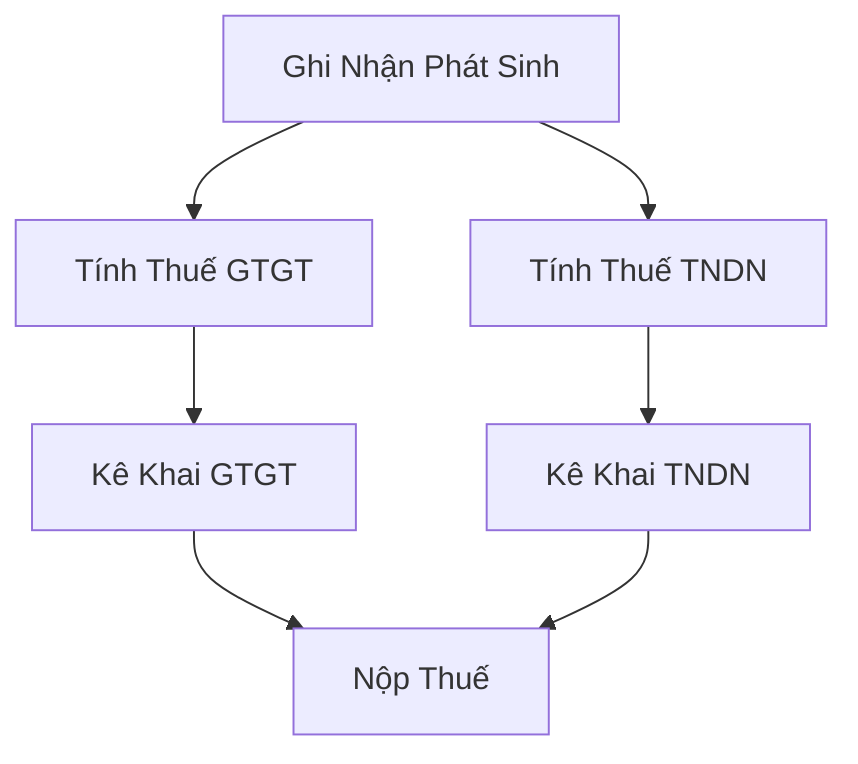
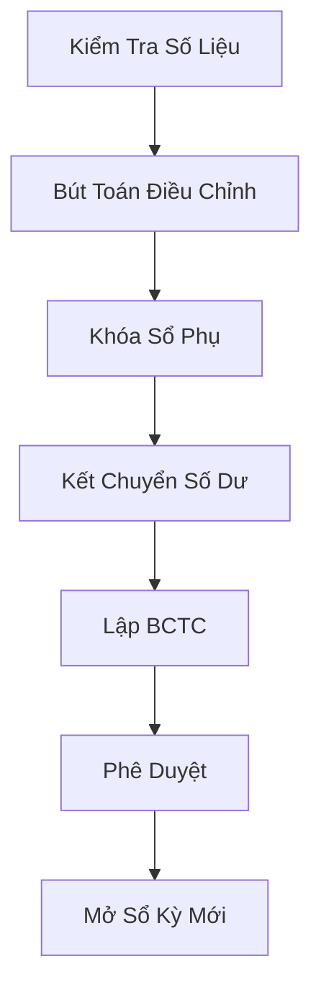
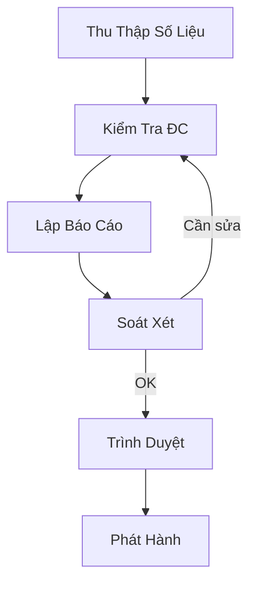

# Sơ Đồ Quy Trình Nghiệp Vụ

## 1. Quy Trình Mua Hàng



## 2. Quy Trình Bán Hàng



## 3. Quy Trình Sản Xuất



## 4. Quy Trình Quản Lý Tiền



## 5. Quy Trình Khấu Hao



## 6. Quy Trình Tính Lương



## 7. Quy Trình Kế Toán Thuế



## 8. Quy Trình Đóng Sổ



## 9. Quy Trình Báo Cáo



## 10. Quy Trình Kiểm Soát

```mermaid
graph TD
    A[Thiết Lập KSN] --> B[Thực Hiện KSN]
    B --> C[Phát Hiện Sai Sót]
    C --> D[Điều Chỉnh]
    D --> E[Báo Cáo]
    E --> F[Cập Nhật QT]
