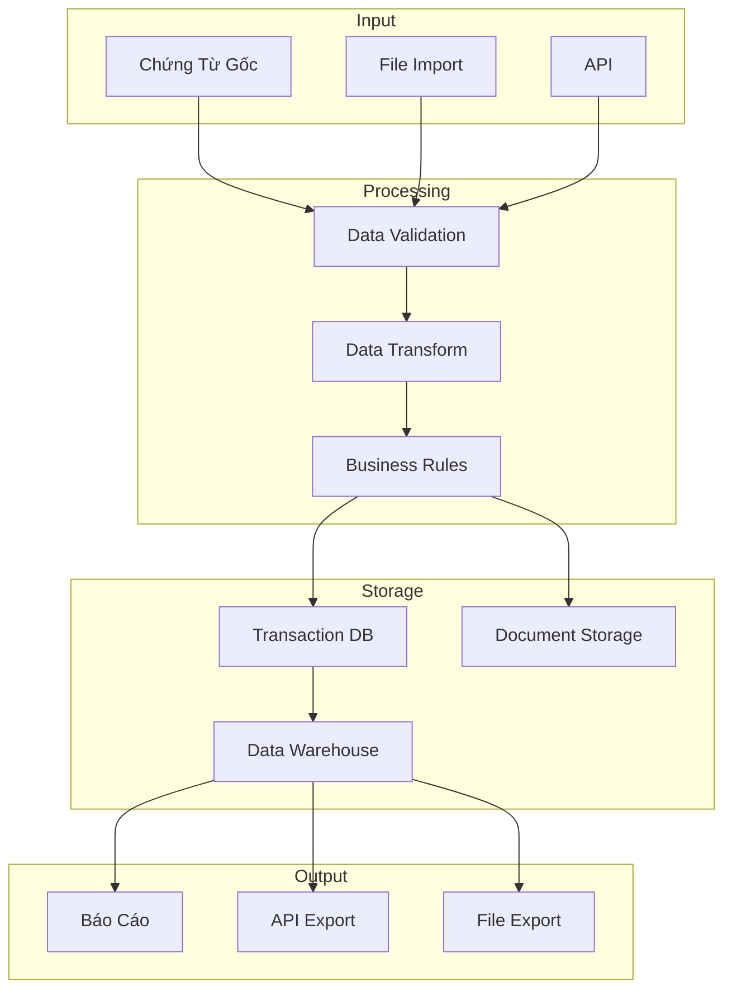
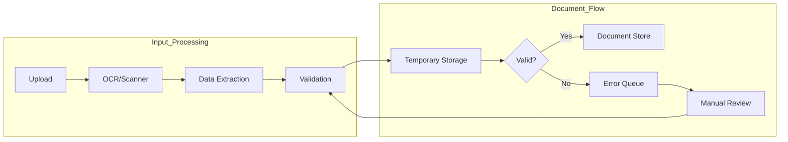
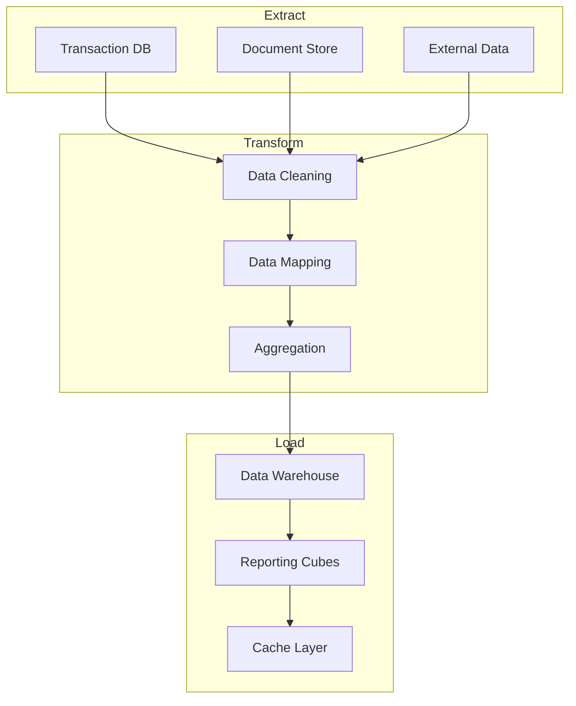
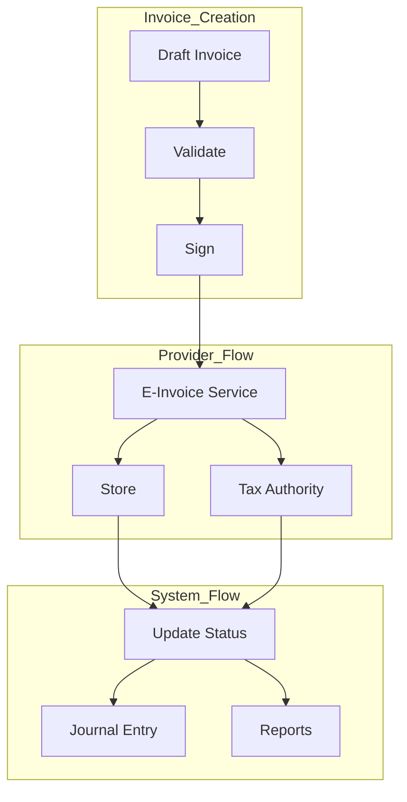
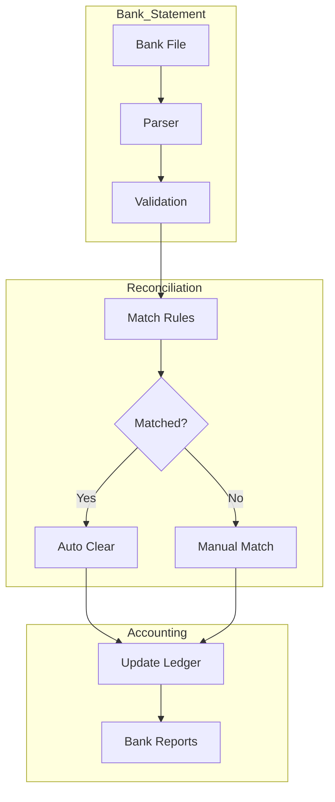
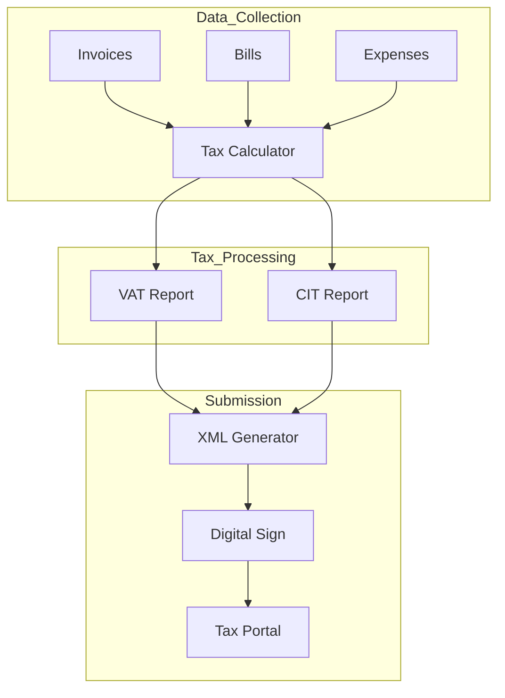
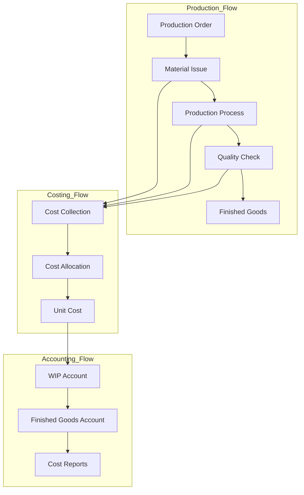
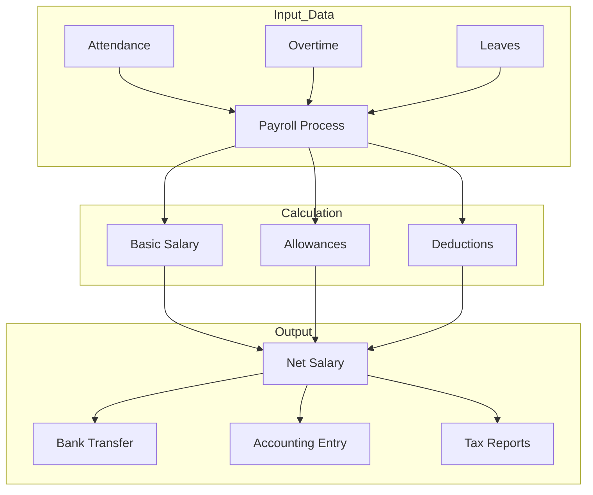
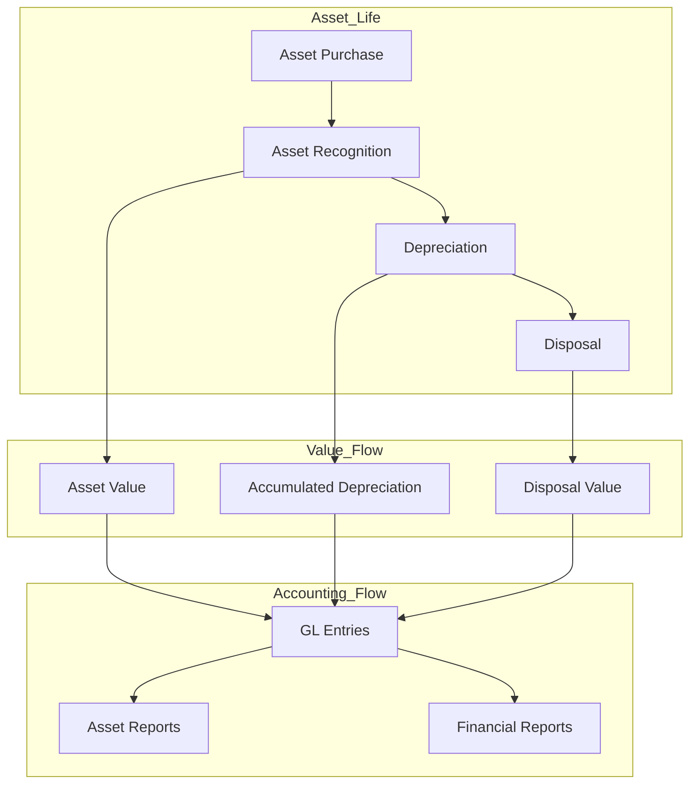

# Sơ Đồ Luồng Dữ Liệu

## 1. Luồng Dữ Liệu Tổng Quan



## 2. Xử Lý Chứng Từ



## 3. ETL Báo Cáo



## 4. Luồng Dữ Liệu HĐDT



## 5. Luồng Dữ Liệu Ngân Hàng



## 6. Luồng Dữ Liệu Thuế



## 7. Luồng Dữ Liệu Sản Xuất



## 8. Luồng Dữ Liệu Lương



## 9. Luồng Dữ Liệu Tài Sản



## 10. Luồng Dữ Liệu Báo Cáo Tài Chính

```mermaid
flowchart TB
    subgraph Source_Data
        A1[GL Entries]
        A2[Sub-ledgers]
        A3[Adjustments]
    end
    
    subgraph Processing
        B1[Data Aggregation]
        B2[Currency Translation]
        B3[Eliminations]
    end
    
    subgraph Reports
        C1[Balance Sheet]
        C2[Income Statement]
        C3[Cash Flow]
        C4[Notes]
    end
    
    A1 & A2 & A3 --> B1 --> B2 --> B3
    B3 --> C1 & C2 & C3 --> C4
