# Sơ Đồ Cấu Trúc Cơ Sở Dữ Liệu

## 1. Cấu Trúc Chung

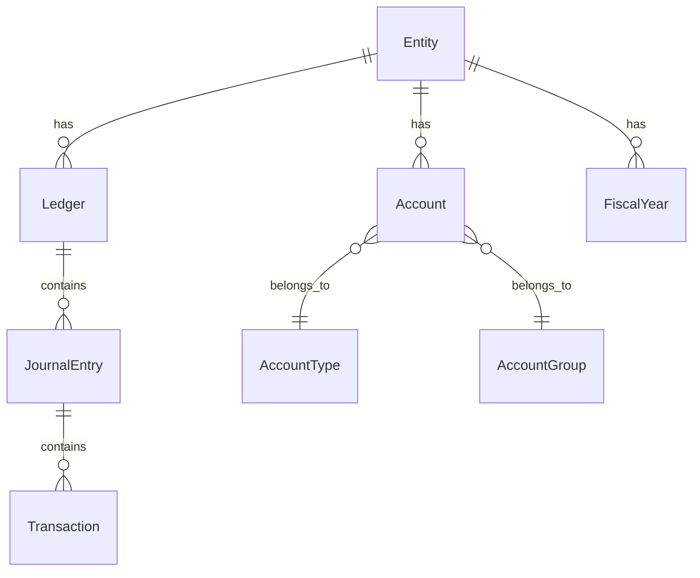

## 2. Kế Toán Tiền

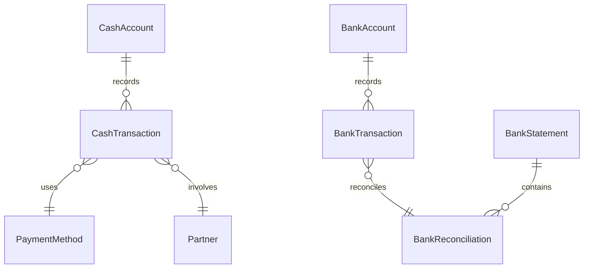

## 3. Mua Hàng và Công Nợ

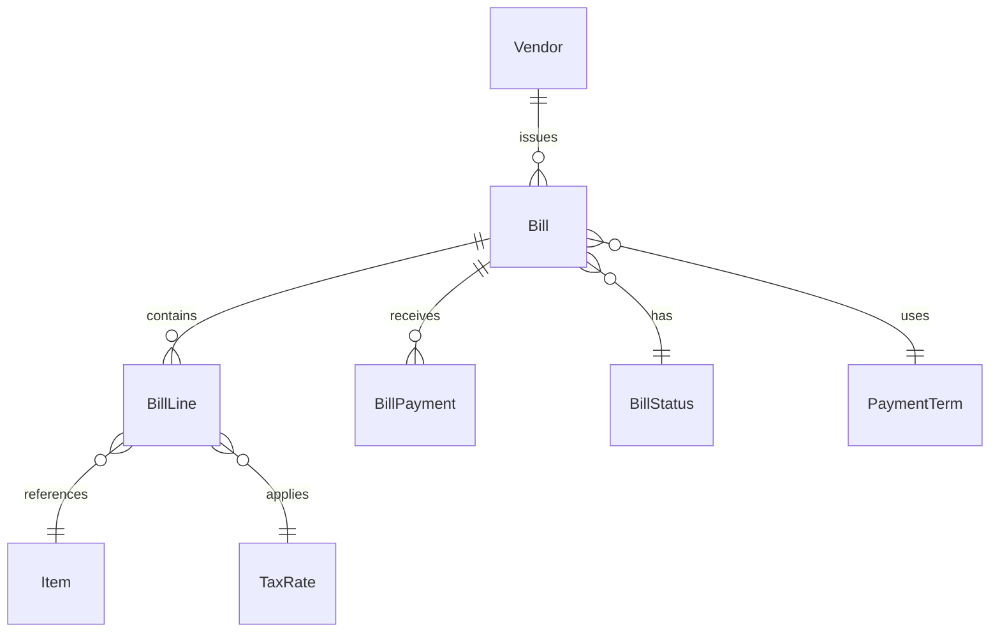

## 4. Bán Hàng và Thu Tiền

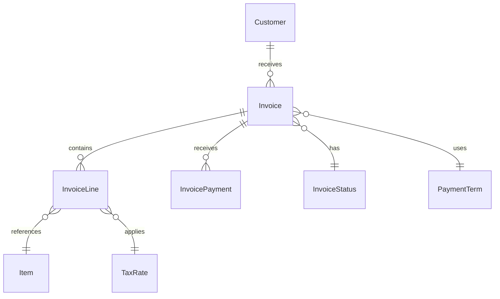

## 5. Kho Hàng

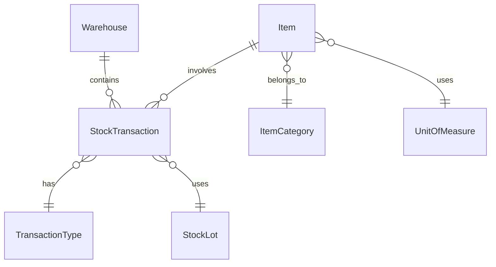

## 6. Tài Sản Cố Định

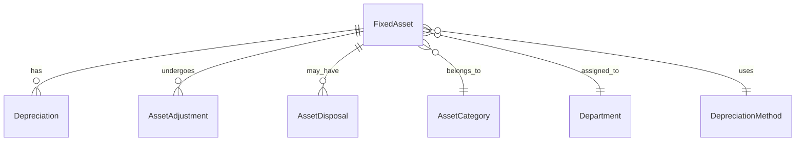

## 7. Sản Xuất

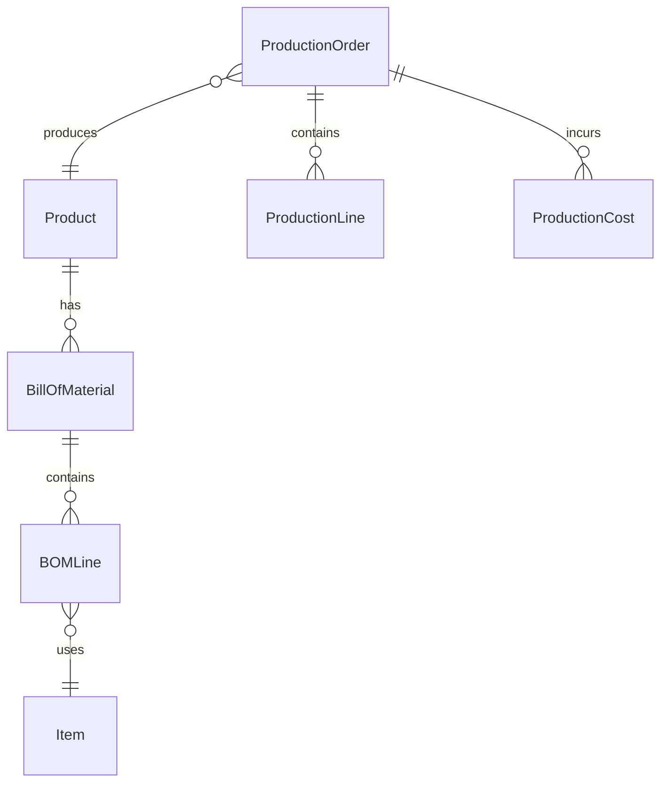

## 8. Nhân Sự và Lương

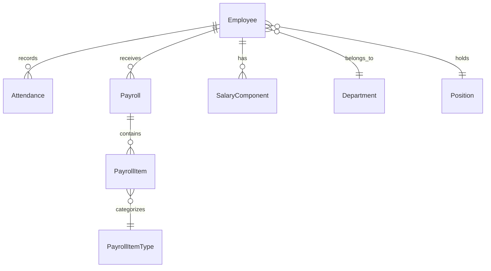

## 9. Thuế

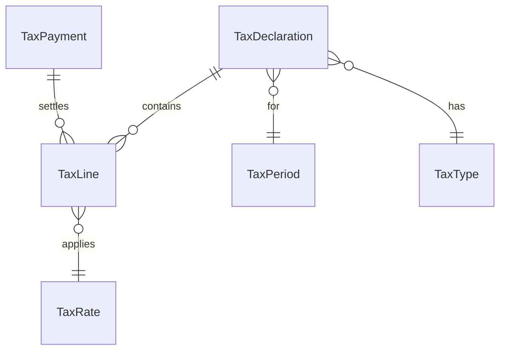

## 10. Kế Toán Tổng Hợp

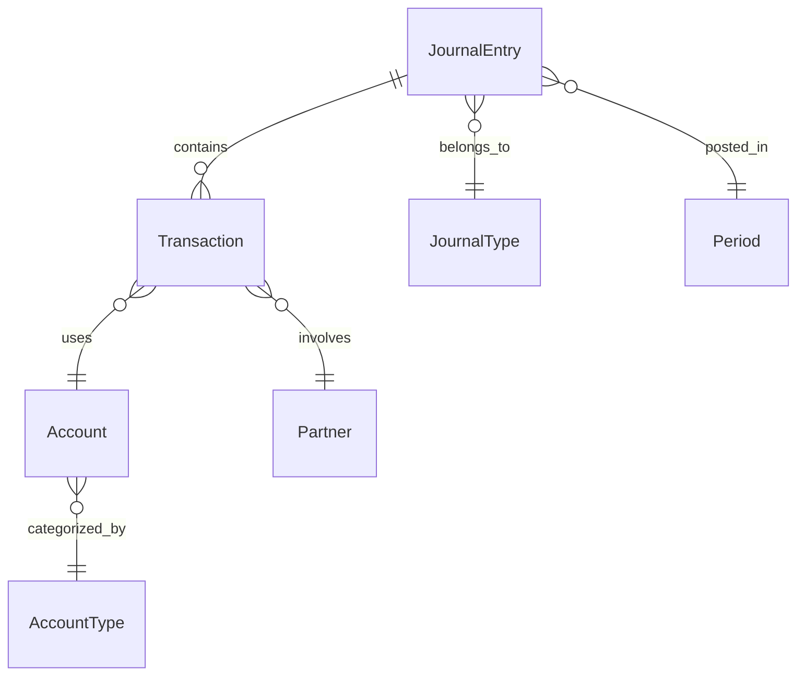

## 11. Phân Quyền

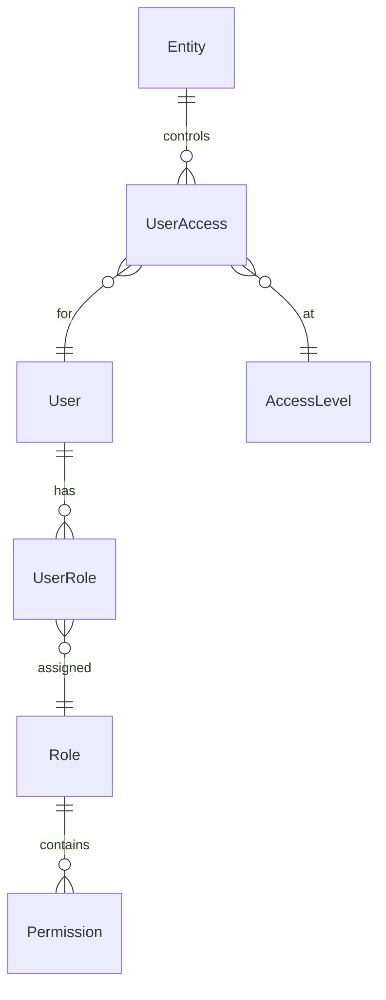

## 12. Báo Cáo và Audit

```mermaid
erDiagram
    Report ||--o{ ReportLine : contains
    Report }o--|| ReportTemplate : uses
    Report }o--|| Period : for
    
    AuditLog ||--o{ AuditDetail : contains
    AuditLog }o--|| User : by
    AuditLog }o--|| EntityType : on
