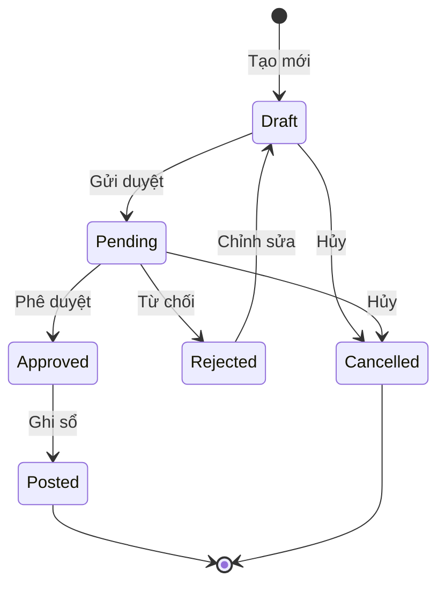
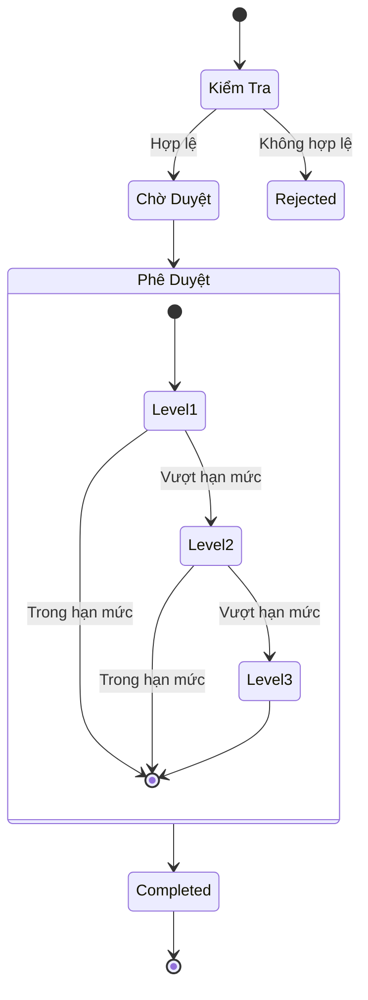
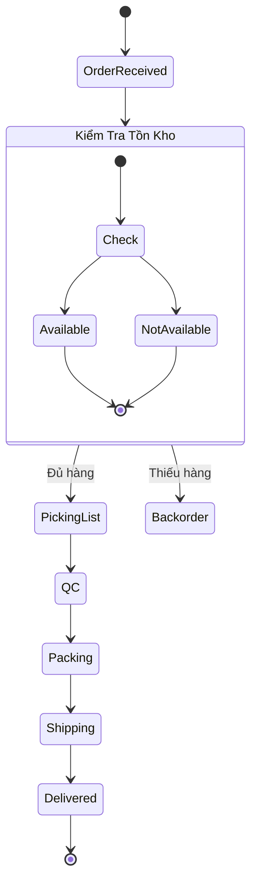
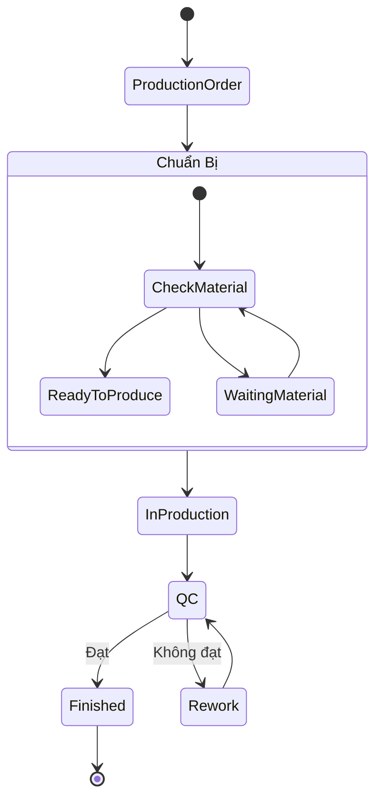
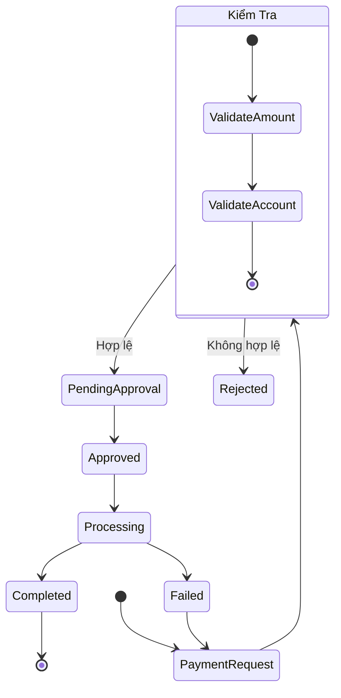
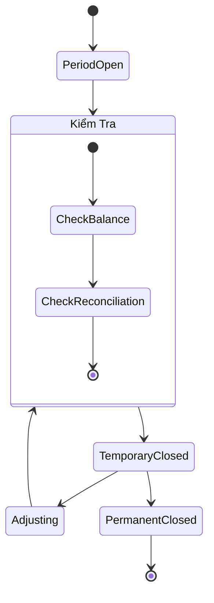
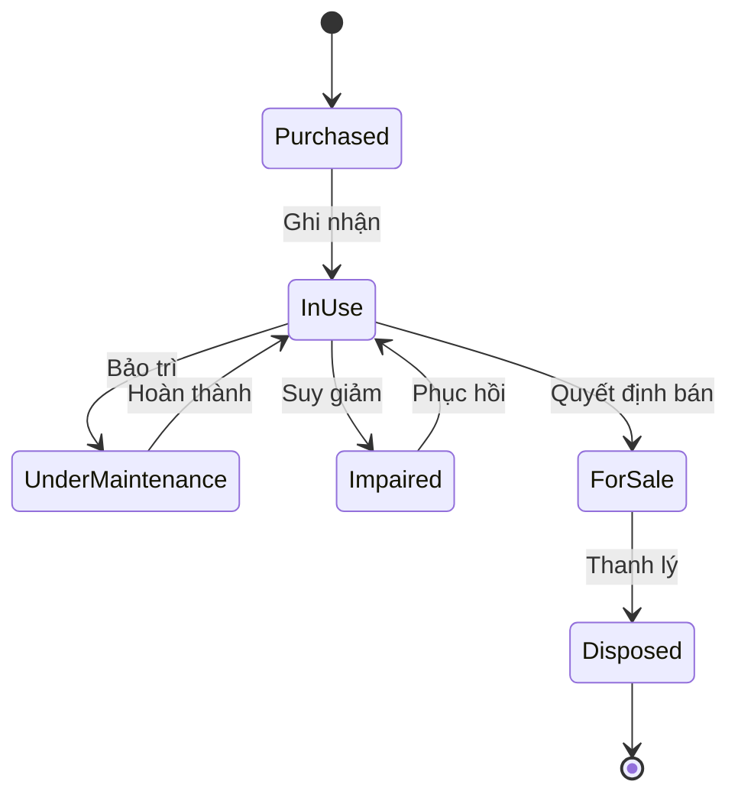
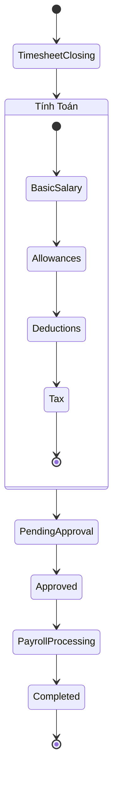
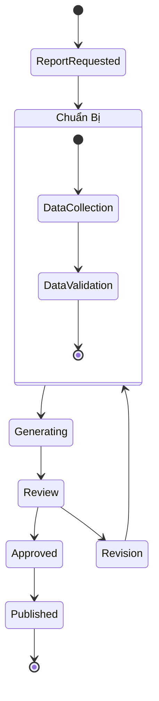

# Sơ Đồ Trạng Thái và Quy Trình Làm Việc

## 1. Trạng Thái Chứng Từ



## 2. Quy Trình Phê Duyệt



## 3. Quy Trình Xuất Hàng



## 4. Quy Trình Sản Xuất



## 5. Quy Trình Thanh Toán



## 6. Quy Trình Khóa Sổ



## 7. Quy Trình Tài Sản



## 8. Quy Trình Tính Lương



## 9. Quy Trình Báo Cáo



## 10. Quy Trình Kiểm Toán

```mermaid
stateDiagram-v2
    state "Kiểm Tra" as check {
        [*] --> DocumentCheck
        DocumentCheck --> BalanceCheck
        BalanceCheck --> ComplianceCheck
        ComplianceCheck --> [*]
    }
    
    [*] --> Planning
    Planning --> check
    check --> FindingsDraft
    FindingsDraft --> ManagementReview
    ManagementReview --> FinalReport
    FinalReport --> FollowUp
    FollowUp --> [*]
