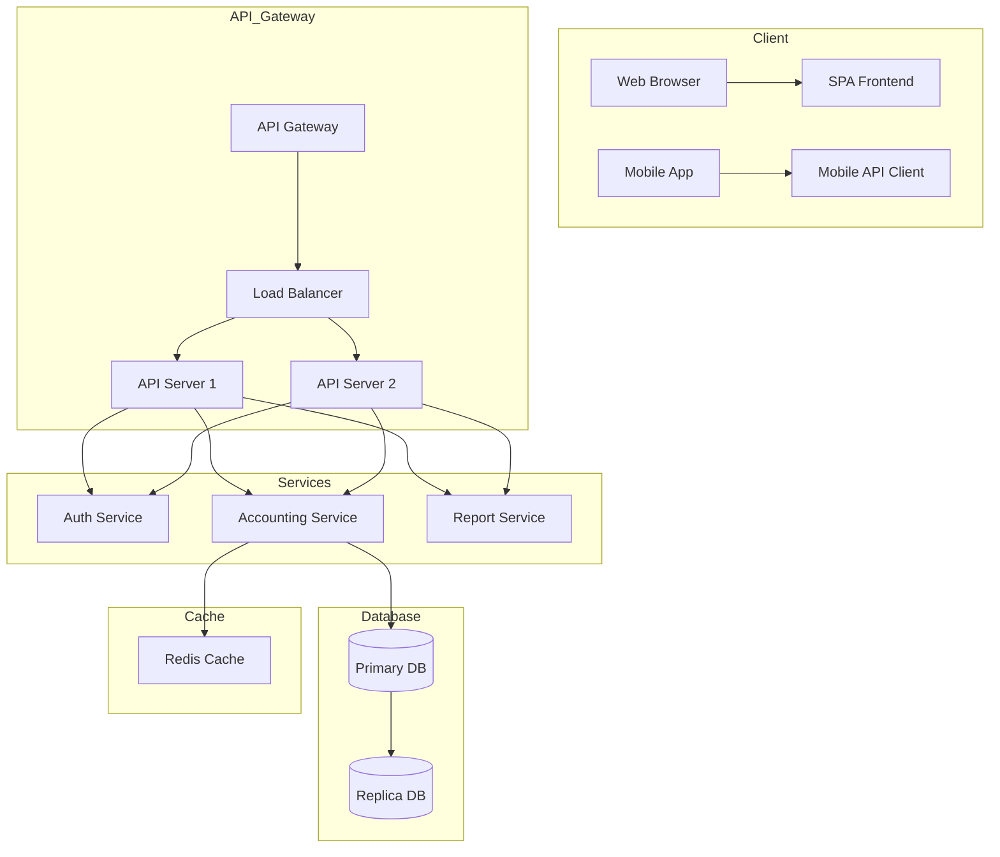
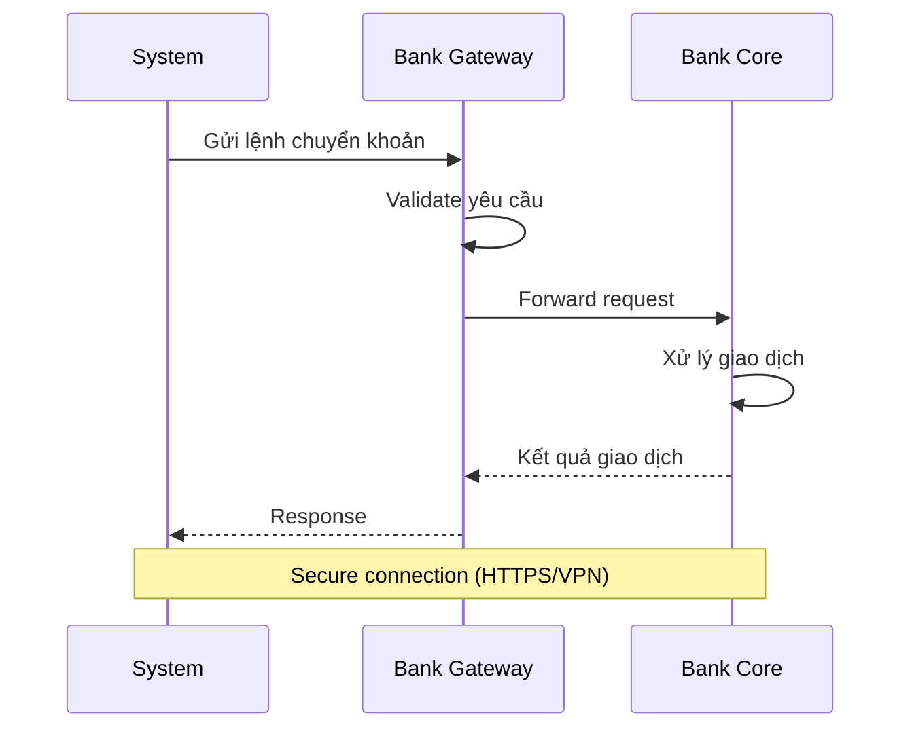
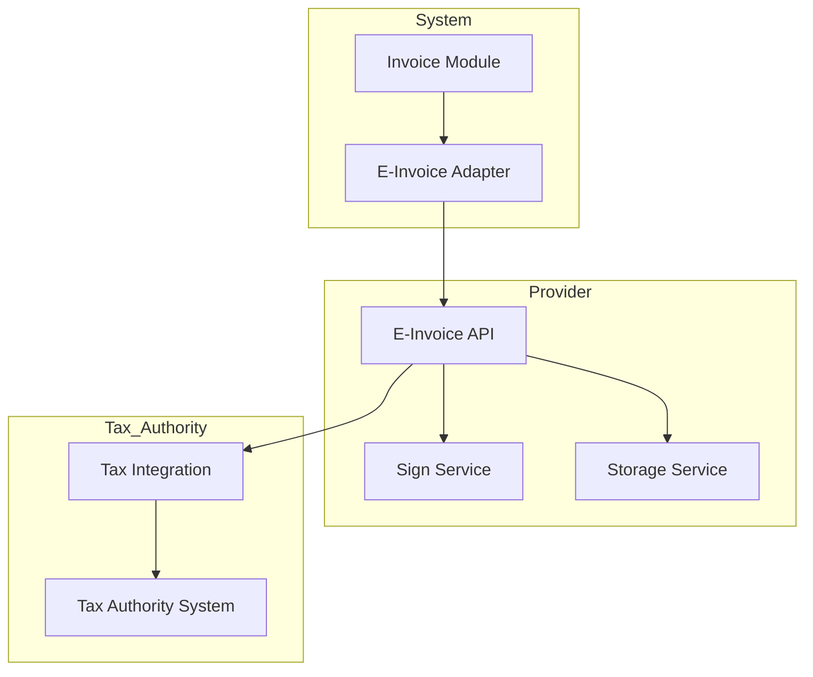
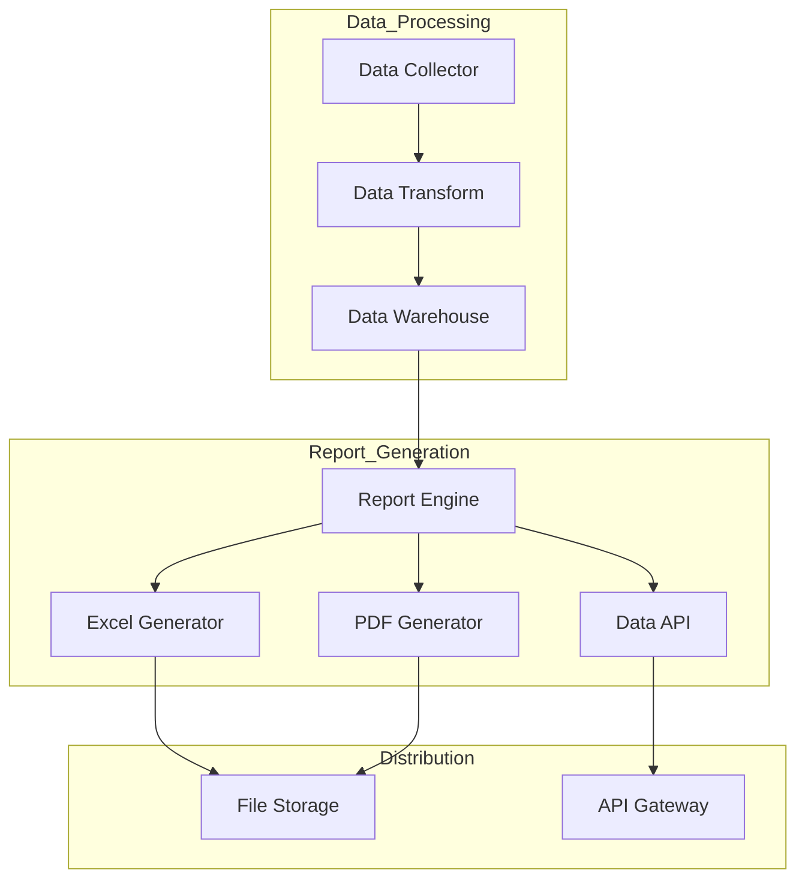
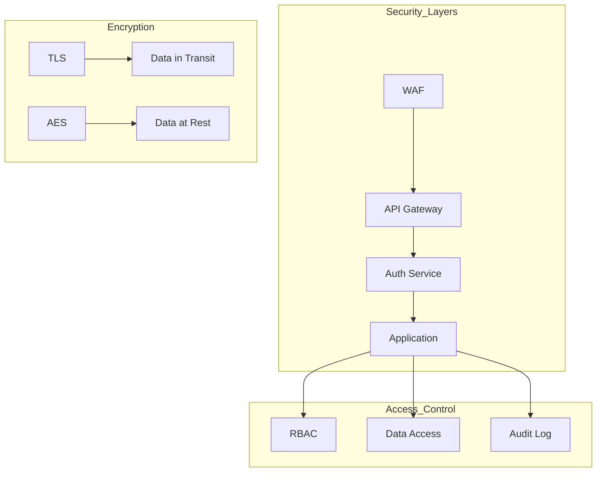
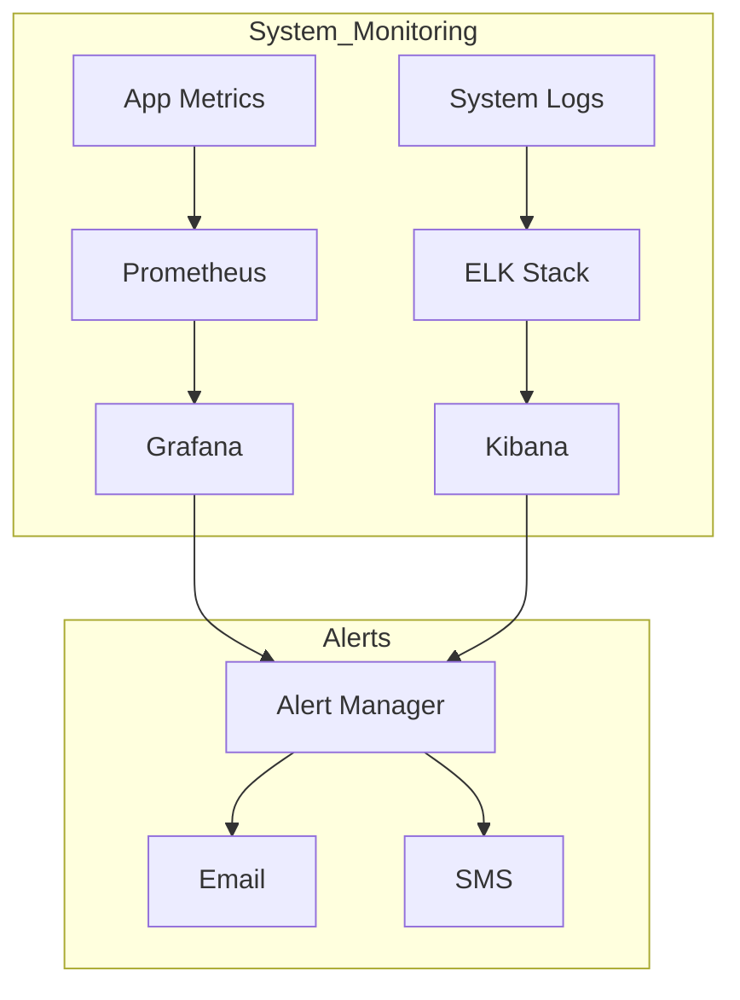
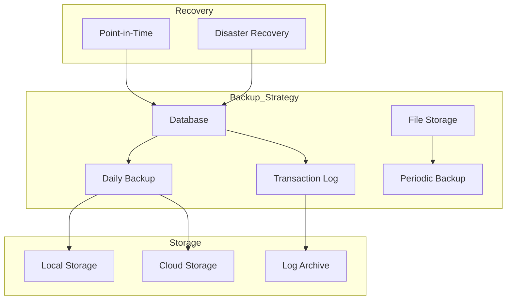
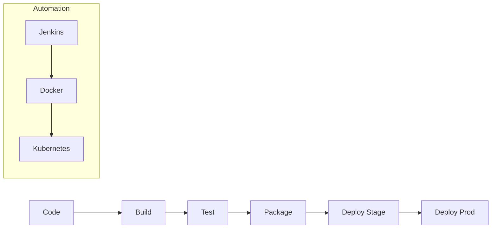
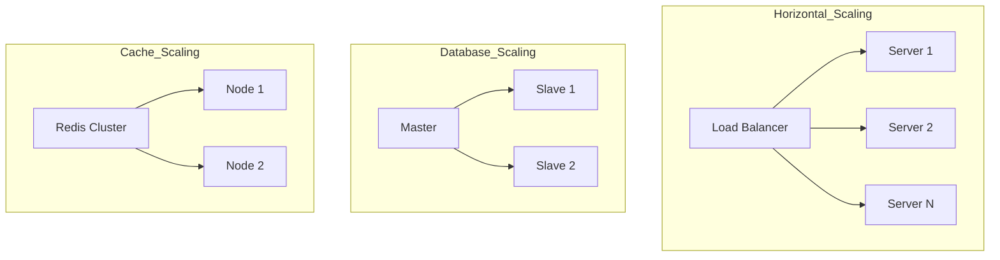

# Sơ Đồ Triển Khai và Tích Hợp Hệ Thống

## 1. Kiến Trúc Tổng Thể



## 2. Tích Hợp Ngân Hàng



## 3. Tích Hợp HĐDT



## 4. Xử Lý Báo Cáo



## 5. Bảo Mật Hệ Thống



## 6. Monitoring & Logging



## 7. Backup & Recovery



## 8. CI/CD Pipeline



## 9. Khả Năng Mở Rộng



## 10. Môi Trường Triển Khai

```mermaid
graph TD
    subgraph Development
        A[Local Dev] --> B[Dev Server]
    end
    
    subgraph Testing
        B --> C[Test Server]
        C --> D[UAT Server]
    end
    
    subgraph Production
        D --> E[Staging]
        E --> F[Production]
    end
    
    subgraph DR
        F --> G[DR Site]
    end
