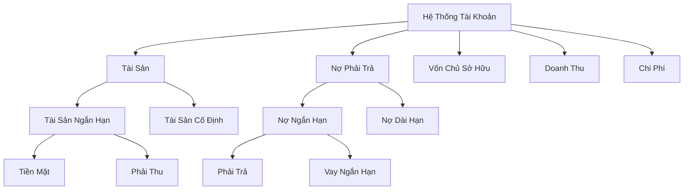

# Hệ Thống Tài Khoản (Chart of Accounts)

Hệ thống tài khoản là cấu trúc tổ chức cơ bản trong kế toán, cung cấp danh sách đầy đủ của mọi tài khoản trong hệ thống kế toán. 

## 1. Cấu Trúc Tổ Chức
- Hoạt động như một hệ thống phân loại để tổ chức tất cả các tài khoản tài chính
- Nhóm các tài khoản vào một hệ thống phân cấp logic (Tài sản, Nợ phải trả, Vốn chủ sở hữu, Doanh thu, Chi phí)
- Trong hệ thống của chúng ta, điều này được quản lý thông qua trường `role` và mối quan hệ cha-con

## 2. Phân Loại Tài Khoản
- Xác định loại và mục đích của từng tài khoản (ví dụ: tài khoản tài sản, tài khoản nợ phải trả)
- Giúp duy trì tính nhất quán trong ghi chép tài chính
- Hệ thống của chúng ta sử dụng các trường `role`, `balance_type`, và `account_type_code` để phân loại

## 3. Mối Quan Hệ Giữa Các Tài Khoản
- Thể hiện mối quan hệ giữa các tài khoản thông qua hệ thống phân cấp cha-con
- Trong hệ thống của chúng ta, điều này được theo dõi thông qua `parent_account_code` và `is_parent_account`

## 4. Báo Cáo Tài Chính
- Cho phép tổ chức hợp lý các báo cáo tài chính
- Hỗ trợ trong việc tạo bảng cân đối kế toán, báo cáo kết quả kinh doanh, v.v.
- Hệ thống của chúng ta sử dụng `role` và `balance_type` để xác định vị trí của tài khoản trong báo cáo

## 5. Tiêu Chuẩn Hóa
- Cung cấp cấu trúc nhất quán cho việc ghi chép giao dịch
- Đảm bảo tất cả các đơn vị trong tổ chức tuân theo cùng một nguyên tắc kế toán
- Chúng ta thực hiện điều này thông qua các mã và vai trò được tiêu chuẩn hóa

## Cấu Trúc Điển Hình

## Vai Trò Của ChartOfAccountModel Trong Hệ Thống
ChartOfAccountModel trong hệ thống của chúng ta đóng vai trò là container để tổ chức các tài khoản và thực thi các mối quan hệ này. Nó đảm bảo:

1. Mỗi đơn vị có ít nhất một hệ thống tài khoản
2. Các tài khoản trong hệ thống tuân theo quy tắc đánh số nhất quán (thông qua tiền tố mã)
3. Duy trì đúng các mối quan hệ phân cấp
4. Vai trò và loại tài khoản được thực thi đúng quy định

## Các Trường Quan Trọng
- `code`: Mã tài khoản
- `name`: Tên tài khoản
- `role`: Vai trò của tài khoản
- `balance_type`: Loại số dư (Nợ/Có)
- `parent_account_code`: Mã tài khoản cha
- `is_parent_account`: Là tài khoản tổng hợp?
- `account_type_code`: Mã loại tài khoản
- `currency_code`: Mã tiền tệ
- `ar_ap_tracking_type`: Loại theo dõi công nợ

## Ràng Buộc Tài Khoản
Mỗi tài khoản có thể có các ràng buộc khác nhau:
- Mã ràng buộc (VD: BP - Bộ phận, VV - Vụ việc)
- Thứ tự ràng buộc
- Tên ràng buộc
- Bắt buộc nhập hay không
