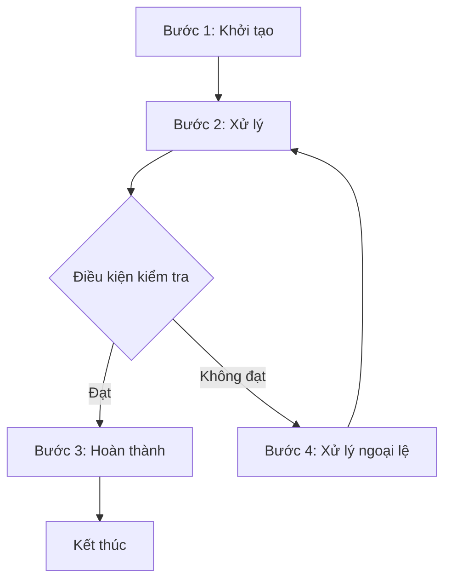
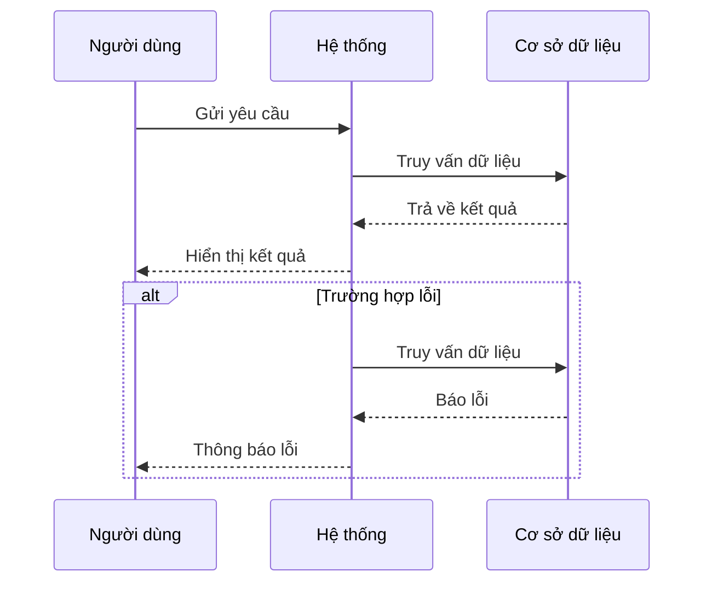
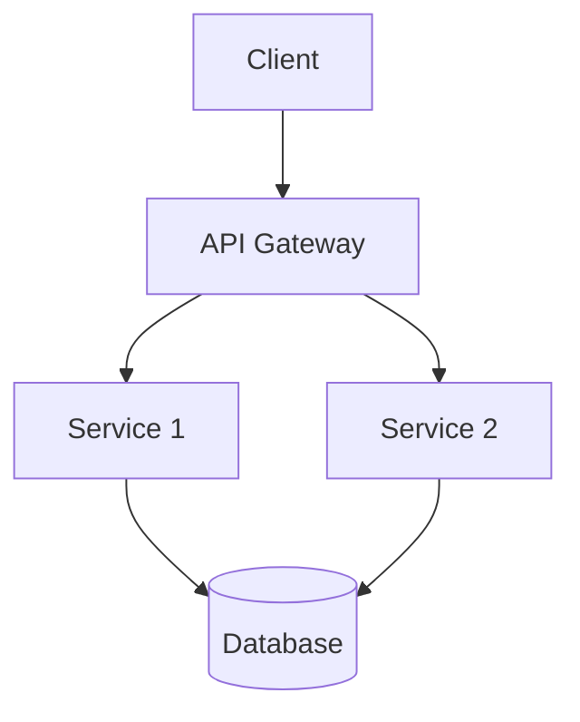
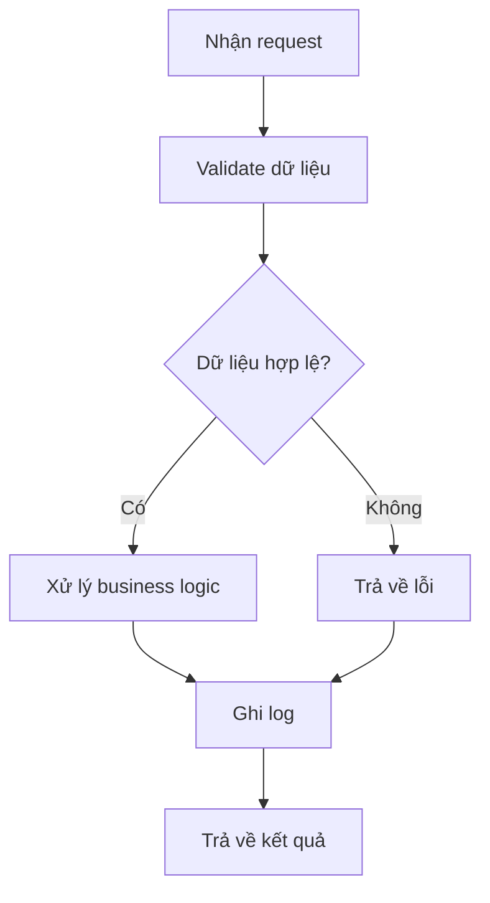
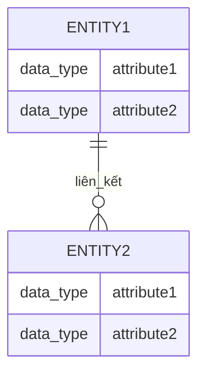

# [MÃ NGHIỆP VỤ]_[Phân Hệ]_[Tên Nghiệp Vụ]

*Phiên bản: 1.0*  
*Người tạo: [Tên Tác Giả]*  
*Ngày tạo: [DD/MM/YYYY]*  
*Cập nhật lần cuối: [DD/MM/YYYY]*  
*Người cập nhật: [Tên Người Cập Nhật]*

## 1. Tổng Quan Nghiệp Vụ

### 1.1. Mô Tả Nghiệp Vụ
*Mô tả chi tiết về nghiệp vụ, bao gồm vai trò, mục đích, và tầm quan trọng của nghiệp vụ này trong toàn bộ hệ thống ERP.*

### 1.2. Phạm Vi Áp Dụng
*Mô tả phạm vi áp dụng của nghiệp vụ, liên quan tới các đơn vị, phòng ban, người dùng.*

### 1.3. Định Nghĩa Thuật Ngữ
| Thuật ngữ | Định nghĩa |
|-----------|------------|
| [Thuật ngữ 1] | [Định nghĩa 1] |
| [Thuật ngữ 2] | [Định nghĩa 2] |
| [Thuật ngữ 3] | [Định nghĩa 3] |

### 1.4. Tài Liệu Liên Quan
*Liệt kê các tài liệu liên quan đến nghiệp vụ này, bao gồm cả tài liệu nghiệp vụ và tài liệu kỹ thuật.*

| STT | Mã tài liệu | Tên tài liệu | Mô tả |
|-----|-------------|--------------|-------|
| 1   | [Mã tài liệu 1] | [Tên tài liệu 1] | [Mô tả tài liệu 1] |
| 2   | [Mã tài liệu 2] | [Tên tài liệu 2] | [Mô tả tài liệu 2] |

## 2. Quy Trình Nghiệp Vụ

### 2.1. Tổng Quan Quy Trình
*Mô tả tổng quan về quy trình nghiệp vụ, bao gồm các bước chính và các bên liên quan.*

### 2.2. Sơ Đồ Quy Trình (Business Flow)

### 2.3. Chi Tiết Các Bước Quy Trình

#### 2.3.1. [Tên Bước 1]
- **Mô tả**: *Mô tả chi tiết về bước này*
- **Đầu vào**: *Các thông tin, dữ liệu đầu vào*
- **Đầu ra**: *Các thông tin, dữ liệu đầu ra*
- **Người thực hiện**: *Vai trò/Người thực hiện bước này*
- **Điều kiện tiên quyết**: *Các điều kiện cần có trước khi thực hiện bước này*
- **Xử lý ngoại lệ**: *Cách xử lý các trường hợp ngoại lệ*

#### 2.3.2. [Tên Bước 2]
- **Mô tả**: *Mô tả chi tiết về bước này*
- **Đầu vào**: *Các thông tin, dữ liệu đầu vào*
- **Đầu ra**: *Các thông tin, dữ liệu đầu ra*
- **Người thực hiện**: *Vai trò/Người thực hiện bước này*
- **Điều kiện tiên quyết**: *Các điều kiện cần có trước khi thực hiện bước này*
- **Xử lý ngoại lệ**: *Cách xử lý các trường hợp ngoại lệ*

### 2.4. Sơ Đồ Tuần Tự (Sequence Diagram)

### 2.5. Luồng Nghiệp Vụ Thay Thế
*Mô tả các luồng nghiệp vụ thay thế hoặc ngoại lệ không được thể hiện trong sơ đồ chính.*

## 3. Yêu Cầu Chức Năng

### 3.1. Danh Sách Chức Năng

| STT | Mã chức năng | Tên chức năng | Mô tả | Độ ưu tiên |
|-----|--------------|---------------|-------|------------|
| 1   | [Mã chức năng 1] | [Tên chức năng 1] | [Mô tả chức năng 1] | [Cao/Trung bình/Thấp] |
| 2   | [Mã chức năng 2] | [Tên chức năng 2] | [Mô tả chức năng 2] | [Cao/Trung bình/Thấp] |

### 3.2. Chi Tiết Chức Năng

#### 3.2.1. [Mã chức năng 1]: [Tên chức năng 1]
- **Mô tả**: *Mô tả chi tiết về chức năng*
- **Đầu vào**: *Các thông tin, dữ liệu đầu vào*
- **Đầu ra**: *Các thông tin, dữ liệu đầu ra*
- **Điều kiện tiên quyết**: *Các điều kiện cần có trước khi thực hiện chức năng*
- **Luồng xử lý chính**:
  1. *Bước 1*
  2. *Bước 2*
  3. *...*
- **Luồng xử lý thay thế/ngoại lệ**:
  1. *Mô tả trường hợp ngoại lệ 1*
  2. *Mô tả trường hợp ngoại lệ 2*
  3. *...*
- **Giao diện liên quan**: *Liệt kê các giao diện liên quan đến chức năng*

#### 3.2.2. [Mã chức năng 2]: [Tên chức năng 2]
- **Mô tả**: *Mô tả chi tiết về chức năng*
- **Đầu vào**: *Các thông tin, dữ liệu đầu vào*
- **Đầu ra**: *Các thông tin, dữ liệu đầu ra*
- **Điều kiện tiên quyết**: *Các điều kiện cần có trước khi thực hiện chức năng*
- **Luồng xử lý chính**:
  1. *Bước 1*
  2. *Bước 2*
  3. *...*
- **Luồng xử lý thay thế/ngoại lệ**:
  1. *Mô tả trường hợp ngoại lệ 1*
  2. *Mô tả trường hợp ngoại lệ 2*
  3. *...*
- **Giao diện liên quan**: *Liệt kê các giao diện liên quan đến chức năng*

## 4. Thiết Kế Kỹ Thuật

### 4.1. Kiến Trúc Hệ Thống

### 4.2. API Endpoints

#### 4.2.1. [Tên API 1]
- **Mô tả**: *Mô tả chi tiết về API*
- **URL**: `[HTTP Method] /api/v1/[path]`

#### 4.2.2. [Tên API 2]
- **Mô tả**: *Mô tả chi tiết về API*
- **URL**: `[HTTP Method] /api/v1/[path]`

### 4.3. Service Logic

#### 4.3.1. [Tên Service 1]
- **Mô tả**: *Mô tả chi tiết về service*
- **Chức năng chính**:
  1. *Chức năng 1*
  2. *Chức năng 2*
  3. *...*
- **Các dependencies**:
  1. *Service dependency 1*
  2. *Service dependency 2*
  3. *...*
- **Sơ đồ luồng xử lý**:

#### 4.3.2. [Tên Service 2]
- **Mô tả**: *Mô tả chi tiết về service*
- **Chức năng chính**:
  1. *Chức năng 1*
  2. *Chức năng 2*
  3. *...*
- **Các dependencies**:
  1. *Service dependency 1*
  2. *Service dependency 2*
  3. *...*
- **Sơ đồ luồng xử lý**:

### 4.4. Mô Hình Dữ Liệu

#### 4.4.1. Entity Relationship Diagram (ERD)

#### 4.4.2. Chi Tiết Bảng Dữ Liệu

##### Bảng: [Tên bảng 1]
- **Mô tả**: *Mô tả chi tiết về bảng dữ liệu*

##### Bảng: [Tên bảng 2]
- **Mô tả**: *Mô tả chi tiết về bảng dữ liệu*

## 5. Kế Hoạch Kiểm Thử

### 5.1. Phạm Vi Kiểm Thử
*Mô tả phạm vi kiểm thử, bao gồm các chức năng, luồng nghiệp vụ cần được kiểm thử.*

### 5.2. Kịch Bản Kiểm Thử
*Mô tả các kịch bản kiểm thử, bao gồm các bước, dữ liệu đầu vào, kết quả mong đợi.*

| STT | Mã kịch bản | Tên kịch bản | Mô tả | Điều kiện tiên quyết | Các bước | Kết quả mong đợi |
|-----|------------|--------------|-------|---------------------|----------|-----------------|
| 1   | [Mã kịch bản 1] | [Tên kịch bản 1] | [Mô tả kịch bản 1] | [Điều kiện tiên quyết] | [Các bước] | [Kết quả mong đợi] |
| 2   | [Mã kịch bản 2] | [Tên kịch bản 2] | [Mô tả kịch bản 2] | [Điều kiện tiên quyết] | [Các bước] | [Kết quả mong đợi] |

## 6. Phụ Lục

### 6.1. Danh Sách Tài Liệu Tham Khảo
*Liệt kê các tài liệu tham khảo, bao gồm sách, bài báo, tài liệu kỹ thuật...*

### 6.2. Danh Mục Thuật Ngữ
*Liệt kê và giải thích các thuật ngữ sử dụng trong tài liệu.*

### 6.3. Lịch Sử Thay Đổi Tài Liệu

| Phiên bản | Ngày | Người thực hiện | Mô tả thay đổi |
|-----------|------|-----------------|---------------|
| 1.0 | [DD/MM/YYYY] | [Tên người thực hiện] | [Mô tả thay đổi] |
| 1.1 | [DD/MM/YYYY] | [Tên người thực hiện] | [Mô tả thay đổi] |