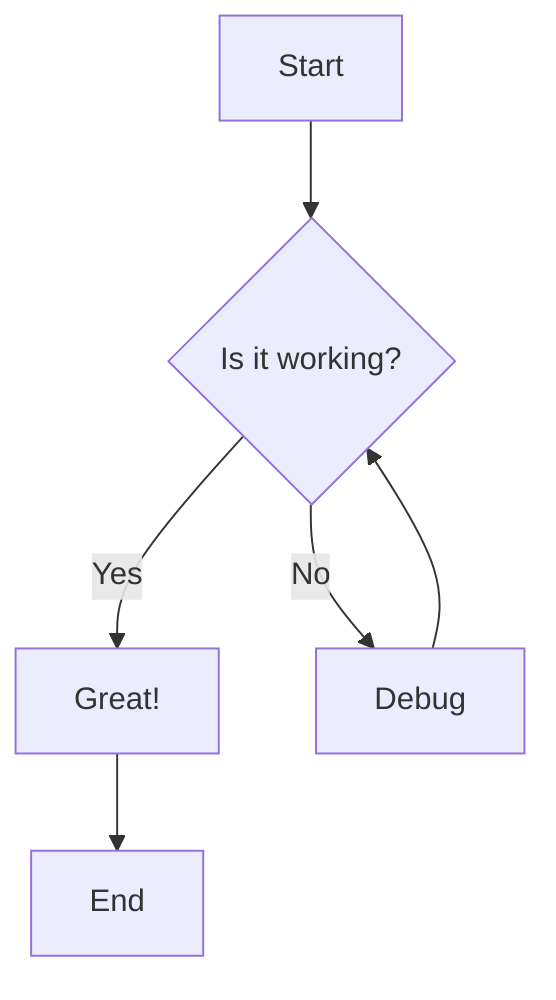

# Getting Started

Welcome to the ERP Documentation! This is a modern, GitBook-style documentation system built with Next.js, featuring Mermaid diagrams, full-text search, and password authentication.

## Features

- 📝 **Markdown Support**: Write documentation in Markdown with MDX extensions
- 🎨 **Mermaid Diagrams**: Create beautiful diagrams with Mermaid syntax
- 🔍 **Full-Text Search**: Quickly find what you're looking for with built-in search
- 🔐 **Password Protection**: Secure your documentation with simple authentication
- 🌙 **Dark Mode**: Toggle between light and dark themes
- 📱 **Responsive Design**: Works perfectly on desktop and mobile devices
- ⚡ **GitHub Pages**: Automatically deployed to GitHub Pages

## Quick Start

### 1. Authentication

The documentation is protected by a password. The default password is `admin123`. You can change this by setting the `NEXT_PUBLIC_DOCS_PASSWORD` environment variable.

### 2. Navigation

Use the sidebar to navigate through different sections of the documentation. The navigation is automatically generated from your markdown files.

### 3. Search

Press `Cmd+K` (or `Ctrl+K` on Windows/Linux) to open the search dialog, or click the search button in the header.

## Writing Documentation

### Basic Markdown

You can use all standard Markdown features:

- **Bold text**
- *Italic text*
- `Inline code`
- [Links](https://example.com)

### Code Blocks

```javascript
// JavaScript example
function greet(name) {
  return `Hello, ${name}!`;
}

console.log(greet('World'));
```

```python
# Python example
def greet(name):
    return f"Hello, {name}!"

print(greet("World"))
```

### Mermaid Diagrams

Create beautiful diagrams using Mermaid syntax:



### Tables

| Feature | Status | Notes |
|---------|--------|-------|
| Markdown | ✅ | Full support |
| Mermaid | ✅ | Auto-rendering |
| Search | ✅ | Real-time |
| Auth | ✅ | Password-based |

### Frontmatter

Each markdown file should include frontmatter with metadata:

```yaml
---
title: Page Title
description: Brief description of the page
order: 1
date: 2024-05-30
author: Your Name
tags: [tag1, tag2]
---
```

## File Organization

Organize your documentation files in the `docs/` directory:

```
docs/
├── getting-started.md
├── user-guide/
│   ├── installation.md
│   └── configuration.md
├── api/
│   ├── overview.md
│   └── endpoints.md
└── troubleshooting.md
```

The navigation will be automatically generated based on your file structure.

## Deployment

This documentation system is designed to work with GitHub Pages. Simply push your changes to the repository, and GitHub Actions will automatically build and deploy your documentation.

## Next Steps

- Explore the [User Guide](/user-guide/installation) to learn more
- Check out the [API Documentation](/api/overview) for technical details
- Visit [Troubleshooting](/troubleshooting) if you encounter issues
